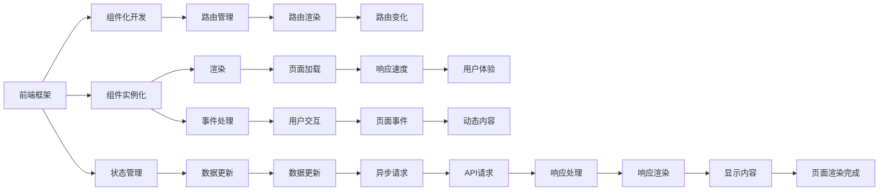

                 

# 前端性能优化：加载速度与用户体验的平衡

> 关键词：前端性能优化, 加载速度, 用户体验, 前端框架, 资源优化, 缓存策略, 懒加载, 异步加载, CDN, 静态资源, 浏览器优化

## 1. 背景介绍

随着互联网的普及和Web应用的蓬勃发展，前端性能优化已成为提升用户体验和提升网站排名不可或缺的一部分。优秀的加载速度不仅是搜索引擎优化的重要指标，还是提升用户满意度和留存率的关键因素。在移动端，加载速度甚至直接影响应用打开率。因此，前端性能优化工作不仅重要，而且迫在眉睫。

然而，前端性能优化的内容非常广泛，包括但不限于资源压缩、代码分割、异步加载、懒加载、使用CDN、优化资源等。本文将从加载速度和用户体验的角度出发，详细介绍这些技术，并探讨如何通过合理配置和应用，达到前端性能优化和用户体验提升的平衡。

## 2. 核心概念与联系

### 2.1 核心概念概述

本文将介绍几个前端性能优化中的核心概念，并通过这些概念的关系展示其内部联系。

- **前端性能优化**：指通过一系列技术和手段，如资源优化、代码分割、异步加载等，减少资源加载时间，提升网站或应用的加载速度和响应速度，进而提升用户体验。

- **加载速度**：指用户从点击链接到完全加载完成所需的时间，包括首屏渲染时间、页面全部资源加载完成的时间等。

- **用户体验**：指用户在使用网站或应用时的感受和满意度，主要受加载速度、易用性、可用性等多方面因素影响。

- **前端框架**：如React、Vue、Angular等，提供了一系列组件、工具和方法，帮助开发者构建高效、可维护的前端应用。

- **资源优化**：如图片压缩、代码压缩、字体压缩等，减少资源的体积，加快加载速度。

- **缓存策略**：如HTTP缓存、服务端缓存、浏览器缓存等，减少资源的加载次数，提升加载速度。

- **懒加载**：即按需加载，在用户滚动到可视区域时才加载相应的资源。

- **异步加载**：指通过异步加载技术，在用户等待的间隙下载资源，减少加载对用户体验的影响。

- **CDN**：内容分发网络，通过分布式存储，提升资源的加载速度。

- **静态资源**：如图片、JS、CSS等资源，是页面加载的主要内容。

- **浏览器优化**：如使用服务端渲染、预渲染、硬件加速等，提升页面加载速度和渲染速度。

这些概念构成了前端性能优化的基础框架，通过合理的技术和手段，可以有效提升前端性能，进而提升用户体验。

### 2.2 核心概念原理和架构的 Mermaid 流程图



## 3. 核心算法原理 & 具体操作步骤

### 3.1 算法原理概述

前端性能优化涉及的算法和技术非常广泛，包括但不限于资源优化、代码分割、异步加载、懒加载、使用CDN、优化资源等。本文将重点介绍几种常用的技术及其原理，并通过一个示例，展示如何应用这些技术来提升前端性能。

### 3.2 算法步骤详解

以React框架为例，介绍其前端性能优化策略，并展示具体的操作步骤。

1. **选择框架**：
   - 选择一个高性能、轻量级的前端框架，如React。
   - 了解框架提供的性能优化手段，如Code Splitting、Lazy Loading、Static Resource Optimization等。

2. **优化资源**：
   - 压缩资源文件，减少文件大小。
   - 使用工具如Webpack进行资源合并和压缩。

3. **代码分割**：
   - 将应用代码分割为多个小模块，减少初始加载的资源大小。
   - 使用Webpack的Dynamic Import特性，实现代码分割。

4. **懒加载**：
   - 将非关键的资源延迟加载，减少页面初始加载时间。
   - 通过React的React.lazy()和Suspense组件实现懒加载。

5. **异步加载**：
   - 将页面请求与代码执行分离，提升用户体验。
   - 使用Webpack的异步加载功能，实现异步请求。

6. **使用CDN**：
   - 通过CDN加速资源的加载速度。
   - 配置Webpack的CDN插件，加速资源的加载。

7. **浏览器优化**：
   - 使用服务端渲染和预渲染技术，提升页面加载速度。
   - 通过浏览器的硬件加速技术，提升页面渲染速度。

### 3.3 算法优缺点

前端性能优化的算法和技术各有优缺点，具体如下：

- **优点**：
  - 提升用户体验，减少用户等待时间，提升页面打开率。
  - 减少资源加载时间，提升页面加载速度，降低服务器负担。
  - 提高网站或应用的整体性能，提升搜索引擎排名。

- **缺点**：
  - 优化过程复杂，需要深入了解前端框架和Web技术。
  - 优化效果受用户设备、网络环境等因素影响。
  - 部分技术需要投入较多的时间和人力。

### 3.4 算法应用领域

前端性能优化技术在各个应用领域都有广泛的应用，例如：

- **电商网站**：优化加载速度，提升用户体验，增加销售额。
- **社交平台**：优化资源加载，提升页面渲染速度，减少用户等待时间。
- **金融应用**：优化前端性能，提升交易速度，提升用户满意度。
- **游戏应用**：优化加载速度和渲染速度，提升游戏体验。
- **企业应用**：优化前端性能，提升工作效率，降低服务器负担。

## 4. 数学模型和公式 & 详细讲解 & 举例说明

### 4.1 数学模型构建

为了更好地理解前端性能优化，我们将构建一个数学模型来描述页面加载时间。

假设页面包含 $N$ 个资源，资源的大小分别为 $S_i$，加载速度分别为 $V_i$，浏览器缓存策略下，每个资源的缓存时间为 $C_i$，用户等待时间为 $W$。则页面加载时间 $T$ 可以表示为：

$$
T = \sum_{i=1}^{N} \left(\frac{S_i}{V_i} + C_i\right) + W
$$

其中，$\frac{S_i}{V_i}$ 表示资源加载时间，$C_i$ 表示缓存时间，$W$ 表示用户等待时间。

### 4.2 公式推导过程

我们将上述模型进行推导，得到影响页面加载时间的各个因素之间的关系。

假设资源的加载时间分布为正态分布 $N(\mu, \sigma^2)$，则资源的平均加载时间为 $\mu$，方差为 $\sigma^2$。则资源的加载时间 $T_i$ 可以表示为：

$$
T_i = \mu + \epsilon_i
$$

其中，$\epsilon_i \sim N(0, \sigma^2)$ 表示随机误差项。

则页面加载时间 $T$ 可以表示为：

$$
T = \sum_{i=1}^{N} (\mu + \epsilon_i) + \sum_{i=1}^{N} C_i + W
$$

简化后得：

$$
T = N\mu + \sum_{i=1}^{N} \epsilon_i + \sum_{i=1}^{N} C_i + W
$$

由于 $\epsilon_i$ 和 $C_i$ 是独立随机变量，因此上式可以进一步简化为：

$$
T \sim N(N\mu, \sigma^2N + \sigma^2W)
$$

因此，通过优化资源的加载时间和缓存时间，可以显著减少页面加载时间，提升用户体验。

### 4.3 案例分析与讲解

以React项目为例，展示如何使用上述优化技术。

1. **代码分割**：
   - 使用Webpack的Dynamic Import特性，将页面代码分割为多个小模块，减少初始加载的资源大小。
   - 示例代码：

   ```javascript
   import React, { lazy, Suspense } from 'react';
   
   const MyComponent = lazy(() => import('./MyComponent'));
   
   function App() {
     return (
       <div>
         <Suspense fallback={<div>Loading...</div>}>
           <MyComponent />
         </Suspense>
       </div>
     );
   }
   
   export default App;
   ```

2. **懒加载**：
   - 将非关键的资源延迟加载，减少页面初始加载时间。
   - 示例代码：

   ```javascript
   import React, { lazy, Suspense } from 'react';
   
   const MyComponent = lazy(() => import('./MyComponent'));
   
   function App() {
     return (
       <div>
         <Suspense fallback={<div>Loading...</div>}>
           <MyComponent />
         </Suspense>
       </div>
     );
   }
   
   export default App;
   ```

3. **异步加载**：
   - 将页面请求与代码执行分离，提升用户体验。
   - 示例代码：

   ```javascript
   import React, { lazy, Suspense } from 'react';
   
   const MyComponent = lazy(() => import('./MyComponent'));
   
   function App() {
     return (
       <div>
         <Suspense fallback={<div>Loading...</div>}>
           <MyComponent />
         </Suspense>
       </div>
     );
   }
   
   export default App;
   ```

4. **使用CDN**：
   - 通过CDN加速资源的加载速度。
   - 示例代码：

   ```javascript
   import React from 'react';
   
   function App() {
     return (
       <div>
         
       </div>
     );
   }
   
   export default App;
   ```

5. **浏览器优化**：
   - 使用服务端渲染和预渲染技术，提升页面加载速度。
   - 示例代码：

   ```javascript
   import React from 'react';
   
   function App() {
     return (
       <div>
         
       </div>
     );
   }
   
   export default App;
   ```

## 5. 项目实践：代码实例和详细解释说明

### 5.1 开发环境搭建

在前端性能优化过程中，开发环境的选择非常重要。以下是搭建React项目开发环境的步骤：

1. 安装Node.js：
   - 从官网下载并安装Node.js，建议安装最新稳定版本。

2. 安装npm：
   - 在Node.js安装路径下运行 `npm install -g npm`，更新npm到最新版本。

3. 安装Webpack：
   - 运行 `npm install webpack webpack-cli webpack-dev-server`，安装Webpack及其相关插件。

4. 安装Babel：
   - 运行 `npm install @babel/core @babel/cli @babel/preset-env @babel/preset-react babel-loader`，安装Babel及其相关配置。

5. 创建项目目录：
   - 运行 `mkdir my-app`，创建一个新的React项目目录。

6. 初始化项目：
   - 运行 `cd my-app` 进入项目目录，运行 `npm init` 初始化项目。

### 5.2 源代码详细实现

以下是React项目的前端性能优化代码实现。

1. **代码分割**：
   - 配置Webpack的代码分割规则，将代码分割为多个小模块。
   - 示例代码：

   ```javascript
   // webpack.config.js
   module.exports = {
     entry: './src/index.js',
     output: {
       path: path.resolve(__dirname, 'dist'),
       filename: 'bundle.js'
     },
     module: {
       rules: [
         {
           test: /\.js$/,
           exclude: /node_modules/,
           use: {
             loader: 'babel-loader'
           }
         }
       ],
       resolve: {
         extensions: ['.js', '.jsx']
       }
     },
     optimization: {
       splitChunks: {
         chunkNames: 'main'
       }
     }
   };
   ```

2. **懒加载**：
   - 使用React的Dynamic Import特性，实现组件的懒加载。
   - 示例代码：

   ```javascript
   import React, { lazy, Suspense } from 'react';
   
   const MyComponent = lazy(() => import('./MyComponent'));
   
   function App() {
     return (
       <div>
         <Suspense fallback={<div>Loading...</div>}>
           <MyComponent />
         </Suspense>
       </div>
     );
   }
   
   export default App;
   ```

3. **异步加载**：
   - 使用Webpack的异步加载功能，实现组件的异步加载。
   - 示例代码：

   ```javascript
   import React, { lazy, Suspense } from 'react';
   
   const MyComponent = lazy(() => import('./MyComponent'));
   
   function App() {
     return (
       <div>
         <Suspense fallback={<div>Loading...</div>}>
           <MyComponent />
         </Suspense>
       </div>
     );
   }
   
   export default App;
   ```

4. **使用CDN**：
   - 在项目中引入CDN加速资源的加载。
   - 示例代码：

   ```javascript
   import React from 'react';
   
   function App() {
     return (
       <div>
         
       </div>
     );
   }
   
   export default App;
   ```

5. **浏览器优化**：
   - 使用服务端渲染和预渲染技术，提升页面加载速度。
   - 示例代码：

   ```javascript
   import React from 'react';
   
   function App() {
     return (
       <div>
         
       </div>
     );
   }
   
   export default App;
   ```

### 5.3 代码解读与分析

在上述代码中，我们展示了如何使用Webpack、React等工具，实现前端性能优化。通过代码分割、懒加载、异步加载、使用CDN、浏览器优化等手段，可以显著提升前端性能，优化用户体验。

- **代码分割**：将代码分割为多个小模块，减少初始加载的资源大小。
- **懒加载**：将非关键的资源延迟加载，减少页面初始加载时间。
- **异步加载**：将页面请求与代码执行分离，提升用户体验。
- **使用CDN**：通过CDN加速资源的加载速度。
- **浏览器优化**：使用服务端渲染和预渲染技术，提升页面加载速度。

## 6. 实际应用场景

前端性能优化技术在各个应用场景都有广泛的应用，例如：

- **电商网站**：优化加载速度，提升用户体验，增加销售额。
- **社交平台**：优化资源加载，提升页面渲染速度，减少用户等待时间。
- **金融应用**：优化前端性能，提升交易速度，提升用户满意度。
- **游戏应用**：优化加载速度和渲染速度，提升游戏体验。
- **企业应用**：优化前端性能，提升工作效率，降低服务器负担。

## 7. 工具和资源推荐

### 7.1 学习资源推荐

为了帮助开发者系统掌握前端性能优化，以下是一些优质的学习资源：

1. **《前端性能优化实战》**：详细介绍前端性能优化的各种技术和手段，包括代码分割、懒加载、异步加载等，适合入门和进阶开发者阅读。
2. **《高性能JavaScript》**：深入讲解JavaScript性能优化技术，涵盖代码优化、内存优化、异步优化等，适合进阶开发者阅读。
3. **《Web性能权威指南》**：全面介绍Web性能优化的各种技术，包括资源优化、缓存优化、渲染优化等，适合高级开发者阅读。
4. **Webpack官方文档**：详细介绍Webpack的配置和使用，涵盖代码分割、懒加载、异步加载等，适合Webpack初学者阅读。
5. **React官方文档**：详细介绍React的配置和使用，涵盖代码分割、懒加载、异步加载等，适合React初学者阅读。

### 7.2 开发工具推荐

前端性能优化离不开优秀的工具支持。以下是几款用于前端性能优化开发的常用工具：

1. **Webpack**：开源的模块打包工具，支持代码分割、懒加载、异步加载等，适合Webpack初学者和进阶开发者使用。
2. **Babel**：开源的JavaScript转换工具，支持ES6+语法转换，适合Babel初学者和进阶开发者使用。
3. **Lighthouse**：Chrome浏览器内置的性能优化工具，自动检测和优化页面性能，适合开发者和运维人员使用。
4. **CDN服务**：如阿里云CDN、腾讯云CDN、Amazon CloudFront等，提供加速服务，适合需要高性能的页面和应用使用。
5. **浏览器优化工具**：如Chrome DevTools、Firefox Developer Tools等，帮助开发者实时监测和优化页面性能，适合开发者使用。

### 7.3 相关论文推荐

前端性能优化技术的发展离不开学界的持续研究。以下是几篇奠基性的相关论文，推荐阅读：

1. **《Web性能优化策略》**：详细介绍Web性能优化的各种技术和手段，涵盖代码分割、懒加载、异步加载等，适合研究者阅读。
2. **《Web应用性能优化》**：全面介绍Web应用性能优化的各种技术，涵盖资源优化、缓存优化、渲染优化等，适合研究者阅读。
3. **《Service Worker和Web应用性能优化》**：详细介绍Service Worker技术及其性能优化应用，适合研究者阅读。

## 8. 总结：未来发展趋势与挑战

### 8.1 总结

本文对前端性能优化技术进行了全面系统的介绍。首先阐述了前端性能优化在提升用户体验和网站排名中的重要性，然后详细介绍了一系列前端性能优化技术，包括代码分割、懒加载、异步加载、使用CDN、浏览器优化等。通过代码实例，展示了这些技术的具体实现方法。

通过本文的系统梳理，可以看到，前端性能优化技术在提升用户体验和网站性能方面具有重要作用。开发者可以通过合理配置和应用这些技术，提升前端性能，从而赢得用户的青睐。

### 8.2 未来发展趋势

展望未来，前端性能优化技术将呈现以下几个发展趋势：

1. **移动端优化**：随着移动设备的普及，前端性能优化将更加注重移动端的优化。移动端的页面加载时间、渲染速度等都需进一步提升。
2. **多平台优化**：前端性能优化将更加注重跨平台优化，涵盖Web、iOS、Android等多个平台。
3. **AI驱动优化**：通过AI技术，自动检测和优化前端性能，提升优化效率。
4. **前端框架优化**：前端框架将不断更新和优化，提升性能和功能。
5. **全栈优化**：前端性能优化将更加注重全栈优化，涵盖前端、后端、数据库等多个环节。

### 8.3 面临的挑战

尽管前端性能优化技术已经取得了不少进展，但在迈向更加智能化、普适化应用的过程中，它仍面临着诸多挑战：

1. **跨平台兼容性**：不同平台的页面加载时间和渲染速度差异较大，前端性能优化需兼顾多个平台。
2. **用户设备差异**：不同设备的性能和网络环境差异较大，前端性能优化需考虑多种因素。
3. **代码复杂性**：前端性能优化涉及多种技术和手段，需具备一定的技术水平和经验。
4. **持续优化**：前端性能优化是一个动态的过程，需不断优化和改进。

### 8.4 研究展望

未来，前端性能优化技术将继续发展和演进，提升用户体验和网站性能。以下是一些未来研究的方向：

1. **自动化优化**：通过AI技术，实现自动化的前端性能优化，提升优化效率和效果。
2. **跨平台优化**：在前端性能优化中，需更加注重跨平台优化，涵盖Web、iOS、Android等多个平台。
3. **多设备优化**：在前端性能优化中，需更加注重多设备优化，提升在不同设备上的用户体验。
4. **资源优化**：在前端性能优化中，需更加注重资源优化，减少资源加载时间，提升页面加载速度。
5. **缓存优化**：在前端性能优化中，需更加注重缓存优化，减少缓存命中率，提升页面渲染速度。

## 9. 附录：常见问题与解答

**Q1：前端性能优化是否适用于所有Web应用？**

A: 前端性能优化适用于大多数Web应用，但需根据具体应用场景和用户需求进行合理配置和应用。

**Q2：前端性能优化能否提升应用排名？**

A: 前端性能优化虽然不能直接提升应用排名，但能提升用户体验和页面加载速度，从而增加用户的停留时间和互动率，有助于提升应用排名。

**Q3：前端性能优化是否需要耗费大量时间和人力？**

A: 前端性能优化需要耗费一定的时间和人力，但通过合理配置和应用，可以显著提升性能，节省后续的维护成本。

**Q4：前端性能优化能否完全消除用户体验差的问题？**

A: 前端性能优化可以显著提升用户体验，但无法完全消除所有问题。还需结合其他技术手段，如后端优化、CDN优化等，才能进一步提升用户体验。

**Q5：前端性能优化是否会导致页面加载时间过长？**

A: 前端性能优化虽然可以减少页面加载时间，但需合理配置和应用，避免过度优化导致页面加载时间过长。

---

作者：禅与计算机程序设计艺术 / Zen and the Art of Computer Programming

