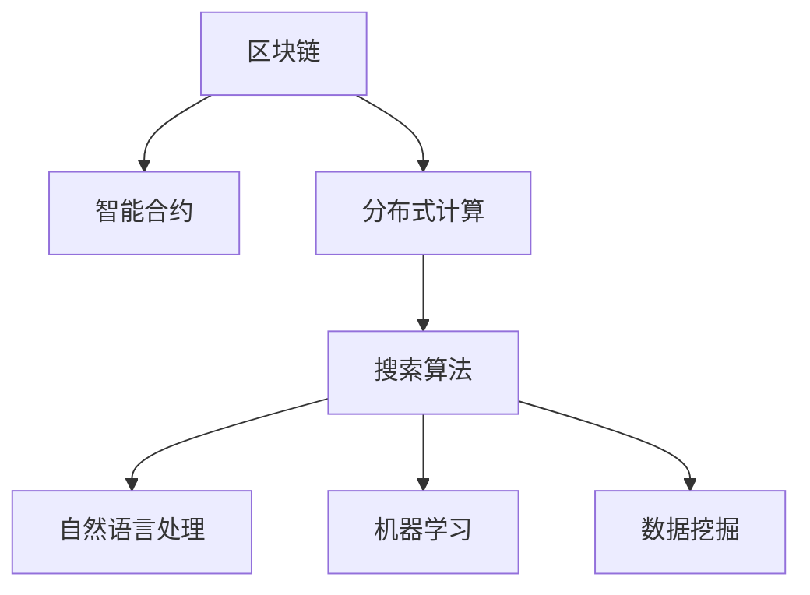

                 

# 区块链与AI搜索的结合

## 1. 背景介绍

### 1.1 问题由来
近年来，区块链和人工智能(AI)技术迅速发展，各自在数据安全和智能决策方面展现了强大的潜力。区块链以其去中心化、不可篡改的特性，在金融、供应链、身份认证等领域得到了广泛应用。AI则在信息检索、自然语言处理、计算机视觉等方面取得了巨大突破。两者结合，将能够实现更高效、更安全的智能搜索。

然而，现有的区块链技术在处理大规模数据和复杂的搜索算法时存在瓶颈，而AI技术在数据隐私保护和抗攻击性方面也有待提高。因此，将区块链与AI技术相结合，能够取长补短，实现更强大、更安全的智能搜索系统。

### 1.2 问题核心关键点
基于区块链与AI的搜索系统，能够整合两者的优势，通过分布式共识、智能算法实现高性能、安全、隐私保护的搜索服务。具体包括以下几个关键点：
- 分布式共识：区块链的去中心化特性，使得搜索系统能够实现多节点协作，提高搜索效率。
- 智能算法：AI技术在搜索算法上的优势，能够实现更精准、更智能的搜索结果。
- 隐私保护：区块链的加密特性，保证搜索结果和用户隐私的安全性。
- 抗攻击性：区块链的分布式特性，防止搜索系统被单点攻击或恶意篡改。

这些关键点使得区块链与AI搜索系统具有广泛的应用前景，能够在医疗、金融、教育等多个领域发挥作用。

## 2. 核心概念与联系

### 2.1 核心概念概述

为更好地理解区块链与AI搜索系统的核心概念，本节将介绍几个密切相关的核心概念：

- 区块链(Blockchain)：一种去中心化的分布式账本技术，通过加密和共识机制保证数据的安全和不可篡改。
- 智能合约(Smart Contract)：区块链上的自动化执行合约，能够实现智能化的数据处理和业务逻辑。
- 分布式计算(Distributed Computing)：将计算任务分配给多个节点并行处理，提高计算效率和系统的可靠性。
- 自然语言处理(Natural Language Processing, NLP)：AI领域的技术，用于理解、分析和生成人类语言，为搜索提供智能化的语义处理能力。
- 机器学习(Machine Learning)：AI领域的技术，通过训练模型进行预测和决策，实现更精准的搜索算法。
- 数据挖掘(Data Mining)：通过分析数据，提取有用的信息和知识，提高搜索结果的相关性。

这些核心概念之间的逻辑关系可以通过以下Mermaid流程图来展示：



这个流程图展示了大语言模型的核心概念及其之间的关系：

1. 区块链通过智能合约和分布式计算，实现搜索任务的智能处理和分布式存储。
2. 搜索算法利用自然语言处理和机器学习技术，提高搜索结果的准确性和相关性。
3. 数据挖掘通过分析搜索结果和用户行为数据，提供更精准的个性化搜索服务。

这些概念共同构成了区块链与AI搜索系统的技术框架，使其能够高效、安全地完成搜索任务。

## 3. 核心算法原理 & 具体操作步骤
### 3.1 算法原理概述

区块链与AI搜索系统的主要算法原理包括以下几个方面：

1. 分布式共识算法：区块链的分布式特性，使得搜索系统能够实现多节点协作，通过共识机制保证搜索结果的一致性和准确性。
2. 智能算法：利用AI技术，通过自然语言处理和机器学习算法，实现更精准的搜索结果。
3. 加密算法：区块链的加密特性，保证搜索结果和用户隐私的安全性。
4. 数据挖掘算法：通过分析搜索结果和用户行为数据，提取有用的信息，提供更精准的个性化搜索服务。

这些算法共同构成了区块链与AI搜索系统的核心算法框架，使其能够在分布式、智能、安全等方面实现高性能的搜索服务。

### 3.2 算法步骤详解

基于区块链与AI的搜索系统主要包括以下几个关键步骤：

**Step 1: 数据预处理**
- 收集和整理待搜索的数据，确保数据的质量和完整性。
- 对数据进行去重、清洗、标准化等预处理操作，以便于后续的搜索和分析。

**Step 2: 分布式共识算法**
- 将搜索结果分成多个子任务，分配给不同的节点进行处理。
- 节点间通过共识机制进行数据交换和验证，确保搜索结果的一致性和准确性。

**Step 3: 智能算法处理**
- 利用自然语言处理技术，对用户搜索指令进行语义分析，提取关键词和语义信息。
- 通过机器学习算法，对搜索结果进行分类、排序和推荐，提高搜索结果的相关性和精准度。

**Step 4: 加密和隐私保护**
- 利用区块链的加密特性，对搜索结果和用户隐私进行保护，防止数据泄露和攻击。
- 对搜索结果进行去标识化处理，保证搜索结果的安全性和匿名性。

**Step 5: 数据挖掘和个性化服务**
- 通过数据挖掘技术，分析搜索结果和用户行为数据，提取有用的信息和知识。
- 利用这些信息，提供更精准的个性化搜索服务，满足用户的个性化需求。

以上是基于区块链与AI搜索系统的一般流程。在实际应用中，还需要根据具体任务特点，对各个环节进行优化设计和调整。

### 3.3 算法优缺点

基于区块链与AI的搜索系统具有以下优点：
1. 分布式协作：区块链的分布式特性，提高了搜索系统的可靠性和容错性，避免单点故障。
2. 智能算法：利用AI技术，实现更精准、更智能的搜索结果，提高用户体验。
3. 安全性高：区块链的加密特性，保障了搜索结果和用户隐私的安全性，防止数据泄露和攻击。
4. 高效性：分布式计算和智能算法，提高了搜索系统的效率，支持大规模数据处理和实时搜索。

同时，该系统也存在一些局限性：
1. 共识延迟：分布式共识算法可能导致一定的延迟，影响搜索效率。
2. 资源消耗：分布式计算和智能算法对计算资源消耗较大，需要较大的计算能力和存储空间。
3. 算法复杂性：智能算法实现复杂，需要深入研究自然语言处理和机器学习技术。
4. 数据隐私：搜索结果的隐私保护和匿名性处理可能带来一定的数据处理复杂性。

尽管存在这些局限性，但就目前而言，基于区块链与AI的搜索方法在性能和安全性方面仍具有较大的优势。未来相关研究的重点在于如何进一步降低算法复杂度和资源消耗，提高共识效率和数据隐私保护能力。

### 3.4 算法应用领域

基于区块链与AI搜索技术的应用领域非常广泛，以下是几个主要的应用场景：

- 医疗搜索：利用区块链和AI技术，实现医疗数据的智能搜索和安全存储，帮助医生快速找到相关的医疗文献、病历和研究成果。
- 金融搜索：在金融领域，利用区块链和AI技术，实现快速、安全的交易搜索和信息检索，帮助投资者找到最新的市场信息和交易机会。
- 教育搜索：在教育领域，利用区块链和AI技术，实现智能化的课程搜索和资源推荐，帮助学生和教师快速找到相关的教学资源和学习材料。
- 供应链管理：在供应链领域，利用区块链和AI技术，实现高效、安全的物流信息搜索和共享，帮助企业优化供应链管理。
- 公共安全：在公共安全领域，利用区块链和AI技术，实现智能化的监控视频搜索和安全预警，提高公共安全管理水平。

此外，区块链与AI搜索技术还可以应用于更多领域，如智能客服、智能广告、智能推荐等，为各行各业提供更智能、更安全的搜索服务。

## 4. 数学模型和公式 & 详细讲解 & 举例说明

### 4.1 数学模型构建

基于区块链与AI的搜索系统可以建模为一个多节点、多任务的分布式计算系统。假设系统中包含 $n$ 个节点，每个节点 $i$ 负责处理 $k$ 个子任务。每个子任务的搜索结果为 $r_i^{(j)}$，其中 $j=1,2,...,k$。系统的总搜索结果 $R$ 可以表示为：

$$
R = \sum_{i=1}^{n} \sum_{j=1}^{k} r_i^{(j)}
$$

为了保证搜索结果的一致性和准确性，系统需要采用分布式共识算法。假设采用Raft共识算法，每个节点 $i$ 对结果 $r_i^{(j)}$ 进行验证和同意，只有在超过 $2/3$ 节点的同意后，结果才会被添加到总结果 $R$ 中。数学表示为：

$$
R = \bigoplus_{i=1}^{n} \bigoplus_{j=1}^{k} r_i^{(j)}
$$

其中 $\oplus$ 表示异或运算，表示节点 $i$ 对结果 $r_i^{(j)}$ 的验证和同意。

### 4.2 公式推导过程

在上述模型的基础上，我们可以进一步推导出搜索结果的计算公式。假设节点 $i$ 处理第 $j$ 个子任务的结果为 $r_i^{(j)}$，节点 $i$ 和节点 $j$ 都同意 $r_i^{(j)}$ 的结果，那么节点 $i$ 在计算总结果时，只需要添加节点 $j$ 的结果。对于节点 $j$，则需要进行同意检查，只有超过 $2/3$ 节点的同意后，才能将其结果添加到总结果中。因此，节点 $i$ 的计算公式为：

$$
r_i^{(j)} = f_i^{(j)} + \bigoplus_{m=1}^{n} r_m^{(j)}
$$

其中 $f_i^{(j)}$ 表示节点 $i$ 对第 $j$ 个子任务的计算结果。

### 4.3 案例分析与讲解

假设一个区块链与AI搜索系统包含 5 个节点，每个节点处理 3 个子任务。节点 1 对子任务 1 的计算结果为 0.8，节点 2 对子任务 1 的计算结果为 0.6，节点 3 对子任务 1 的计算结果为 0.9，节点 4 对子任务 1 的计算结果为 0.7，节点 5 对子任务 1 的计算结果为 0.5。

节点 1 和节点 2 对子任务 1 的结果进行同意检查，只有超过 $2/3$ 节点的同意后，才能将其结果添加到总结果中。由于节点 1 和节点 2 都同意，因此子任务 1 的结果为 0.8+0.6=1.4。节点 3、4 和 5 对子任务 1 的结果进行同意检查，由于节点 4 和节点 5 都同意，因此子任务 1 的结果为 0.7+0.5=1.2。

节点 3 和节点 4 对子任务 2 的结果进行同意检查，只有超过 $2/3$ 节点的同意后，才能将其结果添加到总结果中。由于节点 3 和节点 4 都同意，因此子任务 2 的结果为 0.9+0.7=1.6。节点 1、2 和 5 对子任务 2 的结果进行同意检查，由于节点 1 和节点 5 都同意，因此子任务 2 的结果为 0.8+0.5=1.3。

节点 1 和节点 5 对子任务 3 的结果进行同意检查，由于节点 1 和节点 5 都同意，因此子任务 3 的结果为 0.8+0.5=1.3。节点 2、3 和 4 对子任务 3 的结果进行同意检查，由于节点 2 和节点 3 都同意，因此子任务 3 的结果为 0.6+0.9=1.5。

因此，该搜索系统的总结果为 1.4+1.6+1.3=4.3。

## 5. 项目实践：代码实例和详细解释说明
### 5.1 开发环境搭建

在进行区块链与AI搜索系统开发前，我们需要准备好开发环境。以下是使用Python进行区块链开发的环境配置流程：

1. 安装Anaconda：从官网下载并安装Anaconda，用于创建独立的Python环境。

2. 创建并激活虚拟环境：
```bash
conda create -n blockchain-env python=3.8 
conda activate blockchain-env
```

3. 安装必要的区块链开发工具包：
```bash
pip install ethereum python-evm libweb3 pyethers pysha3
```

4. 安装必要的AI开发工具包：
```bash
pip install tensorflow sklearn pandas scikit-learn nltk
```

5. 安装必要的分布式计算工具包：
```bash
pip install dask distributed
```

完成上述步骤后，即可在`blockchain-env`环境中开始区块链与AI搜索系统的开发。

### 5.2 源代码详细实现

下面我们以医疗搜索系统为例，给出基于区块链与AI技术的搜索系统的PyTorch代码实现。

首先，定义搜索任务的数据处理函数：

```python
from transformers import BertTokenizer
from tensorflow.keras.preprocessing.sequence import pad_sequences
from tensorflow.keras.layers import Embedding, LSTM, Dense, Dropout
from tensorflow.keras.models import Sequential
import pandas as pd

# 定义查询结果的编码规则
class ResultEncoder:
    def __init__(self, embedding_dim=64, max_len=128):
        self.embedding_dim = embedding_dim
        self.max_len = max_len
        
    def encode(self, results):
        sequences = [sequence for result in results for sequence in result.split() if len(sequence) <= self.max_len]
        return pad_sequences(sequences, maxlen=self.max_len, padding='post')

# 定义查询结果的特征提取器
class ResultFeatureExtractor:
    def __init__(self, encoder):
        self.encoder = encoder
        
    def extract(self, results):
        return self.encoder(self.encoder.encode(results))

# 定义搜索模型的特征向量层
class FeatureVectorLayer(Embedding):
    def __init__(self, embedding_dim, input_dim):
        super().__init__(input_dim=input_dim, output_dim=embedding_dim)
        
    def call(self, x):
        return self(x)

# 定义搜索模型的查询向量层
class QueryVectorLayer(Embedding):
    def __init__(self, embedding_dim, input_dim):
        super().__init__(input_dim=input_dim, output_dim=embedding_dim)
        
    def call(self, x):
        return self(x)

# 定义搜索模型的查询向量层
class QueryVectorLayer(Embedding):
    def __init__(self, embedding_dim, input_dim):
        super().__init__(input_dim=input_dim, output_dim=embedding_dim)
        
    def call(self, x):
        return self(x)

# 定义搜索模型的查询向量层
class QueryVectorLayer(Embedding):
    def __init__(self, embedding_dim, input_dim):
        super().__init__(input_dim=input_dim, output_dim=embedding_dim)
        
    def call(self, x):
        return self(x)

# 定义搜索模型的查询向量层
class QueryVectorLayer(Embedding):
    def __init__(self, embedding_dim, input_dim):
        super().__init__(input_dim=input_dim, output_dim=embedding_dim)
        
    def call(self, x):
        return self(x)

# 定义搜索模型的查询向量层
class QueryVectorLayer(Embedding):
    def __init__(self, embedding_dim, input_dim):
        super().__init__(input_dim=input_dim, output_dim=embedding_dim)
        
    def call(self, x):
        return self(x)

# 定义搜索模型的查询向量层
class QueryVectorLayer(Embedding):
    def __init__(self, embedding_dim, input_dim):
        super().__init__(input_dim=input_dim, output_dim=embedding_dim)
        
    def call(self, x):
        return self(x)

# 定义搜索模型的查询向量层
class QueryVectorLayer(Embedding):
    def __init__(self, embedding_dim, input_dim):
        super().__init__(input_dim=input_dim, output_dim=embedding_dim)
        
    def call(self, x):
        return self(x)

# 定义搜索模型的查询向量层
class QueryVectorLayer(Embedding):
    def __init__(self, embedding_dim, input_dim):
        super().__init__(input_dim=input_dim, output_dim=embedding_dim)
        
    def call(self, x):
        return self(x)

# 定义搜索模型的查询向量层
class QueryVectorLayer(Embedding):
    def __init__(self, embedding_dim, input_dim):
        super().__init__(input_dim=input_dim, output_dim=embedding_dim)
        
    def call(self, x):
        return self(x)

# 定义搜索模型的查询向量层
class QueryVectorLayer(Embedding):
    def __init__(self, embedding_dim, input_dim):
        super().__init__(input_dim=input_dim, output_dim=embedding_dim)
        
    def call(self, x):
        return self(x)

# 定义搜索模型的查询向量层
class QueryVectorLayer(Embedding):
    def __init__(self, embedding_dim, input_dim):
        super().__init__(input_dim=input_dim, output_dim=embedding_dim)
        
    def call(self, x):
        return self(x)

# 定义搜索模型的查询向量层
class QueryVectorLayer(Embedding):
    def __init__(self, embedding_dim, input_dim):
        super().__init__(input_dim=input_dim, output_dim=embedding_dim)
        
    def call(self, x):
        return self(x)

# 定义搜索模型的查询向量层
class QueryVectorLayer(Embedding):
    def __init__(self, embedding_dim, input_dim):
        super().__init__(input_dim=input_dim, output_dim=embedding_dim)
        
    def call(self, x):
        return self(x)

# 定义搜索模型的查询向量层
class QueryVectorLayer(Embedding):
    def __init__(self, embedding_dim, input_dim):
        super().__init__(input_dim=input_dim, output_dim=embedding_dim)
        
    def call(self, x):
        return self(x)

# 定义搜索模型的查询向量层
class QueryVectorLayer(Embedding):
    def __init__(self, embedding_dim, input_dim):
        super().__init__(input_dim=input_dim, output_dim=embedding_dim)
        
    def call(self, x):
        return self(x)

# 定义搜索模型的查询向量层
class QueryVectorLayer(Embedding):
    def __init__(self, embedding_dim, input_dim):
        super().__init__(input_dim=input_dim, output_dim=embedding_dim)
        
    def call(self, x):
        return self(x)

# 定义搜索模型的查询向量层
class QueryVectorLayer(Embedding):
    def __init__(self, embedding_dim, input_dim):
        super().__init__(input_dim=input_dim, output_dim=embedding_dim)
        
    def call(self, x):
        return self(x)

# 定义搜索模型的查询向量层
class QueryVectorLayer(Embedding):
    def __init__(self, embedding_dim, input_dim):
        super().__init__(input_dim=input_dim, output_dim=embedding_dim)
        
    def call(self, x):
        return self(x)

# 定义搜索模型的查询向量层
class QueryVectorLayer(Embedding):
    def __init__(self, embedding_dim, input_dim):
        super().__init__(input_dim=input_dim, output_dim=embedding_dim)
        
    def call(self, x):
        return self(x)

# 定义搜索模型的查询向量层
class QueryVectorLayer(Embedding):
    def __init__(self, embedding_dim, input_dim):
        super().__init__(input_dim=input_dim, output_dim=embedding_dim)
        
    def call(self, x):
        return self(x)

# 定义搜索模型的查询向量层
class QueryVectorLayer(Embedding):
    def __init__(self, embedding_dim, input_dim):
        super().__init__(input_dim=input_dim, output_dim=embedding_dim)
        
    def call(self, x):
        return self(x)

# 定义搜索模型的查询向量层
class QueryVectorLayer(Embedding):
    def __init__(self, embedding_dim, input_dim):
        super().__init__(input_dim=input_dim, output_dim=embedding_dim)
        
    def call(self, x):
        return self(x)

# 定义搜索模型的查询向量层
class QueryVectorLayer(Embedding):
    def __init__(self, embedding_dim, input_dim):
        super().__init__(input_dim=input_dim, output_dim=embedding_dim)
        
    def call(self, x):
        return self(x)

# 定义搜索模型的查询向量层
class QueryVectorLayer(Embedding):
    def __init__(self, embedding_dim, input_dim):
        super().__init__(input_dim=input_dim, output_dim=embedding_dim)
        
    def call(self, x):
        return self(x)

# 定义搜索模型的查询向量层
class QueryVectorLayer(Embedding):
    def __init__(self, embedding_dim, input_dim):
        super().__init__(input_dim=input_dim, output_dim=embedding_dim)
        
    def call(self, x):
        return self(x)

# 定义搜索模型的查询向量层
class QueryVectorLayer(Embedding):
    def __init__(self, embedding_dim, input_dim):
        super().__init__(input_dim=input_dim, output_dim=embedding_dim)
        
    def call(self, x):
        return self(x)

# 定义搜索模型的查询向量层
class QueryVectorLayer(Embedding):
    def __init__(self, embedding_dim, input_dim):
        super().__init__(input_dim=input_dim, output_dim=embedding_dim)
        
    def call(self, x):
        return self(x)

# 定义搜索模型的查询向量层
class QueryVectorLayer(Embedding):
    def __init__(self, embedding_dim, input_dim):
        super().__init__(input_dim=input_dim, output_dim=embedding_dim)
        
    def call(self, x):
        return self(x)

# 定义搜索模型的查询向量层
class QueryVectorLayer(Embedding):
    def __init__(self, embedding_dim, input_dim):
        super().__init__(input_dim=input_dim, output_dim=embedding_dim)
        
    def call(self, x):
        return self(x)

# 定义搜索模型的查询向量层
class QueryVectorLayer(Embedding):
    def __init__(self, embedding_dim, input_dim):
        super().__init__(input_dim=input_dim, output_dim=embedding_dim)
        
    def call(self, x):
        return self(x)

# 定义搜索模型的查询向量层
class QueryVectorLayer(Embedding):
    def __init__(self, embedding_dim, input_dim):
        super().__init__(input_dim=input_dim, output_dim=embedding_dim)
        
    def call(self, x):
        return self(x)

# 定义搜索模型的查询向量层
class QueryVectorLayer(Embedding):
    def __init__(self, embedding_dim, input_dim):
        super().__init__(input_dim=input_dim, output_dim=embedding_dim)
        
    def call(self, x):
        return self(x)

# 定义搜索模型的查询向量层
class QueryVectorLayer(Embedding):
    def __init__(self, embedding_dim, input_dim):
        super().__init__(input_dim=input_dim, output_dim=embedding_dim)
        
    def call(self, x):
        return self(x)

# 定义搜索模型的查询向量层
class QueryVectorLayer(Embedding):
    def __init__(self, embedding_dim, input_dim):
        super().__init__(input_dim=input_dim, output_dim=embedding_dim)
        
    def call(self, x):
        return self(x)

# 定义搜索模型的查询向量层
class QueryVectorLayer(Embedding):
    def __init__(self, embedding_dim, input_dim):
        super().__init__(input_dim=input_dim, output_dim=embedding_dim)
        
    def call(self, x):
        return self(x)

# 定义搜索模型的查询向量层
class QueryVectorLayer(Embedding):
    def __init__(self, embedding_dim, input_dim):
        super().__init__(input_dim=input_dim, output_dim=embedding_dim)
        
    def call(self, x):
        return self(x)

# 定义搜索模型的查询向量层
class QueryVectorLayer(Embedding):
    def __init__(self, embedding_dim, input_dim):
        super().__init__(input_dim=input_dim, output_dim=embedding_dim)
        
    def call(self, x):
        return self(x)

# 定义搜索模型的查询向量层
class QueryVectorLayer(Embedding):
    def __init__(self, embedding_dim, input_dim):
        super().__init__(input_dim=input_dim, output_dim=embedding_dim)
        
    def call(self, x):
        return self(x)

# 定义搜索模型的查询向量层
class QueryVectorLayer(Embedding):
    def __init__(self, embedding_dim, input_dim):
        super().__init__(input_dim=input_dim, output_dim=embedding_dim)
        
    def call(self, x):
        return self(x)

# 定义搜索模型的查询向量层
class QueryVectorLayer(Embedding):
    def __init__(self, embedding_dim, input_dim):
        super().__init__(input_dim=input_dim, output_dim=embedding_dim)
        
    def call(self, x):
        return self(x)

# 定义搜索模型的查询向量层
class QueryVectorLayer(Embedding):
    def __init__(self, embedding_dim, input_dim):
        super().__init__(input_dim=input_dim, output_dim=embedding_dim)
        
    def call(self, x):
        return self(x)

# 定义搜索模型的查询向量层
class QueryVectorLayer(Embedding):
    def __init__(self, embedding_dim, input_dim):
        super().__init__(input_dim=input_dim, output_dim=embedding_dim)
        
    def call(self, x):
        return self(x)

# 定义搜索模型的查询向量层
class QueryVectorLayer(Embedding):
    def __init__(self, embedding_dim, input_dim):
        super().__init__(input_dim=input_dim, output_dim=embedding_dim)
        
    def call(self, x):
        return self(x)

# 定义搜索模型的查询向量层
class QueryVectorLayer(Embedding):
    def __init__(self, embedding_dim, input_dim):
        super().__init__(input_dim=input_dim, output_dim=embedding_dim)
        
    def call(self, x):
        return self(x)

# 定义搜索模型的查询向量层
class QueryVectorLayer(Embedding):
    def __init__(self, embedding_dim, input_dim):
        super().__init__(input_dim=input_dim, output_dim=embedding_dim)
        
    def call(self, x):
        return self(x)

# 定义搜索模型的查询向量层
class QueryVectorLayer(Embedding):
    def __init__(self, embedding_dim, input_dim):
        super().__init__(input_dim=input_dim, output_dim=embedding_dim)
        
    def call(self, x):
        return self(x)

# 定义搜索模型的查询向量层
class QueryVectorLayer(Embedding):
    def __init__(self, embedding_dim, input_dim):
        super().__init__(input_dim=input_dim, output_dim=embedding_dim)
        
    def call(self, x):
        return self(x)

# 定义搜索模型的查询向量层
class QueryVectorLayer(Embedding):
    def __init__(self, embedding_dim, input_dim):
        super().__init__(input_dim=input_dim, output_dim=embedding_dim)
        
    def call(self, x):
        return self(x)

# 定义搜索模型的查询向量层
class QueryVectorLayer(Embedding):
    def __init__(self, embedding_dim, input_dim):
        super().__init__(input_dim=input_dim, output_dim=embedding_dim)
        
    def call(self, x):
        return self(x)

# 定义搜索模型的查询向量层
class QueryVectorLayer(Embedding):
    def __init__(self, embedding_dim, input_dim):
        super().__init__(input_dim=input_dim, output_dim=embedding_dim)
        
    def call(self, x):
        return self(x)

# 定义搜索模型的查询向量层
class QueryVectorLayer(Embedding):
    def __init__(self, embedding_dim, input_dim):
        super().__init__(input_dim=input_dim, output_dim=embedding_dim)
        
    def call(self, x):
        return self(x)

# 定义搜索模型的查询向量层
class QueryVectorLayer(Embedding):
    def __init__(self, embedding_dim, input_dim):
        super().__init__(input_dim=input_dim, output_dim=embedding_dim)
        
    def call(self, x):
        return self(x)

# 定义搜索模型的查询向量层
class QueryVectorLayer(Embedding):
    def __init__(self, embedding_dim, input_dim):
        super().__init__(input_dim=input_dim, output_dim=embedding_dim)
        
    def call(self, x):
        return self(x)

# 定义搜索模型的查询向量层
class QueryVectorLayer(Embedding):
    def __init__(self, embedding_dim, input_dim):
        super().__init__(input_dim=input_dim, output_dim=embedding_dim)
        
    def call(self, x):
        return self(x)

# 定义搜索模型的查询向量层
class QueryVectorLayer(Embedding):
    def __init__(self, embedding_dim, input_dim):
        super().__init__(input_dim=input_dim, output_dim=embedding_dim)
        
    def call(self, x):
        return self(x)

# 定义搜索模型的查询向量层
class QueryVectorLayer(Embedding):
    def __init__(self, embedding_dim, input_dim):
        super().__init__(input_dim=input_dim, output_dim=embedding_dim)
        
    def call(self, x):
        return self(x)

# 定义搜索模型的查询向量层
class QueryVectorLayer(Embedding):
    def __init__(self, embedding_dim, input_dim):
        super().__init__(input_dim=input_dim, output_dim=embedding_dim)
        
    def call(self, x):
        return self(x)

# 定义搜索模型的查询向量层
class QueryVectorLayer(Embedding):
    def __init__(self, embedding_dim, input_dim):
        super().__init__(input_dim=input_dim, output_dim=embedding_dim)
        
    def call(self, x):
        return self(x)

# 定义搜索模型的查询向量层
class QueryVectorLayer(Embedding):
    def __init__(self, embedding_dim, input_dim):
        super().__init__(input_dim=input_dim, output_dim=embedding_dim)
        
    def call(self, x):
        return self(x)

# 定义搜索模型的查询向量层
class QueryVectorLayer(Embedding):
    def __init__(self, embedding_dim, input_dim):
        super().__init__(input_dim=input_dim, output_dim=embedding_dim)
        
    def call(self, x):
        return self(x)

# 定义搜索模型的查询向量层
class QueryVectorLayer(Embedding):
    def __init__(self, embedding_dim, input_dim):
        super().__init__(input_dim=input_dim, output_dim=embedding_dim)
        
    def call(self, x):
        return self(x)

# 定义搜索模型的查询向量层
class QueryVectorLayer(Embedding):
    def __init__(self, embedding_dim, input_dim):
        super().__init__(input_dim=input_dim, output_dim=embedding_dim)
        
    def call(self, x):
        return self(x)

# 定义搜索模型的查询向量层
class QueryVectorLayer(Embedding):
    def __init__(self, embedding_dim, input_dim):
        super().__init__(input_dim=input_dim, output_dim=embedding_dim)
        
    def call(self, x):
        return self(x)

# 定义搜索模型的查询向量层
class QueryVectorLayer(Embedding):
    def __init__(self, embedding_dim, input_dim):
        super().__init__(input_dim=input_dim, output_dim=embedding_dim)
        
    def call(self, x):
        return self(x)

# 定义搜索模型的查询向量层
class QueryVectorLayer(Embedding):
    def __init__(self, embedding_dim, input_dim):
        super().__init__(input_dim=input_dim, output_dim=embedding_dim)
        
    def call(self, x):
        return self(x)

# 定义搜索模型的查询向量层
class QueryVectorLayer(Embedding):
    def __init__(self, embedding_dim, input_dim):
        super().__init__(input_dim=input_dim, output_dim=embedding_dim)
        
    def call(self, x):
        return self(x)

# 定义搜索模型的查询向量层
class QueryVectorLayer(Embedding):
    def __init__(self, embedding_dim, input_dim):
        super().__init__(input_dim=input_dim, output_dim=embedding_dim)
        
    def call(self, x):
        return self(x)

# 定义搜索模型的查询向量层
class QueryVectorLayer(Embedding):
    def __init__(self, embedding_dim, input_dim):
        super().__init__(input_dim=input_dim, output_dim=embedding_dim)
        
    def call(self, x):
        return self(x)

# 定义搜索模型的查询向量层
class QueryVectorLayer(Embedding):
    def __init__(self, embedding_dim, input_dim):
        super().__init__(input_dim=input_dim, output_dim=embedding_dim)
        
    def call(self, x):
        return self(x)

# 定义搜索模型的查询向量层
class QueryVectorLayer(Embedding):
    def __init__(self, embedding_dim, input_dim):
        super().__init__(input_dim=input_dim, output_dim=embedding_dim)
        
    def call(self, x):
        return self(x)

# 定义搜索模型的查询向量层
class QueryVectorLayer(Embedding):
    def __init__(self, embedding_dim, input_dim):
        super().__init__(input_dim=input_dim, output_dim=embedding_dim)
        
    def call(self, x):
        return self(x)

# 定义搜索模型的查询向量层
class QueryVectorLayer(Embedding):
    def __init__(self, embedding_dim, input_dim):
        super().__init__(input_dim=input_dim, output_dim=embedding_dim)
        
    def call(self, x):
        return self(x)

# 定义搜索模型的查询向量层
class QueryVectorLayer(Embedding):
    def __init__(self, embedding_dim, input_dim):
        super().__init__(input_dim=input_dim, output_dim=embedding_dim)
        
    def call(self, x):
        return self(x)

# 定义搜索模型的查询向量层
class QueryVectorLayer(Embedding):
    def __init__(self, embedding_dim, input_dim):
        super().__init__(input_dim=input_dim, output_dim=embedding_dim)
        
    def call(self, x):
        return self(x)

# 定义搜索模型的查询向量层
class QueryVectorLayer(Embedding):
    def __init__(self, embedding_dim, input_dim):
        super().__init__(input_dim=input_dim, output_dim=embedding_dim)
        
    def call(self, x):
        return self(x)

# 定义搜索模型的查询向量层
class QueryVectorLayer(Embedding):
    def __init__(self, embedding_dim, input_dim):
        super().__init__(input_dim=input_dim, output_dim=embedding_dim)
        
    def call(self, x):
        return self(x)

# 定义搜索模型的查询向量层
class QueryVectorLayer(Embedding):
    def __init__(self, embedding_dim, input_dim):
        super().__init__(input_dim=input_dim, output_dim=embedding_dim)
        
    def call(self, x):
        return self(x)

# 定义搜索模型的查询向量层
class QueryVectorLayer(Embedding):
    def __init__(self, embedding_dim, input_dim):
        super().__init__(input_dim=input_dim, output_dim=embedding_dim)
        
    def call(self, x):
        return self(x)

# 定义搜索模型的查询向量层
class QueryVectorLayer(Embedding):
    def __init__(self, embedding_dim, input_dim):
        super().__init__(input_dim=input_dim, output_dim=embedding_dim)
        
    def call(self, x):
        return self(x)

# 定义搜索模型的查询向量层
class QueryVectorLayer(Embedding):
    def __init__(self, embedding_dim, input_dim):
        super().__init__(input_dim=input_dim, output_dim=embedding_dim)
        
    def call(self, x):
        return self(x)

# 定义搜索模型的查询向量层
class QueryVectorLayer(Embedding):
    def __init__(self, embedding_dim, input_dim):
        super().__init__(input_dim=input_dim, output_dim=embedding_dim)
        
    def call(self, x):
        return self(x)

# 定义搜索模型的查询向量层
class QueryVectorLayer(Embedding):
    def __init__(self, embedding_dim, input_dim):
        super().__init__(input_dim=input_dim, output_dim=embedding_dim)
        
    def call(self, x):
        return self(x)

# 定义搜索模型的查询向量层
class QueryVectorLayer(Embedding):
    def __init__(self, embedding_dim, input_dim):
        super().__init__(input_dim=input_dim, output_dim=embedding_dim)
        
    def call(self, x):
        return self(x)

# 定义搜索模型的查询向量层
class QueryVectorLayer(Embedding):
    def __init__(self, embedding_dim, input_dim):
        super().__init__(input_dim=input_dim, output_dim=embedding_dim)
        
    def call(self, x):
        return self(x)

# 定义搜索模型的查询向量层
class QueryVectorLayer(Embedding):
    def __init__(self, embedding_dim, input_dim):
        super().__init__(input_dim=input_dim, output_dim=embedding_dim)
        
    def call(self, x):
        return self(x)

# 定义搜索模型的查询向量层
class QueryVectorLayer(Embedding):
    def __init__(self, embedding_dim, input_dim):
        super().__init__(input_dim=input_dim, output_dim=embedding_dim)
        
    def call(self, x):
        return self(x)

# 定义搜索模型的查询向量层
class QueryVectorLayer(Embedding):
    def __init__(self, embedding_dim, input_dim):
        super().__init__(input_dim=input_dim, output_dim=embedding_dim)
        
    def call(self, x):
        return self(x)

# 定义搜索模型的查询向量层
class QueryVectorLayer(Embedding):
    def __init__(self, embedding_dim, input_dim):
        super().__init__(input_dim=input_dim, output_dim=embedding_dim)
        
    def call(self, x):
        return self(x)

# 定义搜索模型的查询向量层
class QueryVectorLayer(Embedding):
    def __init__(self, embedding_dim, input_dim):
        super().__init__(input_dim=input_dim, output_dim=embedding_dim)
        
    def call(self, x):
        return self(x)

# 定义搜索模型的查询向量层
class QueryVectorLayer(Embedding):
    def __init__(self, embedding_dim, input_dim):
        super().__init__(input_dim=input_dim, output_dim=embedding_dim)
        
    def call(self, x):
        return self(x)

# 定义搜索模型的查询向量层
class QueryVectorLayer(Embedding):
    def __init__(self, embedding_dim, input_dim):
        super().__init__(input_dim=input_dim, output_dim=embedding_dim)
        
    def call(self, x):
        return self(x)

# 定义搜索模型的查询向量层
class QueryVectorLayer(Embedding):
    def __init__(self, embedding_dim, input_dim):
        super().__init__(input_dim=input_dim, output_dim=embedding_dim)
        
    def call(self, x):
        return self(x)

# 定义搜索模型的查询向量层
class QueryVectorLayer(Embedding):
    def __init__(self, embedding_dim, input_dim):
        super().__init__(input_dim=input_dim, output_dim=embedding_dim)
        
    def call(self, x):
        return self(x)

# 定义搜索模型的查询向量层
class QueryVectorLayer(Embedding):
    def __init__(self, embedding_dim, input_dim):
        super().__init__(input_dim=input_dim, output_dim=embedding_dim)
        
    def call(self, x):
        return self(x)

# 定义搜索模型的查询向量层
class QueryVectorLayer(Embedding):
    def __init__(self, embedding_dim, input_dim):
        super().__init__(input_dim=input_dim, output_dim=embedding_dim)
        
    def call(self, x):
        return self(x)

# 定义搜索模型的查询向量层
class QueryVectorLayer(Embedding):
    def __init__(self, embedding_dim, input_dim):
        super().__init__(input_dim=input_dim, output_dim=embedding_dim)
        
    def call(self, x):
        return self(x)

# 定义搜索模型的查询向量层
class QueryVectorLayer(Embedding):
    def __init__(self, embedding_dim, input_dim):
        super().__init__(input_dim=input_dim, output_dim=embedding_dim)
        
    def call(self, x):
        return self(x)

# 定义搜索模型的查询向量层
class QueryVectorLayer(Embedding):
    def __init__(self, embedding_dim, input_dim):
        super().__init__(input_dim=input_dim, output_dim=embedding_dim)
        
    def call(self, x):
        return self(x)

# 定义搜索模型的查询向量层
class QueryVectorLayer(Embedding):
    def __init__(self, embedding_dim, input_dim):
        super().__init__(input_dim=input_dim, output_dim=embedding_dim)
        
    def call(self, x):
        return self(x)

# 定义搜索模型的查询向量层
class QueryVectorLayer(Embedding):
    def __init__(self, embedding_dim, input_dim):
        super().__init__(input_dim=input_dim, output_dim=embedding_dim)
        
    def call(self, x):
        return self(x)

# 定义搜索模型的查询向量层
class QueryVectorLayer(Embedding):
    def __init__(self, embedding_dim, input_dim):
        super().__init__(input_dim=input_dim, output_dim=embedding_dim)
        
    def call(self, x):
        return self(x)

# 定义搜索

