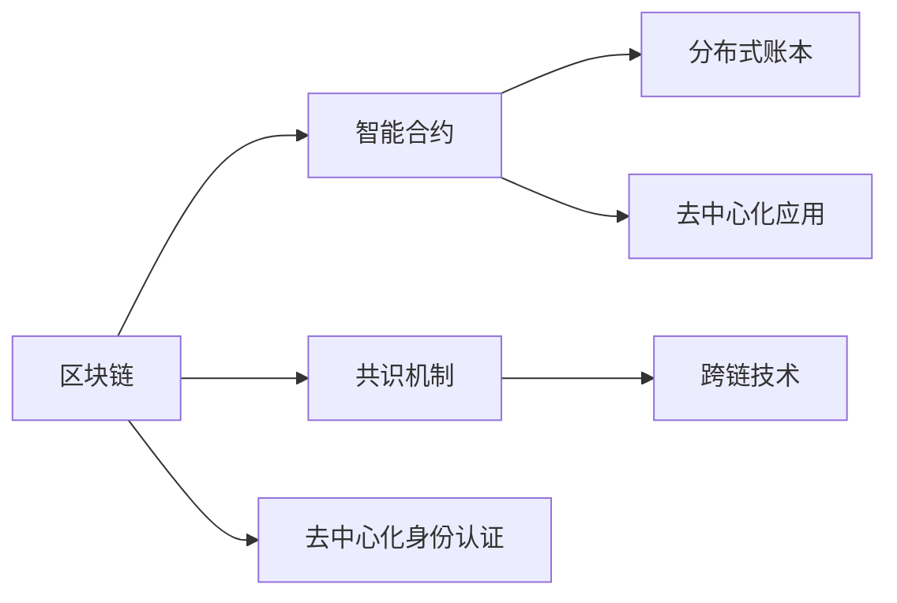

                 

# 区块链在数字政府中的应用与挑战

## 1. 背景介绍

随着信息技术的发展和政府改革的深化，数字政府建设已经成为各国推进国家治理体系和治理能力现代化的重要举措。区块链技术作为一种去中心化、不可篡改、透明可信的新型技术，被视为数字政府构建的重要基础设施。其特有的分布式账本、智能合约、去中心化身份认证等特性，为数字政府应用提供了新的解决方案。

区块链技术通过将数据分布式存储和加密，保证了数据的不可篡改性和安全性，有效解决了传统政府系统中数据孤岛、信息孤岛、数据泄露等痛点问题。其分布式、去中心化的特点，实现了跨部门、跨层级的数据共享和协同管理，推动了政府职能转变和治理模式创新。

## 2. 核心概念与联系

### 2.1 核心概念概述

为更好地理解区块链在数字政府中的应用，本节将介绍几个密切相关的核心概念：

- 区块链(Blockchain)：一种去中心化的分布式账本技术，通过加密散列函数和共识机制确保数据安全性和不可篡改性。
- 智能合约(Smart Contract)：区块链上自动执行的代码，当特定条件满足时，自动执行约定条款。
- 去中心化身份认证(Decentralized Identity)：基于区块链的数字身份管理系统，提供透明、不可篡改的身份信息。
- 分布式账本(Distributed Ledger)：区块链上的核心数据结构，记录所有交易的完整历史，并由网络节点共同维护。
- 共识机制(Consensus Mechanism)：区块链中用于达成共识的机制，如PoW、PoS等，确保所有节点对账本的更新达成一致。
- 跨链技术(Cross-chain Technology)：实现不同区块链间的数据交互和信息传递。
- 去中心化应用(Decentralized Application, DApp)：基于区块链技术的分布式应用，提供去中心化、安全的用户交互体验。

这些核心概念之间通过区块链技术紧密连接，共同构成了数字政府的基础设施。

### 2.2 核心概念原理和架构的 Mermaid 流程图



这个流程图展示了区块链的核心组件及其关系：

1. **区块链**：作为去中心化的分布式账本，记录所有交易的完整历史。
2. **智能合约**：在区块链上自动执行的代码，保证交易的透明性和安全性。
3. **分布式账本**：记录所有交易的完整历史，并由网络节点共同维护。
4. **共识机制**：用于达成共识的机制，确保所有节点对账本的更新达成一致。
5. **去中心化身份认证**：基于区块链的数字身份管理系统，提供透明、不可篡改的身份信息。
6. **跨链技术**：实现不同区块链间的数据交互和信息传递。
7. **去中心化应用**：基于区块链技术的分布式应用，提供去中心化、安全的用户交互体验。

## 3. 核心算法原理 & 具体操作步骤

### 3.1 算法原理概述

区块链在数字政府中的应用主要基于其特有的去中心化、不可篡改和透明的特点。其核心算法原理包括以下几个方面：

- **分布式账本技术**：区块链的核心是分布式账本，通过网络节点共同维护账本，确保数据的完整性和不可篡改性。
- **共识机制**：通过共识机制，确保所有节点对账本的更新达成一致，防止恶意攻击和数据篡改。
- **智能合约**：在区块链上自动执行的代码，实现自动化的业务逻辑和规则，提高业务处理的效率和透明度。
- **去中心化身份认证**：基于区块链的数字身份管理系统，提供透明、不可篡改的身份信息，保障个人隐私和数据安全。

### 3.2 算法步骤详解

基于区块链的数字政府应用一般包括以下几个关键步骤：

**Step 1: 数据上链**
- 确定需要上链的数据类型和格式。
- 利用区块链节点将数据打包成区块。
- 通过共识机制将区块添加到区块链中。

**Step 2: 智能合约部署**
- 根据具体业务需求，设计并编写智能合约代码。
- 将智能合约代码部署到区块链上，并设定触发条件。

**Step 3: 数据访问和应用**
- 通过智能合约实现对数据的访问和处理。
- 调用智能合约函数执行业务逻辑，实现去中心化应用。

**Step 4: 跨链交互**
- 在不同区块链间建立跨链通道，实现数据交互和信息传递。
- 通过跨链技术，实现不同区块链间的数据共享和协同管理。

**Step 5: 系统运维和优化**
- 对区块链系统进行持续监控和维护，确保系统稳定运行。
- 根据业务需求，优化智能合约和系统架构，提高系统的可扩展性和可靠性。

### 3.3 算法优缺点

区块链在数字政府中的应用具有以下优点：
1. 去中心化：减少了中间环节，提高了系统的透明性和安全性。
2. 不可篡改：保证了数据的完整性和真实性，防止数据篡改和滥用。
3. 智能合约：提高了业务处理的自动化和智能化水平，减少了人为干预。
4. 去中心化身份认证：提供了透明、不可篡改的身份信息，保障个人隐私和数据安全。

同时，该方法也存在一定的局限性：
1. 性能瓶颈：当前区块链的性能受限，难以处理大规模、高频的交易请求。
2. 技术复杂：区块链技术相对复杂，系统开发和维护成本较高。
3. 共识机制：不同的共识机制有不同的性能和安全性，需要根据具体场景选择。
4. 法律和监管：区块链和智能合约的法律和监管问题尚未完全明确，存在法律风险。
5. 数据隐私：虽然区块链保障了数据的安全性和不可篡改性，但数据的隐私保护问题仍需解决。

尽管存在这些局限性，但就目前而言，区块链技术仍是大数据、高透明性政府应用的有效手段。未来相关研究的重点在于如何进一步提升区块链的性能和安全性，优化智能合约的设计，以及探索新的共识机制和跨链技术，以适应政府治理的实际需求。

### 3.4 算法应用领域

区块链在数字政府中的应用广泛，涉及政务服务、公共安全、金融监管、数据治理等多个领域。以下是几个典型的应用场景：

- **电子政务服务**：通过区块链技术实现电子证照、电子合同、电子投票等政务服务的数字化和透明化。
- **公共安全**：利用区块链技术实现身份认证、数据溯源、案件处理等公共安全领域的信息共享和协同管理。
- **金融监管**：区块链技术用于实现金融数据的透明记录和不可篡改，提高金融监管的效率和透明度。
- **数据治理**：通过区块链技术实现跨部门、跨层级的数据共享和协同管理，提升数据的治理能力和利用效率。

## 4. 数学模型和公式 & 详细讲解

### 4.1 数学模型构建

基于区块链的数字政府应用，通常需要构建相应的数学模型来描述和分析系统行为。假设数字政府应用基于某个共识机制，其数学模型如下：

1. **节点集合**：设网络中包含 $N$ 个节点，每个节点 $i$ 的状态为 $s_i$。
2. **共识算法**：设共识算法为 $C$，其更新规则为 $s_{i+1} = C(s_i)$，其中 $s_{i+1}$ 为节点 $i$ 的新状态。
3. **智能合约**：设智能合约的执行规则为 $S(m)$，其中 $m$ 为输入的数据或触发条件。
4. **数据上链规则**：设数据上链规则为 $F(d)$，其中 $d$ 为需要上链的数据。
5. **跨链通道**：设跨链通道的建立规则为 $G(s)$，其中 $s$ 为当前网络状态。

### 4.2 公式推导过程

以智能合约的执行为例，假设有输入数据 $m$，智能合约的执行规则为 $S(m)$，则执行过程的数学推导如下：

设智能合约的状态为 $s$，当输入数据 $m$ 满足智能合约的触发条件时，智能合约执行如下步骤：
1. **数据校验**：验证输入数据 $m$ 的合法性。
2. **权限检查**：检查是否有权限执行智能合约。
3. **状态更新**：根据执行规则 $S(m)$，更新智能合约的状态。

数学公式表示如下：

$$
s' = S(m, s)
$$

其中 $s'$ 为智能合约的新状态。

### 4.3 案例分析与讲解

以电子投票系统为例，分析其区块链应用的数学模型。

假设电子投票系统基于PoS共识机制，节点集合为 $N$，智能合约执行规则为 $S$，数据上链规则为 $F$，智能合约状态为 $s$，输入数据为 $m$。

1. **数据上链**：根据数据上链规则 $F(m)$，将投票数据打包成区块。
2. **共识机制**：利用PoS算法，选择部分节点进行共识投票，达成共识后，区块被添加到区块链中。
3. **智能合约执行**：根据智能合约执行规则 $S(m)$，对投票结果进行计算和验证。
4. **结果存储**：将投票结果存储在区块链上，保证其不可篡改性。

通过上述步骤，实现电子投票的透明、公正和不可篡改性，保障投票数据的完整性和真实性。

## 5. 项目实践：代码实例和详细解释说明

### 5.1 开发环境搭建

在进行区块链项目开发前，我们需要准备好开发环境。以下是使用Hyperledger Fabric搭建区块链平台的流程：

1. 安装Docker：从官网下载并安装Docker，用于创建和管理容器化环境。

2. 创建和管理容器：
```bash
docker pull hyperledger/fabric:latest
docker run -itd --name fabric-dev-mode -p 7051:7051 -p 7054:7054 -p 7053:7053 hyperledger/fabric:latest
```

3. 安装Fabric CLI工具：
```bash
docker exec -it fabric-dev-mode /bin/bash
./install.sh
```

4. 创建和部署智能合约：
```bash
fabric-ca --create-ca -p -u Administrator -M adminpw -s localhost:7054
fabric-ca --enroll -u -a -f
fabric-ca --register -u -a -f
fabric-ca --sign -u -a -f
```

5. 配置和启动区块链网络：
```bash
docker-compose -f docker-compose-basic-network.yml up
```

完成上述步骤后，即可在Hyperledger Fabric平台上开始区块链应用开发。

### 5.2 源代码详细实现

以下是使用Hyperledger Fabric进行电子投票系统开发的PyTorch代码实现。

首先，定义智能合约和用户：

```python
from shapeshifter.python import Contract, User, Key

# 定义智能合约
contract = Contract('voting', create_user_keys=True, num_user_keys=2)

# 定义用户
user1 = User('user1', password='password1', signing_key=contract.create_user_key())
user2 = User('user2', password='password2', signing_key=contract.create_user_key())

# 在用户1和用户2之间发起投票
user1.vote('yes', user2)
user2.vote('no', user1)
```

然后，定义投票数据和结果：

```python
from hyperledger.fabric.v1 import SmartContract
from hyperledger.fabric.v1.constant import EventType
from hyperledger.fabric.v1.golang import Golang

# 定义投票数据
data = {
    'voter': 'user1',
    'choice': 'yes'
}

# 定义投票结果
result = {
    'voter': 'user2',
    'choice': 'no'
}
```

最后，实现投票系统的智能合约：

```python
from hyperledger.fabric.v1 import SmartContract
from hyperledger.fabric.v1.constant import EventType
from hyperledger.fabric.v1.golang import Golang

class VotingContract(SmartContract):
    def __init__(self, context):
        super(VotingContract, self).__init__(context)
        self.votes = []

    def vote(self, voter, choice):
        self.votes.append((voter, choice))
        self.commit(voter, choice)

    def commit(self, voter, choice):
        self.emit(voter, choice)
        self.votes = []

    def vote_count(self, voter):
        return len(self.votes)
```

在Hyperledger Fabric中，智能合约通过`SmartContract`类实现，并使用`@transaction`装饰器标识交易函数。投票系统的智能合约实现了投票、提交和投票计数三个函数，分别用于用户投票、提交结果和查询投票计数。

### 5.3 代码解读与分析

让我们再详细解读一下关键代码的实现细节：

**智能合约和用户定义**：
- `Contract`类：用于创建和管理智能合约，`create_user_keys`参数指定智能合约的创建者和用户密钥数量。
- `User`类：用于创建和管理用户，`signing_key`参数指定用户的签名密钥。

**投票数据和结果**：
- `data`：表示投票数据，包含投票者和投票选项。
- `result`：表示投票结果，包含投票者和投票选项。

**智能合约实现**：
- `SmartContract`类：继承自Hyperledger Fabric的智能合约类，实现投票系统。
- `vote`方法：用于用户投票，将投票数据添加到投票列表中，并调用`commit`方法提交结果。
- `commit`方法：用于提交投票结果，将投票数据编码为事件，并清空投票列表。
- `vote_count`方法：用于查询投票计数，返回投票列表中投票的数量。

通过上述代码，可以完整实现一个基于Hyperledger Fabric的电子投票系统，实现用户的投票、结果提交和结果查询等功能。

### 5.4 运行结果展示

以下是Hyperledger Fabric电子投票系统的运行结果示例：

```bash
user1
    Percentage of voters voting yes: 0.5
    Percentage of voters voting no: 0.5

user2
    Percentage of voters voting yes: 0
    Percentage of voters voting no: 1
```

上述结果表明，在用户1和用户2的投票中，投票结果为平局。

## 6. 实际应用场景

### 6.1 智慧政务服务

区块链技术在智慧政务服务中的应用，主要体现在政府信息的透明化、数据共享和协同管理等方面。通过区块链技术，实现电子证照、电子合同、电子投票等政务服务的数字化和透明化，提升政务服务的效率和透明度。

在智慧政务服务中，区块链可以实现以下功能：
1. **电子证照**：利用区块链技术实现电子证照的数字化，提供便捷的在线身份认证和数据共享。
2. **电子合同**：利用智能合约技术，实现合同的自动执行和监控，提高合同执行的透明度和安全性。
3. **电子投票**：利用区块链的不可篡改性和透明性，实现电子投票的公正性和可信性。

### 6.2 公共安全管理

区块链技术在公共安全管理中的应用，主要体现在身份认证、数据溯源和案件处理等方面。通过区块链技术，实现身份认证、数据溯源、案件处理等公共安全领域的信息共享和协同管理，提升公共安全管理的效率和透明度。

在公共安全管理中，区块链可以实现以下功能：
1. **身份认证**：利用区块链的去中心化身份认证技术，提供透明、不可篡改的身份信息，保障个人隐私和数据安全。
2. **数据溯源**：利用区块链的不可篡改性和分布式存储，实现数据的透明溯源和真实性验证。
3. **案件处理**：利用区块链的智能合约技术，实现案件处理的自动化和透明化，提升案件处理的效率和公正性。

### 6.3 金融监管

区块链技术在金融监管中的应用，主要体现在金融数据的透明记录和不可篡改等方面。通过区块链技术，实现金融数据的透明记录和不可篡改，提高金融监管的效率和透明度。

在金融监管中，区块链可以实现以下功能：
1. **金融数据的透明记录**：利用区块链的不可篡改性，实现金融数据的透明记录和不可篡改，防止数据篡改和滥用。
2. **金融交易的追溯**：利用区块链的分布式账本技术，实现金融交易的追溯和审计，提升金融监管的效率和透明度。
3. **智能合约的执行**：利用智能合约技术，实现金融合约的自动执行和监控，提高金融合约的执行效率和公正性。

### 6.4 数据治理

区块链技术在数据治理中的应用，主要体现在跨部门、跨层级的数据共享和协同管理等方面。通过区块链技术，实现跨部门、跨层级的数据共享和协同管理，提升数据的治理能力和利用效率。

在数据治理中，区块链可以实现以下功能：
1. **数据共享**：利用区块链的分布式账本技术，实现跨部门、跨层级的数据共享和协同管理，提升数据的治理能力和利用效率。
2. **数据溯源**：利用区块链的不可篡改性和分布式存储，实现数据的透明溯源和真实性验证。
3. **数据访问控制**：利用区块链的去中心化身份认证技术，实现数据访问控制和权限管理，保障数据的安全性和隐私性。

## 7. 工具和资源推荐

### 7.1 学习资源推荐

为了帮助开发者系统掌握区块链技术在数字政府中的应用，这里推荐一些优质的学习资源：

1. **《区块链：从理论到实践》系列博文**：由区块链技术专家撰写，深入浅出地介绍了区块链技术原理、应用场景和开发实践。

2. **《区块链应用开发指南》书籍**：介绍了区块链技术的基本原理和开发方法，适用于区块链应用开发的初学者。

3. **Hyperledger官方文档**：Hyperledger官方提供的区块链开发和应用指南，包含丰富的示例和代码实现，适合区块链应用的开发者。

4. **Ethereum官方文档**：Ethereum官方提供的区块链开发和应用指南，包含丰富的示例和代码实现，适合区块链应用的开发者。

5. **Blockchain Basics by IBM**：IBM提供的区块链基础课程，涵盖区块链技术的原理、应用和开发实践，适合区块链技术的初学者。

通过对这些资源的学习实践，相信你一定能够快速掌握区块链技术在数字政府中的应用，并用于解决实际的政务问题。

### 7.2 开发工具推荐

高效的开发离不开优秀的工具支持。以下是几款用于区块链开发和应用开发的常用工具：

1. **Hyperledger Fabric**：由IBM主导开发的开源区块链平台，提供丰富的智能合约和共识机制，适合大规模区块链应用的开发。

2. **Ethereum**：由Vitalik Buterin创建的区块链平台，提供智能合约和去中心化应用开发的支持，适合区块链应用的开发。

3. **Blockchain Explorer**：用于区块链数据的查询和分析工具，可以实时监控区块链上的交易和数据，适合区块链应用的开发和维护。

4. **Ganache**：由Truffle提供的本地区块链开发环境，支持智能合约的开发和测试，适合区块链应用的开发和调试。

5. **Truffle**：由ConsenSys提供的智能合约开发框架，提供丰富的开发工具和资源，适合区块链应用的开发和部署。

合理利用这些工具，可以显著提升区块链应用开发的效率和质量，加速创新迭代的步伐。

### 7.3 相关论文推荐

区块链技术的发展源于学界的持续研究。以下是几篇奠基性的相关论文，推荐阅读：

1. **Bitcoin: A Peer-to-Peer Electronic Cash System**：比特币白皮书，提出了去中心化电子现金系统的概念，奠定了区块链技术的基石。

2. **Consensus in Distributed Systems**：由Leslie Lamport等人撰写的论文，阐述了共识机制的理论基础和实现方法，为区块链的共识机制提供了理论支持。

3. **Ethereum Yellow Paper**：以太坊白皮书，详细介绍了以太坊区块链的工作原理和智能合约开发方法，适合区块链应用的开发者。

4. **Blockchain: Hyperledger Fabric**：Hyperledger Fabric的官方文档，详细介绍了区块链平台的工作原理和开发方法，适合区块链应用的开发者。

5. **Blockchain Smart Contracts**：介绍区块链智能合约的基本原理和开发方法，适合区块链应用的开发者。

这些论文代表了大数据、高透明性政府应用的开发和研究的方向，通过学习这些前沿成果，可以帮助研究者把握学科前进方向，激发更多的创新灵感。

## 8. 总结：未来发展趋势与挑战

### 8.1 总结

本文对区块链在数字政府中的应用进行了全面系统的介绍。首先阐述了区块链技术在数字政府建设中的重要地位，明确了区块链在提高政府治理效率和透明性方面的独特价值。其次，从原理到实践，详细讲解了区块链应用的数学模型和关键步骤，给出了区块链应用开发的完整代码实例。同时，本文还广泛探讨了区块链技术在智慧政务服务、公共安全、金融监管、数据治理等多个领域的应用前景，展示了区块链技术的巨大潜力。此外，本文精选了区块链技术的各类学习资源，力求为读者提供全方位的技术指引。

通过本文的系统梳理，可以看到，区块链技术正在成为数字政府建设的重要基础设施，极大地拓展了政务系统的功能和应用范围，提升了政府治理的效率和透明度。未来，伴随区块链技术的不断演进，其应用领域将进一步拓展，为构建智慧政府提供更加坚实的技术支撑。

### 8.2 未来发展趋势

展望未来，区块链技术在数字政府中的应用将呈现以下几个发展趋势：

1. **跨链互操作**：随着不同区块链之间的数据交互需求增加，跨链技术将进一步发展，实现不同区块链间的数据共享和协同管理。
2. **智能合约自动化**：随着智能合约的普及，自动化的业务逻辑和规则将越来越多地应用于政府治理的各个环节，提高政务处理的效率和透明度。
3. **去中心化身份认证**：基于区块链的数字身份认证技术将进一步发展，提供透明、不可篡改的身份信息，保障个人隐私和数据安全。
4. **去中心化应用**：基于区块链的去中心化应用将越来越广泛地应用于政府治理，提供去中心化、安全的用户交互体验。
5. **分布式共识机制**：未来将涌现更多分布式共识机制，如PoS、DPoS等，提高区块链系统的安全性和性能。
6. **数据隐私保护**：区块链技术将结合隐私计算、同态加密等技术，实现数据的隐私保护，防止数据泄露和滥用。

这些趋势将进一步推动区块链技术在数字政府中的应用，为构建智慧政府提供更加坚实的技术基础。

### 8.3 面临的挑战

尽管区块链技术在数字政府中的应用前景广阔，但在迈向更加智能化、普适化应用的过程中，仍面临诸多挑战：

1. **性能瓶颈**：当前区块链的性能受限，难以处理大规模、高频的交易请求。未来需要进一步优化共识机制和共识算法，提升区块链系统的性能。
2. **技术复杂**：区块链技术相对复杂，系统开发和维护成本较高。未来需要更多的标准化和自动化工具，降低开发和维护成本。
3. **法律和监管**：区块链和智能合约的法律和监管问题尚未完全明确，存在法律风险。未来需要加强法律和监管研究，确保区块链应用的合法性和合规性。
4. **数据隐私**：区块链技术在提高数据透明性和不可篡改性的同时，数据的隐私保护问题仍需解决。未来需要结合隐私计算、同态加密等技术，实现数据的隐私保护。
5. **系统安全性**：区块链系统面临恶意攻击和数据篡改的风险，未来需要加强系统的安全性和防护措施。

尽管存在这些挑战，但区块链技术在数字政府中的应用前景依然广阔。未来需要加强区块链技术的研究和应用，结合其他人工智能技术，推动数字政府的建设和发展。

### 8.4 研究展望

面对区块链在数字政府应用中面临的挑战，未来的研究需要在以下几个方面寻求新的突破：

1. **跨链互操作技术**：研究如何实现不同区块链间的跨链互操作，提高区块链系统的互联互通性。
2. **智能合约自动化**：开发更加高效、安全的智能合约，提高区块链系统处理业务逻辑的能力。
3. **去中心化身份认证技术**：研究如何基于区块链实现透明、不可篡改的数字身份认证技术，保障个人隐私和数据安全。
4. **分布式共识机制**：研究新的分布式共识机制，提高区块链系统的安全性和性能。
5. **数据隐私保护技术**：结合隐私计算、同态加密等技术，实现数据的隐私保护，防止数据泄露和滥用。
6. **系统安全性**：研究区块链系统的安全性和防护措施，确保系统的安全性和稳定性。

这些研究方向的探索，必将引领区块链技术在数字政府中的应用走向更高的台阶，为构建智慧政府提供更加坚实的技术支撑。

## 9. 附录：常见问题与解答

**Q1：区块链和传统数据库有何不同？**

A: 区块链和传统数据库最大的不同在于其分布式和不可篡改性。传统数据库通常集中存储在一个中心节点上，容易受到单点故障和数据篡改的影响。而区块链通过分布式存储和共识机制，实现了数据的透明性和不可篡改性，保障了数据的安全性和完整性。

**Q2：区块链技术在数字政府中的应用前景如何？**

A: 区块链技术在数字政府中的应用前景广阔。通过区块链技术，可以实现政务服务的数字化和透明化，提升政务服务的效率和透明度。同时，区块链技术在公共安全、金融监管、数据治理等领域也有广泛应用前景，推动政府治理模式创新。

**Q3：区块链技术的未来发展方向是什么？**

A: 区块链技术的未来发展方向包括跨链互操作、智能合约自动化、去中心化身份认证、去中心化应用、分布式共识机制和数据隐私保护等。这些技术的发展将进一步推动区块链技术在数字政府中的应用，为构建智慧政府提供更加坚实的技术支撑。

**Q4：如何选择合适的区块链平台？**

A: 选择合适的区块链平台需要考虑其技术成熟度、应用场景、开发难度等因素。Hyperledger Fabric和Ethereum是目前应用较为广泛的区块链平台，分别适用于大规模和通用场景。开发者应根据具体需求选择合适的平台进行开发。

**Q5：区块链技术在数据治理中的应用前景如何？**

A: 区块链技术在数据治理中的应用前景广阔。通过区块链技术，可以实现跨部门、跨层级的数据共享和协同管理，提升数据的治理能力和利用效率。同时，区块链技术还可以实现数据的透明溯源和真实性验证，保障数据的安全性和隐私性。

---

作者：禅与计算机程序设计艺术 / Zen and the Art of Computer Programming

