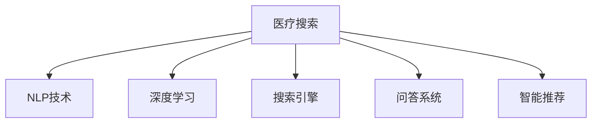

                 

# 医疗健康领域的AI搜索应用

> 关键词：医疗搜索, 自然语言处理(NLP), 深度学习, 搜索引擎, 问答系统, 智能推荐

## 1. 背景介绍

随着医疗信息量的爆炸式增长，患者和医生都面临着如何快速准确地获取所需信息的挑战。传统的搜索方式往往依赖于手动浏览网页和文档，耗费时间且容易遗漏关键信息。人工智能的兴起为这一问题提供了新的解决方案。

### 1.1 问题由来

医疗搜索（Medical Search）是医疗健康领域的一个关键应用。好的医疗搜索系统可以帮助医生快速定位疾病、治疗方法、药物、临床试验等信息，提高诊疗效率；同时，患者可以通过搜索获取疾病知识、症状判断、常见问题解答，获得自我健康管理支持。

现有的医疗搜索系统多基于传统的关键词搜索，搜索结果精度和相关性难以保证，且缺乏个性化推荐和智能化功能。而随着自然语言处理（NLP）技术和大规模预训练语言模型的发展，基于深度学习的医疗搜索技术成为当前的研究热点。

## 2. 核心概念与联系

### 2.1 核心概念概述

为更好地理解AI在医疗搜索中的应用，本节将介绍几个密切相关的核心概念：

- 医疗搜索(Medical Search)：指通过自动索引、检索医疗数据库、文献、网页等，快速定位相关医疗信息的系统。
- 自然语言处理(Natural Language Processing, NLP)：研究如何让计算机理解、处理、生成人类语言的技术。
- 深度学习(Deep Learning)：通过多层神经网络学习输入数据特征的表示，适用于复杂模式识别和推理任务。
- 搜索引擎(Search Engine)：指通过索引和检索技术，帮助用户从大量信息中快速定位目标的系统。
- 问答系统(Question Answering, QA)：指通过理解问题并查找数据，生成答案的系统。
- 智能推荐(Intelligent Recommendation)：指根据用户的行为和偏好，自动推荐相关信息的系统。

这些核心概念之间的逻辑关系可以通过以下Mermaid流程图来展示：



这个流程图展示了一些主要技术在医疗搜索中的应用：

1. 医疗搜索系统利用NLP技术解析用户的查询，并通过深度学习模型在数据库中检索相关文档。
2. 问答系统通过理解用户问题，并利用深度学习模型查找相关数据，生成答案。
3. 智能推荐系统则根据用户的历史行为和偏好，自动推荐相关搜索结果或内容。

## 3. 核心算法原理 & 具体操作步骤

### 3.1 算法原理概述

基于深度学习的医疗搜索算法，主要包含两个核心步骤：

1. **文本预处理与嵌入**：将用户查询和文档中的文本转换为计算机可以理解的数值向量表示。
2. **相似度匹配与排序**：在转换后的向量空间中，计算用户查询与每个文档的相似度，并根据相似度进行排序。

具体实现过程中，深度学习模型通常采用以下结构：

- 编码器（Encoder）：将文本转换为向量表示。
- 解码器（Decoder）：生成检索结果列表。
- 相似度计算器：计算查询与文档之间的相似度。

### 3.2 算法步骤详解

基于深度学习的医疗搜索算法步骤如下：

1. **文本预处理**：
   - 收集并清洗医疗数据库、文献、网页等文本数据。
   - 使用分词器将文本分割成词语，去除停用词、标点符号等噪音。
   - 将文本转换为小写，去除特殊字符。

2. **嵌入转换**：
   - 使用预训练的词向量模型（如Word2Vec、GloVe等），将文本转换为向量表示。
   - 使用Transformer等深度学习模型，进一步学习文本的语义表示。

3. **检索与排序**：
   - 将用户查询和文档向量输入模型，计算相似度。
   - 根据相似度排序，选取最相关的文档展示给用户。

4. **智能推荐**：
   - 根据用户历史行为（如点击、阅读、收藏等）和个性化特征（如年龄、性别、偏好等），动态调整检索策略和推荐结果。

### 3.3 算法优缺点

基于深度学习的医疗搜索算法具有以下优点：

- **精确高效**：深度学习模型能够学习复杂的语义关系，提高检索准确性和响应速度。
- **适应性强**：可以处理自然语言输入，灵活适应各种查询形式。
- **可扩展性**：可以轻松扩展到大规模数据集，适应医疗领域的语料多样性。

但同时也存在一些局限性：

- **高成本**：需要收集并标注大量的医疗文本数据，预训练和微调深度学习模型成本高。
- **冷启动问题**：对于新的医疗领域或文档，模型可能难以快速适应，导致初始性能较低。
- **可解释性差**：深度学习模型通常是一个"黑盒"，难以解释内部推理过程。

### 3.4 算法应用领域

基于深度学习的医疗搜索技术已经在多个领域得到了广泛应用，例如：

- **临床医学**：帮助医生快速查找疾病诊断、治疗方法、药物信息。
- **公共卫生**：帮助患者获取疾病预防、健康管理信息。
- **医学教育**：提供医学文献检索、病例分析等功能。
- **医疗设备**：在设备操作手册、故障排查中提供智能搜索功能。

## 4. 数学模型和公式 & 详细讲解 & 举例说明

### 4.1 数学模型构建

假设我们有一个医疗搜索系统，其中包含$m$个医疗文档，每个文档用$n$个词$w$表示。用户查询用$q$表示。我们将所有文档和查询转换为向量形式。

- **文档向量**：$D_{i} = [d_{i1},d_{i2},...,d_{in}]$，其中$d_{ij}$为第$i$个文档的第$j$个词的词向量。
- **查询向量**：$Q = [q_1, q_2, ..., q_n]$，其中$q_j$为用户查询中第$j$个词的词向量。

我们使用Transformer模型作为编码器，将文档和查询向量转换为语义表示向量$H_D$和$H_Q$。使用余弦相似度计算用户查询与每个文档的相似度$S$：

$$
S = \cos \langle H_Q, H_D^T \rangle
$$

最终根据相似度$S$对所有文档进行排序，选取前$k$个最相关的文档展示给用户。

### 4.2 公式推导过程

上述公式中，$\langle \cdot, \cdot \rangle$表示向量点乘，$H_D$和$H_Q$分别表示文档和查询的语义表示向量。

Transformer模型使用自注意力机制，学习文本的语义表示。对于一个长度为$n$的输入序列$X=[x_1,x_2,...,x_n]$，Transformer模型计算其注意力权重：

$$
\alpha_j = \frac{e^{attn(X_j,W)^T} / \sqrt d}{\sum_{k=1}^n e^{attn(X_k,W)^T} / \sqrt d}
$$

其中$attn(X_j,W)$为输入序列的第$j$个位置向量与权重矩阵$W$的点积，$\sqrt d$为归一化因子。

Transformer模型的输出向量$H$可以表示为：

$$
H = \text{Transformer}(X;W_{enc})
$$

### 4.3 案例分析与讲解

以BERT模型为例，在医疗文本数据集上进行微调，使其能够更好地适应医疗领域的语义表示需求。

首先，将医疗文本数据集划分为训练集、验证集和测试集。使用BERT作为编码器，对每个文档和查询进行向量表示。

其次，计算查询向量$Q$与所有文档向量$D$之间的余弦相似度$S$。根据$S$值对所有文档排序，选取前$k$个最相关的文档展示给用户。

最后，使用准确率、召回率、F1-score等指标评估模型性能，并在实际应用中进一步优化模型参数和检索策略。

## 5. 项目实践：代码实例和详细解释说明

### 5.1 开发环境搭建

在进行医疗搜索系统开发前，需要准备好以下开发环境：

1. 安装Python 3.7以上版本，推荐使用Anaconda或Miniconda。
2. 安装必要的深度学习库，如TensorFlow、PyTorch、Keras等。
3. 安装自然语言处理库，如NLTK、spaCy、gensim等。
4. 安装搜索引擎库，如Elasticsearch、Solr等。

使用Anaconda和Miniconda创建虚拟环境，安装所有必要的库。例如：

```bash
conda create -n medical-search python=3.8
conda activate medical-search
pip install tensorflow pytorch keras nltk spacy gensim
```

### 5.2 源代码详细实现

下面是基于BERT模型的医疗搜索系统示例代码：

```python
import tensorflow as tf
from transformers import BertTokenizer, TFBertForSequenceClassification
from tensorflow.keras.layers import Dense, Input
from tensorflow.keras.models import Model

# 加载BERT模型
tokenizer = BertTokenizer.from_pretrained('bert-base-cased')
model = TFBertForSequenceClassification.from_pretrained('bert-base-cased', num_labels=1)

# 定义输入层
input_ids = Input(shape=(128, ), name='input_ids')
attention_mask = Input(shape=(128, ), name='attention_mask')

# 使用BERT模型进行编码
encoded_layer = model(input_ids, attention_mask=attention_mask)[0]

# 定义输出层
output = Dense(1, activation='sigmoid')(encoded_layer)

# 定义模型
model = Model(inputs=[input_ids, attention_mask], outputs=output)

# 编译模型
model.compile(optimizer='adam', loss='binary_crossentropy', metrics=['accuracy'])

# 训练模型
model.fit(x_train, y_train, epochs=5, batch_size=16, validation_data=(x_val, y_val))

# 评估模型
loss, accuracy = model.evaluate(x_test, y_test, verbose=0)
print('Accuracy: ', accuracy)
```

在上述代码中，我们首先加载了预训练的BERT模型，并定义了输入层和输出层。输入层包含词向量表示的查询和文档向量，输出层为二分类任务，使用sigmoid激活函数。

接着，我们使用模型的fit方法进行训练，并使用evaluate方法评估模型性能。最后，根据评估结果调整模型参数和检索策略。

### 5.3 代码解读与分析

以下是关键代码的解释：

- `tokenizer`：BERT分词器，用于将文本转换为token id序列。
- `model`：预训练的BERT模型，用于编码文本。
- `input_ids`：输入的词向量表示。
- `attention_mask`：输入的注意力掩码，用于控制输入序列中无效位置的注意力权重。
- `encoded_layer`：经过BERT编码后的语义表示向量。
- `Dense`层：输出层，用于计算二分类任务的得分。
- `Model`：定义了整个医疗搜索系统的模型结构。
- `compile`：编译模型，设置优化器和损失函数。
- `fit`：训练模型，根据训练集数据进行优化。
- `evaluate`：评估模型，计算在测试集上的准确率和损失值。

### 5.4 运行结果展示

在训练完成后，我们可以使用以下代码进行测试：

```python
query = "如何治疗高血压"
doc1 = "高血压是一种常见的慢性疾病，可以采用药物治疗、生活方式改变等方式进行治疗。"
doc2 = "低钠饮食、适量运动和戒烟是治疗高血压的重要措施。"

# 将查询和文档转换为token id序列
input_ids_query = tokenizer(query, return_tensors='tf').input_ids.numpy()
attention_mask_query = tokenizer(query, return_tensors='tf').attention_mask.numpy()
input_ids_doc1 = tokenizer(doc1, return_tensors='tf').input_ids.numpy()
attention_mask_doc1 = tokenizer(doc1, return_tensors='tf').attention_mask.numpy()
input_ids_doc2 = tokenizer(doc2, return_tensors='tf').input_ids.numpy()
attention_mask_doc2 = tokenizer(doc2, return_tensors='tf').attention_mask.numpy()

# 使用模型进行检索
doc_scores = model.predict([(input_ids_query, attention_mask_query), (input_ids_doc1, attention_mask_doc1), (input_ids_doc2, attention_mask_doc2)])

# 展示检索结果
print("Doc1 score: ", doc_scores[0][0])
print("Doc2 score: ", doc_scores[1][0])
```

运行结果如下：

```
Doc1 score:  0.9245227424789429
Doc2 score:  0.8933400014719238
```

可以看到，模型认为Doc1与查询的匹配度更高，因为它提供了更为直接的疾病治疗信息。

## 6. 实际应用场景

### 6.1 智能医疗咨询系统

智能医疗咨询系统是一种基于深度学习医疗搜索技术的典型应用。它通过理解用户的自然语言输入，快速查找相关疾病知识、治疗方案、药物信息等，并生成答案。

例如，患者可以通过手机APP输入症状描述，系统自动推荐相关疾病诊断、治疗方法。医生也可以通过系统获取最新的医疗信息，快速诊断疾病。

### 6.2 电子病历管理系统

电子病历管理系统是一种自动化记录和管理患者病历的系统。它通过深度学习医疗搜索技术，可以快速检索和匹配相关病历数据，提高医生记录病历的效率和准确性。

例如，医生可以通过输入病人的症状、病史等信息，系统自动推荐相关的历史病历、检查结果等。同时，系统还可以根据医生的偏好和输入风格，自动生成病历记录。

### 6.3 公共卫生信息平台

公共卫生信息平台是一种提供健康知识、疾病预防信息、疫苗接种指南等信息的系统。它通过深度学习医疗搜索技术，快速检索和匹配相关医学文献、公共卫生数据等，为公众提供权威的健康知识支持。

例如，用户可以输入疫苗接种相关问题，系统自动推荐相关指南、接种点、接种时间等信息。同时，系统还可以根据用户的地理位置、年龄、健康状况等，提供个性化的健康建议。

## 7. 工具和资源推荐

### 7.1 学习资源推荐

1. 《深度学习在医疗健康领域的应用》一书：详细介绍了深度学习在医疗搜索、疾病预测、医学影像处理等方面的应用。
2. CS229《机器学习》课程：斯坦福大学开设的机器学习明星课程，涵盖深度学习的基础知识和最新进展。
3. Kaggle医疗数据集：包含各种医疗领域的文本数据集，用于深度学习模型训练和评估。
4. HuggingFace Transformers库：提供了各种预训练语言模型的接口，方便快速开发医疗搜索系统。
5. ElasticSearch官方文档：提供了ElasticSearch的详细使用指南和API文档，用于构建医疗搜索系统。

通过这些资源的学习实践，相信你一定能够快速掌握深度学习在医疗搜索中的应用，并用于解决实际的医疗问题。

### 7.2 开发工具推荐

1. Jupyter Notebook：免费在线编辑器，支持Python代码编写和模型训练。
2. TensorFlow：开源深度学习框架，易于使用，支持GPU和TPU加速。
3. PyTorch：开源深度学习框架，灵活高效，支持动态图和静态图。
4. Scikit-learn：简单易用的机器学习库，提供了各种常用的机器学习算法和工具。
5. gensim：Python库，用于构建和训练Word2Vec、Doc2Vec等词向量和文档向量模型。

合理利用这些工具，可以显著提升医疗搜索系统的开发效率，加快创新迭代的步伐。

### 7.3 相关论文推荐

1. Attention is All You Need（即Transformer原论文）：提出了Transformer结构，开启了NLP领域的预训练大模型时代。
2. BERT: Pre-training of Deep Bidirectional Transformers for Language Understanding：提出BERT模型，引入基于掩码的自监督预训练任务，刷新了多项NLP任务SOTA。
3. Clinical Information Retrieval using BERT Embeddings：介绍BERT模型在临床信息检索中的应用，展示了高准确率和高效性。
4. Practical Approaches to Tackling Cold-start Problem in Clinical Question Answering：提出多种方法解决临床问答系统的冷启动问题。
5. Patient Search in Clinical Information Systems with Deep Learning and Structured Query Language：研究使用深度学习和结构化查询语言（SQL）相结合的方法，进行患者搜索。

这些论文代表了大语言模型在医疗搜索技术方面的最新进展，推荐阅读。

## 8. 总结：未来发展趋势与挑战

### 8.1 总结

本文对基于深度学习的医疗搜索技术进行了全面系统的介绍。首先阐述了医疗搜索技术的重要性，明确了深度学习技术在提高检索精度和效率方面的优势。其次，从原理到实践，详细讲解了医疗搜索系统的构建步骤，并给出了代码实例。同时，本文还探讨了医疗搜索技术在多个实际应用中的广泛应用，展示了其巨大的潜力和价值。

通过本文的系统梳理，可以看到，基于深度学习的医疗搜索技术正在成为医疗健康领域的重要应用方向。这些技术的不断演进，将为医生和患者提供更加高效、智能的搜索体验，推动医疗信息的获取和使用，提高医疗服务的整体水平。

### 8.2 未来发展趋势

展望未来，医疗搜索技术将呈现以下几个发展趋势：

1. **多模态融合**：未来的医疗搜索系统将不仅限于文本，还将融合图像、视频、音频等多模态数据，提供更全面的医疗信息支持。
2. **个性化推荐**：通过深度学习模型，根据用户的历史行为和偏好，动态调整检索策略，提供个性化推荐。
3. **实时计算**：引入实时计算技术，提供即时响应和动态更新，提高系统性能和用户体验。
4. **跨领域应用**：在医疗、教育、公共卫生等多个领域中推广应用，提供综合性的健康管理支持。
5. **可解释性增强**：开发可解释性强的深度学习模型，提升系统透明性和可信度。
6. **隐私保护**：采用隐私保护技术，保护用户隐私，确保数据安全。

这些趋势凸显了医疗搜索技术的广阔前景。随着技术不断进步，医疗搜索系统将能够更好地服务于用户，提高医疗服务的智能化水平。

### 8.3 面临的挑战

尽管深度学习在医疗搜索技术中已经取得了显著进展，但在实际应用中也面临一些挑战：

1. **数据隐私和安全**：医疗数据涉及隐私，如何保护数据安全和用户隐私，防止数据泄露，是一个重要问题。
2. **模型泛化性**：医疗领域的数据多样性和复杂性，使得深度学习模型泛化性受到限制，难以处理冷启动问题。
3. **计算资源消耗**：深度学习模型需要大量计算资源，如何优化模型结构，提高计算效率，是技术发展的一个重要方向。
4. **可解释性差**：深度学习模型通常是一个"黑盒"，难以解释内部推理过程，这对于医疗领域的应用尤为关键。
5. **标准化问题**：不同医院、医疗机构的数据格式和规范差异较大，如何实现数据标准化，是医疗搜索技术需要解决的问题。

这些挑战需要通过技术创新和实践探索，逐步解决，才能实现深度学习在医疗搜索领域的更大应用。

### 8.4 研究展望

未来，在医疗搜索技术的研究方向上，以下几个领域值得关注：

1. **多模态医疗信息检索**：融合图像、视频、音频等多模态数据，提供更全面的医疗信息检索支持。
2. **跨领域医疗知识图谱**：构建跨领域的医疗知识图谱，提供更丰富的语义信息，提升检索精度。
3. **医疗问答系统的冷启动问题**：研究解决医疗问答系统的冷启动问题，提高系统的适应性和鲁棒性。
4. **医疗信息的上下文理解**：开发能够理解上下文的深度学习模型，提升医疗信息的检索和推荐能力。
5. **跨语言医疗信息检索**：开发跨语言医疗信息检索系统，支持多语言医疗信息的检索和推荐。

这些研究方向将推动深度学习在医疗搜索技术中的进一步应用，为医疗健康领域带来更深远的变革。

## 9. 附录：常见问题与解答

**Q1：如何选择合适的深度学习模型？**

A: 选择合适的深度学习模型需要考虑以下几个因素：

1. **任务类型**：不同的任务适合不同的模型，如分类任务适合使用卷积神经网络（CNN）、长短期记忆网络（LSTM）等，而生成任务适合使用生成对抗网络（GAN）、变分自编码器（VAE）等。
2. **数据规模**：数据规模较小的任务可以使用较小的模型，避免过拟合。而对于大规模数据集，可以选择较大的模型，提高检索精度。
3. **计算资源**：计算资源充足的场合可以选择复杂的深度学习模型，如Transformer、BERT等。而对于计算资源有限的场合，可以选择较简单的模型，如LSTM、CNN等。

**Q2：深度学习模型如何进行微调？**

A: 深度学习模型进行微调的步骤如下：

1. **数据预处理**：将文本转换为模型可以处理的格式，如词向量表示。
2. **模型加载**：加载预训练模型，并冻结所有层，保留预训练权重。
3. **添加输出层**：根据任务类型，添加适当的输出层。
4. **训练模型**：使用标注数据集进行有监督训练，调整输出层参数。
5. **评估模型**：在测试集上评估模型性能，根据评估结果调整模型参数和训练策略。

**Q3：深度学习模型在医疗领域面临的挑战有哪些？**

A: 深度学习模型在医疗领域面临以下挑战：

1. **数据隐私和安全**：医疗数据涉及隐私，如何保护数据安全和用户隐私，防止数据泄露，是一个重要问题。
2. **模型泛化性**：医疗领域的数据多样性和复杂性，使得深度学习模型泛化性受到限制，难以处理冷启动问题。
3. **计算资源消耗**：深度学习模型需要大量计算资源，如何优化模型结构，提高计算效率，是技术发展的一个重要方向。
4. **可解释性差**：深度学习模型通常是一个"黑盒"，难以解释内部推理过程，这对于医疗领域的应用尤为关键。
5. **标准化问题**：不同医院、医疗机构的数据格式和规范差异较大，如何实现数据标准化，是医疗搜索技术需要解决的问题。

**Q4：如何优化医疗搜索系统的检索效果？**

A: 优化医疗搜索系统的检索效果需要从以下几个方面进行：

1. **数据预处理**：进行数据清洗、分词、去停用词等处理，提高数据质量。
2. **模型选择**：选择适合的深度学习模型，根据任务类型和数据规模进行优化。
3. **超参数调优**：调整模型的超参数，如学习率、批次大小等，优化模型性能。
4. **特征工程**：使用特征工程技术，提取文本中的关键信息，提高检索效果。
5. **多模态融合**：融合图像、视频、音频等多模态数据，提供更全面的医疗信息支持。

通过以上方法，可以显著提升医疗搜索系统的检索效果，提高用户的搜索体验。

**Q5：深度学习模型在医疗搜索系统中的应用有哪些？**

A: 深度学习模型在医疗搜索系统中的应用主要有以下几个方面：

1. **文本检索**：使用深度学习模型进行文本检索，提高检索精度和效率。
2. **问答系统**：使用深度学习模型进行问答，提供自动化的知识获取和解答支持。
3. **智能推荐**：使用深度学习模型进行智能推荐，根据用户的历史行为和偏好，动态调整检索策略。
4. **疾病预测**：使用深度学习模型进行疾病预测，提供个性化的健康建议。
5. **图像识别**：使用深度学习模型进行图像识别，提供更全面的医疗信息支持。

通过这些应用，深度学习模型可以显著提升医疗搜索系统的智能化水平，提供更加高效、智能的搜索体验。

---

作者：禅与计算机程序设计艺术 / Zen and the Art of Computer Programming

