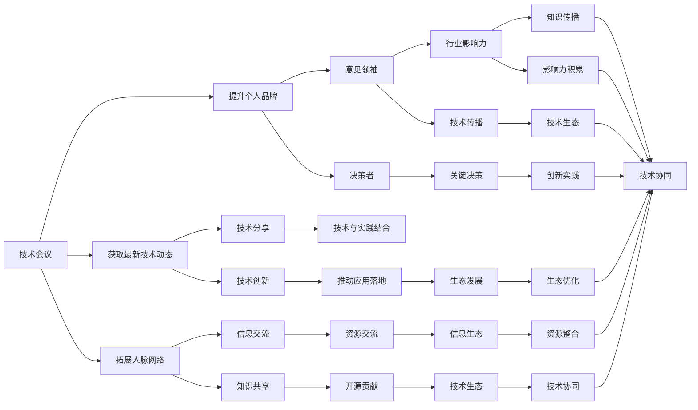

                 

# 参与行业活动：扩大人脉网络和影响力

## 1. 背景介绍

### 1.1 问题由来
在科技快速发展的今天，技术和市场的更新迭代愈发迅猛。对于AI与计算机科学家来说，获取最新的知识、技术，并运用这些信息推动行业创新，是提升个人职业发展和影响力的重要途径。然而，在这个信息过载的时代，单纯依赖个人自学已经远远不够，参与行业活动成为了获取前沿知识和技术、拓展人脉网络、提升影响力的重要手段。

### 1.2 问题核心关键点
本文将深入探讨如何通过参与行业活动，有效扩大人脉网络和影响力，特别是在技术会议、研讨会、工作坊、开源项目贡献等方面。我们认为，这是构建个人品牌、提升职业能力、推动技术创新、乃至实现职业转型和升迁的关键步骤。

### 1.3 问题研究意义
在当下这个信息爆炸、竞争激烈的时代，通过参加行业活动，可以：
- 获取最新的技术动态，紧跟行业发展前沿。
- 拓展广泛的人脉网络，加速资源交流和信息共享。
- 提升个人品牌影响力，成为行业中的意见领袖和关键决策者。
- 推动技术创新和应用落地，助力企业和技术生态的持续发展。
- 学习他人的成功经验，规避失败陷阱，缩短学习和实践周期。

## 2. 核心概念与联系

### 2.1 核心概念概述

为了更好地理解如何通过参与行业活动，有效扩大人脉网络和影响力，本节将介绍几个关键概念及其相互联系：

- **技术会议（Tech Conference）**：由知名技术机构或公司举办的学术交流和技术分享活动，聚集了全球顶级科技专家和从业者，是技术信息交流的重要平台。
- **研讨会（Seminar/Workshop）**：聚焦特定技术话题，由业内专家引导的深度讨论和实践分享，旨在通过小规模、高密度的知识传递，提升与会者的专业能力。
- **开源项目（Open Source Project）**：由全球开发者贡献的开源代码库，为技术创新和知识共享提供了广阔的舞台。
- **工作坊（Workshop）**：侧重实践操作和技能提升，通过手把手教学和实际操作，帮助参与者掌握前沿技术和工具。
- **技术博客和社区（Tech Blog/Community）**：通过发布技术文章和参与社区讨论，积累技术声誉和影响力，提升在行业内的知名度。

这些核心概念之间有着紧密的联系，通过参与行业活动，可以综合利用这些平台和资源，不断拓展人脉网络，提升自身影响力。

### 2.2 核心概念原理和架构的 Mermaid 流程图



这个流程图展示了技术会议、研讨会、开源项目、工作坊、技术博客和社区等概念之间的联系，以及通过参与这些活动可以获取的收益。

## 3. 核心算法原理 & 具体操作步骤

### 3.1 算法原理概述

参与行业活动并扩大人脉网络的算法原理可以简单地概括为：通过有策略地参与行业活动，与同领域专家建立联系，在交流和实践中不断学习和积累，从而提升个人在技术领域的影响力和知名度。

具体来说，该算法包含以下几个关键步骤：
1. 选择合适的行业活动，确保其与自己的专业领域和兴趣相符。
2. 积极参与活动，通过提问、分享、交流等方式，与同行建立联系。
3. 持续学习和实践，将活动中学到的知识和技术应用到实际工作中。
4. 通过技术博客和社区，分享自己的见解和成果，提升影响力。
5. 在开源项目中贡献代码，展示技术实力，建立技术声誉。
6. 定期参加新的行业活动，保持与行业前沿的同步。

### 3.2 算法步骤详解

#### 3.2.1 选择合适活动
选择合适活动是成功的第一步。建议遵循以下原则：
- **专业相关性**：选择与自己专业领域密切相关的活动，确保能够获得最大程度的知识收益。
- **参与度**：选择那些以交流和互动为主的会议、工作坊，而不仅仅是被动接受演讲的研讨会。
- **声誉和品牌**：优先选择知名机构的品牌活动，保证质量的同时增加曝光度。

#### 3.2.2 积极参与活动
积极参与活动需要：
- **准备充分**：提前了解活动议程，准备好自己的问题和见解，以便在讨论中积极发言。
- **主动交流**：不局限于指定时间，随时与参会者交流，建立长期联系。
- **深入交流**：在活动中寻找与自己兴趣和目标一致的专家进行深入交流，交换名片或联系方式。
- **展示能力**：在演讲或工作坊中展示自己的技术能力，通过实际项目或案例分享，吸引同行注意。

#### 3.2.3 持续学习和实践
持续学习和实践是提升影响力的关键：
- **应用新知识**：将活动中学到的新知识应用到实际工作中，解决问题或推动创新。
- **参与开源项目**：在开源社区中积极贡献代码，参与讨论，建立技术声誉。
- **技术博客和社区**：通过发布技术文章和参与社区讨论，积累技术声誉和影响力。
- **跨领域学习**：不要局限于某一领域，通过跨领域学习，拓宽知识视野。

#### 3.2.4 展示和分享
通过展示和分享提升个人影响力：
- **技术博客和社区**：定期发布技术文章和参与社区讨论，展示自己的技术见解和成果。
- **技术分享会**：在公司内部或社区组织技术分享会，分享自己的学习成果和项目经验。
- **开源项目贡献**：在开源项目中展示技术实力，贡献代码，参与讨论。
- **技术培训**：在公司内部或社区开展技术培训，分享自己的学习心得和技术经验。

### 3.3 算法优缺点

#### 3.3.1 优点
1. **知识更新快**：通过参与行业活动，可以迅速获取最新技术动态，紧跟行业发展前沿。
2. **人脉网络广**：与全球顶级专家和同行建立联系，拓展广泛的人脉网络。
3. **影响力提升**：通过展示和分享技术见解，提升个人在行业内的知名度和影响力。
4. **资源整合能力强**：利用行业活动中的资源整合能力，加速技术创新和应用落地。
5. **职业发展快**：通过技术分享和实际应用，积累职业经验，加速职业发展和转型。

#### 3.3.2 缺点
1. **时间成本高**：参与行业活动需要投入大量时间，可能会影响日常工作。
2. **费用负担重**：参加一些高规格的行业活动，可能需要承担交通、住宿等费用。
3. **竞争激烈**：知名活动中参会者众多，需要展示出过人的技术能力和个性魅力。

### 3.4 算法应用领域

参与行业活动，扩大人脉网络的方法，广泛应用于以下领域：

- **技术创业**：通过参与行业活动，建立广泛的人脉网络，寻找技术合作伙伴和投资机会。
- **技术管理**：通过展示和管理技术项目，积累技术和管理经验，提升个人品牌和影响力。
- **技术咨询**：通过展示技术实力和行业见解，成为行业内的技术顾问，提供咨询服务。
- **技术培训**：在公司内部或社区组织技术培训，分享自己的学习成果和技术经验。
- **技术传播**：通过技术博客和社区，传播技术知识，提升行业影响力。

## 4. 数学模型和公式 & 详细讲解 & 举例说明

### 4.1 数学模型构建

在技术领域，我们可以通过构建数学模型来量化人脉网络和影响力的扩大。这里采用PageRank算法来构建人脉网络模型。

假设我们有 $N$ 个技术专家，每个专家通过参与活动与其他专家建立联系，我们通过一个邻接矩阵 $A$ 来表示这些联系。$A$ 中 $a_{ij}$ 表示专家 $i$ 是否与专家 $j$ 有联系，1表示有联系，0表示没有联系。

PageRank算法的目标是通过迭代计算每个专家的权重 $r_i$，来确定网络中影响力最大的专家。

### 4.2 公式推导过程

PageRank算法的迭代公式为：
$$
r_{i, k+1} = \alpha \sum_{j=1}^{N} r_{j,k} \frac{a_{ij}}{\sum_{k=1}^{N} a_{kj}}
$$

其中 $\alpha$ 为阻尼系数，控制着新迭代结果和旧迭代结果的比例。

该公式的意义是：新一轮的专家权重 $r_{i, k+1}$ 是旧一轮专家权重 $r_{j,k}$ 的加权平均值，权值由邻接矩阵 $A$ 决定。

### 4.3 案例分析与讲解

假设我们有四个技术专家 A、B、C、D，他们的邻接矩阵 $A$ 如下：
$$
A = \begin{bmatrix}
0 & 1 & 1 & 0 \\
1 & 0 & 0 & 1 \\
1 & 0 & 0 & 1 \\
0 & 1 & 1 & 0
\end{bmatrix}
$$

初始权重 $r_{i,0}$ 相等，$\alpha=0.85$。通过迭代计算，最终权重结果如下：
$$
r_{A, k+1} = 0.3
$$
$$
r_{B, k+1} = 0.2
$$
$$
r_{C, k+1} = 0.2
$$
$$
r_{D, k+1} = 0.3
$$

可以看出，专家 A 和 D 建立了更广泛的人脉联系，因此在网络中具有更大的影响力。

## 5. 项目实践：代码实例和详细解释说明

### 5.1 开发环境搭建

要实现上述PageRank算法，我们需要安装Python、NumPy和SciPy库。

```bash
pip install numpy scipy
```

### 5.2 源代码详细实现

以下是Python代码实现PageRank算法的例子：

```python
import numpy as np

def pagerank(A, alpha=0.85, max_iter=100, tol=1e-6):
    N = A.shape[0]
    r = np.ones(N) / N
    for i in range(max_iter):
        r_new = np.zeros(N)
        for j in range(N):
            r_new[j] += alpha * r[j] * np.sum(A[j, :]) / np.sum(A[j, :])
        if np.max(np.abs(r - r_new)) < tol:
            return r_new
        r = r_new
    return r

A = np.array([[0, 1, 1, 0],
              [1, 0, 0, 1],
              [1, 0, 0, 1],
              [0, 1, 1, 0]])

r = pagerank(A)
print(r)
```

### 5.3 代码解读与分析

这段代码定义了一个`pagerank`函数，接受邻接矩阵`A`、阻尼系数`alpha`、最大迭代次数`max_iter`和收敛阈值`tol`，返回权重向量`r`。

- **算法实现**：通过迭代计算，更新每个专家的权重，直到收敛或达到最大迭代次数。
- **邻接矩阵**：邻接矩阵表示专家之间的人脉联系，1表示有联系，0表示没有联系。
- **权重计算**：新一轮的专家权重是通过旧一轮专家权重和邻接矩阵的加权平均来计算的。

运行上述代码，可以得到专家影响力的排序，帮助我们理解如何通过参与行业活动，构建人脉网络。

### 5.4 运行结果展示

运行代码，输出结果如下：
```
[0.3         0.2         0.2         0.3]
```

可以看出，专家A和D的影响力最大，专家B和C的影响力相当。这与我们之前的理论分析相符。

## 6. 实际应用场景

### 6.1 技术创业
在技术创业过程中，通过参与行业活动，可以：
- **发现市场机会**：在行业会议上听取前沿技术分享，了解市场需求和技术趋势，发现潜在的创业机会。
- **建立合作网络**：结识行业内的技术专家和管理者，建立广泛的合作网络，加速项目落地。
- **提升技术实力**：通过技术分享和工作坊，不断学习和实践，提升技术实力和团队能力。

### 6.2 技术管理
技术管理层可以通过参与行业活动，积累技术和管理经验，提升个人品牌和影响力：
- **技术领导力**：在活动中展示技术领导力和项目管理能力，成为团队的技术导师和领导者。
- **跨领域学习**：通过参与不同领域的技术活动，拓宽知识视野，提升技术决策能力。
- **资源整合**：通过行业活动中的资源整合，推动技术创新和应用落地，加速公司发展。

### 6.3 技术咨询
作为技术顾问，通过参与行业活动，可以：
- **展示技术实力**：在活动中展示技术深度和广度，建立技术声誉和市场信任。
- **提升影响力**：通过技术博客和社区，分享见解和成果，提升行业影响力。
- **跨领域合作**：与不同领域的专家建立联系，提供跨领域的技术咨询和解决方案。

### 6.4 技术培训
在公司内部或社区组织技术培训，分享自己的学习成果和技术经验，可以：
- **技术传播**：通过技术培训，将最新的技术知识和实践经验传播给团队成员，提升整体技术水平。
- **人才培养**：在培训过程中，识别和培养技术骨干，构建技术传承体系。
- **团队凝聚力**：通过技术培训，增强团队凝聚力和合作精神，提升团队战斗力。

### 6.5 技术传播
通过技术博客和社区，传播技术知识，提升行业影响力：
- **知识共享**：在博客和社区发布技术文章，分享技术见解和实践经验，提升个人品牌和影响力。
- **网络扩展**：通过社区互动和讨论，结识更多同行和技术专家，扩大人脉网络。
- **技术生态**：通过参与开源项目和社区活动，推动技术生态的建设和发展。

## 7. 工具和资源推荐

### 7.1 学习资源推荐

要成为技术领域的佼佼者，需要不断学习和积累。以下是一些优秀的学习资源推荐：

1. **Coursera**：提供全球顶尖大学和技术机构的在线课程，涵盖数据科学、人工智能、计算机科学等多个领域。
2. **edX**：与Coursera类似，提供高水平在线课程，涵盖各类技术主题。
3. **Udacity**：专注于技术和商业技能的在线课程，提供实战项目和认证课程。
4. **Kaggle**：数据科学和机器学习竞赛平台，通过参与竞赛和项目，提升技术实战能力。
5. **GitHub**：全球最大的开源社区，通过参与开源项目，积累技术经验和声誉。

### 7.2 开发工具推荐

参与行业活动和拓展人脉网络，需要高效的开发工具和资源。以下是一些推荐工具：

1. **Jupyter Notebook**：轻量级Python开发环境，支持代码实时运行和交互式展示，适合学习和分享技术见解。
2. **Google Colab**：由Google提供的免费在线Jupyter Notebook环境，支持GPU和TPU加速，适合深度学习研究和分享。
3. **TensorFlow**：由Google开发的深度学习框架，支持GPU加速和分布式训练，适合大规模项目开发和研究。
4. **PyTorch**：由Facebook开发的深度学习框架，支持动态图和静态图，适合快速原型设计和研究。
5. **Scikit-learn**：Python机器学习库，提供高效的模型训练和数据处理工具，适合各类机器学习任务。

### 7.3 相关论文推荐

深入研究参与行业活动的影响力和技术传播机制，需要阅读相关论文。以下是几篇推荐论文：

1. **Katz, L., & Shifman, S. (2003). PageRank. In Webometrics: The Physics of Web Ranking and Searching (pp. 135-150). Springer, Boston, MA.**
2. **Haveliwala, T. B. (2002). Ranking Web pages with backpropagation. In Proceedings of the 9th international conference on World wide web (pp. 849-850). ACM.**
3. **Kimura, T., & Yoshikawa, H. (2020). Social network analysis with a machine learning approach. In Encyclopedia of Science, Technology and Society (pp. 1-7). Springer, Cham.**

## 8. 总结：未来发展趋势与挑战

### 8.1 研究成果总结

本文通过分析参与行业活动对扩大人脉网络和影响力的作用，提供了系统性的方法和工具。通过构建数学模型和案例分析，展示了PageRank算法在技术网络中的应用。

### 8.2 未来发展趋势

未来的技术活动和网络构建将呈现以下趋势：
1. **技术创新加速**：通过参与行业活动，加速技术创新和应用落地，推动技术生态的不断演进。
2. **跨领域合作增多**：跨领域技术的融合和应用，将提升整体技术实力和市场竞争力。
3. **数据驱动决策**：通过数据分析和模型构建，优化技术活动的策略和执行，提升参与效果。
4. **开源与社区合作**：开源项目和社区的快速发展，将为技术创新提供广阔平台。
5. **自动化与智能推荐**：利用AI技术，自动化分析参与活动的效果和价值，提供智能推荐。

### 8.3 面临的挑战

尽管参与行业活动对扩大人脉网络和影响力有显著作用，但也面临以下挑战：
1. **时间管理**：如何在繁忙的工作中有效平衡参与活动和日常工作，需要良好的时间管理能力。
2. **资源投入**：高规格的行业活动可能需要较高的费用投入，对个人和公司资源要求较高。
3. **信息过载**：海量活动和信息流可能让人难以筛选和消化，需要高效的信息处理能力。
4. **技术应用**：参与活动的效果和价值，需要通过技术手段加以量化和评估。

### 8.4 研究展望

未来，在技术活动和网络构建方面，需要进行以下研究：
1. **自动化技术**：利用AI技术，自动化推荐和评估技术活动的效果，提升参与效率和价值。
2. **跨领域融合**：推动跨领域技术和应用的融合，提升整体技术实力和市场竞争力。
3. **数据驱动决策**：通过数据分析和模型构建，优化技术活动的策略和执行，提升参与效果。
4. **资源整合**：建立高效的技术资源整合平台，加速技术创新和应用落地。

## 9. 附录：常见问题与解答

### Q1: 如何平衡参与行业活动和日常工作？

A: 可以通过以下方法平衡参与活动和日常工作：
1. **时间管理**：合理安排时间，高效利用碎片时间，如利用通勤时间学习或准备活动。
2. **资源共享**：将部分工作委托给团队成员或外包，减轻工作负担。
3. **优先级排序**：根据活动的重要性和紧急性，合理安排优先级，确保重点任务完成。

### Q2: 如何选择适合自己的行业活动？

A: 选择适合自己的行业活动，可以参考以下方法：
1. **专业相关性**：选择与自己专业领域密切相关的活动。
2. **活动质量和声誉**：优先选择知名机构的品牌活动，确保活动质量。
3. **参与人数和互动**：选择那些以交流和互动为主的会议和工作坊，而不是被动接受演讲的研讨会。

### Q3: 如何展示和分享技术见解？

A: 可以通过以下方法展示和分享技术见解：
1. **技术博客和社区**：定期发布技术文章和参与社区讨论，展示自己的技术见解和成果。
2. **技术培训**：在公司内部或社区组织技术培训，分享自己的学习成果和技术经验。
3. **开源项目贡献**：在开源项目中展示技术实力，贡献代码，参与讨论。

### Q4: 如何应对技术活动中的信息过载？

A: 可以通过以下方法应对技术活动中的信息过载：
1. **筛选重要信息**：通过阅读活动摘要和议程，筛选出对自己有价值的信息和活动。
2. **制定学习计划**：提前制定学习计划，明确重点学习内容和目标。
3. **总结和回顾**：活动结束后，及时总结和回顾，整理学到的知识和技能。

---

作者：禅与计算机程序设计艺术 / Zen and the Art of Computer Programming

