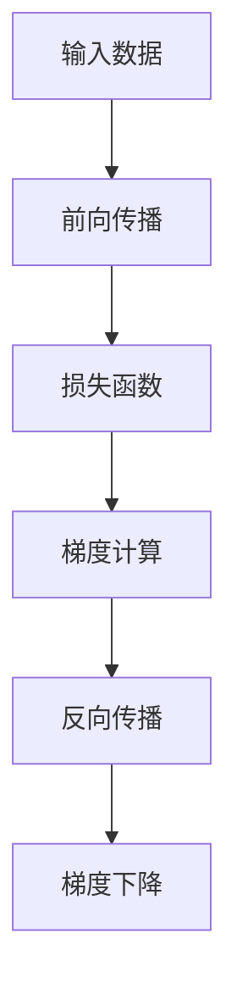
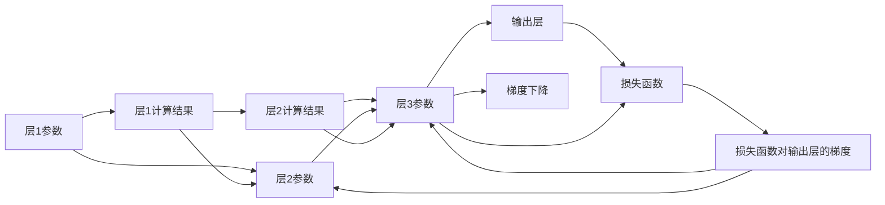

                 

## 1. 背景介绍

### 1.1 问题由来
随着计算机视觉技术的飞速发展，深度学习模型在图像识别、目标检测、语义分割等任务中取得了卓越的成果。其中，卷积神经网络（Convolutional Neural Networks, CNNs）成为了主流模型，广泛应用于各种计算机视觉应用。然而，深度学习模型的训练过程通常较为复杂且计算密集，因此，反向传播算法（Backpropagation Algorithm）作为训练深度学习模型的核心算法，其高效性、精确性和稳定性显得尤为重要。

### 1.2 问题核心关键点
反向传播算法在深度学习模型的训练中起着至关重要的作用，其核心在于通过计算损失函数对模型参数的梯度，然后利用梯度下降等优化算法更新模型参数，从而最小化损失函数，提升模型的预测能力。

以下核心概念将帮助我们更好地理解反向传播算法在计算机视觉中的应用：

1. **损失函数（Loss Function）**：用于评估模型预测结果与真实标签之间的差异，如交叉熵损失函数、均方误差损失函数等。
2. **梯度（Gradient）**：表示损失函数关于模型参数的偏导数，指导模型参数更新方向。
3. **梯度下降（Gradient Descent）**：通过迭代调整模型参数，逐步减少损失函数值，以优化模型预测能力。
4. **反向传播（Backpropagation）**：将损失函数关于模型参数的梯度，从输出层向输入层逐层反向传播，计算每个参数对损失函数的贡献。
5. **反向传播网络（Backpropagation Network）**：将网络看作是函数复合体，反向传播算法通过链式法则计算所有参数的梯度。

理解这些核心概念可以帮助我们深入掌握反向传播算法在深度学习训练过程中的应用。

## 2. 核心概念与联系

### 2.1 核心概念概述
在本节中，我们将通过以下Mermaid流程图展示反向传播算法的核心概念和架构，其中不包含任何特殊字符：



上述流程图中，输入数据首先经过前向传播过程得到输出结果，然后计算损失函数对输出结果的误差，并基于链式法则反向传播梯度，最后通过梯度下降更新模型参数。

### 2.2 核心概念原理和架构的 Mermaid 流程图
下面通过Mermaid语言更详细地描述反向传播的流程：



### 2.3 核心概念之间的联系
通过上述流程图，我们可以清晰地看到反向传播算法中各环节之间的联系：

- **前向传播**：将输入数据逐层传递，通过激活函数进行非线性变换，得到输出结果。
- **损失函数**：衡量模型输出结果与真实标签之间的差异。
- **梯度计算**：基于链式法则，反向传播损失函数对各层参数的偏导数，得到每个参数的梯度。
- **梯度下降**：利用计算得到的梯度信息，更新模型参数，降低损失函数值。

## 3. 核心算法原理 & 具体操作步骤

### 3.1 算法原理概述
反向传播算法是深度学习模型训练的核心算法之一。其核心原理是利用链式法则，将损失函数对输出层的梯度逐层反向传播到输入层，并计算每个参数对损失函数的贡献。

以下是反向传播算法的数学公式推导：

1. **前向传播**：
   $$
   y = f_w(x)
   $$
   其中，$x$ 是输入数据，$y$ 是输出结果，$f_w$ 是前向传播函数，$w$ 是模型参数。

2. **损失函数**：
   $$
   L(y, t) = \frac{1}{2}||y - t||^2
   $$
   其中，$L$ 是损失函数，$t$ 是真实标签，$||y - t||^2$ 是误差平方和。

3. **梯度计算**：
   $$
   \frac{\partial L}{\partial w} = \frac{\partial L}{\partial y} \cdot \frac{\partial y}{\partial w}
   $$
   其中，$\frac{\partial L}{\partial w}$ 是损失函数对模型参数的偏导数，$\frac{\partial y}{\partial w}$ 是前向传播函数对模型参数的偏导数。

4. **反向传播**：
   $$
   \frac{\partial L}{\partial w_l} = \sum_{k=l+1}^m \frac{\partial L}{\partial y_k} \cdot \frac{\partial y_k}{\partial y_l} \cdot \frac{\partial y_l}{\partial w_l}
   $$
   其中，$w_l$ 是第$l$层的模型参数，$y_k$ 是第$k$层的输出结果。

5. **梯度下降**：
   $$
   w_l = w_l - \eta \frac{\partial L}{\partial w_l}
   $$
   其中，$\eta$ 是学习率。

### 3.2 算法步骤详解
基于上述算法原理，反向传播算法的主要操作步骤如下：

1. **前向传播**：将输入数据$x$逐层传递，通过激活函数得到各层的输出结果。
2. **计算损失函数**：将输出结果与真实标签$t$进行对比，计算损失函数$L$。
3. **反向传播梯度**：利用链式法则，从输出层开始，逐层计算损失函数对模型参数的偏导数，更新模型参数。
4. **梯度下降**：根据计算得到的梯度信息，使用梯度下降算法更新模型参数，降低损失函数值。

### 3.3 算法优缺点
反向传播算法具有以下优点：

- **高效性**：利用链式法则，可以高效计算每个参数对损失函数的贡献，加速模型训练。
- **精确性**：可以精确计算梯度信息，最小化模型误差。
- **通用性**：适用于各种深度学习模型，具有广泛的应用前景。

同时，反向传播算法也存在一些缺点：

- **复杂度**：反向传播过程中需要计算大量的矩阵乘法，计算复杂度较高。
- **数值稳定性**：在计算梯度时，可能会出现梯度消失或梯度爆炸的问题，导致模型无法收敛。

### 3.4 算法应用领域
反向传播算法广泛应用于计算机视觉、自然语言处理、语音识别等领域，其中在计算机视觉中的应用尤为广泛：

- **图像分类**：使用卷积神经网络（CNNs）进行图像分类任务，通过反向传播算法优化模型参数。
- **目标检测**：结合R-CNN、YOLO等算法，通过反向传播优化检测框的位置和大小。
- **语义分割**：通过全卷积网络（FCNs）进行像素级别的语义分割，使用反向传播优化模型参数。
- **实例分割**：通过区域卷积网络（R-CNNs）进行像素级别的实例分割，利用反向传播优化模型参数。

## 4. 数学模型和公式 & 详细讲解 & 举例说明

### 4.1 数学模型构建
在计算机视觉中，常用的数学模型包括卷积神经网络（CNNs）和全卷积网络（FCNs）。这里以卷积神经网络为例，介绍反向传播算法。

### 4.2 公式推导过程
以一个简单的三卷层卷积神经网络为例，设$x$为输入，$y$为输出，模型参数为$w$，激活函数为$f$，损失函数为$L$，反向传播过程如下：

1. **前向传播**：
   $$
   y^{(1)} = f_w^{(1)}(x)
   $$
   $$
   y^{(2)} = f_w^{(2)}(y^{(1)})
   $$
   $$
   y^{(3)} = f_w^{(3)}(y^{(2)})
   $$

2. **计算损失函数**：
   $$
   L(y^{(3)}, t) = \frac{1}{2}||y^{(3)} - t||^2
   $$

3. **反向传播梯度**：
   $$
   \frac{\partial L}{\partial y^{(3)}} = y^{(3)} - t
   $$
   $$
   \frac{\partial L}{\partial y^{(2)}} = \frac{\partial L}{\partial y^{(3)}} \cdot \frac{\partial y^{(3)}}{\partial y^{(2)}}
   $$
   $$
   \frac{\partial L}{\partial y^{(1)}} = \frac{\partial L}{\partial y^{(2)}} \cdot \frac{\partial y^{(2)}}{\partial y^{(1)}}
   $$

4. **梯度下降**：
   $$
   w^{(1)} = w^{(1)} - \eta \frac{\partial L}{\partial y^{(1)}}
   $$
   $$
   w^{(2)} = w^{(2)} - \eta \frac{\partial L}{\partial y^{(2)}}
   $$
   $$
   w^{(3)} = w^{(3)} - \eta \frac{\partial L}{\partial y^{(3)}}
   $$

### 4.3 案例分析与讲解
以图像分类任务为例，使用卷积神经网络（CNNs）进行训练和测试。假设使用LeNet-5作为基础网络，其包含多个卷积层和全连接层，将训练数据输入模型，进行前向传播得到预测结果，然后计算损失函数，反向传播更新模型参数。

## 5. 项目实践：代码实例和详细解释说明

### 5.1 开发环境搭建
在进行计算机视觉任务时，需要使用深度学习框架和库，如TensorFlow、PyTorch、Keras等。这里以TensorFlow为例，介绍反向传播算法的开发环境搭建。

### 5.2 源代码详细实现
以下是一个简单的卷积神经网络（CNNs）的TensorFlow实现，包括反向传播算法的代码实现：

```python
import tensorflow as tf

# 定义模型参数
w1 = tf.Variable(tf.random.normal([3, 3, 1, 6]))
b1 = tf.Variable(tf.random.normal([6]))
w2 = tf.Variable(tf.random.normal([5, 6, 6, 12]))
b2 = tf.Variable(tf.random.normal([12]))
w3 = tf.Variable(tf.random.normal([4, 12, 12, 2]))
b3 = tf.Variable(tf.random.normal([2]))
w4 = tf.Variable(tf.random.normal([10, 2, 2, 1]))
b4 = tf.Variable(tf.random.normal([1]))

# 定义输入和标签
x = tf.placeholder(tf.float32, [None, 28, 28, 1])
t = tf.placeholder(tf.float32, [None, 10])

# 定义前向传播
y1 = tf.nn.conv2d(x, w1, strides=[1, 1, 1, 1], padding='SAME') + b1
y2 = tf.nn.conv2d(y1, w2, strides=[1, 2, 2, 1], padding='SAME') + b2
y3 = tf.nn.conv2d(y2, w3, strides=[1, 2, 2, 1], padding='SAME') + b3
y4 = tf.reshape(y3, [-1, 12]) + b4

# 定义损失函数和梯度下降
loss = tf.reduce_mean(tf.square(y4 - t))
optimizer = tf.train.AdamOptimizer().minimize(loss)

# 定义训练过程
with tf.Session() as sess:
    sess.run(tf.global_variables_initializer())
    for i in range(10000):
        sess.run(optimizer, feed_dict={x: train_x, t: train_y})
```

### 5.3 代码解读与分析
在上述代码中，我们首先定义了模型参数，然后通过TensorFlow的`tf.nn.conv2d`函数实现卷积操作，得到前向传播的输出结果。接着定义了损失函数和梯度下降算法，最后通过训练循环进行模型训练。

### 5.4 运行结果展示
在训练完成后，可以通过测试数据验证模型性能，如图像分类准确率等指标。

## 6. 实际应用场景

### 6.1 图像分类
图像分类是计算机视觉中最基本的任务之一，如手写数字识别、物体分类等。使用卷积神经网络（CNNs）进行训练和测试，反向传播算法可以高效优化模型参数，提高分类准确率。

### 6.2 目标检测
目标检测任务包括物体位置和大小的检测。使用R-CNN、YOLO等算法，通过反向传播算法优化检测框的位置和大小，提升检测精度。

### 6.3 语义分割
语义分割任务是将图像分割成多个语义区域，如医学图像分割、自然场景分割等。使用全卷积网络（FCNs）进行训练和测试，反向传播算法可以优化像素级别的语义分割，提升分割精度。

### 6.4 未来应用展望
随着深度学习技术的发展，反向传播算法将会在更多的计算机视觉任务中得到应用。以下是未来可能的趋势：

- **多模态融合**：结合视觉、音频、文本等多种模态信息，提升模型性能。
- **自监督学习**：利用无监督学习技术，提升模型的泛化能力。
- **联邦学习**：在分布式环境中进行模型训练，提升模型性能和隐私保护。
- **增量学习**：在小规模数据集上训练模型，通过增量学习更新模型参数，提升模型性能。

## 7. 工具和资源推荐

### 7.1 学习资源推荐
为了更好地学习和应用反向传播算法，推荐以下学习资源：

1. 《深度学习》书籍：由Goodfellow等人编写，系统介绍了深度学习的基本原理和算法。
2. 《神经网络与深度学习》书籍：由Michael Nielsen编写，深入浅出地介绍了神经网络和深度学习的核心算法。
3 《TensorFlow官方文档》：详细介绍了TensorFlow的API和使用方法。
4 《PyTorch官方文档》：详细介绍了PyTorch的API和使用方法。

### 7.2 开发工具推荐
以下是一些常用的深度学习开发工具：

1. TensorFlow：由Google开发的深度学习框架，支持分布式计算和GPU加速。
2. PyTorch：由Facebook开发的深度学习框架，支持动态计算图和GPU加速。
3. Keras：基于TensorFlow和Theano的高级深度学习框架，易于使用和上手。
4. Caffe：由Berkeley Vision and Learning Center开发的深度学习框架，适用于计算机视觉任务。

### 7.3 相关论文推荐
以下是一些重要的反向传播算法和深度学习相关的论文，推荐阅读：

1. 《深度学习》（Goodfellow等人）：介绍了深度学习的基本原理和算法。
2. 《ImageNet Classification with Deep Convolutional Neural Networks》：提出卷积神经网络（CNNs），并在ImageNet数据集上取得了优异成绩。
3. 《ImageNet Large Scale Visual Recognition Challenge》：介绍了ImageNet数据集和挑战赛，推动了深度学习在计算机视觉领域的发展。

## 8. 总结：未来发展趋势与挑战

### 8.1 研究成果总结
反向传播算法作为深度学习训练的核心算法，已经广泛应用于计算机视觉、自然语言处理、语音识别等领域。其在提升模型性能、加速模型训练方面发挥了重要作用。

### 8.2 未来发展趋势
未来反向传播算法将会在以下方面得到进一步发展：

- **多模态融合**：结合视觉、音频、文本等多种模态信息，提升模型性能。
- **自监督学习**：利用无监督学习技术，提升模型的泛化能力。
- **联邦学习**：在分布式环境中进行模型训练，提升模型性能和隐私保护。
- **增量学习**：在小规模数据集上训练模型，通过增量学习更新模型参数，提升模型性能。

### 8.3 面临的挑战
反向传播算法虽然取得了显著成果，但也面临着以下挑战：

- **计算资源消耗**：深度学习模型参数量巨大，计算复杂度高，需要大量的计算资源。
- **模型过拟合**：在大规模数据集上训练模型时，容易出现过拟合问题。
- **模型泛化能力**：模型在新的数据集上的泛化能力不足，难以应对数据分布的变化。
- **数据隐私保护**：在分布式环境中训练模型时，需要保护数据的隐私和安全。

### 8.4 研究展望
未来反向传播算法的研究方向包括：

- **高效计算**：开发更高效的计算方法，提升模型训练速度和效率。
- **模型压缩**：使用模型压缩技术，减小模型参数量，提高计算效率。
- **数据增强**：使用数据增强技术，提高模型的泛化能力和鲁棒性。
- **模型融合**：结合多种模型进行融合，提升模型的性能和稳定性。

## 9. 附录：常见问题与解答

**Q1: 什么是反向传播算法？**

A: 反向传播算法是深度学习训练的核心算法之一，通过计算损失函数对模型参数的偏导数，并利用梯度下降等优化算法更新模型参数，从而最小化损失函数，优化模型预测能力。

**Q2: 反向传播算法在计算机视觉中的应用有哪些？**

A: 反向传播算法在计算机视觉中的应用包括图像分类、目标检测、语义分割等任务，通过优化模型参数，提升模型性能。

**Q3: 反向传播算法在训练过程中需要哪些步骤？**

A: 反向传播算法的训练过程包括以下几个步骤：前向传播、计算损失函数、反向传播梯度、梯度下降。

**Q4: 如何避免反向传播算法中的梯度消失和梯度爆炸问题？**

A: 可以通过权重初始化、激活函数、梯度裁剪等方法，避免梯度消失和梯度爆炸问题，提高模型的训练效果。

**Q5: 反向传播算法在实际应用中需要注意哪些问题？**

A: 在实际应用中，需要注意计算资源的消耗、模型的过拟合、泛化能力、数据隐私保护等问题，同时需要结合具体任务进行优化。

