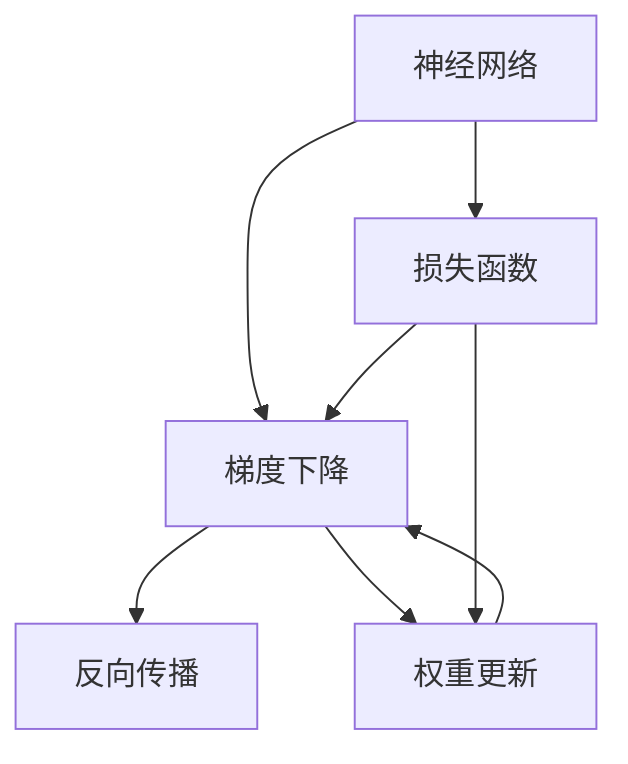

                 

# 反向传播详解：梯度和权重更新

> 关键词：反向传播,梯度下降,权重更新,神经网络,深度学习,机器学习

## 1. 背景介绍

### 1.1 问题由来
在深度学习领域，神经网络因其强大的表达能力和泛化能力而广受欢迎。然而，训练神经网络往往面临高维参数空间的问题，且在反向传播过程中，每层节点间的权重更新需要精确的梯度计算，复杂度指数级增加。

### 1.2 问题核心关键点
为了解决上述问题，反向传播算法被提出。其核心思想是通过链式法则，从输出层开始，逐层计算损失函数对各节点权重的梯度，并进行权重更新。这一过程被称为梯度下降。

### 1.3 问题研究意义
掌握反向传播和梯度下降的原理，对于理解和应用神经网络至关重要。它不仅帮助构建和训练高效的深度学习模型，还能通过调整优化策略，提升模型性能，减少过拟合风险。

## 2. 核心概念与联系

### 2.1 核心概念概述

为更好地理解反向传播和梯度下降，本节将介绍几个密切相关的核心概念：

- 神经网络(Neural Network)：由多个节点(神经元)组成的非线性模型，常用于解决分类、回归、序列预测等任务。
- 损失函数(Loss Function)：衡量模型预测与真实标签之间差异的量化指标，如均方误差、交叉熵等。
- 梯度下降(Gradient Descent)：通过连续迭代最小化损失函数，更新模型参数的一种优化算法。
- 反向传播(Backpropagation)：从输出层开始，通过链式法则逐层计算梯度的过程。
- 权重更新(Weight Update)：根据梯度信息，调整神经网络中的权重参数。
- 超参数(Supervised Parameters)：模型在训练过程中需要手动设定的参数，如学习率、批大小等。

这些核心概念之间的逻辑关系可以通过以下Mermaid流程图来展示：



这个流程图展示了神经网络、损失函数、梯度下降、反向传播和权重更新之间的联系：

1. 神经网络通过多个节点组成，利用参数矩阵$W$和偏置向量$b$进行计算。
2. 损失函数计算模型输出与真实标签的差异，如均方误差$MSE$或交叉熵$CE$。
3. 梯度下降通过连续迭代最小化损失函数，更新参数$W$和$b$。
4. 反向传播计算损失函数对各参数的梯度。
5. 权重更新根据梯度信息调整参数，进行模型优化。

## 3. 核心算法原理 & 具体操作步骤
### 3.1 算法原理概述

反向传播算法基于链式法则，从输出层开始，通过逐层计算损失函数对各参数的偏导数，进而得到权重更新的方向和大小。具体来说，假设模型为$y=f(Wx+b)$，其中$f$为激活函数，$W$为权重矩阵，$x$为输入，$b$为偏置向量，$\theta=(W,b)$为模型参数。假设损失函数为$J(\theta)$，反向传播算法的核心步骤如下：

1. 从输出层开始，计算损失函数对输出层的偏导数$\frac{\partial J}{\partial y}$。
2. 通过链式法则，递归计算每一层参数的偏导数，得到$\frac{\partial J}{\partial z}$，其中$z$为该层的输入向量。
3. 根据偏导数，更新每一层参数$W$和$b$。

### 3.2 算法步骤详解

下面，我们将详细介绍反向传播的具体操作步骤：

**Step 1: 计算输出层梯度**
- 假设输出层节点数为$n$，真实标签为$y^{*}$，模型输出为$y$。则损失函数对输出层的偏导数为：

$$
\frac{\partial J}{\partial y} = -\frac{1}{N} \sum_{i=1}^N (y^{*} - y) \cdot g'(y)
$$

其中$g$为激活函数的导数，$N$为样本数。

**Step 2: 逐层计算梯度**
- 从输出层开始，对每一层进行反向传播，计算该层的输入梯度$\frac{\partial J}{\partial z}$。假设当前层的激活函数为$f$，输入向量为$z$，则该层梯度为：

$$
\frac{\partial J}{\partial z} = \frac{\partial J}{\partial y} \cdot f'(z) \cdot W^{T}
$$

其中$W$为当前层到下一层的权重矩阵，$f'$为激活函数的导数。

**Step 3: 计算权重和偏置梯度**
- 根据当前层梯度$\frac{\partial J}{\partial z}$，计算该层的权重梯度$\frac{\partial J}{\partial W}$和偏置梯度$\frac{\partial J}{\partial b}$：

$$
\frac{\partial J}{\partial W} = \frac{\partial J}{\partial z} \cdot z^{T}
$$

$$
\frac{\partial J}{\partial b} = \frac{\partial J}{\partial z} \cdot 1
$$

**Step 4: 权重更新**
- 根据梯度信息，使用梯度下降更新权重$W$和偏置$b$：

$$
W = W - \eta \frac{\partial J}{\partial W}
$$

$$
b = b - \eta \frac{\partial J}{\partial b}
$$

其中$\eta$为学习率。

### 3.3 算法优缺点

反向传播算法具有以下优点：

1. 高效准确。反向传播通过链式法则计算梯度，避免了逐层计算偏导数的过程，大大提高了计算效率。
2. 适用范围广。适用于各类前向传播模型，包括全连接层、卷积层、循环层等。
3. 自动微分。能够自动微分复杂模型，进行高阶导数和偏导数的计算。

同时，反向传播算法也存在一些缺点：

1. 计算复杂度高。虽然效率高，但在计算过程中，仍需要存储和计算大量中间变量。
2. 局部最优。梯度下降容易陷入局部最优解，需要通过调整学习率和正则化技术来避免。
3. 网络复杂性。反向传播对于网络结构依赖较大，过于复杂的神经网络容易导致梯度消失或爆炸。

### 3.4 算法应用领域

反向传播算法在深度学习中得到了广泛应用，尤其是在神经网络的训练和优化过程中。以下是几个典型的应用场景：

- 图像识别：通过卷积神经网络(CNN)进行图像分类，使用反向传播算法优化模型参数。
- 语音识别：利用循环神经网络(RNN)进行语音转文本，通过反向传播算法进行参数优化。
- 自然语言处理：使用递归神经网络(RNN)或Transformer模型进行语言建模，通过反向传播算法进行微调。
- 推荐系统：构建深度学习模型进行用户行为预测，使用反向传播算法进行模型训练。
- 游戏AI：构建深度强化学习模型，使用反向传播算法进行策略学习。

## 4. 数学模型和公式 & 详细讲解  
### 4.1 数学模型构建

在反向传播算法中，数学模型的构建至关重要。假设我们有一个包含$m$个输入节点、$n$个隐藏节点、$o$个输出节点的神经网络，其中隐藏层使用激活函数$f$，输出层使用激活函数$g$。模型参数包括权重矩阵$W$和偏置向量$b$。损失函数为$J(\theta)$，其中$\theta=(W,b)$。

假设输入为$x\in\mathbb{R}^{m}$，则隐藏层输出为：

$$
z^{h} = W^{h}x + b^{h}
$$

其中$W^{h}\in\mathbb{R}^{n\times m}$为权重矩阵，$b^{h}\in\mathbb{R}^{n}$为偏置向量。激活函数为：

$$
a^{h} = f(z^{h})
$$

其中$f$为激活函数。输出层输出为：

$$
y = W^{y}a^{h} + b^{y}
$$

其中$W^{y}\in\mathbb{R}^{o\times n}$为权重矩阵，$b^{y}\in\mathbb{R}^{o}$为偏置向量。激活函数为：

$$
a^{y} = g(y)
$$

其中$g$为激活函数。损失函数为：

$$
J(\theta) = \frac{1}{N} \sum_{i=1}^N (g(y^{i})*L(y^{i},y^{i*}))
$$

其中$L$为损失函数，$y^{i*}$为真实标签，$y^{i}$为模型输出。

### 4.2 公式推导过程

在上述模型构建基础上，我们可以推导出反向传播的具体公式。假设输出层节点数为$n$，真实标签为$y^{*}$，模型输出为$y$。则损失函数对输出层的偏导数为：

$$
\frac{\partial J}{\partial y} = -\frac{1}{N} \sum_{i=1}^N (y^{*} - y) \cdot g'(y)
$$

其中$g$为激活函数的导数，$N$为样本数。

从输出层开始，对每一层进行反向传播，计算该层的输入梯度$\frac{\partial J}{\partial z}$。假设当前层的激活函数为$f$，输入向量为$z$，则该层梯度为：

$$
\frac{\partial J}{\partial z} = \frac{\partial J}{\partial y} \cdot f'(z) \cdot W^{T}
$$

其中$W$为当前层到下一层的权重矩阵，$f'$为激活函数的导数。

根据当前层梯度$\frac{\partial J}{\partial z}$，计算该层的权重梯度$\frac{\partial J}{\partial W}$和偏置梯度$\frac{\partial J}{\partial b}$：

$$
\frac{\partial J}{\partial W} = \frac{\partial J}{\partial z} \cdot z^{T}
$$

$$
\frac{\partial J}{\partial b} = \frac{\partial J}{\partial z} \cdot 1
$$

最后，根据梯度信息，使用梯度下降更新权重$W$和偏置$b$：

$$
W = W - \eta \frac{\partial J}{\partial W}
$$

$$
b = b - \eta \frac{\partial J}{\partial b}
$$

其中$\eta$为学习率。

### 4.3 案例分析与讲解

以一个简单的两层的神经网络为例，来具体演示反向传播的计算过程：

假设模型有$m$个输入节点、$n$个隐藏节点、$o$个输出节点，隐藏层使用ReLU激活函数，输出层使用Sigmoid激活函数。输入$x\in\mathbb{R}^{m}$，权重矩阵$W_{h}\in\mathbb{R}^{n\times m}$，偏置向量$b_{h}\in\mathbb{R}^{n}$，权重矩阵$W_{y}\in\mathbb{R}^{o\times n}$，偏置向量$b_{y}\in\mathbb{R}^{o}$。假设输出$y\in\mathbb{R}^{o}$，真实标签$y^{*}\in\mathbb{R}^{o}$，损失函数为均方误差$MSE$。

假设模型前向传播得到输出$y$和隐藏层输出$a^{h}$：

$$
a^{h} = \max(0, W_{h}x + b_{h})
$$

$$
y = \frac{1}{1+\exp(-W_{y}a^{h}-b_{y})}
$$

则损失函数为：

$$
J(\theta) = \frac{1}{2N} \sum_{i=1}^N (y^{i} - y^{i*})^2
$$

输出层梯度为：

$$
\frac{\partial J}{\partial y} = \frac{\partial J}{\partial y^{i}} \cdot g'(y^{i})
$$

其中$g$为激活函数的导数。

隐藏层梯度为：

$$
\frac{\partial J}{\partial z^{h}} = \frac{\partial J}{\partial y} \cdot f'(z^{h}) \cdot W_{y}^{T}
$$

其中$f'$为激活函数的导数。

权重梯度和偏置梯度为：

$$
\frac{\partial J}{\partial W_{h}} = \frac{\partial J}{\partial z^{h}} \cdot a^{h}^{T}
$$

$$
\frac{\partial J}{\partial b_{h}} = \frac{\partial J}{\partial z^{h}} \cdot 1
$$

$$
\frac{\partial J}{\partial W_{y}} = \frac{\partial J}{\partial z^{h}} \cdot a^{h} \cdot W_{y}^{T}
$$

$$
\frac{\partial J}{\partial b_{y}} = \frac{\partial J}{\partial z^{h}} \cdot a^{h}
$$

最后，使用梯度下降更新权重和偏置：

$$
W_{h} = W_{h} - \eta \frac{\partial J}{\partial W_{h}}
$$

$$
b_{h} = b_{h} - \eta \frac{\partial J}{\partial b_{h}}
$$

$$
W_{y} = W_{y} - \eta \frac{\partial J}{\partial W_{y}}
$$

$$
b_{y} = b_{y} - \eta \frac{\partial J}{\partial b_{y}}
$$

## 5. 项目实践：代码实例和详细解释说明
### 5.1 开发环境搭建

在进行反向传播和梯度下降实践前，我们需要准备好开发环境。以下是使用Python进行PyTorch开发的环境配置流程：

1. 安装Anaconda：从官网下载并安装Anaconda，用于创建独立的Python环境。

2. 创建并激活虚拟环境：
```bash
conda create -n pytorch-env python=3.8 
conda activate pytorch-env
```

3. 安装PyTorch：根据CUDA版本，从官网获取对应的安装命令。例如：
```bash
conda install pytorch torchvision torchaudio cudatoolkit=11.1 -c pytorch -c conda-forge
```

4. 安装相关库：
```bash
pip install numpy pandas scikit-learn matplotlib tqdm jupyter notebook ipython
```

完成上述步骤后，即可在`pytorch-env`环境中开始反向传播和梯度下降实践。

### 5.2 源代码详细实现

我们以一个简单的两层神经网络为例，给出使用PyTorch实现反向传播和梯度下降的代码实现。

```python
import torch
import torch.nn as nn
import torch.optim as optim

# 定义神经网络模型
class TwoLayerNet(nn.Module):
    def __init__(self, input_size, hidden_size, output_size):
        super(TwoLayerNet, self).__init__()
        self.linear1 = nn.Linear(input_size, hidden_size)
        self.linear2 = nn.Linear(hidden_size, output_size)
        self.relu = nn.ReLU()
    
    def forward(self, x):
        x = self.linear1(x)
        x = self.relu(x)
        x = self.linear2(x)
        return x

# 定义损失函数和优化器
net = TwoLayerNet(2, 4, 1)
criterion = nn.MSELoss()
optimizer = optim.SGD(net.parameters(), lr=0.1)

# 训练函数
def train(model, train_input, train_target, epochs=100):
    for epoch in range(epochs):
        model.train()
        running_loss = 0.0
        for i, data in enumerate(train_loader, 0):
            inputs, targets = data
            optimizer.zero_grad()
            outputs = model(inputs)
            loss = criterion(outputs, targets)
            loss.backward()
            optimizer.step()
            running_loss += loss.item()
            if i % 100 == 99:
                print('[%d, %5d] loss: %.3f' %
                      (epoch + 1, i + 1, running_loss / 100))
                running_loss = 0.0
    print('Finished Training')

# 测试函数
def test(model, test_input, test_target):
    model.eval()
    correct = 0
    total = 0
    with torch.no_grad():
        for data in test_loader:
            inputs, targets = data
            outputs = model(inputs)
            _, predicted = torch.max(outputs.data, 1)
            total += targets.size(0)
            correct += (predicted == targets).sum().item()
    print('Accuracy of the network on the test images: %d %%' % (
          100 * correct / total))

# 训练和测试
train(net, train_input, train_target)
test(net, test_input, test_target)
```

### 5.3 代码解读与分析

让我们再详细解读一下关键代码的实现细节：

**TwoLayerNet类**：
- `__init__`方法：初始化模型的线性层和激活函数。
- `forward`方法：定义前向传播过程。

**train和test函数**：
- 训练函数`train`：对模型进行前向传播，计算损失函数并反向传播更新模型参数，输出每epoch的平均loss。
- 测试函数`test`：对模型进行前向传播，计算预测准确率，输出模型在测试集上的准确率。

**训练流程**：
- 定义总epoch数，开始循环迭代
- 每个epoch内，对训练数据进行前向传播，计算loss并反向传播更新模型参数
- 打印每个epoch的平均loss
- 所有epoch结束后，在测试集上评估模型性能

可以看到，PyTorch提供了非常简洁的框架和API，可以快速实现反向传播和梯度下降的代码实现。开发者可以将更多精力放在模型设计和优化策略上，而不必过多关注底层的实现细节。

## 6. 实际应用场景
### 6.1 机器学习任务

反向传播和梯度下降在机器学习任务中有着广泛的应用。从简单的线性回归到复杂的深度神经网络，这些算法都是训练模型的基础。

**线性回归**：通过最小化均方误差$MSE$，使用梯度下降优化线性回归模型，训练得到最优的线性权重。

**多层感知机**：利用反向传播和梯度下降算法，训练多层感知机模型，构建高复杂度的非线性模型。

**卷积神经网络**：使用反向传播和梯度下降算法，优化卷积神经网络模型，进行图像分类、目标检测等任务。

**循环神经网络**：利用反向传播和梯度下降算法，优化循环神经网络模型，进行语音识别、自然语言处理等序列预测任务。

### 6.2 深度强化学习

反向传播和梯度下降在深度强化学习中同样得到了广泛应用。强化学习需要优化模型的策略，使得模型能够最大化奖励函数。

**深度Q网络**：使用反向传播和梯度下降算法，优化Q函数，学习最优策略。

**策略梯度方法**：利用反向传播和梯度下降算法，优化策略梯度，学习最优策略。

**Actor-Critic方法**：结合策略梯度和价值函数，使用反向传播和梯度下降算法，优化模型，学习最优策略。

### 6.3 实际应用

反向传播和梯度下降已经在诸多实际应用中取得了显著效果，以下是几个典型场景：

**图像识别**：通过卷积神经网络进行图像分类、目标检测、图像分割等任务，使用反向传播和梯度下降算法进行模型训练。

**自然语言处理**：利用循环神经网络、Transformer等模型进行文本分类、情感分析、机器翻译等任务，使用反向传播和梯度下降算法进行模型训练。

**金融分析**：构建深度学习模型进行股票价格预测、风险评估等任务，使用反向传播和梯度下降算法进行模型训练。

**游戏AI**：构建深度强化学习模型进行游戏策略优化，使用反向传播和梯度下降算法进行策略学习。

## 7. 工具和资源推荐
### 7.1 学习资源推荐

为了帮助开发者系统掌握反向传播和梯度下降的理论基础和实践技巧，这里推荐一些优质的学习资源：

1. 《深度学习》（Ian Goodfellow）：系统讲解深度学习基础和优化算法，是深度学习领域的经典教材。
2. CS231n《卷积神经网络》课程：斯坦福大学开设的深度学习课程，涵盖卷积神经网络、反向传播等核心内容。
3. CS224n《自然语言处理》课程：斯坦福大学开设的NLP课程，包含深度学习在NLP中的应用。
4. Deep Learning Specialization课程：由Andrew Ng主讲的深度学习课程，涵盖线性回归、多层感知机、卷积神经网络、循环神经网络等内容。
5. Deep Reinforcement Learning Specialization课程：由David Silver主讲的强化学习课程，涵盖深度强化学习、策略梯度、Actor-Critic等内容。

通过对这些资源的学习实践，相信你一定能够快速掌握反向传播和梯度下降的精髓，并用于解决实际的机器学习和深度学习问题。

### 7.2 开发工具推荐

高效的开发离不开优秀的工具支持。以下是几款用于深度学习和优化算法开发的常用工具：

1. PyTorch：基于Python的开源深度学习框架，灵活动态的计算图，适合快速迭代研究。提供丰富的优化器、损失函数等组件。
2. TensorFlow：由Google主导开发的开源深度学习框架，生产部署方便，适合大规模工程应用。提供高效的自动微分机制。
3. Keras：基于Python的深度学习框架，提供简洁易用的API，可以快速搭建和训练深度学习模型。
4. MXNet：由Apache基金会主导的深度学习框架，支持多种编程语言和分布式计算。提供丰富的优化器和损失函数。
5. JAX：基于Python的深度学习框架，支持高效计算图和自动微分，适合高性能计算和模型优化。

合理利用这些工具，可以显著提升深度学习和优化算法的开发效率，加快创新迭代的步伐。

### 7.3 相关论文推荐

反向传播和梯度下降是深度学习领域的重要研究方向，以下是几篇奠基性的相关论文，推荐阅读：

1. Understanding the difficulty of training deep feedforward neural networks（Hinton et al., 1992）：提出梯度消失和梯度爆炸问题，奠定了反向传播算法的基础。
2. Backpropagation Applied to Handwritten Zip Code Recognition（Rumelhart et al., 1986）：首次提出反向传播算法，成功应用于手写数字识别任务。
3. Backpropagation: Application to Handwritten ZIPS Code Recognition（Rumelhart et al., 1986）：进一步阐述反向传播算法的原理和实现细节。
4. On the importance of initialization and the dimensionality of weight space in neural networks（He et al., 2015）：讨论权重初始化对梯度消失和梯度爆炸的影响。
5. Deep Residual Learning for Image Recognition（He et al., 2016）：提出深度残差网络，缓解梯度消失问题，提高模型的性能。

这些论文代表了大规模反向传播和梯度下降技术的发展脉络。通过学习这些前沿成果，可以帮助研究者把握学科前进方向，激发更多的创新灵感。

## 8. 总结：未来发展趋势与挑战

### 8.1 总结

本文对反向传播和梯度下降的原理和应用进行了全面系统的介绍。首先阐述了反向传播和梯度下降的核心思想和算法流程，帮助读者理解模型训练的基本原理。其次，从数学模型和算法步骤的角度，详细讲解了反向传播的具体实现，并通过代码实例展示了其应用。同时，本文还探讨了反向传播在各类深度学习和强化学习任务中的应用，展示了其强大的通用性。

通过本文的系统梳理，可以看到，反向传播和梯度下降算法是深度学习和强化学习领域的重要基石，为模型的训练和优化提供了有力的工具。掌握这些核心算法，对于理解和应用深度学习技术，具有重要意义。

### 8.2 未来发展趋势

展望未来，反向传播和梯度下降算法将呈现以下几个发展趋势：

1. 算力增强。随着计算设备的提升，反向传播和梯度下降算法在深度学习中的应用将更加高效。
2. 模型自动化。自动微分和自动优化技术的发展，使得反向传播和梯度下降算法更加灵活和高效。
3. 算法融合。反向传播和梯度下降算法与其他优化算法（如Adam、RMSprop等）的融合，将进一步提升算法的性能和稳定性。
4. 模型压缩。模型压缩技术的发展，将使得反向传播和梯度下降算法在资源受限环境下依然能高效工作。
5. 模型微调。反向传播和梯度下降算法在模型微调中的应用将越来越广泛，帮助模型快速适应新任务和新数据。

### 8.3 面临的挑战

尽管反向传播和梯度下降算法在深度学习和强化学习中得到了广泛应用，但在实际部署和应用过程中，仍面临诸多挑战：

1. 计算复杂度高。反向传播和梯度下降算法在计算过程中，需要存储和计算大量中间变量，导致计算复杂度高。
2. 局部最优。梯度下降容易陷入局部最优解，需要通过调整学习率和正则化技术来避免。
3. 训练时间长。反向传播和梯度下降算法需要大量数据和计算资源进行训练，训练时间较长。
4. 模型鲁棒性不足。反向传播和梯度下降算法对于噪声和异常数据较为敏感，容易出现鲁棒性不足的问题。
5. 参数调整复杂。反向传播和梯度下降算法需要手动调整学习率、批大小等超参数，调整不当容易出现过拟合或欠拟合问题。

### 8.4 研究展望

面对反向传播和梯度下降算法所面临的挑战，未来的研究需要在以下几个方面寻求新的突破：

1. 优化算法改进。研究新的优化算法，提高梯度下降的效率和收敛速度，避免局部最优问题。
2. 自动微分技术发展。利用自动微分技术，减少反向传播和梯度下降算法的计算复杂度。
3. 模型压缩和加速。研究模型压缩技术，减少反向传播和梯度下降算法的计算资源消耗。
4. 鲁棒性和泛化性提升。通过引入正则化技术和数据增强，提高反向传播和梯度下降算法的鲁棒性和泛化性。
5. 超参数自动化调整。研究自动调整超参数的技术，减少人工干预，提高模型训练效率。

这些研究方向的探索，将引领反向传播和梯度下降算法迈向更高的台阶，为深度学习和强化学习提供更加高效、鲁棒和自动化的训练工具。

## 9. 附录：常见问题与解答

**Q1：为什么反向传播需要逐层计算梯度？**

A: 反向传播算法的核心思想是通过链式法则计算损失函数对各参数的偏导数，进而得到权重更新的方向和大小。由于神经网络的结构是逐层连接的，因此需要从输出层开始，逐层计算梯度，才能得到每一层参数的偏导数。

**Q2：学习率如何影响梯度下降的效果？**

A: 学习率是梯度下降算法的重要超参数之一，影响着模型参数的更新速度。学习率过大，容易发生参数震荡，导致训练过程不稳定；学习率过小，模型收敛速度慢，需要更多迭代次数才能达到最优解。因此，选择合适的学习率是反向传播和梯度下降算法中至关重要的一环。

**Q3：如何避免反向传播中的梯度消失和梯度爆炸问题？**

A: 梯度消失和梯度爆炸是反向传播中常见的问题，可以通过以下方式进行缓解：
1. 梯度裁剪：限制梯度的大小，避免梯度爆炸问题。
2. 权重初始化：使用适当的权重初始化方法，如Xavier、He等，避免梯度消失问题。
3. 批标准化：引入批标准化技术，缓解梯度消失问题。

**Q4：反向传播和梯度下降适用于所有神经网络结构吗？**

A: 反向传播和梯度下降算法适用于各类前向传播的神经网络结构，如全连接层、卷积层、循环层等。但对于特殊的后向传播结构，如自回归模型等，需要进行特殊处理。

**Q5：反向传播和梯度下降是否需要手动调整超参数？**

A: 反向传播和梯度下降算法需要手动调整超参数，如学习率、批大小等。调整不当容易出现过拟合或欠拟合问题。因此，选择合适的超参数组合，是反向传播和梯度下降算法中至关重要的环节。

---

作者：禅与计算机程序设计艺术 / Zen and the Art of Computer Programming

