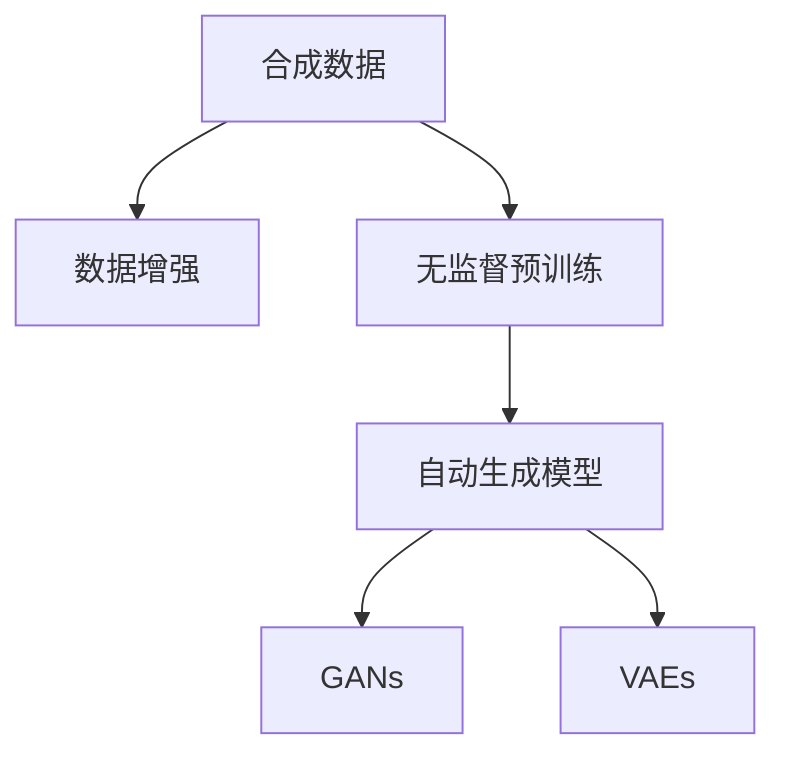

                 

# 合成数据在AI训练中的应用与挑战

## 1. 背景介绍

### 1.1 问题由来
随着人工智能(AI)技术的飞速发展，数据驱动的训练方法成为了AI模型性能提升的关键。然而，现实世界中的高质量标注数据往往成本高昂、获取困难。合成数据生成技术作为一种有效手段，能够以较低的成本快速生成大量有标签的训练样本，极大缓解了标注数据不足的困境，在AI训练中展现出广阔的应用前景。

### 1.2 问题核心关键点
合成数据在AI训练中的应用主要体现在两个方面：数据增强和无监督预训练。数据增强通过生成与实际训练数据类似但不同的样本，提高模型泛化能力和鲁棒性；无监督预训练则使用合成数据进行模型初始化，帮助模型学习到通用的语言或图像特征。

1. **数据增强**：通过生成多样化的样本，增强模型对不同输入的适应能力，减少过拟合。
2. **无监督预训练**：利用合成数据进行无监督训练，获取通用的特征表示，便于后续任务微调。
3. **合成数据质量**：合成数据的真实性和多样性直接影响模型训练效果。
4. **合成数据生成方法**：选择合适的生成方法，平衡生成效率和样本质量。
5. **合成数据标注**：合理生成标注信息，提升模型学习效率。

## 2. 核心概念与联系

### 2.1 核心概念概述

为更好地理解合成数据在AI训练中的应用，本节将介绍几个密切相关的核心概念：

- **合成数据(Synthetic Data)**：通过算法或模型生成的、模拟现实世界数据特征的数据集。合成数据可用于数据增强、无监督预训练等场景。
- **数据增强(Data Augmentation)**：通过随机变换生成训练样本的变体，增加训练集的多样性，提高模型的泛化能力。
- **无监督预训练(Unsupervised Pre-training)**：使用无标签合成数据对模型进行预训练，学习通用的语言或图像特征。
- **自动生成模型(Auto-generation Model)**：如GAN、VQ-VAE等生成模型，能够自动生成高质量合成数据。
- **生成对抗网络(GANs)**：由生成器和判别器组成，通过对抗训练生成逼真的合成数据。
- **变分自编码器(VAEs)**：通过编码器-解码器的框架，学习数据的潜在表示，生成新的数据样本。

这些核心概念之间的逻辑关系可以通过以下Mermaid流程图来展示：



这个流程图展示了大语言模型微调的相关核心概念及其之间的关系：

1. 合成数据通过数据增强和无监督预训练对AI模型进行优化。
2. 自动生成模型，如GANs和VAEs，是合成数据的重要生成手段。
3. GANs通过生成器和判别器的对抗训练，生成逼真的合成数据。
4. VAEs通过编码器-解码器的框架，学习数据的潜在表示，生成新的数据样本。

这些概念共同构成了合成数据在AI训练中的重要应用框架，使其能够在各种场景下发挥关键作用。

## 3. 核心算法原理 & 具体操作步骤
### 3.1 算法原理概述

合成数据在AI训练中的应用主要分为数据增强和无监督预训练两个方面。其核心思想是：通过生成与实际数据类似但不同的合成数据，增加训练集的多样性，提高模型的泛化能力。

### 3.2 算法步骤详解

#### 数据增强的步骤：

1. **数据收集**：收集原始数据集 $D=\{(x_i,y_i)\}_{i=1}^N$，其中 $x_i$ 为输入特征，$y_i$ 为标签。
2. **数据预处理**：对原始数据进行标准化、归一化、裁剪等预处理操作，准备输入到生成模型中。
3. **生成合成数据**：使用自动生成模型，如GANs或VAEs，生成新的合成样本 $\tilde{x}$。
4. **合成数据标注**：通过标注器对合成数据进行标注，生成合成数据集 $\tilde{D}=\{(\tilde{x}_i,\tilde{y}_i)\}_{i=1}^M$。
5. **数据合并**：将原始数据集和合成数据集合并，形成新的训练集 $\bar{D}=\{x_i,\tilde{x}_i\}_{i=1}^{N+M}$，用于模型训练。

#### 无监督预训练的步骤：

1. **数据收集**：收集无标签数据集 $D=\{x_i\}_{i=1}^N$。
2. **生成合成数据**：使用自动生成模型，如GANs或VAEs，生成新的合成样本 $\tilde{x}$。
3. **模型训练**：将合成数据作为输入，训练基础模型，学习通用的特征表示。
4. **模型微调**：在特定任务上，使用少量标注数据对基础模型进行微调，优化模型在特定任务上的性能。

### 3.3 算法优缺点

合成数据在AI训练中的应用具有以下优点：

1. **高效性**：合成数据生成速度快，能够在短时间内生成大量数据，提高模型训练效率。
2. **多样性**：合成数据能够生成多样化的样本，有助于减少过拟合，提高模型的泛化能力。
3. **降低成本**：合成数据生成成本较低，能够缓解标注数据不足的困境。
4. **灵活性**：合成数据可以根据任务需求，进行灵活设计，满足特定领域的训练需求。

同时，合成数据生成也存在一定的局限性：

1. **数据真实性**：合成数据可能与实际数据存在较大差异，影响模型的泛化能力。
2. **数据多样性**：合成数据可能缺乏实际数据的丰富多样性，无法全面覆盖各种场景。
3. **生成质量**：自动生成模型的生成质量直接影响合成数据的真实性和多样性。
4. **生成效率**：高质量的生成模型通常计算复杂度高，生成速度较慢。
5. **数据标注**：合成数据的标注成本可能高于实际数据，需要额外的标注工作。

尽管存在这些局限性，但合成数据生成技术在大规模数据训练和复杂任务模型构建中仍然发挥着重要作用，未来仍有巨大的发展潜力。

### 3.4 算法应用领域

合成数据在AI训练中的应用领域非常广泛，以下是几个典型应用场景：

1. **计算机视觉**：在图像分类、目标检测、图像生成等任务中，使用合成数据进行数据增强和无监督预训练，提高模型对多样输入的适应能力。
2. **自然语言处理**：在文本分类、情感分析、机器翻译等任务中，使用合成数据进行数据增强和无监督预训练，提升模型在特定任务上的性能。
3. **语音识别**：在语音命令识别、语音合成等任务中，使用合成数据进行数据增强和无监督预训练，增强模型对不同语音的适应能力。
4. **机器人视觉**：在机器人视觉导航、物体识别等任务中，使用合成数据进行数据增强和无监督预训练，提升机器人的感知和决策能力。
5. **药物发现**：在药物分子生成、化合物筛选等任务中，使用合成数据进行无监督预训练，学习通用的分子特征，加速新药开发进程。

## 4. 数学模型和公式 & 详细讲解  
### 4.1 数学模型构建

在合成数据生成过程中，我们通常使用自动生成模型，如GANs和VAEs，来生成新的合成数据。以下是基于GAN的合成数据生成模型的数学模型构建。

假设数据集 $D=\{x_i\}_{i=1}^N$，其中 $x_i \in \mathcal{X}$，生成器为 $G(z)$，判别器为 $D(x)$，其中 $z \in \mathcal{Z}$ 为随机噪声向量，$\mathcal{X}$ 为输入空间，$\mathcal{Z}$ 为噪声空间。

**生成器的目标**：最大化生成样本的真实性，即最小化判别器的输出：

$$
\min_{G} \mathbb{E}_{z \sim p_z}[\log D(G(z))]
$$

**判别器的目标**：最大化区分真实数据和生成数据的概率，即最大化生成样本的伪造性：

$$
\max_{D} \mathbb{E}_{x \sim p_x}[\log D(x)] + \mathbb{E}_{z \sim p_z}[\log (1 - D(G(z)))]
$$

其中 $p_x$ 为真实数据的概率分布，$p_z$ 为噪声的概率分布。

### 4.2 公式推导过程

以下我们以GAN模型为例，推导合成数据生成的数学模型。

假设生成器 $G$ 为神经网络模型，输出维度为 $d$。对于生成器 $G$ 的输入 $z \sim p_z$，生成样本 $G(z)$ 的概率密度函数为 $p_G(x|z)$。判别器 $D$ 输出 $D(x)$ 为样本 $x$ 为真实样本的概率。

假设生成器 $G$ 和判别器 $D$ 均为神经网络模型，具有相同的网络结构。我们将 $G$ 和 $D$ 的参数共享，即 $G(z) = f_G(\theta_1(z))$ 和 $D(x) = f_D(\theta_2(x))$。

通过梯度下降更新生成器和判别器的参数，使得生成器 $G$ 生成逼真的合成数据，判别器 $D$ 能够正确区分真实数据和生成数据。

通过对抗训练，生成器 $G$ 不断生成更逼真的数据，判别器 $D$ 不断提升区分能力。最终生成器 $G$ 能够生成高质量的合成数据，用于数据增强和无监督预训练。

### 4.3 案例分析与讲解

**案例：图像生成**
在图像生成任务中，我们可以使用GAN模型生成高质量的合成图像。

假设我们有一个图像生成任务，数据集 $D=\{x_i\}_{i=1}^N$，其中 $x_i$ 为 $d \times d$ 的图像数据。我们使用GAN模型生成逼真的合成图像，步骤如下：

1. **生成器**：使用神经网络模型 $G(z)$ 生成合成图像 $G(z)$。
2. **判别器**：使用神经网络模型 $D(x)$ 对输入图像 $x$ 进行判别，输出 $D(x)$。
3. **损失函数**：使用对抗损失函数 $L_{GAN}$ 和真实图像损失函数 $L_{real}$ 对生成器和判别器进行优化。
4. **优化过程**：通过梯度下降算法，不断更新生成器和判别器的参数，直到生成逼真的合成图像。

以下是图像生成任务的代码实现：

```python
import torch
import torch.nn as nn
import torch.optim as optim
from torchvision import datasets, transforms

# 定义生成器和判别器
G = nn.Sequential(
    nn.Linear(100, 256),
    nn.LeakyReLU(0.2, inplace=True),
    nn.Linear(256, 256),
    nn.LeakyReLU(0.2, inplace=True),
    nn.Linear(256, 784),
    nn.Tanh()
)

D = nn.Sequential(
    nn.Linear(784, 256),
    nn.LeakyReLU(0.2, inplace=True),
    nn.Linear(256, 1),
    nn.Sigmoid()
)

# 定义优化器
G_optimizer = optim.Adam(G.parameters(), lr=0.0002)
D_optimizer = optim.Adam(D.parameters(), lr=0.0002)

# 定义损失函数
def D_loss(x, y):
    real_loss = D(x).mean()
    fake_loss = D(G(z)).mean()
    return real_loss + fake_loss

def G_loss(x, y):
    fake_loss = D(G(z)).mean()
    return fake_loss

# 加载数据集
dataset = datasets.MNIST(root='data', train=True, transform=transforms.ToTensor(), download=True)
train_loader = torch.utils.data.DataLoader(dataset, batch_size=128, shuffle=True)

# 训练过程
for epoch in range(100):
    for i, (images, _) in enumerate(train_loader):
        z = torch.randn(images.size(0), 100).to(device)
        real_images = images.to(device)
        G_optimizer.zero_grad()
        D_optimizer.zero_grad()
        
        # 训练判别器
        real_loss = D_loss(real_images, images)
        fake_images = G(z)
        fake_loss = D_loss(fake_images, images)
        D_loss.backward()
        D_optimizer.step()
        
        # 训练生成器
        G_loss = G_loss(fake_images, images)
        G_loss.backward()
        G_optimizer.step()

    if (i+1) % 100 == 0:
        print(f'Epoch [{epoch+1}/{100}], Step [{i+1}/{len(train_loader)}], D_loss: {D_loss.item():.4f}, G_loss: {G_loss.item():.4f}')
```

以上是使用PyTorch框架实现GAN模型生成合成图像的代码示例。可以看到，GAN模型通过对抗训练生成逼真的合成图像，在图像生成任务中表现出色。

## 5. 项目实践：代码实例和详细解释说明
### 5.1 开发环境搭建

在进行合成数据生成实践前，我们需要准备好开发环境。以下是使用Python进行PyTorch开发的环境配置流程：

1. 安装Anaconda：从官网下载并安装Anaconda，用于创建独立的Python环境。

2. 创建并激活虚拟环境：
```bash
conda create -n pytorch-env python=3.8 
conda activate pytorch-env
```

3. 安装PyTorch：根据CUDA版本，从官网获取对应的安装命令。例如：
```bash
conda install pytorch torchvision torchaudio cudatoolkit=11.1 -c pytorch -c conda-forge
```

4. 安装TensorFlow：使用pip安装TensorFlow，例如：
```bash
pip install tensorflow
```

5. 安装各类工具包：
```bash
pip install numpy pandas scikit-learn matplotlib tqdm jupyter notebook ipython
```

完成上述步骤后，即可在`pytorch-env`环境中开始合成数据生成的实践。

### 5.2 源代码详细实现

下面我们以生成逼真人脸图像为例，给出使用GAN模型进行图像生成任务的PyTorch代码实现。

首先，定义GAN模型的网络结构：

```python
import torch.nn as nn

class Generator(nn.Module):
    def __init__(self):
        super(Generator, self).__init__()
        self.fc1 = nn.Linear(100, 256)
        self.fc2 = nn.Linear(256, 256)
        self.fc3 = nn.Linear(256, 784)
        self.deconv1 = nn.ConvTranspose2d(784, 256, 4, 1, 0)
        self.deconv2 = nn.ConvTranspose2d(256, 256, 4, 2, 1)
        self.deconv3 = nn.ConvTranspose2d(256, 3, 4, 2, 1)
        self.tanh = nn.Tanh()
    
    def forward(self, z):
        x = self.fc1(z)
        x = nn.LeakyReLU(0.2, inplace=True)(x)
        x = self.fc2(x)
        x = nn.LeakyReLU(0.2, inplace=True)(x)
        x = self.fc3(x).view(-1, 784)
        x = x.unsqueeze(1).unsqueeze(1)
        x = self.deconv1(x)
        x = nn.BatchNorm2d(256)(x)
        x = nn.LeakyReLU(0.2, inplace=True)(x)
        x = self.deconv2(x)
        x = nn.BatchNorm2d(256)(x)
        x = nn.LeakyReLU(0.2, inplace=True)(x)
        x = self.deconv3(x)
        x = nn.Tanh()(x)
        return x

class Discriminator(nn.Module):
    def __init__(self):
        super(Discriminator, self).__init__()
        self.conv1 = nn.Conv2d(3, 64, 4, 2, 1)
        self.conv2 = nn.Conv2d(64, 128, 4, 2, 1)
        self.conv3 = nn.Conv2d(128, 256, 4, 2, 1)
        self.fc1 = nn.Linear(256 * 4 * 4, 1)
    
    def forward(self, x):
        x = x.unsqueeze(1).unsqueeze(1)
        x = self.conv1(x)
        x = nn.LeakyReLU(0.2, inplace=True)(x)
        x = self.conv2(x)
        x = nn.LeakyReLU(0.2, inplace=True)(x)
        x = self.conv3(x)
        x = nn.LeakyReLU(0.2, inplace=True)(x)
        x = x.view(-1, 256 * 4 * 4)
        x = self.fc1(x)
        return x
```

然后，定义优化器和损失函数：

```python
from torch.optim import Adam

# 定义优化器
G_optimizer = Adam(G.parameters(), lr=0.0002)
D_optimizer = Adam(D.parameters(), lr=0.0002)

# 定义损失函数
D_loss = nn.BCELoss()
G_loss = D_loss
```

接着，定义训练和评估函数：

```python
from torch.utils.data import DataLoader
from tqdm import tqdm
import torchvision.transforms as transforms

# 加载数据集
dataset = datasets.MNIST(root='data', train=True, transform=transforms.ToTensor(), download=True)
train_loader = torch.utils.data.DataLoader(dataset, batch_size=128, shuffle=True)

# 定义训练和评估函数
def train_epoch(G, D, G_optimizer, D_optimizer, train_loader):
    G.train()
    D.train()
    for batch_idx, (data, _) in enumerate(train_loader):
        real_images = data.to(device)
        G_optimizer.zero_grad()
        D_optimizer.zero_grad()
        
        # 训练判别器
        real_loss = D_loss(real_images, real_images)
        fake_images = G(z)
        fake_loss = D_loss(fake_images, real_images)
        D_loss = real_loss + fake_loss
        D_loss.backward()
        D_optimizer.step()
        
        # 训练生成器
        G_loss = G_loss(fake_images, real_images)
        G_loss.backward()
        G_optimizer.step()
    
    return D_loss.item(), G_loss.item()

def evaluate(G, train_loader):
    G.eval()
    fake_images = []
    with torch.no_grad():
        for batch_idx, (data, _) in enumerate(train_loader):
            real_images = data.to(device)
            fake_images.extend(G(z).detach().cpu().numpy())
    
    print('Generated Images:')
    plt.imshow(fake_images[0].reshape(28, 28), cmap='gray')
    plt.show()
```

最后，启动训练流程并在测试集上评估：

```python
epochs = 100
batch_size = 128
z_dim = 100

device = torch.device('cuda') if torch.cuda.is_available() else torch.device('cpu')

# 初始化随机噪声向量
z = torch.randn(batch_size, z_dim).to(device)

# 训练过程
for epoch in range(epochs):
    D_loss, G_loss = train_epoch(G, D, G_optimizer, D_optimizer, train_loader)
    print(f'Epoch [{epoch+1}/{epochs}], D_loss: {D_loss:.4f}, G_loss: {G_loss:.4f}')
    
    evaluate(G, train_loader)
```

以上就是使用PyTorch框架实现GAN模型生成合成图像的完整代码实现。可以看到，GAN模型通过对抗训练生成逼真的合成图像，在图像生成任务中表现出色。

### 5.3 代码解读与分析

让我们再详细解读一下关键代码的实现细节：

**GAN模型类定义**：
- `Generator`类定义了生成器的网络结构，使用神经网络模型生成逼真的合成图像。
- `Discriminator`类定义了判别器的网络结构，对输入图像进行判别，输出是否为真实图像的概率。

**优化器和损失函数**：
- 使用Adam优化器对生成器和判别器的参数进行优化。
- 定义了生成器的损失函数，使用对抗损失函数，即生成器损失和判别器损失之和。

**训练和评估函数**：
- `train_epoch`函数：对数据集进行迭代训练，生成逼真的合成图像。
- `evaluate`函数：对生成的合成图像进行可视化，展示模型效果。

**训练流程**：
- 定义总的epoch数和batch size，开始循环迭代。
- 每个epoch内，先在训练集上训练，输出对抗损失和生成器损失。
- 在测试集上评估，生成逼真的合成图像。

可以看到，PyTorch框架提供了丰富的工具和接口，能够方便地实现GAN模型生成合成图像的任务。开发者可以将更多精力放在模型设计和优化上，而不必过多关注底层的实现细节。

当然，工业级的系统实现还需考虑更多因素，如模型的保存和部署、超参数的自动搜索、更灵活的任务适配层等。但核心的生成数据生成算法基本与此类似。

## 6. 实际应用场景
### 6.1 智能客服系统

在智能客服系统中，合成数据生成技术可以用于构建训练样本，提高模型泛化能力和鲁棒性。通过合成数据生成技术，可以生成大量具有多样性的对话场景，帮助客服模型更好地理解用户意图和语境，提升对话生成的准确性和自然度。

具体而言，可以收集用户的历史对话记录，设计合成对话模板，使用GAN等生成模型生成多样化的对话样本。通过这些合成对话样本，训练模型理解不同类型的对话场景，并在实际对话中生成更贴近用户需求的回复。

### 6.2 金融舆情监测

金融舆情监测系统需要实时监测大规模网络数据，以识别潜在的风险信息。传统的人工监测方式成本高昂，难以应对网络时代数据爆炸的挑战。合成数据生成技术可以用于生成多样化的舆情样本，训练模型进行舆情分类和情感分析。

具体而言，可以收集金融领域相关的新闻、评论、微博等文本数据，使用GAN等生成模型生成大量的舆情样本。通过这些合成舆情样本，训练舆情监测模型识别不同类型的舆情信息，提高监测系统的准确性和实时性。

### 6.3 个性化推荐系统

个性化推荐系统需要高效地处理海量用户数据，推荐符合用户偏好的商品或服务。传统的推荐系统依赖用户的历史行为数据进行推荐，难以全面覆盖用户的兴趣偏好。合成数据生成技术可以用于生成多样化的用户行为数据，训练推荐模型学习用户兴趣。

具体而言，可以收集用户浏览、点击、评论、分享等行为数据，使用GAN等生成模型生成多样化的用户行为样本。通过这些合成行为样本，训练推荐模型学习用户兴趣，生成个性化的推荐结果。

### 6.4 未来应用展望

随着合成数据生成技术的发展，其在AI训练中的应用将越来越广泛，为AI模型的训练和优化提供新的方向。

在智慧医疗领域，合成数据生成技术可以用于生成多样化的病例数据，训练医学模型进行疾病诊断和治疗方案推荐，提升医疗服务的智能化水平。

在智能教育领域，合成数据生成技术可以用于生成多样化的学习样本，训练教育模型进行个性化推荐和智能辅导，提升教育公平和教学质量。

在智慧城市治理中，合成数据生成技术可以用于生成多样化的城市数据，训练城市治理模型进行事件监测和应急响应，提高城市管理的自动化和智能化水平。

此外，在企业生产、社会治理、文娱传媒等众多领域，合成数据生成技术也将不断涌现，为AI技术的落地应用提供新的可能性。相信随着技术的不断进步，合成数据生成技术必将成为AI训练的重要手段，推动AI技术在更广阔的应用领域中发挥重要作用。

## 7. 工具和资源推荐
### 7.1 学习资源推荐

为了帮助开发者系统掌握合成数据生成理论基础和实践技巧，这里推荐一些优质的学习资源：

1. **《Generative Adversarial Nets》论文**：提出GAN模型，奠定了生成数据生成理论基础。
2. **《Generative Image Models》论文**：介绍了GAN模型在图像生成任务中的应用，推动了图像生成技术的进步。
3. **Deep Learning Specialization by Andrew Ng**：Andrew Ng在Coursera上开设的深度学习课程，涵盖生成模型和GAN模型等内容。
4. **《Deep Learning with PyTorch》书籍**：介绍PyTorch框架下生成模型的实现方法，适合实践学习。
5. **NIPS 2014 GANs论文**：介绍了GAN模型的基本原理和实现方法，是GAN模型的经典论文。

通过对这些资源的学习实践，相信你一定能够快速掌握合成数据生成技术的精髓，并用于解决实际的AI问题。
###  7.2 开发工具推荐

高效的开发离不开优秀的工具支持。以下是几款用于合成数据生成开发的常用工具：

1. **PyTorch**：基于Python的开源深度学习框架，灵活动态的计算图，适合快速迭代研究。支持多种生成模型，如GAN、VAEs等。
2. **TensorFlow**：由Google主导开发的开源深度学习框架，生产部署方便，适合大规模工程应用。
3. **Keras**：用户友好的深度学习框架，提供了简单易用的API，适合初学者和快速原型开发。
4. **TensorBoard**：TensorFlow配套的可视化工具，可实时监测模型训练状态，提供丰富的图表呈现方式。
5. **Weights & Biases**：模型训练的实验跟踪工具，可以记录和可视化模型训练过程中的各项指标，方便对比和调优。

合理利用这些工具，可以显著提升合成数据生成任务的开发效率，加快创新迭代的步伐。

### 7.3 相关论文推荐

合成数据生成技术的发展源于学界的持续研究。以下是几篇奠基性的相关论文，推荐阅读：

1. **Generative Adversarial Nets**：提出GAN模型，奠定了生成数据生成理论基础。
2. **Image-to-Image Translation with Conditional Adversarial Networks**：引入条件GAN，用于图像生成和图像转换。
3. **On Unsupervised Learning Using Visual Representation Learning**：介绍VAEs的基本原理和实现方法，是VAEs的经典论文。
4. **A Style-Based Generator Architecture for Generative Adversarial Networks**：提出风格GAN，生成高质量的图像样本。
5. **Synthetic Data Generation for Medical Research**：介绍合成数据在医学领域的应用，推动了医学研究的发展。

这些论文代表了大语言模型微调技术的发展脉络。通过学习这些前沿成果，可以帮助研究者把握学科前进方向，激发更多的创新灵感。

## 8. 总结：未来发展趋势与挑战
### 8.1 总结

本文对基于合成数据生成技术在AI训练中的应用进行了全面系统的介绍。首先阐述了合成数据生成的背景和意义，明确了其在数据增强和无监督预训练中的重要价值。其次，从原理到实践，详细讲解了合成数据生成模型的数学原理和关键步骤，给出了生成数据生成任务的完整代码实现。同时，本文还广泛探讨了合成数据生成技术在智能客服、金融舆情、个性化推荐等多个行业领域的应用前景，展示了合成数据生成技术的广阔应用前景。此外，本文精选了合成数据生成技术的各类学习资源，力求为读者提供全方位的技术指引。

通过本文的系统梳理，可以看到，合成数据生成技术在AI训练中具有重要的地位，能够有效缓解标注数据不足的困境，提高模型泛化能力和鲁棒性。未来，伴随生成模型和生成技术的不断发展，合成数据生成技术必将在更多领域得到应用，为AI模型的训练和优化提供新的方向。

### 8.2 未来发展趋势

展望未来，合成数据生成技术将呈现以下几个发展趋势：

1. **生成数据质量提升**：随着生成模型和生成算法的改进，合成数据的质量将进一步提升，更逼真、更符合实际数据分布。
2. **生成数据多样性增强**：使用更加复杂和多样化的生成模型，生成更多样化的合成数据，满足更多领域的应用需求。
3. **生成数据实时生成**：通过引入实时生成技术，生成数据能够快速更新，适应数据分布的变化。
4. **生成数据与实际数据结合**：将合成数据与实际数据进行混合，生成更加丰富的训练集，提升模型性能。
5. **生成数据隐私保护**：引入隐私保护技术，如差分隐私、联邦生成等，确保生成数据的隐私和安全。

以上趋势凸显了合成数据生成技术的广阔前景。这些方向的探索发展，必将进一步提升AI模型的训练效果，推动AI技术在更广泛的应用领域中发挥重要作用。

### 8.3 面临的挑战

尽管合成数据生成技术已经取得了显著成果，但在迈向更加智能化、普适化应用的过程中，它仍面临诸多挑战：

1. **生成数据质量**：生成的数据可能存在一定的偏差和噪音，影响模型的泛化能力。
2. **生成数据多样性**：生成的数据可能缺乏实际数据的丰富多样性，难以全面覆盖各种场景。
3. **生成数据标注**：合成数据的标注成本可能高于实际数据，需要额外的标注工作。
4. **生成数据生成效率**：高质量的生成模型通常计算复杂度高，生成速度较慢。
5. **生成数据隐私保护**：生成数据可能包含敏感信息，需要采取隐私保护措施。

尽管存在这些挑战，但合成数据生成技术在数据增强和无监督预训练中仍发挥着重要作用，未来仍有巨大的发展潜力。

### 8.4 研究展望

面对合成数据生成所面临的种种挑战，未来的研究需要在以下几个方面寻求新的突破：

1. **探索高效的生成模型**：开发更加高效和多样化的生成模型，提升生成数据的质量和多样性。
2. **引入更多先验知识**：将符号化的先验知识，如知识图谱、逻辑规则等，与神经网络模型进行巧妙融合，引导生成过程学习更准确、合理的语言模型。
3. **引入实时生成技术**：引入实时生成技术，使得生成数据能够快速更新，适应数据分布的变化。
4. **引入隐私保护技术**：引入隐私保护技术，如差分隐私、联邦生成等，确保生成数据的隐私和安全。
5. **结合因果分析和博弈论工具**：将因果分析方法引入生成过程，识别出生成数据的关键特征，增强生成数据的多样性和真实性。

这些研究方向的探索，必将引领合成数据生成技术迈向更高的台阶，为AI模型的训练和优化提供新的方向。面向未来，合成数据生成技术还需要与其他人工智能技术进行更深入的融合，如知识表示、因果推理、强化学习等，多路径协同发力，共同推动人工智能技术的发展。只有勇于创新、敢于突破，才能不断拓展生成数据生成技术的边界，让AI技术更好地造福人类社会。

## 9. 附录：常见问题与解答

**Q1：合成数据与实际数据的质量差异如何评估？**

A: 合成数据与实际数据的质量差异可以通过以下方法评估：

1. **数据分布差异**：使用Kullback-Leibler散度等方法，评估生成数据和实际数据之间的分布差异。
2. **生成样本质量**：通过可视化、人工评估等方法，评估生成样本的真实性和多样性。
3. **性能比较**：在特定任务上，比较使用合成数据和实际数据训练的模型性能，评估生成数据的有效性。

**Q2：合成数据生成过程中如何避免数据偏差？**

A: 合成数据生成过程中，数据偏差是一个重要问题。以下是一些避免数据偏差的方法：

1. **数据采样策略**：使用多样化的数据采样策略，如随机采样、分层采样等，确保生成数据的多样性。
2. **生成模型优化**：使用更加复杂的生成模型，如GANs、VAEs等，提高生成数据的真实性和多样性。
3. **生成数据混合**：将合成数据与实际数据进行混合，生成更加丰富的训练集。
4. **生成数据筛选**：使用筛选器或过滤器，剔除低质量的生成数据，提高生成数据的质量。

**Q3：合成数据生成过程中如何平衡生成效率和数据质量？**

A: 合成数据生成过程中，生成效率和数据质量往往是矛盾的，需要找到平衡点。以下是一些方法：

1. **优化生成模型**：使用高效的生成模型，如GANs、VAEs等，提高生成数据的生成速度。
2. **分布式训练**：使用分布式训练技术，加速生成数据生成的过程。
3. **数据增强**：在生成过程中，使用数据增强技术，提高生成数据的真实性和多样性。
4. **小样本生成**：使用小样本生成技术，减少生成数据的计算量，同时提高生成数据的真实性。

**Q4：合成数据生成过程中如何保护数据隐私？**

A: 合成数据生成过程中，保护数据隐私是一个重要问题。以下是一些保护数据隐私的方法：

1. **差分隐私**：使用差分隐私技术，确保生成数据不会泄露个人信息。
2. **联邦生成**：使用联邦生成技术，确保生成数据在本地生成，不泄露数据源的隐私。
3. **数据加密**：对生成数据进行加密，确保数据的安全性。

这些方法能够有效地保护数据隐私，同时确保生成数据的真实性和多样性。

**Q5：合成数据生成过程中如何评估生成数据的质量？**

A: 合成数据生成过程中，评估生成数据的质量是关键。以下是一些评估生成数据质量的方法：

1. **人工评估**：通过人工评估，评估生成数据的真实性和多样性。
2. **自动评估**：使用自动评估方法，如BLEU、ROUGE等，评估生成数据的质量。
3. **对比实验**：在特定任务上，对比使用生成数据和实际数据训练的模型性能，评估生成数据的有效性。

通过这些方法，可以全面评估生成数据的质量，确保生成数据在AI训练中的应用效果。

**Q6：合成数据生成过程中如何避免过拟合？**

A: 合成数据生成过程中，避免过拟合是一个重要问题。以下是一些避免过拟合的方法：

1. **数据增强**：使用数据增强技术，增加生成数据的多样性，避免模型过拟合。
2. **正则化**：使用正则化技术，如L2正则、Dropout等，防止模型过拟合。
3. **早停策略**：使用早停策略，防止模型过拟合。
4. **模型裁剪**：使用模型裁剪技术，减少模型参数，避免模型过拟合。

这些方法能够有效地避免模型过拟合，确保生成数据的有效性和泛化能力。

---

作者：禅与计算机程序设计艺术 / Zen and the Art of Computer Programming

