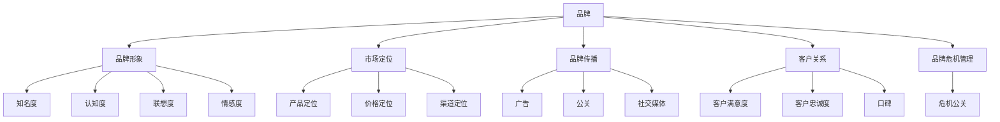

                 

# 品牌管理：建立和维护强大品牌形象

> 关键词：品牌管理, 品牌形象, 市场定位, 品牌传播, 客户关系, 品牌危机

## 1. 背景介绍

在激烈的市场竞争中，品牌形象已成为企业生存与发展的关键。优秀的品牌不仅能够吸引和保持客户，还能提升市场价值，驱动业务增长。品牌管理作为企业战略的重要组成部分，其核心在于塑造并维护一个独特、有价值的品牌形象，以在市场中脱颖而出。本文将详细阐述品牌管理的核心概念和具体操作方法，并通过一系列的案例分析，展示如何通过科学的品牌管理策略，打造和维护强大品牌形象。

## 2. 核心概念与联系

### 2.1 核心概念概述

品牌管理涉及多个关键概念，这些概念之间存在紧密的联系，共同构成品牌管理的核心框架。

1. **品牌**：是企业向市场和消费者传达的独特身份和价值主张。品牌不仅仅是一个名字或标识，更是一系列消费者体验的总和。

2. **品牌形象**：指消费者对品牌的认知和感受，包括品牌的知名度、认知度、联想度、情感度等。品牌形象是品牌管理的主要关注点，需要通过一系列策略进行塑造和维护。

3. **市场定位**：指企业在目标市场中确定的位置，包括产品定位、价格定位、渠道定位等。市场定位直接影响品牌形象的构建。

4. **品牌传播**：通过多种渠道向目标受众传达品牌信息，包括广告、公关、社交媒体等。品牌传播是品牌形象维护的关键手段。

5. **客户关系**：指企业与消费者之间的互动关系，包括客户满意度、忠诚度、口碑等。良好的客户关系是品牌形象的基础。

6. **品牌危机管理**：指在品牌遭遇负面事件时，通过有效的策略和措施进行危机公关，保护品牌形象。

### 2.2 核心概念原理和架构的 Mermaid 流程图



以上流程图展示了品牌管理中各概念之间的关系，其中品牌形象是最终目标，市场定位、品牌传播、客户关系和品牌危机管理共同作用于品牌形象的塑造与维护。

## 3. 核心算法原理 & 具体操作步骤

### 3.1 算法原理概述

品牌管理的核心算法原理主要包括品牌构建、品牌传播、客户关系维护和品牌危机处理。这些算法原理可以归纳为以下几个步骤：

1. **品牌构建**：通过市场调研和数据分析，确定品牌的核心价值和独特卖点，设计品牌标识和口号，制定品牌传播策略。

2. **品牌传播**：选择合适的传播渠道和媒介，制定内容策略，发布品牌信息，监控传播效果，调整传播策略。

3. **客户关系维护**：建立客户反馈机制，定期与客户互动，提升客户满意度和忠诚度，维护良好的口碑。

4. **品牌危机处理**：在品牌遭遇负面事件时，迅速响应，制定应对策略，控制舆情，恢复品牌形象。

### 3.2 算法步骤详解

#### 品牌构建步骤

1. **市场调研**：通过问卷调查、焦点小组、数据分析等方法，了解目标市场的需求、偏好和竞争格局。

2. **品牌定位**：根据调研结果，确定品牌的核心价值和独特卖点，制定品牌定位策略。

3. **品牌标识设计**：设计品牌名称、标识、口号等，确保品牌识别度高，易于传播。

4. **品牌传播策略**：选择适合的传播渠道（如社交媒体、电视、杂志等），制定内容策略，包括广告文案、公关活动等。

#### 品牌传播步骤

1. **渠道选择**：根据目标受众的特征和行为习惯，选择最有效的传播渠道。

2. **内容创作**：制作具有吸引力的内容，包括文字、图片、视频等，确保内容与品牌形象一致。

3. **发布与监测**：通过多渠道发布内容，监测传播效果，如点击率、转化率等。

4. **策略调整**：根据监测结果，调整传播策略，优化传播效果。

#### 客户关系维护步骤

1. **建立反馈机制**：通过问卷、社交媒体、客服等渠道，收集客户反馈。

2. **客户互动**：定期与客户互动，解答疑问，提供帮助，提升客户满意度。

3. **忠诚计划**：设计并实施忠诚计划，如积分奖励、会员特权等，增加客户粘性。

4. **口碑管理**：鼓励客户分享正面体验，处理负面反馈，维护良好的品牌口碑。

#### 品牌危机处理步骤

1. **快速响应**：在品牌遭遇负面事件时，迅速响应，制定应急预案。

2. **信息透明**：及时向公众通报事件进展，保持信息透明。

3. **危机公关**：通过媒体、社交媒体等渠道，发布官方声明，控制舆情。

4. **恢复形象**：采取措施恢复品牌形象，如调整产品策略、提升服务质量等。

### 3.3 算法优缺点

#### 优点

1. **提升市场竞争力**：通过科学的品牌管理，提升品牌的知名度、认知度和美誉度，增强市场竞争力。

2. **优化客户关系**：通过建立良好的客户关系，提升客户满意度和忠诚度，增加客户粘性。

3. **风险控制**：通过有效的品牌危机管理，减少负面事件对品牌的影响，保障品牌形象。

#### 缺点

1. **资源投入大**：品牌管理需要大量的时间、人力和资金投入，特别是品牌构建和传播阶段。

2. **效果不确定**：品牌管理的效果受多种因素影响，如市场环境、竞争态势、消费者行为等，难以完全掌控。

3. **需持续投入**：品牌形象的维护需要持续的努力和投入，不能一劳永逸。

### 3.4 算法应用领域

品牌管理的应用领域非常广泛，涵盖多个行业，如消费品、金融、科技、医疗等。以下是几个典型的应用场景：

1. **消费品行业**：通过品牌构建和传播，提升产品知名度和市场占有率。

2. **金融行业**：通过品牌形象塑造，提升客户信任度和品牌忠诚度。

3. **科技行业**：通过品牌传播，提高技术创新和市场影响力。

4. **医疗行业**：通过品牌危机管理，维护品牌形象，提升患者信任度。

## 4. 数学模型和公式 & 详细讲解 & 举例说明

### 4.1 数学模型构建

品牌管理的数学模型可以抽象为一个线性回归模型，其中品牌形象为因变量，市场定位、品牌传播、客户关系和品牌危机管理为自变量。数学模型表达式如下：

$$
Y = \beta_0 + \beta_1 X_1 + \beta_2 X_2 + \beta_3 X_3 + \beta_4 X_4 + \epsilon
$$

其中：
- $Y$：品牌形象评分
- $\beta_0$：截距项
- $\beta_1$：市场定位对品牌形象的影响系数
- $\beta_2$：品牌传播对品牌形象的影响系数
- $\beta_3$：客户关系对品牌形象的影响系数
- $\beta_4$：品牌危机管理对品牌形象的影响系数
- $\epsilon$：误差项

### 4.2 公式推导过程

根据线性回归的基本原理，通过最小二乘法求解各系数$\beta_i$，使得预测值与真实值之间的误差最小化。具体推导过程如下：

1. **数据准备**：收集品牌形象评分、市场定位、品牌传播、客户关系和品牌危机管理的数据。

2. **模型构建**：根据线性回归模型，构建品牌形象的预测模型。

3. **参数求解**：使用最小二乘法求解各系数$\beta_i$，使得预测值与真实值之间的误差最小化。

4. **模型评估**：使用测试数据评估模型的准确性和稳定性，调整参数，优化模型。

### 4.3 案例分析与讲解

以一家科技公司的品牌管理为例，进行详细分析：

1. **市场调研**：通过问卷调查和数据分析，发现目标用户对产品的性能和创新有较高要求。

2. **品牌定位**：将品牌定位为“创新驱动，技术领先”，制定品牌标识和口号。

3. **品牌传播**：通过社交媒体、科技展会等渠道传播品牌信息，提升品牌知名度。

4. **客户关系维护**：建立客户反馈机制，定期与客户互动，推出技术支持服务，提升客户满意度和忠诚度。

5. **品牌危机处理**：在产品出现质量问题时，迅速响应，发布官方声明，控制舆情，并改进产品，恢复品牌形象。

## 5. 项目实践：代码实例和详细解释说明

### 5.1 开发环境搭建

品牌管理项目需要多种工具和环境支持，以下是一个典型的项目开发环境搭建流程：

1. **环境准备**：安装Python、R等编程语言，配置开发环境。

2. **数据准备**：收集和整理品牌管理的相关数据，包括市场调研数据、品牌传播数据、客户关系数据和品牌危机数据。

3. **工具选择**：选择数据分析工具（如Python的Pandas、NumPy等），数据可视化工具（如Tableau、Power BI等）。

4. **模型选择**：选择适合的机器学习模型，如线性回归、逻辑回归、决策树等。

### 5.2 源代码详细实现

以线性回归模型为例，展示品牌管理数据建模的代码实现：

```python
import pandas as pd
from sklearn.linear_model import LinearRegression
from sklearn.model_selection import train_test_split

# 读取数据
data = pd.read_csv('brand_management_data.csv')

# 数据预处理
X = data[['market_position', 'brand_spread', 'customer_relationship', 'brand_crisis']]
y = data['brand_image_score']

# 分割数据集
X_train, X_test, y_train, y_test = train_test_split(X, y, test_size=0.2, random_state=42)

# 模型训练
model = LinearRegression()
model.fit(X_train, y_train)

# 模型评估
score = model.score(X_test, y_test)
print(f"模型评估得分：{score:.3f}")
```

### 5.3 代码解读与分析

**数据预处理**：
- 读取品牌管理数据集。
- 选择自变量和因变量。

**模型训练**：
- 使用LinearRegression模型。
- 分割数据集，将70%用于训练，30%用于测试。
- 训练模型。

**模型评估**：
- 计算模型在测试集上的评估得分，即R²值。

## 6. 实际应用场景

### 6.1 消费品行业

在消费品行业，品牌管理是提升产品竞争力和市场占有率的关键。企业可以通过品牌构建和传播，提升产品的知名度和认知度。

**案例分析**：某消费品公司推出新产品，通过市场调研发现目标消费者对环保和可持续性有较高关注。公司将品牌定位为“绿色环保，可持续发展”，并通过社交媒体、广告等渠道进行品牌传播。在产品上市后，通过客户关系管理系统与客户互动，收集反馈，不断改进产品，提升客户满意度。

### 6.2 金融行业

在金融行业，品牌管理对于提升客户信任度和品牌忠诚度至关重要。

**案例分析**：某银行在推出新理财产品时，通过品牌构建和传播，强调产品的安全性和高收益。通过品牌危机管理，及时处理客户投诉，提升品牌形象。在客户关系管理中，提供个性化理财服务，增强客户粘性。

### 6.3 科技行业

在科技行业，品牌管理对于提升技术创新和市场影响力至关重要。

**案例分析**：某科技公司推出新产品时，通过品牌传播渠道，如科技展会、社交媒体等，提升品牌知名度。在客户关系管理中，提供技术支持和客户培训，增强客户体验。在品牌危机管理中，快速响应技术问题，发布官方声明，控制舆情，恢复品牌形象。

## 7. 工具和资源推荐

### 7.1 学习资源推荐

为了帮助品牌管理者系统掌握品牌管理的知识和技能，以下是一些优质的学习资源：

1. **《品牌管理》系列书籍**：详细介绍了品牌管理的理论和实践，包括市场定位、品牌传播、客户关系等。

2. **在线课程**：如Coursera、Udemy上的品牌管理课程，涵盖品牌构建、品牌传播、品牌危机管理等。

3. **品牌管理咨询公司**：如Interbrand、Kantar等，提供品牌管理的专业咨询和分析报告。

4. **品牌管理案例集**：如《哈佛商业评论》等杂志，提供丰富的品牌管理案例，供学习和参考。

### 7.2 开发工具推荐

品牌管理项目需要多种工具和环境支持，以下推荐的开发工具可以帮助项目高效进行：

1. **数据处理工具**：如Python的Pandas、R语言、Tableau等，用于数据清洗、分析和可视化。

2. **机器学习工具**：如Scikit-learn、TensorFlow等，用于构建和训练机器学习模型。

3. **项目管理工具**：如Jira、Trello等，用于任务分配、进度跟踪和协作管理。

4. **客户关系管理系统**：如Salesforce、HubSpot等，用于管理客户数据和互动。

### 7.3 相关论文推荐

品牌管理是一个不断发展的领域，以下是几篇具有代表性的相关论文，推荐阅读：

1. **《品牌管理：概念与实践》**：系统介绍了品牌管理的理论和实践，包括市场定位、品牌传播、品牌危机管理等。

2. **《社交媒体对品牌形象的影响》**：分析了社交媒体对品牌形象的影响，提出了基于社交媒体的品牌管理策略。

3. **《品牌危机管理：策略与实践》**：探讨了品牌危机管理的策略和实践，提供了丰富的案例分析。

## 8. 总结：未来发展趋势与挑战

### 8.1 总结

品牌管理作为企业战略的重要组成部分，其核心在于塑造并维护一个独特、有价值的品牌形象。通过科学的品牌管理策略，企业可以提升市场竞争力，优化客户关系，控制品牌危机，实现品牌价值的最大化。本文详细阐述了品牌管理的核心概念和具体操作方法，并通过案例分析，展示了如何通过科学的品牌管理策略，打造和维护强大品牌形象。

通过本文的系统梳理，可以看到，品牌管理不仅需要理论知识，还需要实践经验的积累。品牌管理者需要不断学习和适应市场变化，通过科学的方法和策略，实现品牌的持续发展和价值提升。

### 8.2 未来发展趋势

展望未来，品牌管理将呈现以下几个发展趋势：

1. **数据驱动**：品牌管理的决策将越来越依赖于大数据和人工智能技术，通过数据分析和机器学习模型，优化品牌策略。

2. **个性化定制**：品牌管理将更加注重个性化定制，通过客户数据和行为分析，提供个性化的品牌体验。

3. **多渠道整合**：品牌传播将跨越多个渠道，如社交媒体、电商平台、线下活动等，实现多渠道整合和协同。

4. **实时监控**：品牌管理的监测和评估将更加实时和动态，通过大数据和AI技术，及时调整品牌策略。

5. **可持续发展**：品牌管理将更加注重可持续发展，通过绿色品牌建设，提升品牌形象和市场价值。

6. **全球化扩展**：品牌管理将更加注重全球化扩展，通过跨国品牌传播和客户关系管理，拓展国际市场。

以上趋势凸显了品牌管理的广阔前景，这些方向的探索发展，必将进一步提升品牌的竞争力和市场价值。

### 8.3 面临的挑战

尽管品牌管理在理论和技术上都有长足进步，但在实际应用中也面临诸多挑战：

1. **数据隐私和安全**：品牌管理需要大量的客户数据，如何在保护数据隐私和安全的前提下，进行数据收集和分析，是一个重要挑战。

2. **品牌一致性**：在不同渠道和媒介上，如何保持品牌形象的一致性，是一个复杂的问题。

3. **跨文化差异**：在不同国家和地区，品牌传播和客户关系管理需要考虑文化差异，如何实现全球化扩展，是一个重要挑战。

4. **技术门槛高**：品牌管理涉及多种技术和工具，对于没有技术背景的管理者，需要一定的学习和适应。

5. **市场变化快**：品牌管理的策略需要灵活调整，以应对市场的快速变化。

6. **资源投入大**：品牌管理需要大量的资金和人力投入，特别是品牌构建和传播阶段。

这些挑战需要在实践中不断探索和解决，只有在技术、策略、市场等多个维度协同发力，才能实现品牌的持续发展和价值提升。

### 8.4 研究展望

面对品牌管理面临的种种挑战，未来的研究需要在以下几个方面寻求新的突破：

1. **数据隐私保护技术**：开发更加安全、高效的数据隐私保护技术，保障客户数据的安全和隐私。

2. **品牌一致性算法**：研究如何在不同渠道和媒介上保持品牌形象的一致性，提升品牌传播效果。

3. **跨文化品牌管理**：研究如何在不同国家和地区实现品牌传播和客户关系管理，提高品牌全球化扩展能力。

4. **品牌管理工具**：开发更加易用、高效的品牌管理工具，降低技术门槛，便于品牌管理者使用。

5. **实时监测与预警**：开发实时监测和预警系统，及时发现和处理品牌危机，保护品牌形象。

6. **可持续发展模型**：构建基于可持续发展的品牌管理模型，提升品牌的社会责任感和市场价值。

这些研究方向的探索，必将引领品牌管理技术迈向更高的台阶，为构建安全、可靠、可解释、可控的智能品牌系统铺平道路。面向未来，品牌管理需要与其他人工智能技术进行更深入的融合，如知识表示、因果推理、强化学习等，多路径协同发力，共同推动品牌管理的进步。

## 9. 附录：常见问题与解答

**Q1：品牌管理的重要性是什么？**

A: 品牌管理的重要性在于通过塑造和维护独特的品牌形象，提升企业竞争力，增强客户信任，控制品牌危机，实现品牌价值的最大化。

**Q2：如何构建品牌形象？**

A: 构建品牌形象需要从市场调研开始，确定品牌核心价值和独特卖点，设计品牌标识和口号，制定品牌传播策略，并通过多渠道传播，提升品牌知名度和美誉度。

**Q3：品牌传播的渠道有哪些？**

A: 品牌传播的渠道包括社交媒体、电视、杂志、网站、活动等。选择适合的传播渠道，制定内容策略，发布品牌信息，监控传播效果，调整传播策略。

**Q4：客户关系管理的意义是什么？**

A: 客户关系管理通过建立客户反馈机制、定期与客户互动、提升客户满意度和忠诚度，维护良好的口碑，为品牌提供持续的客户基础和市场支持。

**Q5：如何处理品牌危机？**

A: 品牌危机处理需要迅速响应，发布官方声明，控制舆情，采取措施恢复品牌形象，如调整产品策略、提升服务质量等。

---

作者：禅与计算机程序设计艺术 / Zen and the Art of Computer Programming

