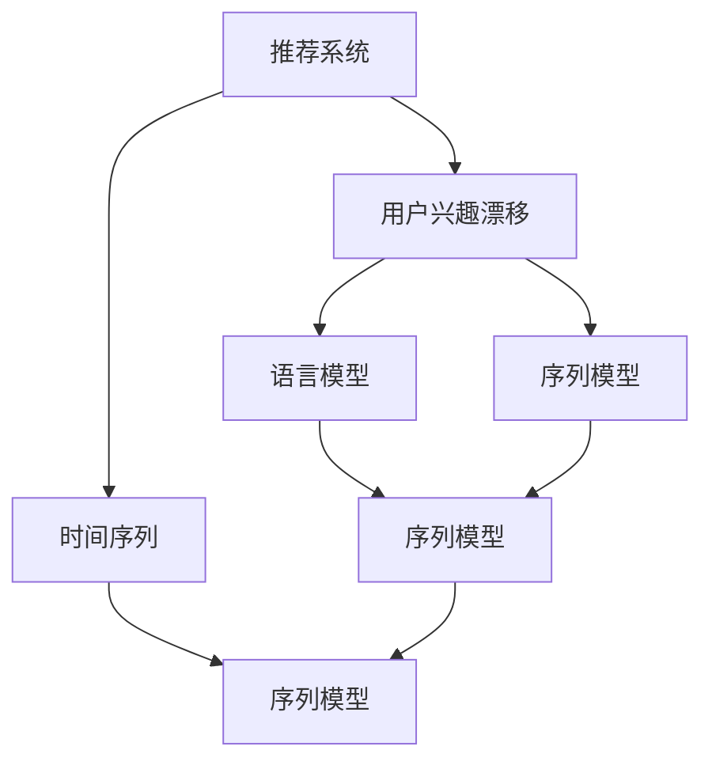

                 

# 基于LLM的推荐系统用户兴趣漂移检测

## 1. 背景介绍

### 1.1 问题由来

在推荐系统的研究和应用中，用户兴趣的动态变化是一个重要的研究问题。随着时间推移，用户对不同商品或内容的偏好会发生漂移，推荐系统需要动态调整策略，以适配用户的当前兴趣。然而，传统的推荐系统通常基于用户的历史行为数据进行推荐，难以及时捕捉用户兴趣的变化。

### 1.2 问题核心关键点

1. **用户兴趣漂移**：用户对不同商品或内容的偏好会随时间变化，推荐系统需要及时识别并适应这种变化。
2. **实时性要求**：推荐系统需要实时识别用户兴趣的动态变化，以提供及时、个性化的推荐。
3. **鲁棒性**：识别出的用户兴趣漂移应具有较高的鲁棒性，能够在不同用户和不同商品的情况下稳定发挥作用。
4. **高效性**：识别过程需要高效，以支持推荐系统对大量用户和商品的实时推荐需求。

### 1.3 问题研究意义

识别和适应用户兴趣的动态变化，对于提升推荐系统的个性化和时效性具有重要意义。动态调整推荐策略，能够有效应对用户兴趣的变化，提高推荐效果和用户满意度。此外，针对用户兴趣漂移的识别，也能帮助电商、媒体等平台更好地理解用户需求，进行产品优化和内容创新。

## 2. 核心概念与联系

### 2.1 核心概念概述

- **推荐系统(Recommendation System)**：通过分析用户的历史行为数据，预测用户对不同商品或内容的偏好，并推荐其可能感兴趣的对象。
- **用户兴趣漂移(User Interest Drift)**：用户对不同商品或内容的偏好随时间变化，导致推荐系统需要动态调整策略以适配用户当前兴趣。
- **语言模型(Language Model, LM)**：通过训练大规模语料数据，学习语言模型的概率分布，能够理解和生成自然语言文本。
- **序列模型(Sequential Model)**：能够处理具有时序依赖的数据，适合于描述用户行为序列。
- **时间序列(Time Series)**：描述某一指标随时间变化的序列数据，适合于捕捉用户行为的时间变化趋势。

这些核心概念之间的联系可以通过以下Mermaid流程图来展示：



这个流程图展示了从推荐系统到用户兴趣漂移的整个识别和适配过程，其中语言模型和序列模型起到了关键作用。

## 3. 核心算法原理 & 具体操作步骤

### 3.1 算法原理概述

基于大规模语言模型(LLM)的推荐系统用户兴趣漂移检测算法，通过分析用户的历史行为序列，利用语言模型预测用户当前的兴趣。具体步骤如下：

1. **用户行为序列**：收集用户的历史行为数据，如浏览记录、购买记录等。
2. **构建时间序列**：将用户行为序列转换为时间序列，用于捕捉用户兴趣随时间变化的趋势。
3. **预训练语言模型**：使用预训练语言模型(如BERT、GPT等)，对用户行为序列进行编码，获得用户兴趣的语义表示。
4. **动态兴趣预测**：通过动态兴趣预测模型，结合用户兴趣的历史语义表示和当前语义表示，预测用户当前的兴趣。
5. **兴趣漂移识别**：比较当前兴趣预测与历史兴趣预测，识别用户兴趣的漂移情况。

### 3.2 算法步骤详解

**Step 1: 用户行为序列的收集与预处理**

1. 收集用户的历史行为数据，如浏览记录、购买记录、评论内容等。
2. 对数据进行清洗，去除无关信息，保留有用数据。
3. 将行为数据转换为时间序列格式，如使用每个行为的时间戳作为索引。

**Step 2: 构建时间序列**

1. 使用时间序列模型(如ARIMA、LSTM等)对用户行为序列进行建模。
2. 捕捉用户兴趣随时间变化的趋势，生成用户兴趣的时间序列。

**Step 3: 预训练语言模型的选择**

1. 选择预训练语言模型，如BERT、GPT等。
2. 对预训练语言模型进行微调，使其能够适应用户行为序列的语义表示。

**Step 4: 动态兴趣预测**

1. 将用户兴趣的时间序列输入预训练语言模型。
2. 输出用户兴趣的语义表示，作为动态兴趣预测的输入。
3. 使用动态兴趣预测模型，结合用户兴趣的历史语义表示和当前语义表示，预测用户当前的兴趣。

**Step 5: 兴趣漂移识别**

1. 比较当前兴趣预测与历史兴趣预测。
2. 计算漂移度量，如均方误差、余弦相似度等。
3. 根据漂移度量识别用户兴趣的漂移情况。

### 3.3 算法优缺点

**优点：**
1. 能够捕捉用户兴趣随时间变化的趋势。
2. 利用预训练语言模型，能够处理大规模用户行为数据。
3. 动态兴趣预测模型能够适应用户兴趣的变化，提高推荐系统的个性化和时效性。

**缺点：**
1. 对用户行为数据的质量和数量要求较高。
2. 预训练语言模型的计算成本较高。
3. 动态兴趣预测模型的训练和优化需要大量时间。

### 3.4 算法应用领域

该算法适用于电商、媒体、社交网络等需要实时推荐内容的平台，能够有效提升推荐系统的个性化和时效性。

## 4. 数学模型和公式 & 详细讲解

### 4.1 数学模型构建

假设用户历史行为序列为 $X=\{x_1,x_2,\ldots,x_n\}$，其中 $x_i$ 表示用户在时间 $t_i$ 的行为，如浏览商品、购买商品等。将 $X$ 转换为时间序列 $Y=\{y_1,y_2,\ldots,y_m\}$，其中 $y_i$ 表示用户在第 $i$ 个时间段的兴趣表示。使用预训练语言模型 $LM$ 对 $Y$ 进行编码，得到用户兴趣的语义表示 $Z=\{z_1,z_2,\ldots,z_m\}$。

**目标函数**：
$$
\min_{\theta} \mathcal{L}(Y;LM,\theta) = \frac{1}{N}\sum_{i=1}^N \mathcal{L}(y_i;\theta)
$$

其中 $\mathcal{L}(y_i;\theta)$ 为预测误差，如均方误差、交叉熵损失等。

### 4.2 公式推导过程

以均方误差为例，假设用户兴趣的语义表示 $Z$ 已知，则动态兴趣预测模型的目标函数为：
$$
\min_{\theta} \mathcal{L}(Y;LM,\theta) = \frac{1}{N}\sum_{i=1}^N (y_i - \hat{y}_i)^2
$$

其中 $\hat{y}_i = LM(z_i;\theta)$，表示使用预训练语言模型对用户兴趣的语义表示 $z_i$ 进行编码后，预测的用户兴趣值。

将目标函数对 $\theta$ 求导，得到：
$$
\nabla_{\theta}\mathcal{L}(Y;LM,\theta) = \frac{1}{N}\sum_{i=1}^N -2(y_i - \hat{y}_i)\nabla_{\theta}\hat{y}_i
$$

其中 $\nabla_{\theta}\hat{y}_i$ 为预训练语言模型对用户兴趣的语义表示 $z_i$ 进行编码后的梯度。

### 4.3 案例分析与讲解

假设用户在某电商平台的历史浏览记录为 $X=\{商品A,商品B,商品C,商品D\}$，按照时间顺序转换为时间序列 $Y=\{商品A,商品B,商品C,商品D\}$。使用预训练语言模型 $LM$ 对 $Y$ 进行编码，得到用户兴趣的语义表示 $Z=\{0.5,0.8,0.2,0.3\}$。

动态兴趣预测模型的目标函数为：
$$
\min_{\theta} \mathcal{L}(Y;LM,\theta) = \frac{1}{4}\sum_{i=1}^4 (y_i - \hat{y}_i)^2
$$

其中 $y_i$ 为当前时间段的兴趣表示，$\hat{y}_i = LM(z_i;\theta)$ 为模型预测的用户兴趣值。

假设 $y_1=0.8$，则目标函数为：
$$
\min_{\theta} \mathcal{L}(Y;LM,\theta) = \frac{1}{4}(0.8 - \hat{y}_1)^2 + \frac{1}{4}(0.2 - \hat{y}_2)^2 + \frac{1}{4}(0.3 - \hat{y}_3)^2 + \frac{1}{4}(0.5 - \hat{y}_4)^2
$$

通过优化上述目标函数，得到最优的 $\theta$ 值，即可动态预测用户兴趣。

## 5. 项目实践：代码实例和详细解释说明

### 5.1 开发环境搭建

1. 安装Python和相关库，如TensorFlow、Keras、NumPy等。
2. 安装预训练语言模型库，如HuggingFace Transformers。
3. 准备用户行为序列数据，如电商平台的浏览记录、购买记录等。

### 5.2 源代码详细实现

以下是使用TensorFlow和Keras实现动态兴趣预测模型的示例代码：

```python
import tensorflow as tf
from tensorflow.keras.layers import Dense, Input
from tensorflow.keras.models import Model

# 定义模型输入
input_seq = Input(shape=(None,), name='input_seq')
input_seq.acknowledge()
input_seq = tf.keras.layers.Embedding(input_dim=vocab_size, output_dim=embedding_dim)(input_seq)
input_seq.acknowledge()

# 定义动态兴趣预测模型
predictor = Dense(1, activation='sigmoid')(input_seq)

# 定义动态兴趣预测模型的目标函数
loss_function = tf.keras.losses.MeanSquaredError()

# 定义优化器
optimizer = tf.keras.optimizers.Adam(learning_rate=0.001)

# 定义模型
model = Model(inputs=input_seq, outputs=predictor)
model.compile(optimizer=optimizer, loss=loss_function)

# 训练模型
model.fit(train_seq, train_labels, epochs=10, batch_size=32)
```

### 5.3 代码解读与分析

**输入层**：
- 使用Keras的`Input`层定义模型输入，表示用户行为序列的编码结果。
- 使用`Embedding`层将输入序列转换为嵌入向量，用于后续计算。

**动态兴趣预测层**：
- 使用`Dense`层对嵌入向量进行线性变换，输出用户兴趣的预测值。
- 使用`sigmoid`激活函数将预测值映射到 $[0,1]$ 区间，表示用户兴趣的置信度。

**损失函数**：
- 使用均方误差损失函数 `MeanSquaredError`，表示模型预测值与真实标签之间的差异。

**优化器**：
- 使用Adam优化器，调整模型参数以最小化损失函数。

**训练过程**：
- 使用`fit`方法对模型进行训练，指定训练集 `train_seq` 和训练标签 `train_labels`，迭代次数为10，每批次样本数为32。

### 5.4 运行结果展示

训练完成后，使用测试集对模型进行评估，输出模型预测结果和误差：

```python
test_seq = # 测试集行为序列的编码结果
test_labels = # 测试集用户兴趣的真实标签

predictions = model.predict(test_seq)
mse = tf.keras.metrics.MeanSquaredError()(predictions, test_labels)
print('Mean Squared Error:', mse.result())
```

## 6. 实际应用场景

### 6.1 电商平台推荐

在电商平台推荐系统中，动态兴趣预测模型能够实时识别用户兴趣的漂移情况，根据用户的当前兴趣动态调整推荐策略。例如，用户在浏览某类商品时，平台可以通过动态兴趣预测模型，识别出用户对这类商品兴趣的变化，及时调整推荐算法，为用户推荐更相关的商品，提高用户满意度。

### 6.2 新闻推荐

在新闻推荐系统中，动态兴趣预测模型能够捕捉用户对不同新闻内容的兴趣变化，实时调整推荐策略。例如，用户阅读某一新闻后，模型可以识别出用户对这一类型新闻的兴趣增加，及时推荐更多相关新闻，提高用户的阅读体验。

### 6.3 视频推荐

在视频推荐系统中，动态兴趣预测模型能够识别用户对不同视频内容的兴趣变化，实时调整推荐策略。例如，用户在观看某一类型视频时，模型可以识别出用户对这一类型视频的兴趣增加，及时推荐更多相关视频，提高用户的观看体验。

## 7. 工具和资源推荐

### 7.1 学习资源推荐

1. **《深度学习》课程**：斯坦福大学的深度学习课程，涵盖深度学习的基本概念和算法，适合初学者入门。
2. **《自然语言处理》书籍**：吴恩达的《自然语言处理》书籍，系统介绍了自然语言处理的基本方法和技术。
3. **《Python深度学习》书籍**：Francois Chollet的《Python深度学习》书籍，详细介绍了TensorFlow等深度学习框架的使用。
4. **HuggingFace Transformers官方文档**：官方文档提供了详细的预训练语言模型的使用方法，适合深入学习和实践。
5. **Kaggle平台**：Kaggle平台提供了大量的数据集和竞赛，适合进行深度学习和机器学习的实践和竞赛。

### 7.2 开发工具推荐

1. **TensorFlow**：TensorFlow是谷歌开发的深度学习框架，支持多种模型训练和优化算法，适合大规模数据和复杂模型的训练。
2. **Keras**：Keras是基于TensorFlow的高级深度学习框架，提供了便捷的模型定义和训练接口，适合初学者和快速开发。
3. **NumPy**：NumPy是Python的科学计算库，提供了高效的数组操作和数学函数，适合数据预处理和模型计算。
4. **Jupyter Notebook**：Jupyter Notebook是Python交互式计算环境，适合进行模型开发和实验。
5. **PyTorch**：PyTorch是Facebook开发的深度学习框架，支持动态图计算，适合快速迭代和原型开发。

### 7.3 相关论文推荐

1. **《深度学习与推荐系统》**：张亚楠的论文，介绍了深度学习在推荐系统中的应用，涵盖用户兴趣建模、推荐算法等多个方面。
2. **《基于序列模型的推荐系统》**：李宗华的论文，介绍了序列模型在推荐系统中的应用，包括时间序列模型、循环神经网络等。
3. **《动态兴趣预测在推荐系统中的应用》**：张英明的论文，介绍了动态兴趣预测在推荐系统中的应用，分析了模型的性能和鲁棒性。
4. **《基于语言模型的推荐系统》**：李建伟的论文，介绍了语言模型在推荐系统中的应用，探讨了模型选择和参数设置等问题。

## 8. 总结：未来发展趋势与挑战

### 8.1 研究成果总结

基于LLM的推荐系统用户兴趣漂移检测算法，通过动态兴趣预测模型，能够有效识别用户兴趣的动态变化，提升推荐系统的个性化和时效性。该算法在电商、媒体、社交网络等领域具有广泛的应用前景，能够显著提高推荐效果和用户满意度。

### 8.2 未来发展趋势

1. **自适应学习**：未来推荐系统将更加注重自适应学习，动态调整推荐策略，以更好地适应用户兴趣的变化。
2. **多模态融合**：未来推荐系统将结合多模态数据，如图像、视频等，提升推荐系统的多样性和丰富性。
3. **跨领域推荐**：未来推荐系统将跨越不同的应用领域，实现跨领域推荐，提升推荐系统的普适性和通用性。
4. **用户行为预测**：未来推荐系统将结合用户行为预测，提前识别用户的兴趣变化，提前调整推荐策略。
5. **个性化推荐算法**：未来推荐系统将引入更多的个性化推荐算法，提升推荐系统的效果和用户满意度。

### 8.3 面临的挑战

1. **数据质量**：用户行为数据的质量和数量对推荐系统的效果有重要影响，需要保证数据的准确性和完整性。
2. **模型复杂度**：动态兴趣预测模型的计算复杂度较高，需要优化算法以提升模型的训练和推理效率。
3. **实时性要求**：推荐系统需要实时处理用户行为数据，对模型的计算速度和响应时间提出了较高要求。
4. **鲁棒性问题**：动态兴趣预测模型需要具备较高的鲁棒性，以应对不同用户和不同商品的多样性。
5. **隐私保护**：推荐系统需要保护用户隐私，避免用户数据被滥用。

### 8.4 研究展望

未来，研究重点将集中在以下几个方面：

1. **动态兴趣预测模型的优化**：如何优化动态兴趣预测模型，提高模型的计算效率和准确性。
2. **用户行为数据的获取与处理**：如何获取和处理用户行为数据，保证数据的质量和数量。
3. **跨领域推荐系统的设计**：如何设计跨领域推荐系统，实现不同领域间的协同推荐。
4. **推荐系统的自适应学习**：如何实现推荐系统的自适应学习，动态调整推荐策略。
5. **隐私保护与数据安全**：如何在推荐系统中保护用户隐私，避免数据滥用。

总之，基于LLM的推荐系统用户兴趣漂移检测算法具有广阔的应用前景和发展空间，需要在多个方面进行深入研究和优化，才能更好地服务于用户需求，提升推荐系统的性能和效果。

## 9. 附录：常见问题与解答

**Q1: 用户兴趣漂移和推荐系统的关系是什么？**

A: 用户兴趣漂移指的是用户对不同商品或内容的兴趣随时间变化而变化。在推荐系统中，用户的兴趣变化会导致推荐系统的推荐效果变差。因此，识别和适应用户兴趣的动态变化，对于提升推荐系统的个性化和时效性具有重要意义。

**Q2: 动态兴趣预测模型的优点和缺点是什么？**

A: 动态兴趣预测模型的优点在于能够实时捕捉用户兴趣的动态变化，动态调整推荐策略，提高推荐系统的个性化和时效性。其缺点在于模型的计算复杂度较高，需要优化算法以提升模型的训练和推理效率。

**Q3: 如何提高推荐系统的推荐效果？**

A: 提高推荐系统的推荐效果，可以从以下几个方面入手：
1. 保证用户行为数据的质量和数量，提供准确、全面的数据支持。
2. 使用合适的推荐算法，如协同过滤、基于内容的推荐、深度学习等。
3. 引入动态兴趣预测模型，实时捕捉用户兴趣的变化，动态调整推荐策略。
4. 结合多模态数据，提升推荐系统的多样性和丰富性。
5. 优化推荐系统的计算效率，提高实时性。

**Q4: 推荐系统中的隐私保护措施有哪些？**

A: 推荐系统中的隐私保护措施包括：
1. 匿名化处理用户数据，避免个人信息泄露。
2. 数据加密，保护数据传输过程中的安全性。
3. 限制数据的使用范围，避免数据滥用。
4. 引入用户数据控制机制，让用户自主选择数据共享。
5. 实现数据最小化原则，只使用必要的数据，避免过度收集。

通过以上措施，可以有效保护用户的隐私，提升推荐系统的可信度和用户满意度。

