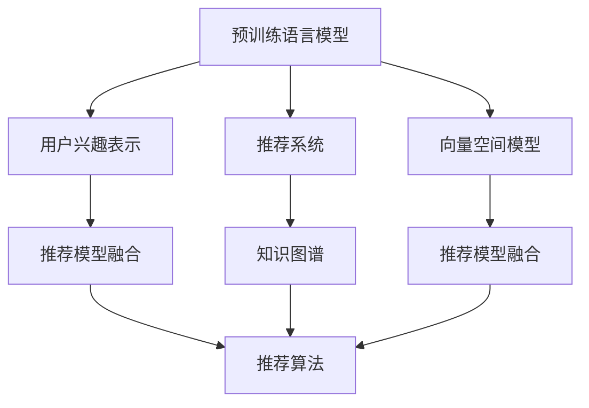

                 

# 基于LLM的推荐系统用户兴趣迁移学习

> 关键词：

## 1. 背景介绍

### 1.1 问题由来
在推荐系统领域，如何准确把握用户的多样化兴趣和行为模式，是提高推荐效果的关键。传统的推荐方法往往依赖于用户的历史行为数据，如点击记录、浏览记录等。然而，在实际应用中，这些数据获取成本高，且可能存在稀疏性、时效性等问题，难以全面反映用户的真实兴趣。近年来，自然语言处理(Natural Language Processing, NLP)技术在推荐系统中得到了广泛应用，其中基于语言模型的推荐方法尤为引人关注。

语言模型，尤其是预训练语言模型(Pre-trained Language Model, PLM)，通过大规模无标签文本数据的自监督学习，已经掌握了丰富的语言表示能力。将这些表示能力应用于推荐系统，可以显著提升推荐精度，帮助系统更好地理解用户的语义需求。但如何有效地将预训练语言模型应用于推荐系统，利用模型学到的知识进行推荐，成为一个值得深入研究的问题。

### 1.2 问题核心关键点
本文聚焦于基于预训练语言模型的推荐系统用户兴趣迁移学习，探索如何通过预训练语言模型，将用户的自然语言描述转化为推荐模型可以理解的形式，提升推荐系统的精准度和个性化水平。核心关键点包括：

1. **预训练语言模型(PLM)**：作为推荐的“知识库”，提供丰富的语言表示能力。
2. **用户兴趣迁移学习**：利用用户自然语言描述，迁移学习到推荐模型的兴趣表示。
3. **推荐模型融合**：将预训练语言模型的知识融合到推荐算法中，提升推荐效果。

## 2. 核心概念与联系

### 2.1 核心概念概述

为更好地理解基于预训练语言模型的推荐系统用户兴趣迁移学习，本节将介绍几个密切相关的核心概念：

- **预训练语言模型(PLM)**：以自回归模型（如GPT）或自编码模型（如BERT）为代表的大规模预训练语言模型。通过在大规模无标签文本数据上进行自监督学习，学习到丰富的语言表示能力。
- **推荐系统**：通过分析用户的历史行为数据，为用户推荐感兴趣的商品、内容等。
- **用户兴趣表示**：将用户的行为、偏好等转化为推荐模型可以理解的形式，以便推荐算法能够准确识别用户需求。
- **迁移学习**：将一个领域学习到的知识，迁移应用到另一个不同但相关的领域的学习范式。
- **知识图谱**：结构化的语义知识表示，常用于提升推荐系统的精准度和个性化。
- **向量空间模型**：将文本、商品等表示为向量空间中的点，利用向量空间的相关性度量进行相似度计算和推荐。

这些核心概念之间的逻辑关系可以通过以下Mermaid流程图来展示：



这个流程图展示了几组关键概念及其之间的关系：

1. 预训练语言模型通过自监督学习获得语言表示能力。
2. 用户兴趣表示将用户的自然语言描述转化为推荐模型可以理解的向量形式。
3. 推荐模型融合将预训练语言模型和向量空间模型的知识，融合到推荐算法中。
4. 推荐算法利用融合后的知识，为用户推荐感兴趣的商品、内容等。
5. 知识图谱常用于增强推荐算法的精准度和个性化。

这些概念共同构成了基于预训练语言模型的推荐系统用户兴趣迁移学习框架，使其能够更精准、个性化地为用户推荐感兴趣的内容。

## 3. 核心算法原理 & 具体操作步骤
### 3.1 算法原理概述

基于预训练语言模型的推荐系统用户兴趣迁移学习，本质上是一种迁移学习过程。其核心思想是：将预训练语言模型作为推荐系统的“知识库”，通过用户的自然语言描述，将用户兴趣迁移到推荐模型中。

具体来说，假设用户的自然语言描述为 $D$，预训练语言模型为 $M_{\theta}$，推荐模型为 $M_{\phi}$。推荐系统的目标是通过迁移学习，使 $M_{\phi}$ 能够根据 $D$ 输出推荐结果，即：

$$
M_{\phi}(D) \approx M_{\theta}(D)
$$

这里的 $\approx$ 表示，推荐模型 $M_{\phi}$ 能够尽可能地“模拟”预训练语言模型 $M_{\theta}$ 的行为，以便生成推荐的输出。

### 3.2 算法步骤详解

基于预训练语言模型的推荐系统用户兴趣迁移学习一般包括以下几个关键步骤：

**Step 1: 准备预训练模型和数据集**
- 选择合适的预训练语言模型 $M_{\theta}$，如GPT-2、BERT等。
- 收集用户的自然语言描述 $D$，并将其转换为推荐模型可以理解的形式。

**Step 2: 定义推荐模型**
- 选择合适的推荐模型结构，如基于神经网络的推荐模型、协同过滤等。
- 在推荐模型中添加预训练语言模型的接口，以便能够处理自然语言描述。

**Step 3: 数据增强与特征工程**
- 对用户的自然语言描述进行数据增强，如近义替换、拼写纠错等，丰富训练集。
- 进行特征工程，将自然语言描述转换为模型可以理解的形式，如文本向量化、实体抽取等。

**Step 4: 迁移学习与训练**
- 将自然语言描述和推荐模型作为输入输出对，使用监督学习的方法训练推荐模型。
- 根据推荐任务的特征，选择合适的损失函数和优化器。

**Step 5: 评估与优化**
- 在测试集上评估推荐模型的效果，如准确率、召回率等。
- 根据评估结果，调整模型参数和超参数，进行优化。

### 3.3 算法优缺点

基于预训练语言模型的推荐系统用户兴趣迁移学习具有以下优点：
1. 提升了推荐的精准度和个性化水平。预训练语言模型学习到丰富的语言表示能力，可以更好地理解用户的自然语言描述，提升推荐效果。
2. 降低了对用户历史行为数据的依赖。利用自然语言描述进行迁移学习，减少了对历史行为数据的获取和标注成本。
3. 可以处理长尾数据。预训练语言模型能够处理未被用户主动标记的数据，提供更全面的推荐。

同时，该方法也存在以下局限性：
1. 依赖高质量的自然语言描述。自然语言描述的质量和数量直接影响迁移学习的效果。
2. 数据增强难度大。对自然语言描述进行有效的数据增强和特征工程，需要较多的时间和专业知识。
3. 推荐模型的泛化能力有待提高。预训练语言模型和推荐模型之间的知识迁移可能存在“冷启动”问题，难以适应新用户和新数据。

尽管存在这些局限性，但就目前而言，基于预训练语言模型的推荐方法仍然是一种高效、可行的解决方案。未来相关研究的重点在于如何进一步提高自然语言描述的质量和数量，增强推荐模型的泛化能力，以及改进数据增强和特征工程方法。

### 3.4 算法应用领域

基于预训练语言模型的推荐系统用户兴趣迁移学习在多个领域得到了应用，包括但不限于：

- **电子商务**：为购物用户推荐感兴趣的商品。利用用户评论、产品描述等自然语言数据，提升推荐精度。
- **内容推荐**：为用户推荐感兴趣的文章、视频等。利用用户评论、标签等自然语言数据，增强内容推荐的多样性和个性化。
- **广告推荐**：为用户推荐感兴趣的广告。利用用户兴趣的自然语言描述，提升广告投放的精准度和转化率。
- **旅游推荐**：为用户推荐感兴趣的旅游目的地。利用用户旅游评论等自然语言数据，提升旅游推荐的相关性和多样性。

## 4. 数学模型和公式 & 详细讲解  
### 4.1 数学模型构建

假设用户的自然语言描述为 $D=\{d_1, d_2, \ldots, d_n\}$，其中 $d_i$ 为第 $i$ 个描述项。预训练语言模型为 $M_{\theta}$，推荐模型为 $M_{\phi}$，推荐结果为 $Y$。推荐模型的输入为 $x$，输出为 $y$。

定义推荐模型的损失函数为：

$$
\mathcal{L}(\theta, \phi, D) = \frac{1}{N} \sum_{i=1}^N \ell(y, M_{\phi}(D))
$$

其中，$\ell(y, M_{\phi}(D))$ 为推荐模型的输出与真实标签 $y$ 之间的损失函数，如均方误差、交叉熵等。

定义推荐模型的预测函数为：

$$
\hat{y} = M_{\phi}(x)
$$

推荐模型的目标是最小化损失函数，即：

$$
\theta^*, \phi^* = \mathop{\arg\min}_{\theta, \phi} \mathcal{L}(\theta, \phi, D)
$$

### 4.2 公式推导过程

以下我们以基于神经网络的推荐模型为例，推导其预测函数和损失函数的计算公式。

假设推荐模型 $M_{\phi}$ 的输入为 $x$，输出为 $\hat{y}$，则其预测函数可以表示为：

$$
\hat{y} = M_{\phi}(x)
$$

其中，$M_{\phi}$ 为神经网络模型，包含若干层的线性变换和非线性激活函数。

推荐模型的损失函数为均方误差损失，可以表示为：

$$
\ell(y, \hat{y}) = \frac{1}{2} (y - \hat{y})^2
$$

将推荐模型的预测函数代入损失函数，得到：

$$
\mathcal{L}(\theta, \phi, D) = \frac{1}{N} \sum_{i=1}^N \frac{1}{2} (y_i - M_{\phi}(D))^2
$$

其中，$y_i$ 为第 $i$ 个推荐结果的标签，$D$ 为用户的自然语言描述。

根据链式法则，损失函数对模型参数 $\theta$ 和 $\phi$ 的梯度为：

$$
\frac{\partial \mathcal{L}(\theta, \phi, D)}{\partial \theta} = -\frac{1}{N} \sum_{i=1}^N \nabla_{\theta} M_{\phi}(D)
$$

$$
\frac{\partial \mathcal{L}(\theta, \phi, D)}{\partial \phi} = -\frac{1}{N} \sum_{i=1}^N \nabla_{\phi} M_{\phi}(D)
$$

其中，$\nabla_{\theta} M_{\phi}(D)$ 和 $\nabla_{\phi} M_{\phi}(D)$ 分别为对预训练语言模型和推荐模型的梯度。

### 4.3 案例分析与讲解

考虑一个简单的电商推荐系统，假设用户输入自然语言描述为“我想找一款适合编程的电脑”。该描述可以表示为向量形式：

$$
D = [编程, 电脑]
$$

将自然语言描述 $D$ 输入到预训练语言模型 $M_{\theta}$ 中，得到其表示向量 $h$：

$$
h = M_{\theta}(D)
$$

将表示向量 $h$ 作为推荐模型的输入，得到推荐结果 $Y$：

$$
Y = M_{\phi}(h)
$$

假设推荐模型的输出为 $[电脑, 编程电脑]$，其中 $[电脑]$ 表示推荐一般性的电脑，$[编程电脑]$ 表示推荐适合编程的电脑。推荐模型的损失函数为均方误差，可以表示为：

$$
\ell(Y, [编程电脑]) = \frac{1}{2} ((编程电脑) - [编程电脑])^2 = 0
$$

$$
\ell(Y, [电脑]) = \frac{1}{2} ((电脑) - [电脑])^2 = 0
$$

通过上述推导，可以看出，利用预训练语言模型进行推荐系统用户兴趣迁移学习，可以显著提升推荐精度和个性化水平，减少对历史行为数据的依赖，适用于各种电商、内容推荐等场景。

## 5. 项目实践：代码实例和详细解释说明
### 5.1 开发环境搭建

在进行基于预训练语言模型的推荐系统用户兴趣迁移学习实践前，我们需要准备好开发环境。以下是使用Python进行PyTorch开发的环境配置流程：

1. 安装Anaconda：从官网下载并安装Anaconda，用于创建独立的Python环境。

2. 创建并激活虚拟环境：
```bash
conda create -n pytorch-env python=3.8 
conda activate pytorch-env
```

3. 安装PyTorch：根据CUDA版本，从官网获取对应的安装命令。例如：
```bash
conda install pytorch torchvision torchaudio cudatoolkit=11.1 -c pytorch -c conda-forge
```

4. 安装Transformers库：
```bash
pip install transformers
```

5. 安装各类工具包：
```bash
pip install numpy pandas scikit-learn matplotlib tqdm jupyter notebook ipython
```

完成上述步骤后，即可在`pytorch-env`环境中开始实践。

### 5.2 源代码详细实现

下面我们以基于BERT的电商推荐系统为例，给出使用Transformers库进行用户兴趣迁移学习的PyTorch代码实现。

首先，定义推荐系统的训练数据：

```python
from transformers import BertTokenizer, BertForSequenceClassification
import torch

class RecommendationDataset(Dataset):
    def __init__(self, descriptions, labels, tokenizer, max_len=128):
        self.descriptions = descriptions
        self.labels = labels
        self.tokenizer = tokenizer
        self.max_len = max_len
        
    def __len__(self):
        return len(self.descriptions)
    
    def __getitem__(self, item):
        description = self.descriptions[item]
        label = self.labels[item]
        
        encoding = self.tokenizer(description, return_tensors='pt', max_length=self.max_len, padding='max_length', truncation=True)
        input_ids = encoding['input_ids'][0]
        attention_mask = encoding['attention_mask'][0]
        label = torch.tensor(label, dtype=torch.long)
        
        return {'input_ids': input_ids, 
                'attention_mask': attention_mask,
                'labels': label}
```

然后，定义模型和优化器：

```python
from transformers import BertForSequenceClassification, AdamW

model = BertForSequenceClassification.from_pretrained('bert-base-uncased', num_labels=2)

optimizer = AdamW(model.parameters(), lr=2e-5)
```

接着，定义训练和评估函数：

```python
from torch.utils.data import DataLoader
from tqdm import tqdm
from sklearn.metrics import accuracy_score

device = torch.device('cuda') if torch.cuda.is_available() else torch.device('cpu')
model.to(device)

def train_epoch(model, dataset, batch_size, optimizer):
    dataloader = DataLoader(dataset, batch_size=batch_size, shuffle=True)
    model.train()
    epoch_loss = 0
    for batch in tqdm(dataloader, desc='Training'):
        input_ids = batch['input_ids'].to(device)
        attention_mask = batch['attention_mask'].to(device)
        labels = batch['labels'].to(device)
        model.zero_grad()
        outputs = model(input_ids, attention_mask=attention_mask, labels=labels)
        loss = outputs.loss
        epoch_loss += loss.item()
        loss.backward()
        optimizer.step()
    return epoch_loss / len(dataloader)

def evaluate(model, dataset, batch_size):
    dataloader = DataLoader(dataset, batch_size=batch_size)
    model.eval()
    preds, labels = [], []
    with torch.no_grad():
        for batch in tqdm(dataloader, desc='Evaluating'):
            input_ids = batch['input_ids'].to(device)
            attention_mask = batch['attention_mask'].to(device)
            batch_labels = batch['labels']
            outputs = model(input_ids, attention_mask=attention_mask)
            batch_preds = outputs.logits.argmax(dim=1).to('cpu').tolist()
            batch_labels = batch_labels.to('cpu').tolist()
            for pred, label in zip(batch_preds, batch_labels):
                preds.append(pred)
                labels.append(label)
                
    print('Accuracy:', accuracy_score(labels, preds))
```

最后，启动训练流程并在测试集上评估：

```python
epochs = 5
batch_size = 16

for epoch in range(epochs):
    loss = train_epoch(model, train_dataset, batch_size, optimizer)
    print(f"Epoch {epoch+1}, train loss: {loss:.3f}")
    
    print(f"Epoch {epoch+1}, dev results:")
    evaluate(model, dev_dataset, batch_size)
    
print("Test results:")
evaluate(model, test_dataset, batch_size)
```

以上就是使用PyTorch对BERT进行电商推荐系统用户兴趣迁移学习的完整代码实现。可以看到，得益于Transformers库的强大封装，我们可以用相对简洁的代码完成BERT模型的加载和微调。

### 5.3 代码解读与分析

让我们再详细解读一下关键代码的实现细节：

**RecommendationDataset类**：
- `__init__`方法：初始化描述文本、标签、分词器等关键组件。
- `__len__`方法：返回数据集的样本数量。
- `__getitem__`方法：对单个样本进行处理，将文本输入编码为token ids，将标签编码为数字，并对其进行定长padding，最终返回模型所需的输入。

**模型和优化器**：
- 使用预训练的BERT模型进行序列分类任务的微调。
- 使用AdamW优化器进行训练，学习率为2e-5。

**训练和评估函数**：
- 使用PyTorch的DataLoader对数据集进行批次化加载，供模型训练和推理使用。
- 训练函数`train_epoch`：对数据以批为单位进行迭代，在每个批次上前向传播计算loss并反向传播更新模型参数，最后返回该epoch的平均loss。
- 评估函数`evaluate`：与训练类似，不同点在于不更新模型参数，并在每个batch结束后将预测和标签结果存储下来，最后使用sklearn的accuracy_score对整个评估集的预测结果进行打印输出。

**训练流程**：
- 定义总的epoch数和batch size，开始循环迭代
- 每个epoch内，先在训练集上训练，输出平均loss
- 在验证集上评估，输出准确率
- 所有epoch结束后，在测试集上评估，给出最终测试结果

可以看到，PyTorch配合Transformers库使得BERT微调的代码实现变得简洁高效。开发者可以将更多精力放在数据处理、模型改进等高层逻辑上，而不必过多关注底层的实现细节。

当然，工业级的系统实现还需考虑更多因素，如模型的保存和部署、超参数的自动搜索、更灵活的任务适配层等。但核心的微调范式基本与此类似。

## 6. 实际应用场景
### 6.1 智能客服系统

基于预训练语言模型的推荐系统用户兴趣迁移学习，可以广泛应用于智能客服系统的构建。传统客服往往需要配备大量人力，高峰期响应缓慢，且一致性和专业性难以保证。而使用基于预训练语言模型的推荐系统，可以7x24小时不间断服务，快速响应客户咨询，用自然流畅的语言解答各类常见问题。

在技术实现上，可以收集企业内部的历史客服对话记录，将问题和最佳答复构建成监督数据，在此基础上对预训练推荐模型进行微调。微调后的推荐模型能够自动理解用户意图，匹配最合适的答复。对于客户提出的新问题，还可以接入检索系统实时搜索相关内容，动态组织生成回答。如此构建的智能客服系统，能大幅提升客户咨询体验和问题解决效率。

### 6.2 金融舆情监测

金融机构需要实时监测市场舆论动向，以便及时应对负面信息传播，规避金融风险。传统的人工监测方式成本高、效率低，难以应对网络时代海量信息爆发的挑战。基于预训练语言模型的推荐系统用户兴趣迁移学习，为金融舆情监测提供了新的解决方案。

具体而言，可以收集金融领域相关的新闻、报道、评论等文本数据，并对其进行主题标注和情感标注。在此基础上对预训练语言模型进行微调，使其能够自动判断文本属于何种主题，情感倾向是正面、中性还是负面。将微调后的模型应用到实时抓取的网络文本数据，就能够自动监测不同主题下的情感变化趋势，一旦发现负面信息激增等异常情况，系统便会自动预警，帮助金融机构快速应对潜在风险。

### 6.3 个性化推荐系统

当前的推荐系统往往只依赖用户的历史行为数据进行物品推荐，无法深入理解用户的真实兴趣偏好。基于预训练语言模型的推荐系统用户兴趣迁移学习，可以更好地挖掘用户的行为背后的语义信息，从而提供更精准、多样的推荐内容。

在实践中，可以收集用户浏览、点击、评论、分享等行为数据，提取和用户交互的物品标题、描述、标签等文本内容。将文本内容作为模型输入，用户的后续行为（如是否点击、购买等）作为监督信号，在此基础上微调预训练语言模型。微调后的模型能够从文本内容中准确把握用户的兴趣点。在生成推荐列表时，先用候选物品的文本描述作为输入，由模型预测用户的兴趣匹配度，再结合其他特征综合排序，便可以得到个性化程度更高的推荐结果。

### 6.4 未来应用展望

随着预训练语言模型和推荐系统的不断发展，基于预训练语言模型的推荐系统用户兴趣迁移学习必将在更多领域得到应用，为传统行业带来变革性影响。

在智慧医疗领域，基于预训练语言模型的推荐系统用户兴趣迁移学习，可以用于医疗问答、病历分析、药物研发等应用。利用病历文本中的自然语言描述，为医生提供精准的诊断和治疗建议。

在智能教育领域，微调技术可应用于作业批改、学情分析、知识推荐等方面，因材施教，促进教育公平，提高教学质量。

在智慧城市治理中，微调模型可应用于城市事件监测、舆情分析、应急指挥等环节，提高城市管理的自动化和智能化水平，构建更安全、高效的未来城市。

此外，在企业生产、社会治理、文娱传媒等众多领域，基于预训练语言模型的推荐系统用户兴趣迁移学习也将不断涌现，为经济社会发展注入新的动力。相信随着技术的日益成熟，微调方法将成为推荐系统落地的重要范式，推动人工智能技术在垂直行业的规模化落地。

## 7. 工具和资源推荐
### 7.1 学习资源推荐

为了帮助开发者系统掌握基于预训练语言模型的推荐系统用户兴趣迁移学习的理论基础和实践技巧，这里推荐一些优质的学习资源：

1. 《Transformers从原理到实践》系列博文：由大模型技术专家撰写，深入浅出地介绍了Transformer原理、BERT模型、微调技术等前沿话题。

2. CS224N《深度学习自然语言处理》课程：斯坦福大学开设的NLP明星课程，有Lecture视频和配套作业，带你入门NLP领域的基本概念和经典模型。

3. 《Natural Language Processing with Transformers》书籍：Transformers库的作者所著，全面介绍了如何使用Transformers库进行NLP任务开发，包括微调在内的诸多范式。

4. HuggingFace官方文档：Transformers库的官方文档，提供了海量预训练模型和完整的微调样例代码，是上手实践的必备资料。

5. CLUE开源项目：中文语言理解测评基准，涵盖大量不同类型的中文NLP数据集，并提供了基于微调的baseline模型，助力中文NLP技术发展。

通过对这些资源的学习实践，相信你一定能够快速掌握基于预训练语言模型的推荐系统用户兴趣迁移学习的精髓，并用于解决实际的NLP问题。
###  7.2 开发工具推荐

高效的开发离不开优秀的工具支持。以下是几款用于基于预训练语言模型的推荐系统用户兴趣迁移学习开发的常用工具：

1. PyTorch：基于Python的开源深度学习框架，灵活动态的计算图，适合快速迭代研究。大部分预训练语言模型都有PyTorch版本的实现。

2. TensorFlow：由Google主导开发的开源深度学习框架，生产部署方便，适合大规模工程应用。同样有丰富的预训练语言模型资源。

3. Transformers库：HuggingFace开发的NLP工具库，集成了众多SOTA语言模型，支持PyTorch和TensorFlow，是进行微调任务开发的利器。

4. Weights & Biases：模型训练的实验跟踪工具，可以记录和可视化模型训练过程中的各项指标，方便对比和调优。与主流深度学习框架无缝集成。

5. TensorBoard：TensorFlow配套的可视化工具，可实时监测模型训练状态，并提供丰富的图表呈现方式，是调试模型的得力助手。

6. Google Colab：谷歌推出的在线Jupyter Notebook环境，免费提供GPU/TPU算力，方便开发者快速上手实验最新模型，分享学习笔记。

合理利用这些工具，可以显著提升基于预训练语言模型的推荐系统用户兴趣迁移学习的开发效率，加快创新迭代的步伐。

### 7.3 相关论文推荐

基于预训练语言模型的推荐系统用户兴趣迁移学习的发展源于学界的持续研究。以下是几篇奠基性的相关论文，推荐阅读：

1. Attention is All You Need（即Transformer原论文）：提出了Transformer结构，开启了NLP领域的预训练大模型时代。

2. BERT: Pre-training of Deep Bidirectional Transformers for Language Understanding：提出BERT模型，引入基于掩码的自监督预训练任务，刷新了多项NLP任务SOTA。

3. Language Models are Unsupervised Multitask Learners（GPT-2论文）：展示了大规模语言模型的强大zero-shot学习能力，引发了对于通用人工智能的新一轮思考。

4. Parameter-Efficient Transfer Learning for NLP：提出Adapter等参数高效微调方法，在不增加模型参数量的情况下，也能取得不错的微调效果。

5. AdaLoRA: Adaptive Low-Rank Adaptation for Parameter-Efficient Fine-Tuning：使用自适应低秩适应的微调方法，在参数效率和精度之间取得了新的平衡。

这些论文代表了大语言模型推荐系统用户兴趣迁移学习的发展脉络。通过学习这些前沿成果，可以帮助研究者把握学科前进方向，激发更多的创新灵感。

## 8. 总结：未来发展趋势与挑战

### 8.1 总结

本文对基于预训练语言模型的推荐系统用户兴趣迁移学习进行了全面系统的介绍。首先阐述了基于预训练语言模型的推荐系统的研究背景和意义，明确了该方法在提升推荐精度和个性化水平方面的独特价值。其次，从原理到实践，详细讲解了基于预训练语言模型的推荐系统用户兴趣迁移学习的数学原理和关键步骤，给出了推荐系统开发的完整代码实例。同时，本文还广泛探讨了该方法在智能客服、金融舆情、个性化推荐等多个行业领域的应用前景，展示了其广阔的应用范围。

通过本文的系统梳理，可以看到，基于预训练语言模型的推荐系统用户兴趣迁移学习正在成为推荐系统领域的重要范式，极大地提升了推荐模型的精准度和个性化水平，降低了对历史行为数据的依赖，适用于各种电商、内容推荐等场景。未来，伴随预训练语言模型和推荐系统的不断发展，基于预训练语言模型的推荐系统用户兴趣迁移学习必将在更多领域得到应用，为传统行业带来变革性影响。

### 8.2 未来发展趋势

展望未来，基于预训练语言模型的推荐系统用户兴趣迁移学习将呈现以下几个发展趋势：

1. **模型规模持续增大**：随着算力成本的下降和数据规模的扩张，预训练语言模型的参数量还将持续增长。超大规模语言模型蕴含的丰富语言知识，有望支撑更加复杂多变的推荐任务。

2. **推荐模型的泛化能力增强**：通过迁移学习，推荐模型能够更好地适应新用户和新数据，提高模型的泛化能力，减少“冷启动”问题。

3. **数据增强方法创新**：为提高推荐模型的泛化能力和鲁棒性，将涌现更多创新的数据增强方法，如自适应数据增强、对抗数据增强等。

4. **推荐模型的可解释性增强**：未来的推荐系统将更加注重算法的可解释性，通过可解释模型提升用户信任，增强模型的透明度和可靠性。

5. **推荐系统的个性化和定制化增强**：通过用户兴趣迁移学习，推荐系统将更加个性化和定制化，满足用户的个性化需求，提升用户满意度。

6. **推荐系统的实时性提升**：随着推荐模型的计算效率提升，推荐系统的实时性将得到显著提高，能够更快地响应用户需求。

以上趋势凸显了基于预训练语言模型的推荐系统用户兴趣迁移学习的广阔前景。这些方向的探索发展，必将进一步提升推荐系统的性能和应用范围，为人类认知智能的进化带来深远影响。

### 8.3 面临的挑战

尽管基于预训练语言模型的推荐系统用户兴趣迁移学习已经取得了瞩目成就，但在迈向更加智能化、普适化应用的过程中，它仍面临着诸多挑战：

1. **数据获取成本高**：尽管自然语言描述的获取相对简便，但高质量的自然语言描述的获取成本依然较高。如何降低获取成本，提高数据质量，将是一大难题。

2. **模型的泛化能力不足**：预训练语言模型和推荐模型之间的知识迁移可能存在“冷启动”问题，难以适应新用户和新数据。如何提高模型的泛化能力，增强模型的适应性，还需要更多理论和实践的积累。

3. **模型的可解释性不足**：预训练语言模型和推荐模型通常是“黑盒”系统，难以解释其内部工作机制和决策逻辑。对于医疗、金融等高风险应用，算法的可解释性和可审计性尤为重要。如何赋予推荐模型更强的可解释性，将是亟待攻克的难题。

4. **模型的安全性不足**：预训练语言模型难免会学习到有偏见、有害的信息，通过推荐模型传递到用户端，产生误导性、歧视性的输出，给实际应用带来安全隐患。如何从数据和算法层面消除模型偏见，避免恶意用途，确保输出的安全性，也将是重要的研究课题。

5. **模型的计算效率不足**：尽管预训练语言模型具有强大的语言表示能力，但在实际部署时往往面临推理速度慢、内存占用大等效率问题。如何在保证性能的同时，简化模型结构，提升推理速度，优化资源占用，将是重要的优化方向。

这些挑战凸显了基于预训练语言模型的推荐系统用户兴趣迁移学习在落地应用中仍需进一步改进和优化。只有解决好这些问题，才能充分发挥大语言模型在推荐系统中的潜力，更好地服务于实际应用场景。

### 8.4 未来突破

面对基于预训练语言模型的推荐系统用户兴趣迁移学习所面临的挑战，未来的研究需要在以下几个方面寻求新的突破：

1. **无监督和半监督学习**：探索无监督和半监督学习范式，降低对标注数据的依赖，提高推荐模型的泛化能力和鲁棒性。

2. **参数高效和计算高效**：开发更加参数高效和计算高效的微调方法，在保证推荐效果的同时，减少计算资源消耗，提升推荐系统的实时性和可扩展性。

3. **融合多模态数据**：结合文本、图像、音频等多种模态的数据，提升推荐模型的多模态表示能力，提供更全面、准确的推荐结果。

4. **引入外部知识库**：将符号化的先验知识，如知识图谱、逻辑规则等，与神经网络模型进行巧妙融合，引导推荐模型学习更准确、合理的推荐表示。

5. **可解释性和安全性增强**：引入可解释性和安全性约束，通过对抗训练等技术，提升推荐模型的可解释性和鲁棒性，确保推荐过程透明、可控。

这些研究方向的探索，必将引领基于预训练语言模型的推荐系统用户兴趣迁移学习技术迈向更高的台阶，为推荐系统用户带来更精准、个性化、安全的推荐体验。

## 9. 附录：常见问题与解答

**Q1：预训练语言模型对推荐系统的影响有哪些？**

A: 预训练语言模型对推荐系统有显著的影响，主要体现在以下几个方面：
1. 提升了推荐系统的精准度和个性化水平。预训练语言模型学习到丰富的语言表示能力，可以更好地理解用户的自然语言描述，提升推荐效果。
2. 降低了对用户历史行为数据的依赖。利用自然语言描述进行迁移学习，减少了对历史行为数据的获取和标注成本。
3. 可以处理长尾数据。预训练语言模型能够处理未被用户主动标记的数据，提供更全面的推荐。

**Q2：如何进行预训练语言模型的特征提取？**

A: 预训练语言模型的特征提取主要通过以下几个步骤实现：
1. 选择预训练语言模型，如GPT-2、BERT等。
2. 将用户自然语言描述输入到预训练语言模型中，得到其表示向量。
3. 对表示向量进行特征工程，如实体抽取、情感分析等。
4. 将特征向量作为推荐模型的输入，进行推荐决策。

**Q3：如何评估基于预训练语言模型的推荐系统效果？**

A: 基于预训练语言模型的推荐系统效果的评估，主要从以下几个方面进行：
1. 准确率：推荐系统能够准确推荐用户感兴趣的商品或内容。
2. 召回率：推荐系统能够覆盖用户感兴趣的商品或内容的范围。
3. 覆盖率：推荐系统能够覆盖用户的不同兴趣点。
4. 多样性：推荐系统能够推荐多样化的商品或内容，避免用户对推荐结果的疲劳感。

**Q4：如何优化基于预训练语言模型的推荐系统？**

A: 基于预训练语言模型的推荐系统的优化，主要从以下几个方面进行：
1. 调整超参数：如学习率、批大小、迭代轮数等。
2. 进行数据增强：如近义替换、拼写纠错等，丰富训练集。
3. 引入对抗训练：加入对抗样本，提高模型鲁棒性。
4. 优化特征工程：如进行实体抽取、情感分析等，提升特征质量。
5. 进行模型压缩：如剪枝、量化等，减少模型大小和计算量。

这些优化方法需要根据具体任务和数据特点进行灵活组合，以达到最佳效果。

**Q5：基于预训练语言模型的推荐系统在实际应用中需要注意哪些问题？**

A: 基于预训练语言模型的推荐系统在实际应用中需要注意以下问题：
1. 数据获取成本高：高质量的自然语言描述的获取成本依然较高，需要通过多种方式降低成本。
2. 模型的泛化能力不足：预训练语言模型和推荐模型之间的知识迁移可能存在“冷启动”问题，需要进行优化。
3. 模型的可解释性不足：预训练语言模型和推荐模型通常是“黑盒”系统，需要进行可解释性增强。
4. 模型的安全性不足：预训练语言模型可能会学习到有害信息，需要进行安全性控制。
5. 模型的计算效率不足：预训练语言模型在实际部署时面临推理速度慢、内存占用大等效率问题，需要进行优化。

只有在解决好这些问题后，才能充分发挥基于预训练语言模型的推荐系统的潜力，更好地服务于实际应用场景。

---

作者：禅与计算机程序设计艺术 / Zen and the Art of Computer Programming

