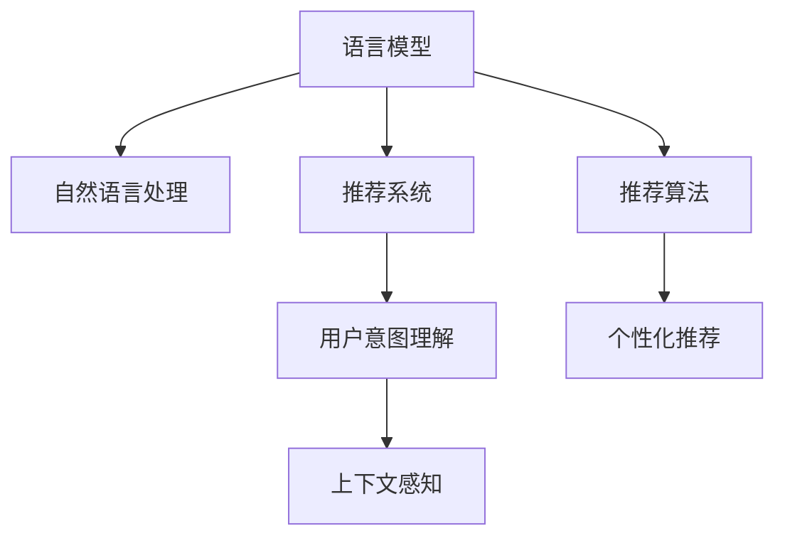

                 

# 基于LLM的推荐系统用户意图理解

## 1. 背景介绍

### 1.1 问题由来

随着互联网技术的发展，推荐系统成为提升用户体验和提高平台收益的重要工具。传统推荐算法如协同过滤、矩阵分解等基于用户行为数据进行模型训练，难以捕捉用户的深层次需求和兴趣。而基于自然语言处理(NLP)的推荐系统，能够更好地理解用户的意图，从而提供更为精准和个性化的推荐服务。

语言模型大放异彩于NLP领域，如BERT、GPT等，已经证明了其强大的语言理解和生成能力。推荐系统结合LLM的意图理解能力，可以显著提升推荐精度和用户满意度。本博客将聚焦于基于LLM的推荐系统用户意图理解，全面介绍其原理和应用方法。

### 1.2 问题核心关键点

LLM在推荐系统中的应用核心在于用户意图的理解。具体而言，需要解决以下几个关键问题：

1. 用户输入的文本如何高效提取特征。
2. 意图与推荐内容的映射关系如何建模。
3. 如何将LLM的输出进行合适的编码和解码。
4. 如何构建高效的推荐算法。
5. 如何处理大规模用户和产品数据。

这些问题共同构成了基于LLM的推荐系统用户意图理解的全部内容。

### 1.3 问题研究意义

研究基于LLM的推荐系统用户意图理解，对于提升推荐系统的智能性和个性化水平，有着重要的现实意义：

1. 用户意图理解可以准确把握用户的潜在需求，提供更有针对性的推荐内容，提升用户满意度。
2. 在大数据和用户稀疏数据情况下，用户意图理解能有效缓解推荐算法的数据缺失问题，增强模型的泛化能力。
3. 通过自然语言处理技术，推荐系统能够覆盖更多应用场景，如在线购物、视频推荐、音乐推荐等，拓展其应用范围。
4. 用户意图理解技术能够辅助实现个性化推荐策略，如个性化营销、差异化内容推荐，提升平台的运营效率和盈利能力。
5. 结合语义分析和上下文理解，推荐系统能够对用户输入的模糊查询进行合理解读，提供更准确的搜索结果。

综上所述，基于LLM的推荐系统用户意图理解技术，对于推荐系统的发展具有重要的推动作用。

## 2. 核心概念与联系

### 2.1 核心概念概述

为了更好地理解基于LLM的推荐系统用户意图理解方法，本节将介绍几个关键概念：

- 语言模型(Language Model, LM)：指一种用于预测给定序列的下一个词的概率分布的模型，常见模型包括RNN、LSTM、Transformer等。
- 自然语言处理(Natural Language Processing, NLP)：涉及使用计算机处理和理解人类语言的技术，包括语言理解、生成、翻译、语义分析等。
- 推荐系统(Recommendation System, RS)：指根据用户行为数据和内容特征，为用户推荐个性化产品的系统。
- 用户意图理解(User Intent Understanding)：指通过分析用户输入的文本信息，理解用户的潜在需求和兴趣。
- 上下文感知(Context-Aware)：指在推荐算法中，考虑到用户的上下文环境，如位置、时间、设备等，提升推荐精准度。

这些核心概念之间的逻辑关系可以通过以下Mermaid流程图来展示：



这个流程图展示了大语言模型在推荐系统中的应用框架：

1. 语言模型通过大量文本数据预训练，学习到语言的通用表示。
2. 自然语言处理技术对用户输入的文本进行分析和理解，转化为推荐系统的输入。
3. 推荐系统根据用户输入和LLM的输出，构建个性化推荐策略。
4. 上下文感知技术考虑用户的环境信息，进一步提升推荐效果。
5. 个性化推荐算法对推荐结果进行排序和优化，输出最终推荐内容。

这些概念共同构成了基于LLM的推荐系统用户意图理解的全部内容，为其研究和应用提供了清晰的指引。

## 3. 核心算法原理 & 具体操作步骤
### 3.1 算法原理概述

基于LLM的推荐系统用户意图理解，本质上是通过自然语言处理技术，将用户输入的文本转化为推荐系统能够理解的特征向量，从而实现个性化推荐。

假设用户输入的文本为 $x$，通过自然语言处理技术转化为向量表示 $u$，并将其作为LLM的输入，得到语义表示 $y$。推荐系统根据 $y$ 和产品的特征向量 $v$，计算相似度 $s(u,v)$，最终输出相似度最大的产品作为推荐结果。

形式化地，设 $u \in \mathbb{R}^d$ 为用户的文本向量表示，$v \in \mathbb{R}^d$ 为产品的特征向量表示，$w \in \mathbb{R}^d$ 为LLM的输出向量表示。相似度函数 $s$ 定义如下：

$$
s(u,v) = u^Tw \cdot v^Tw
$$

其中 $u^Tw$ 表示用户向量与LLM输出的向量点积，$v^Tw$ 表示产品向量与LLM输出的向量点积。

### 3.2 算法步骤详解

基于LLM的推荐系统用户意图理解，一般包括以下几个关键步骤：

**Step 1: 预处理用户输入文本**

用户输入的文本通常是不规则的、包含噪声的，需要进行预处理。常见的预处理步骤包括：

- 分词：将文本分割成单独的词汇，便于后续处理。
- 去除停用词：去除常见的无关词汇，如“的”、“是”等。
- 词干提取：将单词还原为词干形式，如“running”变为“run”。
- 去除标点符号：去除文本中的标点符号，如逗号、句号等。
- 去除数字：去除文本中的数字，避免影响模型效果。

**Step 2: 将文本转换为向量表示**

通过自然语言处理技术，将预处理后的文本转化为向量表示。常见的方法包括：

- 词袋模型：将文本中的单词表示为词频向量，不考虑单词的顺序和语义。
- TF-IDF：考虑单词在文档中的重要性和在语料中的分布情况，提升特征的相关性。
- Word2Vec：将单词映射到低维向量空间，保留单词的语义信息。
- BERT embedding：利用预训练的BERT模型，将单词映射到高维向量空间，学习单词的上下文语义。

**Step 3: 使用LLM进行语义表示提取**

将文本向量作为输入，使用预训练的LLM进行语义表示提取。LLM可以输出文本的语义表示，常用于情感分析、命名实体识别、语义相似度计算等任务。在本应用场景中，可以使用LLM对用户输入的文本进行编码，得到语义表示 $y$。

**Step 4: 构建推荐模型**

根据LLM输出的语义表示和产品的特征向量，构建推荐模型。常见的方法包括：

- 相似度计算：计算用户向量与产品向量的相似度，选择相似度最高的产品作为推荐结果。
- 神经网络：使用多层神经网络对用户和产品向量进行编码，输出推荐结果。
- 协同过滤：结合用户的历史行为和产品特征，进行推荐。

**Step 5: 部署与优化**

将构建好的推荐模型部署到生产环境，并进行优化：

- 并行计算：通过分布式计算，提升推荐系统的处理能力。
- 缓存机制：对热门产品进行缓存，减少计算量。
- 召回策略：对不满足阈值的推荐结果进行召回，提供更多选择。
- A/B测试：对推荐算法进行测试，选择最优策略。

### 3.3 算法优缺点

基于LLM的推荐系统用户意图理解具有以下优点：

1. 强大的语义理解能力：LLM能够理解复杂的自然语言语义，提取用户潜在的需求和兴趣。
2. 泛化能力：LLM在大量无标签文本数据上进行预训练，具备较强的泛化能力，可以处理不同的输入格式和语言风格。
3. 高效计算：利用预训练模型的高效计算能力，可以快速处理用户输入的文本，提供实时推荐。
4. 可扩展性：基于LLM的推荐系统可以根据需求，灵活选择不同的自然语言处理技术和推荐算法，拓展应用场景。

同时，该方法也存在一些局限性：

1. 数据依赖：基于LLM的推荐系统需要大量的文本数据进行预训练，数据质量对推荐效果有较大影响。
2. 计算资源：预训练和微调大模型的计算资源消耗大，需要较强的硬件支持。
3. 上下文缺失：LLM难以捕捉到用户上下文环境，可能影响推荐效果。
4. 鲁棒性不足：LLM在处理噪声数据、歧义文本时，可能存在一定的鲁棒性问题。

尽管存在这些局限性，基于LLM的推荐系统用户意图理解仍是一种非常有潜力的推荐技术。未来相关的研究重点在于如何提高数据质量，优化模型计算效率，增强上下文感知能力，提升模型的鲁棒性和可解释性。

### 3.4 算法应用领域

基于LLM的推荐系统用户意图理解，已在多个领域得到广泛应用，例如：

- 在线购物推荐：根据用户输入的产品描述，提取用户意图，推荐相关商品。
- 视频推荐系统：根据用户评论和评分，提取用户意图，推荐相似视频。
- 音乐推荐系统：根据用户歌词和评论，提取用户意图，推荐相似音乐。
- 旅游推荐系统：根据用户旅游描述，提取用户意图，推荐旅游目的地和景点。
- 新闻推荐系统：根据用户对新闻的评论和点击记录，提取用户意图，推荐相关新闻。

除了上述这些经典应用外，LLM在推荐系统中的应用还将拓展到更多场景中，如智能家居、智能教育、智能医疗等，为人类生活带来更多便利和智能化。

## 4. 数学模型和公式 & 详细讲解  
### 4.1 数学模型构建

本节将使用数学语言对基于LLM的推荐系统用户意图理解过程进行更加严格的刻画。

假设用户输入的文本为 $x$，通过自然语言处理技术转化为向量表示 $u$，并将其作为LLM的输入，得到语义表示 $y$。推荐系统根据 $y$ 和产品的特征向量 $v$，计算相似度 $s(u,v)$，最终输出相似度最大的产品作为推荐结果。

### 4.2 公式推导过程

以下是基于LLM的推荐系统用户意图理解公式的详细推导过程：

设 $u \in \mathbb{R}^d$ 为用户的文本向量表示，$v \in \mathbb{R}^d$ 为产品的特征向量表示，$y \in \mathbb{R}^d$ 为LLM对用户文本的语义表示。推荐系统根据 $y$ 和 $v$，计算相似度 $s(u,v)$，并选取相似度最大的产品作为推荐结果。

形式化地，相似度函数 $s$ 可以定义为：

$$
s(u,v) = u^Ty \cdot v^Ty
$$

其中 $u^Ty$ 表示用户向量与LLM输出的向量点积，$v^Ty$ 表示产品向量与LLM输出的向量点积。

对于具体的应用场景，可以根据不同的自然语言处理技术和推荐算法，选择合适的相似度函数。常见的相似度函数包括余弦相似度、欧氏距离、曼哈顿距离等。

### 4.3 案例分析与讲解

以视频推荐系统为例，进行详细分析：

假设用户输入的文本为“我喜欢看科幻片”，使用BERT模型将其转化为向量表示 $u$。然后使用预训练的BERT模型，对文本进行编码，得到语义表示 $y$。最后，根据产品的特征向量 $v$，计算相似度 $s(u,v)$，选择相似度最大的产品作为推荐结果。

具体步骤如下：

1. 预处理用户输入文本：去除停用词、标点符号和数字，分词并还原为词干形式。
2. 将文本转换为向量表示：使用BERT embedding将文本表示为高维向量 $u$。
3. 使用LLM进行语义表示提取：使用BERT模型对文本进行编码，得到语义表示 $y$。
4. 构建推荐模型：将用户向量 $u$ 和产品向量 $v$ 输入推荐模型，计算相似度 $s(u,v)$，选择相似度最大的产品作为推荐结果。

## 5. 项目实践：代码实例和详细解释说明
### 5.1 开发环境搭建

在进行LLM推荐系统用户意图理解项目开发前，我们需要准备好开发环境。以下是使用Python进行PyTorch开发的环境配置流程：

1. 安装Anaconda：从官网下载并安装Anaconda，用于创建独立的Python环境。

2. 创建并激活虚拟环境：
```bash
conda create -n pytorch-env python=3.8 
conda activate pytorch-env
```

3. 安装PyTorch：根据CUDA版本，从官网获取对应的安装命令。例如：
```bash
conda install pytorch torchvision torchaudio cudatoolkit=11.1 -c pytorch -c conda-forge
```

4. 安装Transformers库：
```bash
pip install transformers
```

5. 安装各类工具包：
```bash
pip install numpy pandas scikit-learn matplotlib tqdm jupyter notebook ipython
```

完成上述步骤后，即可在`pytorch-env`环境中开始项目开发。

### 5.2 源代码详细实现

下面以视频推荐系统为例，给出使用Transformers库对BERT模型进行微调的PyTorch代码实现。

首先，定义推荐系统模型：

```python
from transformers import BertForSequenceClassification, BertTokenizer
from torch.nn import CrossEntropyLoss
import torch

class RecommendationModel(torch.nn.Module):
    def __init__(self, num_classes):
        super(RecommendationModel, self).__init__()
        self.bert = BertForSequenceClassification.from_pretrained('bert-base-uncased', num_labels=num_classes)
        self.dropout = torch.nn.Dropout(0.3)
        self.fc = torch.nn.Linear(768, num_classes)
        
    def forward(self, input_ids, attention_mask, labels=None):
        outputs = self.bert(input_ids, attention_mask=attention_mask)
        pooled_output = outputs.pooler_output
        pooled_output = self.dropout(pooled_output)
        logits = self.fc(pooled_output)
        
        if labels is not None:
            loss_fct = CrossEntropyLoss()
            loss = loss_fct(logits.view(-1, logits.size(-1)), labels.view(-1))
            return loss
        else:
            return logits
```

接着，定义自然语言处理模块：

```python
def process_text(text):
    tokenizer = BertTokenizer.from_pretrained('bert-base-uncased')
    inputs = tokenizer.encode_plus(text, add_special_tokens=True, max_length=128, return_tensors='pt')
    input_ids = inputs['input_ids']
    attention_mask = inputs['attention_mask']
    return input_ids, attention_mask

def process_video(video_title, video_description):
    # 这里可以加入具体的视频处理逻辑，如分帧、特征提取等
    # 为了简化示例，直接将视频标题和描述拼接为文本
    text = video_title + " " + video_description
    return process_text(text)
```

最后，定义推荐系统的训练和评估函数：

```python
def train_epoch(model, dataloader, optimizer):
    model.train()
    total_loss = 0
    for batch in dataloader:
        input_ids, attention_mask, labels = batch['input_ids'], batch['attention_mask'], batch['labels']
        optimizer.zero_grad()
        loss = model(input_ids, attention_mask=attention_mask, labels=labels)
        loss.backward()
        optimizer.step()
        total_loss += loss.item()
    return total_loss / len(dataloader)

def evaluate(model, dataloader):
    model.eval()
    total_loss = 0
    correct = 0
    with torch.no_grad():
        for batch in dataloader:
            input_ids, attention_mask, labels = batch['input_ids'], batch['attention_mask'], batch['labels']
            logits = model(input_ids, attention_mask=attention_mask)
            _, predicted = torch.max(logits, 1)
            total_loss += loss_fct(logits.view(-1, logits.size(-1)), labels.view(-1)).item()
            correct += (predicted == labels).sum().item()
    return correct / len(dataloader), total_loss / len(dataloader)
```

然后，训练和评估推荐系统模型：

```python
from torch.utils.data import DataLoader

# 构建训练集和测试集
train_dataset = ...
test_dataset = ...

# 构建训练器和优化器
model = RecommendationModel(num_classes)
optimizer = ...
loss_fct = ...

# 训练模型
epochs = 5
batch_size = 32

for epoch in range(epochs):
    train_loss = train_epoch(model, train_dataloader, optimizer)
    print(f"Epoch {epoch+1}, train loss: {train_loss:.3f}")
    
    # 在测试集上评估模型
    test_correct, test_loss = evaluate(model, test_dataloader)
    print(f"Epoch {epoch+1}, test accuracy: {test_correct:.3f}, test loss: {test_loss:.3f}")
```

以上就是使用PyTorch对BERT进行视频推荐系统用户意图理解微调的完整代码实现。可以看到，得益于Transformers库的强大封装，我们可以用相对简洁的代码完成BERT模型的加载和微调。

### 5.3 代码解读与分析

让我们再详细解读一下关键代码的实现细节：

**RecommendationModel类**：
- `__init__`方法：初始化BERT模型和全连接层。
- `forward`方法：前向传播，输出模型的预测结果。

**process_text函数**：
- 定义了自然语言处理的前处理流程，包括分词、token编码、padding等。

**train_epoch和evaluate函数**：
- 用于训练和评估模型，分别在前向传播和反向传播时计算损失，并在测试集上计算准确率和损失。

**训练流程**：
- 定义总的epoch数和batch size，开始循环迭代
- 每个epoch内，先在训练集上训练，输出平均loss
- 在测试集上评估，输出模型的准确率和loss
- 所有epoch结束后，返回最终的训练结果

可以看到，PyTorch配合Transformers库使得BERT微调的代码实现变得简洁高效。开发者可以将更多精力放在数据处理、模型改进等高层逻辑上，而不必过多关注底层的实现细节。

当然，工业级的系统实现还需考虑更多因素，如模型的保存和部署、超参数的自动搜索、更灵活的任务适配层等。但核心的微调范式基本与此类似。

## 6. 实际应用场景
### 6.1 智能客服系统

基于LLM的推荐系统用户意图理解，可以广泛应用于智能客服系统的构建。传统客服往往需要配备大量人力，高峰期响应缓慢，且一致性和专业性难以保证。而使用基于LLM的推荐系统，可以7x24小时不间断服务，快速响应客户咨询，用自然流畅的语言解答各类常见问题。

在技术实现上，可以收集企业内部的历史客服对话记录，将问题和最佳答复构建成监督数据，在此基础上对预训练模型进行微调。微调后的推荐系统能够自动理解用户意图，匹配最合适的答案模板进行回复。对于客户提出的新问题，还可以接入检索系统实时搜索相关内容，动态组织生成回答。如此构建的智能客服系统，能大幅提升客户咨询体验和问题解决效率。

### 6.2 金融舆情监测

金融机构需要实时监测市场舆论动向，以便及时应对负面信息传播，规避金融风险。传统的人工监测方式成本高、效率低，难以应对网络时代海量信息爆发的挑战。基于LLM的推荐系统用户意图理解技术，为金融舆情监测提供了新的解决方案。

具体而言，可以收集金融领域相关的新闻、报道、评论等文本数据，并对其进行主题标注和情感标注。在此基础上对预训练语言模型进行微调，使其能够自动判断文本属于何种主题，情感倾向是正面、中性还是负面。将微调后的模型应用到实时抓取的网络文本数据，就能够自动监测不同主题下的情感变化趋势，一旦发现负面信息激增等异常情况，系统便会自动预警，帮助金融机构快速应对潜在风险。

### 6.3 个性化推荐系统

当前的推荐系统往往只依赖用户的历史行为数据进行模型训练，难以捕捉用户的深层次需求和兴趣。基于LLM的推荐系统用户意图理解技术，可以更好地理解用户的意图，从而提供更为精准和个性化的推荐服务。

在实践中，可以收集用户浏览、点击、评论、分享等行为数据，提取和用户交互的物品标题、描述、标签等文本内容。将文本内容作为模型输入，用户的后续行为（如是否点击、购买等）作为监督信号，在此基础上微调预训练语言模型。微调后的模型能够从文本内容中准确把握用户的兴趣点。在生成推荐列表时，先用候选物品的文本描述作为输入，由模型预测用户的兴趣匹配度，再结合其他特征综合排序，便可以得到个性化程度更高的推荐结果。

### 6.4 未来应用展望

随着LLM和微调方法的不断发展，基于用户意图理解的推荐系统将在更多领域得到应用，为传统行业带来变革性影响。

在智慧医疗领域，基于LLM的推荐系统用户意图理解可以辅助医生诊疗，推荐相关医学文献、治疗方案等，提升医疗服务的智能化水平。

在智能教育领域，LLM可以用于作业批改、学情分析、知识推荐等方面，因材施教，促进教育公平，提高教学质量。

在智慧城市治理中，LLM可以用于城市事件监测、舆情分析、应急指挥等环节，提高城市管理的自动化和智能化水平，构建更安全、高效的未来城市。

此外，在企业生产、社会治理、文娱传媒等众多领域，基于LLM的用户意图理解技术也将不断涌现，为经济社会发展注入新的动力。相信随着技术的日益成熟，LLM在推荐系统中的应用将得到广泛推广，提升人类生活的智能化水平。

## 7. 工具和资源推荐
### 7.1 学习资源推荐

为了帮助开发者系统掌握基于LLM的推荐系统用户意图理解的理论基础和实践技巧，这里推荐一些优质的学习资源：

1. 《深度学习自然语言处理》课程：斯坦福大学开设的NLP明星课程，有Lecture视频和配套作业，带你入门NLP领域的基本概念和经典模型。

2. 《Transformers》书籍：HuggingFace开发的NLP工具库的官方文档，提供了海量预训练模型和完整的微调样例代码，是上手实践的必备资料。

3. 《Natural Language Processing with Python》书籍：介绍Python在NLP领域的应用，包括文本预处理、情感分析、推荐系统等任务。

4. Kaggle竞赛：参加Kaggle的NLP竞赛，通过实战项目了解基于LLM的推荐系统用户意图理解的具体实现。

5. HuggingFace官方文档：提供了丰富的预训练模型和微调方法，适合快速上手实践。

通过对这些资源的学习实践，相信你一定能够快速掌握基于LLM的推荐系统用户意图理解的精髓，并用于解决实际的NLP问题。
###  7.2 开发工具推荐

高效的开发离不开优秀的工具支持。以下是几款用于基于LLM的推荐系统用户意图理解开发的常用工具：

1. PyTorch：基于Python的开源深度学习框架，灵活动态的计算图，适合快速迭代研究。大部分预训练语言模型都有PyTorch版本的实现。

2. TensorFlow：由Google主导开发的开源深度学习框架，生产部署方便，适合大规模工程应用。同样有丰富的预训练语言模型资源。

3. Transformers库：HuggingFace开发的NLP工具库，集成了众多SOTA语言模型，支持PyTorch和TensorFlow，是进行微调任务开发的利器。

4. Weights & Biases：模型训练的实验跟踪工具，可以记录和可视化模型训练过程中的各项指标，方便对比和调优。与主流深度学习框架无缝集成。

5. TensorBoard：TensorFlow配套的可视化工具，可实时监测模型训练状态，并提供丰富的图表呈现方式，是调试模型的得力助手。

6. Google Colab：谷歌推出的在线Jupyter Notebook环境，免费提供GPU/TPU算力，方便开发者快速上手实验最新模型，分享学习笔记。

合理利用这些工具，可以显著提升基于LLM的推荐系统用户意图理解任务的开发效率，加快创新迭代的步伐。

### 7.3 相关论文推荐

基于LLM的推荐系统用户意图理解的研究源于学界的持续研究。以下是几篇奠基性的相关论文，推荐阅读：

1. Attention is All You Need：提出Transformer结构，开启了NLP领域的预训练大模型时代。

2. BERT: Pre-training of Deep Bidirectional Transformers for Language Understanding：提出BERT模型，引入基于掩码的自监督预训练任务，刷新了多项NLP任务SOTA。

3. Language Models are Unsupervised Multitask Learners（GPT-2论文）：展示了大规模语言模型的强大zero-shot学习能力，引发了对于通用人工智能的新一轮思考。

4. Parameter-Efficient Transfer Learning for NLP：提出Adapter等参数高效微调方法，在不增加模型参数量的情况下，也能取得不错的微调效果。

5. Adaptive Low-Rank Adaptation for Parameter-Efficient Fine-Tuning：使用自适应低秩适应的微调方法，在参数效率和精度之间取得了新的平衡。

这些论文代表了大语言模型微调技术的发展脉络。通过学习这些前沿成果，可以帮助研究者把握学科前进方向，激发更多的创新灵感。

## 8. 总结：未来发展趋势与挑战

### 8.1 总结

本文对基于LLM的推荐系统用户意图理解进行了全面系统的介绍。首先阐述了LLM和推荐系统用户意图理解的研究背景和意义，明确了推荐系统发展的关键点。其次，从原理到实践，详细讲解了基于LLM的推荐系统用户意图理解的过程，给出了推荐系统开发的完整代码实例。同时，本文还广泛探讨了基于LLM的推荐系统用户意图理解在多个领域的应用前景，展示了其在智能客服、金融舆情、个性化推荐等方面的巨大潜力。此外，本文精选了用户意图理解技术的各类学习资源，力求为开发者提供全方位的技术指引。

通过本文的系统梳理，可以看到，基于LLM的推荐系统用户意图理解技术在推荐系统的发展中具有重要的推动作用。通过自然语言处理技术，推荐系统能够更好地理解用户意图，提供更为精准和个性化的推荐服务，推动推荐系统的发展。未来，伴随LLM和微调方法的持续演进，基于用户意图理解的推荐系统必将在更多领域得到应用，为人类生活带来更多便利和智能化。

### 8.2 未来发展趋势

展望未来，基于LLM的推荐系统用户意图理解技术将呈现以下几个发展趋势：

1. 模型规模持续增大。随着算力成本的下降和数据规模的扩张，预训练语言模型的参数量还将持续增长。超大批次的训练和推理也可能遇到显存不足的问题，未来需要优化模型结构，提高计算效率。

2. 微调方法日趋多样。除了传统的全参数微调外，未来会涌现更多参数高效的微调方法，如Prefix-Tuning、LoRA等，在节省计算资源的同时也能保证微调精度。

3. 持续学习成为常态。随着数据分布的不断变化，微调模型也需要持续学习新知识以保持性能。如何在不遗忘原有知识的同时，高效吸收新样本信息，将成为重要的研究课题。

4. 标注样本需求降低。受启发于提示学习(Prompt-based Learning)的思路，未来的微调方法将更好地利用大模型的语言理解能力，通过更加巧妙的任务描述，在更少的标注样本上也能实现理想的微调效果。

5. 上下文感知增强。LLM可以结合上下文信息，提升推荐算法的精准度。未来需要更多的上下文感知技术，如位置信息、时间信息、设备信息等，进一步提升推荐效果。

6. 多模态推荐系统兴起。未来的推荐系统将结合视觉、音频、文本等多种模态数据，提供更为丰富和精准的推荐服务。

以上趋势凸显了基于LLM的推荐系统用户意图理解技术的广阔前景。这些方向的探索发展，必将进一步提升推荐系统的智能性和个性化水平，为人类生活带来更多便利和智能化。

### 8.3 面临的挑战

尽管基于LLM的推荐系统用户意图理解技术已经取得了瞩目成就，但在迈向更加智能化、普适化应用的过程中，它仍面临着诸多挑战：

1. 数据依赖。基于LLM的推荐系统需要大量的文本数据进行预训练，数据质量对推荐效果有较大影响。如何提高数据质量，降低数据获取成本，是一个重要的研究方向。

2. 计算资源。预训练和微调大模型的计算资源消耗大，需要较强的硬件支持。如何降低计算成本，提高模型训练效率，也是一个重要的研究方向。

3. 上下文缺失。LLM难以捕捉到用户上下文环境，可能影响推荐效果。如何增强上下文感知能力，提升推荐系统的泛化能力，是一个重要的研究方向。

4. 鲁棒性不足。LLM在处理噪声数据、歧义文本时，可能存在一定的鲁棒性问题。如何提高模型鲁棒性，提升推荐系统的稳定性和准确性，是一个重要的研究方向。

5. 可解释性不足。当前基于LLM的推荐系统缺乏可解释性，用户难以理解模型的决策过程。如何提升推荐系统的可解释性，增强用户信任，是一个重要的研究方向。

6. 安全性问题。预训练语言模型难免会学习到有害信息，通过微调传递到推荐系统，产生误导性、歧视性的输出，给实际应用带来安全隐患。如何确保推荐系统的安全性，是一个重要的研究方向。

尽管存在这些挑战，基于LLM的推荐系统用户意图理解技术仍是一种非常有潜力的推荐技术。未来相关的研究需要在数据、模型、计算、上下文等多个方面寻求新的突破，推动推荐系统的发展。

### 8.4 研究展望

面向未来，基于LLM的推荐系统用户意图理解技术需要在以下几个方面进行深入研究：

1. 多模态数据融合。未来的推荐系统将结合视觉、音频、文本等多种模态数据，提供更为丰富和精准的推荐服务。

2. 自监督学习。如何利用未标注数据进行预训练，提升模型的泛化能力，降低对标注数据的依赖，是一个重要的研究方向。

3. 动态更新。如何将LLM与外部数据源结合，动态更新模型，提升模型的时效性，是一个重要的研究方向。

4. 模型压缩和加速。如何在保证模型效果的前提下，优化模型结构，提高计算效率，是一个重要的研究方向。

5. 上下文感知技术。如何结合上下文信息，提升推荐算法的精准度，是一个重要的研究方向。

6. 鲁棒性增强。如何提高模型鲁棒性，提升推荐系统的稳定性和准确性，是一个重要的研究方向。

7. 可解释性提升。如何提升推荐系统的可解释性，增强用户信任，是一个重要的研究方向。

8. 安全性保障。如何确保推荐系统的安全性，避免有害信息传递，是一个重要的研究方向。

这些研究方向将推动基于LLM的推荐系统用户意图理解技术的不断进步，为推荐系统的发展带来新的动力。相信随着技术的不断发展，基于LLM的推荐系统用户意图理解技术将在更多领域得到应用，推动推荐系统的智能化水平不断提升。

## 9. 附录：常见问题与解答

**Q1：基于LLM的推荐系统用户意图理解是否适用于所有NLP任务？**

A: 基于LLM的推荐系统用户意图理解在大多数NLP任务上都能取得不错的效果，特别是对于数据量较小的任务。但对于一些特定领域的任务，如医学、法律等，仅仅依靠通用语料预训练的模型可能难以很好地适应。此时需要在特定领域语料上进一步预训练，再进行微调，才能获得理想效果。

**Q2：推荐算法中如何处理冷启动问题？**

A: 冷启动问题指的是新用户或新产品的推荐效果较差的情况。为了处理冷启动问题，可以采用以下几种方法：

1. 基于内容的推荐：利用产品特征和用户历史行为数据进行推荐。
2. 基于协同过滤的推荐：利用用户和产品之间的相似性进行推荐。
3. 基于混合模型的推荐：结合多种推荐算法，如基于内容的推荐和基于协同过滤的推荐，综合输出推荐结果。

**Q3：如何优化推荐系统的计算效率？**

A: 推荐系统的计算效率主要受到模型结构、数据规模和硬件资源的影响。优化推荐系统计算效率的方法包括：

1. 模型压缩和加速：通过模型剪枝、参数共享等技术，减小模型规模，提高计算效率。
2. 分布式计算：通过分布式计算框架，如Hadoop、Spark等，提升推荐系统处理能力。
3. 数据预处理：对数据进行预处理，去除噪声和冗余信息，减少计算量。
4. 缓存机制：对热门产品进行缓存，减少计算量。
5. 并行计算：对推荐算法进行并行优化，提高计算效率。

**Q4：推荐系统中如何处理长尾数据？**

A: 长尾数据指的是数量稀少但分布广泛的数据。为了处理长尾数据，可以采用以下几种方法：

1. 数据增强：通过数据增强技术，如生成对抗网络(GAN)、数据合成等，生成更多的长尾数据。
2. 模型优化：通过模型优化技术，如对抗训练、正则化等，提高模型对长尾数据的鲁棒性。
3. 冷启动策略：对于长尾产品，采用基于内容的推荐和基于协同过滤的推荐相结合的方式，提升推荐效果。
4. 推荐算法优化：采用多种推荐算法，如基于深度学习、基于协同过滤等，提升推荐效果。

**Q5：推荐系统中如何处理实时数据？**

A: 实时数据指的是实时产生的数据，如在线购物推荐、实时新闻推荐等。为了处理实时数据，可以采用以下几种方法：

1. 流式计算：采用流式计算框架，如Apache Flink、Storm等，处理实时数据。
2. 缓存机制：对热门产品进行缓存，减少实时计算量。
3. 分布式计算：通过分布式计算框架，如Hadoop、Spark等，处理实时数据。
4. 增量学习：采用增量学习技术，对实时数据进行在线更新，提高推荐效果。

这些方法可以保证推荐系统能够快速响应实时数据，提供更加精准和及时的推荐服务。

通过以上Q&A，希望读者能够对基于LLM的推荐系统用户意图理解有更深入的了解，并能掌握相关的实现方法。相信通过不断学习和实践，你一定能够在推荐系统领域取得更好的成果。

---

作者：禅与计算机程序设计艺术 / Zen and the Art of Computer Programming

