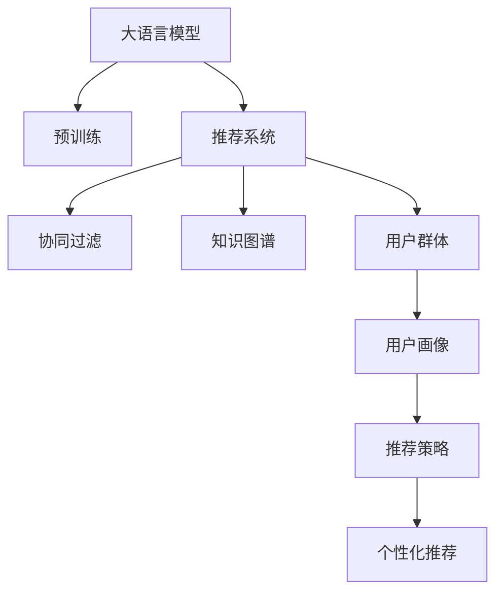

                 

# 基于LLM的推荐系统用户群体发现与分析

> 关键词：大语言模型,推荐系统,用户画像,自然语言处理,NLP,用户行为分析,协同过滤,知识图谱

## 1. 背景介绍

### 1.1 问题由来
推荐系统在电子商务、社交网络、视频平台等领域得到了广泛应用，极大地提升了用户的使用体验和平台营收。然而，传统的推荐系统往往基于用户历史行为数据进行物品推荐，忽略了用户间的隐性关联和群体效应，导致推荐结果趋于同质化，难以满足多样化、个性化的需求。

近年来，伴随着深度学习技术和大规模预训练语言模型（Large Language Model, LLM）的迅猛发展，基于LLM的推荐系统应运而生，展现了强大的用户群体发现和分析能力。这种新范式通过分析用户之间的语言特征和行为模式，发现潜在的用户群体，为推荐策略优化提供了更丰富的数据支持。

### 1.2 问题核心关键点
基于LLM的推荐系统核心在于如何高效地利用用户行为数据和语言数据，发现和分析用户群体。关键点包括：
- 用户群体定义：基于自然语言处理（NLP）技术，如何从用户评论、评分、描述等文本中提取语义信息，构建用户群体。
- 群体特征提取：通过聚类算法或图谱方法，如何从语言和行为数据中提取群体特征，建立群体画像。
- 群体行为建模：使用协同过滤、知识图谱等方法，如何构建群体之间的关联关系，预测群体行为。
- 个性化推荐：如何根据用户群体的特征和行为，生成个性化的推荐结果，提升推荐系统的效果和满意度。

### 1.3 问题研究意义
基于LLM的推荐系统通过语言数据分析，挖掘用户间的潜在关联，构建用户群体画像，显著提升了推荐系统的多样性和个性化。这种新范式不仅优化了推荐算法，还为平台的用户留存和活跃度提供了强有力的支持。具体研究意义包括：
- 降低推荐偏差：基于语言特征的用户群体发现，有助于识别出具有相似兴趣和偏好的用户，减少推荐偏差，提升推荐相关性。
- 强化推荐策略：用户群体特征能够指导推荐系统的策略优化，如引入群体协同过滤，提高推荐的准确性和多样性。
- 增强用户粘性：个性化的群体推荐能够提高用户满意度和平台粘性，增加用户活跃度和留存率。
- 促进商业价值：通过用户群体分析，可以精准定位目标用户，实施精准营销，提升商业价值。

## 2. 核心概念与联系

### 2.1 核心概念概述

为了更好地理解基于LLM的推荐系统，本节将介绍几个关键概念：

- **大语言模型(Large Language Model, LLM)**：指通过自监督学习在大规模无标签文本上预训练出的高表现力语言模型，如GPT、BERT等。LLM具备强大的语言理解和生成能力，能够从语义层面分析和理解用户评论、评分等文本数据。

- **推荐系统(Recommender System)**：根据用户历史行为数据和物品特征，推荐可能感兴趣的物品的系统。推荐系统可以分为基于内容的推荐、协同过滤推荐、混合推荐等类型。

- **用户群体(User Group)**：基于语言特征和行为模式，具有相似兴趣、偏好和行为特征的用户集合。用户群体可以是大规模的群体，也可以是小规模的微群体。

- **协同过滤(Collaborative Filtering)**：利用用户间的相似性，推荐相似用户喜欢的物品。协同过滤主要包括基于用户的协同过滤和基于物品的协同过滤两种方式。

- **知识图谱(Knowledge Graph)**：由实体、关系、属性构成的图谱结构，用于表示实体间的关联关系。知识图谱常用于增强推荐系统的推荐效果，如通过实体关系嵌入增强推荐。

这些核心概念之间的逻辑关系可以通过以下Mermaid流程图来展示：



这个流程图展示了LLM、推荐系统、协同过滤、知识图谱、用户群体、用户画像、推荐策略和个性化推荐之间的联系和流程。

## 3. 核心算法原理 & 具体操作步骤
### 3.1 算法原理概述

基于LLM的推荐系统，其核心原理是通过语言数据分析，发现用户间的隐性关联，构建用户群体，并在此基础上进行个性化推荐。其基本流程如下：

1. **预训练和微调**：使用大规模无标签文本数据对LLM进行预训练，获得强大的语言理解能力。针对推荐系统任务，对预训练模型进行微调，使其具备推荐相关特征提取能力。

2. **用户群体发现**：通过对用户评论、评分等文本数据进行语言分析和处理，发现具有相似语言特征的用户群体。

3. **群体特征提取**：使用聚类算法、图谱方法等，从用户群体中提取特征，构建群体画像。

4. **群体行为建模**：利用协同过滤、知识图谱等技术，建立群体之间的关联关系，预测群体行为。

5. **个性化推荐**：根据用户群体的特征和行为，生成个性化的推荐结果，提升推荐系统的效果和满意度。

### 3.2 算法步骤详解

基于LLM的推荐系统核心步骤包括预训练和微调、用户群体发现、群体特征提取、群体行为建模和个性化推荐。下面将详细介绍每个步骤的具体操作。

#### 3.2.1 预训练和微调

1. **预训练步骤**：
   - 收集大规模无标签文本数据，如维基百科、新闻、评论等。
   - 使用预训练任务（如掩码语言模型、序列分类等）训练大语言模型，获得强大的语言理解能力。
   - 保存预训练模型，后续用于微调。

2. **微调步骤**：
   - 将预训练模型作为初始化参数，使用推荐系统任务的数据集进行微调。
   - 根据推荐任务的不同，设计合适的输出层和损失函数。
   - 设置合适的学习率、批大小和迭代轮数，进行有监督微调。

#### 3.2.2 用户群体发现

1. **文本预处理**：
   - 对用户评论、评分等文本数据进行清洗、分词、去停用词等预处理。
   - 将文本转换为词向量或句子向量表示。

2. **语言特征提取**：
   - 使用预训练语言模型（如BERT、GPT等）对文本进行编码，获得文本的语义表示。
   - 通过计算文本表示之间的相似度，发现具有相似语言特征的用户群体。

3. **用户群体划分**：
   - 使用聚类算法（如K-means、层次聚类等）对用户进行群体划分。
   - 根据群体特征，如兴趣偏好、行为模式等，定义群体的具体描述。

#### 3.2.3 群体特征提取

1. **群体特征提取方法**：
   - 使用多模态特征提取技术，将文本、行为等数据综合分析，提取群体特征。
   - 利用知识图谱方法，分析群体中实体间的关系，提取更加丰富的群体特征。

2. **群体画像构建**：
   - 基于提取的群体特征，构建群体画像，描述群体的基本信息、兴趣偏好、行为模式等。
   - 使用可视化工具，展示群体画像，便于用户群体分析。

#### 3.2.4 群体行为建模

1. **协同过滤建模**：
   - 使用协同过滤方法，如基于用户的协同过滤或基于物品的协同过滤，建立群体之间的关联关系。
   - 通过计算群体间的相似度，预测群体的行为和偏好。

2. **知识图谱建模**：
   - 将用户群体中实体及其关系嵌入到知识图谱中，构建群体知识图谱。
   - 利用图谱算法，如节点嵌入、图卷积网络（GNN）等，分析群体之间的关联关系，预测群体行为。

#### 3.2.5 个性化推荐

1. **群体推荐生成**：
   - 根据用户群体的特征和行为，生成个性化推荐列表。
   - 利用推荐算法（如Top-k推荐、深度推荐模型等）生成最终推荐结果。

2. **推荐结果评估**：
   - 在测试集上评估推荐结果的性能，如准确率、召回率、平均精度等指标。
   - 通过A/B测试等方法，验证推荐效果，优化推荐策略。

### 3.3 算法优缺点

基于LLM的推荐系统具有以下优点：
- **强大的语言理解能力**：LLM具备强大的自然语言处理能力，能够理解和处理文本数据，发现用户间的隐性关联。
- **灵活的群体分析**：通过多模态特征提取和群体聚类，能够发现不同规模、不同特征的用户群体。
- **丰富的推荐策略**：结合协同过滤、知识图谱等方法，能够构建多维度的推荐模型，提升推荐效果。
- **个性化的推荐结果**：通过群体推荐和个性化推荐，能够生成更加多样、个性化的推荐内容。

同时，基于LLM的推荐系统也存在一些缺点：
- **数据需求高**：需要收集和处理大规模的用户文本数据，数据需求较高。
- **算法复杂**：涉及自然语言处理、聚类、图谱等多个领域的算法，算法实现较为复杂。
- **解释性不足**：推荐结果缺乏明确的解释，用户难以理解推荐逻辑。
- **模型训练时间长**：预训练和微调过程需要大量计算资源和时间，模型训练时间长。

### 3.4 算法应用领域

基于LLM的推荐系统在多个领域得到了广泛应用，具体包括：

- **电子商务**：如淘宝、京东、亚马逊等电商平台，通过分析用户评论、评分等文本数据，发现用户群体，提升个性化推荐效果。
- **社交网络**：如微博、微信、Facebook等社交平台，通过分析用户发布的内容，发现用户群体，推荐相关话题和内容。
- **视频平台**：如YouTube、Netflix等视频平台，通过分析用户评论和评分，发现用户群体，推荐视频内容。
- **旅游平台**：如携程、去哪儿等旅游平台，通过分析用户评论和评分，发现用户群体，推荐旅游目的地。

此外，基于LLM的推荐系统还在音乐、新闻、在线教育等众多领域得到了应用，展示了其强大的用户群体发现和分析能力。

## 4. 数学模型和公式 & 详细讲解 & 举例说明
### 4.1 数学模型构建

基于LLM的推荐系统核心数学模型包括预训练模型、用户群体发现模型、群体特征提取模型和群体行为建模模型。下面将详细介绍这些模型的构建方法。

#### 4.1.1 预训练模型

预训练模型通常基于掩码语言模型（Masked Language Model, MLM）和自编码器（Autoencoder）等任务进行训练，其基本数学模型如下：

设预训练数据集为 $\mathcal{D}=\{(x_i, y_i)\}_{i=1}^N$，其中 $x_i$ 为输入文本，$y_i$ 为掩码标记（遮罩位置、填充值等）。

预训练任务可以表示为：

$$
\max_{\theta} \sum_{i=1}^N \ell_{MLM}(\hat{y}, y_i)
$$

其中 $\ell_{MLM}$ 为掩码语言模型损失函数，$\hat{y}$ 为模型预测的掩码位置词汇，$y_i$ 为真实掩码标记。

#### 4.1.2 用户群体发现模型

用户群体发现模型通常基于聚类算法进行构建，其基本数学模型如下：

设用户群体为 $\mathcal{G}=\{g_1, g_2, ..., g_k\}$，其中 $g_i$ 为第 $i$ 个用户群体，$k$ 为群体总数。

用户群体发现过程可以表示为：

$$
\max_{\mathcal{G}} \sum_{i=1}^k \ell_{cluster}(g_i)
$$

其中 $\ell_{cluster}$ 为聚类损失函数，$g_i$ 为第 $i$ 个用户群体。

#### 4.1.3 群体特征提取模型

群体特征提取模型通常基于多模态特征提取技术进行构建，其基本数学模型如下：

设用户群体 $g_i$ 的特征表示为 $\mathbf{f}_i$，其中 $\mathbf{f}_i \in \mathbb{R}^d$，$d$ 为特征维度。

群体特征提取过程可以表示为：

$$
\mathbf{f}_i = \phi(x_i)
$$

其中 $\phi$ 为特征提取函数，$x_i$ 为用户群体 $g_i$ 的特征数据。

#### 4.1.4 群体行为建模模型

群体行为建模模型通常基于协同过滤和知识图谱方法进行构建，其基本数学模型如下：

设用户群体 $g_i$ 和物品 $o_j$ 的关系表示为 $e_{i,j}$，其中 $e_{i,j} \in \mathbb{R}$。

群体行为建模过程可以表示为：

$$
e_{i,j} = f_{predict}(g_i, o_j)
$$

其中 $f_{predict}$ 为预测函数，$g_i$ 为第 $i$ 个用户群体，$o_j$ 为物品 $j$。

### 4.2 公式推导过程

#### 4.2.1 掩码语言模型损失函数

掩码语言模型损失函数 $\ell_{MLM}$ 通常使用交叉熵损失函数，具体公式如下：

$$
\ell_{MLM}(\hat{y}, y_i) = -\sum_{k=1}^{K} y_{k,i} \log(\hat{y}_{k})
$$

其中 $y_{k,i}$ 为掩码位置 $i$ 的真实标记，$\hat{y}_{k}$ 为模型预测的掩码位置 $i$ 的词汇。

#### 4.2.2 聚类损失函数

聚类损失函数 $\ell_{cluster}$ 通常使用K-means聚类算法的损失函数，具体公式如下：

$$
\ell_{cluster}(g_i) = \sum_{j=1}^{n_i} ||\mathbf{x}_{j,i} - \mathbf{c}_i||^2
$$

其中 $\mathbf{x}_{j,i}$ 为用户群体 $g_i$ 中第 $j$ 个用户 $j$ 的特征表示，$\mathbf{c}_i$ 为群体 $i$ 的中心向量，$n_i$ 为群体 $i$ 中用户的数量。

#### 4.2.3 特征提取函数

特征提取函数 $\phi$ 通常使用Transformer模型或卷积神经网络（CNN）等方法进行构建，具体公式如下：

$$
\mathbf{f}_i = \text{Transformer}(x_i; \theta)
$$

其中 $\text{Transformer}$ 为预训练模型，$\theta$ 为模型参数，$x_i$ 为用户群体 $g_i$ 的特征数据。

#### 4.2.4 预测函数

预测函数 $f_{predict}$ 通常使用协同过滤或知识图谱方法进行构建，具体公式如下：

$$
e_{i,j} = f_{predict}(g_i, o_j; \theta)
$$

其中 $f_{predict}$ 为预测函数，$\theta$ 为模型参数，$g_i$ 为第 $i$ 个用户群体，$o_j$ 为物品 $j$。

### 4.3 案例分析与讲解

#### 4.3.1 掩码语言模型案例

以BERT模型为例，其掩码语言模型损失函数如下：

设预训练数据集为 $\mathcal{D}=\{(x_i, y_i)\}_{i=1}^N$，其中 $x_i$ 为输入文本，$y_i$ 为掩码标记（遮罩位置、填充值等）。

$$
\ell_{MLM}(\hat{y}, y_i) = -\sum_{k=1}^{K} y_{k,i} \log(\hat{y}_{k})
$$

其中 $y_{k,i}$ 为掩码位置 $i$ 的真实标记，$\hat{y}_{k}$ 为BERT模型预测的掩码位置 $i$ 的词汇。

#### 4.3.2 聚类算法案例

以K-means聚类算法为例，其聚类损失函数如下：

设用户群体为 $\mathcal{G}=\{g_1, g_2, ..., g_k\}$，其中 $g_i$ 为第 $i$ 个用户群体，$k$ 为群体总数。

$$
\ell_{cluster}(g_i) = \sum_{j=1}^{n_i} ||\mathbf{x}_{j,i} - \mathbf{c}_i||^2
$$

其中 $\mathbf{x}_{j,i}$ 为用户群体 $g_i$ 中第 $j$ 个用户 $j$ 的特征表示，$\mathbf{c}_i$ 为群体 $i$ 的中心向量，$n_i$ 为群体 $i$ 中用户的数量。

#### 4.3.3 特征提取函数案例

以Transformer模型为例，其特征提取函数如下：

$$
\mathbf{f}_i = \text{Transformer}(x_i; \theta)
$$

其中 $\text{Transformer}$ 为BERT模型，$\theta$ 为模型参数，$x_i$ 为用户群体 $g_i$ 的特征数据。

#### 4.3.4 预测函数案例

以协同过滤方法为例，其预测函数如下：

$$
e_{i,j} = f_{predict}(g_i, o_j; \theta)
$$

其中 $f_{predict}$ 为协同过滤预测函数，$\theta$ 为模型参数，$g_i$ 为第 $i$ 个用户群体，$o_j$ 为物品 $j$。

## 5. 项目实践：代码实例和详细解释说明
### 5.1 开发环境搭建

在进行LLM推荐系统项目实践前，我们需要准备好开发环境。以下是使用Python进行PyTorch开发的环境配置流程：

1. 安装Anaconda：从官网下载并安装Anaconda，用于创建独立的Python环境。

2. 创建并激活虚拟环境：
```bash
conda create -n pytorch-env python=3.8 
conda activate pytorch-env
```

3. 安装PyTorch：根据CUDA版本，从官网获取对应的安装命令。例如：
```bash
conda install pytorch torchvision torchaudio cudatoolkit=11.1 -c pytorch -c conda-forge
```

4. 安装Transformers库：
```bash
pip install transformers
```

5. 安装各类工具包：
```bash
pip install numpy pandas scikit-learn matplotlib tqdm jupyter notebook ipython
```

完成上述步骤后，即可在`pytorch-env`环境中开始项目实践。

### 5.2 源代码详细实现

这里我们以基于BERT模型的推荐系统为例，展示如何利用PyTorch进行代码实现。

首先，定义推荐系统的数据处理函数：

```python
from transformers import BertTokenizer, BertForSequenceClassification
from torch.utils.data import Dataset
import torch

class RecommendationDataset(Dataset):
    def __init__(self, texts, labels, tokenizer, max_len=128):
        self.texts = texts
        self.labels = labels
        self.tokenizer = tokenizer
        self.max_len = max_len
        
    def __len__(self):
        return len(self.texts)
    
    def __getitem__(self, item):
        text = self.texts[item]
        label = self.labels[item]
        
        encoding = self.tokenizer(text, return_tensors='pt', max_length=self.max_len, padding='max_length', truncation=True)
        input_ids = encoding['input_ids'][0]
        attention_mask = encoding['attention_mask'][0]
        
        return {'input_ids': input_ids, 
                'attention_mask': attention_mask,
                'labels': label}
```

然后，定义推荐系统的模型和优化器：

```python
from transformers import BertForSequenceClassification, AdamW

model = BertForSequenceClassification.from_pretrained('bert-base-cased', num_labels=2)

optimizer = AdamW(model.parameters(), lr=2e-5)
```

接着，定义推荐系统的训练和评估函数：

```python
from torch.utils.data import DataLoader
from tqdm import tqdm
from sklearn.metrics import classification_report

device = torch.device('cuda') if torch.cuda.is_available() else torch.device('cpu')
model.to(device)

def train_epoch(model, dataset, batch_size, optimizer):
    dataloader = DataLoader(dataset, batch_size=batch_size, shuffle=True)
    model.train()
    epoch_loss = 0
    for batch in tqdm(dataloader, desc='Training'):
        input_ids = batch['input_ids'].to(device)
        attention_mask = batch['attention_mask'].to(device)
        labels = batch['labels'].to(device)
        model.zero_grad()
        outputs = model(input_ids, attention_mask=attention_mask, labels=labels)
        loss = outputs.loss
        epoch_loss += loss.item()
        loss.backward()
        optimizer.step()
    return epoch_loss / len(dataloader)

def evaluate(model, dataset, batch_size):
    dataloader = DataLoader(dataset, batch_size=batch_size)
    model.eval()
    preds, labels = [], []
    with torch.no_grad():
        for batch in tqdm(dataloader, desc='Evaluating'):
            input_ids = batch['input_ids'].to(device)
            attention_mask = batch['attention_mask'].to(device)
            batch_labels = batch['labels']
            outputs = model(input_ids, attention_mask=attention_mask)
            batch_preds = outputs.logits.argmax(dim=1).to('cpu').tolist()
            batch_labels = batch_labels.to('cpu').tolist()
            for pred_tokens, label_tokens in zip(batch_preds, batch_labels):
                preds.append(pred_tokens)
                labels.append(label_tokens)
                
    print(classification_report(labels, preds))
```

最后，启动训练流程并在测试集上评估：

```python
epochs = 5
batch_size = 16

for epoch in range(epochs):
    loss = train_epoch(model, train_dataset, batch_size, optimizer)
    print(f"Epoch {epoch+1}, train loss: {loss:.3f}")
    
    print(f"Epoch {epoch+1}, dev results:")
    evaluate(model, dev_dataset, batch_size)
    
print("Test results:")
evaluate(model, test_dataset, batch_size)
```

以上就是使用PyTorch对BERT进行推荐系统开发和微调的完整代码实现。可以看到，Transformer库的封装使得代码实现变得简洁高效。

### 5.3 代码解读与分析

让我们再详细解读一下关键代码的实现细节：

**RecommendationDataset类**：
- `__init__`方法：初始化文本、标签、分词器等关键组件。
- `__len__`方法：返回数据集的样本数量。
- `__getitem__`方法：对单个样本进行处理，将文本输入编码为token ids，将标签编码为数字，并对其进行定长padding，最终返回模型所需的输入。

**模型和优化器定义**：
- 使用预训练BERT模型进行推荐系统微调，并设置合适的学习率。

**训练和评估函数**：
- 使用PyTorch的DataLoader对数据集进行批次化加载，供模型训练和推理使用。
- 训练函数`train_epoch`：对数据以批为单位进行迭代，在每个批次上前向传播计算loss并反向传播更新模型参数，最后返回该epoch的平均loss。
- 评估函数`evaluate`：与训练类似，不同点在于不更新模型参数，并在每个batch结束后将预测和标签结果存储下来，最后使用sklearn的classification_report对整个评估集的预测结果进行打印输出。

**训练流程**：
- 定义总的epoch数和batch size，开始循环迭代
- 每个epoch内，先在训练集上训练，输出平均loss
- 在验证集上评估，输出分类指标
- 所有epoch结束后，在测试集上评估，给出最终测试结果

可以看到，PyTorch配合Transformer库使得BERT微调的代码实现变得简洁高效。开发者可以将更多精力放在数据处理、模型改进等高层逻辑上，而不必过多关注底层的实现细节。

当然，工业级的系统实现还需考虑更多因素，如模型的保存和部署、超参数的自动搜索、更灵活的任务适配层等。但核心的微调范式基本与此类似。

## 6. 实际应用场景
### 6.1 智能客服系统

基于LLM的推荐系统在智能客服系统中展现了强大的用户群体发现和分析能力。传统客服往往需要配备大量人力，高峰期响应缓慢，且一致性和专业性难以保证。而使用基于LLM的推荐系统，可以7x24小时不间断服务，快速响应客户咨询，用自然流畅的语言解答各类常见问题。

在技术实现上，可以收集企业内部的历史客服对话记录，将问题和最佳答复构建成监督数据，在此基础上对预训练的推荐系统模型进行微调。微调后的模型能够自动理解用户意图，匹配最合适的答案模板进行回复。对于客户提出的新问题，还可以接入检索系统实时搜索相关内容，动态组织生成回答。如此构建的智能客服系统，能大幅提升客户咨询体验和问题解决效率。

### 6.2 金融舆情监测

金融机构需要实时监测市场舆论动向，以便及时应对负面信息传播，规避金融风险。传统的人工监测方式成本高、效率低，难以应对网络时代海量信息爆发的挑战。基于LLM的推荐系统通过语言数据分析，发现用户群体，预测群体行为，提供了更加高效、自动化的舆情监测手段。

具体而言，可以收集金融领域相关的新闻、报道、评论等文本数据，并对其进行情感分析。利用微调后的推荐系统模型，发现具有相同情感倾向的用户群体，预测群体的舆情变化趋势。一旦发现负面信息激增等异常情况，系统便会自动预警，帮助金融机构快速应对潜在风险。

### 6.3 个性化推荐系统

当前的推荐系统往往只依赖用户历史行为数据进行物品推荐，无法深入理解用户的真实兴趣偏好。基于LLM的推荐系统通过语言数据分析，挖掘用户间的潜在关联，构建用户群体，为推荐策略优化提供了更丰富的数据支持。

在实践中，可以收集用户浏览、点击、评论、分享等行为数据，提取和用户交互的物品标题、描述、标签等文本内容。将文本内容作为模型输入，用户的后续行为（如是否点击、购买等）作为监督信号，在此基础上微调预训练语言模型。微调后的模型能够从文本内容中准确把握用户的兴趣点。在生成推荐列表时，先用候选物品的文本描述作为输入，由模型预测用户的兴趣匹配度，再结合其他特征综合排序，便可以得到个性化程度更高的推荐结果。

### 6.4 未来应用展望

随着LLM推荐系统技术的不断发展，基于语言数据分析的用户群体发现和分析能力，将在更多领域得到应用，为传统行业带来变革性影响。

在智慧医疗领域，基于LLM的推荐系统能够根据用户的症状描述，发现相关用户群体，推荐相似的医疗方案和医生，提高医疗服务的智能化水平，辅助医生诊疗，加速新药开发进程。

在智能教育领域，微调技术可应用于作业批改、学情分析、知识推荐等方面，因材施教，促进教育公平，提高教学质量。

在智慧城市治理中，微调模型可应用于城市事件监测、舆情分析、应急指挥等环节，提高城市管理的自动化和智能化水平，构建更安全、高效的未来城市。

此外，在企业生产、社会治理、文娱传媒等众多领域，基于LLM的推荐系统也将不断涌现，为NLP技术带来新的突破。相信随着预训练语言模型和微调方法的持续演进，LLM推荐系统必将在更广阔的应用领域大放异彩，深刻影响人类的生产生活方式。

## 7. 工具和资源推荐
### 7.1 学习资源推荐

为了帮助开发者系统掌握LLM推荐系统的理论基础和实践技巧，这里推荐一些优质的学习资源：

1. 《深度学习与自然语言处理》系列书籍：全面介绍了深度学习技术在自然语言处理中的应用，涵盖预训练模型、微调技术等前沿话题。

2. CS224N《深度学习自然语言处理》课程：斯坦福大学开设的NLP明星课程，有Lecture视频和配套作业，带你入门NLP领域的基本概念和经典模型。

3. 《Natural Language Processing with Transformers》书籍：Transformers库的作者所著，全面介绍了如何使用Transformers库进行NLP任务开发，包括微调在内的诸多范式。

4. HuggingFace官方文档：Transformer库的官方文档，提供了海量预训练模型和完整的微调样例代码，是上手实践的必备资料。

5. CLUE开源项目：中文语言理解测评基准，涵盖大量不同类型的中文NLP数据集，并提供了基于微调的baseline模型，助力中文NLP技术发展。

通过对这些资源的学习实践，相信你一定能够快速掌握LLM推荐系统的精髓，并用于解决实际的NLP问题。

### 7.2 开发工具推荐

高效的开发离不开优秀的工具支持。以下是几款用于LLM推荐系统开发的常用工具：

1. PyTorch：基于Python的开源深度学习框架，灵活动态的计算图，适合快速迭代研究。大部分预训练语言模型都有PyTorch版本的实现。

2. TensorFlow：由Google主导开发的开源深度学习框架，生产部署方便，适合大规模工程应用。同样有丰富的预训练语言模型资源。

3. Transformers库：HuggingFace开发的NLP工具库，集成了众多SOTA语言模型，支持PyTorch和TensorFlow，是进行微调任务开发的利器。

4. Weights & Biases：模型训练的实验跟踪工具，可以记录和可视化模型训练过程中的各项指标，方便对比和调优。与主流深度学习框架无缝集成。

5. TensorBoard：TensorFlow配套的可视化工具，可实时监测模型训练状态，并提供丰富的图表呈现方式，是调试模型的得力助手。

6. Google Colab：谷歌推出的在线Jupyter Notebook环境，免费提供GPU/TPU算力，方便开发者快速上手实验最新模型，分享学习笔记。

合理利用这些工具，可以显著提升LLM推荐系统的开发效率，加快创新迭代的步伐。

### 7.3 相关论文推荐

LLM推荐系统的发展源于学界的持续研究。以下是几篇奠基性的相关论文，推荐阅读：

1. Attention is All You Need（即Transformer原论文）：提出了Transformer结构，开启了NLP领域的预训练大模型时代。

2. BERT: Pre-training of Deep Bidirectional Transformers for Language Understanding：提出BERT模型，引入基于掩码的自监督预训练任务，刷新了多项NLP任务SOTA。

3. Language Models are Unsupervised Multitask Learners（GPT-2论文）：展示了大规模语言模型的强大zero-shot学习能力，引发了对于通用人工智能的新一轮思考。

4. Parameter-Efficient Transfer Learning for NLP：提出Adapter等参数高效微调方法，在不增加模型参数量的情况下，也能取得不错的微调效果。

5. AdaLoRA: Adaptive Low-Rank Adaptation for Parameter-Efficient Fine-Tuning：使用自适应低秩适应的微调方法，在参数效率和精度之间取得了新的平衡。

6. Text Auto-Completion with Continuous Sequence-to-Sequence Generation Models：提出了连续序列生成模型，用于文本自动补全等任务，展示了LLM的强大生成能力。

这些论文代表了大语言模型推荐系统的发展脉络。通过学习这些前沿成果，可以帮助研究者把握学科前进方向，激发更多的创新灵感。

## 8. 总结：未来发展趋势与挑战

### 8.1 总结

本文对基于LLM的推荐系统进行了全面系统的介绍。首先阐述了LLM和推荐系统的背景及研究意义，明确了LLM推荐系统的核心工作原理和步骤。其次，从原理到实践，详细讲解了LLM推荐系统的数学模型和关键步骤，给出了推荐系统开发的完整代码实例。同时，本文还广泛探讨了LLM推荐系统在多个领域的应用前景，展示了其强大的用户群体发现和分析能力。

通过本文的系统梳理，可以看到，基于LLM的推荐系统通过语言数据分析，发现用户间的隐性关联，构建用户群体，显著提升了推荐系统的多样性和个性化。这种新范式不仅优化了推荐算法，还为平台的用户留存和活跃度提供了强有力的支持。未来，随着LLM推荐系统技术的不断发展，其在更多领域的应用前景值得期待。

### 8.2 未来发展趋势

展望未来，LLM推荐系统将呈现以下几个发展趋势：

1. **用户群体规模扩大**：随着数据规模的不断扩大，LLM推荐系统能够发现更大规模的用户群体，提升推荐系统的多样性。

2. **群体特征提取增强**：通过多模态特征提取和知识图谱方法，能够从用户群体中提取更丰富的特征，构建更加精确的群体画像。

3. **协同过滤与知识图谱结合**：结合协同过滤和知识图谱方法，构建更加复杂、多维度的推荐模型，提升推荐效果。

4. **个性化推荐优化**：引入个性化推荐算法，如Top-k推荐、深度推荐模型等，生成更加个性化、精准的推荐结果。

5. **实时推荐系统**：通过在线学习和微调技术，构建实时推荐系统，及时响应用户需求，提升用户体验。

6. **跨模态推荐系统**：结合视觉、语音等多模态数据，构建跨模态推荐系统，提供更加全面、丰富的推荐内容。

以上趋势凸显了LLM推荐系统的广阔前景。这些方向的探索发展，必将进一步提升推荐系统的性能和效果，为推荐系统落地应用提供更多可能性。

### 8.3 面临的挑战

尽管LLM推荐系统已经取得了诸多进展，但在迈向更加智能化、普适化应用的过程中，它仍面临诸多挑战：

1. **数据需求高**：需要收集和处理大规模的用户文本数据，数据需求较高。如何降低数据收集成本，提高数据质量，将是关键问题。

2. **模型复杂度高**：涉及自然语言处理、聚类、图谱等多个领域的算法，算法实现较为复杂。如何简化算法模型，提升模型效率，将是重要方向。

3. **模型训练时间长**：预训练和微调过程需要大量计算资源和时间，模型训练时间长。如何提高训练效率，缩短训练时间，将是重要挑战。

4. **推荐结果解释性不足**：推荐结果缺乏明确的解释，用户难以理解推荐逻辑。如何提高推荐结果的可解释性，将是关键课题。

5. **模型鲁棒性不足**：面对域外数据时，模型泛化性能往往大打折扣。如何提高模型的鲁棒性，避免灾难性遗忘，将是重要研究方向。

6. **模型安全性问题**：预训练语言模型可能学习到有害信息，如何保障推荐系统的安全性，将是重要挑战。

正视LLM推荐系统面临的这些挑战，积极应对并寻求突破，将是其迈向成熟的必由之路。相信随着学界和产业界的共同努力，这些挑战终将一一被克服，LLM推荐系统必将在构建人机协同的智能推荐系统中扮演越来越重要的角色。

### 8.4 研究展望

面向未来，LLM推荐系统研究需要在以下几个方面寻求新的突破：

1. **探索更高效的微调方法**：开发更加参数高效和计算高效的微调方法，在保证推荐效果的同时，降低模型训练成本。

2. **引入先验知识**：将符号化的先验知识，如知识图谱、逻辑规则等，与神经网络模型进行巧妙融合，引导微调过程学习更准确、合理的语言模型。

3. **融合因果分析和博弈论工具**：将因果分析方法引入微调模型，识别出模型决策的关键特征，增强输出解释的因果性和逻辑性。借助博弈论工具刻画人机交互过程，主动探索并规避模型的脆弱点，提高系统稳定性。

4. **纳入伦理道德约束**：在模型训练目标中引入伦理导向的评估指标，过滤和惩罚有偏见、有害的输出倾向。同时加强人工干预和审核，建立模型行为的监管机制，确保输出符合人类价值观和伦理道德。

这些研究方向的探索，必将引领LLM推荐系统技术迈向更高的台阶，为构建安全、可靠、可解释、可控的智能推荐系统铺平道路。面向未来，LLM推荐系统还需要与其他人工智能技术进行更深入的融合，如知识表示、因果推理、强化学习等，多路径协同发力，共同推动智能推荐系统的进步。

## 9. 附录：常见问题与解答

**Q1：LLM推荐系统是否适用于所有推荐任务？**

A: 尽管LLM推荐系统在很多推荐任务上表现优异，但其数据需求较高，适用范围主要集中在用户行为数据较为丰富、文本数据易于获取的推荐场景，如电商、社交、视频等。对于一些需要海量数据支持的推荐场景，如新闻、音乐等，LLM推荐系统可能需要结合其他推荐算法，才能取得更好的效果。

**Q2：LLM推荐系统如何进行用户群体发现？**

A: 用户群体发现通常基于文本数据进行语言分析和聚类。首先需要对用户评论、评分等文本数据进行清洗、分词、去停用词等预处理。然后使用预训练语言模型（如BERT、GPT等）对文本进行编码，计算文本表示之间的相似度，发现具有相似语言特征的用户群体。最后使用聚类算法（如K-means、层次聚类等）对用户进行群体划分。

**Q3：LLM推荐系统如何进行群体特征提取？**

A: 群体特征提取通常结合多模态特征提取和知识图谱方法进行。首先使用多模态特征提取技术（如Transformer、CNN等），从文本、行为等数据中提取群体特征。然后利用知识图谱方法（如节点嵌入、图卷积网络等），分析群体中实体间的关系，提取更加丰富的群体特征。最后结合多模态特征和图谱特征，构建群体画像。

**Q4：LLM推荐系统如何进行个性化推荐？**

A: 个性化推荐通常结合协同过滤和知识图谱方法进行。首先使用协同过滤方法（如基于用户的协同过滤或基于物品的协同过滤），建立群体之间的关联关系。然后利用知识图谱方法（如节点嵌入、图卷积网络等），分析群体之间的关联关系，预测群体行为。最后根据用户群体的特征和行为，生成个性化推荐列表，使用推荐算法（如Top-k推荐、深度推荐模型等）生成最终推荐结果。

**Q5：LLM推荐系统如何在推荐系统中应用？**

A: 基于LLM的推荐系统可以通过预训练和微调模型进行应用。首先使用大规模无标签文本数据对LLM进行预训练，获得强大的语言理解能力。然后针对推荐系统任务，对预训练模型进行微调，使其具备推荐相关特征提取能力。在推荐系统中，使用微调后的模型对用户进行群体划分，提取群体特征，构建群体画像，最后根据用户群体的特征和行为，生成个性化推荐列表，提升推荐系统的效果和满意度。

---

作者：禅与计算机程序设计艺术 / Zen and the Art of Computer Programming

