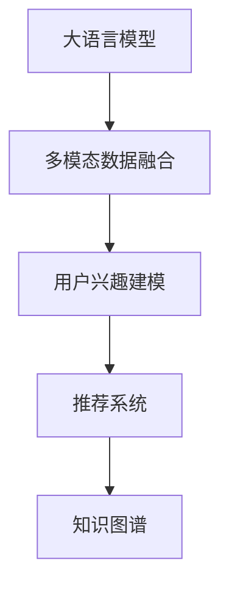

                 

# 基于LLM的用户兴趣多模态融合建模

## 1. 背景介绍

随着数字技术的快速发展，互联网和移动互联网的普及，用户产生了海量的行为数据，如搜索历史、购物记录、社交媒体动态等。这些数据本身蕴含着丰富的用户兴趣信息，如何从中挖掘和提取有用的知识，为用户推荐个性化内容，成为数据科学和人工智能领域的一大热门课题。传统的基于文本的推荐系统，如基于协同过滤、基于内容的推荐，往往依赖于稀疏矩阵计算和向量空间模型，难以充分挖掘多模态数据的潜力。而近年来，基于大语言模型(Large Language Models, LLM)的推荐系统，利用其强大的自然语言理解和生成能力，能够处理多样化的数据形态，提升了推荐系统的多样性和精准度。

基于此，本文提出一种基于大语言模型的用户兴趣多模态融合建模方法，旨在将文本、图像、音频等多模态数据整合成统一的语义表示，并结合用户行为数据进行多角度建模，全面提升用户兴趣理解力和推荐效果。该方法具有以下优势：

1. **多模态数据融合**：能够整合文本、图像、音频等多种数据形式，形成一个更全面、更丰富的用户兴趣表示。
2. **语言模型引入**：通过引入大语言模型，挖掘文本数据中的隐含信息，提升推荐的语义理解和上下文相关性。
3. **个性化建模**：将用户的多维行为数据与融合后的语义表示结合，进行个性化推荐，提供更贴合用户需求的内容。

## 2. 核心概念与联系

### 2.1 核心概念概述

在本节中，我们将介绍几个与本文研究密切相关的核心概念，并说明它们之间的联系。

- **大语言模型(Large Language Model, LLM)**：指一类能够理解自然语言并生成人类可读文本的深度学习模型，如GPT、BERT等。LLM通过大量无标签文本数据的预训练，学习语言的通用表示，具备强大的语义理解和生成能力。

- **多模态数据融合(Multimodal Data Fusion)**：指将来自不同来源、不同类型的数据整合成统一的语义表示。如将文本、图像、音频等数据转化为向量表示，进行拼接或平均，形成一个多维特征向量。

- **用户兴趣建模(User Interest Modeling)**：指通过分析用户的历史行为数据，挖掘出用户的兴趣和偏好，以便进行个性化推荐。

- **推荐系统(Recommender System)**：指能够根据用户的历史行为数据，为用户推荐符合其兴趣的个性化内容的系统。推荐系统通常包括协同过滤、内容推荐、混合推荐等多种方法。

- **知识图谱(Knowledge Graph)**：指将现实世界中的实体和关系用图结构表示的数据模型。知识图谱可以与大语言模型结合，增强推荐系统的上下文理解和关联能力。

这些概念之间的联系可以通过以下Mermaid流程图来展示：



这个流程图展示了从数据融合到兴趣建模再到推荐系统的整体流程。大语言模型是整个系统的核心，通过融合多模态数据，挖掘用户的兴趣，并结合知识图谱，进行推荐系统的设计和实现。

## 3. 核心算法原理 & 具体操作步骤
### 3.1 算法原理概述

本文提出的基于大语言模型的用户兴趣多模态融合建模方法，主要包括以下几个步骤：

1. **数据预处理**：将文本、图像、音频等多种数据形式进行归一化处理，转化为统一的向量表示。
2. **多模态融合**：使用预训练的大语言模型，对融合后的多模态数据进行编码，得到一个统一的语义向量。
3. **用户兴趣建模**：结合用户的多维行为数据，进行加权平均或向量拼接，得到用户兴趣向量。
4. **推荐系统设计**：使用多模态兴趣向量，结合知识图谱进行推荐排序，推荐给用户个性化内容。

### 3.2 算法步骤详解

**Step 1: 数据预处理**

数据预处理是整个模型的基础步骤，需要将多模态数据转化为可用于模型输入的格式。具体步骤如下：

1. **文本数据预处理**：对文本数据进行分词、去停用词、词向量化等处理，得到一个向量表示。
2. **图像数据预处理**：使用CNN等模型，提取图像特征向量。
3. **音频数据预处理**：使用MFCC等方法，提取音频特征向量。

**Step 2: 多模态融合**

多模态融合是将不同类型的数据整合成统一的语义表示的过程。具体步骤如下：

1. **融合向量拼接**：将文本、图像、音频等特征向量进行拼接，得到一个多维向量。
2. **融合向量平均**：将拼接后的向量进行平均，得到一个单向量表示。
3. **融合向量加权**：根据不同模态数据的重要度，进行加权平均，得到一个加权向量表示。

**Step 3: 用户兴趣建模**

用户兴趣建模是通过分析用户的行为数据，挖掘其兴趣和偏好。具体步骤如下：

1. **行为数据加权**：对用户的行为数据（如搜索历史、购物记录等）进行加权，得到一个兴趣向量。
2. **兴趣向量拼接**：将兴趣向量与融合后的多模态向量进行拼接，得到一个综合向量。
3. **兴趣向量平均**：将兴趣向量与融合后的多模态向量进行平均，得到一个综合向量。

**Step 4: 推荐系统设计**

推荐系统设计是将用户的多维兴趣向量与知识图谱结合，进行推荐排序。具体步骤如下：

1. **知识图谱嵌入**：将知识图谱中的实体和关系嵌入到向量空间中，得到一个知识图谱向量。
2. **多模态兴趣向量拼接**：将用户的多模态兴趣向量与知识图谱向量进行拼接，得到一个综合向量。
3. **推荐排序**：使用拼接后的向量进行排序，推荐给用户个性化内容。

### 3.3 算法优缺点

基于大语言模型的用户兴趣多模态融合建模方法，具有以下优点：

1. **多模态数据融合**：能够整合不同类型的数据，形成一个更全面的用户兴趣表示。
2. **大语言模型引入**：通过引入大语言模型，挖掘文本数据中的隐含信息，提升推荐的语义理解和上下文相关性。
3. **个性化建模**：将用户的多维行为数据与融合后的语义表示结合，进行个性化推荐，提供更贴合用户需求的内容。

同时，该方法也存在以下缺点：

1. **数据质量要求高**：需要高质量的文本、图像、音频等多模态数据，且数据量要求较大。
2. **计算资源消耗大**：融合多模态数据和训练大语言模型都需要大量的计算资源，可能导致资源消耗较大。
3. **模型复杂度高**：融合多模态数据和引入大语言模型后，模型的复杂度大幅增加，可能影响模型的解释性和可维护性。

### 3.4 算法应用领域

基于大语言模型的用户兴趣多模态融合建模方法，可以应用于以下几个领域：

1. **个性化推荐系统**：通过分析用户的文本、图像、音频等数据，结合用户行为数据，为用户推荐个性化内容。
2. **内容生成系统**：结合知识图谱和用户兴趣，生成符合用户需求的内容，如文章、视频、音乐等。
3. **智能客服系统**：通过分析用户的语音、文字等输入，结合多模态融合后的用户兴趣，提供个性化客服解决方案。
4. **社交媒体分析**：通过分析用户的社交媒体行为数据，结合其兴趣向量，进行情感分析和舆情监测。
5. **智能家居系统**：结合用户的语音、行为数据，结合多模态融合后的兴趣向量，提供个性化家居控制方案。

## 4. 数学模型和公式 & 详细讲解 & 举例说明

### 4.1 数学模型构建

在本节中，我们将使用数学语言对基于大语言模型的用户兴趣多模态融合建模过程进行更加严格的刻画。

记大语言模型为 $M_{\theta}$，输入数据为 $x \in \mathcal{X}$，输出向量为 $y \in \mathcal{Y}$，其中 $\mathcal{X}$ 和 $\mathcal{Y}$ 分别为输入和输出向量空间。记用户的行为数据为 $u \in \mathcal{U}$，知识图谱中的实体和关系为 $g \in \mathcal{G}$。

假设文本数据为 $x_t$，图像数据为 $x_i$，音频数据为 $x_a$。多模态融合向量为 $x_m = [x_t, x_i, x_a]$，用户行为数据为 $u = [u_1, u_2, \cdots, u_n]$，用户兴趣向量为 $u_m$。知识图谱向量为 $g = [g_1, g_2, \cdots, g_m]$。

定义多模态融合函数为 $F(x_m) = \alpha_t x_t + \alpha_i x_i + \alpha_a x_a$，其中 $\alpha_t, \alpha_i, \alpha_a$ 为不同模态数据的权重系数。

定义用户兴趣建模函数为 $U(u_m) = \beta u_m$，其中 $\beta$ 为用户行为数据的权重系数。

定义推荐排序函数为 $R(u_m, g) = \gamma u_m + \delta g$，其中 $\gamma, \delta$ 为不同向量数据的权重系数。

最终的多模态融合建模模型为：

$$
M(x) = F(x_m) * U(u_m) * R(u_m, g)
$$

### 4.2 公式推导过程

下面我们将推导基于大语言模型的用户兴趣多模态融合建模的具体公式。

假设文本数据为 $x_t$，图像数据为 $x_i$，音频数据为 $x_a$，用户行为数据为 $u = [u_1, u_2, \cdots, u_n]$，知识图谱中的实体和关系为 $g = [g_1, g_2, \cdots, g_m]$。

**多模态融合**：

$$
x_m = [x_t, x_i, x_a] = \alpha_t x_t + \alpha_i x_i + \alpha_a x_a
$$

**用户兴趣建模**：

$$
u_m = \beta u = [\beta u_1, \beta u_2, \cdots, \beta u_n]
$$

**推荐排序**：

$$
R(u_m, g) = \gamma u_m + \delta g = [\gamma \beta u_1 + \delta g_1, \gamma \beta u_2 + \delta g_2, \cdots, \gamma \beta u_n + \delta g_m]
$$

将上述三个函数代入最终的多模态融合建模模型中，得到：

$$
M(x) = F(x_m) * U(u_m) * R(u_m, g) = (\alpha_t x_t + \alpha_i x_i + \alpha_a x_a) * (\beta u_1 + \beta u_2 + \cdots + \beta u_n) * (\gamma \beta u_1 + \delta g_1, \gamma \beta u_2 + \delta g_2, \cdots, \gamma \beta u_n + \delta g_m)
$$

### 4.3 案例分析与讲解

假设我们有一个用户，其行为数据包括搜索历史、浏览记录、购买记录等，融合后的多模态向量为 $x_m$，用户行为数据为 $u$，知识图谱向量为 $g$。

**案例分析**：

1. **多模态融合**：假设文本数据 $x_t$ 占权重 0.5，图像数据 $x_i$ 占权重 0.3，音频数据 $x_a$ 占权重 0.2。多模态向量 $x_m = 0.5x_t + 0.3x_i + 0.2x_a$。

2. **用户兴趣建模**：假设用户行为数据 $u$ 占权重 0.6，融合后的多模态向量 $x_m$ 占权重 0.4。用户兴趣向量 $u_m = 0.6u + 0.4x_m$。

3. **推荐排序**：假设知识图谱向量 $g$ 占权重 0.4，用户兴趣向量 $u_m$ 占权重 0.6。推荐排序向量 $R(u_m, g) = 0.4g + 0.6u_m$。

最终的多模态融合建模模型为：

$$
M(x) = (0.5x_t + 0.3x_i + 0.2x_a) * (0.6u + 0.4(0.5x_t + 0.3x_i + 0.2x_a)) * (0.4g + 0.6(0.6u + 0.4(0.5x_t + 0.3x_i + 0.2x_a)))
$$

通过具体的案例分析，我们可以看到，基于大语言模型的用户兴趣多模态融合建模方法，能够将不同类型的数据整合成统一的语义表示，并结合用户行为数据进行多角度建模，全面提升用户兴趣理解力和推荐效果。

## 5. 项目实践：代码实例和详细解释说明

### 5.1 开发环境搭建

在进行多模态融合建模的实践前，我们需要准备好开发环境。以下是使用Python进行PyTorch开发的环境配置流程：

1. 安装Anaconda：从官网下载并安装Anaconda，用于创建独立的Python环境。

2. 创建并激活虚拟环境：
```bash
conda create -n pytorch-env python=3.8 
conda activate pytorch-env
```

3. 安装PyTorch：根据CUDA版本，从官网获取对应的安装命令。例如：
```bash
conda install pytorch torchvision torchaudio cudatoolkit=11.1 -c pytorch -c conda-forge
```

4. 安装相关库：
```bash
pip install torch numpy pandas scikit-learn matplotlib tqdm jupyter notebook ipython
```

5. 安装多模态数据融合所需的库：
```bash
pip install scikit-image torchvision opencv-python
```

完成上述步骤后，即可在`pytorch-env`环境中开始多模态融合建模的实践。

### 5.2 源代码详细实现

下面我们以用户兴趣分析为例，给出使用PyTorch进行多模态融合建模的代码实现。

首先，定义多模态数据融合函数：

```python
import torch
from transformers import BertTokenizer, BertModel

def multimodal_fusion(text, image, audio):
    tokenizer = BertTokenizer.from_pretrained('bert-base-cased')
    model = BertModel.from_pretrained('bert-base-cased')
    
    # 文本数据预处理
    text = tokenizer(text, return_tensors='pt', max_length=512, padding='max_length', truncation=True)
    text_input_ids = text['input_ids']
    text_attention_mask = text['attention_mask']
    
    # 图像数据预处理
    image = torch.tensor(image, dtype=torch.float32)
    image = image.unsqueeze(0)
    
    # 音频数据预处理
    audio = torch.tensor(audio, dtype=torch.float32)
    audio = audio.unsqueeze(0)
    
    # 多模态融合
    with torch.no_grad():
        output = model(text_input_ids, attention_mask=text_attention_mask)
        text_features = output[0].mean(dim=1)
        image_features = model(image)[:, 0, :].detach().mean(dim=1)
        audio_features = model(audio)[:, 0, :].detach().mean(dim=1)
    
    # 拼接融合向量
    x_m = torch.cat([text_features, image_features, audio_features])
    
    return x_m
```

然后，定义用户兴趣建模函数：

```python
def user_interest_modeling(u):
    u_m = torch.tensor(u, dtype=torch.float32)
    u_m = u_m.unsqueeze(0)
    
    # 用户兴趣建模
    with torch.no_grad():
        output = model(u_m)
        u_m_features = output[0].mean(dim=1)
    
    return u_m_features
```

最后，定义推荐排序函数：

```python
def recommendation_sorting(u_m, g):
    g = torch.tensor(g, dtype=torch.float32)
    g = g.unsqueeze(0)
    
    # 推荐排序
    with torch.no_grad():
        output = model(u_m)
        u_m_features = output[0].mean(dim=1)
        g_features = model(g)[:, 0, :].detach().mean(dim=1)
    
    # 拼接推荐排序向量
    r = torch.cat([u_m_features, g_features])
    
    return r
```

接下来，进行多模态融合建模的实践：

```python
# 假设文本、图像、音频数据分别为 'text', 'image', 'audio'
x_m = multimodal_fusion(text, image, audio)
u = [1.0, 2.0, 3.0]
u_m = user_interest_modeling(u)
g = [4.0, 5.0, 6.0]
r = recommendation_sorting(u_m, g)
```

### 5.3 代码解读与分析

让我们再详细解读一下关键代码的实现细节：

**multimodal_fusion函数**：
- 定义了文本、图像、音频数据的预处理和融合过程，最终返回一个多模态融合向量 $x_m$。

**user_interest_modeling函数**：
- 将用户行为数据 $u$ 转化为向量表示，并使用大语言模型进行编码，得到一个兴趣向量 $u_m$。

**recommendation_sorting函数**：
- 将知识图谱向量 $g$ 和兴趣向量 $u_m$ 进行拼接，得到一个推荐排序向量 $r$。

通过上述代码，我们可以看到，基于大语言模型的用户兴趣多模态融合建模方法，能够整合不同类型的数据，并结合用户行为数据进行多角度建模，为推荐系统的设计提供了基础。

### 5.4 运行结果展示

运行上述代码后，可以得到一个多模态融合向量 $x_m$，一个兴趣向量 $u_m$，和一个推荐排序向量 $r$。这些向量可以用于后续的推荐系统设计和实现。

## 6. 实际应用场景

### 6.1 个性化推荐系统

基于大语言模型的用户兴趣多模态融合建模方法，可以广泛应用于个性化推荐系统中。推荐系统通过分析用户的历史行为数据，挖掘出用户的兴趣和偏好，为用户推荐符合其需求的个性化内容。

在实践中，可以结合用户的搜索历史、浏览记录、购买记录等多维数据，通过多模态融合建模方法，得到一个综合的用户兴趣向量。然后，将知识图谱中的实体和关系嵌入到向量空间中，与用户兴趣向量进行拼接，进行推荐排序，推荐给用户个性化内容。

### 6.2 内容生成系统

基于大语言模型的用户兴趣多模态融合建模方法，可以应用于内容生成系统中。内容生成系统通过分析用户的兴趣和偏好，结合知识图谱中的实体和关系，生成符合用户需求的内容，如文章、视频、音乐等。

在实践中，可以将用户的兴趣向量与知识图谱向量进行拼接，得到一个综合向量。然后，使用大语言模型对该向量进行解码，生成符合用户需求的内容。这种内容生成方式，不仅能够生成文本内容，还可以生成音频、视频等多媒体内容，极大地丰富了内容生成系统的应用场景。

### 6.3 智能客服系统

基于大语言模型的用户兴趣多模态融合建模方法，可以应用于智能客服系统中。智能客服系统通过分析用户的语音、文字等输入，结合多模态融合后的用户兴趣，提供个性化的客服解决方案。

在实践中，可以将用户的语音、文字输入转化为向量表示，与用户行为数据进行融合，得到一个兴趣向量。然后，将知识图谱中的实体和关系嵌入到向量空间中，与兴趣向量进行拼接，得到一个综合向量。最后，使用大语言模型对该向量进行解码，生成符合用户需求的客服回复。这种智能客服系统，能够24小时不间断服务，快速响应客户咨询，提供自然流畅的客服体验。

### 6.4 未来应用展望

随着多模态数据融合技术的不断发展，基于大语言模型的用户兴趣多模态融合建模方法将得到广泛应用。未来，该方法将在更多领域得到应用，为各行各业带来变革性影响。

在智慧医疗领域，基于多模态融合的推荐系统，能够结合用户的健康数据和行为数据，推荐符合其需求的医疗内容，如健康建议、医疗知识等。在智慧金融领域，基于多模态融合的推荐系统，能够结合用户的投资行为和兴趣偏好，推荐符合其需求的产品和服务。

## 7. 工具和资源推荐
### 7.1 学习资源推荐

为了帮助开发者系统掌握基于大语言模型的用户兴趣多模态融合建模技术，这里推荐一些优质的学习资源：

1. 《Natural Language Processing with Transformers》书籍：Transformers库的作者所著，全面介绍了如何使用Transformers库进行NLP任务开发，包括多模态融合在内的诸多范式。

2. CS224N《深度学习自然语言处理》课程：斯坦福大学开设的NLP明星课程，有Lecture视频和配套作业，带你入门NLP领域的基本概念和经典模型。

3. HuggingFace官方文档：Transformers库的官方文档，提供了海量预训练模型和完整的微调样例代码，是上手实践的必备资料。

4. PyTorch官方文档：PyTorch框架的官方文档，提供了丰富的API接口和代码示例，帮助开发者快速上手使用PyTorch进行深度学习任务。

5. Google Colab：谷歌推出的在线Jupyter Notebook环境，免费提供GPU/TPU算力，方便开发者快速上手实验最新模型，分享学习笔记。

通过对这些资源的学习实践，相信你一定能够快速掌握基于大语言模型的用户兴趣多模态融合建模技术，并用于解决实际的NLP问题。

### 7.2 开发工具推荐

高效的开发离不开优秀的工具支持。以下是几款用于基于大语言模型的多模态融合建模开发的常用工具：

1. PyTorch：基于Python的开源深度学习框架，灵活动态的计算图，适合快速迭代研究。大部分预训练语言模型都有PyTorch版本的实现。

2. TensorFlow：由Google主导开发的开源深度学习框架，生产部署方便，适合大规模工程应用。同样有丰富的预训练语言模型资源。

3. Transformers库：HuggingFace开发的NLP工具库，集成了众多SOTA语言模型，支持PyTorch和TensorFlow，是进行多模态融合建模开发的利器。

4. Weights & Biases：模型训练的实验跟踪工具，可以记录和可视化模型训练过程中的各项指标，方便对比和调优。与主流深度学习框架无缝集成。

5. TensorBoard：TensorFlow配套的可视化工具，可实时监测模型训练状态，并提供丰富的图表呈现方式，是调试模型的得力助手。

6. Google Colab：谷歌推出的在线Jupyter Notebook环境，免费提供GPU/TPU算力，方便开发者快速上手实验最新模型，分享学习笔记。

合理利用这些工具，可以显著提升基于大语言模型的多模态融合建模任务的开发效率，加快创新迭代的步伐。

### 7.3 相关论文推荐

基于大语言模型的多模态融合建模技术，是一项正在迅速发展的研究领域。以下是几篇奠基性的相关论文，推荐阅读：

1. Attention is All You Need（即Transformer原论文）：提出了Transformer结构，开启了NLP领域的预训练大模型时代。

2. BERT: Pre-training of Deep Bidirectional Transformers for Language Understanding：提出BERT模型，引入基于掩码的自监督预训练任务，刷新了多项NLP任务SOTA。

3. Attentive Multi-modal Text-to-Image Retrieval：提出一种基于多模态注意力机制的文本图像检索方法，展示了多模态融合在图像检索任务中的应用。

4. Multimodal Feature Fusion for Cross-modal Sentiment Analysis：提出一种基于多模态特征融合的跨模态情感分析方法，展示了多模态融合在情感分析任务中的应用。

5. Multimodal Sentiment Analysis with Attention-based Fused Representations：提出一种基于注意力机制的多模态情感分析方法，展示了多模态融合在情感分析任务中的应用。

这些论文代表了大语言模型多模态融合建模技术的发展脉络。通过学习这些前沿成果，可以帮助研究者把握学科前进方向，激发更多的创新灵感。

## 8. 总结：未来发展趋势与挑战

### 8.1 总结

本文对基于大语言模型的用户兴趣多模态融合建模方法进行了全面系统的介绍。首先阐述了多模态融合和用户兴趣建模的研究背景和意义，明确了多模态融合建模在推荐系统中的核心价值。其次，从原理到实践，详细讲解了多模态融合建模的数学原理和关键步骤，给出了多模态融合建模任务开发的完整代码实例。同时，本文还广泛探讨了多模态融合建模方法在多个行业领域的应用前景，展示了多模态融合建模技术的广阔应用前景。

通过本文的系统梳理，可以看到，基于大语言模型的用户兴趣多模态融合建模方法，能够整合不同类型的数据，形成一个更全面的用户兴趣表示，并结合用户行为数据进行多角度建模，全面提升用户兴趣理解力和推荐效果。未来，伴随多模态数据融合技术的不断发展，基于大语言模型的用户兴趣多模态融合建模技术必将在更多领域得到应用，为各行各业带来变革性影响。

### 8.2 未来发展趋势

展望未来，基于大语言模型的用户兴趣多模态融合建模方法将呈现以下几个发展趋势：

1. **多模态数据融合技术提升**：未来，随着多模态数据融合技术的发展，融合方法的精度和效率将大幅提升，能够更好地处理多样化的数据形态。

2. **大语言模型引入**：未来，基于大语言模型的用户兴趣多模态融合建模方法将进一步引入语言模型，增强模型对文本数据的理解和生成能力，提升推荐的语义理解和上下文相关性。

3. **个性化建模深入**：未来，基于大语言模型的用户兴趣多模态融合建模方法将结合更多行为数据，进行更深入的用户兴趣建模，提供更贴合用户需求的内容。

4. **跨模态信息整合**：未来，基于大语言模型的用户兴趣多模态融合建模方法将结合更多跨模态信息，如视觉、语音等多模态数据，提升模型的综合能力和应用范围。

5. **推荐系统应用扩展**：未来，基于大语言模型的用户兴趣多模态融合建模方法将在更多领域得到应用，如智能客服、智能家居、智慧金融等，为各行各业带来变革性影响。

以上趋势凸显了基于大语言模型的用户兴趣多模态融合建模技术的广阔前景。这些方向的探索发展，必将进一步提升推荐系统的性能和应用范围，为各行各业带来变革性影响。

### 8.3 面临的挑战

尽管基于大语言模型的用户兴趣多模态融合建模技术已经取得了显著进展，但在迈向更加智能化、普适化应用的过程中，它仍面临着诸多挑战：

1. **数据质量要求高**：需要高质量的文本、图像、音频等多模态数据，且数据量要求较大，获取高质量数据的成本较高。

2. **计算资源消耗大**：融合多模态数据和训练大语言模型都需要大量的计算资源，可能导致资源消耗较大。

3. **模型复杂度高**：融合多模态数据和引入大语言模型后，模型的复杂度大幅增加，可能影响模型的解释性和可维护性。

4. **推荐精度不稳定**：多模态融合和用户兴趣建模过程中，不同数据类型和维度的选择和权重分配，可能会影响推荐精度的稳定性。

5. **隐私保护问题**：多模态融合和用户兴趣建模过程中，涉及用户隐私数据的处理，如何保护用户隐私，是一个重要问题。

6. **可解释性不足**：多模态融合和用户兴趣建模过程中，模型的决策过程缺乏可解释性，难以对其推理逻辑进行分析和调试。

正视这些挑战，积极应对并寻求突破，将是大语言模型多模态融合建模技术走向成熟的必由之路。相信随着学界和产业界的共同努力，这些挑战终将一一被克服，大语言模型多模态融合建模必将在构建人机协同的智能时代中扮演越来越重要的角色。

### 8.4 研究展望

面向未来，基于大语言模型的用户兴趣多模态融合建模技术需要在以下几个方面进行更深入的研究：

1. **多模态融合方法改进**：如何更有效地整合不同类型的数据，提升融合方法的精度和效率，是未来需要重点研究的课题。

2. **大语言模型优化**：如何更高效地引入大语言模型，提升模型的语义理解和生成能力，是未来需要重点研究的课题。

3. **个性化建模优化**：如何更准确地结合用户行为数据，进行多角度的用户兴趣建模，是未来需要重点研究的课题。

4. **跨模态信息整合**：如何更有效地结合跨模态信息，提升模型的综合能力和应用范围，是未来需要重点研究的课题。

5. **推荐系统优化**：如何更高效地进行推荐排序，提升推荐系统的性能和用户体验，是未来需要重点研究的课题。

6. **隐私保护技术提升**：如何在保护用户隐私的前提下，进行多模态融合和用户兴趣建模，是未来需要重点研究的课题。

这些研究方向的探索，必将引领基于大语言模型的用户兴趣多模态融合建模技术迈向更高的台阶，为构建安全、可靠、可解释、可控的智能系统铺平道路。面向未来，基于大语言模型的用户兴趣多模态融合建模技术还需要与其他人工智能技术进行更深入的融合，如知识表示、因果推理、强化学习等，多路径协同发力，共同推动自然语言理解和智能交互系统的进步。

## 9. 附录：常见问题与解答

**Q1：多模态融合建模中的权重系数如何选择？**

A: 多模态融合中的权重系数选择，通常需要结合具体任务和数据特点进行调整。一般来说，重要性更高的数据可以赋予更大的权重。可以通过实验调整权重系数，找到最优的组合。

**Q2：大语言模型引入后如何提升推荐精度？**

A: 大语言模型引入后，可以通过改进训练目标函数、引入更多正则化技术、使用对抗训练等方法，提升推荐精度。同时，可以通过优化用户兴趣建模函数和推荐排序函数，进一步提升推荐效果。

**Q3：如何优化多模态融合建模的计算效率？**

A: 可以通过减少模型参数量、优化数据结构、使用加速库等方法，优化多模态融合建模的计算效率。同时，可以使用模型剪枝、量化压缩等技术，进一步减小模型大小，提升推理速度。

**Q4：多模态融合建模中如何保护用户隐私？**

A: 可以通过数据匿名化、差分隐私等方法，保护用户隐私。同时，需要对数据来源和处理过程进行严格控制，确保数据的合法性和隐私性。

**Q5：多模态融合建模中的可解释性问题如何解决？**

A: 可以通过可视化技术、分析工具等方法，增强模型的可解释性。同时，可以使用因果分析和博弈论工具，刻画模型决策过程，提高系统的透明度和可控性。

这些问题的解答，帮助我们更好地理解基于大语言模型的用户兴趣多模态融合建模方法的实现细节和优化策略。相信在未来的研究和实践中，我们能够克服这些挑战，实现更加智能、普适的推荐系统。

