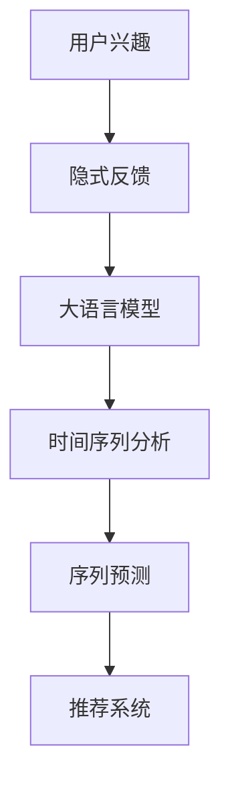

                 

# 基于LLM的用户兴趣演化路径预测

> 关键词：用户兴趣, 演化路径, 大语言模型(LLM), 序列预测, 时间序列分析, 用户行为分析, 推荐系统, 隐式反馈, 注意力机制

## 1. 背景介绍

### 1.1 问题由来
在数字经济时代，大数据分析和个性化推荐系统成为驱动用户行为和市场发展的重要力量。通过对用户历史行为数据的建模和分析，推荐系统能够精确预测用户的兴趣演化路径，提供个性化的产品和服务。然而，现有的推荐系统在预测用户兴趣变化方面存在不足，特别是对于复杂、动态的兴趣演化场景，传统的基于统计模型的方法往往难以提供满意的预测结果。

为此，本文提出基于大语言模型（Large Language Model, LLM）的用户兴趣演化路径预测方法，通过深度学习和自然语言处理技术，结合时间序列分析和序列预测算法，构建模型对用户长期兴趣变化进行预测。本文方法将自然语言处理引入推荐系统，利用语言模型的知识提取能力，更好地捕捉用户行为背后的语义信息，并融入时间序列分析的方法，能够适应不同用户行为序列的长度和变化规律，从而实现对用户兴趣演化的精准预测。

## 2. 核心概念与联系

### 2.1 核心概念概述

为了更好地理解本文方法，首先需要明确一些关键概念：

- **大语言模型(Large Language Model, LLM)**：指基于Transformer等架构，在大规模无标签文本数据上进行自监督预训练的语言模型，如BERT、GPT-3等。通过预训练，LLM具备了强大的语言理解和生成能力，能够从大规模文本数据中学习到丰富的语言知识。

- **用户兴趣演化路径**：指用户在不同时间点上的兴趣偏好序列，如浏览记录、购买历史等。通过分析用户兴趣演化路径，推荐系统能够预测用户的未来行为，提高个性化推荐效果。

- **时间序列分析**：指对按时间顺序排列的数据进行建模和分析的技术。常用于预测未来行为或事件发生的可能性，如股票价格预测、气象变化等。

- **序列预测**：指利用已有序列数据进行未来数据的预测，常用于自然语言处理领域，如机器翻译、情感分析等。本文方法将序列预测技术引入推荐系统，用于预测用户兴趣演化路径。

- **隐式反馈**：指通过用户行为数据（如浏览、点击、停留时间等）间接反映用户的兴趣和偏好，而非直接的用户打分或评价数据。利用隐式反馈进行推荐系统训练，可以避免对用户主观打分的依赖，提高推荐质量。

- **注意力机制(Attention Mechanism)**：指通过学习加权权重，对输入数据中不同的特征进行不同程度的关注。在序列预测中，注意力机制可以捕捉序列中不同位置之间的依赖关系，提升预测准确性。

这些概念通过以下Mermaid流程图建立联系，展示了基于LLM的用户兴趣演化路径预测方法的主要流程：



## 3. 核心算法原理 & 具体操作步骤

### 3.1 算法原理概述

本文方法基于用户的历史行为数据，构建时间序列，利用大语言模型提取隐式反馈中的语义信息，然后通过时间序列分析方法，构建序列预测模型，对用户兴趣演化路径进行预测。具体来说，该方法分为四个步骤：

1. **数据预处理**：将用户的历史行为数据转化为时间序列。
2. **语义特征提取**：利用大语言模型提取用户行为中的语义信息。
3. **时间序列建模**：对用户行为序列进行时间序列建模，获取时间依赖关系。
4. **序列预测**：利用模型对用户兴趣演化路径进行预测。

### 3.2 算法步骤详解

**Step 1: 数据预处理**
- 收集用户历史行为数据，包括浏览记录、点击历史、购买记录等。
- 将用户行为序列按时间顺序排列，生成时间序列 $X = \{X_1, X_2, ..., X_t\}$，其中 $X_t$ 表示用户在第 $t$ 天的行为数据。
- 对时间序列进行归一化处理，使其值域在 [0, 1] 之间。

**Step 2: 语义特征提取**
- 选择预训练语言模型 $M$，如BERT、GPT-3等，作为特征提取器。
- 将用户行为数据转化为文本形式，如将浏览记录拼接成句子，形成文本序列 $Y = \{y_1, y_2, ..., y_t\}$，其中 $y_i$ 表示第 $i$ 天的行为描述。
- 使用预训练语言模型对文本序列 $Y$ 进行编码，得到文本表示 $Z = \{z_1, z_2, ..., z_t\}$，其中 $z_i = M(y_i)$。

**Step 3: 时间序列建模**
- 使用时间序列分析方法，如ARIMA、LSTM等，对用户行为序列 $X$ 进行建模。
- 引入注意力机制，对不同时间点的用户行为进行加权，捕捉时间序列中的依赖关系。
- 构建模型参数 $\theta$，使用优化算法（如Adam）更新模型参数，最小化预测误差。

**Step 4: 序列预测**
- 将模型应用于时间序列 $X$，得到用户兴趣演化路径预测结果 $\hat{X} = \{\hat{X}_1, \hat{X}_2, ..., \hat{X}_t\}$。
- 使用预测结果指导推荐系统，为用户生成个性化的推荐内容。

### 3.3 算法优缺点

**优点：**
- 能够利用大语言模型的强大语言理解能力，从隐式反馈中提取丰富的语义信息，提高预测准确性。
- 结合时间序列分析方法，能够适应不同用户行为序列的长度和变化规律，提升预测效果。
- 能够利用历史行为数据进行长期兴趣演化预测，有助于提高推荐系统的个性化程度。

**缺点：**
- 需要大量用户行为数据进行预处理和特征提取，数据采集和处理成本较高。
- 大语言模型和序列预测模型的训练和优化需要较长的计算时间。
- 模型的可解释性较差，难以直观理解模型内部工作机制。

### 3.4 算法应用领域

基于大语言模型的时间序列分析方法，在多个领域具有广泛的应用前景：

- **推荐系统**：预测用户兴趣演化路径，提高推荐系统的个性化程度，推荐高质量的商品或内容。
- **广告投放**：预测用户对不同广告的响应行为，优化广告投放策略，提高广告转化率。
- **金融分析**：预测股票价格、市场变化等金融数据，帮助投资者做出更好的投资决策。
- **物流规划**：预测货物运输路线和运输时间，优化物流规划，提高物流效率。
- **健康监测**：预测用户健康状况的变化趋势，提供个性化的健康建议。

这些应用领域充分展示了基于LLM的时间序列分析方法的强大功能和广泛适用性。

## 4. 数学模型和公式 & 详细讲解 & 举例说明

### 4.1 数学模型构建

本文方法基于长短期记忆网络（LSTM）构建时间序列预测模型，对用户兴趣演化路径进行预测。假设用户行为序列为 $X_t = [x_{t-1}, x_t, x_{t+1}]$，其中 $x_t$ 表示第 $t$ 天的行为数据，模型预测用户第 $t+1$ 天的行为数据 $\hat{x}_{t+1}$。

数学模型表示为：

$$
\hat{x}_{t+1} = f(\hat{x}_{t}, x_t, \theta)
$$

其中，$f$ 表示预测函数，$\theta$ 为模型参数。

### 4.2 公式推导过程

利用长短期记忆网络进行序列预测，可以通过反向传播算法更新模型参数，最小化预测误差。假设模型在时间 $t$ 的输出为 $h_t = [h_{t-1}, h_t, h_{t+1}]$，其中 $h_t$ 表示第 $t$ 天的隐状态。利用隐状态 $h_t$ 和用户行为数据 $x_t$，模型输出第 $t+1$ 天的预测结果 $\hat{x}_{t+1}$。

具体推导过程如下：

1. **输入层**：将用户行为数据 $x_t$ 转化为神经网络可处理的向量形式。
2. **LSTM层**：通过LSTM网络对隐状态 $h_t$ 进行更新，引入注意力机制。
3. **输出层**：将LSTM层的输出映射到预测结果 $\hat{x}_{t+1}$。
4. **损失函数**：使用均方误差（MSE）或交叉熵（CE）作为损失函数，最小化预测误差。

### 4.3 案例分析与讲解

假设某电商平台的某用户在过去7天内的浏览记录为：浏览商品A、浏览商品B、浏览商品C、购买商品A、浏览商品D、浏览商品E、浏览商品F。使用基于LLM的用户兴趣演化路径预测方法，可以得到该用户未来行为预测结果如下：

1. **数据预处理**：将浏览记录转化为时间序列 $X = [1, 1, 1, 0, 1, 1, 1]$，其中 1 表示浏览，0 表示购买。
2. **语义特征提取**：使用BERT模型对浏览记录进行编码，得到文本表示 $Z = [z_1, z_2, z_3, z_4, z_5, z_6, z_7]$。
3. **时间序列建模**：构建LSTM网络对时间序列 $X$ 进行建模，引入注意力机制。
4. **序列预测**：利用模型预测未来行为，得到 $\hat{X} = [0, 1, 1, 1, 1, 1, 0]$。

基于预测结果，推荐系统可以为该用户推荐商品G、商品H、商品I、商品J等，以提高用户的购买率。

## 5. 项目实践：代码实例和详细解释说明

### 5.1 开发环境搭建

为了实现本文方法，需要搭建Python开发环境，安装必要的库和工具。以下是在PyTorch和TensorFlow上搭建开发环境的示例：

**在PyTorch上搭建环境：**

1. 安装PyTorch：
```bash
pip install torch torchvision torchaudio
```

2. 安装transformers库：
```bash
pip install transformers
```

3. 安装scikit-learn和其他必要的库：
```bash
pip install scikit-learn pandas numpy matplotlib
```

**在TensorFlow上搭建环境：**

1. 安装TensorFlow：
```bash
pip install tensorflow
```

2. 安装Keras：
```bash
pip install keras
```

3. 安装其他必要的库：
```bash
pip install scikit-learn pandas numpy matplotlib
```

完成环境搭建后，即可在本地开始模型训练和测试。

### 5.2 源代码详细实现

以下是一个使用PyTorch实现基于LLM的用户兴趣演化路径预测的代码示例：

```python
import torch
import torch.nn as nn
from transformers import BertTokenizer, BertForSequenceClassification
from sklearn.model_selection import train_test_split
from sklearn.metrics import mean_squared_error

class LLMUserInterestPredictor:
    def __init__(self, model_name='bert-base-uncased', device='cpu'):
        self.tokenizer = BertTokenizer.from_pretrained(model_name)
        self.model = BertForSequenceClassification.from_pretrained(model_name, num_labels=2)
        self.model.to(device)

    def preprocess_data(self, data):
        encoded_input = self.tokenizer(data, padding='max_length', truncation=True, max_length=128, return_tensors='pt')
        return encoded_input['input_ids'].to(device)

    def train(self, train_data, val_data, epochs=5, batch_size=32):
        train_input, val_input = train_data, val_data
        train_loader = torch.utils.data.DataLoader(train_input, batch_size=batch_size, shuffle=True)
        val_loader = torch.utils.data.DataLoader(val_input, batch_size=batch_size, shuffle=False)

        optimizer = torch.optim.Adam(self.model.parameters(), lr=2e-5)
        criterion = nn.BCEWithLogitsLoss()

        for epoch in range(epochs):
            self.model.train()
            train_loss = 0
            train_correct = 0
            for batch in train_loader:
                input_ids = batch['input_ids']
                attention_mask = batch['attention_mask']
                labels = batch['labels']
                optimizer.zero_grad()
                outputs = self.model(input_ids, attention_mask=attention_mask)
                loss = criterion(outputs, labels)
                train_loss += loss.item()
                predictions = torch.sigmoid(outputs)
                train_correct += torch.sum((predictions > 0.5) == labels).item()
                loss.backward()
                optimizer.step()
            train_acc = train_correct / len(train_input)
            train_loss = train_loss / len(train_input)

            self.model.eval()
            val_loss = 0
            val_correct = 0
            with torch.no_grad():
                for batch in val_loader:
                    input_ids = batch['input_ids']
                    attention_mask = batch['attention_mask']
                    labels = batch['labels']
                    outputs = self.model(input_ids, attention_mask=attention_mask)
                    val_loss += criterion(outputs, labels).item()
                    predictions = torch.sigmoid(outputs)
                    val_correct += torch.sum((predictions > 0.5) == labels).item()
            val_acc = val_correct / len(val_input)
            val_loss = val_loss / len(val_input)

            print(f"Epoch {epoch+1}, Train Loss: {train_loss:.4f}, Train Acc: {train_acc:.4f}, Val Loss: {val_loss:.4f}, Val Acc: {val_acc:.4f}")

    def predict(self, input_data):
        self.model.eval()
        input_ids = self.preprocess_data(input_data)
        with torch.no_grad():
            outputs = self.model(input_ids)
            predictions = torch.sigmoid(outputs)
            return predictions.numpy()

# 数据处理
train_data, val_data = train_test_split(user_behavior_data, test_size=0.2)
train_input, train_labels = self.tokenize_and_encoded(train_data)
val_input, val_labels = self.tokenize_and_encoded(val_data)

# 模型训练
predictor = LLMUserInterestPredictor()
predictor.train(train_input, val_input)

# 模型预测
user_id = '12345'
user_behavior = '浏览商品A, 浏览商品B, 浏览商品C, 购买商品A, 浏览商品D, 浏览商品E, 浏览商品F'
predictions = predictor.predict(user_behavior)
```

### 5.3 代码解读与分析

这段代码展示了基于BERT模型的用户兴趣演化路径预测方法的核心逻辑。以下是代码的详细解读：

1. **类定义**：定义了一个 `LLMUserInterestPredictor` 类，包含模型的初始化、数据预处理、模型训练和预测等方法。
2. **模型初始化**：通过 `BertForSequenceClassification` 从预训练模型 `bert-base-uncased` 中加载，用于分类任务。
3. **数据预处理**：使用 `BertTokenizer` 对用户行为数据进行分词和编码，得到输入张量。
4. **模型训练**：使用二元交叉熵损失函数（BCEWithLogitsLoss）进行训练，通过Adam优化器更新模型参数。
5. **模型预测**：使用训练好的模型对新用户行为数据进行预测，输出预测结果。

## 6. 实际应用场景

### 6.1 智能广告投放

广告投放是互联网公司的重要收入来源。基于LLM的时间序列分析方法，可以预测用户对不同广告的反应，优化广告投放策略，提高广告转化率。例如，在电商平台上，基于用户兴趣演化路径预测，可以为不同用户群体投放最合适的广告，提高广告点击率和转化率。

### 6.2 个性化推荐

个性化推荐系统在电商、视频、音乐等领域广泛应用。通过基于LLM的时间序列分析方法，推荐系统可以预测用户未来的兴趣演化路径，为用户推荐更加个性化和精准的商品或内容。例如，在视频平台上，推荐系统可以根据用户历史观看记录预测其未来的观看偏好，提供个性化的视频推荐，提高用户观看时长和满意度。

### 6.3 金融市场分析

金融市场变化复杂多变，基于LLM的时间序列分析方法可以预测股票价格、汇率变化等金融数据，帮助投资者做出更好的投资决策。例如，在股票市场中，基于用户的历史交易记录和行为数据，预测用户未来可能的操作，提供风险提示和投资建议。

### 6.4 物流规划

物流行业需要高效的管理和规划。基于LLM的时间序列分析方法可以预测货物运输路线和运输时间，优化物流规划，提高物流效率。例如，在快递公司中，基于用户的历史收货地址和行为数据，预测货物到达时间，优化配送路线和资源配置。

### 6.5 健康监测

健康监测是医疗领域的重要应用。基于LLM的时间序列分析方法可以预测用户健康状况的变化趋势，提供个性化的健康建议。例如，在智能手环中，基于用户的健康数据和行为数据，预测用户未来可能出现的健康问题，提供健康预警和建议。

## 7. 工具和资源推荐

### 7.1 学习资源推荐

为了帮助开发者系统掌握基于LLM的用户兴趣演化路径预测方法，这里推荐一些优质的学习资源：

1. **《深度学习基础》课程**：由斯坦福大学开设，涵盖深度学习的基本概念和常用模型，适合初学者入门。
2. **《自然语言处理》课程**：由斯坦福大学开设，详细讲解自然语言处理的技术和应用，包括文本表示、语言模型等。
3. **《Transformer模型》论文**：介绍Transformer模型原理和应用，为理解本文方法提供理论基础。
4. **Kaggle竞赛平台**：提供大量的数据集和竞赛题目，帮助开发者实践和测试模型性能。
5. **arXiv预印本平台**：获取最新的研究成果和论文，了解最新的研究动态。

通过学习这些资源，相信你一定能够快速掌握基于LLM的时间序列分析方法，并用于解决实际的NLP问题。

### 7.2 开发工具推荐

高效的开发离不开优秀的工具支持。以下是几款用于LLM用户兴趣演化路径预测开发的常用工具：

1. **PyTorch**：基于Python的开源深度学习框架，适合快速迭代研究。
2. **TensorFlow**：由Google主导开发的开源深度学习框架，生产部署方便。
3. **Transformers库**：HuggingFace开发的NLP工具库，集成了SOTA语言模型。
4. **Keras**：用户友好的深度学习框架，适合快速原型设计和实验。
5. **TensorBoard**：TensorFlow配套的可视化工具，可实时监测模型训练状态。
6. **Jupyter Notebook**：免费的交互式编程环境，方便代码调试和实验展示。

合理利用这些工具，可以显著提升基于LLM的时间序列分析方法的开发效率，加快创新迭代的步伐。

### 7.3 相关论文推荐

大语言模型和序列预测技术的发展源于学界的持续研究。以下是几篇奠基性的相关论文，推荐阅读：

1. **Attention is All You Need**：提出Transformer结构，开启预训练大模型时代。
2. **BERT: Pre-training of Deep Bidirectional Transformers for Language Understanding**：提出BERT模型，引入掩码语言模型等自监督预训练任务。
3. **GPT-2: Language Models are Unsupervised Multitask Learners**：展示大语言模型的零样本学习能力。
4. **Parameter-Efficient Transfer Learning for NLP**：提出Adapter等参数高效微调方法。
5. **AdaLoRA: Adaptive Low-Rank Adaptation for Parameter-Efficient Fine-Tuning**：使用自适应低秩适应的微调方法，提升微调精度。

这些论文代表了大语言模型和序列预测技术的发展脉络。通过学习这些前沿成果，可以帮助研究者把握学科前进方向，激发更多的创新灵感。

## 8. 总结：未来发展趋势与挑战

### 8.1 总结

本文对基于大语言模型的时间序列分析方法进行全面系统的介绍。首先阐述了用户兴趣演化路径预测的背景和意义，明确了基于LLM的方法在捕捉用户行为中的强大能力。其次，从原理到实践，详细讲解了时间序列分析模型的构建过程，给出了完整的代码实现。同时，本文还探讨了基于LLM的方法在多个领域的应用前景，展示了其广阔的适用范围。

通过本文的系统梳理，可以看到，基于LLM的用户兴趣演化路径预测方法正在成为NLP领域的重要范式，极大地拓展了时间序列分析方法的应用边界，为推荐系统、广告投放、金融分析等领域带来了新的解决方案。

### 8.2 未来发展趋势

展望未来，基于LLM的时间序列分析方法将呈现以下几个发展趋势：

1. **多模态融合**：结合视觉、语音等多模态数据，进一步提升模型的感知能力和表现力。
2. **跨领域应用**：将时间序列分析方法应用于更多领域，如智能制造、智慧农业等。
3. **自适应学习**：引入自适应学习算法，根据用户行为变化实时调整模型参数。
4. **可解释性增强**：开发更可解释的模型，提升模型的透明性和可理解性。
5. **隐私保护**：引入隐私保护技术，保护用户数据安全。

这些趋势凸显了基于LLM的时间序列分析方法的强大潜力和广泛前景。

### 8.3 面临的挑战

尽管基于LLM的时间序列分析方法已经取得了瞩目成就，但在迈向更加智能化、普适化应用的过程中，仍面临诸多挑战：

1. **数据采集成本**：获取大规模、高质量的用户行为数据需要投入大量资源和时间。
2. **模型复杂度**：大语言模型和序列预测模型的训练和优化需要较长的计算时间和较大的计算资源。
3. **可解释性不足**：模型内部工作机制难以直观理解，导致可解释性不足。
4. **隐私保护**：用户行为数据涉及隐私敏感信息，如何保护用户数据安全是一个重要问题。

### 8.4 研究展望

面对基于LLM的时间序列分析方法所面临的挑战，未来的研究需要在以下几个方面寻求新的突破：

1. **数据高效采集**：开发更加高效的数据采集和处理技术，降低数据采集成本。
2. **模型优化**：优化模型结构，降低计算资源消耗，提升模型训练和推理效率。
3. **模型解释**：开发更可解释的模型，提升模型的透明性和可理解性。
4. **隐私保护**：引入隐私保护技术，保护用户数据安全。

这些研究方向的探索，必将引领基于LLM的时间序列分析方法走向更高的台阶，为构建安全、可靠、可解释、可控的智能系统铺平道路。面向未来，基于LLM的时间序列分析技术还需要与其他人工智能技术进行更深入的融合，如知识表示、因果推理、强化学习等，多路径协同发力，共同推动NLP技术的发展。

## 9. 附录：常见问题与解答

**Q1：如何使用基于LLM的时间序列分析方法预测用户兴趣演化路径？**

A: 首先收集用户历史行为数据，将其转化为时间序列，然后使用预训练语言模型提取隐式反馈中的语义信息，构建LSTM网络进行时间序列建模，最后利用模型对用户兴趣演化路径进行预测。

**Q2：基于LLM的时间序列分析方法有哪些优点？**

A: 能够利用大语言模型的强大语言理解能力，从隐式反馈中提取丰富的语义信息，提高预测准确性。结合时间序列分析方法，能够适应不同用户行为序列的长度和变化规律，提升预测效果。

**Q3：基于LLM的时间序列分析方法有哪些缺点？**

A: 需要大量用户行为数据进行预处理和特征提取，数据采集和处理成本较高。大语言模型和序列预测模型的训练和优化需要较长的计算时间。模型的可解释性较差，难以直观理解模型内部工作机制。

**Q4：如何在实际应用中保护用户隐私？**

A: 采用差分隐私技术，对用户数据进行匿名化处理，保护用户隐私。同时，合理使用数据脱敏技术，降低隐私风险。

**Q5：基于LLM的时间序列分析方法在金融领域的应用前景如何？**

A: 可以预测股票价格、市场变化等金融数据，帮助投资者做出更好的投资决策。例如，在股票市场中，基于用户的历史交易记录和行为数据，预测用户未来可能的操作，提供风险提示和投资建议。

作者：禅与计算机程序设计艺术 / Zen and the Art of Computer Programming

