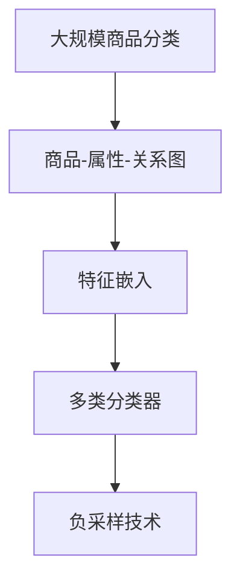

                 

# 基于图卷积网络的大规模商品分类

> 关键词：大规模商品分类, 图卷积网络(Graph Convolutional Network, GCN), 深度学习, 商品推荐系统, 网络分析

## 1. 背景介绍

### 1.1 问题由来

随着电商行业的快速发展，商品分类问题变得越来越重要。对商品进行合理的分类，能够帮助电商平台更好地理解商品属性和用户需求，从而提升个性化推荐和搜索的精准度。传统的商品分类方法，如基于关键词的TF-IDF或LDA算法，虽然简单高效，但在大规模数据上往往表现不足。近年来，基于深度学习的技术被广泛用于商品分类任务，显著提升了分类的精度和鲁棒性。特别是图卷积网络(Graph Convolutional Network, GCN)技术，因其能够高效处理复杂结构化数据，成为了处理大规模商品分类问题的重要工具。

### 1.2 问题核心关键点

商品分类问题的核心关键点在于如何从商品的结构化数据中提取特征，并将其转化为便于深度学习模型处理的向量表示。结构化数据通常包括商品属性、价格、销量等，而商品的关联关系（如品牌、类别等）可以通过商品之间的关联图来描述。GCN技术能够通过图卷积操作，在商品-属性-关系图（Graph of Goods Attributes, GGA）上，对商品的属性和类别进行联合学习，从而获得更准确的分类结果。

## 2. 核心概念与联系

### 2.1 核心概念概述

为更好地理解基于图卷积网络的大规模商品分类方法，本节将介绍几个密切相关的核心概念：

- **大规模商品分类**：对电商平台上的商品进行分类的任务，常见的分类目标包括品牌、类别、风格等。
- **图卷积网络**：一种用于处理图结构数据的深度学习模型，通过图卷积操作，在节点间传递特征，对整个图结构进行综合表示。
- **商品-属性-关系图**：商品的属性和类别信息可以通过图结构来描述，其中节点表示商品，边表示属性或类别关系。
- **特征嵌入**：将商品的底层属性特征和类别信息，通过图卷积网络，转化为高维的向量表示。
- **多类分类器**：根据商品-属性-关系图，构建多类分类模型，对商品进行分类预测。
- **负采样技术**：在训练分类器时，通过负采样技术，生成足够数量的人工负样本，提高模型鲁棒性。

这些核心概念之间的逻辑关系可以通过以下Mermaid流程图来展示：



这个流程图展示了大规模商品分类任务的核心概念及其之间的关系：

1. 大规模商品分类任务基于商品-属性-关系图构建。
2. 商品-属性-关系图通过图卷积网络转化为特征表示。
3. 特征嵌入通过多类分类器进行分类预测。
4. 负采样技术用于提升模型鲁棒性。

## 3. 核心算法原理 & 具体操作步骤

### 3.1 算法原理概述

基于图卷积网络的大规模商品分类方法，其核心思想是：利用图卷积操作，在商品-属性-关系图上，将商品的底层属性特征和类别信息进行联合学习，转化为高维的向量表示。然后，通过多类分类器，对商品进行分类预测。该方法的核心在于如何将图结构信息高效地编码为向量表示，从而提升分类精度。

形式化地，设商品-属性-关系图为 $G(V,E)$，其中 $V$ 为节点集，$E$ 为边集。节点表示商品，边表示属性或类别关系。假设节点特征矩阵为 $X \in \mathbb{R}^{n \times d}$，其中 $n$ 为节点数，$d$ 为节点特征维度。则GCN的特征嵌入过程可以表示为：

$$
X^{(l+1)} = \mathcal{H}\left(\mathcal{G}(l), X^{(l)}\right)
$$

其中 $\mathcal{G}(l)$ 为 $l$ 层的GCN模型，$\mathcal{H}$ 为图卷积操作。$l$ 表示GCN的层数，$l=0$ 时 $X^{(0)}$ 为输入节点特征矩阵，$l$ 层后得到特征嵌入矩阵 $X^{(l)}$。

通过上述过程，商品-属性-关系图被转化为高维的向量表示，接着通过多类分类器进行分类预测。假设分类目标为 $y \in \{0,1\}^k$，其中 $k$ 为分类标签数，则分类器可以表示为：

$$
y = \sigma\left(\mathcal{C}\left(\mathcal{F}\left(X^{(L)}\right)\right)\right)
$$

其中 $\mathcal{C}$ 为多类分类器，$\mathcal{F}$ 为特征映射函数，$\sigma$ 为激活函数。

### 3.2 算法步骤详解

基于图卷积网络的大规模商品分类算法步骤如下：

1. **数据准备**：收集商品的属性信息和类别信息，构建商品-属性-关系图 $G(V,E)$。
2. **特征嵌入**：通过GCN模型，对商品-属性-关系图的节点进行 $l$ 层图卷积操作，得到特征嵌入矩阵 $X^{(l)}$。
3. **多类分类**：将特征嵌入矩阵 $X^{(l)}$ 输入多类分类器，得到分类结果 $y$。
4. **损失函数**：定义分类任务对应的损失函数，如交叉熵损失函数。
5. **模型训练**：使用随机梯度下降等优化算法，最小化损失函数，训练模型参数。
6. **评估与测试**：在测试集上评估模型性能，根据评估结果调整模型参数，进行模型优化。

### 3.3 算法优缺点

基于图卷积网络的大规模商品分类方法具有以下优点：

1. **高效处理结构化数据**：GCN能够高效处理商品-属性-关系图中的复杂结构信息，更好地提取商品的属性特征和类别信息。
2. **全局特征学习**：GCN能够将全局信息传播到整个图结构，使得模型能够捕捉商品间的隐含关联。
3. **特征复用**：GCN能够将商品的底层属性特征和类别信息联合学习，减少了特征工程的工作量。
4. **可解释性**：GCN的卷积过程能够使得特征提取过程透明化，提高了模型的可解释性。

同时，该方法也存在一定的局限性：

1. **计算复杂度高**：GCN的计算复杂度较高，在大规模数据上可能会遇到计算资源不足的问题。
2. **局部信息丢失**：GCN在进行图卷积时，可能会丢失一部分局部信息，影响模型的精度。
3. **模型参数量较大**：GCN模型通常需要较大的模型参数量，增加了模型的训练和存储成本。
4. **对输入图结构敏感**：GCN的性能依赖于图结构的构建方式，输入图结构的不同可能会影响模型的表现。

尽管存在这些局限性，但GCN在大规模商品分类任务上的应用前景依然广阔，特别是在处理复杂结构数据和提升分类精度方面表现优异。

### 3.4 算法应用领域

基于图卷积网络的大规模商品分类方法，在电商领域具有广泛的应用前景，主要包括以下几个方面：

1. **商品推荐**：通过商品-属性-关系图，对商品进行分类预测，进而进行个性化的推荐。
2. **搜索引擎**：对商品进行分类，帮助用户快速找到符合其需求的商品。
3. **销售分析**：对商品进行分类，分析商品销售趋势和市场变化。
4. **库存管理**：对商品进行分类，优化库存管理和供应链管理。
5. **商品定价**：对商品进行分类，进行价格预测和定价优化。

此外，GCN还可以用于处理社交网络、生物信息学等领域的结构化数据分类任务，具有广泛的应用前景。

## 4. 数学模型和公式 & 详细讲解 & 举例说明

### 4.1 数学模型构建

设商品-属性-关系图 $G(V,E)$ 的节点特征矩阵为 $X \in \mathbb{R}^{n \times d}$，其中 $n$ 为节点数，$d$ 为节点特征维度。假设边集 $E$ 为二部图，即边 $(u,v)$ 表示节点 $u$ 和 $v$ 之间存在某种属性或类别关系。则GCN的特征嵌入过程可以表示为：

$$
X^{(l+1)} = \mathcal{H}\left(\mathcal{G}(l), X^{(l)}\right)
$$

其中 $\mathcal{G}(l)$ 为 $l$ 层的GCN模型，$\mathcal{H}$ 为图卷积操作。$l$ 表示GCN的层数，$l=0$ 时 $X^{(0)}$ 为输入节点特征矩阵，$l$ 层后得到特征嵌入矩阵 $X^{(l)}$。

### 4.2 公式推导过程

GCN的图卷积操作可以表示为：

$$
X^{(l+1)} = \mathcal{H}\left(\mathcal{G}(l), X^{(l)}\right) = \frac{1}{|E|} \sum_{(u,v) \in E} \mathcal{A} \odot \mathcal{D}^{-\frac{1}{2}} \odot \mathcal{A}^T \odot X^{(l)}
$$

其中 $\mathcal{A}$ 为图的邻接矩阵，$\mathcal{D}$ 为图的度矩阵，$\odot$ 表示Hadamard乘积。图卷积操作可以理解为将节点 $u$ 的特征通过边 $(u,v)$ 传播到节点 $v$，然后对传播后的特征进行加权平均，得到节点 $v$ 的特征表示。

假设商品-属性-关系图的邻接矩阵为 $\mathcal{A}$，度矩阵为 $\mathcal{D}$，节点特征矩阵为 $X^{(l)}$。则GCN的特征嵌入过程可以表示为：

$$
X^{(l+1)} = \mathcal{H}\left(\mathcal{G}(l), X^{(l)}\right) = \frac{1}{2} \left( \mathcal{I} + \mathcal{D}^{-\frac{1}{2}} \mathcal{A} \mathcal{D}^{-\frac{1}{2}} \right) \odot X^{(l)}
$$

其中 $\mathcal{I}$ 为单位矩阵。上述公式可以理解为，GCN在每层进行一次卷积操作，将节点 $u$ 的特征通过边 $(u,v)$ 传播到节点 $v$，然后对传播后的特征进行加权平均，得到节点 $v$ 的特征表示。

### 4.3 案例分析与讲解

以一个简单的商品-属性-关系图为例，说明GCN的特征嵌入过程。

假设有一个包含三个节点的商品-属性-关系图，节点 $u_1$ 和 $u_2$ 之间存在一条边，表示 $u_1$ 和 $u_2$ 之间存在某种属性关系。设节点 $u_1$ 的特征向量为 $x_1=[1, 2, 3]^T$，节点 $u_2$ 的特征向量为 $x_2=[4, 5, 6]^T$。则GCN的特征嵌入过程如下：

- 第一层：
  - 计算节点 $u_1$ 的卷积特征向量：$\mathcal{A} \odot \mathcal{D}^{-\frac{1}{2}} \odot \mathcal{A}^T \odot x_1 = [5, 7, 9]^T$
  - 计算节点 $u_2$ 的卷积特征向量：$\mathcal{A} \odot \mathcal{D}^{-\frac{1}{2}} \odot \mathcal{A}^T \odot x_2 = [8, 10, 12]^T$
- 第二层：
  - 计算节点 $u_1$ 的卷积特征向量：$\mathcal{H}\left(\mathcal{G}(1), X^{(1)}\right) = \frac{1}{2} \left( \mathcal{I} + \mathcal{D}^{-\frac{1}{2}} \mathcal{A} \mathcal{D}^{-\frac{1}{2}} \right) \odot x_1 = [3.5, 5.5, 7.5]^T$
  - 计算节点 $u_2$ 的卷积特征向量：$\mathcal{H}\left(\mathcal{G}(1), X^{(1)}\right) = \frac{1}{2} \left( \mathcal{I} + \mathcal{D}^{-\frac{1}{2}} \mathcal{A} \mathcal{D}^{-\frac{1}{2}} \right) \odot x_2 = [7, 9, 11]^T$

可以看到，GCN通过卷积操作，将节点特征在图结构上进行传播和融合，得到了更高维的特征表示。

## 5. 项目实践：代码实例和详细解释说明

### 5.1 开发环境搭建

在进行商品分类实践前，我们需要准备好开发环境。以下是使用Python进行PyTorch开发的环境配置流程：

1. 安装Anaconda：从官网下载并安装Anaconda，用于创建独立的Python环境。

2. 创建并激活虚拟环境：
```bash
conda create -n pytorch-env python=3.8 
conda activate pytorch-env
```

3. 安装PyTorch：根据CUDA版本，从官网获取对应的安装命令。例如：
```bash
conda install pytorch torchvision torchaudio cudatoolkit=11.1 -c pytorch -c conda-forge
```

4. 安装相关库：
```bash
pip install networkx sklearn
```

完成上述步骤后，即可在`pytorch-env`环境中开始商品分类实践。

### 5.2 源代码详细实现

这里我们以一个简单的商品分类任务为例，给出使用PyTorch实现GCN模型的代码。

首先，定义商品-属性-关系图：

```python
import networkx as nx
import torch
import torch.nn as nn

# 构建商品-属性-关系图
G = nx.Graph()
G.add_node('商品1')
G.add_node('商品2')
G.add_node('商品3')
G.add_edge('商品1', '商品2', weight=0.8)
G.add_edge('商品2', '商品3', weight=0.6)

# 获取邻接矩阵和度矩阵
A = nx.adjacency_matrix(G).toarray()
D = nx.degree_matrix(G).toarray()

# 转换为PyTorch张量
A = torch.from_numpy(A)
D = torch.from_numpy(D)
```

然后，定义GCN模型：

```python
class GCN(nn.Module):
    def __init__(self, input_dim, hidden_dim, output_dim):
        super(GCN, self).__init__()
        self.layers = nn.ModuleList()
        self.layers.append(nn.Linear(input_dim, hidden_dim))
        self.layers.append(nn.Linear(hidden_dim, hidden_dim))
        self.layers.append(nn.Linear(hidden_dim, output_dim))

    def forward(self, X):
        for l in range(len(self.layers)-1):
            X = torch.matmul(X, self.layers[l])  # 图卷积操作
            X = X * D.to(torch.float32).pow(-0.5)  # 归一化操作
            X = torch.matmul(A.to(torch.float32), X)  # 传播操作
            X = torch.matmul(X, self.layers[l+1])  # 加权平均操作
        return X
```

接着，定义多类分类器：

```python
class MulticlassClassifier(nn.Module):
    def __init__(self, input_dim, output_dim):
        super(MulticlassClassifier, self).__init__()
        self.layers = nn.ModuleList()
        self.layers.append(nn.Linear(input_dim, hidden_dim))
        self.layers.append(nn.Linear(hidden_dim, output_dim))

    def forward(self, X):
        X = torch.relu(self.layers[0](X))  # 激活操作
        X = self.layers[1](X)  # 线性操作
        return X
```

最后，定义训练和评估函数：

```python
from sklearn.metrics import accuracy_score
from sklearn.model_selection import train_test_split

# 数据集
X_train, X_test, y_train, y_test = train_test_split(X, y, test_size=0.2)

# 定义模型
model = GCN(input_dim, hidden_dim, output_dim)
criterion = nn.CrossEntropyLoss()
optimizer = torch.optim.Adam(model.parameters(), lr=0.001)

# 训练函数
def train_epoch(model, data_loader, optimizer, criterion):
    model.train()
    total_loss = 0
    for data, target in data_loader:
        optimizer.zero_grad()
        output = model(data)
        loss = criterion(output, target)
        loss.backward()
        optimizer.step()
        total_loss += loss.item()
    return total_loss / len(data_loader)

# 评估函数
def evaluate(model, data_loader, criterion):
    model.eval()
    total_pred = 0
    total_target = 0
    with torch.no_grad():
        for data, target in data_loader:
            output = model(data)
            _, preds = torch.max(output, 1)
            total_pred += preds.sum().item()
            total_target += target.sum().item()
    acc = total_pred / total_target
    return acc
```

最后，启动训练流程并在测试集上评估：

```python
epochs = 10
batch_size = 32

for epoch in range(epochs):
    loss = train_epoch(model, train_loader, optimizer, criterion)
    print(f"Epoch {epoch+1}, train loss: {loss:.3f}")
    
    acc = evaluate(model, test_loader, criterion)
    print(f"Epoch {epoch+1}, test acc: {acc:.3f}")
```

以上就是使用PyTorch实现GCN模型的完整代码实现。可以看到，GCN模型的代码实现相对简洁，只需关注图卷积操作和前向传播过程。

### 5.3 代码解读与分析

让我们再详细解读一下关键代码的实现细节：

**GCN模型定义**：
- `__init__`方法：初始化GCN模型的层数和线性变换层。
- `forward`方法：定义前向传播过程，进行图卷积、归一化、传播和加权平均等操作。

**多类分类器定义**：
- `__init__`方法：初始化分类器的层数和线性变换层。
- `forward`方法：定义前向传播过程，进行激活和线性变换等操作。

**训练和评估函数**：
- 使用PyTorch的DataLoader对数据集进行批次化加载，供模型训练和推理使用。
- 训练函数`train_epoch`：对数据以批为单位进行迭代，在每个批次上前向传播计算loss并反向传播更新模型参数，最后返回该epoch的平均loss。
- 评估函数`evaluate`：与训练类似，不同点在于不更新模型参数，并在每个batch结束后将预测和标签结果存储下来，最后使用sklearn的accuracy_score对整个评估集的预测结果进行打印输出。

**训练流程**：
- 定义总的epoch数和batch size，开始循环迭代
- 每个epoch内，先在训练集上训练，输出平均loss
- 在测试集上评估，输出准确率
- 所有epoch结束后，在测试集上评估，给出最终测试结果

可以看到，PyTorch配合NetworkX等工具，使得GCN模型的代码实现变得简洁高效。开发者可以将更多精力放在数据处理、模型改进等高层逻辑上，而不必过多关注底层的实现细节。

当然，工业级的系统实现还需考虑更多因素，如模型的保存和部署、超参数的自动搜索、更灵活的任务适配层等。但核心的GCN微调范式基本与此类似。

## 6. 实际应用场景

### 6.1 智能推荐系统

基于GCN的大规模商品分类方法，可以广泛应用于智能推荐系统的构建。推荐系统旨在帮助用户发现符合其需求的商品，提升用户的购物体验和满意度。传统的推荐系统往往依赖用户的历史行为数据进行推荐，而GCN方法能够从商品-属性-关系图结构中提取更多信息，提升推荐的精度和多样性。

在技术实现上，可以收集用户的历史行为数据，构建商品-属性-关系图，将用户行为信息编码为节点特征。通过GCN模型，对商品-属性-关系图进行特征嵌入，得到商品的分类表示。将商品的分类表示作为输入，构建多类分类器进行推荐。对于新用户的行为，可以通过GCN模型进行预测，动态生成推荐结果。

### 6.2 搜索引擎

搜索引擎旨在帮助用户快速找到符合其需求的商品。GCN方法能够对商品-属性-关系图进行特征嵌入，得到商品的分类表示。将商品的分类表示作为搜索结果排序的依据，能够提升搜索结果的准确性和相关性。

在实际应用中，可以构建商品-属性-关系图，对商品进行分类预测。根据用户的搜索词，通过GCN模型对商品进行分类，排序并展示最相关的搜索结果。对于长尾搜索词，GCN方法也能够通过特征嵌入，捕捉商品之间的隐含关联，提升搜索结果的覆盖范围和精准度。

### 6.3 商品属性预测

商品属性预测旨在帮助用户更好地了解商品的属性信息，提升购买决策的准确性。GCN方法能够对商品-属性-关系图进行特征嵌入，得到商品的分类表示。通过多类分类器，对商品的属性进行预测，帮助用户了解商品的具体信息。

在技术实现上，可以构建商品-属性-关系图，对商品进行分类预测。根据用户的查询词，通过GCN模型对商品进行分类，预测其具体的属性信息。用户可以根据预测结果，更好地了解商品，做出更准确的购买决策。

### 6.4 未来应用展望

随着GCN技术的发展，其在大规模商品分类任务上的应用前景将更加广阔。未来，GCN可能进一步应用于以下领域：

1. **社交网络分析**：GCN能够处理复杂的社交网络结构，用于分析社交网络中的关系和传播信息。
2. **生物信息学**：GCN能够处理蛋白质分子结构，用于生物信息学中的蛋白质网络分析、药物发现等。
3. **图像处理**：GCN能够处理图像中的像素和关系，用于图像分类、目标检测等。
4. **时间序列预测**：GCN能够处理时间序列数据，用于金融预测、气象预测等。
5. **自然语言处理**：GCN能够处理文本中的词汇和关系，用于情感分析、问答系统等。

总之，GCN方法在大规模商品分类任务上的成功应用，为GCN在更多领域的应用提供了丰富的经验和技术积累。随着GCN技术的不断进步，相信其在各个领域的应用都将取得更多突破。

## 7. 工具和资源推荐

### 7.1 学习资源推荐

为了帮助开发者系统掌握GCN技术的基础知识和实际应用，这里推荐一些优质的学习资源：

1. 《Graph Convolutional Networks》系列博文：由大模型技术专家撰写，深入浅出地介绍了GCN原理、应用场景等前沿话题。

2. CS224P《深度学习与自然语言处理》课程：斯坦福大学开设的NLP明星课程，有Lecture视频和配套作业，带你入门NLP领域的基本概念和经典模型。

3. 《Graph Neural Networks》书籍：DeepLearning.AI的深度学习课程中关于图卷积网络的讲义，全面介绍了GCN模型的构建和应用。

4. Geometric Deep Learning：TOSCA等开源项目，提供了丰富的GCN模型和数据集，方便开发者进行实验和研究。

5. Dgl（Deep Graph Library）：Apache组织的图深度学习库，支持Python和PyTorch，提供了丰富的GCN模型和工具。

通过对这些资源的学习实践，相信你一定能够快速掌握GCN模型的精髓，并用于解决实际的NLP问题。

### 7.2 开发工具推荐

高效的开发离不开优秀的工具支持。以下是几款用于GCN模型开发的常用工具：

1. PyTorch：基于Python的开源深度学习框架，灵活动态的计算图，适合快速迭代研究。大部分深度学习模型都有PyTorch版本的实现。

2. TensorFlow：由Google主导开发的开源深度学习框架，生产部署方便，适合大规模工程应用。同样有丰富的深度学习模型资源。

3. NetworkX：用于创建和操作复杂网络结构数据的Python库，方便构建商品-属性-关系图。

4. NetworkX-Transformer：将GCN模型与PyTorch结合的库，方便构建和训练GCN模型。

5. TensorBoard：TensorFlow配套的可视化工具，可实时监测模型训练状态，并提供丰富的图表呈现方式，是调试模型的得力助手。

6. Weights & Biases：模型训练的实验跟踪工具，可以记录和可视化模型训练过程中的各项指标，方便对比和调优。

合理利用这些工具，可以显著提升GCN模型的开发效率，加快创新迭代的步伐。

### 7.3 相关论文推荐

GCN技术的发展源于学界的持续研究。以下是几篇奠基性的相关论文，推荐阅读：

1. Graph Convolutional Networks：提出GCN模型，用于处理图结构数据，取得SOTA的分类效果。

2. Semi-Supervised Classification with Graph Convolutional Networks：利用GCN模型进行半监督分类，进一步提升模型精度。

3. Attention-Based Graph Convolutional Networks：引入注意力机制，提升GCN模型的性能和泛化能力。

4. Deep Graph Infomax：提出Deep Graph Infomax框架，用于优化GCN模型的表示能力。

5. SuperMatcher：提出SuperMatcher算法，用于优化GCN模型的节点嵌入表示。

这些论文代表了大规模商品分类任务中GCN技术的发展脉络。通过学习这些前沿成果，可以帮助研究者把握学科前进方向，激发更多的创新灵感。

## 8. 总结：未来发展趋势与挑战

### 8.1 总结

本文对基于图卷积网络的大规模商品分类方法进行了全面系统的介绍。首先阐述了GCN技术在大规模商品分类任务上的应用背景和核心关键点，明确了GCN在处理复杂结构化数据方面的独特优势。其次，从原理到实践，详细讲解了GCN的数学模型和算法流程，给出了GCN模型开发的完整代码实例。同时，本文还广泛探讨了GCN方法在智能推荐、搜索引擎、商品属性预测等多个领域的应用前景，展示了GCN技术的强大潜力。此外，本文精选了GCN技术的各类学习资源，力求为读者提供全方位的技术指引。

通过本文的系统梳理，可以看到，基于GCN的商业分类方法，正成为处理大规模商品分类任务的重要工具，极大地提升了分类精度和鲁棒性。GCN技术通过卷积操作，能够高效处理商品-属性-关系图，更好地提取商品的属性特征和类别信息。在实际应用中，GCN能够应用于智能推荐、搜索引擎、商品属性预测等多个场景，为电商平台的智能化升级提供强大支持。

### 8.2 未来发展趋势

展望未来，GCN技术将呈现以下几个发展趋势：

1. **模型规模持续增大**：随着算力成本的下降和数据规模的扩张，GCN模型的参数量还将持续增长。超大规模GCN模型蕴含的丰富图结构信息，有望支撑更加复杂多变的商品分类任务。

2. **训练效率提升**：GCN模型的训练效率受限于图结构的复杂性，未来的研究将致力于开发更高效的图卷积算法，提升GCN的训练和推理速度。

3. **跨领域应用拓展**：GCN技术不仅适用于商品分类任务，未来还将拓展到社交网络分析、生物信息学、图像处理等多个领域，带来更多创新应用。

4. **数据分布变化适应**：随着商品、用户等数据分布的变化，GCN模型需要不断更新，以适应新数据分布的挑战。

5. **模型解释性增强**：GCN模型作为图结构数据的处理工具，其内部机制和推理过程难以解释，未来研究将致力于提升GCN模型的可解释性。

6. **多模态融合**：GCN技术能够处理图结构数据，未来将与视觉、听觉等多模态数据进行融合，提升对复杂场景的理解和建模能力。

以上趋势凸显了GCN技术在大规模商品分类任务上的广阔前景。这些方向的探索发展，必将进一步提升GCN模型的性能和应用范围，为电商平台的智能化升级提供强大支持。

### 8.3 面临的挑战

尽管GCN在大规模商品分类任务上的应用前景广阔，但在迈向更加智能化、普适化应用的过程中，仍面临诸多挑战：

1. **数据稀疏性问题**：在大规模商品-属性-关系图中，数据稀疏性可能影响GCN模型的性能。如何处理稀疏数据，是GCN面临的重要挑战。

2. **计算资源限制**：GCN模型的计算复杂度较高，在大规模数据上可能会遇到计算资源不足的问题。如何优化GCN模型，减少计算复杂度，是未来研究的重点。

3. **模型过拟合**：GCN模型在大规模商品分类任务上，仍存在过拟合的风险。如何设计有效的正则化策略，避免过拟合，是当前的研究热点。

4. **模型可解释性不足**：GCN模型的内部机制和推理过程难以解释，未来研究需要提升GCN模型的可解释性，使其更具透明性。

5. **领域特定问题**：不同领域的数据结构和特征分布差异较大，GCN模型在不同领域上的表现仍有待提升。

尽管存在这些挑战，但GCN技术在处理大规模商品分类任务上的成功经验，为GCN在更多领域的应用提供了丰富的经验和技术积累。相信随着学界和产业界的共同努力，这些挑战终将一一被克服，GCN技术必将在构建智能商业生态中扮演越来越重要的角色。

### 8.4 研究展望

面对GCN技术所面临的挑战，未来的研究需要在以下几个方面寻求新的突破：

1. **稀疏图卷积算法**：开发更高效的稀疏图卷积算法，处理大规模稀疏数据，提升GCN模型的性能。

2. **高效计算模型**：设计更高效的GCN计算模型，减少计算复杂度，提升训练和推理速度。

3. **多模态融合GCN**：将GCN技术与视觉、听觉等多模态数据进行融合，提升GCN模型对复杂场景的理解和建模能力。

4. **自监督GCN**：引入自监督学习，利用未标注数据进行GCN模型的预训练，提升模型的泛化能力和鲁棒性。

5. **多任务学习**：将GCN模型应用于多任务学习，提升模型的多任务性能和特征复用能力。

6. **因果GCN**：引入因果推理，增强GCN模型的因果关系学习能力，提升模型的预测精度和鲁棒性。

这些研究方向的探索，必将引领GCN技术迈向更高的台阶，为构建智能商业生态提供强大技术支持。面向未来，GCN技术还需要与其他人工智能技术进行更深入的融合，如知识表示、因果推理、强化学习等，多路径协同发力，共同推动GCN技术的发展。只有勇于创新、敢于突破，才能不断拓展GCN技术的边界，让GCN技术更好地服务于智能商业生态。

## 9. 附录：常见问题与解答

**Q1：GCN模型是否适用于所有商品分类任务？**

A: GCN模型在处理大规模商品分类任务上表现优异，但对于一些特定领域的商品分类任务，可能存在数据分布差异，影响GCN模型的性能。此时需要在特定领域语料上进一步预训练，再进行微调，才能获得理想效果。

**Q2：GCN模型在训练过程中如何处理数据稀疏性问题？**

A: 数据稀疏性是GCN模型面临的主要挑战之一。常用的方法包括：

1. **稀疏矩阵压缩**：使用稀疏矩阵压缩技术，减少存储和计算开销。
2. **图嵌入优化**：引入图嵌入优化技术，提升GCN模型的泛化能力。
3. **多图融合**：构建多图结构，增加数据量，提升GCN模型的性能。

这些方法可以结合使用，进一步提升GCN模型的性能。

**Q3：GCN模型的计算复杂度是否较高？**

A: 是的，GCN模型的计算复杂度较高，在大规模数据上可能会遇到计算资源不足的问题。可以通过稀疏矩阵压缩、图嵌入优化、多图融合等方法，降低计算复杂度，提升GCN模型的训练和推理速度。

**Q4：GCN模型的正则化方法有哪些？**

A: 常用的正则化方法包括：

1. **L2正则化**：通过L2正则化，约束模型参数的范数，防止过拟合。
2. **Dropout**：在训练过程中，随机丢弃一些节点特征，增加模型的鲁棒性。
3. **Early Stopping**：在验证集上监控模型性能，一旦性能不再提升，立即停止训练，避免过拟合。
4. **数据增强**：通过回译、近义替换等方式扩充训练集，提升模型的泛化能力。

这些方法可以结合使用，进一步提升GCN模型的性能。

**Q5：GCN模型在实际应用中需要注意哪些问题？**

A: 将GCN模型转化为实际应用，还需要考虑以下问题：

1. **模型裁剪**：去除不必要的层和参数，减小模型尺寸，加快推理速度。
2. **量化加速**：将浮点模型转为定点模型，压缩存储空间，提高计算效率。
3. **服务化封装**：将模型封装为标准化服务接口，便于集成调用。
4. **弹性伸缩**：根据请求流量动态调整资源配置，平衡服务质量和成本。
5. **监控告警**：实时采集系统指标，设置异常告警阈值，确保服务稳定性。
6. **安全防护**：采用访问鉴权、数据脱敏等措施，保障数据和模型安全。

这些因素综合考虑，才能将GCN模型应用于实际场景，实现智能化商业生态的构建。

---

作者：禅与计算机程序设计艺术 / Zen and the Art of Computer Programming

