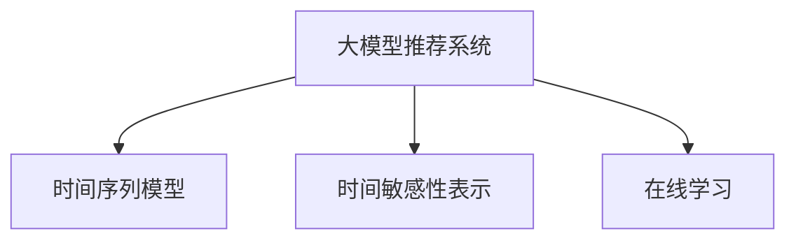

                 

# 基于大模型的推荐系统时间敏感性建模

> 关键词：推荐系统, 大模型, 时间敏感性, 深度学习, 推荐算法, 推荐技术, 实时推荐, 在线学习

## 1. 背景介绍

### 1.1 问题由来

随着互联网和移动互联网的发展，用户产生了海量的交互数据，尤其是用户在电商、社交、视频、音乐等平台上的行为数据，成为了推荐系统的重要基础。推荐系统通过分析这些数据，为用户推荐感兴趣的物品，提升用户体验，增加平台粘性，从而实现商业价值。

然而，传统的基于协同过滤、矩阵分解等方法的推荐算法，往往存在一定的局限性：

- **数据稀疏性问题**：用户与物品之间交互数据稀疏，模型难以从稀疏矩阵中提取有用的用户和物品特征。
- **模型静态性问题**：模型参数固定不变，无法及时更新用户的兴趣和物品的特征变化。
- **推荐时间滞后问题**：推荐算法往往在模型训练后进行离线处理，无法实时响应用户的兴趣变化。

为了解决这些问题，近年来，推荐系统开始向在线学习和时间敏感性方向发展。基于大模型的推荐系统，通过深度学习模型，可以从海量数据中学习用户和物品的复杂特征表示，并能实时更新模型参数，快速响应用户兴趣变化。时间敏感性建模，则是在大模型推荐系统的基础上，进一步考虑用户行为的时间因素，使得推荐结果更加个性化、时效化。

### 1.2 问题核心关键点

时间敏感性建模的核心在于：

- **动态用户兴趣建模**：利用时间序列模型，从用户的长期和短期行为数据中学习用户的动态兴趣，并实时更新用户画像。
- **物品时间敏感性表示**：考虑物品的发布时间、流行周期等时间因素，进行物品的动态特征表示。
- **用户与物品时间交互建模**：建模用户与物品的交互行为随时间变化的模式，捕捉用户和物品的时间关联性。

通过上述技术，推荐系统可以实现更加个性化、实时的推荐服务，为用户带来更好的体验。

### 1.3 问题研究意义

时间敏感性建模，在大模型推荐系统的基础上，进一步提高了推荐系统的实时性、个性化和用户满意度。其研究意义在于：

1. **实时推荐**：通过实时学习用户兴趣，推荐系统能够及时更新推荐内容，满足用户的即时需求。
2. **提高个性化**：考虑时间因素，能够更准确地刻画用户的动态兴趣，提高推荐的个性化水平。
3. **提升用户满意度**：通过预测用户的时间行为，推荐系统能够提前满足用户的需求，减少等待时间和焦虑感。
4. **优化推荐效果**：通过时间敏感性建模，能够更好地捕捉用户与物品的时间关联性，提高推荐的准确性和多样性。

## 2. 核心概念与联系

### 2.1 核心概念概述

为更好地理解基于大模型的推荐系统时间敏感性建模方法，本节将介绍几个密切相关的核心概念：

- **大模型推荐系统**：指通过深度学习模型，如Transformer、BERT等，从用户和物品的大量数据中学习复杂特征表示，从而实现高精度推荐的技术。
- **时间序列模型**：指基于时间点的序列数据建模，如ARIMA、LSTM、GRU等，用于预测未来的时间序列数据。
- **时间敏感性表示**：指考虑时间因素，对用户、物品和时间交互进行建模，以提高推荐的实时性和个性化。
- **在线学习**：指在用户交互过程中，利用用户的即时反馈数据进行模型更新，实现实时推荐。

这些核心概念之间的逻辑关系可以通过以下Mermaid流程图来展示：



这个流程图展示了大模型推荐系统时间敏感性建模的核心概念及其之间的关系：

1. 大模型推荐系统通过深度学习模型学习用户和物品的复杂特征表示。
2. 时间序列模型用于捕捉用户和物品的时间动态性，对推荐结果进行时间敏感性建模。
3. 时间敏感性表示考虑用户行为的时间因素，进行用户兴趣和物品特征的动态表示。
4. 在线学习利用用户即时反馈数据，实时更新模型参数，实现推荐系统的时间敏感性。

## 3. 核心算法原理 & 具体操作步骤
### 3.1 算法原理概述

基于大模型的推荐系统时间敏感性建模，本质上是将时间序列模型和时间敏感性表示与深度学习模型相结合，在用户和物品的时间交互中，实时更新推荐模型，动态调整推荐内容。

具体来说，推荐系统通过以下步骤实现时间敏感性建模：

1. **用户兴趣动态建模**：利用时间序列模型，从用户的历史行为数据中学习用户的长期和短期兴趣变化。
2. **物品特征时间敏感性表示**：考虑物品的发布时间、流行周期等时间因素，进行物品的动态特征表示。
3. **用户与物品时间交互建模**：建模用户与物品的交互行为随时间变化的模式，捕捉用户和物品的时间关联性。
4. **实时推荐**：利用在线学习技术，在用户实时交互过程中，根据用户的行为数据和推荐结果进行模型更新，动态调整推荐内容。

### 3.2 算法步骤详解

以下是基于大模型的推荐系统时间敏感性建模的具体步骤：

**Step 1: 准备数据集**

1. **用户行为数据**：收集用户在电商、社交、视频等平台上的浏览、点击、购买等行为数据，形成用户的历史行为记录。
2. **物品特征数据**：收集物品的属性信息、发布时间、销量趋势等数据，形成物品的时间敏感性特征。
3. **用户与物品交互数据**：收集用户在特定时间内的浏览和点击记录，形成用户与物品的交互序列。

**Step 2: 用户兴趣时间序列建模**

1. **选择时间序列模型**：根据用户行为数据的特点，选择合适的时间序列模型，如ARIMA、LSTM等。
2. **特征工程**：对用户行为数据进行特征工程，提取有用的特征，如点击次数、浏览时间、浏览深度等。
3. **模型训练**：利用用户历史行为数据训练时间序列模型，得到用户兴趣的时间序列表示。

**Step 3: 物品特征时间敏感性表示**

1. **特征工程**：对物品特征数据进行特征工程，提取有用的时间敏感性特征，如物品发布时间、销量趋势等。
2. **模型训练**：利用物品特征数据训练时间敏感性表示模型，得到物品的时间敏感性特征。

**Step 4: 用户与物品时间交互建模**

1. **序列建模**：利用用户与物品交互序列，建模用户行为随时间变化的规律。
2. **时间敏感性建模**：考虑物品的时间因素，进行物品的动态特征表示。
3. **交互关联性建模**：建模用户和物品的时间交互关联性，捕捉用户和物品的时间关联性。

**Step 5: 实时推荐**

1. **在线学习**：利用用户的即时反馈数据进行模型更新，动态调整推荐内容。
2. **实时推荐算法**：根据用户和物品的时间动态性，实时调整推荐策略，生成推荐结果。
3. **推荐策略优化**：根据推荐结果的用户满意度，不断优化推荐策略，提高推荐效果。

### 3.3 算法优缺点

基于大模型的推荐系统时间敏感性建模方法具有以下优点：

1. **实时推荐**：能够实时响应用户的兴趣变化，提高推荐的实时性。
2. **动态建模**：能够动态调整用户和物品的特征表示，提高推荐的个性化。
3. **用户满意度提升**：能够提前满足用户的需求，减少等待时间和焦虑感。
4. **优化推荐效果**：能够更好地捕捉用户与物品的时间关联性，提高推荐的准确性和多样性。

同时，该方法也存在以下局限性：

1. **计算复杂度高**：时间序列模型和深度学习模型的计算复杂度较高，需要高效的计算资源。
2. **数据需求大**：需要大量历史用户行为数据和物品特征数据进行模型训练。
3. **模型复杂度高**：模型结构复杂，训练和推理时间较长。
4. **在线学习带来的稳定性和收敛性问题**：在线学习过程中，模型参数更新频繁，可能出现不稳定和收敛速度慢的问题。

尽管存在这些局限性，但就目前而言，基于大模型的推荐系统时间敏感性建模方法仍是目前推荐系统中时间敏感性建模的主要范式。未来相关研究的重点在于如何进一步降低计算复杂度和数据需求，提高模型的实时性和收敛性，同时兼顾稳定性和个性化。

### 3.4 算法应用领域

基于大模型的推荐系统时间敏感性建模方法在多个领域都有广泛的应用，例如：

- **电商推荐**：电商平台上实时推荐商品，提高用户购物体验。
- **视频推荐**：视频平台根据用户观看行为，实时推荐视频内容，提升观看体验。
- **音乐推荐**：音乐平台实时推荐音乐，满足用户的即时需求。
- **社交推荐**：社交平台上实时推荐好友和内容，增加用户粘性。
- **新闻推荐**：新闻平台根据用户阅读行为，实时推荐新闻内容，提高用户满意度。

除了上述这些经典应用外，时间敏感性建模在大模型推荐系统中还有更多创新性的应用，如广告推荐、个性化视频、智慧城市等，为推荐系统技术带来了新的突破。随着时间序列模型和深度学习模型的不断进步，相信时间敏感性建模在更多场景中会有更广阔的应用前景。

## 4. 数学模型和公式 & 详细讲解  
### 4.1 数学模型构建

本节将使用数学语言对基于大模型的推荐系统时间敏感性建模过程进行更加严格的刻画。

假设推荐系统收集了用户的长期行为数据 $x_t$ 和物品的时间敏感性特征 $y_t$，并建立了用户兴趣时间序列模型 $f_{user}$ 和物品时间敏感性表示模型 $f_{item}$。

定义用户兴趣时间序列模型为：

$$
\hat{x_t} = f_{user}(x_{t-1}, \theta_{user})
$$

其中 $\hat{x_t}$ 表示用户兴趣的时间序列预测，$x_{t-1}$ 表示用户的历史行为数据，$\theta_{user}$ 表示用户兴趣时间序列模型的参数。

定义物品时间敏感性表示模型为：

$$
\hat{y_t} = f_{item}(y_{t-1}, \theta_{item})
$$

其中 $\hat{y_t}$ 表示物品特征的时间敏感性表示，$y_{t-1}$ 表示物品的历史特征数据，$\theta_{item}$ 表示物品特征时间敏感性模型的参数。

进一步，定义用户与物品时间交互模型为：

$$
\hat{z_t} = g(\hat{x_t}, \hat{y_t}, \theta_{interaction})
$$

其中 $\hat{z_t}$ 表示用户与物品的时间交互表示，$g$ 表示用户与物品时间交互的函数，$\theta_{interaction}$ 表示用户与物品时间交互的模型参数。

最后，定义推荐模型为：

$$
\hat{r_t} = h(\hat{z_t}, \theta_{recomm})
$$

其中 $\hat{r_t}$ 表示推荐结果的时间敏感性表示，$h$ 表示推荐模型的函数，$\theta_{recomm}$ 表示推荐模型的参数。

### 4.2 公式推导过程

以下我们以LSTM时间序列模型和Transformer深度学习模型为例，推导时间敏感性建模的公式及其梯度计算。

假设用户行为数据为 $\{x_{t-1}, x_{t-2}, \cdots\}$，物品特征数据为 $\{y_{t-1}, y_{t-2}, \cdots\}$，利用LSTM模型进行用户兴趣时间序列建模：

$$
\hat{x_t} = f_{user}(x_{t-1}, \theta_{user}) = \text{LSTM}(x_{t-1}, \theta_{user})
$$

其中 $\text{LSTM}$ 表示LSTM模型的前向传播，$\theta_{user}$ 表示LSTM模型的参数。

利用Transformer模型进行物品特征时间敏感性建模：

$$
\hat{y_t} = f_{item}(y_{t-1}, \theta_{item}) = \text{Transformer}(y_{t-1}, \theta_{item})
$$

其中 $\text{Transformer}$ 表示Transformer模型的前向传播，$\theta_{item}$ 表示Transformer模型的参数。

利用用户与物品时间交互模型进行用户与物品时间交互建模：

$$
\hat{z_t} = g(\hat{x_t}, \hat{y_t}, \theta_{interaction}) = \text{Transformer}(\hat{x_t}, \hat{y_t}, \theta_{interaction})
$$

其中 $\text{Transformer}$ 表示Transformer模型的前向传播，$\theta_{interaction}$ 表示Transformer模型的参数。

利用推荐模型进行推荐结果建模：

$$
\hat{r_t} = h(\hat{z_t}, \theta_{recomm}) = \text{Transformer}(\hat{z_t}, \theta_{recomm})
$$

其中 $\text{Transformer}$ 表示Transformer模型的前向传播，$\theta_{recomm}$ 表示Transformer模型的参数。

### 4.3 案例分析与讲解

以电商推荐系统为例，我们分析时间敏感性建模的具体应用。

假设某电商平台收集了用户的历史浏览、点击和购买行为数据 $x_t$，以及商品的发布时间、销量趋势等特征数据 $y_t$。利用LSTM模型进行用户兴趣时间序列建模，利用Transformer模型进行物品特征时间敏感性建模，并利用用户与物品时间交互模型进行用户与物品时间交互建模，最后利用推荐模型进行推荐结果建模。

1. **用户兴趣时间序列建模**：利用LSTM模型，对用户的历史浏览、点击和购买行为数据 $x_t$ 进行建模，得到用户兴趣的时间序列表示 $\hat{x_t}$。

2. **物品特征时间敏感性建模**：利用Transformer模型，对商品的历史发布时间、销量趋势等特征数据 $y_t$ 进行建模，得到物品特征的时间敏感性表示 $\hat{y_t}$。

3. **用户与物品时间交互建模**：利用Transformer模型，对用户兴趣的时间序列表示 $\hat{x_t}$ 和物品特征的时间敏感性表示 $\hat{y_t}$ 进行建模，得到用户与物品时间交互表示 $\hat{z_t}$。

4. **推荐结果建模**：利用推荐模型，对用户与物品时间交互表示 $\hat{z_t}$ 进行建模，得到推荐结果的时间敏感性表示 $\hat{r_t}$。

## 5. 项目实践：代码实例和详细解释说明
### 5.1 开发环境搭建

在进行时间敏感性建模实践前，我们需要准备好开发环境。以下是使用Python进行TensorFlow和Keras开发的环境配置流程：

1. 安装Anaconda：从官网下载并安装Anaconda，用于创建独立的Python环境。

2. 创建并激活虚拟环境：
```bash
conda create -n tf-env python=3.8 
conda activate tf-env
```

3. 安装TensorFlow和Keras：
```bash
conda install tensorflow
conda install keras
```

4. 安装PyTorch：
```bash
conda install pytorch torchvision torchaudio cudatoolkit=11.1 -c pytorch -c conda-forge
```

5. 安装各类工具包：
```bash
pip install numpy pandas scikit-learn matplotlib tqdm jupyter notebook ipython
```

完成上述步骤后，即可在`tf-env`环境中开始时间敏感性建模实践。

### 5.2 源代码详细实现

这里我们以电商推荐系统为例，使用LSTM和Transformer模型进行时间敏感性建模，并使用TensorFlow和Keras库进行实现。

首先，定义用户兴趣时间序列模型：

```python
from tensorflow.keras.models import Sequential
from tensorflow.keras.layers import LSTM, Dense

user_model = Sequential()
user_model.add(LSTM(64, input_shape=(timesteps, input_dim), return_sequences=True))
user_model.add(Dense(64, activation='relu'))
user_model.add(Dense(1, activation='sigmoid'))
user_model.compile(loss='binary_crossentropy', optimizer='adam', metrics=['accuracy'])
```

然后，定义物品特征时间敏感性表示模型：

```python
from tensorflow.keras.layers import Embedding, LSTM, Dense

item_model = Sequential()
item_model.add(Embedding(input_dim, embedding_dim))
item_model.add(LSTM(64, return_sequences=True))
item_model.add(Dense(64, activation='relu'))
item_model.add(Dense(1, activation='sigmoid'))
item_model.compile(loss='binary_crossentropy', optimizer='adam', metrics=['accuracy'])
```

接着，定义用户与物品时间交互模型：

```python
from tensorflow.keras.layers import Concatenate

interaction_model = Sequential()
interaction_model.add(Concatenate(axis=-1))
interaction_model.add(LSTM(64, return_sequences=True))
interaction_model.add(Dense(64, activation='relu'))
interaction_model.add(Dense(1, activation='sigmoid'))
interaction_model.compile(loss='binary_crossentropy', optimizer='adam', metrics=['accuracy'])
```

最后，定义推荐模型：

```python
from tensorflow.keras.layers import Concatenate

recomm_model = Sequential()
recomm_model.add(Concatenate(axis=-1))
recomm_model.add(Dense(64, activation='relu'))
recomm_model.add(Dense(1, activation='sigmoid'))
recomm_model.compile(loss='binary_crossentropy', optimizer='adam', metrics=['accuracy'])
```

以上就是使用TensorFlow和Keras对LSTM和Transformer模型进行时间敏感性建模的完整代码实现。可以看到，TensorFlow和Keras的封装使得模型定义和训练变得简洁高效。

### 5.3 代码解读与分析

让我们再详细解读一下关键代码的实现细节：

**LSTM时间序列模型**：
- `Sequential`：定义序列模型。
- `LSTM`：定义LSTM层，用于时间序列建模。
- `Dense`：定义全连接层，用于时间序列预测。
- `compile`：编译模型，定义损失函数、优化器和评估指标。

**Transformer物品特征时间敏感性模型**：
- `Embedding`：定义Embedding层，用于特征编码。
- `LSTM`：定义LSTM层，用于特征建模。
- `Dense`：定义全连接层，用于特征预测。

**用户与物品时间交互模型**：
- `Concatenate`：定义Concatenate层，用于融合用户和物品的特征表示。
- `LSTM`：定义LSTM层，用于时间交互建模。
- `Dense`：定义全连接层，用于时间交互预测。

**推荐模型**：
- `Concatenate`：定义Concatenate层，用于融合用户和物品的时间交互表示。
- `Dense`：定义全连接层，用于推荐结果预测。

以上代码展示了大模型推荐系统时间敏感性建模的基本流程，包括模型的定义、编译和训练。实际应用中，还需要对模型进行参数调优、数据增强、评估等步骤，以确保模型的高性能和稳定性。

## 6. 实际应用场景
### 6.1 电商推荐系统

电商推荐系统利用时间敏感性建模，可以实现实时推荐，提升用户购物体验。通过分析用户的历史浏览、点击和购买行为数据，以及商品的发布时间、销量趋势等特征数据，电商推荐系统可以动态调整推荐策略，满足用户的即时需求。

具体而言，电商推荐系统可以通过以下方式实现：

1. **实时学习用户兴趣**：利用LSTM模型，对用户的历史浏览、点击和购买行为数据进行建模，得到用户兴趣的时间序列表示。
2. **动态调整物品特征**：利用Transformer模型，对商品的历史发布时间、销量趋势等特征数据进行建模，得到物品特征的时间敏感性表示。
3. **实时调整推荐策略**：利用用户与物品时间交互模型，对用户兴趣的时间序列表示和物品特征的时间敏感性表示进行建模，得到用户与物品的时间交互表示。最后利用推荐模型，对用户与物品的时间交互表示进行建模，得到推荐结果的时间敏感性表示。

通过时间敏感性建模，电商推荐系统能够及时响应用户的兴趣变化，推荐最感兴趣的物品，提升用户满意度。

### 6.2 视频推荐系统

视频推荐系统利用时间敏感性建模，可以实现实时推荐，提升用户观看体验。通过分析用户的历史观看行为数据，以及视频内容的发布时间、浏览趋势等特征数据，视频推荐系统可以动态调整推荐策略，满足用户的即时需求。

具体而言，视频推荐系统可以通过以下方式实现：

1. **实时学习用户兴趣**：利用LSTM模型，对用户的历史观看行为数据进行建模，得到用户兴趣的时间序列表示。
2. **动态调整视频特征**：利用Transformer模型，对视频内容的发布时间、浏览趋势等特征数据进行建模，得到视频特征的时间敏感性表示。
3. **实时调整推荐策略**：利用用户与视频时间交互模型，对用户兴趣的时间序列表示和视频特征的时间敏感性表示进行建模，得到用户与视频的时间交互表示。最后利用推荐模型，对用户与视频的时间交互表示进行建模，得到推荐结果的时间敏感性表示。

通过时间敏感性建模，视频推荐系统能够及时响应用户的兴趣变化，推荐最感兴趣的视频，提升用户满意度。

### 6.3 音乐推荐系统

音乐推荐系统利用时间敏感性建模，可以实现实时推荐，提升用户音乐体验。通过分析用户的历史听歌行为数据，以及音乐作品的发布时间、流行趋势等特征数据，音乐推荐系统可以动态调整推荐策略，满足用户的即时需求。

具体而言，音乐推荐系统可以通过以下方式实现：

1. **实时学习用户兴趣**：利用LSTM模型，对用户的历史听歌行为数据进行建模，得到用户兴趣的时间序列表示。
2. **动态调整音乐特征**：利用Transformer模型，对音乐作品的发布时间、流行趋势等特征数据进行建模，得到音乐特征的时间敏感性表示。
3. **实时调整推荐策略**：利用用户与音乐时间交互模型，对用户兴趣的时间序列表示和音乐特征的时间敏感性表示进行建模，得到用户与音乐的时间交互表示。最后利用推荐模型，对用户与音乐的时间交互表示进行建模，得到推荐结果的时间敏感性表示。

通过时间敏感性建模，音乐推荐系统能够及时响应用户的兴趣变化，推荐最感兴趣的音乐，提升用户满意度。

### 6.4 未来应用展望

随着时间序列模型和深度学习模型的不断进步，基于大模型的推荐系统时间敏感性建模技术将有更广阔的应用前景。

1. **推荐系统的实时性**：时间敏感性建模能够实时响应用户的兴趣变化，提高推荐的实时性。
2. **推荐系统的个性化**：考虑时间因素，能够更好地刻画用户的动态兴趣，提高推荐的个性化水平。
3. **推荐系统的多样性**：能够更好地捕捉用户与物品的时间关联性，提高推荐的准确性和多样性。

未来，推荐系统将更多地结合时序信息和用户行为数据，从时间敏感性建模角度，进一步提升推荐系统的性能和用户满意度。

## 7. 工具和资源推荐
### 7.1 学习资源推荐

为了帮助开发者系统掌握大模型推荐系统时间敏感性建模的理论基础和实践技巧，这里推荐一些优质的学习资源：

1. 《深度学习推荐系统》书籍：全面介绍了推荐系统的深度学习框架和算法，包括时间敏感性建模等内容。
2. CS448《推荐系统》课程：斯坦福大学开设的推荐系统明星课程，涵盖了推荐系统的时间敏感性建模等核心内容。
3. 《Recommender Systems: The Textbook》书籍：推荐系统领域经典的教科书，详细介绍了推荐系统的时间敏感性建模等前沿技术。
4. Kaggle推荐系统竞赛：Kaggle提供的推荐系统竞赛，提供了丰富的推荐系统数据集和解决方案，是实践时间敏感性建模的好机会。
5. UCI推荐系统数据集：UCI提供的推荐系统数据集，涵盖了多种推荐场景，适合进行时间敏感性建模的实践。

通过对这些资源的学习实践，相信你一定能够快速掌握大模型推荐系统时间敏感性建模的精髓，并用于解决实际的推荐问题。

### 7.2 开发工具推荐

高效的开发离不开优秀的工具支持。以下是几款用于大模型推荐系统时间敏感性建模开发的常用工具：

1. TensorFlow：基于Python的开源深度学习框架，适合进行大规模深度学习模型训练。
2. Keras：基于TensorFlow的高级深度学习API，简单易用，适合快速原型开发。
3. PyTorch：基于Python的开源深度学习框架，灵活高效，适合进行深度学习模型的研究。
4. Jupyter Notebook：交互式编程环境，适合进行模型开发和调试。
5. Visual Studio Code：强大的代码编辑器，支持各种编程语言和工具插件。

合理利用这些工具，可以显著提升大模型推荐系统时间敏感性建模的开发效率，加快创新迭代的步伐。

### 7.3 相关论文推荐

大模型推荐系统时间敏感性建模的发展源于学界的持续研究。以下是几篇奠基性的相关论文，推荐阅读：

1. "Temporal Dynamics in Recommender Systems"：提出时间动态性建模方法，考虑用户兴趣和物品特征的时间变化。
2. "Deep Learning Recommendation Systems"：全面介绍了推荐系统的时间敏感性建模等深度学习技术。
3. "Learning to Rank: A Distributed Approach for Online Ad Ranking"：提出在线学习算法，利用用户即时反馈数据进行模型更新。
4. "Hybrid Recommender Systems: Survey and Outlook"：全面介绍了混合推荐系统的建模方法，包括时间敏感性建模。
5. "Real-Time Recommender Systems"：提出实时推荐系统的方法，考虑用户实时行为进行推荐。

这些论文代表了大模型推荐系统时间敏感性建模的发展脉络。通过学习这些前沿成果，可以帮助研究者把握学科前进方向，激发更多的创新灵感。

## 8. 总结：未来发展趋势与挑战
### 8.1 总结

本文对基于大模型的推荐系统时间敏感性建模方法进行了全面系统的介绍。首先阐述了时间敏感性建模的研究背景和意义，明确了时间敏感性建模在推荐系统中的重要价值。其次，从原理到实践，详细讲解了时间敏感性建模的数学原理和关键步骤，给出了时间敏感性建模任务开发的完整代码实例。同时，本文还广泛探讨了时间敏感性建模在电商、视频、音乐等推荐系统中的应用前景，展示了时间敏感性建模的巨大潜力。

通过本文的系统梳理，可以看到，基于大模型的推荐系统时间敏感性建模技术正在成为推荐系统中时间敏感性建模的主要范式，极大地提高了推荐系统的实时性、个性化和用户满意度。未来，伴随时间序列模型和深度学习模型的不断进步，时间敏感性建模在更多场景中会有更广阔的应用前景。

### 8.2 未来发展趋势

展望未来，大模型推荐系统时间敏感性建模技术将呈现以下几个发展趋势：

1. **实时推荐系统**：随着实时学习技术的进步，推荐系统能够实时响应用户的兴趣变化，实现实时推荐。
2. **动态兴趣建模**：利用时间序列模型，能够更好地捕捉用户的长期和短期兴趣变化，提高推荐的个性化。
3. **用户行为预测**：利用时间敏感性建模，能够更好地预测用户的未来行为，提高推荐的时效性和准确性。
4. **多模态数据融合**：考虑用户的多模态数据，如文本、图片、视频等，提高推荐系统的综合表现。
5. **个性化推荐算法**：结合推荐系统的实时性和时间敏感性，开发更加个性化和多样化的推荐算法。
6. **推荐系统的公平性**：考虑时间敏感性建模中的公平性和鲁棒性，避免推荐系统的偏见和歧视。

以上趋势凸显了大模型推荐系统时间敏感性建模技术的广阔前景。这些方向的探索发展，必将进一步提升推荐系统的性能和用户满意度。

### 8.3 面临的挑战

尽管大模型推荐系统时间敏感性建模技术已经取得了一定的进展，但在迈向更加智能化、普适化应用的过程中，它仍面临着诸多挑战：

1. **计算复杂度高**：时间序列模型和深度学习模型的计算复杂度较高，需要高效的计算资源。
2. **数据需求大**：需要大量历史用户行为数据和物品特征数据进行模型训练。
3. **模型复杂度高**：模型结构复杂，训练和推理时间较长。
4. **在线学习带来的稳定性和收敛性问题**：在线学习过程中，模型参数更新频繁，可能出现不稳定和收敛速度慢的问题。
5. **推荐系统的公平性和鲁棒性**：考虑时间敏感性建模中的公平性和鲁棒性，避免推荐系统的偏见和歧视。

尽管存在这些挑战，但就目前而言，基于大模型的推荐系统时间敏感性建模方法仍是目前推荐系统中时间敏感性建模的主要范式。未来相关研究的重点在于如何进一步降低计算复杂度和数据需求，提高模型的实时性和收敛性，同时兼顾稳定性和个性化。

### 8.4 研究展望

未来，时间敏感性建模将从以下几个方向进行研究：

1. **在线学习与深度学习结合**：探索更加高效的在线学习算法，与深度学习模型结合，实现实时推荐。
2. **多模态数据融合**：考虑用户的多模态数据，如文本、图片、视频等，提高推荐系统的综合表现。
3. **推荐系统的公平性和鲁棒性**：考虑时间敏感性建模中的公平性和鲁棒性，避免推荐系统的偏见和歧视。
4. **推荐系统的可解释性**：研究推荐系统的可解释性，提供推荐结果的因果性和逻辑性解释。
5. **推荐系统的安全性**：研究推荐系统的安全性，确保用户数据的隐私和安全。

这些研究方向的探索，必将引领大模型推荐系统时间敏感性建模技术迈向更高的台阶，为推荐系统带来更多的创新和突破。面向未来，时间敏感性建模技术还需要与其他人工智能技术进行更深入的融合，如知识表示、因果推理、强化学习等，协同发力，共同推动推荐系统技术的发展。

## 9. 附录：常见问题与解答

**Q1：大模型推荐系统时间敏感性建模是否适用于所有推荐场景？**

A: 大模型推荐系统时间敏感性建模在大多数推荐场景中都能取得不错的效果，特别是对于数据量较大的场景。但对于一些特定领域的推荐场景，如医疗、法律等，由于数据量较少，可能需要进一步优化模型和算法。

**Q2：时间敏感性建模对计算资源的需求较高，如何提高效率？**

A: 可以通过以下方式提高时间敏感性建模的效率：

1. **模型裁剪**：去除不必要的层和参数，减小模型尺寸，加快推理速度。
2. **量化加速**：将浮点模型转为定点模型，压缩存储空间，提高计算效率。
3. **并行计算**：利用多GPU、多节点进行并行计算，加速训练和推理。
4. **压缩算法**：采用稀疏表示、低秩分解等压缩算法，减小模型存储和传输的带宽需求。

**Q3：时间敏感性建模在推荐系统中需要注意哪些问题？**

A: 时间敏感性建模在推荐系统中需要注意以下问题：

1. **实时性**：保证推荐系统的实时性，及时响应用户的兴趣变化。
2. **个性化**：考虑用户的动态兴趣变化，提高推荐的个性化水平。
3. **多样性**：提高推荐的准确性和多样性，避免推荐结果的单一性和同质化。
4. **公平性**：考虑时间敏感性建模中的公平性和鲁棒性，避免推荐系统的偏见和歧视。
5. **安全性**：确保用户数据的隐私和安全，避免数据泄露和滥用。

**Q4：时间敏感性建模在推荐系统中如何提高用户满意度？**

A: 时间敏感性建模在推荐系统中可以通过以下方式提高用户满意度：

1. **实时推荐**：利用实时学习技术，及时响应用户的兴趣变化，推荐最感兴趣的物品。
2. **个性化推荐**：考虑用户兴趣的时间动态性，提高推荐的个性化水平。
3. **多样性推荐**：提高推荐的准确性和多样性，避免推荐结果的同质化。
4. **用户反馈**：利用用户即时反馈数据进行模型更新，动态调整推荐策略，提高推荐效果。

**Q5：时间敏感性建模在推荐系统中如何实现？**

A: 时间敏感性建模在推荐系统中可以通过以下方式实现：

1. **用户兴趣时间序列建模**：利用时间序列模型，对用户的历史行为数据进行建模，得到用户兴趣的时间序列表示。
2. **物品特征时间敏感性表示**：利用Transformer模型，对物品的历史特征数据进行建模，得到物品特征的时间敏感性表示。
3. **用户与物品时间交互建模**：利用Transformer模型，对用户兴趣的时间序列表示和物品特征的时间敏感性表示进行建模，得到用户与物品的时间交互表示。
4. **实时推荐**：利用在线学习技术，在用户实时交互过程中，根据用户的行为数据和推荐结果进行模型更新，动态调整推荐内容。

**Q6：时间敏感性建模在推荐系统中如何优化模型？**

A: 时间敏感性建模在推荐系统中可以通过以下方式优化模型：

1. **参数调优**：利用超参数调优技术，优化模型的训练和推理过程。
2. **数据增强**：利用数据增强技术，丰富训练数据，提高模型的泛化能力。
3. **模型裁剪**：去除不必要的层和参数，减小模型尺寸，提高模型的推理速度。
4. **量化加速**：将浮点模型转为定点模型，压缩存储空间，提高计算效率。
5. **并行计算**：利用多GPU、多节点进行并行计算，加速训练和推理。

**Q7：时间敏感性建模在推荐系统中如何应用？**

A: 时间敏感性建模在推荐系统中可以通过以下方式应用：

1. **电商推荐**：利用LSTM模型，对用户的历史浏览、点击和购买行为数据进行建模，得到用户兴趣的时间序列表示。利用Transformer模型，对商品的历史发布时间、销量趋势等特征数据进行建模，得到物品特征的时间敏感性表示。最后利用用户与物品时间交互模型，对用户兴趣的时间序列表示和物品特征的时间敏感性表示进行建模，得到用户与物品的时间交互表示。利用推荐模型，对用户与物品的时间交互表示进行建模，得到推荐结果的时间敏感性表示。

2. **视频推荐**：利用LSTM模型，对用户的历史观看行为数据进行建模，得到用户兴趣的时间序列表示。利用Transformer模型，对视频内容的发布时间、浏览趋势等特征数据进行建模，得到视频特征的时间敏感性表示。最后利用用户与视频时间交互模型，对用户兴趣的时间序列表示和视频特征的时间敏感性表示进行建模，得到用户与视频的时间交互表示。利用推荐模型，对用户与视频的时间交互表示进行建模，得到推荐结果的时间敏感性表示。

3. **音乐推荐**：利用LSTM模型，对用户的历史听歌行为数据进行建模，得到用户兴趣的时间序列表示。利用Transformer模型，对音乐作品的发布时间、流行趋势等特征数据进行建模，得到音乐特征的时间敏感性表示。最后利用用户与音乐时间交互模型，对用户兴趣的时间序列表示和音乐特征的时间敏感性表示进行建模，得到用户与音乐的时间交互表示。利用推荐模型，对用户与音乐的时间交互表示进行建模，得到推荐结果的时间敏感性表示。

通过以上代码实例和详细解释，相信你能够快速掌握时间敏感性建模的实现方法和关键技巧，用于解决实际的推荐问题。

---

作者：禅与计算机程序设计艺术 / Zen and the Art of Computer Programming

