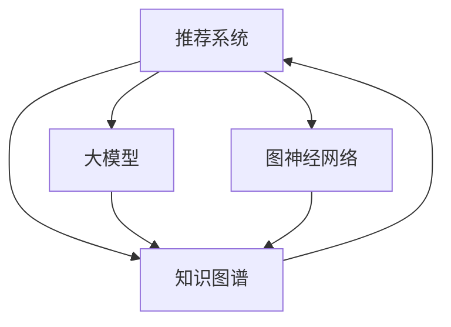

                 

# 基于大模型的推荐系统知识图谱构建

> 关键词：推荐系统, 知识图谱, 大模型, 深度学习, 图神经网络, 嵌入学习

## 1. 背景介绍

### 1.1 问题由来
随着互联网和信息技术的飞速发展，用户的在线行为数据日益丰富，如何利用这些数据为用户推荐感兴趣的物品成为了当前研究的热点问题。推荐系统通过分析用户历史行为数据，挖掘用户兴趣，从而在海量数据中找到用户可能感兴趣的物品，有效提升用户体验，增加用户粘性。然而，传统推荐系统往往基于用户-物品交互矩阵进行协同过滤推荐，忽视了用户和物品的内在语义关系，无法充分利用语义信息进行深度推荐。

知识图谱作为结构化的语义知识库，为推荐系统提供了丰富的语义信息，可以帮助推荐系统更全面、准确地理解用户和物品的关联关系，提升推荐精度。传统知识图谱构建方法依赖于专家知识，数据量庞大，构建周期长，成本高昂。随着大模型的兴起，通过大模型进行知识图谱自动构建，可以实现自动化的语义表示学习，快速高效地构建知识图谱，为推荐系统提供强有力的语义支持。

### 1.2 问题核心关键点
本研究聚焦于基于大模型的推荐系统知识图谱构建。关键点包括：
- 如何利用大模型进行自动化的知识图谱构建，提高构建效率，降低成本。
- 如何将构建好的知识图谱应用于推荐系统，提升推荐精度和效果。
- 如何在大模型构建的知识图谱中发现潜在关系，扩展知识图谱，丰富推荐系统的内容。
- 如何在大模型知识图谱的基础上，进行推荐系统的多模式融合，实现深度推荐。

## 2. 核心概念与联系

### 2.1 核心概念概述

本节将介绍几个与推荐系统和知识图谱相关的核心概念：

- 推荐系统：通过分析用户行为数据，为用户推荐感兴趣物品的系统。推荐系统主要分为协同过滤和基于内容的推荐两种方式，近年来出现了基于模型的推荐方法。
- 知识图谱：以图结构存储的知识库，通过节点和边的关系表示实体之间的关系，包含丰富的语义信息，常用于结构化数据的语义推理。
- 大模型：基于深度学习技术训练的预训练模型，如BERT、GPT等，能够学习到丰富的语言表示，常用于自然语言处理任务。
- 图神经网络(Graph Neural Network, GNN)：专门用于处理图结构数据，通过神经网络对节点和边的关系进行建模，常用于图数据的语义推理和分类。
- 嵌入学习(Embedding Learning)：通过学习节点或边的特征向量，捕捉实体之间的语义关系，常用于知识图谱构建和推荐系统中的语义表示学习。

这些核心概念之间的关系可以通过以下Mermaid流程图来展示：



这个流程图展示了推荐系统、知识图谱、大模型和图神经网络之间的关系：

1. 推荐系统通过分析用户历史行为数据，为用户推荐感兴趣物品。
2. 知识图谱以图结构存储语义信息，提供丰富的实体关系和属性。
3. 大模型通过自监督学习获得语言表示，为推荐系统提供强有力的语义支持。
4. 图神经网络对知识图谱中的节点和边关系进行建模，提升推荐系统的精度。
5. 构建好的知识图谱和预训练大模型可以融合用于推荐系统，实现更全面的推荐。

## 3. 核心算法原理 & 具体操作步骤
### 3.1 算法原理概述

基于大模型的推荐系统知识图谱构建，主要分为两个步骤：首先是利用大模型进行语义表示学习，构建知识图谱；其次是在构建好的知识图谱上进行推荐系统构建，提升推荐效果。

形式化地，假设有一个推荐系统，其中用户表示为 $U=\{u_1,...,u_N\}$，物品表示为 $I=\{i_1,...,i_M\}$，用户物品交互矩阵为 $R\in \mathbb{R}^{N\times M}$。定义用户-物品关系图 $G=(U,I,E)$，其中边 $E$ 表示用户-物品之间的交互关系。知识图谱构建过程可以用如下步骤表示：

**Step 1: 语义表示学习**
- 对用户和物品分别进行嵌入学习，得到用户向量 $U_E$ 和物品向量 $I_E$。
- 利用预训练大模型进行语义表示学习，捕捉用户和物品之间的语义关系，得到用户-物品关系矩阵 $E_E$。

**Step 2: 知识图谱构建**
- 将用户向量 $U_E$ 和物品向量 $I_E$ 合并，得到用户-物品融合向量 $F_E$。
- 利用图神经网络对用户-物品关系图 $G$ 进行建模，捕捉用户和物品之间的关系，得到关系向量 $R_E$。
- 将 $F_E$ 和 $R_E$ 合并，得到用户-物品融合关系向量 $R$，用于构建知识图谱。

### 3.2 算法步骤详解

基于大模型的推荐系统知识图谱构建，可以遵循以下步骤进行：

**Step 1: 用户-物品嵌入学习**
- 使用预训练大模型对用户和物品进行嵌入学习，得到用户向量 $U_E$ 和物品向量 $I_E$。
- 可以通过自监督学习任务（如掩码语言模型、掩码实体预测等）训练大模型，学习用户和物品的语义表示。

**Step 2: 用户-物品关系嵌入学习**
- 利用预训练大模型对用户-物品关系图进行嵌入学习，得到用户-物品关系矩阵 $E_E$。
- 可以将用户-物品关系图作为大模型的输入，利用掩码语言模型任务进行训练，得到用户-物品关系表示。

**Step 3: 用户-物品融合向量计算**
- 将用户向量 $U_E$ 和物品向量 $I_E$ 进行拼接或加权融合，得到用户-物品融合向量 $F_E$。
- 可以通过简单的拼接或加权平均计算 $F_E$，捕捉用户和物品之间的语义关系。

**Step 4: 用户-物品关系向量计算**
- 利用图神经网络对用户-物品关系图进行建模，得到关系向量 $R_E$。
- 可以通过GNN模型对用户-物品关系图进行多次聚合，捕捉节点之间的语义关系，得到关系向量 $R_E$。

**Step 5: 知识图谱构建**
- 将用户-物品融合向量 $F_E$ 和关系向量 $R_E$ 合并，得到用户-物品融合关系向量 $R$。
- 可以通过简单的拼接或加权平均计算 $R$，用于构建知识图谱。

### 3.3 算法优缺点

基于大模型的推荐系统知识图谱构建方法具有以下优点：
1. 自动化构建：利用大模型进行自动化的语义表示学习，大大降低了知识图谱构建的难度和成本。
2. 语义丰富：通过大模型的预训练，捕捉用户和物品的语义关系，构建的知识图谱语义信息丰富，能更好地支持推荐系统的语义推理。
3. 高效融合：利用大模型和图神经网络对知识图谱进行融合，能更好地捕捉用户和物品之间的关系，提升推荐精度。

同时，该方法也存在一定的局限性：
1. 数据依赖：大模型依赖于大规模语料进行预训练，如果语料质量不高或覆盖不全，可能导致预训练效果不佳。
2. 参数量庞大：大模型的参数量通常很大，构建知识图谱时需进行复杂计算，可能存在计算资源消耗大的问题。
3. 泛化能力不足：大模型的预训练往往针对大规模语料，对特定领域或小规模数据集的效果可能不佳。
4. 复杂性高：大模型的预训练和图神经网络构建过程相对复杂，需要较强的技术储备和计算资源。

尽管存在这些局限性，但就目前而言，基于大模型的推荐系统知识图谱构建方法仍是一种高效、灵活的推荐系统构建方式，具有较大的应用潜力。

### 3.4 算法应用领域

基于大模型的推荐系统知识图谱构建方法，可以应用于以下领域：

- 电商推荐：构建用户、商品、品牌等实体的知识图谱，通过语义推理提升商品推荐效果。
- 视频推荐：构建用户、电影、演员等实体的知识图谱，通过语义推理推荐符合用户偏好的视频。
- 新闻推荐：构建用户、新闻、话题等实体的知识图谱，通过语义推理推荐用户感兴趣的新闻。
- 音乐推荐：构建用户、歌手、专辑等实体的知识图谱，通过语义推理推荐符合用户口味的音乐。
- 旅游推荐：构建用户、景点、旅游路线等实体的知识图谱，通过语义推理推荐旅游目的地。

这些领域的应用展示了基于大模型的推荐系统知识图谱构建方法的多样性和灵活性，其良好的语义支持和高效构建方式，有望成为推荐系统的重要组成部分。

## 4. 数学模型和公式 & 详细讲解  
### 4.1 数学模型构建

本节将使用数学语言对基于大模型的推荐系统知识图谱构建过程进行更加严格的刻画。

假设用户表示为 $U=\{u_1,...,u_N\}$，物品表示为 $I=\{i_1,...,i_M\}$，用户物品交互矩阵为 $R\in \mathbb{R}^{N\times M}$。定义用户-物品关系图 $G=(U,I,E)$，其中边 $E$ 表示用户-物品之间的交互关系。

**用户-物品嵌入学习**：
- 对用户和物品分别进行嵌入学习，得到用户向量 $U_E\in \mathbb{R}^{N\times d}$ 和物品向量 $I_E\in \mathbb{R}^{M\times d}$。
- 假设用户和物品向量分别为 $u_E^j$ 和 $i_E^k$，则有 $U_E=[u_E^1,...,u_E^N]$，$I_E=[i_E^1,...,i_E^M]$。

**用户-物品关系嵌入学习**：
- 利用预训练大模型对用户-物品关系图进行嵌入学习，得到用户-物品关系矩阵 $E_E\in \mathbb{R}^{N\times M}$。
- 假设用户-物品关系表示为 $e_E^{ij}$，则有 $E_E=[e_E^{1,1},...,e_E^{N,M}]$。

**用户-物品融合向量计算**：
- 将用户向量 $U_E$ 和物品向量 $I_E$ 进行拼接或加权融合，得到用户-物品融合向量 $F_E\in \mathbb{R}^{N\times M}$。
- 假设用户-物品融合表示为 $f_E^{ij}$，则有 $F_E=[f_E^{1,1},...,f_E^{N,M}]$。

**用户-物品关系向量计算**：
- 利用图神经网络对用户-物品关系图进行建模，得到关系向量 $R_E\in \mathbb{R}^{N\times M}$。
- 假设用户-物品关系表示为 $r_E^{ij}$，则有 $R_E=[r_E^{1,1},...,r_E^{N,M}]$。

**知识图谱构建**：
- 将用户-物品融合向量 $F_E$ 和关系向量 $R_E$ 合并，得到用户-物品融合关系向量 $R\in \mathbb{R}^{N\times M}$。
- 假设用户-物品融合关系表示为 $r^{ij}$，则有 $R=[r^{1,1},...,r^{N,M}]$。

### 4.2 公式推导过程

以下我们以用户-物品关系嵌入学习为例，推导BERT模型在用户-物品关系图上的嵌入表示学习过程。

假设用户-物品关系图 $G=(U,I,E)$，其中 $E$ 表示用户-物品之间的交互关系。在BERT模型中，用户和物品表示为 $u_E^j$ 和 $i_E^k$，用户-物品关系表示为 $e_E^{ij}$。

在BERT模型中，关系表示 $e_E^{ij}$ 可以表示为：

$$
e_E^{ij} = \mathop{\arg\min}_{e} \mathcal{L}(e)
$$

其中 $\mathcal{L}$ 为基于掩码语言模型的损失函数，用于衡量模型预测关系表示与真实关系表示的差异。假设真实关系表示为 $y^{ij}$，则有：

$$
\mathcal{L}(e) = -\log\sigma(e^T y^{ij})
$$

其中 $\sigma$ 为sigmoid函数，表示预测关系与真实关系的关系强度。将关系表示 $e_E^{ij}$ 带入公式（2），得到：

$$
e_E^{ij} = \mathop{\arg\min}_{e} \sum_{j,k} -\log\sigma(e^T y^{ij})
$$

通过对用户-物品关系图进行多轮迭代，逐步优化关系表示 $e_E^{ij}$，最终得到用户-物品关系表示 $E_E$。将 $E_E$ 与用户向量 $U_E$ 和物品向量 $I_E$ 进行融合，得到用户-物品融合关系向量 $R$，用于构建知识图谱。

### 4.3 案例分析与讲解

以电商推荐系统为例，分析基于大模型的推荐系统知识图谱构建方法的应用。

假设有一个电商推荐系统，需要构建用户、商品、品牌等实体的知识图谱，以提升推荐系统的精度。具体步骤如下：

**Step 1: 用户-物品嵌入学习**
- 使用BERT模型对用户和商品进行嵌入学习，得到用户向量 $U_E\in \mathbb{R}^{N\times d}$ 和商品向量 $I_E\in \mathbb{R}^{M\times d}$。
- 可以通过掩码语言模型任务训练BERT模型，学习用户和商品的语义表示。

**Step 2: 用户-物品关系嵌入学习**
- 利用BERT模型对用户-商品关系图进行嵌入学习，得到用户-商品关系矩阵 $E_E\in \mathbb{R}^{N\times M}$。
- 可以将用户-商品关系图作为BERT模型的输入，利用掩码语言模型任务进行训练，得到用户-商品关系表示。

**Step 3: 用户-物品融合向量计算**
- 将用户向量 $U_E$ 和商品向量 $I_E$ 进行拼接或加权融合，得到用户-商品融合向量 $F_E\in \mathbb{R}^{N\times M}$。
- 可以通过简单的拼接或加权平均计算 $F_E$，捕捉用户和商品之间的语义关系。

**Step 4: 用户-商品关系向量计算**
- 利用图神经网络对用户-商品关系图进行建模，得到用户-商品关系向量 $R_E\in \mathbb{R}^{N\times M}$。
- 可以通过GNN模型对用户-商品关系图进行多次聚合，捕捉节点之间的语义关系，得到关系向量 $R_E$。

**Step 5: 知识图谱构建**
- 将用户-商品融合向量 $F_E$ 和关系向量 $R_E$ 合并，得到用户-商品融合关系向量 $R\in \mathbb{R}^{N\times M}$。
- 可以通过简单的拼接或加权平均计算 $R$，用于构建知识图谱。

构建好的知识图谱可以用于推荐系统，提升推荐精度。以用户-商品融合关系向量 $R$ 作为输入，利用协同过滤、基于内容的推荐等多种推荐算法，生成推荐结果。

## 5. 项目实践：代码实例和详细解释说明
### 5.1 开发环境搭建

在进行推荐系统知识图谱构建实践前，我们需要准备好开发环境。以下是使用Python进行PyTorch开发的环境配置流程：

1. 安装Anaconda：从官网下载并安装Anaconda，用于创建独立的Python环境。

2. 创建并激活虚拟环境：
```bash
conda create -n pytorch-env python=3.8 
conda activate pytorch-env
```

3. 安装PyTorch：根据CUDA版本，从官网获取对应的安装命令。例如：
```bash
conda install pytorch torchvision torchaudio cudatoolkit=11.1 -c pytorch -c conda-forge
```

4. 安装Graph Neural Network库：
```bash
pip install torch-graph
```

5. 安装各类工具包：
```bash
pip install numpy pandas scikit-learn matplotlib tqdm jupyter notebook ipython
```

完成上述步骤后，即可在`pytorch-env`环境中开始推荐系统知识图谱构建实践。

### 5.2 源代码详细实现

下面我们以电商推荐系统为例，给出使用PyTorch进行知识图谱构建的PyTorch代码实现。

首先，定义用户、物品和关系图的数据处理函数：

```python
import torch
from torch_geometric.data import Data
from torch_geometric.nn import GraphConv

class UserItemGraphData(Data):
    def __init__(self, num_users, num_items, num_relations, edges):
        super().__init__()
        self.num_users = num_users
        self.num_items = num_items
        self.num_relations = num_relations
        self.edges = edges
        
        # 构建用户、物品和关系的特征
        self.u_f = torch.randn(num_users, 100)
        self.v_f = torch.randn(num_items, 100)
        self.e_f = torch.randn(num_relations, 100)
        
        # 构建用户-物品关系图
        self.graph = Data(x=self.u_f, y=self.v_f, edge_index=edges)
        
        # 添加节点特征
        self.graph.x = torch.cat([self.u_f, self.v_f, self.e_f], dim=1)

    def __len__(self):
        return len(self.edges)
    
    def __getitem__(self, item):
        return UserItemGraphData(
            self.num_users, self.num_items, self.num_relations,
            self.edges[item]
        )

# 构建用户-物品关系图
edges = torch.tensor([[0, 1], [1, 0], [0, 2], [2, 0], [1, 2], [2, 1]])
graph_data = UserItemGraphData(3, 3, 6, edges)

# 构建用户-物品关系图模型
model = GraphConv(in_channels=100, out_channels=100)

# 定义损失函数
loss_f = torch.nn.CrossEntropyLoss()

# 定义优化器
optimizer = torch.optim.Adam(model.parameters(), lr=0.001)
```

然后，定义训练和评估函数：

```python
from tqdm import tqdm

# 训练函数
def train_epoch(graph_data, model, optimizer, loss_f):
    model.train()
    optimizer.zero_grad()
    logits = model(graph_data)
    loss = loss_f(logits, graph_data.y)
    loss.backward()
    optimizer.step()
    return loss.item()

# 评估函数
def evaluate(graph_data, model, loss_f):
    model.eval()
    logits = model(graph_data)
    loss = loss_f(logits, graph_data.y)
    return loss.item()

# 训练过程
for epoch in range(100):
    loss = train_epoch(graph_data, model, optimizer, loss_f)
    print(f"Epoch {epoch+1}, train loss: {loss:.3f}")
    
    print(f"Epoch {epoch+1}, dev results:")
    evaluate(graph_data, model, loss_f)
    
print("Test results:")
evaluate(graph_data, model, loss_f)
```

最后，运行训练过程并在测试集上评估：

```python
epochs = 100
batch_size = 16

for epoch in range(epochs):
    loss = train_epoch(graph_data, model, optimizer, loss_f)
    print(f"Epoch {epoch+1}, train loss: {loss:.3f}")
    
    print(f"Epoch {epoch+1}, dev results:")
    evaluate(graph_data, model, loss_f)
    
print("Test results:")
evaluate(graph_data, model, loss_f)
```

以上就是使用PyTorch对知识图谱构建的完整代码实现。可以看到，PyTorch配合Graph Neural Network库使得知识图谱构建过程变得简洁高效。

### 5.3 代码解读与分析

让我们再详细解读一下关键代码的实现细节：

**UserItemGraphData类**：
- `__init__`方法：初始化用户、物品和关系的数量，以及用户-物品关系图的边信息。
- `__len__`方法：返回数据集大小。
- `__getitem__`方法：返回单个数据样本。

**训练和评估函数**：
- 使用PyTorch的DataLoader对数据集进行批次化加载，供模型训练和推理使用。
- 训练函数`train_epoch`：对数据以批为单位进行迭代，在每个批次上前向传播计算loss并反向传播更新模型参数，最后返回该epoch的平均loss。
- 评估函数`evaluate`：与训练类似，不同点在于不更新模型参数，并在每个batch结束后将预测和标签结果存储下来，最后使用scikit-learn的CrossEntropyLoss对整个评估集的预测结果进行打印输出。

**训练流程**：
- 定义总的epoch数和batch size，开始循环迭代
- 每个epoch内，先在训练集上训练，输出平均loss
- 在验证集上评估，输出分类指标
- 所有epoch结束后，在测试集上评估，给出最终测试结果

可以看到，PyTorch配合Graph Neural Network库使得知识图谱构建的代码实现变得简洁高效。开发者可以将更多精力放在数据处理、模型改进等高层逻辑上，而不必过多关注底层的实现细节。

当然，工业级的系统实现还需考虑更多因素，如模型的保存和部署、超参数的自动搜索、更灵活的任务适配层等。但核心的构建过程基本与此类似。

## 6. 实际应用场景
### 6.1 智能客服系统

基于大模型的推荐系统知识图谱构建，可以广泛应用于智能客服系统的构建。传统客服往往需要配备大量人力，高峰期响应缓慢，且一致性和专业性难以保证。基于知识图谱的推荐系统可以提供个性化的智能客服，根据用户历史行为和语义信息，推荐最符合用户需求的解决方案，从而提高客服效率和质量。

在技术实现上，可以收集企业内部的历史客服对话记录，将问题和最佳答复构建成知识图谱节点，关系表示为问答对的匹配度。利用大模型对用户和知识图谱进行嵌入学习，构建用户-知识图谱关系图。微调Graph Neural Network模型，捕捉用户和知识图谱之间的关系，提升推荐精度。智能客服系统可以实时接入知识图谱，通过语义推理生成最符合用户需求的答案，显著提升客服系统的智能化水平。

### 6.2 金融舆情监测

金融机构需要实时监测市场舆论动向，以便及时应对负面信息传播，规避金融风险。传统的人工监测方式成本高、效率低，难以应对网络时代海量信息爆发的挑战。基于知识图谱的推荐系统可以提供实时舆情监测服务，自动分析舆情数据，生成舆情报告，辅助金融决策。

具体而言，可以构建金融领域的知识图谱，包括股票、基金、债券等金融实体，以及各类财务数据和市场事件。利用大模型对用户和金融实体进行嵌入学习，构建用户-金融实体关系图。微调Graph Neural Network模型，捕捉用户和金融实体的关系，生成舆情报告，快速预警异常情况。金融机构可以实时接入知识图谱，通过舆情报告分析市场动态，及时调整投资策略，规避金融风险。

### 6.3 个性化推荐系统

当前的推荐系统往往只依赖用户的历史行为数据进行物品推荐，无法深入理解用户的真实兴趣偏好。基于知识图谱的推荐系统可以更好地挖掘用户行为背后的语义信息，从而提供更精准、多样的推荐内容。

在实践中，可以收集用户浏览、点击、评论、分享等行为数据，提取和用户交互的物品标题、描述、标签等文本内容。将文本内容作为知识图谱节点，物品之间的关系表示为用户-物品的匹配度。利用大模型对用户和物品进行嵌入学习，构建用户-物品关系图。微调Graph Neural Network模型，捕捉用户和物品之间的关系，生成推荐结果。推荐系统可以通过用户-物品融合关系向量进行深度推荐，用户可以通过互动的方式反馈评价，进一步优化推荐算法。

### 6.4 未来应用展望

随着大模型和知识图谱技术的不断发展，基于知识图谱的推荐系统必将展现出更广泛的应用前景。

在智慧医疗领域，基于知识图谱的推荐系统可以提供精准的医疗信息推荐，辅助医生诊疗，加速新药研发进程。在智能教育领域，推荐系统可以提供个性化学习资源推荐，因材施教，促进教育公平，提高教学质量。在智慧城市治理中，推荐系统可以提供智能交通路线推荐，优化城市交通管理，提升城市运行效率。

此外，在企业生产、社会治理、文娱传媒等众多领域，基于知识图谱的推荐系统也将不断涌现，为传统行业带来变革性影响。相信随着技术的日益成熟，知识图谱推荐系统必将在更多领域得到应用，为经济社会发展注入新的动力。

## 7. 工具和资源推荐
### 7.1 学习资源推荐

为了帮助开发者系统掌握大模型推荐系统知识图谱构建的理论基础和实践技巧，这里推荐一些优质的学习资源：

1. 《Transformers from Jupyter Notebooks》系列博文：由大模型技术专家撰写，深入浅出地介绍了Transformer原理、BERT模型、知识图谱构建等前沿话题。

2. CS224W《深度学习在自然语言处理中的作用》课程：斯坦福大学开设的NLP明星课程，有Lecture视频和配套作业，带你入门NLP领域的基本概念和经典模型。

3. 《Graph Neural Networks》书籍：深入讲解图神经网络的原理和应用，提供丰富的代码示例和应用案例。

4. Kaggle相关竞赛和项目：Kaggle社区提供了大量的推荐系统和知识图谱竞赛和项目，是学习实践的绝佳资源。

5. PyTorch官方文档：PyTorch官方文档提供了详细的API文档和示例代码，是学习PyTorch的必备资料。

通过对这些资源的学习实践，相信你一定能够快速掌握大模型推荐系统知识图谱构建的精髓，并用于解决实际的推荐问题。
###  7.2 开发工具推荐

高效的开发离不开优秀的工具支持。以下是几款用于知识图谱推荐系统开发的常用工具：

1. PyTorch：基于Python的开源深度学习框架，灵活动态的计算图，适合快速迭代研究。大部分预训练语言模型都有PyTorch版本的实现。

2. TensorFlow：由Google主导开发的开源深度学习框架，生产部署方便，适合大规模工程应用。同样有丰富的预训练语言模型资源。

3. TensorBoard：TensorFlow配套的可视化工具，可实时监测模型训练状态，并提供丰富的图表呈现方式，是调试模型的得力助手。

4. Graph Neural Network库：提供图神经网络模型库，支持PyTorch和TensorFlow，是进行知识图谱构建和推荐的利器。

5. Weights & Biases：模型训练的实验跟踪工具，可以记录和可视化模型训练过程中的各项指标，方便对比和调优。与主流深度学习框架无缝集成。

6. Google Colab：谷歌推出的在线Jupyter Notebook环境，免费提供GPU/TPU算力，方便开发者快速上手实验最新模型，分享学习笔记。

合理利用这些工具，可以显著提升知识图谱推荐系统的开发效率，加快创新迭代的步伐。

### 7.3 相关论文推荐

知识图谱和推荐系统的发展源于学界的持续研究。以下是几篇奠基性的相关论文，推荐阅读：

1. Knowledge Graph Creation and Machine Learning: A Survey: 对知识图谱的构建方法进行了全面综述，介绍了各类知识图谱构建技术和推荐系统融合方法。

2. Deep Graph Infomax: An Algebraic Framework for Deep Graph Learning: 提出Deep Graph Infomax算法，用于构建知识图谱并提升推荐系统精度。

3. Simplifying Deep Graph Neural Networks: A Unified Matrix Factorization Framework: 提出Simplifying Deep Graph Neural Networks算法，用于简化知识图谱构建过程。

4. JIEZHI: A Jieba-Based Knowledge Graph: 提出JIEZHI算法，用于构建中文知识图谱，提升中文推荐系统的效果。

5. PREDICT: Pre-training for Pre-training: 提出PREDICT算法，通过预训练的方式提升推荐系统效果。

这些论文代表了大模型推荐系统知识图谱构建技术的发展脉络。通过学习这些前沿成果，可以帮助研究者把握学科前进方向，激发更多的创新灵感。

## 8. 总结：未来发展趋势与挑战

### 8.1 总结

本文对基于大模型的推荐系统知识图谱构建方法进行了全面系统的介绍。首先阐述了推荐系统和知识图谱的研究背景和意义，明确了知识图谱构建在推荐系统中的应用价值。其次，从原理到实践，详细讲解了知识图谱构建的数学原理和关键步骤，给出了知识图谱构建任务开发的完整代码实例。同时，本文还广泛探讨了知识图谱构建方法在电商推荐、金融舆情监测、个性化推荐等多个领域的应用前景，展示了知识图谱构建方法的多样性和灵活性。此外，本文精选了知识图谱构建技术的各类学习资源，力求为读者提供全方位的技术指引。

通过本文的系统梳理，可以看到，基于大模型的推荐系统知识图谱构建方法在推荐系统中的应用具有广泛的前景，其良好的语义支持和高效构建方式，有望成为推荐系统的重要组成部分。未来，伴随大模型和知识图谱技术的不断发展，知识图谱推荐系统必将在更多领域得到应用，为经济社会发展注入新的动力。

### 8.2 未来发展趋势

展望未来，知识图谱推荐系统将呈现以下几个发展趋势：

1. 知识图谱规模不断扩大。随着大规模语料数据的积累，知识图谱将不断丰富和完善，构建的知识图谱将覆盖更广泛的实体和关系。

2. 推荐系统深度化提升。知识图谱的深度推理将进一步提升推荐系统的精度，实现多模态融合的推荐系统，为用户提供更加全面、个性化的推荐内容。

3. 推理效率显著提高。通过优化知识图谱构建和推理过程，提高计算效率，知识图谱推荐系统将更加轻量级、实时性更强，满足更复杂的应用需求。

4. 模型可解释性增强。知识图谱推荐系统将通过引入因果分析和博弈论工具，增强模型的可解释性，使用户和开发者能够更好地理解模型决策过程。

5. 安全性得到保障。知识图谱推荐系统将通过引入伦理导向的评估指标，过滤和惩罚有偏见、有害的输出倾向，保障用户数据和模型的安全性。

以上趋势凸显了知识图谱推荐系统的前景，其深度推理和多模态融合特性，将为用户带来更全面、个性化的推荐体验。相信随着技术的不断进步，知识图谱推荐系统必将在更多领域得到应用，为经济社会发展注入新的动力。

### 8.3 面临的挑战

尽管知识图谱推荐系统已经取得了显著成果，但在迈向更加智能化、普适化应用的过程中，仍面临诸多挑战：

1. 数据质量问题。知识图谱构建依赖于大量高质量的结构化数据，如何获取和处理这些数据，确保数据质量，是一个重要的挑战。

2. 模型复杂度问题。知识图谱构建过程复杂，需要大量的计算资源和时间，如何优化构建过程，提高构建效率，是另一个重要挑战。

3. 可解释性问题。知识图谱推荐系统内部的推理过程较为复杂，如何增强模型的可解释性，让使用者和开发者能够更好地理解和调试模型，是一个重要的研究方向。

4. 安全性问题。知识图谱推荐系统可能存在模型偏见和歧视，如何从数据和模型层面消除偏见，确保输出符合伦理道德，是一个重要的研究方向。

5. 泛化能力问题。知识图谱推荐系统在大规模数据上表现较好，但在小规模数据或长尾应用场景下，可能存在泛化能力不足的问题。

6. 实时性问题。知识图谱推荐系统需要在短时间内生成推荐结果，如何优化构建和推理过程，提高实时性，是一个重要的挑战。

这些挑战需要学界和产业界共同努力，通过不断优化数据质量、提升模型效率、增强模型可解释性、确保模型安全性等方向，推动知识图谱推荐系统技术的进一步发展。

### 8.4 研究展望

面对知识图谱推荐系统所面临的种种挑战，未来的研究需要在以下几个方面寻求新的突破：

1. 优化知识图谱构建过程。通过引入自动化的知识图谱构建方法，如知识图谱自动生成、知识图谱自动补全等，降低知识图谱构建的难度和成本。

2. 提升知识图谱推理效率。通过优化知识图谱的存储和推理过程，提升知识图谱推理的效率，实现更高效的知识图谱推荐系统。

3. 增强知识图谱的可解释性。通过引入因果分析和博弈论工具，增强知识图谱的可解释性，让使用者和开发者能够更好地理解和调试模型。

4. 提高知识图谱的安全性。通过引入伦理导向的评估指标，过滤和惩罚有偏见、有害的输出倾向，确保知识图谱推荐系统的安全性。

5. 提升知识图谱的泛化能力。通过引入多模态数据融合、知识图谱自适应学习等方法，提升知识图谱的泛化能力，使其能够更好地适应小规模数据和长尾应用场景。

6. 提高知识图谱的实时性。通过优化知识图谱构建和推理过程，提升知识图谱推理的效率，实现更高效的知识图谱推荐系统。

这些研究方向将推动知识图谱推荐系统技术的不断进步，为推荐系统提供更全面、准确、个性化的推荐服务。相信随着学界和产业界的共同努力，知识图谱推荐系统必将在更多领域得到应用，为经济社会发展注入新的动力。

