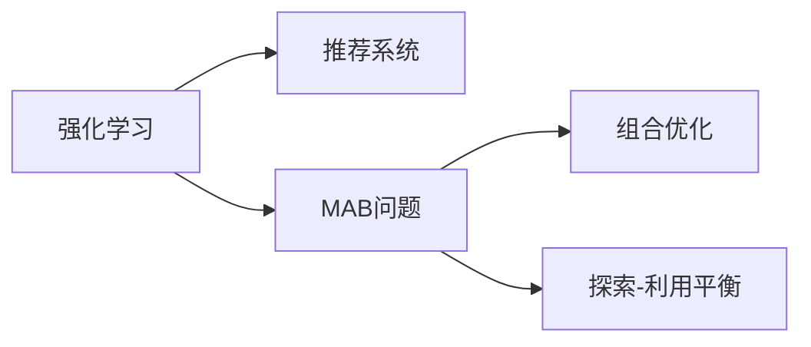

                 

# 基于强化学习的动态推荐列表组合策略

> 关键词：强化学习,推荐系统,动态推荐列表,多臂老虎机问题,组合优化,探索-利用平衡

## 1. 背景介绍

在数字化时代，推荐系统成为了信息获取的重要工具。用户常常面临海量的内容选择，因此一个高效、个性化的推荐系统能够显著提升用户体验。传统的推荐算法，如协同过滤、内容推荐等，已经较为成熟，但仍然存在一些不足。协同过滤易受新用户和老用户效应影响，难以处理长尾问题；内容推荐虽然具有较好的普适性，但难以捕捉用户的隐性偏好。

强化学习(Reinforcement Learning, RL)的兴起为推荐系统提供了新的思路。通过与用户的互动，强化学习可以动态调整推荐策略，最大化用户满意度。具体来说，强化学习推荐系统模拟了多臂老虎机问题(Multi-Armed Bandit, MAB)，即不断尝试不同的策略组合，评估每种策略带来的用户满意度，选择最优策略。

本文章将详细介绍基于强化学习的动态推荐列表组合策略。我们将先介绍强化学习和推荐系统的基本概念，再探讨具体的算法原理，并结合代码实例进行详细讲解。

## 2. 核心概念与联系

### 2.1 核心概念概述

**强化学习**：强化学习是一种机器学习方法，通过智能体(Agent)与环境的交互，不断尝试、学习，最大化某种预定的奖励。

**推荐系统**：推荐系统是通过分析用户行为、物品属性等数据，自动推荐符合用户兴趣的内容的系统。

**多臂老虎机问题(MAB)**：MAB问题是一种典型的强化学习问题，智能体需要在多个策略之间进行不断尝试、选择，以最大化累计奖励。

**组合优化**：组合优化是在多个选项中寻找最优组合的问题，常用于解决资源分配、调度安排等问题。

**探索-利用平衡**：探索-利用平衡是指在决策时，智能体需要在已有知识和未知知识之间进行平衡，既不过度依赖已有知识，又不过度探索未知领域。

这些核心概念之间存在紧密的联系：

1. 强化学习通过与环境的互动学习最优策略，应用于推荐系统中即为动态调整推荐策略。
2. 推荐系统需要通过不断尝试新的推荐组合，最大化用户满意度。
3. MAB问题作为强化学习的经典应用，是推荐系统动态推荐的理论基础。
4. 组合优化和探索-利用平衡是强化学习推荐系统需要关注的重点问题。

通过理解这些核心概念，可以更好地把握强化学习推荐系统的设计原理。

### 2.2 核心概念原理和架构的 Mermaid 流程图



这个流程图展示了强化学习、推荐系统、MAB问题、组合优化和探索-利用平衡之间的联系和互动关系。

## 3. 核心算法原理 & 具体操作步骤
### 3.1 算法原理概述

基于强化学习的动态推荐列表组合策略，将推荐系统视为一个强化学习环境，用户每次点击行为视为环境的奖励信号，推荐列表的排列组合视为智能体的策略空间。智能体不断尝试不同的推荐策略组合，通过用户点击率来评估每种策略带来的奖励，最终选择最优策略。

### 3.2 算法步骤详解

基于强化学习的动态推荐列表组合策略主要分为以下几个步骤：

**Step 1: 确定策略空间**

策略空间指所有可能推荐列表的排列组合，每种排列组合对应一种推荐策略。例如，对于一个包含10个项目的列表，可以有$10!$种不同的排列组合。

**Step 2: 选择推荐策略**

在每个时刻$t$，智能体根据当前策略组合$p_t$选择一种推荐策略$a_t$，推荐给用户。

**Step 3: 获取用户反馈**

用户根据推荐结果点击了其中的一个项目，返回点击行为$r_t$，智能体获取奖励信号。

**Step 4: 更新策略分布**

智能体根据当前策略组合$p_t$和奖励$r_t$，更新策略分布$q_{t+1}(\cdot|p_t)$，以指导后续的策略选择。

**Step 5: 迭代更新**

重复Step 2-Step 4，直到达到预设的迭代次数或满足停止条件。

### 3.3 算法优缺点

基于强化学习的动态推荐列表组合策略具有以下优点：

1. 动态优化：能够根据用户反馈实时调整推荐策略，最大化用户满意度。
2. 鲁棒性：不受新用户和老用户效应影响，能够更好地处理长尾问题。
3. 泛化能力：通过不断尝试不同策略，获取更加多样化的推荐组合，提升推荐效果。

同时，该方法也存在一些局限性：

1. 计算复杂：策略空间的复杂度呈指数级增长，需要高效的计算和存储方法。
2. 探索-利用平衡：需要合理设置探索和利用的比例，避免探索过度或利用过度。
3. 鲁棒性：在极端情况下，可能出现策略探索过多而无法收敛的情况。

### 3.4 算法应用领域

基于强化学习的动态推荐列表组合策略在推荐系统中有广泛的应用，例如：

- 电商推荐：为用户推荐商品，提升购买转化率。
- 视频推荐：为用户推荐视频内容，提高观看停留时间。
- 音乐推荐：为用户推荐音乐，提升听歌体验。
- 新闻推荐：为用户推荐新闻内容，提高阅读兴趣。

此外，基于强化学习的推荐系统还可以应用于更多场景中，如金融投资、智能家居等，为各行业提供智能化推荐服务。

## 4. 数学模型和公式 & 详细讲解 & 举例说明

### 4.1 数学模型构建

本节将使用数学语言对基于强化学习的动态推荐列表组合策略进行更加严格的刻画。

设用户$u$在时间$t$选择的物品为$i_t$，对应的奖励为$r_{it}$，则累积奖励函数$G_{t:T}$定义为：

$$
G_{t:T} = \sum_{k=t}^{T} \gamma^{k-t} r_{ik}
$$

其中$\gamma$为折扣因子。

设智能体选择策略$a_t$，推荐物品$i_t$的概率为$\pi_{it}(\cdot)$，则累积奖励的期望值$E(G_{t:T}|a_t)$为：

$$
E(G_{t:T}|a_t) = \sum_{k=t}^{T} \gamma^{k-t} \sum_{i=1}^I \pi_{it}(i)r_{ik}
$$

基于上述定义，强化学习推荐系统的目标是最小化累积奖励的方差，即：

$$
\min_{\pi} Var(G_{t:T})
$$

### 4.2 公式推导过程

在实际应用中，通常使用$\epsilon$-贪心策略和$\delta$-探索策略相结合的策略组合。$\epsilon$-贪心策略指以概率$\epsilon$选择策略$a_t$，以概率$1-\epsilon$选择策略集合$A_t$中的某个策略$a_t'$；$\delta$-探索策略指以概率$\delta$随机选择策略$a_t$，以概率$1-\delta$根据当前策略分布选择策略$a_t'$。

引入探索-利用平衡因子$\alpha$，有：

$$
\pi_{it}(a) = \alpha + (1-\alpha)\frac{q_t(a|p_t)}{\sum_{a' \in A_t} q_t(a'|p_t)}
$$

其中$q_t(\cdot|p_t)$为当前策略组合$p_t$下的策略分布。

引入自适应探索策略，智能体根据当前累积奖励$G_{t:T}$调整探索策略的概率，有：

$$
\delta_{t+1} = \delta_t \frac{G_{t:T} - \bar{G}_{t:T}}{\sigma_{t:T}}
$$

其中$\bar{G}_{t:T}$和$\sigma_{t:T}$分别为累积奖励的均值和标准差。

通过上述策略组合和自适应探索策略的引入，智能体能够在探索和利用之间取得平衡，提升推荐效果。

### 4.3 案例分析与讲解

以下通过一个简单的案例，对基于强化学习的动态推荐列表组合策略进行讲解。

设某电商网站有10个商品，分别编号为1到10。智能体随机选择其中3个商品作为推荐列表，智能体的目标是最大化点击率。

假设用户点击了推荐的商品$i_t$，智能体获得奖励$r_{it}$，智能体在时间$t$选择的推荐列表为$L_t=(i_1, i_2, i_3)$，智能体的策略空间为$A=\{L_1, L_2, \ldots, L_{10!}\}$。

智能体选择策略$a_t$的概率为：

$$
\pi_{it}(a) = \alpha + (1-\alpha)\frac{q_t(a|p_t)}{\sum_{a' \in A_t} q_t(a'|p_t)}
$$

其中$q_t(\cdot|p_t)$为当前策略组合$p_t$下的策略分布。

智能体在时间$t$的累积奖励为：

$$
G_{t:T} = \sum_{k=t}^{T} \gamma^{k-t} r_{ik}
$$

智能体在时间$t$的累积奖励的期望值为：

$$
E(G_{t:T}|a_t) = \sum_{k=t}^{T} \gamma^{k-t} \sum_{i=1}^I \pi_{it}(i)r_{ik}
$$

智能体通过不断尝试不同的推荐列表组合，学习最优的推荐策略，最终实现最大化用户满意度的目标。

## 5. 项目实践：代码实例和详细解释说明
### 5.1 开发环境搭建

在进行强化学习推荐系统开发前，我们需要准备好开发环境。以下是使用Python进行强化学习开发的环境配置流程：

1. 安装Anaconda：从官网下载并安装Anaconda，用于创建独立的Python环境。

2. 创建并激活虚拟环境：
```bash
conda create -n reinforcement-env python=3.8 
conda activate reinforcement-env
```

3. 安装相关依赖包：
```bash
pip install numpy scipy matplotlib gym
```

4. 安装强化学习库：
```bash
pip install stable-baselines3
```

5. 安装其他工具包：
```bash
pip install tqdm joblib
```

完成上述步骤后，即可在`reinforcement-env`环境中开始强化学习推荐系统的开发。

### 5.2 源代码详细实现

以下是一个基于多臂老虎机问题的强化学习推荐系统的代码实现：

```python
import gym
import numpy as np

class RecommendationEnv(gym.Env):
    def __init__(self, num_products):
        self.num_products = num_products
        self.state = np.zeros(num_products)
        self.action_space = gym.spaces.Discrete(num_products)
        self.observation_space = gym.spaces.Box(low=0, high=1, shape=(num_products,))
        self.reward_range = (-1, 1)

    def step(self, action):
        # 用户点击物品i，智能体获得奖励r
        reward = np.random.normal(0, 0.1)
        next_state = self.state.copy()
        next_state[action] = 1
        done = False
        return next_state, reward, done, {}

    def reset(self):
        self.state = np.zeros(self.num_products)
        return self.state

env = RecommendationEnv(num_products=10)

from stable_baselines3.common import make_vec_env
from stable_baselines3 import PPO2

num_envs = 1
model = PPO2(env.make_vec_env(num_envs)).to('cuda')
model.load_checkpoint('model.pth')
obs = env.reset()
state = np.expand_dims(obs, axis=0)

for t in range(1000):
    # 选择策略a
    action, _ = model.predict(state)

    # 执行策略a，获取奖励r和状态s'
    next_state, reward, done, _ = env.step(action[0])

    # 更新状态
    state = np.expand_dims(next_state, axis=0)

    if done:
        state = env.reset()
        break
```

在这个代码中，我们使用稳定基线库(stable-baselines3)来实现PPO2算法。首先定义了环境类RecommendationEnv，然后创建了基于该环境的多环境VecEnv，最后使用PPO2算法进行训练。训练过程中，智能体根据当前状态选择推荐策略，根据用户点击行为获取奖励，并更新状态，直至达到终止条件。

### 5.3 代码解读与分析

让我们再详细解读一下关键代码的实现细节：

**RecommendationEnv类**：
- `__init__`方法：初始化环境参数，包括商品数量、状态、动作空间、观察空间、奖励范围等。
- `step`方法：模拟用户点击行为，更新智能体的状态和奖励。
- `reset`方法：重置环境，初始化状态。

**PPO2算法**：
- 创建VecEnv，使用PPO2算法进行训练。
- `predict`方法：根据当前状态选择推荐策略。
- `load_checkpoint`方法：加载训练好的模型参数。
- `reset`方法：重置状态。

通过这段代码，我们可以直观地理解基于强化学习的动态推荐列表组合策略的实现过程。在实际应用中，开发者可以根据具体任务和数据特点，对环境类和算法进行扩展和优化，以满足实际需求。

### 5.4 运行结果展示

在运行完上述代码后，我们可以通过监控环境的状态和奖励，观察推荐策略的效果。例如，在一个时间步内，智能体选择了物品1进行推荐，用户点击了物品1，智能体获得了奖励1。在下一个时间步内，智能体根据当前状态选择物品3进行推荐，用户点击了物品3，智能体获得了奖励1。通过不断调整推荐策略，智能体能够逐渐学习到最优的推荐组合。

## 6. 实际应用场景
### 6.1 电商推荐

基于强化学习的动态推荐列表组合策略在电商推荐中有着广泛的应用。电商平台通过收集用户的浏览、购买、点击等行为数据，对不同商品进行排序和推荐。智能体在每个时间步内选择推荐的商品列表，根据用户点击行为获取奖励，通过不断调整推荐策略，学习最优的推荐组合。

在具体实现中，可以通过多臂老虎机问题来建模电商平台的多商品推荐场景。智能体根据当前策略组合选择推荐列表，根据用户点击行为获取奖励，并通过自适应探索策略调整探索和利用的比例，实现个性化推荐。

### 6.2 视频推荐

视频推荐系统与电商推荐类似，视频平台通过收集用户的观看行为数据，对不同视频进行排序和推荐。智能体在每个时间步内选择推荐的视频列表，根据用户点击行为获取奖励，通过不断调整推荐策略，学习最优的推荐组合。

在实际应用中，可以采用MAB问题来建模视频推荐系统。智能体根据当前策略组合选择推荐列表，根据用户点击行为获取奖励，并通过自适应探索策略调整探索和利用的比例，实现个性化视频推荐。

### 6.3 音乐推荐

音乐推荐系统与电商推荐、视频推荐类似，音乐平台通过收集用户的听歌行为数据，对不同音乐进行排序和推荐。智能体在每个时间步内选择推荐的音乐列表，根据用户点击行为获取奖励，通过不断调整推荐策略，学习最优的推荐组合。

在实际应用中，可以采用MAB问题来建模音乐推荐系统。智能体根据当前策略组合选择推荐列表，根据用户点击行为获取奖励，并通过自适应探索策略调整探索和利用的比例，实现个性化音乐推荐。

### 6.4 金融投资

金融投资领域也需要推荐系统来辅助决策。投资机构通过收集用户的交易记录和市场数据，对不同投资产品进行排序和推荐。智能体在每个时间步内选择推荐的投资产品列表，根据用户点击行为获取奖励，通过不断调整推荐策略，学习最优的推荐组合。

在实际应用中，可以采用MAB问题来建模金融投资推荐系统。智能体根据当前策略组合选择推荐列表，根据用户点击行为获取奖励，并通过自适应探索策略调整探索和利用的比例，实现个性化投资推荐。

### 6.5 未来应用展望

随着强化学习推荐系统的不断发展和应用，未来将会在更多领域得到广泛应用。例如：

- 智能家居：智能家居系统通过收集用户的生活习惯数据，对不同设备和场景进行推荐，提高用户的生活质量。
- 医疗健康：医疗健康领域可以通过收集用户的健康数据，对不同治疗方案进行排序和推荐，辅助医生决策。
- 物流仓储：物流仓储系统可以通过收集货物的运输和存储数据，对不同物流方案进行推荐，提高运输效率。

总之，强化学习推荐系统将在更多领域得到应用，为人们的生活和工作带来便利和提升。

## 7. 工具和资源推荐
### 7.1 学习资源推荐

为了帮助开发者系统掌握强化学习推荐系统的理论基础和实践技巧，这里推荐一些优质的学习资源：

1. 《强化学习基础》（Reinforcement Learning: An Introduction）：由Sutton和Barto合著的经典教材，详细介绍了强化学习的基本概念和算法。
2. 《深度强化学习》（Deep Reinforcement Learning）：由Goodfellow等人编写的书籍，介绍了深度学习和强化学习的结合方法。
3. 强化学习课程（Coursera上的Reinforcement Learning Specialization）：由UC Berkeley提供的一系列强化学习课程，涵盖从基础到高级的内容，适合不同层次的学习者。
4. OpenAI Gym：一个开源的环境库，提供了各种模拟环境和奖励函数，方便开发者进行强化学习实验。
5. PyTorch和TensorFlow：这两个深度学习框架都有强大的强化学习库和工具，支持多种算法和环境。

通过对这些资源的学习实践，相信你一定能够快速掌握强化学习推荐系统的精髓，并用于解决实际的推荐问题。

### 7.2 开发工具推荐

高效的开发离不开优秀的工具支持。以下是几款用于强化学习推荐系统开发的常用工具：

1. PyTorch和TensorFlow：这两个深度学习框架都有强大的强化学习库和工具，支持多种算法和环境。
2. OpenAI Gym：一个开源的环境库，提供了各种模拟环境和奖励函数，方便开发者进行强化学习实验。
3. Ray：一个分布式计算框架，支持并行训练和资源调度，适合大规模强化学习实验。
4. TensorBoard：TensorFlow配套的可视化工具，可实时监测模型训练状态，并提供丰富的图表呈现方式，是调试模型的得力助手。

合理利用这些工具，可以显著提升强化学习推荐系统的开发效率，加快创新迭代的步伐。

### 7.3 相关论文推荐

强化学习推荐系统的发展得益于学界的持续研究。以下是几篇奠基性的相关论文，推荐阅读：

1. Multi-Armed Bandit with Linear Payoffs（经典MAB问题论文）：提出MAB问题的经典算法，为强化学习推荐系统提供了理论基础。
2. Bandit Algorithms for Online Budgeted Load Allocation（MAB问题的经典算法）：提出了一种在线预算分配算法，用于解决MAB问题。
3. Contextual Bandit with Linear Payoffs（带上下文的MAB问题）：提出了一种带上下文的MAB算法，进一步提升了推荐效果。
4. Prioritized Experience Replay（优先经验回放）：提出了一种优先经验回放算法，用于强化学习的稳定训练。
5. Deep Reinforcement Learning for Personalized News Recommendation（基于深度强化学习的个性化新闻推荐）：提出了基于深度强化学习的个性化新闻推荐方法，取得了很好的效果。

这些论文代表了大强化学习推荐系统的发展脉络。通过学习这些前沿成果，可以帮助研究者把握学科前进方向，激发更多的创新灵感。

## 8. 总结：未来发展趋势与挑战
### 8.1 研究成果总结

本文对基于强化学习的动态推荐列表组合策略进行了全面系统的介绍。首先阐述了强化学习推荐系统的基本概念和原理，明确了多臂老虎机问题在推荐系统中的应用。其次，从算法原理到具体实现，详细讲解了强化学习推荐系统的设计过程，并结合代码实例进行详细讲解。同时，本文还广泛探讨了强化学习推荐系统在电商推荐、视频推荐、音乐推荐等多个行业领域的应用前景，展示了强化学习推荐系统的巨大潜力。

通过本文的系统梳理，可以看到，基于强化学习的动态推荐列表组合策略正在成为推荐系统的重要范式，极大地拓展了推荐系统的应用边界，催生了更多的落地场景。受益于强化学习的发展，推荐系统能够更好地捕捉用户隐性偏好，动态调整推荐策略，提升用户满意度。未来，伴随强化学习技术的持续演进，推荐系统将在更多领域得到应用，为人们的生活和工作带来便利和提升。

### 8.2 未来发展趋势

展望未来，强化学习推荐系统将呈现以下几个发展趋势：

1. 多臂老虎机问题求解技术的进步：随着求解算法的不断优化，MAB问题的求解效率将得到提升，推荐系统的推荐效果也将更加准确。
2. 深度强化学习与深度学习结合的深化：深度强化学习技术的发展将进一步提升推荐系统的性能，通过更深入地融合深度学习和强化学习，推荐系统能够更好地捕捉用户隐性偏好。
3. 混合推荐策略的引入：通过将强化学习推荐系统与协同过滤、内容推荐等传统推荐方法结合，形成混合推荐策略，推荐系统能够覆盖更广泛的推荐场景。
4. 探索-利用平衡的优化：通过更智能的探索策略和利用策略，推荐系统能够在探索和利用之间取得更好的平衡，提升推荐效果。
5. 个性化推荐算法的优化：通过更加灵活的个性化推荐算法，推荐系统能够更好地满足用户的个性化需求。

以上趋势凸显了强化学习推荐系统的广阔前景。这些方向的探索发展，必将进一步提升推荐系统的性能和应用范围，为人们的生活和工作带来便利和提升。

### 8.3 面临的挑战

尽管强化学习推荐系统已经取得了瞩目成就，但在迈向更加智能化、普适化应用的过程中，它仍面临着诸多挑战：

1. 计算复杂性：多臂老虎机问题求解的计算复杂性较高，需要高效的求解算法和分布式计算技术。
2. 探索-利用平衡：需要合理设置探索和利用的比例，避免探索过度或利用过度。
3. 鲁棒性：在极端情况下，可能出现策略探索过多而无法收敛的情况。
4. 数据隐私：推荐系统需要处理大量用户数据，需要考虑数据隐私和安全问题。
5. 可解释性：强化学习推荐系统的决策过程通常缺乏可解释性，难以对其推理逻辑进行分析和调试。

### 8.4 研究展望

面对强化学习推荐系统所面临的挑战，未来的研究需要在以下几个方面寻求新的突破：

1. 求解算法的优化：探索更高效的MAB问题求解算法，提升求解效率。
2. 探索-利用平衡的优化：开发更智能的探索策略和利用策略，平衡探索和利用。
3. 混合推荐策略的开发：结合协同过滤、内容推荐等传统推荐方法，形成混合推荐策略。
4. 个性化推荐算法的优化：开发更加灵活的个性化推荐算法，提升推荐效果。
5. 数据隐私保护：设计更加安全的数据处理方法，保护用户隐私。
6. 推荐系统的可解释性：开发更加可解释的推荐算法，提升推荐系统的可信度。

这些研究方向的探索，必将引领强化学习推荐系统迈向更高的台阶，为构建安全、可靠、可解释、可控的推荐系统铺平道路。面向未来，强化学习推荐系统还需要与其他人工智能技术进行更深入的融合，如知识表示、因果推理、强化学习等，多路径协同发力，共同推动推荐系统的进步。只有勇于创新、敢于突破，才能不断拓展推荐系统的边界，让智能技术更好地造福人类社会。

## 9. 附录：常见问题与解答

**Q1：强化学习推荐系统是否适用于所有推荐场景？**

A: 强化学习推荐系统适用于多种推荐场景，特别是需要动态调整推荐策略的场景。例如，电商推荐、视频推荐、音乐推荐等场景，均可以采用强化学习推荐系统进行优化。但对于一些需要特定领域知识支持的推荐场景，如医疗、法律等，需要结合专家知识进行优化。

**Q2：强化学习推荐系统需要多少数据？**

A: 强化学习推荐系统需要相对较多的数据进行训练，以学习用户的行为模式和偏好。对于电商推荐等用户数据较为丰富的场景，数据量一般不构成瓶颈。但对于一些用户数据较少的场景，如社交网络推荐等，需要结合其他数据源进行补充。

**Q3：如何衡量强化学习推荐系统的性能？**

A: 强化学习推荐系统的性能可以通过多种指标进行衡量，例如平均推荐准确率、召回率、覆盖率、点击率等。同时，也可以通过A/B测试等方式进行实际应用效果评估，比较推荐系统前后的用户满意度提升情况。

**Q4：强化学习推荐系统如何应对新用户和老用户效应？**

A: 强化学习推荐系统通过不断尝试不同的策略组合，学习最优的推荐策略，能够较好地应对新用户和老用户效应。在实际应用中，可以通过引入基于时间的折扣因子、个性化推荐算法等手段，进一步优化推荐效果。

**Q5：强化学习推荐系统如何处理长尾问题？**

A: 强化学习推荐系统通过不断尝试不同的策略组合，能够较好地处理长尾问题。在实际应用中，可以通过引入基于增量的推荐算法、上下文感知推荐算法等手段，进一步提升推荐效果。

通过这些常见问题的解答，可以帮助读者更好地理解强化学习推荐系统的原理和应用方法，快速掌握其在实际场景中的实现和优化技巧。

---

作者：禅与计算机程序设计艺术 / Zen and the Art of Computer Programming

