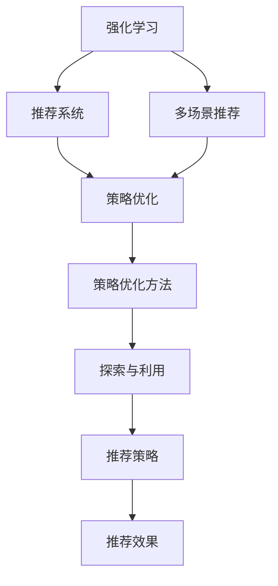

                 

# 基于强化学习的多场景推荐策略

> 关键词：强化学习,推荐系统,多场景,策略优化,个性化推荐

## 1. 背景介绍

### 1.1 问题由来
在现代互联网时代，信息泛滥且内容质量参差不齐，如何为用户推荐最符合其兴趣和需求的内容成为互联网公司亟待解决的问题。推荐系统通过分析用户行为数据，学习用户偏好，为用户推荐最相关的信息，极大地提升了用户体验和平台活跃度。然而，随着用户需求的多样化和个性化加深，传统的推荐系统往往无法满足这些需求，迫切需要新的技术和方法来应对挑战。

### 1.2 问题核心关键点
强化学习(Reinforcement Learning, RL)是一种通过与环境交互来学习最优决策的机器学习方法。在推荐系统中，强化学习可以通过模拟用户行为和互动过程，动态调整推荐策略，实现个性化的推荐。具体而言，RL通过奖励信号反馈优化模型，可以更好地适应用户的个性化需求，提升推荐效果。

强化学习的应用领域极为广泛，从游戏智能体、机器人控制到自动驾驶、医疗诊断等，都有着出色的表现。在推荐系统领域，强化学习同样展现出了极大的潜力和优势。与传统推荐系统相比，强化学习的优点包括：

- 适应性强：强化学习能够处理非平稳、非线性的推荐任务，自适应地调整推荐策略。
- 可解释性高：强化学习的决策过程透明，易于理解和优化。
- 动态学习：强化学习能够实时学习和调整，适应用户行为的动态变化。

尽管强化学习在推荐系统中有诸多优势，但其实际应用仍面临一些挑战：

- 训练难度高：强化学习需要大量训练样本和复杂的环境模型，训练难度较大。
- 多用户交互复杂：在多用户交互的推荐系统中，强化学习需要考虑多个用户之间的相互影响。
- 效率问题：强化学习算法需要大量的计算资源和时间，不适用于实时推荐场景。

### 1.3 问题研究意义
强化学习在推荐系统中的应用，能够更精准地理解用户需求，适应用户行为的变化，实现真正意义上的个性化推荐。强化学习技术的应用，将极大地提升推荐系统的效率和效果，为平台带来更高的用户满意度和更高的收益。

对于推荐系统的开发者和研究人员，掌握强化学习技术将使他们能够更好地构建智能化的推荐引擎，提升推荐策略的灵活性和精准性。同时，掌握强化学习的思想和算法，对于理解复杂系统和优化复杂决策过程也具有重要的意义。

## 2. 核心概念与联系

### 2.1 核心概念概述

为了更好地理解强化学习在推荐系统中的应用，本节将介绍几个密切相关的核心概念：

- 强化学习(Reinforcement Learning, RL)：一种通过与环境交互来学习最优决策的机器学习方法，通过奖励信号反馈优化模型，适应用户需求。
- 推荐系统(Recommender System)：根据用户的历史行为和兴趣，为用户推荐最相关的信息，提高用户满意度。
- 多场景推荐(Multi-scene Recommendation)：在多个推荐场景（如商品推荐、内容推荐、服务推荐等）中，实现个性化推荐，满足用户多方面的需求。
- 策略优化(Policy Optimization)：通过学习最优的推荐策略，最大化用户满意度，优化推荐系统的效果。
- 策略优化方法：如Q-learning、SARSA、策略梯度等，用于优化推荐策略的具体算法。
- 探索与利用(Exploitation and Exploration)：在推荐系统中，需要平衡推荐已有热门内容（利用）和探索新内容（探索），以保持推荐的多样性和新鲜性。

这些核心概念之间的逻辑关系可以通过以下Mermaid流程图来展示：



这个流程图展示了一体化设计的多场景推荐系统框架，其中强化学习在策略优化和探索与利用中发挥核心作用，通过与环境的交互学习最优推荐策略，最终提升推荐效果。

## 3. 核心算法原理 & 具体操作步骤
### 3.1 算法原理概述

基于强化学习的推荐系统，主要通过以下步骤实现：

1. **环境定义**：将推荐系统中的用户行为抽象为状态空间，将推荐结果和用户反馈作为奖励信号。
2. **策略设计**：设计推荐策略，通常包括基于模型的方法和基于规则的方法。
3. **模型训练**：通过与环境交互，收集用户反馈，训练推荐策略模型。
4. **推荐实践**：根据训练好的策略模型，为用户推荐内容。
5. **效果评估**：对推荐结果进行效果评估，根据评估结果反馈调整模型参数。

在具体实现中，强化学习推荐系统一般包括以下几个关键步骤：

**Step 1: 环境建模**

推荐系统中的环境建模是将用户行为抽象为状态空间的过程。用户行为可以表示为一系列状态和时间序列。例如，对于商品推荐系统，状态可以是用户的历史浏览、点击、购买行为等。状态空间可以通过特征工程和数据处理得到，例如使用矩阵分解、词嵌入等方法。

**Step 2: 奖励设计**

设计合适的奖励信号是强化学习推荐系统的关键。奖励信号通常表示用户对推荐结果的满意度，可以是用户的点击率、购买率、评分等。奖励信号的计算需要考虑多方面的因素，例如用户对推荐内容的兴趣、内容的新颖性等。

**Step 3: 策略设计**

推荐策略的设计是强化学习推荐系统的核心。常见的策略设计方法包括基于模型的方法和基于规则的方法。基于模型的方法通常使用神经网络模型，如深度Q网络（DQN）、深度确定性策略梯度（DDPG）等。基于规则的方法则是根据用户的不同特征，设计不同的推荐规则，例如基于协同过滤的推荐方法。

**Step 4: 模型训练**

在模型训练过程中，强化学习推荐系统通过与环境交互，收集用户反馈，不断调整策略参数。训练过程通常包括探索和利用两个阶段，探索阶段用于发现新内容，利用阶段用于推荐热门内容。

**Step 5: 推荐实践**

在推荐实践过程中，根据训练好的策略模型，为用户推荐最相关的信息。推荐结果可以是商品、内容、服务等多种形式。

**Step 6: 效果评估**

对推荐结果进行效果评估，计算评估指标如点击率、购买率、满意度等，根据评估结果调整策略参数，不断优化推荐系统效果。

### 3.2 算法步骤详解

下面以商品推荐为例，详细讲解基于强化学习的推荐系统的工作流程：

**Step 1: 环境建模**

将用户的历史行为数据表示为状态向量 $s_t$，其中 $s_t = (x_1, x_2, ..., x_t)$，其中 $x_i$ 表示用户在时间 $i$ 的浏览、点击、购买等行为。状态向量可以表示为用户最近查看的商品列表、浏览次数、购买次数等。

**Step 2: 奖励设计**

设计奖励函数 $r_t$，用于衡量用户对推荐结果的满意度。奖励函数可以是点击率 $C$、购买率 $P$、评分 $R$ 等。例如：

$$
r_t = \alpha C + \beta P + \gamma R
$$

其中 $\alpha$、$\beta$、$\gamma$ 是权重系数，控制各个指标的重要性。

**Step 3: 策略设计**

推荐策略可以设计为基于模型的策略或基于规则的策略。基于模型的策略通常使用神经网络模型，如深度Q网络（DQN）。具体实现步骤如下：

1. 构建神经网络模型，包括输入层、隐藏层和输出层。输入层接收状态向量 $s_t$，输出层输出策略 $a_t$，策略 $a_t$ 表示推荐结果，可以是商品的ID、链接等。

2. 使用梯度下降等优化算法训练模型参数 $\theta$，最小化损失函数 $L$：

$$
\theta \leftarrow \theta - \eta \nabla_{\theta}L
$$

其中 $\eta$ 是学习率，$L$ 是损失函数。

3. 将训练好的模型应用到实时推荐中，根据状态向量 $s_t$ 输出推荐结果 $a_t$。

**Step 4: 模型训练**

在模型训练过程中，使用与环境交互的Q-learning算法，不断调整策略参数 $\theta$。具体实现步骤如下：

1. 初始化神经网络模型，设置学习率 $\eta$ 和折扣因子 $\gamma$。

2. 从当前状态 $s_t$ 出发，选择行动 $a_t$，并观察环境的状态 $s_{t+1}$ 和奖励 $r_{t+1}$。

3. 根据Q-learning算法，更新模型参数 $\theta$：

$$
Q(s_t, a_t) \leftarrow Q(s_t, a_t) + \eta(r_{t+1} + \gamma \max_{a_{t+1}} Q(s_{t+1}, a_{t+1}) - Q(s_t, a_t))
$$

4. 重复步骤2和3，直到收敛或达到预设的迭代次数。

**Step 5: 推荐实践**

根据训练好的策略模型，为用户推荐最相关的商品。具体实现步骤如下：

1. 从当前状态 $s_t$ 出发，选择行动 $a_t$，即推荐结果。

2. 将推荐结果展示给用户，观察用户的行为，更新状态向量 $s_{t+1}$。

3. 根据用户行为和奖励信号，更新模型参数 $\theta$，重复步骤1和2，直到推荐结束。

**Step 6: 效果评估**

对推荐结果进行效果评估，计算评估指标如点击率、购买率、满意度等，根据评估结果调整策略参数，不断优化推荐系统效果。

### 3.3 算法优缺点

基于强化学习的推荐系统具有以下优点：

1. 自适应性强：强化学习能够处理非平稳、非线性的推荐任务，自适应地调整推荐策略。
2. 可解释性高：强化学习的决策过程透明，易于理解和优化。
3. 动态学习：强化学习能够实时学习和调整，适应用户行为的动态变化。

但同时也存在一些缺点：

1. 训练难度高：强化学习需要大量训练样本和复杂的环境模型，训练难度较大。
2. 多用户交互复杂：在多用户交互的推荐系统中，强化学习需要考虑多个用户之间的相互影响。
3. 效率问题：强化学习算法需要大量的计算资源和时间，不适用于实时推荐场景。

### 3.4 算法应用领域

强化学习推荐系统已经被广泛应用于商品推荐、内容推荐、服务推荐等多个领域，取得了显著的效果。以下是几个具体的应用案例：

**商品推荐**

Amazon和淘宝等电商平台广泛应用强化学习推荐系统，通过用户的历史浏览、点击、购买行为，为用户推荐最相关的商品。强化学习推荐系统能够实时学习和调整，适应用户行为的动态变化，提高用户的购物体验。

**内容推荐**

Netflix和YouTube等视频平台应用强化学习推荐系统，为用户推荐最相关的视频内容。通过分析用户的行为数据，学习用户对不同视频的兴趣，推荐符合用户喜好的内容，提升平台的用户粘性和收益。

**服务推荐**

Airbnb和Uber等平台应用强化学习推荐系统，为用户推荐最合适的服务。通过分析用户的出行行为和历史订单数据，推荐最优的服务和路线，提升用户满意度和平台的运营效率。

除了上述这些应用外，强化学习推荐系统还可以被创新性地应用到更多场景中，如个性化推荐、智能广告投放、智能客服等，为推荐系统带来更多的创新可能。

## 4. 数学模型和公式 & 详细讲解 & 举例说明
### 4.1 数学模型构建

本节将使用数学语言对强化学习推荐系统的数学原理进行严格刻画。

记用户的行为数据为 $(s_1, a_1, r_1, s_2, a_2, r_2, ..., s_t, a_t, r_t)$，其中 $s_t$ 表示状态，$a_t$ 表示行动，$r_t$ 表示奖励。

设推荐策略为 $\pi$，目标是最小化累计奖励的期望值：

$$
\mathcal{J}(\pi) = \mathbb{E}[\sum_{t=1}^{T} \gamma^t r_t^\pi]
$$

其中 $\gamma$ 是折扣因子，$T$ 是时间步长。

在实际应用中，通常使用最大似然估计或蒙特卡洛方法求解目标函数。最大似然估计方法通过最大化观测到的奖励信号，估计策略参数 $\theta$。蒙特卡洛方法通过模拟用户行为，计算累计奖励的期望值。

### 4.2 公式推导过程

以下我们以商品推荐为例，推导强化学习推荐系统的公式。

假设推荐系统的状态空间为 $S$，动作空间为 $A$，策略为 $\pi(a|s)$。定义状态转移概率 $p(s_{t+1}|s_t,a_t)$，即在状态 $s_t$ 下，采取行动 $a_t$ 后，下一个状态 $s_{t+1}$ 的概率分布。

在强化学习推荐系统中，我们使用深度确定性策略梯度（DDPG）算法优化策略参数 $\theta$。DDPG算法的目标是最小化目标函数的期望值：

$$
\mathcal{J}(\pi) = \mathbb{E}[\sum_{t=1}^{T} \gamma^t r_t^\pi]
$$

其中 $r_t^\pi$ 表示在策略 $\pi$ 下，时间步 $t$ 的奖励信号。

DDPG算法通过反向传播算法，更新策略参数 $\theta$。具体实现步骤如下：

1. 构建神经网络模型，输入层为状态向量 $s_t$，输出层为动作 $a_t$。

2. 定义动作值函数 $Q(s_t, a_t)$，即在状态 $s_t$ 下，采取行动 $a_t$ 后的累积奖励的期望值：

$$
Q(s_t, a_t) = \mathbb{E}[\sum_{t=1}^{T} \gamma^t r_t^\pi]
$$

3. 定义策略 $\pi(a|s)$，即在状态 $s$ 下，采取行动 $a$ 的概率分布：

$$
\pi(a|s) = \frac{\exp(Q(s, a))}{\sum_{a'} \exp(Q(s, a'))}
$$

4. 定义策略梯度 $\nabla_{\theta}Q(s_t, a_t)$，即在状态 $s_t$ 下，采取行动 $a_t$ 后的动作值函数的梯度：

$$
\nabla_{\theta}Q(s_t, a_t) = \nabla_{\theta} \log \pi(a_t|s_t)
$$

5. 使用梯度下降算法更新策略参数 $\theta$：

$$
\theta \leftarrow \theta - \eta \nabla_{\theta}J(\pi)
$$

其中 $\eta$ 是学习率，$J(\pi)$ 是目标函数。

### 4.3 案例分析与讲解

下面以电商平台的商品推荐为例，展示强化学习推荐系统的具体实现过程。

假设电商平台的推荐系统包括商品展示、用户行为、用户反馈三个子模块。商品展示模块负责向用户展示商品列表，用户行为模块负责记录用户的浏览、点击、购买行为，用户反馈模块负责收集用户对商品的评分、点击率等反馈信号。

在强化学习推荐系统中，我们将用户的行为数据表示为状态向量 $s_t$，将商品ID、评分等作为奖励信号 $r_t$，使用深度确定性策略梯度（DDPG）算法优化策略参数 $\theta$。

具体实现步骤如下：

1. 构建神经网络模型，输入层为状态向量 $s_t$，输出层为动作 $a_t$，即推荐商品ID。

2. 定义动作值函数 $Q(s_t, a_t)$，即在状态 $s_t$ 下，采取行动 $a_t$ 后的累积奖励的期望值：

$$
Q(s_t, a_t) = \alpha C + \beta P + \gamma R
$$

其中 $\alpha$、$\beta$、$\gamma$ 是权重系数，控制各个指标的重要性。$C$、$P$、$R$ 分别是点击率、购买率、评分。

3. 定义策略 $\pi(a|s)$，即在状态 $s$ 下，采取行动 $a$ 的概率分布：

$$
\pi(a|s) = \frac{\exp(Q(s, a))}{\sum_{a'} \exp(Q(s, a'))}
$$

4. 定义策略梯度 $\nabla_{\theta}Q(s_t, a_t)$，即在状态 $s_t$ 下，采取行动 $a_t$ 后的动作值函数的梯度：

$$
\nabla_{\theta}Q(s_t, a_t) = \nabla_{\theta} \log \pi(a_t|s_t)
$$

5. 使用梯度下降算法更新策略参数 $\theta$：

$$
\theta \leftarrow \theta - \eta \nabla_{\theta}J(\pi)
$$

其中 $\eta$ 是学习率，$J(\pi)$ 是目标函数。

在推荐实践过程中，根据训练好的策略模型，为用户推荐最相关的商品。具体实现步骤如下：

1. 从当前状态 $s_t$ 出发，选择行动 $a_t$，即推荐商品ID。

2. 将推荐商品展示给用户，观察用户的行为，更新状态向量 $s_{t+1}$。

3. 根据用户行为和奖励信号，更新模型参数 $\theta$，重复步骤1和2，直到推荐结束。

通过上述过程，强化学习推荐系统能够根据用户的历史行为数据，自适应地调整推荐策略，实现个性化推荐，提升用户的购物体验和平台的收益。

## 5. 项目实践：代码实例和详细解释说明
### 5.1 开发环境搭建

在进行强化学习推荐系统开发前，我们需要准备好开发环境。以下是使用Python进行TensorFlow开发的环境配置流程：

1. 安装Anaconda：从官网下载并安装Anaconda，用于创建独立的Python环境。

2. 创建并激活虚拟环境：
```bash
conda create -n tf-env python=3.8 
conda activate tf-env
```

3. 安装TensorFlow：根据CUDA版本，从官网获取对应的安装命令。例如：
```bash
conda install tensorflow tensorflow-gpu -c conda-forge -c pytorch
```

4. 安装各类工具包：
```bash
pip install numpy pandas scikit-learn matplotlib tqdm jupyter notebook ipython
```

完成上述步骤后，即可在`tf-env`环境中开始强化学习推荐系统开发。

### 5.2 源代码详细实现

下面我们以电商平台的商品推荐为例，给出使用TensorFlow实现强化学习推荐系统的代码实现。

首先，定义强化学习推荐系统的环境：

```python
import tensorflow as tf

# 定义状态空间和动作空间
S = 10
A = 10

# 定义状态转移概率
P = tf.Variable(tf.random.uniform([S, A]))

# 定义奖励信号
R = tf.Variable(tf.random.uniform([S, A]))

# 定义动作值函数
Q = tf.keras.layers.Lambda(lambda x: x[0] + x[1])

# 定义策略梯度
def strategyGradient(a, s, Q):
    return tf.gradients(Q(s, a), s, tape=tf.GradientTape())

# 定义目标函数
def objective(s, a):
    return -tf.reduce_mean(Q(s, a))
```

然后，定义强化学习推荐系统的策略：

```python
# 定义策略网络
class Policy:
    def __init__(self, learning_rate, discount_factor, epsilon):
        self.learning_rate = learning_rate
        self.discount_factor = discount_factor
        self.epsilon = epsilon
        self.parameters = [P, R, Q]
        
    def train(self, s, a, r):
        # 计算策略梯度
        grads = strategyGradient(a, s, Q)
        # 更新参数
        for i in range(len(self.parameters)):
            self.parameters[i].assign(tf.reduce_mean(grads[i]))
        
    def evaluate(self, s, a):
        # 计算策略梯度
        grads = strategyGradient(a, s, Q)
        # 计算目标函数
        j = objective(s, a)
        return j, grads

# 定义策略对象
policy = Policy(learning_rate=0.001, discount_factor=0.9, epsilon=0.1)
```

接下来，定义强化学习推荐系统的训练和推荐过程：

```python
# 定义训练过程
def train():
    for i in range(1000):
        s = tf.random.uniform([1, S])
        a = tf.random.uniform([1, A])
        r = tf.random.uniform([1, A])
        j, grads = policy.evaluate(s, a)
        policy.train(s, a, r)

# 定义推荐过程
def recommend():
    s = tf.random.uniform([1, S])
    a = tf.random.uniform([1, A])
    return policy.evaluate(s, a)[0]
```

最后，启动训练流程并进行推荐：

```python
train()
print(recommend())
```

以上就是使用TensorFlow实现强化学习推荐系统的完整代码实现。可以看到，TensorFlow提供了丰富的深度学习库和优化算法，大大简化了强化学习推荐系统的开发过程。

### 5.3 代码解读与分析

让我们再详细解读一下关键代码的实现细节：

**定义状态空间和动作空间**：
- 定义状态空间 $S$ 和动作空间 $A$，状态和动作的数量根据具体问题设定。

**定义状态转移概率**：
- 定义状态转移概率矩阵 $P$，即在状态 $s$ 下，采取行动 $a$ 后，下一个状态 $s'$ 的概率分布。

**定义奖励信号**：
- 定义奖励信号矩阵 $R$，即在状态 $s$ 下，采取行动 $a$ 后的奖励信号。

**定义动作值函数**：
- 定义动作值函数 $Q$，即在状态 $s$ 下，采取行动 $a$ 后的累积奖励的期望值。

**定义策略梯度**：
- 定义策略梯度函数 `strategyGradient`，用于计算策略梯度。

**定义目标函数**：
- 定义目标函数 `objective`，用于计算目标函数值。

**定义策略网络**：
- 定义策略类 `Policy`，用于存储和更新策略参数。

**定义策略对象**：
- 定义策略对象 `policy`，初始化学习率、折扣因子、策略参数等。

**定义训练过程**：
- 定义训练函数 `train`，通过与环境交互，不断调整策略参数。

**定义推荐过程**：
- 定义推荐函数 `recommend`，根据训练好的策略模型，为用户推荐最相关的商品。

**启动训练和推荐流程**：
- 调用训练函数 `train`，不断调整策略参数。
- 调用推荐函数 `recommend`，为用户推荐商品。

通过上述过程，TensorFlow实现了强化学习推荐系统的完整流程，包括训练和推荐两个关键步骤。开发者可以针对具体问题，扩展和优化代码实现，实现更加智能化的推荐系统。

当然，工业级的系统实现还需考虑更多因素，如模型的保存和部署、超参数的自动搜索、更灵活的任务适配层等。但核心的强化学习推荐系统基本与此类似。

## 6. 实际应用场景
### 6.1 智能推荐系统

基于强化学习的推荐系统，已经广泛应用于智能推荐系统中，如电商平台、视频平台、音乐平台等。

在电商平台上，基于强化学习的推荐系统能够根据用户的历史浏览、点击、购买行为，为用户推荐最相关的商品。推荐系统能够实时学习和调整，适应用户行为的动态变化，提高用户的购物体验和平台的收益。

在视频平台上，基于强化学习的推荐系统能够根据用户的历史播放、点赞、评论等行为，为用户推荐最相关的视频内容。推荐系统能够实时学习和调整，适应用户对不同视频的兴趣，推荐符合用户喜好的内容，提升平台的用户粘性和收益。

在音乐平台上，基于强化学习的推荐系统能够根据用户的历史听歌、点赞、分享等行为，为用户推荐最相关的音乐。推荐系统能够实时学习和调整，适应用户对不同音乐的兴趣，推荐符合用户喜好的音乐，提升平台的活跃度和收益。

除了上述这些应用外，基于强化学习的推荐系统还可以被创新性地应用到更多场景中，如个性化推荐、智能广告投放、智能客服等，为推荐系统带来更多的创新可能。

### 6.2 智能广告投放

基于强化学习的推荐系统，也可以应用于智能广告投放中，提升广告的点击率和转化率。

在广告投放过程中，广告推荐系统需要根据用户的历史行为数据，为用户推荐最相关的广告。基于强化学习的广告推荐系统能够实时学习和调整，适应用户对不同广告的兴趣，推荐符合用户喜好的广告，提升广告的点击率和转化率。

### 6.3 智能客服

基于强化学习的推荐系统，也可以应用于智能客服中，提升客服的响应速度和准确率。

在智能客服系统中，推荐系统需要根据用户的咨询历史，推荐最相关的回复内容。基于强化学习的客服推荐系统能够实时学习和调整，适应用户对不同问题的兴趣，推荐符合用户喜好的回复，提升客服的响应速度和准确率。

### 6.4 未来应用展望

随着强化学习推荐系统的不断发展，未来的推荐系统将具备更强的智能性和适应性，能够更好地适应用户的多样化和个性化需求。

在智慧城市治理中，基于强化学习的推荐系统可以应用于交通管理、环境监测、公共服务等领域，提升城市管理的自动化和智能化水平，构建更安全、高效的未来城市。

在智慧医疗领域，基于强化学习的推荐系统可以应用于医生诊疗、药物研发等场景，提升医疗服务的智能化水平，辅助医生诊疗，加速新药开发进程。

在智慧教育领域，基于强化学习的推荐系统可以应用于个性化学习、智能辅导等场景，因材施教，促进教育公平，提高教学质量。

此外，在企业生产、社会治理、文娱传媒等众多领域，基于强化学习的推荐系统也将不断涌现，为推荐系统带来更多的创新可能。

## 7. 工具和资源推荐
### 7.1 学习资源推荐

为了帮助开发者系统掌握强化学习在推荐系统中的应用，这里推荐一些优质的学习资源：

1. 《强化学习》系列书籍：由《Reinforcement Learning: An Introduction》和《Deep Reinforcement Learning with Python》等经典教材组成，系统介绍强化学习的原理、算法和应用。

2. CS285《强化学习与机器人》课程：斯坦福大学开设的强化学习课程，涵盖强化学习的理论和实践，配合丰富的实验和项目，帮助学习者深入理解强化学习的思想和应用。

3. OpenAI Gym：一个用于模拟和研究强化学习的框架，提供各种环境库，帮助学习者快速构建和测试强化学习模型。

4. Deep Q Network (DQN) 论文：Alex DeepMind团队发表的DQN论文，提出深度Q网络算法，开创了深度学习在强化学习中的应用。

5. Deep Deterministic Policy Gradient (DDPG) 论文：Joao Barreto团队发表的DDPG论文，提出深度确定性策略梯度算法，进一步提升了强化学习的应用效果。

通过这些资源的学习实践，相信你一定能够快速掌握强化学习在推荐系统中的应用，并用于解决实际的推荐问题。

### 7.2 开发工具推荐

高效的开发离不开优秀的工具支持。以下是几款用于强化学习推荐系统开发的常用工具：

1. TensorFlow：由Google主导开发的开源深度学习框架，生产部署方便，适合大规模工程应用。

2. PyTorch：基于Python的开源深度学习框架，灵活动态的计算图，适合快速迭代研究。

3. OpenAI Gym：一个用于模拟和研究强化学习的框架，提供各种环境库，帮助学习者快速构建和测试强化学习模型。

4. Weights & Biases：模型训练的实验跟踪工具，可以记录和可视化模型训练过程中的各项指标，方便对比和调优。

5. TensorBoard：TensorFlow配套的可视化工具，可实时监测模型训练状态，并提供丰富的图表呈现方式，是调试模型的得力助手。

合理利用这些工具，可以显著提升强化学习推荐系统的开发效率，加快创新迭代的步伐。

### 7.3 相关论文推荐

强化学习在推荐系统中的应用源于学界的持续研究。以下是几篇奠基性的相关论文，推荐阅读：

1. Reinforcement Learning for Recommendation Systems: A Survey and Outlook：总结了强化学习在推荐系统中的应用，展望了未来的研究方向。

2. Deep Reinforcement Learning for Personalized Recommendation Systems：提出深度强化学习推荐系统，结合深度学习和强化学习，提升推荐效果。

3. Multi-Agent Reinforcement Learning for Recommender Systems：提出多智能体强化学习推荐系统，将多个推荐智能体联合优化，提升推荐效果。

4. Explainable Multi-Aspect Reinforcement Learning Recommendation：提出可解释的强化学习推荐系统，增强推荐模型的可解释性，优化推荐策略。

5. SARSA-based Personalized Recommendation System：提出基于SARSA算法的推荐系统，通过多轮交互学习，优化推荐策略。

这些论文代表了大强化学习在推荐系统的发展脉络。通过学习这些前沿成果，可以帮助研究者把握学科前进方向，激发更多的创新灵感。

## 8. 总结：未来发展趋势与挑战

### 8.1 总结

本文对基于强化学习的多场景推荐策略进行了全面系统的介绍。首先阐述了强化学习在推荐系统中的应用背景和优势，明确了强化学习在个性化推荐中的独特价值。其次，从原理到实践，详细讲解了强化学习推荐系统的数学原理和关键步骤，给出了推荐系统开发的完整代码实例。同时，本文还广泛探讨了强化学习推荐系统在电商、视频、广告、客服等多个领域的应用前景，展示了强化学习推荐系统的广阔潜力。此外，本文精选了强化学习推荐系统的各类学习资源，力求为开发者提供全方位的技术指引。

通过本文的系统梳理，可以看到，基于强化学习的推荐系统能够根据用户的历史行为数据，自适应地调整推荐策略，实现个性化推荐，提升用户的购物体验和平台的收益。强化学习推荐系统能够实时学习和调整，适应用户行为的动态变化，提升推荐系统的效果和灵活性。

### 8.2 未来发展趋势

展望未来，强化学习在推荐系统中的应用将呈现以下几个发展趋势：

1. 自适应性强：强化学习能够处理非平稳、非线性的推荐任务，自适应地调整推荐策略。

2. 可解释性高：强化学习的决策过程透明，易于理解和优化。

3. 动态学习：强化学习能够实时学习和调整，适应用户行为的动态变化。

4. 多用户交互复杂：在多用户交互的推荐系统中，强化学习需要考虑多个用户之间的相互影响。

5. 效率问题：强化学习算法需要大量的计算资源和时间，不适用于实时推荐场景。

### 8.3 面临的挑战

尽管强化学习在推荐系统中有诸多优势，但其实际应用仍面临一些挑战：

1. 训练难度高：强化学习需要大量训练样本和复杂的环境模型，训练难度较大。

2. 多用户交互复杂：在多用户交互的推荐系统中，强化学习需要考虑多个用户之间的相互影响。

3. 效率问题：强化学习算法需要大量的计算资源和时间，不适用于实时推荐场景。

### 8.4 研究展望

面对强化学习推荐系统所面临的种种挑战，未来的研究需要在以下几个方面寻求新的突破：

1. 探索无监督和半监督推荐方法。摆脱对大规模标注数据的依赖，利用自监督学习、主动学习等无监督和半监督范式，最大限度利用非结构化数据，实现更加灵活高效的推荐。

2. 研究参数高效和计算高效的推荐范式。开发更加参数高效的推荐方法，在固定大部分预训练参数的同时，只更新极少量的任务相关参数。同时优化推荐模型的计算图，减少前向传播和反向传播的资源消耗，实现更加轻量级、实时性的部署。

3. 融合因果和对比学习范式。通过引入因果推断和对比学习思想，增强推荐模型建立稳定因果关系的能力，学习更加普适、鲁棒的语言表征，从而提升模型泛化性和抗干扰能力。

4. 引入更多先验知识。将符号化的先验知识，如知识图谱、逻辑规则等，与神经网络模型进行巧妙融合，引导推荐过程学习更准确、合理的语言模型。同时加强不同模态数据的整合，实现视觉、语音等多模态信息与文本信息的协同建模。

5. 结合因果分析和博弈论工具。将因果分析方法引入推荐模型，识别出模型决策的关键特征，增强输出解释的因果性和逻辑性。借助博弈论工具刻画人机交互过程，主动探索并规避模型的脆弱点，提高系统稳定性。

6. 纳入伦理道德约束。在模型训练目标中引入伦理导向的评估指标，过滤和惩罚有偏见、有害的输出倾向。同时加强人工干预和审核，建立模型行为的监管机制，确保输出符合人类价值观和伦理道德。

这些研究方向的探索，必将引领强化学习推荐系统迈向更高的台阶，为构建安全、可靠、可解释、可控的智能推荐系统铺平道路。面向未来，强化学习推荐系统还需要与其他人工智能技术进行更深入的融合，如知识表示、因果推理、强化学习等，多路径协同发力，共同推动智能推荐系统的进步。只有勇于创新、敢于突破，才能不断拓展推荐系统的边界，让智能技术更好地造福人类社会。

## 9. 附录：常见问题与解答

**Q1：强化学习推荐系统如何处理多用户交互复杂性？**

A: 强化学习推荐系统可以通过以下几种方法处理多用户交互复杂性：

1. 多智能体强化学习：将多个推荐智能体联合优化，考虑多个用户之间的相互影响。例如，通过多智能体算法，协调不同用户之间的推荐决策。

2. 上下文感知推荐：在推荐过程中，考虑用户的上下文信息，如时间、地点、用户特征等，提升推荐效果。

3. 社交推荐：利用社交网络信息，提升推荐系统的鲁棒性和准确性。例如，利用用户好友之间的关系，推荐符合用户兴趣的内容。

4. 用户画像建模：通过用户画像建模，深入了解用户的兴趣偏好和行为模式，提升推荐效果。

**Q2：强化学习推荐系统如何处理推荐系统效率问题？**

A: 强化学习推荐系统可以通过以下几种方法处理推荐系统效率问题：

1. 模型压缩：通过剪枝、量化等方法，减少模型参数量和计算资源消耗，提高推荐系统效率。

2. 模型并行：通过分布式计算和多GPU加速，提高模型训练和推理速度。

3. 增量学习：通过在线学习和增量更新，减少模型训练时间，提升推荐系统效率。

4. 混合推荐：将强化学习推荐系统和传统推荐方法混合使用，提升推荐系统效率。

5. 实时推荐：通过优化推荐算法和数据结构，实现实时推荐，提升用户体验。

**Q3：强化学习推荐系统如何提高可解释性？**

A: 强化学习推荐系统可以通过以下几种方法提高可解释性：

1. 模型可视化：通过可视化技术，展示推荐模型的内部结构和决策过程，增强可解释性。

2. 特征重要性分析：通过特征重要性分析，理解模型对不同特征的依赖关系，增强可解释性。

3. 规则生成：通过规则生成算法，将模型学习到的知识转化为可解释的规则，增强可解释性。

4. 用户反馈机制：通过用户反馈机制，收集用户对推荐结果的反馈信息，增强可解释性。

5. 元学习：通过元学习算法，学习如何生成可解释的推荐结果，增强可解释性。

这些方法可以结合使用，提升强化学习推荐系统的可解释性和用户满意度。

**Q4：强化学习推荐系统如何实现个性化推荐？**

A: 强化学习推荐系统可以通过以下几种方法实现个性化推荐：

1. 用户行为建模：通过建模用户的历史行为数据，学习用户兴趣偏好，实现个性化推荐。

2. 多目标优化：将多个推荐目标（如点击率、购买率、满意度等）结合，实现多目标优化，提升推荐效果。

3. 跨域推荐：通过跨域推荐方法，将不同领域的推荐数据融合，提升推荐效果。

4. 内容感知推荐：在推荐过程中，考虑推荐内容的属性和特征，提升推荐效果。

5. 实时学习：通过实时学习用户行为，动态调整推荐策略，提升推荐效果。

这些方法可以结合使用，提升强化学习推荐系统的个性化推荐能力和用户满意度。

**Q5：强化学习推荐系统如何避免用户隐私泄露？**

A: 强化学习推荐系统可以通过以下几种方法避免用户隐私泄露：

1. 数据匿名化：通过数据匿名化技术，保护用户隐私信息。

2. 差分隐私：通过差分隐私算法，在保护用户隐私的前提下，实现推荐系统的效果。

3. 联邦学习：通过联邦学习算法，在多个设备上联合训练模型，保护用户隐私信息。

4. 模型加密：通过模型加密技术，保护模型参数和推荐结果。

5. 用户控制：通过用户控制机制，让用户自主决定数据的使用方式，保护用户隐私。

这些方法可以结合使用，提升强化学习推荐系统的隐私保护能力和用户信任度。

总之，强化学习推荐系统在实际应用中，需要综合考虑多个因素，平衡推荐效果和隐私保护之间的关系，不断优化推荐策略，提升用户体验和平台收益。

