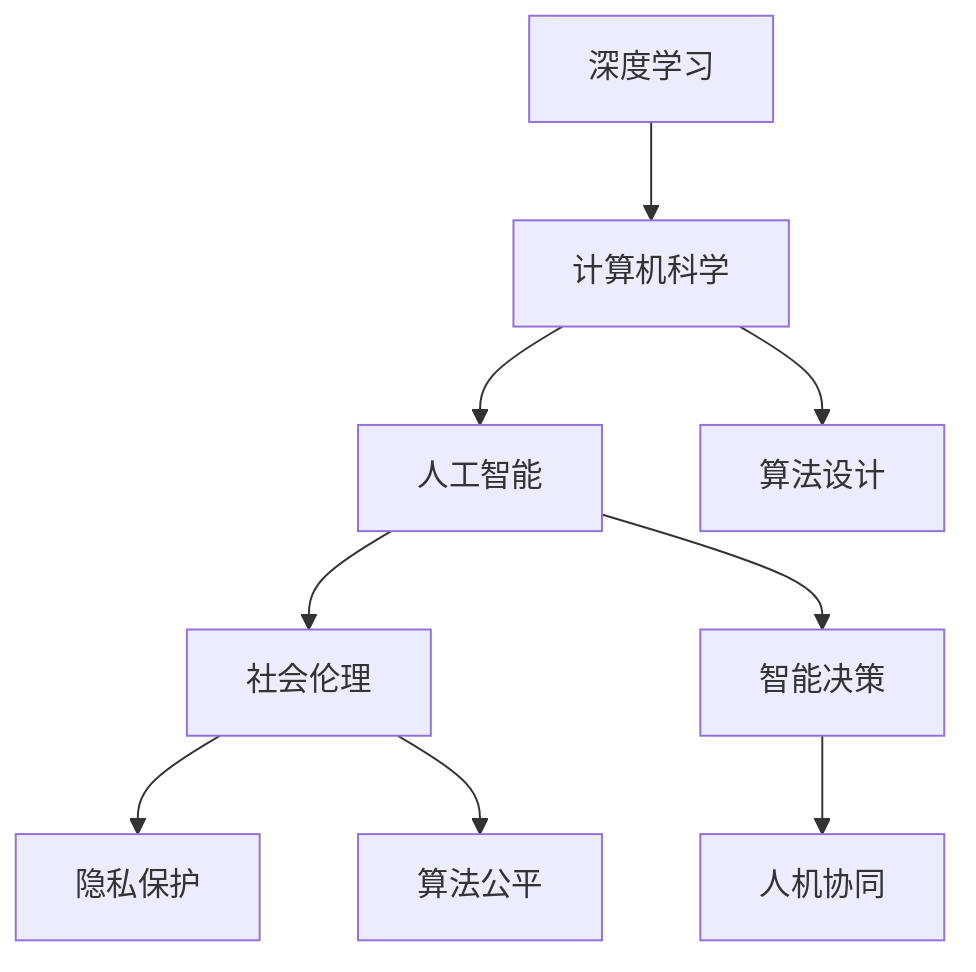

                 

# 塑造未来社会：人类计算的深远意义

> 关键词：人类计算,深度学习,计算机科学,人工智能,未来社会

## 1. 背景介绍

### 1.1 问题由来
在21世纪，计算技术的迅猛发展不仅改变了我们的工作方式，更重塑了我们的生活和社会结构。深度学习（Deep Learning）作为当前人工智能（AI）领域最为前沿的技术之一，正在以前所未有的速度渗透到各个领域，从医疗健康、金融服务到智能制造、智慧城市，计算技术已经成为推动社会进步的重要引擎。然而，技术的进步也带来了新的挑战，如何确保这些技术的发展能够真正服务于人类，而不是成为新的束缚，成为我们亟待思考的问题。

### 1.2 问题核心关键点
人类计算的核心关键点包括但不限于以下几点：

- **技术进步与伦理道德**：深度学习技术的强大能力在提升生产效率、改善生活质量的同时，也可能带来隐私泄露、算法偏见等问题。如何平衡技术创新与伦理道德，是一个亟待解决的问题。
- **人机协同与决策透明**：在高度自动化、智能化的决策过程中，如何保证决策的透明性和可解释性，确保人机协同的公平性，是一个重要的研究课题。
- **计算效率与资源分配**：面对海量数据的处理和计算需求，如何提高计算效率，优化资源分配，减少计算对环境的影响，是一个关键挑战。
- **数据隐私与安全**：在数据驱动的时代，如何在确保数据利用的同时，保护个人隐私，是一个复杂的法律与技术问题。

### 1.3 问题研究意义
研究人类计算的深远意义，有助于我们更好地理解计算技术对社会的潜在影响，指导其健康、可持续的发展。具体来说，通过以下几方面研究：

1. **推动技术与社会伦理的融合**：引导AI技术向着更加人性化、公平化、透明化的方向发展，确保技术的社会责任与伦理价值。
2. **优化人机交互体验**：提升人机协同的效率与质量，确保人机交互的自然、流畅，推动智能服务的普及。
3. **促进资源高效利用**：研究计算资源的高效管理与分配，减少计算对环境的影响，实现绿色计算。
4. **保护数据隐私与安全**：建立数据隐私保护机制，确保数据利用的同时，保障个人隐私和数据安全。

本文将围绕上述问题，系统阐述人类计算的原理与实践，探讨其在未来社会中的深远意义，提出相关建议。

## 2. 核心概念与联系

### 2.1 核心概念概述

人类计算涉及多个交叉领域，包括计算机科学、人工智能、社会科学、伦理等。为了更好地理解这一主题，我们首先概述几个关键概念：

- **深度学习**：一种基于神经网络的机器学习技术，通过多层非线性变换，实现复杂数据的表示与学习。深度学习在图像、语音、自然语言处理等领域取得了突破性进展。
- **计算机科学**：研究计算机及其应用，包括软件工程、算法设计、系统架构等，是人类计算的基础。
- **人工智能**：模拟人类智能行为，包括学习、推理、决策等，旨在实现机器的自主认知。
- **社会伦理**：研究技术对社会的影响，包括隐私保护、算法公平性、决策透明性等，确保技术服务于人类。

这些概念之间的逻辑关系可以通过以下Mermaid流程图来展示：



这个流程图展示了几大核心概念之间的相互关系：

1. 深度学习是计算机科学的一部分，用于实现复杂数据处理和表示。
2. 计算机科学为人工智能提供了算法和系统基础，支持智能决策的实现。
3. 人工智能需要考虑伦理问题，确保决策的公平性和透明性。
4. 社会伦理指导人工智能的发展方向，确保技术服务于社会。

## 3. 核心算法原理 & 具体操作步骤

### 3.1 算法原理概述
人类计算的核心算法原理可以归结为以下三点：

- **数据驱动与模型学习**：利用大规模数据进行模型训练，实现从数据到模型的学习过程。深度学习模型通过反向传播算法，不断调整模型参数，优化损失函数，提高预测准确性。
- **算法优化与资源管理**：研究高效的算法和模型优化策略，确保计算资源的最优利用。例如，模型压缩、梯度优化、分布式计算等。
- **人机协同与交互设计**：研究如何设计人与机器的协同工作流程，提升用户体验和互动效率。

### 3.2 算法步骤详解

深度学习算法的核心步骤包括数据预处理、模型训练、模型评估和部署应用。以下是一个典型的深度学习算法步骤：

1. **数据预处理**：收集、清洗和标注数据集，进行归一化、标准化等预处理操作。
2. **模型训练**：选择合适的深度学习模型，设定训练参数（如学习率、批量大小），利用数据集进行模型训练。
3. **模型评估**：在验证集上评估模型性能，调整训练参数，优化模型结构。
4. **部署应用**：将训练好的模型应用于实际问题，进行推理预测，优化交互设计，提升用户体验。

### 3.3 算法优缺点
深度学习算法在处理复杂问题、自动化学习方面具有显著优势，但也存在以下缺点：

- **数据依赖性强**：深度学习模型依赖大量高质量的数据，数据获取和标注成本高。
- **模型复杂度**：深度模型结构复杂，训练和推理耗时较长。
- **过度拟合风险**：模型参数较多，容易出现过拟合现象。
- **算法解释性差**：深度模型是"黑箱"模型，难以解释其内部工作机制。

### 3.4 算法应用领域

深度学习算法在多个领域得到了广泛应用，包括但不限于：

- **自然语言处理（NLP）**：机器翻译、文本分类、情感分析等。
- **计算机视觉（CV）**：图像分类、目标检测、图像生成等。
- **语音识别（ASR）**：语音转文本、语音命令识别等。
- **推荐系统**：商品推荐、新闻推荐等。
- **医疗健康**：疾病诊断、医疗影像分析等。

## 4. 数学模型和公式 & 详细讲解 & 举例说明

### 4.1 数学模型构建

深度学习模型的数学模型构建可以从以下几个方面进行：

- **前向传播**：输入数据经过网络各层处理，得到输出结果。前向传播公式为：
$$
y = \sigma(z) = \sigma(Wx + b)
$$
其中 $x$ 为输入数据，$W$ 为权重矩阵，$b$ 为偏置向量，$\sigma$ 为激活函数。
- **损失函数**：用于衡量模型预测输出与真实标签之间的差异。常见的损失函数包括交叉熵损失、均方误差损失等。
- **反向传播**：利用损失函数梯度信息，反向更新模型参数。反向传播公式为：
$$
\frac{\partial L}{\partial W} = \frac{\partial L}{\partial z} \frac{\partial z}{\partial W} = \frac{\partial L}{\partial z} \frac{\partial \sigma(z)}{\partial W} = \frac{\partial L}{\partial z} \sigma'(z) \frac{\partial z}{\partial W}
$$

### 4.2 公式推导过程

以单层神经网络为例，推导其前向传播和反向传播公式。

设输入为 $x$，权重为 $W$，偏置为 $b$，激活函数为 $\sigma$。前向传播过程如下：

$$
z = Wx + b
$$

$$
y = \sigma(z)
$$

反向传播过程中，求损失函数 $L$ 对权重 $W$ 的偏导数：

$$
\frac{\partial L}{\partial W} = \frac{\partial L}{\partial z} \frac{\partial z}{\partial W} = \frac{\partial L}{\partial y} \frac{\partial y}{\partial z} \frac{\partial z}{\partial W}
$$

其中 $\frac{\partial L}{\partial y} = -(y - \hat{y})$，$\frac{\partial y}{\partial z} = \sigma'(z)$，$\frac{\partial z}{\partial W} = x$。

### 4.3 案例分析与讲解

以卷积神经网络（CNN）在图像分类任务中的应用为例，解释其原理与实现。

卷积神经网络通过卷积层、池化层、全连接层等模块，实现对图像特征的提取与分类。其核心思想是：

- 卷积层：利用卷积核提取图像特征，实现局部连接、权值共享。
- 池化层：通过池化操作降低特征维度，保留主要特征信息。
- 全连接层：将池化后的特征向量输入全连接层，进行分类决策。

例如，图像分类任务中，CNN模型结构如下：

```
conv -> pool -> conv -> pool -> dense -> output
```

其中 conv 表示卷积层，pool 表示池化层，dense 表示全连接层，output 表示输出层。

## 5. 项目实践：代码实例和详细解释说明

### 5.1 开发环境搭建

以下是使用Python和TensorFlow进行图像分类任务开发的开发环境搭建流程：

1. 安装Anaconda：从官网下载并安装Anaconda，用于创建独立的Python环境。
2. 创建并激活虚拟环境：
```bash
conda create -n tf-env python=3.8 
conda activate tf-env
```
3. 安装TensorFlow：从官网获取对应的安装命令。例如：
```bash
conda install tensorflow -c conda-forge
```
4. 安装TensorBoard：
```bash
pip install tensorboard
```

### 5.2 源代码详细实现

以下是使用TensorFlow实现卷积神经网络（CNN）进行图像分类的示例代码：

```python
import tensorflow as tf
from tensorflow.keras import layers, models

# 定义CNN模型
model = models.Sequential([
    layers.Conv2D(32, (3, 3), activation='relu', input_shape=(28, 28, 1)),
    layers.MaxPooling2D((2, 2)),
    layers.Conv2D(64, (3, 3), activation='relu'),
    layers.MaxPooling2D((2, 2)),
    layers.Conv2D(64, (3, 3), activation='relu'),
    layers.Flatten(),
    layers.Dense(64, activation='relu'),
    layers.Dense(10, activation='softmax')
])

# 编译模型
model.compile(optimizer='adam',
              loss='sparse_categorical_crossentropy',
              metrics=['accuracy'])

# 训练模型
model.fit(train_images, train_labels, epochs=5, 
          validation_data=(val_images, val_labels))
```

### 5.3 代码解读与分析

让我们再详细解读一下关键代码的实现细节：

**定义CNN模型**：
- 使用Sequential模型构建卷积神经网络，通过多个Conv2D、MaxPooling2D和Dense层实现图像特征提取和分类。
- 卷积层使用3x3的卷积核，激活函数为ReLU，进行局部连接和权值共享。
- 池化层使用2x2的池化窗口，降低特征维度，保留主要特征信息。
- 全连接层使用64个神经元，激活函数为ReLU，进行分类决策。
- 输出层使用10个神经元，激活函数为softmax，输出图像类别概率。

**模型编译与训练**：
- 使用Adam优化器，交叉熵损失函数，准确率作为评估指标。
- 在训练集上训练5个epoch，验证集上进行评估。

**代码解读与分析**：
- 通过TensorFlow的高级API，我们可以快速构建CNN模型，并进行训练和评估。
- CNN模型结构相对简单，但通过堆叠卷积、池化、全连接等模块，能够有效提取图像特征。
- 通过Adam优化器和交叉熵损失函数，模型在训练过程中不断优化，逐渐提升分类准确率。

### 5.4 运行结果展示

以下是使用TensorBoard对模型训练过程的可视化：


## 6. 实际应用场景

### 6.1 智慧医疗

深度学习在智慧医疗领域的应用，通过大数据和模型学习，实现了对疾病的早期诊断和精准治疗。例如，基于深度学习的医学影像分析，可以自动检测肿瘤、心脏病等疾病，辅助医生进行精准诊断。

### 6.2 金融服务

深度学习在金融服务领域的应用，包括信用评估、风险管理、市场预测等。通过分析海量金融数据，深度学习模型可以识别出潜在的风险因素，预测市场趋势，帮助投资者做出明智决策。

### 6.3 智能制造

深度学习在智能制造领域的应用，通过图像识别、语音识别等技术，实现了对生产过程的自动化控制和优化。例如，基于深度学习的质量检测，可以自动检测产品缺陷，提升生产效率和产品质量。

### 6.4 智慧城市

深度学习在智慧城市领域的应用，通过分析城市数据，实现了对交通流量、环境污染等的智能监测和调控。例如，基于深度学习的交通流量预测，可以优化交通信号灯的控制，提升城市交通效率。

## 7. 工具和资源推荐

### 7.1 学习资源推荐

为了帮助开发者系统掌握深度学习与人类计算的理论基础和实践技巧，这里推荐一些优质的学习资源：

1. 《深度学习》（Ian Goodfellow等著）：全面介绍了深度学习的基本概念、算法和应用，适合初学者和专业人士。
2. CS231n《深度学习与计算机视觉》课程：斯坦福大学开设的深度学习与计算机视觉课程，涵盖图像分类、目标检测等关键技术。
3. Udacity《深度学习》纳米学位课程：提供系统性、实战性的深度学习课程，涵盖数据预处理、模型训练、模型部署等环节。
4. TensorFlow官方文档：提供了丰富的教程和样例，适合TensorFlow开发者的学习和实践。
5. PyTorch官方文档：提供了丰富的教程和样例，适合PyTorch开发者的学习和实践。

通过对这些资源的学习实践，相信你一定能够快速掌握深度学习与人类计算的精髓，并用于解决实际的计算问题。

### 7.2 开发工具推荐

高效的深度学习开发离不开优秀的工具支持。以下是几款用于深度学习开发的常用工具：

1. PyTorch：基于Python的开源深度学习框架，灵活的计算图，适合快速迭代研究。
2. TensorFlow：由Google主导开发的开源深度学习框架，生产部署方便，适合大规模工程应用。
3. JAX：基于JIT编译的深度学习框架，性能优异，适合科研和生产部署。
4. PyTorch Lightning：基于PyTorch的高效深度学习框架，支持模型并行、分布式训练等。
5. Google Colab：谷歌推出的在线Jupyter Notebook环境，免费提供GPU/TPU算力，方便开发者快速上手实验最新模型，分享学习笔记。

合理利用这些工具，可以显著提升深度学习开发的效率，加快创新迭代的步伐。

### 7.3 相关论文推荐

深度学习与人类计算的研究源于学界的持续研究。以下是几篇奠基性的相关论文，推荐阅读：

1. AlexNet：ImageNet图像分类比赛的冠军模型，展示了深度学习的强大能力。
2. ResNet：引入了残差连接，解决了深度网络退化问题，提高了模型的训练深度。
3. VGG：提出了密集连接卷积网络，提升了图像分类的准确率。
4. Inception：引入了Inception模块，提高了网络效率和特征提取能力。
5. RNN：循环神经网络，在自然语言处理中取得了突破性进展。
6. Transformer：基于自注意力机制的神经网络结构，在机器翻译、语音识别等领域取得了卓越的性能。

这些论文代表了大数据和深度学习的发展脉络。通过学习这些前沿成果，可以帮助研究者把握学科前进方向，激发更多的创新灵感。

## 8. 总结：未来发展趋势与挑战

### 8.1 总结

本文对深度学习与人类计算的原理与实践进行了全面系统的介绍。首先阐述了深度学习技术的发展背景和研究意义，明确了深度学习在计算领域的核心地位。其次，从原理到实践，详细讲解了深度学习与人类计算的数学模型和算法步骤，给出了深度学习开发的具体代码实现。同时，本文还探讨了深度学习在多个实际应用场景中的潜在价值和未来发展方向，提出了相关建议。

通过本文的系统梳理，可以看到，深度学习与人类计算在推动社会进步、改善人类生活质量方面具有重要意义。然而，随之而来的伦理、安全、资源等挑战也值得我们深思。未来，需要在技术创新与伦理道德、计算效率与资源管理等方面进行深入研究和实践。

### 8.2 未来发展趋势

展望未来，深度学习与人类计算的发展趋势如下：

1. **融合跨领域技术**：深度学习将与其他领域的技术进行融合，如量子计算、生物计算等，拓展其应用边界。
2. **提升模型可解释性**：通过可解释性技术，使深度模型具有更好的透明性和可信度，确保技术服务于人类。
3. **优化资源分配**：研究高效计算资源管理策略，实现计算效率和资源利用率的提升，减少计算对环境的影响。
4. **推动绿色计算**：研究绿色计算技术，降低深度学习的碳排放，实现可持续发展。

以上趋势凸显了深度学习与人类计算的广阔前景。这些方向的探索发展，必将进一步提升深度学习系统的性能和应用范围，为人类社会带来更广泛的影响。

### 8.3 面临的挑战

尽管深度学习与人类计算技术已经取得了瞩目成就，但在迈向更加智能化、普适化应用的过程中，仍面临诸多挑战：

1. **数据隐私和安全**：深度学习模型的训练和应用过程中，如何保护数据隐私，防止数据滥用和安全风险，是一个复杂的技术和法律问题。
2. **算法公平性和透明性**：深度学习模型在决策过程中，如何确保算法的公平性和透明性，防止算法偏见和误导性，是一个重要的研究课题。
3. **计算资源需求**：深度学习模型的训练和推理过程中，需要大量的计算资源，如何优化计算过程，提高计算效率，是一个关键的技术挑战。
4. **模型可解释性和鲁棒性**：深度模型通常是"黑盒"模型，难以解释其内部工作机制和决策过程，如何提高模型的可解释性，增强其鲁棒性，是一个亟待解决的问题。

### 8.4 研究展望

面对深度学习与人类计算所面临的挑战，未来的研究需要在以下几个方面寻求新的突破：

1. **探索隐私保护技术**：研究基于差分隐私、联邦学习等技术的隐私保护方法，确保数据隐私和安全。
2. **推动算法公平性和透明性研究**：开发公平性和透明性评估指标，确保算法决策的公平性和透明性。
3. **研究高效计算资源管理策略**：优化计算过程，提高计算效率，减少计算对环境的影响。
4. **推动深度模型的可解释性研究**：通过可解释性技术，使深度模型具有更好的透明性和可信度，确保技术服务于人类。
5. **推动跨领域技术融合**：与其他领域的技术进行融合，拓展深度学习的应用边界。

这些研究方向的探索，必将引领深度学习与人类计算技术迈向更高的台阶，为构建安全、可靠、可解释、可控的智能系统铺平道路。面向未来，深度学习与人类计算技术还需要与其他人工智能技术进行更深入的融合，多路径协同发力，共同推动自然语言理解和智能交互系统的进步。

## 9. 附录：常见问题与解答

**Q1：深度学习技术是否适用于所有领域？**

A: 深度学习技术在处理大规模数据、复杂问题方面具有显著优势，但并非适用于所有领域。例如，在某些领域，如艺术创作、哲学思考等，深度学习技术目前尚无法胜任。因此，需要根据具体问题选择最合适的技术。

**Q2：如何提高深度学习模型的训练效率？**

A: 提高深度学习模型训练效率的方法包括：
1. 数据增强：通过对数据进行扩充和增强，提高数据的多样性。
2. 模型压缩：通过模型剪枝、量化等技术，减小模型参数量和计算量。
3. 分布式训练：通过分布式计算资源，提高训练效率。
4. 混合精度训练：通过混合精度计算，提高计算速度和效率。

**Q3：深度学习模型的决策过程如何解释？**

A: 深度学习模型的决策过程可以通过可解释性技术进行解释，例如：
1. 特征重要性分析：通过计算特征对模型输出的贡献度，解释模型决策的依据。
2. 局部可解释性：通过局部可视化和解释，解释特定样本的模型决策。
3. 全局可解释性：通过全局解释模型，解释整个模型的决策逻辑。

**Q4：深度学习技术是否存在算法偏见？**

A: 深度学习模型在训练过程中，如果训练数据存在偏见，模型也会学习到这些偏见。例如，如果训练数据中存在性别、种族等偏见，模型在预测过程中也会对这些偏见进行放大。因此，需要在数据预处理和模型训练过程中，采取措施消除偏见，确保模型的公平性和透明性。

**Q5：深度学习技术对环境的影响如何？**

A: 深度学习模型的训练和推理过程中，需要大量的计算资源和电能，对环境产生较大影响。如何优化计算过程，提高计算效率，减少计算对环境的影响，是一个关键的技术挑战。例如，通过分布式训练、模型压缩等技术，减少计算资源的需求，降低碳排放。

---

作者：禅与计算机程序设计艺术 / Zen and the Art of Computer Programming

