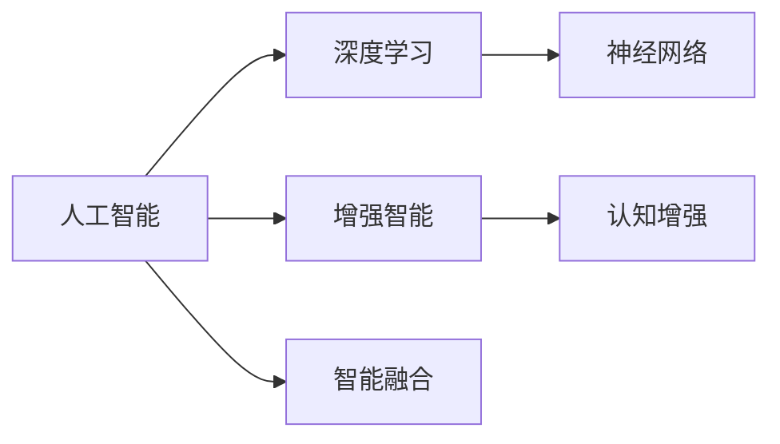

                 

# 增强智能：人机协作，拓展人类认知边界

> 关键词：人工智能, 增强智能, 人机协作, 认知边界, 深度学习, 神经网络, 认知增强, 智能融合

## 1. 背景介绍

### 1.1 问题由来
随着科技的迅猛发展，人类面临的诸多挑战也愈发复杂。从环境治理、能源开发到公共健康、社会治理，无不考验着人类的智慧和能力。而面对这些挑战，传统的人类智慧和认知方式已显得力不从心。在这样的背景下，人工智能(AI)技术应运而生，成为人类社会未来发展的关键驱动力。

AI技术的核心是模拟人脑的运作机制，通过算法和数据训练，使机器能够进行复杂的决策和推理。而其中，“增强智能”这一概念更是将人类智慧与AI技术深度融合，让人类能够借助机器的力量，拓展认知边界，提升问题解决能力。

### 1.2 问题核心关键点
“增强智能”是指在人类与AI的协作过程中，通过AI的深度学习、数据处理和决策支持，极大提升人类对复杂问题理解和解决的能力。这种协作不仅在科技领域具有重要价值，也在社会治理、公共服务、医疗健康等各个领域展现了广阔的应用前景。

核心关键点包括：
- **人机协作**：AI与人类协同工作，共同完成复杂任务。
- **认知边界拓展**：利用AI技术，使人类能够处理更复杂、更庞大的数据，超越传统认知能力的限制。
- **深度学习与神经网络**：核心技术支持，使AI具备强大的数据处理和推理能力。
- **认知增强**：通过AI提升人类思考、决策和执行的能力。
- **智能融合**：跨学科、跨领域的融合创新，推动AI技术与人类智慧的深度融合。

## 2. 核心概念与联系

### 2.1 核心概念概述

“增强智能”涉及的核心概念包括但不限于：

- **人工智能(AI)**：使计算机系统能够执行通常需要人类智能的任务，如学习、推理、解决问题等。
- **深度学习(Deep Learning)**：基于多层神经网络结构的学习方式，能够处理高度复杂的数据和模式识别问题。
- **神经网络(Neural Network)**：受人脑神经网络启发，通过节点和边进行信息处理和计算，是实现深度学习的基础。
- **增强智能**：通过AI技术增强人类认知能力，使人类能够处理更复杂、更高效的问题。
- **认知增强**：利用AI提升人类思考、学习、决策等方面的能力，弥补人类认知的局限。
- **智能融合**：将AI技术与各领域知识、技能进行深度融合，实现跨领域的创新应用。

### 2.2 核心概念原理和架构的 Mermaid 流程图



这个流程图展示了“增强智能”的核心概念及其相互关系：

1. 人工智能(AI)是基础，深度学习(Deep Learning)是核心技术手段。
2. 神经网络(Neural Network)是实现深度学习的基础结构。
3. 增强智能(Enhanced Intelligence)通过AI技术提升人类认知能力。
4. 认知增强(Cognitive Enhancement)是增强智能的具体实现。
5. 智能融合(Intelligence Integration)推动各领域知识的深度融合。

## 3. 核心算法原理 & 具体操作步骤

### 3.1 算法原理概述

增强智能的实现主要依赖于深度学习和神经网络技术，通过多层神经网络对输入数据进行处理，提取特征，进行模式识别和决策。核心算法包括但不限于：

- **反向传播(Backpropagation)**：通过梯度下降等优化算法，反向传播误差，更新网络参数，优化模型性能。
- **卷积神经网络(Convolutional Neural Networks, CNN)**：在图像识别、语音识别等领域，通过卷积操作提取局部特征。
- **循环神经网络(Recurrent Neural Networks, RNN)**：在自然语言处理、时间序列预测等领域，通过时间序列信息进行学习和预测。
- **长短期记忆网络(Long Short-Term Memory, LSTM)**：一种特殊形式的RNN，能够有效处理长期依赖问题。
- **注意力机制(Attention Mechanism)**：在处理序列数据时，通过注意力机制聚焦于关键部分，提升模型性能。

### 3.2 算法步骤详解

“增强智能”的实现一般包括以下几个关键步骤：

**Step 1: 数据准备**
- 收集和清洗数据，确保数据的质量和多样性。
- 数据预处理，包括归一化、标准化、特征提取等步骤。

**Step 2: 模型设计**
- 选择适合的深度学习模型架构，如CNN、RNN、LSTM等。
- 设计模型的输入、输出和隐藏层结构。
- 选择合适的激活函数、损失函数、优化器等。

**Step 3: 模型训练**
- 使用训练集数据，进行前向传播和反向传播，更新模型参数。
- 在验证集上监控模型性能，防止过拟合。
- 使用梯度累积、混合精度训练等技术提升训练效率。

**Step 4: 模型评估**
- 在测试集上评估模型性能，使用准确率、召回率、F1分数等指标。
- 进行模型调参，如学习率、批大小等，优化模型表现。
- 使用对抗样本、模型融合等技术提升模型鲁棒性和泛化能力。

**Step 5: 部署与应用**
- 将模型部署到生产环境，实现实时推理。
- 集成到应用系统中，实现智能决策和推理。
- 持续监测模型性能，进行定期更新和优化。

### 3.3 算法优缺点

增强智能具有以下优点：
1. **高效处理复杂任务**：通过深度学习技术，能够高效处理大规模数据和复杂模式识别问题。
2. **提升决策质量**：利用神经网络进行决策，结合人类的逻辑推理，提升决策的准确性和效率。
3. **跨领域应用广泛**：增强智能技术在医疗、金融、教育等领域具有广泛的应用前景。
4. **实现人机协作**：通过智能融合技术，使人类能够与AI协同工作，提升问题解决能力。

同时，增强智能也存在以下缺点：
1. **模型依赖数据**：深度学习模型的性能高度依赖于数据质量和数量，数据采集和处理成本较高。
2. **模型黑箱问题**：神经网络模型的决策过程不透明，难以解释和调试。
3. **资源消耗大**：深度学习模型需要大量的计算资源和时间，对硬件要求较高。
4. **过拟合风险**：在数据不足的情况下，容易发生过拟合，导致模型泛化能力不足。
5. **伦理和安全问题**：AI模型的决策可能存在偏见和错误，影响公平性和安全性。

尽管存在这些局限性，但增强智能的潜在价值和应用前景不可忽视。未来需要在算法优化、模型透明性、资源优化和伦理保障等方面进一步突破，推动其向更加成熟和广泛的应用发展。

### 3.4 算法应用领域

增强智能技术已经在多个领域得到应用，以下是一些典型场景：

**医疗健康**：
- **疾病诊断**：利用深度学习技术，通过分析医学影像、病历数据等，辅助医生进行疾病诊断和治疗决策。
- **健康监测**：通过可穿戴设备采集的健康数据，利用AI进行分析和预测，提供个性化的健康管理方案。

**金融服务**：
- **风险评估**：利用AI技术，分析海量金融数据，预测市场趋势和风险，提供投资建议。
- **欺诈检测**：通过机器学习技术，实时监控交易行为，检测并预防金融欺诈。

**智能制造**：
- **质量控制**：利用AI进行质量检测和缺陷分析，提升产品质量和生产效率。
- **供应链管理**：通过AI进行需求预测和库存管理，优化供应链流程，降低成本。

**教育培训**：
- **个性化学习**：利用AI技术，根据学生的学习数据，提供个性化的学习计划和资源推荐。
- **智能辅导**：通过自然语言处理技术，提供智能化的学习辅导和答疑服务。

**环境保护**：
- **环境监测**：利用AI技术，分析环境数据，预测环境变化，提供决策支持。
- **资源管理**：通过AI优化资源配置，提高资源利用效率，保护环境。

**智慧城市**：
- **交通管理**：通过AI技术，实时监控交通流量，优化交通管理方案，减少拥堵。
- **公共安全**：利用AI进行视频监控、异常行为检测等，提升公共安全水平。

以上应用场景展示了增强智能技术的强大潜力和广泛应用前景，未来随着技术的不断进步，其应用领域将更加丰富多样。

## 4. 数学模型和公式 & 详细讲解 & 举例说明

### 4.1 数学模型构建

“增强智能”的实现主要依赖于深度学习和神经网络技术，以下以一个简单的卷积神经网络(CNN)模型为例，介绍数学模型的构建过程。

假设输入数据为 $x_i \in \mathbb{R}^{n}$，输出数据为 $y_i \in \mathbb{R}^{m}$。一个基本的卷积神经网络模型由多个卷积层和全连接层组成。其结构可以表示为：

$$
f(x_i; \theta) = \text{softmax}(W^T h_2 + b_2)
$$

其中 $W$ 和 $b$ 为模型参数，$h_2$ 为隐藏层输出，$\text{softmax}$ 为激活函数。

### 4.2 公式推导过程

以一个简单的卷积神经网络为例，进行公式推导。

假设输入数据为 $x_i \in \mathbb{R}^{n}$，输出数据为 $y_i \in \mathbb{R}^{m}$。一个基本的卷积神经网络模型由多个卷积层和全连接层组成。其结构可以表示为：

$$
f(x_i; \theta) = \text{softmax}(W^T h_2 + b_2)
$$

其中 $W$ 和 $b$ 为模型参数，$h_2$ 为隐藏层输出，$\text{softmax}$ 为激活函数。

1. **前向传播**：
   - **卷积层**：
     \begin{aligned}
     h_1 &= \sigma(W_1 x_i + b_1) \\
     y_1 &= \max(0, x_i * W_2 - b_2)
     \end{aligned}
   - **全连接层**：
     \begin{aligned}
     h_2 &= \sigma(W_2 y_1 + b_2) \\
     y_2 &= \text{softmax}(W_3 h_2 + b_3)
     \end{aligned}

   其中 $\sigma$ 为激活函数，$*$ 表示卷积操作，$W$ 和 $b$ 为模型参数。

2. **损失函数**：
   - 常用的损失函数包括交叉熵损失和均方误差损失等。以交叉熵损失为例，可以表示为：
     \begin{aligned}
     L &= \frac{1}{N} \sum_{i=1}^N (-y_i \log \hat{y_i} - (1-y_i) \log (1-\hat{y_i}))
     \end{aligned}

3. **反向传播**：
   - 使用梯度下降等优化算法，反向传播误差，更新模型参数。公式可以表示为：
     \begin{aligned}
     \frac{\partial L}{\partial W_j} &= \frac{1}{N} \sum_{i=1}^N (y_i - \hat{y_i}) \frac{\partial \hat{y_i}}{\partial W_j} \\
     \frac{\partial L}{\partial b_j} &= \frac{1}{N} \sum_{i=1}^N (y_i - \hat{y_i}) \frac{\partial \hat{y_i}}{\partial b_j}
     \end{aligned}

### 4.3 案例分析与讲解

以一个医疗影像分类任务为例，介绍增强智能技术的具体应用。

- **数据准备**：收集医疗影像数据集，进行数据清洗和预处理。
- **模型设计**：选择卷积神经网络模型，设计输入、输出和隐藏层结构。
- **模型训练**：使用训练集数据，进行前向传播和反向传播，更新模型参数。
- **模型评估**：在测试集上评估模型性能，调整模型参数，提升模型表现。
- **模型应用**：将模型部署到医疗系统中，辅助医生进行疾病诊断和治疗决策。

## 5. 项目实践：代码实例和详细解释说明

### 5.1 开发环境搭建

在进行增强智能项目开发前，我们需要准备好开发环境。以下是使用Python进行TensorFlow开发的环境配置流程：

1. 安装Anaconda：从官网下载并安装Anaconda，用于创建独立的Python环境。

2. 创建并激活虚拟环境：
```bash
conda create -n tf-env python=3.8 
conda activate tf-env
```

3. 安装TensorFlow：根据CUDA版本，从官网获取对应的安装命令。例如：
```bash
conda install tensorflow -c conda-forge
```

4. 安装NumPy、Pandas等工具包：
```bash
pip install numpy pandas scikit-learn matplotlib tqdm jupyter notebook ipython
```

完成上述步骤后，即可在`tf-env`环境中开始增强智能项目开发。

### 5.2 源代码详细实现

下面我以一个简单的图像分类任务为例，给出使用TensorFlow实现卷积神经网络的代码实现。

首先，定义数据处理函数：

```python
import tensorflow as tf
import numpy as np
import matplotlib.pyplot as plt

# 定义数据处理函数
def load_data():
    # 加载数据集
    train_images = ...
    train_labels = ...
    test_images = ...
    test_labels = ...
    
    # 归一化处理
    train_images = train_images / 255.0
    test_images = test_images / 255.0
    
    return train_images, train_labels, test_images, test_labels

# 加载数据集
train_images, train_labels, test_images, test_labels = load_data()

# 显示部分样本
plt.figure(figsize=(10, 10))
for i in range(4):
    plt.subplot(2, 2, i+1)
    plt.imshow(train_images[i], cmap='gray')
    plt.title(str(train_labels[i]))
plt.show()
```

然后，定义模型结构：

```python
# 定义模型结构
class CNNModel(tf.keras.Model):
    def __init__(self):
        super(CNNModel, self).__init__()
        self.conv1 = tf.keras.layers.Conv2D(32, (3, 3), activation='relu')
        self.maxpool = tf.keras.layers.MaxPooling2D((2, 2))
        self.conv2 = tf.keras.layers.Conv2D(64, (3, 3), activation='relu')
        self.maxpool2 = tf.keras.layers.MaxPooling2D((2, 2))
        self.flatten = tf.keras.layers.Flatten()
        self.fc1 = tf.keras.layers.Dense(512, activation='relu')
        self.fc2 = tf.keras.layers.Dense(10, activation='softmax')
    
    def call(self, x):
        x = self.conv1(x)
        x = self.maxpool(x)
        x = self.conv2(x)
        x = self.maxpool2(x)
        x = self.flatten(x)
        x = self.fc1(x)
        x = self.fc2(x)
        return x

# 创建模型实例
model = CNNModel()
model.summary()
```

接着，定义训练和评估函数：

```python
# 定义训练函数
def train_model(model, train_images, train_labels, epochs, batch_size):
    train_dataset = tf.data.Dataset.from_tensor_slices((train_images, train_labels))
    train_dataset = train_dataset.batch(batch_size).shuffle(1024).repeat()
    
    optimizer = tf.keras.optimizers.Adam(learning_rate=0.001)
    loss_fn = tf.keras.losses.SparseCategoricalCrossentropy(from_logits=True)
    metrics = [tf.keras.metrics.SparseCategoricalAccuracy()]

    for epoch in range(epochs):
        for batch, (x, y) in enumerate(train_dataset):
            with tf.GradientTape() as tape:
                logits = model(x, training=True)
                loss_value = loss_fn(y, logits)
            grads = tape.gradient(loss_value, model.trainable_variables)
            optimizer.apply_gradients(zip(grads, model.trainable_variables))
            
            if batch % 100 == 0:
                print("Epoch {}, Batch {}, Loss: {:.4f}, Accuracy: {:.4f}".format(epoch, batch, loss_value, metrics[0].result()))

# 定义评估函数
def evaluate_model(model, test_images, test_labels):
    test_dataset = tf.data.Dataset.from_tensor_slices((test_images, test_labels))
    test_dataset = test_dataset.batch(128).shuffle(1024).repeat()
    
    test_loss, test_acc = model.evaluate(test_dataset, verbose=2)
    print('Test accuracy:', test_acc)
    
# 训练模型
train_model(model, train_images, train_labels, epochs=10, batch_size=64)

# 评估模型
evaluate_model(model, test_images, test_labels)
```

最后，启动训练流程并在测试集上评估：

```python
# 训练模型
train_model(model, train_images, train_labels, epochs=10, batch_size=64)

# 评估模型
evaluate_model(model, test_images, test_labels)
```

以上就是使用TensorFlow实现卷积神经网络进行图像分类的完整代码实现。可以看到，TensorFlow提供了强大的高级API，使得神经网络模型的设计和训练变得简单高效。

### 5.3 代码解读与分析

让我们再详细解读一下关键代码的实现细节：

**load_data函数**：
- 定义数据加载和预处理函数，包括加载数据集、归一化处理等步骤。

**CNNModel类**：
- 定义卷积神经网络模型，包括卷积层、池化层、全连接层等组件。
- 使用`call`方法，实现前向传播的计算过程。

**train_model函数**：
- 使用TensorFlow的高级API，实现模型的训练过程。
- 定义优化器、损失函数和评估指标。
- 在每个epoch内，对模型进行批量训练，并输出训练状态。

**evaluate_model函数**：
- 使用TensorFlow的高级API，实现模型的评估过程。
- 在测试集上评估模型的性能指标。

**训练流程**：
- 定义总的epoch数和batch size，开始循环迭代
- 每个epoch内，在训练集上进行批量训练，并输出训练状态
- 在测试集上评估模型性能
- 所有epoch结束后，评估模型在测试集上的表现

可以看到，TensorFlow的高级API使得神经网络模型的设计和训练变得简洁高效。开发者可以将更多精力放在数据处理、模型改进等高层逻辑上，而不必过多关注底层的实现细节。

当然，工业级的系统实现还需考虑更多因素，如模型的保存和部署、超参数的自动搜索、更灵活的任务适配层等。但核心的增强智能范式基本与此类似。

## 6. 实际应用场景

### 6.1 智能医疗

在医疗领域，增强智能技术已经被广泛应用于疾病诊断、治疗方案推荐、健康管理等多个方面。通过深度学习和神经网络技术，医疗影像、病历数据等可以被高效处理和分析，提供个性化的医疗建议和服务。

例如，利用增强智能技术，医生可以在短时间内分析大量医学影像，快速诊断肿瘤、骨折等疾病。同时，通过智能推荐系统，可以为患者提供个性化的治疗方案和健康管理计划，提升治疗效果和生活质量。

### 6.2 金融风控

在金融领域，增强智能技术也被广泛应用于风险评估、欺诈检测、投资建议等多个方面。通过深度学习和神经网络技术，可以实时监控和分析海量金融数据，预测市场趋势和风险，提供决策支持。

例如，利用增强智能技术，金融机构可以实时监控交易行为，检测并预防金融欺诈。同时，通过智能推荐系统，可以为投资者提供个性化的投资建议和风险预警，提升投资回报率。

### 6.3 智能制造

在制造业领域，增强智能技术已经被广泛应用于质量控制、供应链管理等多个方面。通过深度学习和神经网络技术，可以实时监控和分析生产过程中的数据，优化生产流程，提升产品质量和生产效率。

例如，利用增强智能技术，可以通过图像识别和模式识别技术，实时监控生产过程中的缺陷和质量问题，提供即时反馈和优化建议。同时，通过智能调度系统，可以实现供应链的优化管理，降低成本，提高效率。

### 6.4 教育培训

在教育领域，增强智能技术已经被广泛应用于个性化学习、智能辅导等多个方面。通过深度学习和神经网络技术，可以为学生提供个性化的学习资源和辅导服务，提升学习效果和教学质量。

例如，利用增强智能技术，可以根据学生的学习数据，提供个性化的学习计划和资源推荐。同时，通过智能辅导系统，可以为学生提供实时的答疑和辅导服务，提升学习体验和效果。

### 6.5 智慧城市

在城市治理领域，增强智能技术已经被广泛应用于交通管理、公共安全等多个方面。通过深度学习和神经网络技术，可以实现智能化的城市管理，提升公共安全和效率。

例如，利用增强智能技术，可以实时监控交通流量，优化交通管理方案，减少拥堵。同时，通过智能监控系统，可以实现异常行为检测和预警，提升公共安全水平。

## 7. 工具和资源推荐

### 7.1 学习资源推荐

为了帮助开发者系统掌握增强智能的理论基础和实践技巧，这里推荐一些优质的学习资源：

1. 《深度学习》系列博文：由大模型技术专家撰写，深入浅出地介绍了深度学习原理、神经网络结构、优化算法等基础知识。

2. CS231n《卷积神经网络和视觉识别》课程：斯坦福大学开设的计算机视觉明星课程，有Lecture视频和配套作业，是入门计算机视觉的重要资源。

3. 《深度学习与神经网络》书籍：全面介绍了深度学习的基本概念和应用，包括卷积神经网络、循环神经网络等。

4. TensorFlow官方文档：TensorFlow的官方文档，提供了详细的API使用指南和案例代码，是上手实践的必备资料。

5. PyTorch官方文档：PyTorch的官方文档，提供了丰富的深度学习模型和算法实现，适合进行模型设计和优化。

通过对这些资源的学习实践，相信你一定能够快速掌握增强智能的理论基础和实践技巧，并用于解决实际的NLP问题。

### 7.2 开发工具推荐

高效的开发离不开优秀的工具支持。以下是几款用于增强智能开发的常用工具：

1. TensorFlow：由Google主导开发的开源深度学习框架，生产部署方便，适合大规模工程应用。

2. PyTorch：基于Python的开源深度学习框架，灵活动态的计算图，适合快速迭代研究。

3. Keras：高级神经网络API，基于TensorFlow和Theano，使用简单，易于上手。

4. Weights & Biases：模型训练的实验跟踪工具，可以记录和可视化模型训练过程中的各项指标，方便对比和调优。

5. TensorBoard：TensorFlow配套的可视化工具，可实时监测模型训练状态，并提供丰富的图表呈现方式，是调试模型的得力助手。

6. Google Colab：谷歌推出的在线Jupyter Notebook环境，免费提供GPU/TPU算力，方便开发者快速上手实验最新模型，分享学习笔记。

合理利用这些工具，可以显著提升增强智能项目的开发效率，加快创新迭代的步伐。

### 7.3 相关论文推荐

增强智能技术的发展源于学界的持续研究。以下是几篇奠基性的相关论文，推荐阅读：

1. AlexNet: ImageNet Classification with Deep Convolutional Neural Networks：提出卷积神经网络，开启了深度学习在图像识别领域的应用。

2. RNN: A Tutorial on Recurrent Neural Networks for Natural Language Processing：介绍循环神经网络在自然语言处理中的应用，奠定了RNN在NLP领域的基础。

3. LSTM: Long Short-Term Memory：提出长短期记忆网络，解决RNN在长期依赖问题上的不足。

4. CNN: Convolutional Neural Networks for Sentence Classification：提出卷积神经网络在文本分类任务中的应用，展示了其在NLP领域的效果。

5. Transformer: Attention Is All You Need：提出Transformer结构，通过自注意力机制实现高效的序列建模。

6. GAN: Generative Adversarial Networks：提出生成对抗网络，解决深度学习中的生成问题，推动了深度学习在图像、音频等领域的进展。

这些论文代表了大模型和微调技术的发展脉络。通过学习这些前沿成果，可以帮助研究者把握学科前进方向，激发更多的创新灵感。

## 8. 总结：未来发展趋势与挑战

### 8.1 总结

本文对增强智能的实现原理和应用场景进行了全面系统的介绍。首先阐述了增强智能的背景和意义，明确了其对于提升人类认知能力和解决复杂问题的独特价值。其次，从原理到实践，详细讲解了深度学习和神经网络技术的基本框架，给出了增强智能任务开发的完整代码实例。同时，本文还广泛探讨了增强智能技术在医疗、金融、制造等多个领域的应用前景，展示了其强大的潜力和广泛的应用空间。

通过本文的系统梳理，可以看到，增强智能技术的实现依赖于深度学习和神经网络技术，通过多层网络结构提取和处理复杂数据，提升问题解决能力。这种技术已经在多个领域展现出巨大的应用潜力，未来随着技术的不断进步，其应用场景将更加丰富多样。

### 8.2 未来发展趋势

展望未来，增强智能技术将呈现以下几个发展趋势：

1. **模型规模持续增大**：随着算力成本的下降和数据规模的扩张，深度学习模型的参数量还将持续增长。超大模型的语言知识和推理能力，有望支撑更加复杂多变的增强智能应用。

2. **模型鲁棒性提升**：未来的增强智能模型将具备更高的鲁棒性和泛化能力，能够更好地适应新数据和新场景，提升决策的稳定性和准确性。

3. **多模态融合**：增强智能将突破单一模态的限制，融合图像、语音、视频等多模态信息，实现更加全面和高效的数据处理和分析。

4. **人机协作深化**：通过增强智能技术，使人类能够与AI系统进行深度协作，共同完成复杂的任务，提升问题解决能力。

5. **跨领域应用扩展**：增强智能技术将在更多领域得到应用，如教育、医疗、城市治理等，推动各行业的数字化转型和智能化升级。

6. **伦理和安全保障**：随着增强智能技术的广泛应用，其伦理和安全问题也将更加突出，需要通过技术手段和社会规范进行保障。

以上趋势凸显了增强智能技术的广阔前景。这些方向的探索发展，必将进一步推动人工智能技术向更加智能、普适、安全的方向演进，为人类社会的未来发展带来深远影响。

### 8.3 面临的挑战

尽管增强智能技术已经取得了瞩目成就，但在迈向更加智能化、普适化应用的过程中，它仍面临着诸多挑战：

1. **数据获取成本高**：深度学习模型的性能高度依赖于数据质量和数量，数据采集和处理成本较高，限制了其在一些领域的应用。

2. **模型复杂度高**：深度学习模型通常结构复杂，训练和推理耗时较长，对硬件资源要求较高，难以快速部署和应用。

3. **模型透明度低**：神经网络模型的决策过程不透明，难以解释和调试，影响模型在关键领域的应用。

4. **过拟合风险高**：在数据不足的情况下，深度学习模型容易发生过拟合，导致模型泛化能力不足，影响实际应用效果。

5. **伦理和安全问题**：AI模型的决策可能存在偏见和错误，影响公平性和安全性，需要通过技术手段和社会规范进行保障。

6. **跨领域融合难度大**：不同领域的数据和知识结构差异较大，如何将AI技术与各领域知识进行深度融合，实现跨领域的创新应用，是一大挑战。

尽管存在这些挑战，但增强智能技术的潜在价值和应用前景不可忽视。未来需要在算法优化、模型透明性、资源优化和伦理保障等方面进一步突破，推动其向更加成熟和广泛的应用发展。

### 8.4 研究展望

面对增强智能技术所面临的挑战，未来的研究需要在以下几个方面寻求新的突破：

1. **无监督和半监督学习**：摆脱对大规模标注数据的依赖，利用自监督学习、主动学习等无监督和半监督范式，最大限度利用非结构化数据，实现更加灵活高效的增强智能。

2. **模型压缩和优化**：通过模型压缩和优化技术，降低模型复杂度，提升推理速度和效率，实现更加轻量级、实时性的部署。

3. **模型透明性和可解释性**：开发更加透明和可解释的增强智能模型，提升模型的可信度和安全性，确保模型决策符合人类价值观和伦理道德。

4. **跨领域知识融合**：将符号化的先验知识，如知识图谱、逻辑规则等，与神经网络模型进行巧妙融合，引导增强智能过程学习更准确、合理的知识表示。

5. **智能融合技术**：推动AI技术与各领域知识的深度融合，实现跨领域的创新应用，提升问题解决能力。

6. **伦理和安全保障**：在模型训练目标中引入伦理导向的评估指标，过滤和惩罚有偏见、有害的输出倾向，确保模型的公平性和安全性。

这些研究方向的探索，必将引领增强智能技术迈向更高的台阶，为构建安全、可靠、可解释、可控的智能系统铺平道路。面向未来，增强智能技术还需要与其他人工智能技术进行更深入的融合，如知识表示、因果推理、强化学习等，多路径协同发力，共同推动人工智能技术的发展。只有勇于创新、敢于突破，才能不断拓展人工智能技术的边界，让智能技术更好地造福人类社会。

## 9. 附录：常见问题与解答

**Q1：增强智能技术与传统AI技术有何区别？**

A: 增强智能技术强调将人类智慧与AI技术深度融合，利用AI提升人类的认知能力，实现人机协作。而传统AI技术往往侧重于通过机器学习技术，实现自主决策和推理，缺乏与人类智慧的协同工作。

**Q2：增强智能技术在实际应用中需要注意哪些问题？**

A: 增强智能技术在实际应用中需要注意以下问题：
1. 数据获取成本高，需要大量高质量标注数据。
2. 模型复杂度高，需要高效的计算资源。
3. 模型透明度低，需要提升模型的可解释性。
4. 过拟合风险高，需要防止模型泛化能力不足。
5. 伦理和安全问题，需要保障模型的公平性和安全性。
6. 跨领域融合难度大，需要提升模型在不同领域的应用能力。

**Q3：如何提升增强智能模型的泛化能力？**

A: 提升增强智能模型的泛化能力，可以从以下几个方面入手：
1. 数据多样性：收集多样化的训练数据，减少模型对特定数据集的依赖。
2. 正则化技术：使用L2正则、Dropout等技术，防止模型过拟合。
3. 对抗训练：引入对抗样本，提升模型的鲁棒性和泛化能力。
4. 参数共享：通过参数共享技术，减少模型复杂度，提升泛化能力。
5. 模型融合：将多个模型进行融合，提升模型的稳定性和泛化能力。

**Q4：如何保障增强智能模型的公平性和安全性？**

A: 保障增强智能模型的公平性和安全性，可以从以下几个方面入手：
1. 数据公平性：在数据采集和处理过程中，确保数据的多样性和公平性。
2. 模型透明性：提升模型的可解释性，使其决策过程透明可解释。
3. 伦理导向：在模型训练目标中引入伦理导向的评估指标，过滤和惩罚有偏见、有害的输出倾向。
4. 安全防护：采用访问鉴权、数据脱敏等措施，保障数据和模型安全。
5. 人工干预：加强人工干预和审核，确保模型行为符合人类价值观和伦理道德。

通过这些措施，可以确保增强智能模型在实际应用中的公平性和安全性，提升其可信度和可靠性。

---

作者：禅与计算机程序设计艺术 / Zen and the Art of Computer Programming

