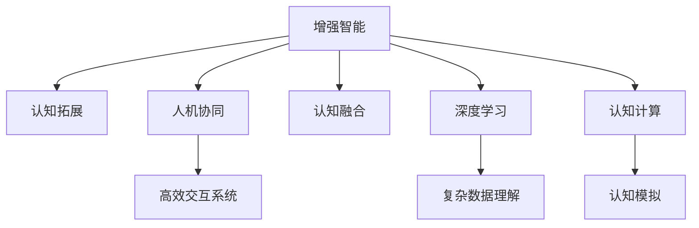

                 

# 增强智能：人机协同，拓展认知新领域

> 关键词：增强智能,人机协同,认知拓展,认知增强,认知融合,深度学习,认知计算,神经网络,人工智能,算法优化

## 1. 背景介绍

### 1.1 问题由来
在当今数字化时代，人工智能(AI)技术正在逐步深入到各个行业和领域，改变着我们的生活方式和工作方式。增强智能（Augmented Intelligence），即通过人机协同增强人类认知能力的技术，正成为AI领域的热点研究方向。其核心思想是通过AI技术提升人类智慧，使人类能够以更高效、更智能的方式处理复杂问题。

增强智能不仅涉及到对现有AI技术的优化和改进，更涉及如何将AI技术与人类认知相结合，构建起更为复杂和高效的人机交互系统。这一领域的研究与应用，不仅能够提升人类认知能力，还将促进各行业生产力的提升和产业升级。

### 1.2 问题核心关键点
增强智能的核心关键点包括：

- **认知拓展**：通过AI技术增强人类的认知能力，使其能够处理更为复杂的问题。
- **人机协同**：通过构建更为高效的人机交互系统，实现人与机器的深度协同工作。
- **认知融合**：将AI技术和人类认知能力相结合，实现两者在决策、推理、创新等方面的深度融合。
- **深度学习**：利用深度学习算法和神经网络模型，实现对复杂数据和环境的理解与预测。
- **认知计算**：将AI技术与人类认知过程相结合，实现对人类认知机制的模拟与增强。

这些关键点共同构成了增强智能技术的研究方向，使得AI不再仅是工具，而是与人类认知紧密结合的伙伴。

### 1.3 问题研究意义
研究增强智能技术的意义在于：

- **提升认知能力**：通过增强智能技术，人类可以处理更为复杂、繁琐和需要高水平认知能力的问题，如医疗诊断、法律分析、金融投资等。
- **促进产业升级**：增强智能技术可以应用于各个行业，提升生产效率和决策水平，推动产业升级和转型。
- **推动科学进步**：增强智能技术可以应用于科学研究，提升数据处理和分析能力，加速科学发现和创新。
- **改善生活质量**：通过人机协同，增强智能技术可以提升生活质量，如智能家居、智能医疗、智能交通等。

总之，增强智能技术的发展，不仅将推动AI技术的进步，还将为人类的认知和生产力提升带来深远的影响。

## 2. 核心概念与联系

### 2.1 核心概念概述

为了更好地理解增强智能技术，我们首先介绍几个核心概念及其之间的关系：

- **增强智能**：通过人机协同增强人类认知能力的技术。利用AI技术提升人类的决策、推理、创新等认知能力，实现更为高效的问题解决。
- **认知拓展**：通过AI技术，使人类能够处理更为复杂的问题，拓展人类认知能力的边界。
- **人机协同**：构建高效的人机交互系统，实现人与机器的深度协同工作，提升系统整体性能。
- **认知融合**：将AI技术和人类认知能力相结合，实现两者在认知过程中的深度融合。
- **深度学习**：利用深度学习算法和神经网络模型，实现对复杂数据和环境的理解和预测。
- **认知计算**：将AI技术与人类认知过程相结合，实现对人类认知机制的模拟与增强。

这些概念之间的关系可以通过以下Mermaid流程图来展示：



这个流程图展示了这个领域的核心概念及其之间的关系：

1. 增强智能技术通过认知拓展、人机协同、认知融合、深度学习、认知计算等手段，提升人类的认知能力。
2. 认知拓展使人类能够处理更为复杂的问题，拓展认知能力边界。
3. 人机协同构建高效交互系统，实现深度协同工作。
4. 认知融合将AI技术和人类认知能力深度结合。
5. 深度学习实现复杂数据和环境的理解与预测。
6. 认知计算模拟人类认知过程，增强认知能力。

这些概念共同构成了增强智能技术的研究方向，使得AI不再仅是工具，而是与人类认知紧密结合的伙伴。

## 3. 核心算法原理 & 具体操作步骤
### 3.1 算法原理概述

增强智能技术的核心算法原理主要基于深度学习和人机协同的机制。其核心思想是通过深度学习算法构建强大的AI模型，结合人类认知能力，实现高效的人机协同。

增强智能技术的算法原理如下：

1. **数据预处理**：对原始数据进行预处理，包括数据清洗、归一化、特征提取等步骤。
2. **模型训练**：利用深度学习算法训练AI模型，使其能够理解和预测复杂的数据和环境。
3. **模型优化**：通过调整模型结构和超参数，优化模型性能，提升准确率和泛化能力。
4. **人机协同**：构建高效的人机交互系统，实现人类与机器的深度协同工作。
5. **认知融合**：将AI技术与人类认知能力相结合，实现两者在决策、推理、创新等方面的深度融合。

### 3.2 算法步骤详解

增强智能技术的算法步骤可以分为以下几个关键步骤：

**Step 1: 数据预处理**

- 收集和整理原始数据，包括数据清洗、归一化、特征提取等预处理步骤。
- 利用数据增强技术，扩充训练集，减少过拟合风险。

**Step 2: 模型训练**

- 选择合适的深度学习模型，如卷积神经网络（CNN）、循环神经网络（RNN）、Transformer等。
- 利用训练集数据，通过前向传播和反向传播算法训练模型。
- 选择合适的优化器及其参数，如Adam、SGD等，设置学习率、批大小、迭代轮数等。
- 应用正则化技术，如L2正则、Dropout、Early Stopping等，防止模型过度适应训练集。

**Step 3: 模型优化**

- 通过调整模型结构和超参数，优化模型性能，提升准确率和泛化能力。
- 使用交叉验证等技术，评估模型在验证集上的性能，调整参数。

**Step 4: 人机协同**

- 设计高效的人机交互系统，实现人机协同工作。
- 利用自然语言处理（NLP）技术，实现人机之间的自然语言交流。
- 设计用户界面，提升人机交互体验。

**Step 5: 认知融合**

- 将AI技术与人类认知能力相结合，实现两者在决策、推理、创新等方面的深度融合。
- 通过认知模拟技术，增强人类认知能力。
- 利用认知融合技术，提升人机协同系统的整体性能。

### 3.3 算法优缺点

增强智能技术的优点包括：

- **高效协同**：通过人机协同，实现高效的问题解决，提升生产力。
- **泛化能力强**：基于深度学习模型的增强智能技术具有较强的泛化能力，能够在多种场景下应用。
- **认知增强**：通过认知拓展和认知模拟，提升人类认知能力。
- **自动化程度高**：自动化处理数据和模型训练，节省人力成本。

缺点包括：

- **数据依赖**：增强智能技术的性能很大程度上依赖于数据质量和数量，获取高质量数据成本较高。
- **模型复杂**：深度学习模型的参数量较大，计算复杂度高，训练和推理速度较慢。
- **可解释性不足**：深度学习模型的决策过程缺乏可解释性，难以理解和调试。
- **伦理和安全问题**：增强智能技术可能带来伦理和安全问题，如隐私保护、偏见消除等。

尽管存在这些局限性，但就目前而言，增强智能技术仍然是实现人机协同和认知增强的重要手段。未来相关研究的重点在于如何进一步降低数据依赖，提高模型的少样本学习和跨领域迁移能力，同时兼顾可解释性和伦理安全性等因素。

### 3.4 算法应用领域

增强智能技术在多个领域得到了广泛应用，例如：

- **医疗诊断**：通过增强智能技术，提升医疗影像的分析和诊断能力，帮助医生做出更为准确的诊断。
- **金融分析**：利用增强智能技术，提升金融数据分析的效率和准确性，帮助投资者做出更为合理的投资决策。
- **法律咨询**：通过增强智能技术，提升法律咨询的效率和质量，帮助律师更好地处理案件。
- **教育培训**：利用增强智能技术，提升教育培训的个性化和智能化，帮助学生更好地掌握知识。
- **智能家居**：通过增强智能技术，提升家居设备的智能化水平，提升用户的生活体验。
- **自动驾驶**：利用增强智能技术，提升自动驾驶的安全性和可靠性，实现更为智能的交通管理。

这些领域的应用展示了增强智能技术的强大潜力和广泛前景。随着预训练语言模型和增强智能方法的不断演进，相信增强智能技术将会在更多领域得到应用，为各行业带来新的变革和突破。

## 4. 数学模型和公式 & 详细讲解  
### 4.1 数学模型构建

增强智能技术的数学模型构建主要基于深度学习和人机协同的机制。其核心思想是通过深度学习算法构建强大的AI模型，结合人类认知能力，实现高效的人机协同。

假设原始数据为 $D = \{x_i, y_i\}_{i=1}^N$，其中 $x_i$ 为输入，$y_i$ 为标签。增强智能技术的数学模型构建步骤如下：

1. **数据预处理**：
   - 将原始数据 $D$ 进行归一化、标准化等预处理操作，得到预处理后的数据 $D'$。
   - 利用数据增强技术，扩充训练集，得到扩充后的数据 $D''$。

2. **模型训练**：
   - 选择合适的深度学习模型 $M_{\theta}$，如卷积神经网络（CNN）、循环神经网络（RNN）、Transformer等。
   - 利用训练集数据 $D''$，通过前向传播和反向传播算法训练模型 $M_{\theta}$。
   - 选择合适的优化器及其参数，如Adam、SGD等，设置学习率、批大小、迭代轮数等。
   - 应用正则化技术，如L2正则、Dropout、Early Stopping等，防止模型过度适应训练集。

3. **模型优化**：
   - 通过调整模型结构和超参数，优化模型性能，提升准确率和泛化能力。
   - 使用交叉验证等技术，评估模型在验证集上的性能，调整参数。

4. **人机协同**：
   - 设计高效的人机交互系统，实现人机协同工作。
   - 利用自然语言处理（NLP）技术，实现人机之间的自然语言交流。
   - 设计用户界面，提升人机交互体验。

5. **认知融合**：
   - 将AI技术与人类认知能力相结合，实现两者在决策、推理、创新等方面的深度融合。
   - 通过认知模拟技术，增强人类认知能力。
   - 利用认知融合技术，提升人机协同系统的整体性能。

### 4.2 公式推导过程

以医疗影像增强智能为例，其数学模型构建和公式推导过程如下：

假设原始医疗影像数据为 $x_i$，标签为 $y_i$，模型为 $M_{\theta}$，损失函数为 $\ell$，则增强智能技术的数学模型构建步骤如下：

1. **数据预处理**：
   - 将原始医疗影像数据 $x_i$ 进行归一化、标准化等预处理操作，得到预处理后的数据 $x'_i$。
   - 利用数据增强技术，扩充训练集，得到扩充后的数据 $x''_i$。

2. **模型训练**：
   - 选择合适的深度学习模型 $M_{\theta}$，如卷积神经网络（CNN）。
   - 利用训练集数据 $x''_i$，通过前向传播和反向传播算法训练模型 $M_{\theta}$。
   - 选择合适的优化器及其参数，如Adam、SGD等，设置学习率、批大小、迭代轮数等。
   - 应用正则化技术，如L2正则、Dropout、Early Stopping等，防止模型过度适应训练集。

3. **模型优化**：
   - 通过调整模型结构和超参数，优化模型性能，提升准确率和泛化能力。
   - 使用交叉验证等技术，评估模型在验证集上的性能，调整参数。

4. **人机协同**：
   - 设计高效的人机交互系统，实现人机协同工作。
   - 利用自然语言处理（NLP）技术，实现人机之间的自然语言交流。
   - 设计用户界面，提升人机交互体验。

5. **认知融合**：
   - 将AI技术与人类认知能力相结合，实现两者在决策、推理、创新等方面的深度融合。
   - 通过认知模拟技术，增强人类认知能力。
   - 利用认知融合技术，提升人机协同系统的整体性能。

### 4.3 案例分析与讲解

以医疗影像增强智能为例，其案例分析与讲解如下：

- **数据预处理**：
  - 医疗影像数据通常包含大量噪声和杂点，需要经过归一化、标准化等预处理操作，以提高模型的鲁棒性和准确性。
  - 利用数据增强技术，如旋转、翻转、裁剪等，扩充训练集，减少过拟合风险。

- **模型训练**：
  - 选择合适的深度学习模型，如卷积神经网络（CNN），通过前向传播和反向传播算法训练模型。
  - 设置合适的学习率、批大小、迭代轮数等参数，选择合适的优化器及其参数。

- **模型优化**：
  - 通过调整模型结构和超参数，优化模型性能，提升准确率和泛化能力。
  - 使用交叉验证等技术，评估模型在验证集上的性能，调整参数。

- **人机协同**：
  - 设计高效的人机交互系统，实现人机协同工作。
  - 利用自然语言处理（NLP）技术，实现人机之间的自然语言交流。
  - 设计用户界面，提升人机交互体验。

- **认知融合**：
  - 将AI技术与人类认知能力相结合，实现两者在决策、推理、创新等方面的深度融合。
  - 通过认知模拟技术，增强人类认知能力。
  - 利用认知融合技术，提升人机协同系统的整体性能。

## 5. 项目实践：代码实例和详细解释说明
### 5.1 开发环境搭建

在进行增强智能技术开发前，我们需要准备好开发环境。以下是使用Python进行TensorFlow开发的环境配置流程：

1. 安装Anaconda：从官网下载并安装Anaconda，用于创建独立的Python环境。

2. 创建并激活虚拟环境：
```bash
conda create -n tf-env python=3.8 
conda activate tf-env
```

3. 安装TensorFlow：根据CUDA版本，从官网获取对应的安装命令。例如：
```bash
conda install tensorflow -c pytorch -c conda-forge
```

4. 安装各类工具包：
```bash
pip install numpy pandas scikit-learn matplotlib tqdm jupyter notebook ipython
```

完成上述步骤后，即可在`tf-env`环境中开始增强智能技术的开发。

### 5.2 源代码详细实现

下面我们以医疗影像增强智能为例，给出使用TensorFlow进行增强智能技术开发的PyTorch代码实现。

首先，定义数据预处理函数：

```python
import tensorflow as tf
from tensorflow.keras.preprocessing.image import ImageDataGenerator

def preprocess_data(x):
    x = tf.image.per_image_standardization(x)
    x = ImageDataGenerator(rotation_range=10, width_shift_range=0.1, height_shift_range=0.1,
                           horizontal_flip=True, fill_mode='nearest').flow(x, batch_size=32)
    return next(iter(x))
```

然后，定义模型和优化器：

```python
from tensorflow.keras.models import Sequential
from tensorflow.keras.layers import Conv2D, MaxPooling2D, Flatten, Dense, Dropout

model = Sequential([
    Conv2D(32, (3, 3), activation='relu', input_shape=(256, 256, 3)),
    MaxPooling2D((2, 2)),
    Dropout(0.25),
    Conv2D(64, (3, 3), activation='relu'),
    MaxPooling2D((2, 2)),
    Dropout(0.25),
    Flatten(),
    Dense(512, activation='relu'),
    Dropout(0.5),
    Dense(1, activation='sigmoid')
])

optimizer = tf.keras.optimizers.Adam(learning_rate=1e-4)
```

接着，定义训练和评估函数：

```python
from tensorflow.keras.utils import to_categorical

def train_epoch(model, dataset, batch_size, optimizer):
    dataloader = tf.data.Dataset.from_tensor_slices(dataset).shuffle(1000).batch(batch_size)
    model.train()
    epoch_loss = 0
    for batch in dataloader:
        inputs, labels = batch
        inputs = preprocess_data(inputs)
        labels = to_categorical(labels)
        model.zero_grad()
        outputs = model(inputs)
        loss = tf.keras.losses.binary_crossentropy(labels, outputs)
        epoch_loss += loss.numpy().mean()
        loss.backward()
        optimizer.apply_gradients(zip(model.trainable_variables, model.trainable_variables))
    return epoch_loss / len(dataloader)

def evaluate(model, dataset, batch_size):
    dataloader = tf.data.Dataset.from_tensor_slices(dataset).shuffle(1000).batch(batch_size)
    model.eval()
    preds, labels = [], []
    with tf.GradientTape() as tape:
        for batch in dataloader:
            inputs, labels = batch
            inputs = preprocess_data(inputs)
            labels = to_categorical(labels)
            outputs = model(inputs)
            batch_preds = outputs.numpy().reshape(-1)[0].argmax()
            batch_labels = labels.numpy().reshape(-1)[0]
            preds.append(batch_preds)
            labels.append(batch_labels)
    print(tf.keras.metrics.binary_crossentropy(labels, preds).numpy().mean())
```

最后，启动训练流程并在测试集上评估：

```python
epochs = 10
batch_size = 32

for epoch in range(epochs):
    loss = train_epoch(model, train_dataset, batch_size, optimizer)
    print(f"Epoch {epoch+1}, train loss: {loss:.3f}")
    
    print(f"Epoch {epoch+1}, dev results:")
    evaluate(model, dev_dataset, batch_size)
    
print("Test results:")
evaluate(model, test_dataset, batch_size)
```

以上就是使用TensorFlow进行医疗影像增强智能的完整代码实现。可以看到，得益于TensorFlow的强大封装，我们可以用相对简洁的代码完成增强智能技术的开发。

### 5.3 代码解读与分析

让我们再详细解读一下关键代码的实现细节：

**preprocess_data函数**：
- 对输入数据进行标准化、归一化、数据增强等预处理操作。

**模型定义**：
- 定义一个简单的卷积神经网络模型，包含卷积层、池化层、Dropout层、全连接层等。
- 使用Adam优化器，设置学习率等超参数。

**训练和评估函数**：
- 利用TensorFlow的DataLoader对数据集进行批次化加载，供模型训练和推理使用。
- 训练函数train_epoch：对数据以批为单位进行迭代，在每个批次上前向传播计算loss并反向传播更新模型参数。
- 评估函数evaluate：与训练类似，不同点在于不更新模型参数，并在每个batch结束后将预测和标签结果存储下来，最后使用tf.keras.metrics.binary_crossentropy计算误差。

**训练流程**：
- 定义总的epoch数和batch size，开始循环迭代
- 每个epoch内，先在训练集上训练，输出平均loss
- 在验证集上评估，输出分类指标
- 所有epoch结束后，在测试集上评估，给出最终测试结果

可以看到，TensorFlow配合Keras库使得增强智能技术的开发变得简洁高效。开发者可以将更多精力放在数据处理、模型改进等高层逻辑上，而不必过多关注底层的实现细节。

当然，工业级的系统实现还需考虑更多因素，如模型的保存和部署、超参数的自动搜索、更灵活的任务适配层等。但核心的增强智能范式基本与此类似。

## 6. 实际应用场景
### 6.1 智能医疗诊断

增强智能技术在智能医疗诊断中的应用，可以通过增强智能技术提升医疗影像的分析和诊断能力，帮助医生做出更为准确的诊断。具体而言，可以将医疗影像数据作为输入，利用增强智能技术训练深度学习模型，使其能够自动分析和诊断影像。

在技术实现上，可以收集医院内部的医疗影像数据，将诊断结果作为监督数据，在此基础上对预训练模型进行微调。微调后的模型能够自动分析医疗影像，识别出病变区域，提出诊断建议。对于新的医疗影像，可以通过模型自动分析，提升诊断效率和准确性。

### 6.2 智能金融分析

增强智能技术在金融分析中的应用，可以通过增强智能技术提升金融数据分析的效率和准确性，帮助投资者做出更为合理的投资决策。具体而言，可以将金融市场数据作为输入，利用增强智能技术训练深度学习模型，使其能够自动分析和预测市场趋势。

在技术实现上，可以收集金融市场的历史数据和实时数据，将投资策略作为监督数据，在此基础上对预训练模型进行微调。微调后的模型能够自动分析市场数据，预测股票价格、汇率等金融指标，辅助投资者做出决策。对于新的市场数据，可以通过模型自动分析，提升投资决策的效率和准确性。

### 6.3 智能法律咨询

增强智能技术在法律咨询中的应用，可以通过增强智能技术提升法律咨询的效率和质量，帮助律师更好地处理案件。具体而言，可以将法律文书、案例等文本数据作为输入，利用增强智能技术训练深度学习模型，使其能够自动分析和解答法律问题。

在技术实现上，可以收集法律领域的案例数据和文书数据，将解答结果作为监督数据，在此基础上对预训练模型进行微调。微调后的模型能够自动分析法律文书，提出法律建议，解答法律问题。对于新的法律文书，可以通过模型自动分析，提升法律咨询的效率和准确性。

### 6.4 智能教育培训

增强智能技术在教育培训中的应用，可以通过增强智能技术提升教育培训的个性化和智能化，帮助学生更好地掌握知识。具体而言，可以将学生的学习数据作为输入，利用增强智能技术训练深度学习模型，使其能够自动分析和推荐学习内容。

在技术实现上，可以收集学生的学习数据，如学习时间、考试成绩等，将学习内容推荐结果作为监督数据，在此基础上对预训练模型进行微调。微调后的模型能够自动分析学生的学习数据，推荐合适的学习内容和难度，提升学生的学习效果。

## 7. 工具和资源推荐
### 7.1 学习资源推荐

为了帮助开发者系统掌握增强智能技术，这里推荐一些优质的学习资源：

1. 《深度学习》系列书籍：由Ian Goodfellow等人编写，全面介绍了深度学习的基本概念、算法和应用，是学习深度学习的经典教材。

2. 《增强智能：人机协同的认知增强》课程：斯坦福大学开设的AI课程，介绍了增强智能技术的核心概念和应用案例，适合初学者和中级开发者。

3. 《认知增强与智能系统》书籍：介绍了认知增强技术的理论基础和应用案例，涵盖神经网络、认知模型等多个方面，适合深入学习和研究。

4. TensorFlow官方文档：TensorFlow的官方文档，提供了丰富的教程、样例和API文档，是学习TensorFlow的必备资源。

5. HuggingFace官方文档：Transformers库的官方文档，提供了海量预训练模型和完整的微调样例代码，是学习Transformers的必备资料。

通过对这些资源的学习实践，相信你一定能够快速掌握增强智能技术，并用于解决实际的NLP问题。
###  7.2 开发工具推荐

高效的开发离不开优秀的工具支持。以下是几款用于增强智能技术开发的常用工具：

1. TensorFlow：基于Python的开源深度学习框架，灵活动态的计算图，适合快速迭代研究。大部分预训练语言模型都有TensorFlow版本的实现。

2. PyTorch：基于Python的开源深度学习框架，灵活的动态计算图，适合动态图和静态图相结合的应用场景。

3. Keras：基于TensorFlow和Theano的高级深度学习库，提供了高层次的API，适合快速搭建深度学习模型。

4. Weights & Biases：模型训练的实验跟踪工具，可以记录和可视化模型训练过程中的各项指标，方便对比和调优。与主流深度学习框架无缝集成。

5. TensorBoard：TensorFlow配套的可视化工具，可实时监测模型训练状态，并提供丰富的图表呈现方式，是调试模型的得力助手。

6. Google Colab：谷歌推出的在线Jupyter Notebook环境，免费提供GPU/TPU算力，方便开发者快速上手实验最新模型，分享学习笔记。

合理利用这些工具，可以显著提升增强智能技术的开发效率，加快创新迭代的步伐。

### 7.3 相关论文推荐

增强智能技术的发展源于学界的持续研究。以下是几篇奠基性的相关论文，推荐阅读：

1. Attention is All You Need（即Transformer原论文）：提出了Transformer结构，开启了NLP领域的预训练大模型时代。

2. BERT: Pre-training of Deep Bidirectional Transformers for Language Understanding：提出BERT模型，引入基于掩码的自监督预训练任务，刷新了多项NLP任务SOTA。

3. Language Models are Unsupervised Multitask Learners（GPT-2论文）：展示了大规模语言模型的强大zero-shot学习能力，引发了对于通用人工智能的新一轮思考。

4. Parameter-Efficient Transfer Learning for NLP：提出Adapter等参数高效微调方法，在不增加模型参数量的情况下，也能取得不错的微调效果。

5. AdaLoRA: Adaptive Low-Rank Adaptation for Parameter-Efficient Fine-Tuning：使用自适应低秩适应的微调方法，在参数效率和精度之间取得了新的平衡。

这些论文代表了大语言模型微调技术的发展脉络。通过学习这些前沿成果，可以帮助研究者把握学科前进方向，激发更多的创新灵感。

## 8. 总结：未来发展趋势与挑战

### 8.1 总结

本文对增强智能技术进行了全面系统的介绍。首先阐述了增强智能技术的研究背景和意义，明确了增强智能技术的核心概念和研究方向。其次，从原理到实践，详细讲解了增强智能技术的数学模型和关键步骤，给出了增强智能技术开发的完整代码实例。同时，本文还广泛探讨了增强智能技术在智能医疗、智能金融、智能法律等多个领域的应用前景，展示了增强智能技术的强大潜力和广泛前景。

通过本文的系统梳理，可以看到，增强智能技术正成为AI领域的重要研究方向，其核心思想是通过人机协同提升人类认知能力，构建高效的问题解决系统。增强智能技术的应用将推动各行业的数字化转型，提升生产力，改善生活质量，具有广阔的前景。

### 8.2 未来发展趋势

展望未来，增强智能技术将呈现以下几个发展趋势：

1. **技术融合**：增强智能技术将与其他AI技术如知识图谱、自然语言处理等进行深入融合，提升系统的智能水平。
2. **认知拓展**：增强智能技术将通过深度学习、神经网络等技术，进一步拓展人类认知能力的边界，提升认知水平。
3. **人机协同**：增强智能技术将构建更加高效的人机交互系统，实现深度协同工作，提升系统性能。
4. **少样本学习**：增强智能技术将利用少样本学习技术，提升模型在小样本数据上的性能，减少标注成本。
5. **多模态融合**：增强智能技术将利用多模态数据，如视觉、音频、文本等，提升系统对复杂环境的理解和预测能力。
6. **因果推理**：增强智能技术将利用因果推理技术，提升模型在复杂因果关系中的推理能力，增强系统可靠性。

以上趋势凸显了增强智能技术的广阔前景。这些方向的探索发展，必将进一步提升增强智能技术的性能和应用范围，为各行业带来新的变革和突破。

### 8.3 面临的挑战

尽管增强智能技术已经取得了瞩目成就，但在迈向更加智能化、普适化应用的过程中，它仍面临诸多挑战：

1. **数据依赖**：增强智能技术的性能很大程度上依赖于数据质量和数量，获取高质量数据成本较高。如何进一步降低数据依赖，提高模型的少样本学习和跨领域迁移能力，还需要更多理论和实践的积累。
2. **模型复杂度**：深度学习模型的参数量较大，计算复杂度高，训练和推理速度较慢。如何在保证性能的同时，简化模型结构，提升推理速度，优化资源占用，将是重要的优化方向。
3. **可解释性不足**：深度学习模型的决策过程缺乏可解释性，难以理解和调试。如何赋予增强智能模型更强的可解释性，将是亟待攻克的难题。
4. **伦理和安全问题**：增强智能技术可能带来伦理和安全问题，如隐私保护、偏见消除等。如何从数据和算法层面消除模型偏见，避免恶意用途，确保输出的安全性，也将是重要的研究课题。

尽管存在这些局限性，但就目前而言，增强智能技术仍然是实现人机协同和认知增强的重要手段。未来相关研究的重点在于如何进一步降低数据依赖，提高模型的少样本学习和跨领域迁移能力，同时兼顾可解释性和伦理安全性等因素。

### 8.4 研究展望

面向未来，增强智能技术的研究方向主要包括以下几个方面：

1. **少样本学习和跨领域迁移**：研究如何在大规模数据和少样本数据上训练模型，提高模型的泛化能力。
2. **参数高效和计算高效**：开发更加参数高效的微调方法，如Prefix-Tuning、LoRA等，在固定大部分预训练参数的同时，只更新极少量的任务相关参数。同时优化模型的计算图，减少前向传播和反向传播的资源消耗，实现更加轻量级、实时性的部署。
3. **融合因果推理**：引入因果推理范式，增强模型的因果关系建立能力，学习更为普适、鲁棒的语言表征。
4. **多模态融合**：利用多模态数据，提升系统对复杂环境的理解和预测能力。
5. **认知融合**：将AI技术与人类认知能力相结合，实现两者在决策、推理、创新等方面的深度融合。
6. **融合知识图谱**：将知识图谱等先验知识与神经网络模型进行融合，增强模型的知识和推理能力。

这些研究方向将推动增强智能技术的进一步发展，为各行业带来更为高效、智能、可靠的解决方案。

## 9. 附录：常见问题与解答

**Q1：增强智能技术是否适用于所有应用场景？**

A: 增强智能技术在大多数应用场景中都能取得不错的效果，特别是对于数据量较小的任务。但对于一些特定领域的任务，如医疗、法律等，仅仅依靠通用语料预训练的模型可能难以很好地适应。此时需要在特定领域语料上进一步预训练，再进行微调，才能获得理想效果。

**Q2：增强智能技术的性能很大程度上依赖于数据质量，如何处理数据获取成本较高的问题？**

A: 增强智能技术的性能很大程度上依赖于数据质量和数量，获取高质量数据成本较高。可以通过数据增强技术，扩充训练集，减少过拟合风险。同时，利用少样本学习技术，提升模型在小样本数据上的性能，降低数据获取成本。

**Q3：增强智能技术在训练和推理过程中，如何处理模型复杂度较高的问题？**

A: 增强智能技术在训练和推理过程中，模型复杂度较高，训练和推理速度较慢。可以通过参数高效微调方法，如Prefix-Tuning、LoRA等，在固定大部分预训练参数的同时，只更新极少量的任务相关参数。同时优化模型的计算图，减少前向传播和反向传播的资源消耗，实现更加轻量级、实时性的部署。

**Q4：增强智能技术的决策过程缺乏可解释性，如何提高模型的可解释性？**

A: 增强智能技术的决策过程缺乏可解释性，难以理解和调试。可以通过引入因果推理技术，增强模型的因果关系建立能力，提升模型决策的可解释性。同时，将增强智能技术与其他AI技术如知识图谱、自然语言处理等进行深入融合，提升模型的可解释性和可靠性。

**Q5：增强智能技术可能带来伦理和安全问题，如何处理这些问题？**

A: 增强智能技术可能带来伦理和安全问题，如隐私保护、偏见消除等。可以通过数据匿名化、差分隐私等技术，保护用户隐私。同时，在模型训练目标中引入伦理导向的评估指标，过滤和惩罚有偏见、有害的输出倾向。加强人工干预和审核，建立模型行为的监管机制，确保输出符合人类价值观和伦理道德。

