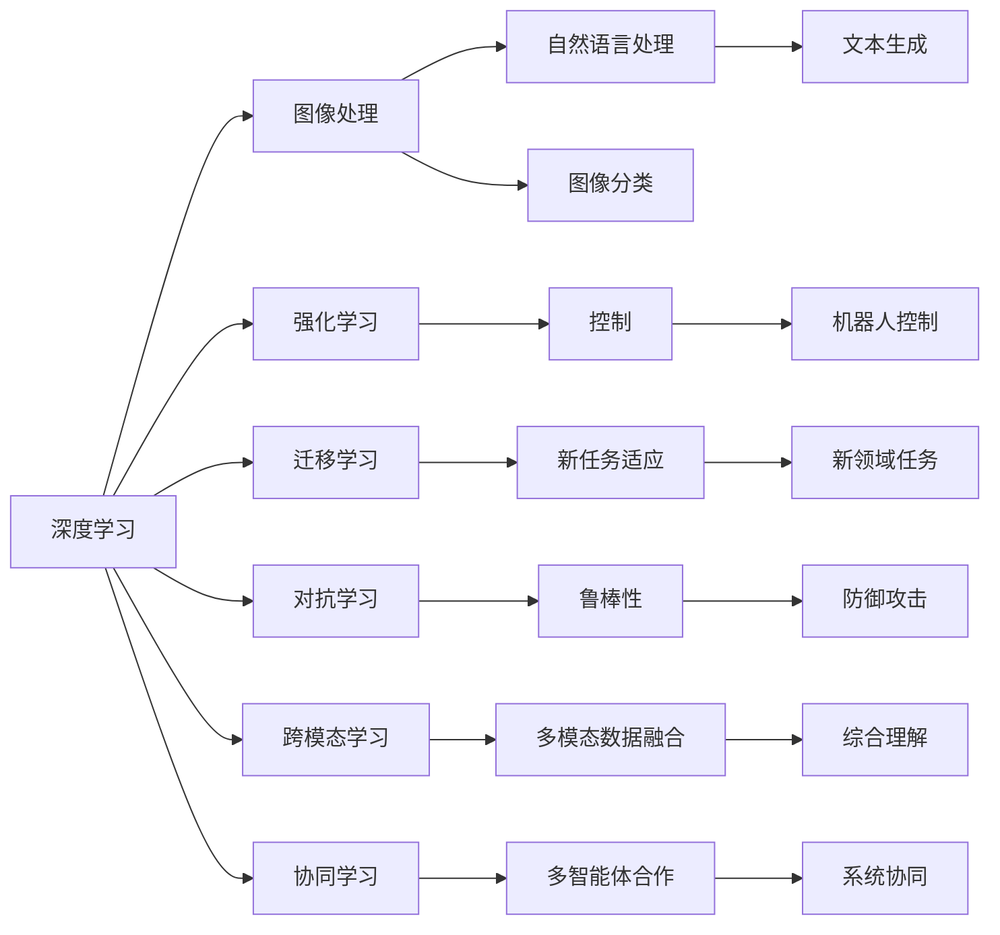

                 

## 1. 背景介绍

### 1.1 问题由来
近年来，人工智能(AI)技术在各个领域取得了显著进展，从语音识别、图像处理到自然语言处理(NLP)、推荐系统等，AI的潜力不断被挖掘和验证。然而，这些AI技术往往需要大量的数据、计算资源和复杂的算法模型，使得其实际应用场景受到限制。随着数据量的激增和计算能力的提升，AI技术在解决复杂问题上的角色正在发生根本性变化。

### 1.2 问题核心关键点
本文聚焦于AI在复杂问题解决中的新角色，探讨了AI技术如何通过深度学习、强化学习、迁移学习等多种手段，应对复杂多变的现实问题。AI的新角色不再局限于数据驱动的单一模式，而是融入人类的经验和智慧，形成人机协同，实现更高效、更智能的问题解决。

## 2. 核心概念与联系

### 2.1 核心概念概述

为了更好地理解AI在复杂问题解决中的新角色，本节将介绍几个关键概念及其相互联系：

- **深度学习**：通过多层次的非线性变换，从大量数据中自动学习特征，实现端到端的学习过程，适用于图像、语音、文本等复杂数据的处理。
- **强化学习**：通过与环境的交互，智能体通过尝试和错误不断优化策略，适用于控制、游戏、机器人等领域。
- **迁移学习**：利用已有知识在新任务上进行迁移学习，提升模型在新领域的适应能力，减少标注数据需求。
- **对抗学习**：通过生成对抗网络等技术，提升模型的鲁棒性和泛化能力，对抗常见攻击。
- **跨模态学习**：将不同模态的数据（如文本、图像、声音等）进行整合，构建更全面、更准确的知识表征。
- **协同学习**：多智能体通过合作解决问题，提升整体系统的性能和鲁棒性。

这些概念之间存在着紧密的联系，通过跨模态学习，AI能够综合不同类型的数据，实现更全面、更深刻的理解。对抗学习使得模型具有更高的鲁棒性，迁移学习则利用已有知识，减少了新任务上的学习成本。协同学习则提升了多智能体系统的整体性能。

### 2.2 核心概念原理和架构的 Mermaid 流程图



这个流程图展示了各个概念之间的联系及其在实际应用中的作用。深度学习提供基础的特征提取能力，强化学习实现策略优化，迁移学习加速新任务适应，对抗学习提升鲁棒性，跨模态学习整合多模态数据，协同学习提升系统整体性能。

## 3. 核心算法原理 & 具体操作步骤
### 3.1 算法原理概述

AI在复杂问题解决中，主要依赖于深度学习、强化学习、迁移学习等多种算法和技术。这些技术通过不同的方式，从数据中提取知识，生成智能策略，并应用于实际问题中。

- **深度学习**：通过多层神经网络，自动学习数据中的复杂特征，实现端到端的预测和生成。深度学习在图像识别、语音识别、自然语言处理等领域已取得显著成果。
- **强化学习**：通过智能体与环境的交互，智能体通过尝试和错误不断优化策略，学习最优决策路径。强化学习在机器人控制、游戏策略、自动驾驶等领域有广泛应用。
- **迁移学习**：通过将已有知识在新任务上进行迁移，加速模型的学习过程，减少标注数据需求。迁移学习在跨领域任务如医疗诊断、金融预测、社交网络分析等领域得到了应用。

### 3.2 算法步骤详解

AI在解决复杂问题时，通常遵循以下步骤：

**Step 1: 数据收集与预处理**
- 收集问题相关的数据，并进行清洗、标注等预处理步骤。
- 利用数据增强技术，扩充训练数据，提高模型的泛化能力。

**Step 2: 选择模型架构**
- 根据问题类型，选择合适的深度学习、强化学习或迁移学习模型。
- 设计模型的损失函数和优化器，确定训练过程中的超参数。

**Step 3: 模型训练**
- 在处理好的数据上，使用选择好的模型进行训练。
- 使用适当的正则化技术，如L2正则、Dropout等，防止过拟合。
- 使用对抗训练等技术，提高模型的鲁棒性。

**Step 4: 模型评估与调优**
- 在验证集上评估模型性能，调整超参数以提高模型效果。
- 使用交叉验证等技术，进一步验证模型的稳定性和泛化能力。

**Step 5: 模型应用与优化**
- 将训练好的模型应用于实际问题中，进行性能测试。
- 根据测试结果，进一步优化模型，提升性能。

### 3.3 算法优缺点

**深度学习**：
- 优点：能够处理高维、非结构化数据，具有强大的特征提取能力。
- 缺点：需要大量标注数据，模型复杂度高，训练成本高。

**强化学习**：
- 优点：适用于决策类问题，能够处理实时反馈信息，具有高度的适应性。
- 缺点：训练过程复杂，需要大量计算资源和时间，模型解释性差。

**迁移学习**：
- 优点：减少标注数据需求，加速模型在新领域的适应。
- 缺点：需要选择合适的源任务，可能存在领域适应性问题。

**对抗学习**：
- 优点：提升模型的鲁棒性和泛化能力，能够抵御常见攻击。
- 缺点：对抗样本生成难度大，对抗训练过程复杂。

**跨模态学习**：
- 优点：能够整合不同模态的数据，构建更全面、更准确的知识表征。
- 缺点：多模态数据融合技术复杂，需要大量的预处理和标注数据。

**协同学习**：
- 优点：提升多智能体系统的整体性能，增强系统的鲁棒性。
- 缺点：需要高效的通信机制，协同算法复杂。

### 3.4 算法应用领域

AI技术在复杂问题解决中的应用领域非常广泛，以下是几个典型的应用场景：

- **医疗诊断**：通过深度学习，分析医学影像、病历等数据，辅助医生进行疾病诊断。利用迁移学习，在特定疾病领域进行模型微调，提高诊断准确率。
- **金融预测**：利用强化学习，构建智能交易系统，预测股票市场趋势。通过跨模态学习，整合新闻、社交媒体等数据，提升预测准确性。
- **智能推荐系统**：通过深度学习，分析用户行为数据，推荐个性化内容。利用协同学习，提升系统整体推荐效果。
- **自动驾驶**：利用强化学习，控制自动驾驶车辆的行为决策。通过跨模态学习，整合传感器数据和地图信息，提升安全性。
- **智慧城市**：通过深度学习，分析城市交通数据，优化交通管理。利用迁移学习，在新城市中进行模型微调，提升管理效果。

## 4. 数学模型和公式 & 详细讲解 & 举例说明

### 4.1 数学模型构建

AI在复杂问题解决中，通常使用深度学习模型来进行特征提取和模式识别。以卷积神经网络(CNN)为例，其数学模型如下：

设输入数据为 $x \in \mathbb{R}^{n}$，网络参数为 $\theta$，输出为 $y \in \mathbb{R}^{m}$，则卷积神经网络的数学模型为：

$$
y = f(x; \theta) = Wx + b
$$

其中 $W$ 为权重矩阵，$b$ 为偏置项，$f$ 为激活函数。

### 4.2 公式推导过程

对于卷积神经网络的训练过程，常用的优化算法是随机梯度下降(SGD)：

$$
\theta \leftarrow \theta - \alpha \nabla_{\theta} L(y, f(x; \theta))
$$

其中 $\alpha$ 为学习率，$L$ 为损失函数。

### 4.3 案例分析与讲解

以图像分类为例，假设有一张图像 $x$，使用卷积神经网络进行分类，输出为 $y \in \{1, 2, 3, 4\}$。则其损失函数为交叉熵损失：

$$
L(y, f(x; \theta)) = -\sum_{i=1}^4 y_i \log f_i(x; \theta)
$$

其中 $f_i(x; \theta)$ 为第 $i$ 类别的预测概率。

在训练过程中，通过反向传播算法计算损失函数的梯度，并使用SGD算法进行参数更新，最小化损失函数，从而实现模型的训练。

## 5. 项目实践：代码实例和详细解释说明

### 5.1 开发环境搭建

在进行AI项目开发前，需要准备相应的开发环境。以下是使用Python进行TensorFlow开发的环境配置流程：

1. 安装Anaconda：从官网下载并安装Anaconda，用于创建独立的Python环境。

2. 创建并激活虚拟环境：
```bash
conda create -n tf-env python=3.8 
conda activate tf-env
```

3. 安装TensorFlow：根据CUDA版本，从官网获取对应的安装命令。例如：
```bash
conda install tensorflow -c pytorch -c conda-forge
```

4. 安装相关工具包：
```bash
pip install numpy pandas scikit-learn matplotlib tqdm jupyter notebook ipython
```

完成上述步骤后，即可在`tf-env`环境中开始AI项目的开发。

### 5.2 源代码详细实现

下面我们以图像分类任务为例，给出使用TensorFlow进行卷积神经网络训练的PyTorch代码实现。

首先，定义图像分类任务的数据处理函数：

```python
import tensorflow as tf
from tensorflow.keras.datasets import cifar10

(train_images, train_labels), (test_images, test_labels) = cifar10.load_data()

def normalize_images(images):
    images = images.astype('float32') / 255.0
    return images

train_images = normalize_images(train_images)
test_images = normalize_images(test_images)

class ImageClassifier(tf.keras.Model):
    def __init__(self):
        super(ImageClassifier, self).__init__()
        self.conv1 = tf.keras.layers.Conv2D(32, (3, 3), activation='relu')
        self.pool1 = tf.keras.layers.MaxPooling2D((2, 2))
        self.conv2 = tf.keras.layers.Conv2D(64, (3, 3), activation='relu')
        self.pool2 = tf.keras.layers.MaxPooling2D((2, 2))
        self.flatten = tf.keras.layers.Flatten()
        self.d1 = tf.keras.layers.Dense(128, activation='relu')
        self.output_layer = tf.keras.layers.Dense(10)

    def call(self, x):
        x = self.conv1(x)
        x = self.pool1(x)
        x = self.conv2(x)
        x = self.pool2(x)
        x = self.flatten(x)
        x = self.d1(x)
        return self.output_layer(x)
```

然后，定义训练和评估函数：

```python
import tensorflow as tf

model = ImageClassifier()
optimizer = tf.keras.optimizers.Adam(learning_rate=0.001)

@tf.function
def train_step(images, labels):
    with tf.GradientTape() as tape:
        logits = model(images)
        loss = tf.keras.losses.SparseCategoricalCrossentropy()(labels, logits)
    gradients = tape.gradient(loss, model.trainable_variables)
    optimizer.apply_gradients(zip(gradients, model.trainable_variables))

@tf.function
def evaluate_step(images, labels):
    logits = model(images)
    predictions = tf.argmax(logits, axis=-1)
    accuracy = tf.reduce_mean(tf.cast(tf.equal(predictions, labels), tf.float32))
    return accuracy

batch_size = 64

for epoch in range(10):
    for i in range(0, len(train_images), batch_size):
        images = train_images[i:i+batch_size]
        labels = train_labels[i:i+batch_size]
        train_step(images, labels)

    accuracy = evaluate_step(test_images, test_labels)
    print(f"Epoch {epoch+1}, Accuracy: {accuracy}")
```

最后，启动训练流程并在测试集上评估：

```python
epochs = 10
batch_size = 64

for epoch in range(epochs):
    for i in range(0, len(train_images), batch_size):
        images = train_images[i:i+batch_size]
        labels = train_labels[i:i+batch_size]
        train_step(images, labels)

    accuracy = evaluate_step(test_images, test_labels)
    print(f"Epoch {epoch+1}, Accuracy: {accuracy}")
```

以上就是使用TensorFlow进行图像分类任务卷积神经网络训练的完整代码实现。可以看到，TensorFlow提供了一体化的深度学习框架，大大简化了模型的搭建和训练过程。

### 5.3 代码解读与分析

让我们再详细解读一下关键代码的实现细节：

**ImageClassifier类**：
- `__init__`方法：初始化卷积、池化、全连接等层，设置激活函数。
- `call`方法：定义模型的前向传播过程，输出模型的预测结果。

**train_step函数**：
- 使用梯度记录器计算损失函数的梯度。
- 使用优化器更新模型参数。

**evaluate_step函数**：
- 计算模型在测试集上的准确率，评估模型性能。

**训练流程**：
- 定义总的epoch数和batch size，开始循环迭代
- 每个epoch内，对训练集进行批处理，训练模型
- 在测试集上评估模型性能，输出准确率
- 所有epoch结束后，输出最终的评估结果

可以看到，TensorFlow大大简化了模型的构建和训练过程，开发者可以将更多精力放在模型设计和优化上。

## 6. 实际应用场景

### 6.1 医疗诊断

AI在医疗领域的应用广泛，通过深度学习、迁移学习等技术，AI可以辅助医生进行疾病诊断和治疗决策。例如，利用卷积神经网络(CNN)对医学影像进行分析，识别肿瘤、病变等异常区域。通过迁移学习，在特定疾病领域进行模型微调，提高诊断准确率。

### 6.2 金融预测

AI在金融领域的应用主要集中在风险评估、投资决策等方面。通过深度学习，分析历史交易数据，预测股票市场趋势。利用强化学习，构建智能交易系统，优化交易策略。通过跨模态学习，整合新闻、社交媒体等数据，提升预测准确性。

### 6.3 智能推荐系统

AI在推荐系统中的应用主要集中在个性化推荐、内容生成等方面。通过深度学习，分析用户行为数据，推荐个性化内容。利用协同学习，提升系统整体推荐效果。

### 6.4 自动驾驶

AI在自动驾驶领域的应用主要集中在感知、决策、控制等方面。通过深度学习，分析传感器数据，识别道路标志、行人等。利用强化学习，控制自动驾驶车辆的行为决策。通过跨模态学习，整合地图信息，提升安全性。

### 6.5 智慧城市

AI在智慧城市中的应用主要集中在交通管理、环境监测等方面。通过深度学习，分析交通数据，优化交通管理。利用迁移学习，在新城市中进行模型微调，提升管理效果。

## 7. 工具和资源推荐

### 7.1 学习资源推荐

为了帮助开发者系统掌握AI在复杂问题解决中的应用，这里推荐一些优质的学习资源：

1. 《深度学习》系列书籍：由深度学习领域著名专家编写，系统介绍了深度学习的基本原理和应用。
2. 《强化学习》系列书籍：介绍了强化学习的基本原理和应用，涵盖Q-learning、Policy Gradient等算法。
3. 《迁移学习》系列书籍：介绍了迁移学习的基本原理和应用，涵盖数据迁移、知识迁移等方法。
4. Coursera深度学习课程：斯坦福大学开设的深度学习课程，提供了丰富的视频和作业，帮助学习者掌握深度学习的基本概念和技术。
5. Udacity强化学习课程：介绍了强化学习的基本原理和应用，提供了实验平台和项目实践机会。

通过对这些资源的学习实践，相信你一定能够快速掌握AI在复杂问题解决中的应用，并用于解决实际的AI问题。

### 7.2 开发工具推荐

高效的开发离不开优秀的工具支持。以下是几款用于AI开发常用的工具：

1. TensorFlow：由Google主导开发的深度学习框架，生产部署方便，适合大规模工程应用。
2. PyTorch：基于Python的开源深度学习框架，灵活动态的计算图，适合快速迭代研究。
3. Keras：基于TensorFlow和Theano的高级深度学习框架，易于上手，适合快速原型开发。
4. Weights & Biases：模型训练的实验跟踪工具，可以记录和可视化模型训练过程中的各项指标，方便对比和调优。
5. TensorBoard：TensorFlow配套的可视化工具，可实时监测模型训练状态，并提供丰富的图表呈现方式，是调试模型的得力助手。

合理利用这些工具，可以显著提升AI项目的开发效率，加快创新迭代的步伐。

### 7.3 相关论文推荐

AI在复杂问题解决中的应用源于学界的持续研究。以下是几篇奠基性的相关论文，推荐阅读：

1. AlexNet：ImageNet大规模视觉识别竞赛冠军，开创了深度卷积神经网络在图像分类中的应用。
2. ResNet：解决深度网络退化问题，提出残差连接结构，极大提高了网络深度。
3. Attention Is All You Need：提出Transformer结构，开启了自注意力机制在自然语言处理中的应用。
4. Reinforcement Learning for Playing Go: Mastering the Game with Deep Neural Networks and Tree Search：提出深度强化学习在围棋中的应用，展示了AI在复杂决策问题上的潜力。
5. AlphaGo Zero：使用强化学习训练的围棋AI，在无监督学习下取得了超越人类顶尖选手的成绩。

这些论文代表了大AI在复杂问题解决中的研究方向和进展，通过学习这些前沿成果，可以帮助研究者把握学科前进方向，激发更多的创新灵感。

## 8. 总结：未来发展趋势与挑战

### 8.1 研究成果总结

本文对AI在复杂问题解决中的应用进行了全面系统的介绍。首先阐述了AI在复杂问题解决中的新角色，探讨了深度学习、强化学习、迁移学习等多种AI技术在实际应用中的作用。其次，从原理到实践，详细讲解了AI在复杂问题解决中的核心算法和技术，给出了AI项目开发的完整代码实例。同时，本文还广泛探讨了AI技术在医疗诊断、金融预测、智能推荐、自动驾驶、智慧城市等多个领域的应用前景，展示了AI技术的广泛应用潜力。最后，本文精选了AI技术的学习资源，力求为读者提供全方位的技术指引。

通过本文的系统梳理，可以看到，AI在复杂问题解决中的新角色不再局限于数据驱动的单一模式，而是融入人类的经验和智慧，形成人机协同，实现更高效、更智能的问题解决。AI技术的发展，使得复杂问题解决变得更加高效、灵活和智能。

### 8.2 未来发展趋势

展望未来，AI在复杂问题解决中的发展趋势将呈现以下几个方向：

1. **多模态学习**：AI将更多地整合多模态数据，实现更全面、更深刻的知识表征，提升模型的理解和推理能力。
2. **自监督学习**：通过自监督学习，AI可以在没有标注数据的情况下进行学习和训练，进一步提升模型的泛化能力和鲁棒性。
3. **小样本学习**：AI将更多地研究小样本学习，在数据量不足的情况下，通过迁移学习、对抗训练等手段提升模型的性能。
4. **联邦学习**：通过联邦学习，多智能体协作进行模型训练，提升模型的泛化能力和安全性。
5. **元学习**：通过元学习，AI能够在不断积累经验和知识的过程中，快速适应新任务，提升模型的适应性和通用性。

以上趋势将进一步拓展AI在复杂问题解决中的应用范围和能力，推动AI技术向更广阔的领域发展。

### 8.3 面临的挑战

尽管AI在复杂问题解决中取得了显著进展，但仍面临诸多挑战：

1. **数据依赖**：AI技术通常依赖大量标注数据，在数据量不足的情况下，模型的性能难以保证。如何降低数据依赖，提升模型的泛化能力，是未来的重要研究方向。
2. **模型复杂性**：AI模型的复杂度不断提升，需要更多的计算资源和时间，如何在保证性能的同时，降低模型的复杂度，是一个重要的挑战。
3. **模型鲁棒性**：AI模型在面对新数据或对抗攻击时，鲁棒性不足，如何提升模型的鲁棒性和泛化能力，是一个亟待解决的问题。
4. **解释性和可信度**：AI模型的决策过程缺乏可解释性，如何增强模型的解释性和可信度，是一个重要的研究方向。
5. **伦理和隐私**：AI模型在处理敏感数据时，面临伦理和隐私问题，如何保护数据隐私，确保模型的公平性和安全性，是一个重要的挑战。

### 8.4 研究展望

面对AI在复杂问题解决中面临的诸多挑战，未来的研究需要在以下几个方面寻求新的突破：

1. **无监督学习**：进一步探索无监督学习，利用未标注数据进行模型训练，减少数据依赖。
2. **模型压缩和优化**：研究模型压缩和优化技术，降低模型复杂度，提升推理速度和资源效率。
3. **鲁棒性提升**：研究鲁棒性提升技术，如对抗训练、正则化等，提高模型的泛化能力和鲁棒性。
4. **可解释性增强**：研究可解释性增强技术，如模型可视化、特征解释等，提高模型的解释性和可信度。
5. **伦理和隐私保护**：研究伦理和隐私保护技术，如差分隐私、公平学习等，确保AI模型的公平性和安全性。

这些研究方向将进一步推动AI技术在复杂问题解决中的发展，为构建更加高效、智能、可信的AI系统提供技术支撑。相信随着研究的不断深入，AI技术必将在解决复杂问题上发挥更大的作用，推动人类社会的进步和发展。

## 9. 附录：常见问题与解答

**Q1: AI在复杂问题解决中的新角色是什么？**

A: AI在复杂问题解决中的新角色不再局限于数据驱动的单一模式，而是融入人类的经验和智慧，形成人机协同，实现更高效、更智能的问题解决。AI技术能够整合多模态数据，进行跨领域学习，提升模型的泛化能力和鲁棒性。

**Q2: AI在复杂问题解决中的核心算法有哪些？**

A: AI在复杂问题解决中的核心算法包括深度学习、强化学习、迁移学习、对抗学习、跨模态学习等。这些算法通过不同的方式，从数据中提取知识，生成智能策略，并应用于实际问题中。

**Q3: 如何进行AI模型的训练和优化？**

A: AI模型的训练和优化通常遵循以下步骤：
1. 数据收集与预处理：收集问题相关的数据，并进行清洗、标注等预处理步骤。
2. 模型选择与设计：根据问题类型，选择合适的深度学习、强化学习或迁移学习模型，设计模型的损失函数和优化器。
3. 模型训练：在处理好的数据上，使用选择好的模型进行训练。使用适当的正则化技术，防止过拟合。
4. 模型评估与调优：在验证集上评估模型性能，调整超参数以提高模型效果。

**Q4: 如何应对AI在复杂问题解决中面临的挑战？**

A: 面对AI在复杂问题解决中面临的诸多挑战，未来的研究需要在以下几个方面寻求新的突破：
1. 无监督学习：探索无监督学习，利用未标注数据进行模型训练，减少数据依赖。
2. 模型压缩和优化：研究模型压缩和优化技术，降低模型复杂度，提升推理速度和资源效率。
3. 鲁棒性提升：研究鲁棒性提升技术，如对抗训练、正则化等，提高模型的泛化能力和鲁棒性。
4. 可解释性增强：研究可解释性增强技术，如模型可视化、特征解释等，提高模型的解释性和可信度。
5. 伦理和隐私保护：研究伦理和隐私保护技术，如差分隐私、公平学习等，确保AI模型的公平性和安全性。

**Q5: AI在复杂问题解决中的应用场景有哪些？**

A: AI在复杂问题解决中的应用场景非常广泛，包括医疗诊断、金融预测、智能推荐、自动驾驶、智慧城市等领域。通过深度学习、强化学习、迁移学习等技术，AI能够辅助人类解决各种复杂问题，提升工作效率和决策能力。

---

作者：禅与计算机程序设计艺术 / Zen and the Art of Computer Programming

