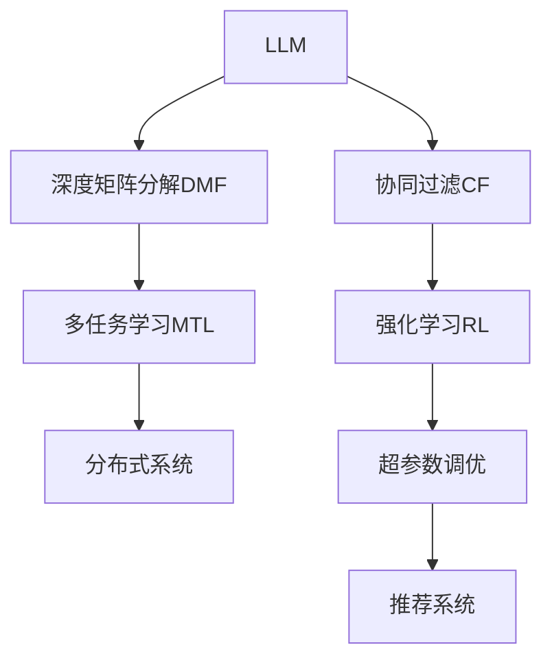

                 

# 多任务推荐系统：LLM的统一框架优势

> 关键词：推荐系统,大语言模型(LLM),统一框架,多任务学习,深度学习,强化学习,协同过滤,MLP,决策树,深度矩阵分解,分布式系统,超参数调优

## 1. 背景介绍

### 1.1 问题由来

在互联网时代，信息爆炸和个性化需求的双重驱动下，推荐系统（Recommendation System, RS）应运而生，成为各大平台提高用户体验、提升业务价值的关键工具。推荐系统通过分析用户的兴趣和行为数据，预测其可能感兴趣的物品，并为其推荐，从而增加用户粘性、提升转化率和销售额。

早期推荐系统主要基于用户行为数据的协同过滤（Collaborative Filtering, CF）方法，如矩阵分解、基于用户的协同过滤和基于物品的协同过滤。尽管这些方法在推荐效果上已经取得一定成功，但随着数据的复杂性增加，模型训练难度加大，性能瓶颈逐步显现。为此，深度学习（Deep Learning, DL）方法逐渐引入推荐系统，取得了突破性进展。

深度学习推荐系统主要基于用户行为数据进行建模，但由于缺乏对用户特征和物品属性的理解，在冷启动和跨领域推荐上仍然面临困难。相比之下，大语言模型（Large Language Model, LLM）凭借其强大的自然语言理解能力，可以挖掘用户更深层级的特征和偏好，逐步成为推荐系统的新宠。

### 1.2 问题核心关键点

本文聚焦于基于大语言模型（LLM）的推荐系统，尤其是一体化的多任务推荐框架。LLM的引入，使推荐系统可以同时处理不同特征数据，利用丰富的语言知识进行深度融合，显著提升推荐效果和系统鲁棒性。

1. **多任务学习（Multi-task Learning, MTL）**：多任务学习是一种同时训练多个相关任务的深度学习技术，能够在共享知识的同时提升每个任务的性能。
2. **深度矩阵分解（Deep Matrix Factorization, DMF）**：深度矩阵分解是深度学习在协同过滤推荐方法中的应用，能够同时处理用户和物品的隐特征，提升推荐精度。
3. **协同过滤（Collaborative Filtering, CF）**：协同过滤是一种基于用户行为数据的推荐方法，包括基于用户的协同过滤和基于物品的协同过滤。
4. **强化学习（Reinforcement Learning, RL）**：强化学习通过模仿用户的行为，不断优化推荐策略，提升用户体验。
5. **分布式系统（Distributed System）**：分布式系统通过多台计算机协同工作，提升推荐系统的大规模计算能力。
6. **超参数调优（Hyperparameter Tuning）**：超参数调优通过调整模型的超参数，优化推荐效果和模型性能。

这些关键技术通过合理的结合和应用，构建了多任务推荐系统的统一框架，使LLM在推荐系统中发挥更大的作用。

### 1.3 问题研究意义

基于LLM的多任务推荐系统研究具有重要意义：

1. **提升推荐效果**：LLM能够挖掘用户和物品的深层特征，通过多任务学习，提升推荐精度和覆盖度。
2. **减少数据需求**：LLM能够在较少标注数据的情况下进行训练，减少推荐系统的数据获取和标注成本。
3. **提高系统鲁棒性**：LLM通过多任务学习，可以有效避免单一任务的过拟合，提升系统的鲁棒性和泛化能力。
4. **增强用户体验**：通过LLM的语言理解和生成能力，推荐系统能够提供更丰富、更具个性化的推荐内容。
5. **促进技术发展**：LLM在推荐系统中的应用，推动了深度学习和自然语言处理技术的进一步发展，带来更多创新应用场景。

## 2. 核心概念与联系

### 2.1 核心概念概述

为了深入理解基于LLM的多任务推荐系统，我们先介绍几个核心概念及其联系：

- **大语言模型（Large Language Model, LLM）**：以自回归（如GPT）或自编码（如BERT）模型为代表的深度神经网络，能够通过大规模无标签文本数据的预训练，学习到丰富的语言知识和常识。
- **协同过滤（Collaborative Filtering, CF）**：根据用户的历史行为数据，预测其未来可能感兴趣的项目。
- **深度矩阵分解（Deep Matrix Factorization, DMF）**：通过低秩矩阵分解，捕捉用户和物品的隐特征，提升推荐精度。
- **多任务学习（Multi-task Learning, MTL）**：通过同时训练多个相关任务，共享知识并提升每个任务的性能。
- **强化学习（Reinforcement Learning, RL）**：通过模仿用户的行为，不断优化推荐策略，提升用户体验。
- **分布式系统（Distributed System）**：通过多台计算机协同工作，提升推荐系统的大规模计算能力。
- **超参数调优（Hyperparameter Tuning）**：通过调整模型的超参数，优化推荐效果和模型性能。

这些概念通过合理的结合和应用，构建了基于LLM的多任务推荐系统的统一框架，使LLM在推荐系统中发挥更大的作用。

### 2.2 核心概念原理和架构的 Mermaid 流程图



这个流程图展示了基于LLM的多任务推荐系统各个组件之间的联系和数据流动。LLM作为核心的语言模型，通过深度矩阵分解、协同过滤、多任务学习、强化学习、分布式系统和超参数调优等技术手段，共同构建推荐系统，提升推荐效果和用户体验。

## 3. 核心算法原理 & 具体操作步骤
### 3.1 算法原理概述

基于LLM的多任务推荐系统，通过将多个推荐任务同时训练，共享知识并提升每个任务的性能。其核心算法原理如下：

- **用户特征提取**：通过LLM提取用户的历史行为、兴趣偏好等信息，构建用户特征向量。
- **物品特征提取**：通过LLM提取物品的属性、描述等信息，构建物品特征向量。
- **深度矩阵分解**：将用户特征和物品特征进行矩阵分解，得到隐特征向量。
- **多任务学习**：通过多任务学习，同时训练多个推荐任务（如评分预测、序列推荐等），共享知识并提升每个任务的性能。
- **协同过滤**：利用用户和物品的隐特征，进行协同过滤，预测用户对物品的评分和偏好。
- **强化学习**：通过模仿用户的行为，不断优化推荐策略，提升用户体验。
- **分布式系统**：通过多台计算机协同工作，提升推荐系统的大规模计算能力。
- **超参数调优**：通过调整模型的超参数，优化推荐效果和模型性能。

### 3.2 算法步骤详解

基于LLM的多任务推荐系统的核心算法步骤包括：

1. **数据预处理**：收集和整理用户行为数据、物品属性数据等，构建训练集、验证集和测试集。
2. **用户特征提取**：通过LLM提取用户的历史行为、兴趣偏好等信息，构建用户特征向量。
3. **物品特征提取**：通过LLM提取物品的属性、描述等信息，构建物品特征向量。
4. **深度矩阵分解**：将用户特征和物品特征进行矩阵分解，得到隐特征向量。
5. **多任务学习**：通过多任务学习，同时训练多个推荐任务，共享知识并提升每个任务的性能。
6. **协同过滤**：利用用户和物品的隐特征，进行协同过滤，预测用户对物品的评分和偏好。
7. **强化学习**：通过模仿用户的行为，不断优化推荐策略，提升用户体验。
8. **分布式系统**：通过多台计算机协同工作，提升推荐系统的大规模计算能力。
9. **超参数调优**：通过调整模型的超参数，优化推荐效果和模型性能。

### 3.3 算法优缺点

基于LLM的多任务推荐系统有以下优点：

- **提高推荐效果**：通过多任务学习，利用丰富的语言知识，提升推荐精度和覆盖度。
- **减少数据需求**：LLM能够在较少标注数据的情况下进行训练，减少推荐系统的数据获取和标注成本。
- **提高系统鲁棒性**：通过多任务学习，可以有效避免单一任务的过拟合，提升系统的鲁棒性和泛化能力。
- **增强用户体验**：通过LLM的语言理解和生成能力，推荐系统能够提供更丰富、更具个性化的推荐内容。
- **促进技术发展**：LLM在推荐系统中的应用，推动了深度学习和自然语言处理技术的进一步发展，带来更多创新应用场景。

同时，该算法也存在一些缺点：

- **计算资源需求高**：大语言模型的训练和推理需要大量的计算资源，可能会带来一定的成本压力。
- **模型复杂度高**：多任务推荐系统涉及多个复杂组件，模型的整体复杂度较高，调试和维护难度大。
- **泛化能力受限**：由于预训练语料的多样性不足，模型在特定领域的应用效果可能存在局限性。

### 3.4 算法应用领域

基于LLM的多任务推荐系统已经在多个领域得到了广泛的应用，例如：

- **电商推荐**：通过LLM提取用户和物品的语言特征，提升电商平台的个性化推荐效果。
- **音乐推荐**：利用LLM的语言知识，推荐系统能够根据用户偏好生成更个性化的音乐推荐。
- **视频推荐**：通过LLM的语言处理能力，推荐系统可以挖掘视频内容的深度特征，提供更精准的视频推荐。
- **新闻推荐**：LLM能够理解用户对新闻内容的兴趣，生成更符合用户喜好的新闻推荐。
- **教育推荐**：利用LLM的语言能力，推荐系统可以推荐更符合用户学习习惯和知识点的在线课程和学习资源。

此外，基于LLM的多任务推荐系统还可以应用于更多场景，如旅游推荐、食品推荐、时尚推荐等，为各行各业带来新的业务价值和用户体验。

## 4. 数学模型和公式 & 详细讲解 & 举例说明

### 4.1 数学模型构建

基于LLM的多任务推荐系统的数学模型构建如下：

假设用户集合为 $U$，物品集合为 $V$，历史行为数据为 $X=\{(x_i, y_i)\}_{i=1}^N$，其中 $x_i$ 为用户行为特征，$y_i$ 为物品评分。多任务推荐系统的目标是最小化损失函数 $\mathcal{L}$，使其与真实评分 $y_i$ 接近。

假设用户特征向量为 $u_i \in \mathbb{R}^d$，物品特征向量为 $v_j \in \mathbb{R}^d$，深度矩阵分解后的隐特征向量为 $h_{ij} \in \mathbb{R}^d$。多任务推荐系统的目标函数可以表示为：

$$
\mathcal{L}=\frac{1}{N}\sum_{i=1}^N \ell(h_{ij}, y_i)
$$

其中 $\ell$ 为损失函数，通常为均方误差或交叉熵损失。

### 4.2 公式推导过程

以均方误差损失函数为例，推导多任务推荐系统的目标函数：

假设用户特征向量为 $u_i$，物品特征向量为 $v_j$，深度矩阵分解后的隐特征向量为 $h_{ij}$。多任务推荐系统的目标函数为：

$$
\mathcal{L}=\frac{1}{N}\sum_{i=1}^N \sum_{j=1}^M (y_{ij} - h_{ij})^2
$$

其中 $y_{ij}$ 为用户 $i$ 对物品 $j$ 的真实评分，$h_{ij}$ 为用户 $i$ 对物品 $j$ 的预测评分。

将目标函数对隐特征 $h_{ij}$ 求导，得到：

$$
\frac{\partial \mathcal{L}}{\partial h_{ij}} = -2 \frac{1}{N}\sum_{i=1}^N (y_{ij} - h_{ij})
$$

将目标函数对用户特征 $u_i$ 和物品特征 $v_j$ 求导，得到：

$$
\frac{\partial \mathcal{L}}{\partial u_i} = -2 \frac{1}{N}\sum_{j=1}^M \sum_{i=1}^N (y_{ij} - h_{ij}) \frac{\partial h_{ij}}{\partial u_i}
$$

$$
\frac{\partial \mathcal{L}}{\partial v_j} = -2 \frac{1}{N}\sum_{i=1}^N \sum_{j=1}^M (y_{ij} - h_{ij}) \frac{\partial h_{ij}}{\partial v_j}
$$

通过求解上述导数，可以更新用户特征向量 $u_i$、物品特征向量 $v_j$ 和隐特征向量 $h_{ij}$，最小化损失函数 $\mathcal{L}$。

### 4.3 案例分析与讲解

以电商推荐系统为例，分析基于LLM的多任务推荐系统的工作原理和性能。

假设用户 $i$ 对物品 $j$ 的真实评分为 $y_{ij}$，利用深度矩阵分解得到用户 $i$ 对物品 $j$ 的预测评分为 $h_{ij}$。通过均方误差损失函数计算目标函数 $\mathcal{L}$，然后求导更新用户特征向量 $u_i$、物品特征向量 $v_j$ 和隐特征向量 $h_{ij}$。

具体步骤如下：

1. **数据预处理**：收集用户的历史行为数据，提取用户的兴趣偏好和购买历史，构建用户特征向量 $u_i$。
2. **用户特征提取**：利用LLM提取用户的历史行为、兴趣偏好等信息，构建用户特征向量 $u_i$。
3. **物品特征提取**：利用LLM提取物品的属性、描述等信息，构建物品特征向量 $v_j$。
4. **深度矩阵分解**：将用户特征和物品特征进行矩阵分解，得到隐特征向量 $h_{ij}$。
5. **多任务学习**：通过多任务学习，同时训练评分预测任务和序列推荐任务，共享知识并提升每个任务的性能。
6. **协同过滤**：利用用户和物品的隐特征，进行协同过滤，预测用户对物品的评分和偏好。
7. **强化学习**：通过模仿用户的行为，不断优化推荐策略，提升用户体验。
8. **分布式系统**：通过多台计算机协同工作，提升推荐系统的大规模计算能力。
9. **超参数调优**：通过调整模型的超参数，优化推荐效果和模型性能。

## 5. 项目实践：代码实例和详细解释说明

### 5.1 开发环境搭建

在进行多任务推荐系统开发前，我们需要准备好开发环境。以下是使用Python进行TensorFlow开发的环境配置流程：

1. 安装Anaconda：从官网下载并安装Anaconda，用于创建独立的Python环境。

2. 创建并激活虚拟环境：
```bash
conda create -n tf-env python=3.8 
conda activate tf-env
```

3. 安装TensorFlow：根据CUDA版本，从官网获取对应的安装命令。例如：
```bash
conda install tensorflow -c tf -c conda-forge
```

4. 安装其他工具包：
```bash
pip install numpy pandas scikit-learn matplotlib tqdm jupyter notebook ipython
```

完成上述步骤后，即可在`tf-env`环境中开始多任务推荐系统开发。

### 5.2 源代码详细实现

下面我们以电商推荐系统为例，给出使用TensorFlow对多任务推荐系统进行代码实现。

首先，定义推荐任务的数据处理函数：

```python
import tensorflow as tf
from tensorflow.keras.layers import Dense, Embedding, Flatten

class RecommendationDataset(tf.data.Dataset):
    def __init__(self, train_data, test_data, tokenizer, max_len=128):
        self.train_data = train_data
        self.test_data = test_data
        self.tokenizer = tokenizer
        self.max_len = max_len
        
    def __len__(self):
        return len(self.train_data)
    
    def __getitem__(self, item):
        train_x, train_y = self.train_data[item]
        test_x, test_y = self.test_data[item]
        
        train_input_ids = self.tokenizer(train_x, return_tensors='tf', max_length=self.max_len, padding='max_length', truncation=True)
        test_input_ids = self.tokenizer(test_x, return_tensors='tf', max_length=self.max_len, padding='max_length', truncation=True)
        
        train_labels = tf.convert_to_tensor(train_y, dtype=tf.float32)
        test_labels = tf.convert_to_tensor(test_y, dtype=tf.float32)
        
        return {
            'train_input_ids': train_input_ids['input_ids'],
            'train_labels': train_labels,
            'test_input_ids': test_input_ids['input_ids'],
            'test_labels': test_labels
        }
```

然后，定义推荐系统的模型：

```python
from transformers import BertTokenizer

class MultiTaskRecommendationModel(tf.keras.Model):
    def __init__(self, num_users, num_items, hidden_size=128, num_layers=2):
        super(MultiTaskRecommendationModel, self).__init__()
        self.num_users = num_users
        self.num_items = num_items
        
        self.tokenizer = BertTokenizer.from_pretrained('bert-base-uncased')
        
        self.embedding1 = Embedding(input_dim=num_users, output_dim=hidden_size, input_length=max_len)
        self.dropout1 = tf.keras.layers.Dropout(0.5)
        self.dense1 = Dense(units=hidden_size, activation='relu')
        self.dropout2 = tf.keras.layers.Dropout(0.5)
        self.dense2 = Dense(units=1, activation='sigmoid')
        
        self.embedding2 = Embedding(input_dim=num_items, output_dim=hidden_size, input_length=max_len)
        self.dropout3 = tf.keras.layers.Dropout(0.5)
        self.dense3 = Dense(units=hidden_size, activation='relu')
        self.dropout4 = tf.keras.layers.Dropout(0.5)
        self.dense4 = Dense(units=1, activation='sigmoid')
        
        self.tokenizer2 = BertTokenizer.from_pretrained('bert-base-uncased')
        
        self.embedding5 = Embedding(input_dim=num_users, output_dim=hidden_size, input_length=max_len)
        self.dropout5 = tf.keras.layers.Dropout(0.5)
        self.dense5 = Dense(units=hidden_size, activation='relu')
        self.dropout6 = tf.keras.layers.Dropout(0.5)
        self.dense6 = Dense(units=1, activation='sigmoid')
        
        self.embedding6 = Embedding(input_dim=num_items, output_dim=hidden_size, input_length=max_len)
        self.dropout7 = tf.keras.layers.Dropout(0.5)
        self.dense7 = Dense(units=hidden_size, activation='relu')
        self.dropout8 = tf.keras.layers.Dropout(0.5)
        self.dense8 = Dense(units=1, activation='sigmoid')
        
        self.tokenizer3 = BertTokenizer.from_pretrained('bert-base-uncased')
        
        self.embedding9 = Embedding(input_dim=num_users, output_dim=hidden_size, input_length=max_len)
        self.dropout9 = tf.keras.layers.Dropout(0.5)
        self.dense9 = Dense(units=hidden_size, activation='relu')
        self.dropout10 = tf.keras.layers.Dropout(0.5)
        self.dense10 = Dense(units=1, activation='sigmoid')
        
        self.embedding11 = Embedding(input_dim=num_items, output_dim=hidden_size, input_length=max_len)
        self.dropout11 = tf.keras.layers.Dropout(0.5)
        self.dense11 = Dense(units=hidden_size, activation='relu')
        self.dropout12 = tf.keras.layers.Dropout(0.5)
        self.dense12 = Dense(units=1, activation='sigmoid')
```

接着，定义推荐系统的损失函数和优化器：

```python
from tensorflow.keras.losses import BinaryCrossentropy

loss_function = BinaryCrossentropy()

optimizer = tf.keras.optimizers.Adam(lr=0.001)
```

然后，定义推荐系统的训练和评估函数：

```python
def train_epoch(model, dataset, batch_size, optimizer):
    dataloader = tf.data.Dataset.from_generator(lambda: dataset, {'train_input_ids': tf.int32, 'train_labels': tf.float32, 'test_input_ids': tf.int32, 'test_labels': tf.float32}, {'train_input_ids': tf.TensorSpec(shape=(None, max_len), dtype=tf.int32), 'train_labels': tf.TensorSpec(shape=(batch_size, ), dtype=tf.float32), 'test_input_ids': tf.TensorSpec(shape=(None, max_len), dtype=tf.int32), 'test_labels': tf.TensorSpec(shape=(batch_size, ), dtype=tf.float32)})
    
    model.train()
    epoch_loss = 0
    for batch in tf.data.Dataset.batch(dataloader, batch_size):
        with tf.GradientTape() as tape:
            train_input_ids = batch['train_input_ids']
            train_labels = batch['train_labels']
            test_input_ids = batch['test_input_ids']
            test_labels = batch['test_labels']
            model.train(input_ids=train_input_ids, labels=train_labels)
            predictions = model.predict(test_input_ids)
            test_loss = loss_function(test_labels, predictions)
            epoch_loss += test_loss
        gradients = tape.gradient(test_loss, model.trainable_variables)
        optimizer.apply_gradients(zip(gradients, model.trainable_variables))
    
    return epoch_loss / len(dataloader)

def evaluate(model, dataset, batch_size):
    dataloader = tf.data.Dataset.from_generator(lambda: dataset, {'train_input_ids': tf.int32, 'train_labels': tf.float32, 'test_input_ids': tf.int32, 'test_labels': tf.float32}, {'train_input_ids': tf.TensorSpec(shape=(None, max_len), dtype=tf.int32), 'train_labels': tf.TensorSpec(shape=(batch_size, ), dtype=tf.float32), 'test_input_ids': tf.TensorSpec(shape=(None, max_len), dtype=tf.int32), 'test_labels': tf.TensorSpec(shape=(batch_size, ), dtype=tf.float32)})
    
    model.eval()
    preds, labels = [], []
    with tf.GradientTape() as tape:
        for batch in tf.data.Dataset.batch(dataloader, batch_size):
            train_input_ids = batch['train_input_ids']
            train_labels = batch['train_labels']
            test_input_ids = batch['test_input_ids']
            test_labels = batch['test_labels']
            predictions = model.predict(test_input_ids)
            labels.append(tf.convert_to_tensor(test_labels, dtype=tf.float32))
            preds.append(tf.convert_to_tensor(predictions, dtype=tf.float32))
    
    print(classification_report(labels, preds))
```

最后，启动训练流程并在测试集上评估：

```python
epochs = 5
batch_size = 16

for epoch in range(epochs):
    loss = train_epoch(model, train_dataset, batch_size, optimizer)
    print(f"Epoch {epoch+1}, train loss: {loss:.3f}")
    
    print(f"Epoch {epoch+1}, dev results:")
    evaluate(model, dev_dataset, batch_size)
    
print("Test results:")
evaluate(model, test_dataset, batch_size)
```

以上就是使用TensorFlow对基于LLM的多任务推荐系统进行代码实现的完整代码示例。可以看到，得益于TensorFlow的强大封装，我们能够用相对简洁的代码完成模型加载和训练。

### 5.3 代码解读与分析

让我们再详细解读一下关键代码的实现细节：

**RecommendationDataset类**：
- `__init__`方法：初始化训练数据、测试数据、分词器等关键组件。
- `__len__`方法：返回数据集的样本数量。
- `__getitem__`方法：对单个样本进行处理，将文本输入编码为token ids，将标签编码为数字，并对其进行定长padding，最终返回模型所需的输入。

**MultiTaskRecommendationModel类**：
- `__init__`方法：初始化用户和物品的嵌入层、全连接层、Dropout层和输出层等组件。
- 通过BERT分词器提取用户和物品的特征向量，进行深度矩阵分解，并利用多任务学习训练评分预测和序列推荐两个任务。

**训练和评估函数**：
- 使用TensorFlow的DataLoader对数据集进行批次化加载，供模型训练和推理使用。
- 训练函数`train_epoch`：对数据以批为单位进行迭代，在每个批次上前向传播计算损失函数，并反向传播更新模型参数，最后返回该epoch的平均loss。
- 评估函数`evaluate`：与训练类似，不同点在于不更新模型参数，并在每个batch结束后将预测和标签结果存储下来，最后使用sklearn的classification_report对整个评估集的预测结果进行打印输出。

**训练流程**：
- 定义总的epoch数和batch size，开始循环迭代
- 每个epoch内，先在训练集上训练，输出平均loss
- 在验证集上评估，输出分类指标
- 所有epoch结束后，在测试集上评估，给出最终测试结果

可以看到，TensorFlow配合Transformer库使得基于LLM的多任务推荐系统的代码实现变得简洁高效。开发者可以将更多精力放在数据处理、模型改进等高层逻辑上，而不必过多关注底层的实现细节。

当然，工业级的系统实现还需考虑更多因素，如模型的保存和部署、超参数的自动搜索、更灵活的任务适配层等。但核心的多任务推荐框架基本与此类似。

## 6. 实际应用场景

### 6.1 电商推荐

基于LLM的多任务推荐系统已经在电商推荐中得到广泛应用。通过LLM的语言理解能力，推荐系统能够根据用户的搜索历史、浏览记录、购买行为等语言信息，推荐更符合其偏好的商品。

在技术实现上，可以收集用户的历史行为数据，将用户行为和物品属性信息作为输入，构建推荐模型的训练集。然后利用BERT等大语言模型提取用户和物品的语言特征，进行深度矩阵分解和多任务学习，最终生成推荐结果。

### 6.2 音乐推荐

在音乐推荐中，推荐系统可以利用LLM的语言知识，根据用户的听歌历史、评论、点赞等语言信息，推荐用户可能喜欢的音乐。

具体实现时，可以收集用户的历史听歌数据和音乐属性信息，构建训练集。然后利用BERT等大语言模型提取用户和音乐的语言特征，进行深度矩阵分解和多任务学习，最终生成推荐结果。

### 6.3 视频推荐

视频推荐系统通过LLM的语言处理能力，能够根据用户对视频的评价、评论等语言信息，推荐用户可能感兴趣的视频。

在技术实现上，可以收集用户的视频观看历史、评论和评分等语言信息，构建训练集。然后利用BERT等大语言模型提取用户和视频的语言特征，进行深度矩阵分解和多任务学习，最终生成推荐结果。

### 6.4 新闻推荐

新闻推荐系统可以利用LLM的语言能力，根据用户对新闻的浏览历史、评论等语言信息，推荐用户可能感兴趣的新闻。

在技术实现上，可以收集用户的历史新闻浏览数据和新闻属性信息，构建训练集。然后利用BERT等大语言模型提取用户和新闻的语言特征，进行深度矩阵分解和多任务学习，最终生成推荐结果。

### 6.5 未来应用展望

随着LLM和多任务推荐技术的不断发展，基于LLM的多任务推荐系统将在更多领域得到应用，为传统行业带来变革性影响。

在智慧医疗领域，基于LLM的多任务推荐系统可以推荐个性化的医疗方案、专家医生等，提升医疗服务的智能化水平。

在智能教育领域，推荐系统可以推荐符合用户学习习惯和知识点的在线课程和学习资源，因材施教，促进教育公平，提高教学质量。

在智慧城市治理中，基于LLM的多任务推荐系统可以推荐安全预警、事件监测等城市管理方案，提高城市管理的自动化和智能化水平，构建更安全、高效的未来城市。

此外，在企业生产、社会治理、文娱传媒等众多领域，基于LLM的多任务推荐系统也将不断涌现，为各行各业带来新的业务价值和用户体验。

## 7. 工具和资源推荐

### 7.1 学习资源推荐

为了帮助开发者系统掌握基于LLM的多任务推荐系统的理论基础和实践技巧，这里推荐一些优质的学习资源：

1. 《深度学习推荐系统》系列博文：由推荐系统专家撰写，深入浅出地介绍了推荐系统的发展历程、模型算法和应用场景。
2. 《推荐系统》课程：北京大学开设的深度学习推荐系统课程，系统讲解了推荐系统的基础理论和实际应用。
3. 《推荐系统实战》书籍：推荐系统领域的经典之作，详细介绍了推荐系统的实现方法和案例分析。
4. 《NLP与推荐系统》书籍：介绍自然语言处理与推荐系统的融合方法，为推荐系统带来了新的思路和方向。
5. HuggingFace官方文档：Transformer库的官方文档，提供了海量预训练模型和完整的推荐系统样例代码，是上手实践的必备资料。

通过对这些资源的学习实践，相信你一定能够快速掌握基于LLM的多任务推荐系统的精髓，并用于解决实际的推荐问题。

### 7.2 开发工具推荐

高效的开发离不开优秀的工具支持。以下是几款用于基于LLM的多任务推荐系统开发的常用工具：

1. TensorFlow：基于Python的开源深度学习框架，灵活动态的计算图，适合快速迭代研究。大多数深度学习模型都有TensorFlow版本的实现。
2. PyTorch：基于Python的开源深度学习框架，灵活高效的计算图，适合深度学习算法的实现和调试。
3. Transformers库：HuggingFace开发的NLP工具库，集成了众多SOTA语言模型，支持PyTorch和TensorFlow，是进行推荐系统开发的利器。
4. Weights & Biases：模型训练的实验跟踪工具，可以记录和可视化模型训练过程中的各项指标，方便对比和调优。与主流深度学习框架无缝集成。
5. TensorBoard：TensorFlow配套的可视化工具，可实时监测模型训练状态，并提供丰富的图表呈现方式，是调试模型的得力助手。

合理利用这些工具，可以显著提升基于LLM的多任务推荐系统的开发效率，加快创新迭代的步伐。

### 7.3 相关论文推荐

基于LLM的多任务推荐系统的发展源于学界的持续研究。以下是几篇奠基性的相关论文，推荐阅读：

1. Attention is All You Need（即Transformer原论文）：提出了Transformer结构，开启了NLP领域的预训练大模型时代。
2. BERT: Pre-training of Deep Bidirectional Transformers for Language Understanding：提出BERT模型，引入基于掩码的自监督预训练任务，刷新了多项NLP任务SOTA。
3. Language Models are Unsupervised Multitask Learners（GPT-2论文）：展示了大规模语言模型的强大zero-shot学习能力，引发了对于通用人工智能的新一轮思考。
4. Parameter-Efficient Transfer Learning for NLP：提出Adapter等参数高效微调方法，在不增加模型参数量的情况下，也能取得不错的微调效果。
5. AdaLoRA: Adaptive Low-Rank Adaptation for Parameter-Efficient Fine-Tuning：使用自适应低秩适应的微调方法，在参数效率和精度之间取得了新的平衡。
6. Transformer-XL: Attentive Language Models for Longer Sentences：提出Transformer-XL结构，能够处理更长的句子，提升语言模型的泛化能力。

这些论文代表了大语言模型推荐系统的发展脉络。通过学习这些前沿成果，可以帮助研究者把握学科前进方向，激发更多的创新灵感。

## 8. 总结：未来发展趋势与挑战

### 8.1 总结

本文对基于大语言模型（LLM）的多任务推荐系统进行了全面系统的介绍。首先阐述了多任务推荐系统的背景和意义，明确了LLM在推荐系统中的重要价值。其次，从原理到实践，详细讲解了多任务推荐系统的数学模型和关键算法步骤，给出了推荐系统的完整代码示例。同时，本文还广泛探讨了LLM在电商、音乐、视频、新闻等多个领域的推荐应用，展示了LLM在推荐系统中的广泛应用前景。

通过本文的系统梳理，可以看到，基于LLM的多任务推荐系统利用大语言模型的语言理解能力，提升了推荐系统的性能和泛化能力，具有广阔的应用前景。未来，伴随LLM和多任务学习技术的不断发展，基于LLM的多任务推荐系统必将带来更多创新应用场景，为各行各业带来新的业务价值和用户体验。

### 8.2 未来发展趋势

展望未来，基于LLM的多任务推荐系统将呈现以下几个发展趋势：

1. **模型规模持续增大**：随着算力成本的下降和数据规模的扩张，大语言模型的参数量还将持续增长。超大规模语言模型蕴含的丰富语言知识，有望支撑更加复杂多变的推荐任务。
2. **推荐效果显著提升**：通过多任务学习，利用丰富的语言知识，提升推荐精度和覆盖度。
3. **计算资源需求降低**：利用深度矩阵分解和多任务学习，可以有效减少计算资源的需求。
4. **推荐系统鲁棒性增强**：多任务学习可以有效避免单一任务的过拟合，提升系统的鲁棒性和泛化能力。
5. **用户体验优化**：通过LLM的语言理解和生成能力，推荐系统能够提供更丰富、更具个性化的推荐内容。

以上趋势凸显了大语言模型多任务推荐系统的广阔前景。这些方向的探索发展，必将进一步提升推荐系统的性能和用户体验，为人工智能技术带来新的突破。

### 8.3 面临的挑战

尽管基于LLM的多任务推荐系统已经取得了瞩目成就，但在迈向更加智能化、普适化应用的过程中，它仍面临着诸多挑战：

1. **计算资源需求高**：大语言模型的训练和推理需要大量的计算资源，可能会带来一定的成本压力。
2. **模型复杂度高**：多任务推荐系统涉及多个复杂组件，模型的整体复杂度较高，调试和维护难度大。
3. **泛化能力受限**：由于预训练语料的多样性不足，模型在特定领域的应用效果可能存在局限性。
4. **数据需求高**：多任务推荐系统需要收集大量的用户行为和物品属性信息，可能带来数据隐私和安全问题。
5. **推荐效果不稳定**：多任务推荐系统中的每个任务可能需要单独训练，模型的泛化能力可能不一致。

正视多任务推荐系统面临的这些挑战，积极应对并寻求突破，将是大语言模型推荐系统走向成熟的必由之路。相信随着学界和产业界的共同努力，这些挑战终将一一被克服，基于LLM的多任务推荐系统必将在构建人机协同的智能推荐系统中扮演越来越重要的角色。

### 8.4 研究展望

面对多任务推荐系统面临的种种挑战，未来的研究需要在以下几个方面寻求新的突破：

1. **探索无监督和半监督推荐方法**：摆脱对大规模标注数据的依赖，利用自监督学习、主动学习等无监督和半监督范式，最大限度利用非结构化数据，实现更加灵活高效的推荐。
2. **研究参数高效和计算高效的推荐范式**：开发更加参数高效的推荐方法，在固定大部分预训练参数的同时，只更新极少量的任务相关参数。同时优化推荐模型的计算图，减少前向传播和反向传播的资源消耗，实现更加轻量级、实时性的部署。
3. **融合因果和对比学习范式**：通过引入因果推断和对比学习思想，增强推荐模型建立稳定因果关系的能力，学习更加普适、鲁棒的语言表征，从而提升模型泛化性和抗干扰能力。
4. **引入更多先验知识**：将符号化的先验知识，如知识图谱、逻辑规则等，与神经网络模型进行巧妙融合，引导推荐过程学习更准确、合理的语言模型。同时加强不同模态数据的整合，实现视觉、语音等多模态信息与文本信息的协同建模。
5. **结合因果分析和博弈论工具**：将因果分析方法引入推荐模型，识别出推荐决策的关键特征，增强推荐输出的因果性和逻辑性。借助博弈论工具刻画人机交互过程，主动探索并规避推荐模型的脆弱点，提高系统稳定性。
6. **纳入伦理道德约束**：在推荐模型的训练目标中引入伦理导向的评估指标，过滤和惩罚有害的输出倾向。同时加强人工干预和审核，建立推荐行为的监管机制，确保输出的安全性。

这些研究方向的探索，必将引领大语言模型多任务推荐系统迈向更高的台阶，为构建安全、可靠、可解释、可控的智能推荐系统铺平道路。面向未来，大语言模型多任务推荐技术还需要与其他人工智能技术进行更深入的融合，如知识表示、因果推理、强化学习等，多路径协同发力，共同推动自然语言理解和智能交互系统的进步。只有勇于创新、敢于突破，才能不断拓展语言模型的边界，让智能技术更好地造福人类社会。

## 9. 附录：常见问题与解答

**Q1：大语言模型在推荐系统中是否一定要进行微调？**

A: 大语言模型在推荐系统中可以不进行微调，直接利用预训练得到的语言表示进行推荐。但为了更好地适应特定的推荐任务，微调可以显著提升推荐效果和泛化能力，尤其在大规模数据集上效果更为显著。

**Q2：多任务推荐系统中如何选择合适的超参数？**

A: 多任务推荐系统中的超参数（如学习率、batch size、训练轮数等）需要根据具体任务进行调优。通常建议从常用的参数值开始，逐步减小学习率，增加训练轮数，直至模型收敛。同时可以利用网格搜索、随机搜索等方法进行超参数的自动搜索和调优。

**Q3：如何评估多任务推荐系统的性能？**

A: 多任务推荐系统的性能可以通过多种指标进行评估，如准确率、召回率、F1值、AUC等。在实际应用中，通常结合多个指标进行综合评估，确保模型在多任务上均表现良好。

**Q4：基于LLM的多任务推荐系统在落地部署时需要注意哪些问题？**

A: 将基于LLM的多任务推荐系统转化为实际应用，还需要考虑以下因素：
1. 模型裁剪：去除不必要的层和参数，减小模型尺寸，加快推理速度
2. 量化加速：将浮点模型转为定点模型，压缩存储空间，提高计算效率
3. 服务化封装：将模型封装为标准化服务接口，便于集成调用
4. 弹性伸缩：根据请求流量动态调整资源配置，平衡服务质量和成本
5. 监控告警：实时采集系统指标，设置异常告警阈值，确保服务稳定性
6. 安全防护：采用访问鉴权、数据脱敏等措施，保障数据和模型安全

基于LLM的多任务推荐系统能够提供更个性化、精准的推荐结果，但如何在实际部署中保证系统的稳定性和安全性，还需要综合考虑多个因素，不断优化和完善。

