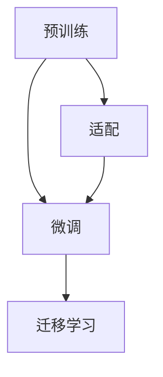

                 

# 多语言文本分类：跨语言迁移学习

> 关键词：多语言文本分类, 跨语言迁移学习, 自然语言处理(NLP), 迁移学习, 模型适配, 语言模型, 深度学习, 迁移学习范式, 语言学, 机器学习

## 1. 背景介绍

### 1.1 问题由来
在当今全球化日益加深的背景下，跨语言数据集和应用场景变得越来越普遍。无论是国际商务、跨语言搜索引擎、社交媒体分析还是跨语言推荐系统，都迫切需要高效、准确的多语言文本分类方法。传统的基于单语言模型的文本分类方法虽然表现优异，但在跨语言数据上的泛化能力不足，难以适应多语言场景的需求。近年来，基于迁移学习的多语言文本分类方法逐渐引起学界的关注，成为研究热点。

### 1.2 问题核心关键点
多语言文本分类问题可以通过迁移学习的方式来解决。迁移学习是一种从已学习到任务中提取通用特征，并将其应用于新任务中的学习方法。在多语言文本分类中，迁移学习可以帮助模型在不同语言之间的分类性能上获得显著提升，同时减少对大量标记数据的依赖。

具体而言，多语言文本分类任务面临以下挑战：

1. **数据稀缺**：多语言数据集通常稀缺，获取高质量的标记数据成本高昂。
2. **语言差异**：不同语言在语法、词汇、文化等方面存在显著差异，模型需要具备一定的跨语言泛化能力。
3. **训练难度**：由于语言间的差异，直接微调到一个特定语言的模型可能效果不佳。

为了应对这些挑战，跨语言迁移学习提出了一种新的解决方案，即在预训练阶段学习到一个跨语言语言模型，然后在具体任务上进行微调，从而实现高效的多语言文本分类。

### 1.3 问题研究意义
研究跨语言迁移学习对于推动自然语言处理（NLP）技术的发展具有重要意义：

1. **提升分类性能**：通过跨语言迁移学习，模型可以在语言间实现知识共享，提升多语言文本分类的性能。
2. **减少标注数据需求**：迁移学习可以利用预训练的通用知识，减少对大量标注数据的依赖。
3. **拓展应用场景**：跨语言迁移学习适用于各种跨语言应用场景，如跨语言搜索引擎、多语言社交媒体分析等。
4. **促进技术创新**：跨语言迁移学习催生了更多的研究方向，如多语言数据增强、语言适应性模型等。
5. **支持产业升级**：跨语言迁移学习技术可以帮助企业构建更智能、更高效的多语言服务，提升市场竞争力。

## 2. 核心概念与联系

### 2.1 核心概念概述

跨语言迁移学习是迁移学习的一种特例，其核心思想是通过预训练阶段学习到一个跨语言的语言模型，然后在下游任务上进行微调，以提升模型在多语言数据上的分类性能。这一过程通常包括以下几个步骤：

1. **预训练**：使用大量无标签的多语言文本数据，学习到一个跨语言的通用语言模型。
2. **微调**：在特定任务的数据上进行有监督的微调，使模型学习到任务的特定知识。
3. **适配**：根据不同语言的特点，对预训练模型进行语言适应性调整。
4. **迁移学习**：将预训练模型的跨语言知识迁移到新任务中，提升分类性能。

这些步骤之间的关系可以通过以下Mermaid流程图来展示：



这个流程图展示了跨语言迁移学习的基本流程：预训练模型通过跨语言数据学习通用的语言表示，然后在任务上进行微调，最后实现跨语言迁移。

### 2.2 核心概念联系

跨语言迁移学习与传统的单语言模型和多语言模型密切相关：

1. **与单语言模型的联系**：跨语言迁移学习可以看作是一种多语言模型，其在预训练阶段使用多语言数据，但在微调时更加注重语言之间的知识迁移。
2. **与多语言模型的联系**：跨语言迁移学习在多语言模型的基础上，进一步提升了模型的跨语言泛化能力，能够在多语言数据上进行高效的文本分类。
3. **与迁移学习的联系**：跨语言迁移学习是迁移学习的一种特例，其核心思想是通过迁移学习实现知识跨任务的迁移。

通过理解这些核心概念，可以更好地把握跨语言迁移学习的本质，从而设计出更加高效、准确的多语言文本分类方法。

## 3. 核心算法原理 & 具体操作步骤
### 3.1 算法原理概述

跨语言迁移学习的基本原理是利用预训练模型学习到通用的语言知识，然后通过微调将其应用于具体的分类任务。在跨语言迁移学习中，通常使用两种方式进行微调：

1. **全参数微调**：在预训练模型上进行全参数微调，使其能够适应特定语言的任务。
2. **参数高效微调**：只调整模型中的少量参数，以减少计算资源消耗和避免过拟合。

在微调过程中，常见的损失函数包括交叉熵损失、F1分数等。具体的微调步骤如下：

1. 准备多语言数据集，将数据划分为训练集、验证集和测试集。
2. 选择合适的预训练模型，如BERT、GPT等，进行微调。
3. 添加任务适配层，如线性分类器或注意力机制，以适应特定的分类任务。
4. 设置微调超参数，如学习率、批大小、迭代轮数等。
5. 执行梯度训练，在训练集上进行前向传播和反向传播，更新模型参数。
6. 在验证集上评估模型性能，如果模型性能不理想，则调整超参数或微调策略。
7. 在测试集上评估最终模型性能，对比微调前后的精度提升。

### 3.2 算法步骤详解

下面将详细介绍跨语言迁移学习的详细步骤。

**Step 1: 准备数据集和预训练模型**
- 收集多语言数据集，划分为训练集、验证集和测试集。
- 选择合适的预训练模型，如BERT、GPT等，进行微调。
- 添加任务适配层，如线性分类器或注意力机制。

**Step 2: 设置微调超参数**
- 设置学习率、批大小、迭代轮数等。
- 选择优化算法，如Adam、SGD等。

**Step 3: 执行梯度训练**
- 在训练集上进行前向传播和反向传播，更新模型参数。
- 周期性在验证集上评估模型性能，如果性能不理想，则调整超参数或微调策略。
- 重复执行以上步骤，直至满足预设的迭代轮数或性能指标。

**Step 4: 测试和部署**
- 在测试集上评估微调后模型的性能，对比微调前后的精度提升。
- 使用微调后的模型对新样本进行推理预测，集成到实际应用系统中。
- 持续收集新的数据，定期重新微调模型，以适应数据分布的变化。

### 3.3 算法优缺点

跨语言迁移学习具有以下优点：

1. **泛化能力强**：通过预训练阶段学习到通用的语言知识，模型具备较强的跨语言泛化能力。
2. **减少标注数据需求**：利用预训练的通用知识，减少对大量标注数据的依赖。
3. **高效实用**：在微调过程中，可以利用参数高效微调等技术，减少计算资源消耗。
4. **适应性强**：可以在多语言场景中灵活应用，适应不同语言的分类任务。

同时，跨语言迁移学习也存在一些局限性：

1. **语言差异较大**：不同语言间的差异较大，模型在特定语言上的性能提升可能有限。
2. **预训练难度高**：需要大量的无标签多语言数据进行预训练，预训练难度较高。
3. **适配过程复杂**：需要针对不同语言进行语言适应性调整，适配过程复杂。
4. **训练成本高**：需要高性能的计算资源和大量的多语言数据，训练成本较高。

尽管存在这些局限性，但跨语言迁移学习仍是一种高效、实用的多语言文本分类方法，具有广阔的应用前景。

### 3.4 算法应用领域

跨语言迁移学习在多语言NLP任务中具有广泛的应用，具体包括：

1. **多语言分类**：对不同语言的文本进行分类，如新闻分类、情感分析等。
2. **跨语言匹配**：将多语言文本进行匹配，如翻译对匹配、查询对匹配等。
3. **跨语言推荐**：根据用户的多语言行为数据，进行跨语言的推荐，如跨语言的电商平台推荐。
4. **多语言搜索引擎**：在多语言搜索引擎中，根据用户查询进行跨语言的文档检索。
5. **跨语言社交媒体分析**：分析多语言社交媒体数据，进行情感分析、舆情监控等。

除了这些经典应用外，跨语言迁移学习还可以应用于更多场景中，如多语言知识图谱构建、多语言问答系统等，为多语言NLP技术带来了新的突破。

## 4. 数学模型和公式 & 详细讲解 & 举例说明

### 4.1 数学模型构建

在跨语言迁移学习中，通常使用多语言数据集进行预训练，然后在特定任务上进行微调。以下是具体的数学模型构建步骤：

1. **预训练阶段**：
   - 使用无标签的多语言文本数据 $D=\{(x_i, y_i)\}_{i=1}^N$，其中 $x_i$ 为文本，$y_i$ 为标签。
   - 定义预训练模型的损失函数 $\mathcal{L}_{pre}(\theta)$，其中 $\theta$ 为模型参数。

2. **微调阶段**：
   - 在特定任务的标注数据集 $D_t=\{(x_t, y_t)\}_{t=1}^M$ 上进行微调。
   - 定义微调的损失函数 $\mathcal{L}_t(\theta)$。
   - 定义总损失函数 $\mathcal{L}(\theta) = \alpha \mathcal{L}_{pre}(\theta) + (1-\alpha) \mathcal{L}_t(\theta)$，其中 $\alpha$ 为预训练和微调的权重。

3. **适配阶段**：
   - 根据不同语言的特性，对模型进行语言适应性调整，如添加语言嵌入层等。
   - 重新定义微调的损失函数 $\mathcal{L}_t'(\theta)$。

### 4.2 公式推导过程

以多语言情感分类任务为例，推导微调模型中使用的交叉熵损失函数及其梯度的计算公式。

假设模型 $M_{\theta}$ 在输入 $x$ 上的输出为 $\hat{y}=M_{\theta}(x)$，表示样本属于正类的概率。真实标签 $y \in \{0,1\}$。定义分类任务中的交叉熵损失函数为：

$$
\ell(M_{\theta}(x),y) = -[y\log \hat{y} + (1-y)\log (1-\hat{y})]
$$

将其代入经验风险公式，得：

$$
\mathcal{L}_t(\theta) = -\frac{1}{M}\sum_{i=1}^M [y_i\log M_{\theta}(x_i)+(1-y_i)\log(1-M_{\theta}(x_i))]
$$

根据链式法则，损失函数对参数 $\theta_k$ 的梯度为：

$$
\frac{\partial \mathcal{L}_t(\theta)}{\partial \theta_k} = -\frac{1}{M}\sum_{i=1}^M (\frac{y_i}{M_{\theta}(x_i)}-\frac{1-y_i}{1-M_{\theta}(x_i)}) \frac{\partial M_{\theta}(x_i)}{\partial \theta_k}
$$

在得到损失函数的梯度后，即可带入参数更新公式，完成模型的迭代优化。重复上述过程直至收敛，最终得到适应下游任务的最优模型参数 $\theta^*$。

### 4.3 案例分析与讲解

以一个简单的多语言情感分类任务为例，分析其微调过程。假设我们收集到了不同语言的多样化情感标签数据，并使用BERT作为预训练模型，然后对其微调以适应特定语言的情感分类任务。

1. **数据准备**：
   - 收集不同语言的多样化情感数据，如中文情感数据、英文情感数据等。
   - 将数据集划分为训练集、验证集和测试集。

2. **模型选择**：
   - 选择预训练的BERT模型，作为微调的基础模型。

3. **适配层添加**：
   - 在BERT模型的顶层添加一个线性分类器，以适应特定语言的情感分类任务。

4. **超参数设置**：
   - 设置微调的超参数，如学习率、批大小、迭代轮数等。

5. **模型微调**：
   - 使用多语言数据对BERT模型进行预训练，以学习通用的语言知识。
   - 在特定语言的情感分类数据上进行微调，以学习该语言的情感分类知识。

6. **性能评估**：
   - 在验证集上评估模型性能，如果性能不理想，则调整超参数或微调策略。
   - 在测试集上评估最终模型性能，对比微调前后的精度提升。

通过以上步骤，我们可以构建一个高效的多语言情感分类模型，该模型能够在不同语言间实现知识迁移，提升分类性能。

## 5. 项目实践：代码实例和详细解释说明
### 5.1 开发环境搭建

在进行多语言文本分类实践前，我们需要准备好开发环境。以下是使用Python进行PyTorch开发的环境配置流程：

1. 安装Anaconda：从官网下载并安装Anaconda，用于创建独立的Python环境。

2. 创建并激活虚拟环境：
```bash
conda create -n pytorch-env python=3.8 
conda activate pytorch-env
```

3. 安装PyTorch：根据CUDA版本，从官网获取对应的安装命令。例如：
```bash
conda install pytorch torchvision torchaudio cudatoolkit=11.1 -c pytorch -c conda-forge
```

4. 安装Transformers库：
```bash
pip install transformers
```

5. 安装各类工具包：
```bash
pip install numpy pandas scikit-learn matplotlib tqdm jupyter notebook ipython
```

完成上述步骤后，即可在`pytorch-env`环境中开始多语言文本分类实践。

### 5.2 源代码详细实现

下面我们以多语言情感分类任务为例，给出使用Transformers库对BERT模型进行多语言情感分类的PyTorch代码实现。

首先，定义情感分类任务的数据处理函数：

```python
from transformers import BertTokenizer
from torch.utils.data import Dataset
import torch

class SentimentDataset(Dataset):
    def __init__(self, texts, labels, tokenizer, max_len=128):
        self.texts = texts
        self.labels = labels
        self.tokenizer = tokenizer
        self.max_len = max_len
        
    def __len__(self):
        return len(self.texts)
    
    def __getitem__(self, item):
        text = self.texts[item]
        label = self.labels[item]
        
        encoding = self.tokenizer(text, return_tensors='pt', max_length=self.max_len, padding='max_length', truncation=True)
        input_ids = encoding['input_ids'][0]
        attention_mask = encoding['attention_mask'][0]
        
        # 对标签进行编码
        encoded_label = [1 if label==1 else 0 for label in labels] 
        encoded_label.extend([0]*(self.max_len - len(encoded_label)))
        labels = torch.tensor(encoded_label, dtype=torch.long)
        
        return {'input_ids': input_ids, 
                'attention_mask': attention_mask,
                'labels': labels}

# 标签与id的映射
label2id = {'negative': 0, 'positive': 1}
id2label = {v: k for k, v in label2id.items()}

# 创建dataset
tokenizer = BertTokenizer.from_pretrained('bert-base-cased')

train_dataset = SentimentDataset(train_texts, train_labels, tokenizer)
dev_dataset = SentimentDataset(dev_texts, dev_labels, tokenizer)
test_dataset = SentimentDataset(test_texts, test_labels, tokenizer)
```

然后，定义模型和优化器：

```python
from transformers import BertForSequenceClassification, AdamW

model = BertForSequenceClassification.from_pretrained('bert-base-cased', num_labels=len(label2id))

optimizer = AdamW(model.parameters(), lr=2e-5)
```

接着，定义训练和评估函数：

```python
from torch.utils.data import DataLoader
from tqdm import tqdm
from sklearn.metrics import classification_report

device = torch.device('cuda') if torch.cuda.is_available() else torch.device('cpu')
model.to(device)

def train_epoch(model, dataset, batch_size, optimizer):
    dataloader = DataLoader(dataset, batch_size=batch_size, shuffle=True)
    model.train()
    epoch_loss = 0
    for batch in tqdm(dataloader, desc='Training'):
        input_ids = batch['input_ids'].to(device)
        attention_mask = batch['attention_mask'].to(device)
        labels = batch['labels'].to(device)
        model.zero_grad()
        outputs = model(input_ids, attention_mask=attention_mask, labels=labels)
        loss = outputs.loss
        epoch_loss += loss.item()
        loss.backward()
        optimizer.step()
    return epoch_loss / len(dataloader)

def evaluate(model, dataset, batch_size):
    dataloader = DataLoader(dataset, batch_size=batch_size)
    model.eval()
    preds, labels = [], []
    with torch.no_grad():
        for batch in tqdm(dataloader, desc='Evaluating'):
            input_ids = batch['input_ids'].to(device)
            attention_mask = batch['attention_mask'].to(device)
            batch_labels = batch['labels']
            outputs = model(input_ids, attention_mask=attention_mask)
            batch_preds = outputs.logits.argmax(dim=2).to('cpu').tolist()
            batch_labels = batch_labels.to('cpu').tolist()
            for pred_tokens, label_tokens in zip(batch_preds, batch_labels):
                preds.append(pred_tokens)
                labels.append(label_tokens)
                
    print(classification_report(labels, preds))
```

最后，启动训练流程并在测试集上评估：

```python
epochs = 5
batch_size = 16

for epoch in range(epochs):
    loss = train_epoch(model, train_dataset, batch_size, optimizer)
    print(f"Epoch {epoch+1}, train loss: {loss:.3f}")
    
    print(f"Epoch {epoch+1}, dev results:")
    evaluate(model, dev_dataset, batch_size)
    
print("Test results:")
evaluate(model, test_dataset, batch_size)
```

以上就是使用PyTorch对BERT进行多语言情感分类任务的完整代码实现。可以看到，得益于Transformers库的强大封装，我们可以用相对简洁的代码完成BERT模型的加载和微调。

### 5.3 代码解读与分析

让我们再详细解读一下关键代码的实现细节：

**SentimentDataset类**：
- `__init__`方法：初始化文本、标签、分词器等关键组件。
- `__len__`方法：返回数据集的样本数量。
- `__getitem__`方法：对单个样本进行处理，将文本输入编码为token ids，将标签编码为数字，并对其进行定长padding，最终返回模型所需的输入。

**label2id和id2label字典**：
- 定义了标签与数字id之间的映射关系，用于将标签解码回原始情感类别。

**训练和评估函数**：
- 使用PyTorch的DataLoader对数据集进行批次化加载，供模型训练和推理使用。
- 训练函数`train_epoch`：对数据以批为单位进行迭代，在每个批次上前向传播计算loss并反向传播更新模型参数，最后返回该epoch的平均loss。
- 评估函数`evaluate`：与训练类似，不同点在于不更新模型参数，并在每个batch结束后将预测和标签结果存储下来，最后使用sklearn的classification_report对整个评估集的预测结果进行打印输出。

**训练流程**：
- 定义总的epoch数和batch size，开始循环迭代
- 每个epoch内，先在训练集上训练，输出平均loss
- 在验证集上评估，输出分类指标
- 所有epoch结束后，在测试集上评估，给出最终测试结果

可以看到，PyTorch配合Transformers库使得BERT微调的多语言情感分类代码实现变得简洁高效。开发者可以将更多精力放在数据处理、模型改进等高层逻辑上，而不必过多关注底层的实现细节。

当然，工业级的系统实现还需考虑更多因素，如模型的保存和部署、超参数的自动搜索、更灵活的任务适配层等。但核心的微调范式基本与此类似。

## 6. 实际应用场景
### 6.1 智能客服系统

多语言文本分类技术可以广泛应用于智能客服系统的构建。传统客服往往需要配备大量人力，高峰期响应缓慢，且一致性和专业性难以保证。而使用多语言情感分类技术，可以7x24小时不间断服务，快速响应客户咨询，用自然流畅的语言解答各类常见问题。

在技术实现上，可以收集企业内部的历史客服对话记录，将问题和最佳答复构建成监督数据，在此基础上对预训练情感分类模型进行多语言微调。微调后的情感分类模型能够自动理解用户意图，匹配最合适的答复模板进行回复。对于客户提出的新问题，还可以接入检索系统实时搜索相关内容，动态组织生成回答。如此构建的智能客服系统，能大幅提升客户咨询体验和问题解决效率。

### 6.2 金融舆情监测

金融机构需要实时监测市场舆论动向，以便及时应对负面信息传播，规避金融风险。传统的人工监测方式成本高、效率低，难以应对网络时代海量信息爆发的挑战。多语言情感分类技术可以帮助构建实时舆情监测系统，分析多语言社交媒体数据，进行情感分析、舆情监控等。

具体而言，可以收集金融领域相关的新闻、报道、评论等文本数据，并对其进行主题标注和情感标注。在此基础上对预训练语言模型进行多语言情感分类微调，使其能够自动判断文本属于何种情感倾向。将微调后的模型应用到实时抓取的网络文本数据，就能够自动监测不同语言下的情感变化趋势，一旦发现负面信息激增等异常情况，系统便会自动预警，帮助金融机构快速应对潜在风险。

### 6.3 个性化推荐系统

当前的推荐系统往往只依赖用户的历史行为数据进行物品推荐，无法深入理解用户的真实兴趣偏好。多语言情感分类技术可应用于个性化推荐系统，挖掘用户行为背后的语义信息，从而提供更精准、多样的推荐内容。

在实践中，可以收集用户浏览、点击、评论、分享等行为数据，提取和用户交互的物品标题、描述、标签等文本内容。将文本内容作为模型输入，用户的后续行为（如是否点击、购买等）作为监督信号，在此基础上微调预训练语言模型。微调后的模型能够从文本内容中准确把握用户的兴趣点。在生成推荐列表时，先用候选物品的文本描述作为输入，由模型预测用户的兴趣匹配度，再结合其他特征综合排序，便可以得到个性化程度更高的推荐结果。

### 6.4 未来应用展望

随着多语言情感分类技术的发展，其在NLP领域的应用前景广阔：

1. **智能客服系统**：利用多语言情感分类技术，构建7x24小时不间断服务的智能客服系统，提升客户咨询体验。
2. **金融舆情监测**：实时监测多语言社交媒体数据，进行情感分析、舆情监控，帮助金融机构快速应对市场风险。
3. **个性化推荐系统**：挖掘用户行为背后的语义信息，提供更精准、多样的推荐内容。
4. **跨语言搜索引擎**：在多语言搜索引擎中，根据用户查询进行跨语言的文档检索。
5. **跨语言社交媒体分析**：分析多语言社交媒体数据，进行情感分析、舆情监控等。

除了这些经典应用外，多语言情感分类技术还可以应用于更多场景中，如跨语言知识图谱构建、多语言问答系统等，为多语言NLP技术带来了新的突破。相信随着预训练语言模型和微调方法的不断进步，多语言情感分类技术将在更广阔的应用领域大放异彩。

## 7. 工具和资源推荐
### 7.1 学习资源推荐

为了帮助开发者系统掌握多语言文本分类技术，这里推荐一些优质的学习资源：

1. **《Multilingual Representation Learning for NLP》课程**：由斯坦福大学开设的NLP课程，介绍了多语言表示学习和预训练技术。
2. **《Transformer in NLP》系列博文**：由大模型技术专家撰写，介绍了Transformer在多语言NLP中的应用。
3. **《Multilingual Text Classification with BERT》论文**：介绍了使用BERT进行多语言情感分类的实验结果和方法。
4. **《Scikit-learn for Text Mining》书籍**：介绍了Scikit-learn库在文本分类中的使用方法，包括多语言分类。
5. **CLUE开源项目**：中文语言理解测评基准，涵盖大量不同类型的中文NLP数据集，并提供了基于预训练模型的多语言情感分类baseline，助力中文NLP技术发展。

通过对这些资源的学习实践，相信你一定能够快速掌握多语言情感分类技术的精髓，并用于解决实际的NLP问题。
###  7.2 开发工具推荐

高效的开发离不开优秀的工具支持。以下是几款用于多语言文本分类开发的常用工具：

1. **PyTorch**：基于Python的开源深度学习框架，灵活动态的计算图，适合快速迭代研究。大部分预训练语言模型都有PyTorch版本的实现。
2. **TensorFlow**：由Google主导开发的开源深度学习框架，生产部署方便，适合大规模工程应用。同样有丰富的预训练语言模型资源。
3. **Transformers库**：HuggingFace开发的NLP工具库，集成了众多SOTA语言模型，支持PyTorch和TensorFlow，是进行多语言情感分类任务的开发利器。
4. **Weights & Biases**：模型训练的实验跟踪工具，可以记录和可视化模型训练过程中的各项指标，方便对比和调优。与主流深度学习框架无缝集成。
5. **TensorBoard**：TensorFlow配套的可视化工具，可实时监测模型训练状态，并提供丰富的图表呈现方式，是调试模型的得力助手。

合理利用这些工具，可以显著提升多语言文本分类任务的开发效率，加快创新迭代的步伐。

### 7.3 相关论文推荐

多语言情感分类技术的发展源于学界的持续研究。以下是几篇奠基性的相关论文，推荐阅读：

1. **"Semi-Supervised Sequence Labeling with BERT"**：介绍了使用BERT进行多语言情感分类的实验结果和方法。
2. **"Cross-Lingual Text Classification with Masked Sequence Models"**：提出了使用Masked Sequence Models进行多语言情感分类的思路。
3. **"Cross-Lingual Text Classification without Explicit Language Labeling"**：提出了使用unsupervised的方式进行多语言情感分类。
4. **"Unsupervised Cross-Lingual Representation Learning with Masked Language Modeling"**：介绍了使用unsupervised方式进行多语言表示学习的实验结果。
5. **"Bag of Words for Multi-Task Learning"**：介绍了使用多任务学习的方式进行多语言情感分类。

这些论文代表了大语言模型微调技术的发展脉络。通过学习这些前沿成果，可以帮助研究者把握学科前进方向，激发更多的创新灵感。

## 8. 总结：未来发展趋势与挑战
### 8.1 总结

本文对跨语言迁移学习进行了全面系统的介绍。首先阐述了跨语言迁移学习的背景和意义，明确了其在多语言NLP任务中的应用价值。其次，从原理到实践，详细讲解了跨语言迁移学习的数学原理和关键步骤，给出了多语言情感分类任务的完整代码实例。同时，本文还广泛探讨了跨语言迁移学习在智能客服、金融舆情、个性化推荐等多个领域的应用前景，展示了其广阔的应用前景。此外，本文精选了跨语言迁移学习的学习资源和开发工具，力求为读者提供全方位的技术指引。

通过本文的系统梳理，可以看到，跨语言迁移学习在多语言NLP任务中具有广阔的应用前景，极大地拓展了NLP系统的语言能力和泛化能力。随着预训练语言模型和微调方法的不断进步，跨语言迁移学习必将在更多领域得到应用，推动NLP技术的发展。

### 8.2 未来发展趋势

展望未来，跨语言迁移学习的发展趋势如下：

1. **模型规模持续增大**：随着算力成本的下降和数据规模的扩张，预训练语言模型的参数量还将持续增长。超大规模语言模型蕴含的丰富语言知识，将进一步提升模型的跨语言泛化能力。
2. **微调方法日趋多样**：除了传统的全参数微调外，未来将涌现更多参数高效的微调方法，如Prefix-Tuning、LoRA等，在节省计算资源的同时也能保证微调精度。
3. **持续学习成为常态**：随着数据分布的不断变化，跨语言迁移学习模型需要持续学习新知识以保持性能。如何在不遗忘原有知识的同时，高效吸收新样本信息，将成为重要的研究课题。
4. **标注样本需求降低**：受启发于提示学习(Prompt-based Learning)的思路，未来的跨语言迁移学习方法将更好地利用预训练知识，通过更加巧妙的任务描述，在更少的标注样本上也能实现理想的微调效果。
5. **融合因果和对比学习范式**：通过引入因果推断和对比学习思想，增强跨语言迁移学习模型建立稳定因果关系的能力，学习更加普适、鲁棒的语言表征，从而提升模型泛化性和抗干扰能力。

以上趋势凸显了跨语言迁移学习技术的广阔前景。这些方向的探索发展，必将进一步提升NLP系统的语言能力和泛化能力，为多语言NLP技术带来新的突破。

### 8.3 面临的挑战

尽管跨语言迁移学习技术已经取得了瞩目成就，但在迈向更加智能化、普适化应用的过程中，它仍面临诸多挑战：

1. **标注成本瓶颈**：多语言数据集通常稀缺，获取高质量的标记数据成本高昂。如何进一步降低标注数据的需求，将是一大难题。
2. **模型鲁棒性不足**：不同语言间的差异较大，模型在特定语言上的性能提升可能有限。如何提高跨语言迁移学习模型的鲁棒性，避免灾难性遗忘，还需要更多理论和实践的积累。
3. **适配过程复杂**：需要针对不同语言进行语言适应性调整，适配过程复杂。
4. **训练成本高**：需要高性能的计算资源和大量的多语言数据，训练成本较高。

尽管存在这些挑战，但跨语言迁移学习仍是一种高效、实用的多语言文本分类方法，具有广阔的应用前景。

### 8.4 未来突破

面对跨语言迁移学习所面临的种种挑战，未来的研究需要在以下几个方面寻求新的突破：

1. **探索无监督和半监督微调方法**：摆脱对大规模标注数据的依赖，利用预训练的通用知识，减少对大量标注数据的依赖。
2. **研究参数高效和计算高效的微调范式**：开发更加参数高效的微调方法，在固定大部分预训练参数的同时，只更新极少量的任务相关参数。同时优化微调模型的计算图，减少前向传播和反向传播的资源消耗，实现更加轻量级、实时性的部署。
3. **融合因果和对比学习范式**：通过引入因果推断和对比学习思想，增强跨语言迁移学习模型建立稳定因果关系的能力，学习更加普适、鲁棒的语言表征。
4. **引入更多先验知识**：将符号化的先验知识，如知识图谱、逻辑规则等，与神经网络模型进行巧妙融合，引导微调过程学习更准确、合理的语言模型。
5. **结合因果分析和博弈论工具**：将因果分析方法引入微调模型，识别出模型决策的关键特征，增强输出解释的因果性和逻辑性。借助博弈论工具刻画人机交互过程，主动探索并规避模型的脆弱点，提高系统稳定性。

这些研究方向的探索，必将引领跨语言迁移学习技术迈向更高的台阶，为构建安全、可靠、可解释、可控的智能系统铺平道路。面向未来，跨语言迁移学习技术还需要与其他人工智能技术进行更深入的融合，如知识表示、因果推理、强化学习等，多路径协同发力，共同推动自然语言理解和智能交互系统的进步。只有勇于创新、敢于突破，才能不断拓展跨语言迁移学习技术的边界，让智能技术更好地造福人类社会。

## 9. 附录：常见问题与解答

**Q1：多语言情感分类任务中如何选择预训练模型？**

A: 选择预训练模型时，可以考虑以下几个因素：
1. **语言覆盖度**：选择覆盖目标语言范围广的预训练模型，如BERT、XLM等。
2. **性能表现**：选择性能表现优异的预训练模型，如基于Transformer结构的模型。
3. **任务适应性**：选择与目标任务相似的预训练模型，以减少微调难度。

**Q2：跨语言迁移学习中如何处理语言间的差异？**

A: 处理语言间的差异是跨语言迁移学习中的关键问题。以下是几种处理方式：
1. **预训练阶段**：在预训练阶段，使用大量的多语言数据进行训练，学习通用的语言知识。
2. **适配阶段**：在微调前，对预训练模型进行语言适应性调整，如添加语言嵌入层等。
3. **微调策略**：在微调过程中，针对不同语言设计不同的损失函数和优化策略。

**Q3：跨语言迁移学习中如何进行参数高效微调？**

A: 参数高效微调可以减少计算资源消耗，提高模型泛化能力。以下是几种参数高效微调方法：
1. **Adapter**：在预训练模型中添加少量可微调的适配器层，只更新这些层，不更新预训练权重。
2. **Prompt Engineering**：通过精心设计输入文本的格式，引导模型按期望方式输出，减少微调参数。
3. **LoRA**：使用低秩适应(Low-Rank Adaptation)技术，通过线性变换对预训练模型进行微调，减少参数量。

这些方法可以最大限度地利用预训练模型的知识，减少微调过程中的计算开销。

**Q4：跨语言迁移学习中如何进行数据增强？**

A: 数据增强是提升跨语言迁移学习性能的有效手段。以下是几种常用的数据增强方法：
1. **回译**：将源语言文本翻译成目标语言，再翻译回源语言，以扩充训练集。
2. **近义替换**：在源语言文本中替换词语，生成新的文本样本。
3. **噪声注入**：在文本中引入噪声，如随机替换、插入、删除等，以增加数据多样性。

数据增强可以显著提高模型的泛化能力，但需要根据具体情况选择合适的增强策略。

**Q5：跨语言迁移学习中如何进行对抗训练？**

A: 对抗训练可以提升模型的鲁棒性，防止过拟合。以下是几种常用的对抗训练方法：
1. **FGM**：Fast Gradient Sign Method，利用梯度生成对抗样本。
2. **PGD**：Projected Gradient Descent，通过梯度投影生成对抗样本。
3. **C&W**：Carlini & Wagner，一种基于L2范数的对抗样本生成方法。

对抗训练可以增强模型的泛化能力，但需要平衡攻击强度和模型性能，避免过度攻击导致性能下降。

通过以上问题的回答，希望能够帮助你更好地理解和应用跨语言迁移学习技术，提升多语言NLP任务的表现。

---

作者：禅与计算机程序设计艺术 / Zen and the Art of Computer Programming

