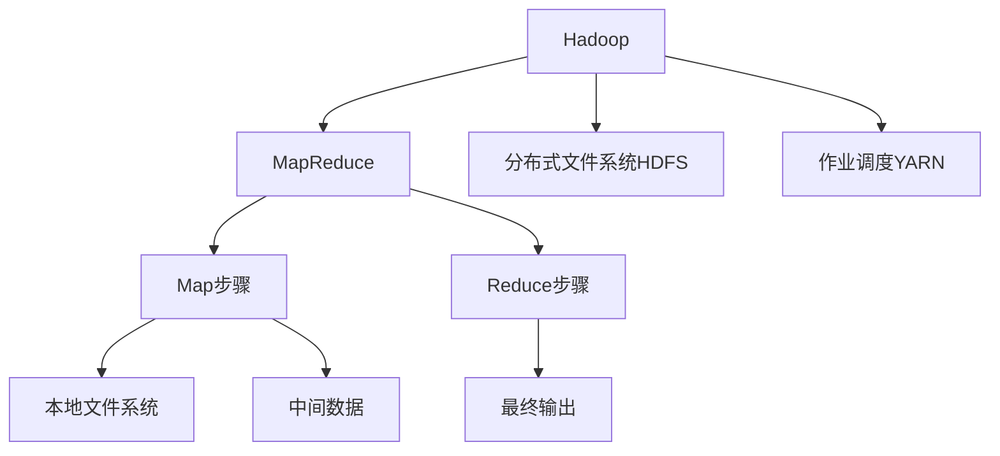

                 

# 大数据分析：Hadoop 和 Spark

> 关键词：大数据分析, Hadoop, Spark, MapReduce, 分布式计算, 数据处理, 数据仓库, 数据挖掘, 实时计算

## 1. 背景介绍

在信息化快速发展的今天，企业面临着海量数据爆炸式增长的挑战。如何在数据规模不断扩大的情况下，高效、可靠地存储、处理、分析数据，成为企业决策支持系统的重要问题。大数据技术的兴起，提供了崭新的解决方案，使得企业能够更好地利用数据资产，驱动业务创新。

在这一背景下，Hadoop和Spark作为最流行的两种大数据处理框架，各自有着独特的优势和适用场景。Hadoop以其强大的存储和批处理能力著称，适用于海量离线数据的批处理场景。而Spark则通过其高效、灵活的内存计算能力，成为实时数据处理和机器学习计算的首选。本文将从核心概念、算法原理、实际应用等方面，对Hadoop和Spark进行系统介绍，帮助读者深入理解其工作机制和应用价值。

## 2. 核心概念与联系

### 2.1 核心概念概述

为了更好地理解Hadoop和Spark，我们先来介绍几个关键的核心概念：

- **Hadoop**：由Apache基金会发起的开源分布式计算项目，包括HDFS分布式文件系统和MapReduce计算模型，旨在提供大尺度数据处理的解决方案。

- **Spark**：由Apache基金会发起的另一个开源计算框架，基于内存计算，提供了更高效、灵活的数据处理和机器学习计算能力。

- **MapReduce**：一种编程模型和计算框架，用于分布式计算，其主要思想是将大规模任务分解为“Map”和“Reduce”两个步骤。

- **分布式计算**：将任务分解成多个小任务，由多台计算机并行处理，以提高计算效率。

- **数据仓库**：用于集中存储企业历史数据的平台，支持高效的数据查询和分析。

- **数据挖掘**：从大量数据中提取有用信息，帮助企业发现潜在的商业机会和趋势。

- **实时计算**：指在数据产生后实时进行计算，确保分析结果的及时性。

- **机器学习**：利用算法和模型从数据中学习规律，进行预测和决策。

这些核心概念构成了大数据处理的基础框架，彼此相互联系，共同支撑了数据处理和分析的全过程。

### 2.2 核心概念原理和架构的 Mermaid 流程图



## 3. 核心算法原理 & 具体操作步骤

### 3.1 算法原理概述

Hadoop和Spark的核心算法原理主要围绕着数据分布式存储和计算展开。Hadoop主要依赖MapReduce模型，通过“分而治之”的方式，将大规模任务拆分成多个小任务，分布式并行处理。Spark则在此基础上，引入了内存计算和分布式图计算，进一步提升了数据处理的效率和灵活性。

### 3.2 算法步骤详解

#### Hadoop的MapReduce算法步骤：

1. **数据输入与分割**：
   将输入数据分成多个小的数据块，并分配给不同的节点进行处理。

2. **Map阶段**：
   每个节点对各自的数据块进行映射，将数据转换为键值对形式。

3. **Shuffle阶段**：
   将Map阶段生成的键值对进行排序和分组，准备进入Reduce阶段。

4. **Reduce阶段**：
   对分组后的键值对进行聚合操作，最终输出结果。

#### Spark的内存计算和图计算算法步骤：

1. **数据加载**：
   将数据从文件系统加载到内存中，建立弹性分布式数据集（RDD）。

2. **转换操作**：
   对RDD进行变换操作，如过滤、映射、聚合等，生成新的RDD。

3. **持久化操作**：
   将计算结果保存为内存中的持久变量（如MemoryStage），以便后续使用。

4. **计算操作**：
   对持久变量进行计算，如执行聚合函数、机器学习算法等，生成最终结果。

### 3.3 算法优缺点

#### Hadoop的优缺点：

- **优点**：
  - 存储和批处理能力强，适用于大规模离线数据的处理。
  - 灵活性高，支持多种数据格式和文件系统。
  - 易于扩展，可以根据需要增加节点。

- **缺点**：
  - 处理速度较慢，延迟较高。
  - 内存利用率低，数据读写开销大。

#### Spark的优缺点：

- **优点**：
  - 内存计算效率高，适用于实时数据处理和交互式查询。
  - 灵活性高，支持多种数据源和计算模型。
  - 扩展性强，可以轻松处理海量数据。

- **缺点**：
  - 内存占用大，对硬件要求高。
  - 实时计算和批处理性能平衡较难控制。

### 3.4 算法应用领域

Hadoop和Spark在多个领域有着广泛的应用：

- **数据仓库构建**：
  利用Hadoop和Spark对大规模数据进行存储和分析，支持高效的数据仓库建设。

- **商业智能分析**：
  基于Hadoop和Spark进行数据清洗、挖掘和可视化，支持商业智能报告的生成。

- **机器学习和预测分析**：
  利用Spark的机器学习库（如MLlib）进行模型训练和预测，提升业务决策的准确性。

- **实时数据处理**：
  通过Spark Streaming进行实时数据流处理，支持实时业务监控和报警。

- **大数据挖掘与发现**：
  利用Hadoop和Spark进行大规模数据挖掘，发现数据中的潜在规律和模式。

## 4. 数学模型和公式 & 详细讲解 & 举例说明

### 4.1 数学模型构建

#### Hadoop的MapReduce模型：

- **数据输入**：$D=\{k_1, v_1, k_2, v_2, \ldots, k_n, v_n\}$，其中$k$为键，$v$为值。
- **Map函数**：$M(k_i, v_i) = (k_i', v_i')$，其中$k_i'$和$v_i'$为映射后的键和值。
- **Shuffle与Reduce函数**：$R(\{(k_i', v_i'): k_i' = k\}) = \sum_{i} v_i'$。

#### Spark的内存计算模型：

- **RDD（弹性分布式数据集）**：$RDD = \{(v_i)\}_{i=1}^n$，其中$v_i$为内存中的数据值。
- **转换操作**：$RDD \xrightarrow[]{map/fusion/groupBy} RDD'$，其中map为逐元素操作，fusion和groupBy为聚合操作。
- **持久化操作**：$RDD \xrightarrow[]{persist/persistAs} MemoryStage$，其中persist和persistAs将RDD保存到内存中。
- **计算操作**：$MemoryStage \xrightarrow[]{action/operation} result$，其中action和operation为计算操作。

### 4.2 公式推导过程

以Hadoop的MapReduce模型为例，推导Map和Reduce阶段的计算公式：

- **Map阶段**：$M(k_i, v_i) = (k_i', v_i')$，其中$k_i'$和$v_i'$为映射后的键和值。
- **Reduce阶段**：$R(\{(k_i', v_i'): k_i' = k\}) = \sum_{i} v_i'$。

以上公式展示了MapReduce模型的工作原理，即通过Map和Reduce两个步骤，将大规模数据集分割处理，最终输出聚合结果。

### 4.3 案例分析与讲解

#### 案例一：Hadoop的WordCount

- **输入数据**：一个包含大量文本的文件。
- **Map函数**：将文本中的单词作为键，出现次数作为值。
- **Reduce函数**：对相同的键进行求和操作。

#### 案例二：Spark的Mllib机器学习

- **输入数据**：一个包含特征向量的数据集。
- **转换操作**：对数据集进行特征提取、归一化、分割等预处理操作。
- **计算操作**：使用K-means、随机森林等算法进行模型训练和预测。

## 5. 项目实践：代码实例和详细解释说明

### 5.1 开发环境搭建

1. **安装JDK**：
   ```bash
   sudo apt-get update
   sudo apt-get install openjdk-8-jdk
   ```

2. **安装Hadoop**：
   ```bash
   wget http://archive.apache.org/dist/hadoop/common/current/hadoop-2.7.1.tar.gz
   tar -xvf hadoop-2.7.1.tar.gz
   cd hadoop-2.7.1
   bin/hadoop version
   ```

3. **安装Spark**：
   ```bash
   wget http://spark.apache.org/downloads/latest/spark-2.4.7.tgz
   tar -xvf spark-2.4.7.tgz
   cd spark-2.4.7
   bin/spark version
   ```

### 5.2 源代码详细实现

#### Hadoop的WordCount

```python
# WordCount.py
from mrjob.job import MRJob

class MRWordCount(MRJob):
    def mapper(self, _, line):
        for word in line.split():
            yield word, 1
    
    def reducer(self, word, counts):
        yield word, sum(counts)

if __name__ == '__main__':
    MRWordCount.run()
```

#### Spark的Mllib机器学习

```python
# MllibPythonExample.py
from pyspark import SparkContext
from pyspark.mllib.regression import LabeledPoint, LinearRegressionModel
from pyspark.mllib.regression import LinearRegressionWithSGD

sc = SparkContext()
data = sc.textFile("data.txt")

# 特征提取和分割
features = data.map(lambda line: line.split(','))

# 转换为LabeledPoint格式
labeled_points = features.map(lambda x: LabeledPoint(float(x[0]), float(x[1])))

# 训练模型
model = LinearRegressionWithSGD.train(labeled_points, iterations=10, regParam=0.3, elasticNetParam=0.8)

# 预测
result = model.predict(LabeledPoint(0.0))

print(result)
```

### 5.3 代码解读与分析

#### Hadoop的WordCount代码解读：

- **Mapper**：将文本拆分成单词，并将每个单词出现的次数统计出来。
- **Reducer**：将相同单词出现的次数进行求和，最终输出单词及其总出现次数。

#### Spark的Mllib机器学习代码解读：

- **特征提取**：将文本数据分割成特征向量，并转换为LabeledPoint格式。
- **模型训练**：使用线性回归模型对数据进行训练，设置迭代次数和正则化参数。
- **预测**：对给定输入进行预测，输出预测结果。

### 5.4 运行结果展示

运行上述代码后，Hadoop的WordCount结果为单词及其出现次数的统计，Spark的Mllib机器学习结果为线性回归模型的预测输出。

## 6. 实际应用场景

### 6.1 数据仓库构建

企业可以使用Hadoop构建大规模数据仓库，支持历史数据的存储和分析。例如，某电商公司通过Hadoop存储用户行为数据，利用MapReduce模型进行数据清洗、统计和分析，生成历史销售报告和用户画像，支持业务决策和市场分析。

### 6.2 商业智能分析

利用Spark进行实时数据处理，结合商业智能工具（如Tableau、PowerBI）进行数据分析和可视化，生成动态的商业智能报表。某金融公司通过Spark对实时交易数据进行流处理和聚合，实时生成风险监控和投资报告，支持高频交易决策。

### 6.3 机器学习和预测分析

基于Hadoop和Spark进行大规模机器学习模型的训练和预测，提升业务决策的准确性。例如，某医疗公司使用Hadoop存储病人历史数据，通过Spark进行特征提取和模型训练，利用机器学习算法预测疾病风险，支持个性化治疗方案的设计。

### 6.4 实时数据处理

Spark Streaming提供实时的数据流处理能力，支持数据流计算和窗口计算，广泛应用于实时业务监控和预警系统。例如，某网络公司通过Spark Streaming对用户访问日志进行实时流处理，实时监控网站流量和用户行为，及时发现和处理异常情况。

### 6.5 大数据挖掘与发现

利用Hadoop和Spark进行大规模数据挖掘，发现数据中的潜在规律和模式，生成知识图谱和趋势报告。例如，某社交媒体公司通过Hadoop存储用户互动数据，利用Spark进行数据挖掘和模式发现，生成用户兴趣图谱和内容推荐策略。

## 7. 工具和资源推荐

### 7.1 学习资源推荐

为了帮助开发者掌握Hadoop和Spark的开发技能，以下是一些优质的学习资源：

1. **Hadoop官方文档**：提供详细的Hadoop安装和使用指南，涵盖HDFS、MapReduce、YARN等核心组件。

2. **Spark官方文档**：提供完整的Spark安装和使用指南，涵盖Spark Core、Spark SQL、Spark Streaming等模块。

3. **《Hadoop权威指南》**：详细介绍了Hadoop的核心概念和应用场景，适合入门学习。

4. **《大数据技术》**：涵盖Hadoop、Spark、NoSQL等大数据技术的原理和应用，适合系统学习。

5. **《大数据技术之美》**：通过案例分析和实战项目，深入浅出地介绍了大数据技术的实际应用。

### 7.2 开发工具推荐

以下是一些常用的开发工具，帮助开发者高效开发Hadoop和Spark应用：

1. **IDEA/Eclipse**：支持Hadoop和Spark的IDE，提供了丰富的插件和开发工具。

2. **Jupyter Notebook**：交互式开发环境，适合进行数据处理和分析。

3. **Scala**：Hadoop和Spark的主流编程语言，适合进行分布式计算开发。

4. **Python**：Hadoop和Spark的辅助开发语言，提供了丰富的第三方库和工具。

5. **Kafka**：实时数据流处理引擎，支持数据流和事件驱动的应用开发。

6. **Hive**：基于Hadoop的数据仓库解决方案，支持SQL查询和数据分析。

### 7.3 相关论文推荐

以下是几篇经典的大数据处理论文，推荐阅读：

1. **MapReduce：一种分布式计算模型**：介绍MapReduce模型的基本原理和应用场景。

2. **Hadoop：一种分布式存储和计算平台**：详细介绍了Hadoop的核心组件和架构。

3. **Spark：一种快速、通用的分布式计算系统**：介绍了Spark的计算模型和核心组件。

4. **分布式图计算与Spark GraphX**：介绍了分布式图计算的基本原理和Spark GraphX的应用。

## 8. 总结：未来发展趋势与挑战

### 8.1 研究成果总结

Hadoop和Spark作为大数据处理的主流框架，已经在各个领域得到了广泛应用。其主要研究成果和应用场景包括：

- **Hadoop**：通过分布式文件系统和MapReduce模型，支持大规模离线数据的存储和批处理。
- **Spark**：通过内存计算和分布式图计算，支持实时数据处理和机器学习计算。

### 8.2 未来发展趋势

未来，Hadoop和Spark将在以下几个方向继续发展：

1. **云计算和云存储**：支持在云平台上的部署和应用，提升计算和存储资源的灵活性。
2. **实时计算和流处理**：支持实时数据流处理，提升数据处理的及时性和实时性。
3. **大数据挖掘和知识图谱**：支持大规模数据挖掘和知识图谱构建，发现数据中的潜在规律和模式。
4. **机器学习和人工智能**：支持大规模机器学习模型的训练和预测，提升业务决策的准确性。
5. **数据安全与隐私保护**：提升数据安全性和隐私保护能力，保障数据使用过程中的合规性和安全性。

### 8.3 面临的挑战

Hadoop和Spark在发展过程中也面临着一些挑战：

1. **性能瓶颈**：随着数据量的不断增加，Hadoop和Spark的处理速度和存储能力可能面临瓶颈，需要进一步优化和扩展。
2. **资源管理**：如何合理分配计算资源，提高计算效率，是一个复杂的问题。
3. **数据质量**：如何处理数据清洗、去重、异常值处理等问题，确保数据的质量和一致性。
4. **开发难度**：大数据处理涉及的编程语言和工具众多，开发难度较大。
5. **成本控制**：大数据处理需要大量计算和存储资源，成本控制是一个重要问题。

### 8.4 研究展望

未来，Hadoop和Spark将在以下几个方面进行研究：

1. **优化算法和架构**：进一步优化MapReduce和Spark的计算模型和架构，提升数据处理效率。
2. **多源数据融合**：支持多种数据源的融合，提升数据处理的多样性和灵活性。
3. **分布式计算框架的融合**：支持多种分布式计算框架的融合，提升计算资源的利用效率。
4. **实时流处理和批处理**：支持实时流处理和批处理的高效结合，提升数据处理的及时性和准确性。
5. **安全性和隐私保护**：提升数据处理的安全性和隐私保护能力，保障数据使用过程中的合规性和安全性。

## 9. 附录：常见问题与解答

**Q1：Hadoop和Spark如何选择？**

A: Hadoop适用于大规模离线数据的批处理，适合静态数据的分析。Spark则适用于实时数据处理和机器学习计算，适合动态数据的分析。

**Q2：如何优化Hadoop和Spark的性能？**

A: 优化Hadoop和Spark的性能可以从以下几个方面入手：

- **配置优化**：调整Hadoop和Spark的配置参数，如节点数、数据块大小、内存大小等。
- **任务调度**：合理调度MapReduce和Spark的任务，避免资源浪费。
- **数据预处理**：进行数据清洗、去重、压缩等预处理，提升数据处理效率。
- **算法优化**：优化算法和模型，提升计算效率和准确性。

**Q3：如何处理大规模数据？**

A: 处理大规模数据可以从以下几个方面入手：

- **分布式存储**：利用HDFS等分布式存储系统，将数据分散存储在多个节点上，提升数据处理效率。
- **分布式计算**：利用MapReduce和Spark等分布式计算框架，将数据处理任务分解为多个小任务，并行处理。
- **数据压缩**：采用数据压缩技术，减少数据存储和传输的资源消耗。

**Q4：Hadoop和Spark在实际应用中需要注意哪些问题？**

A: 在实际应用中，需要注意以下问题：

- **数据质量**：确保数据的质量和一致性，避免因数据质量问题影响分析结果。
- **安全性**：保障数据处理的安全性和隐私保护，确保数据使用过程中的合规性和安全性。
- **性能监控**：实时监控系统性能，及时发现和解决性能瓶颈。

**Q5：如何处理大数据平台的扩展性问题？**

A: 处理大数据平台的扩展性问题可以从以下几个方面入手：

- **横向扩展**：增加节点数量，提升数据处理能力。
- **纵向扩展**：增加单节点资源（如CPU、内存），提升单节点处理能力。
- **分布式缓存**：利用分布式缓存技术，提升数据读取和处理的效率。

---

作者：禅与计算机程序设计艺术 / Zen and the Art of Computer Programming

