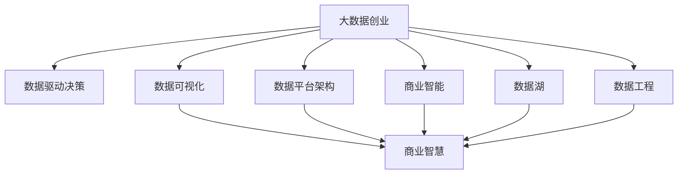

                 

# 大数据创业：洞察未来的商业智慧

> 关键词：大数据创业, 数据驱动决策, 商业智慧, 数据可视化, 数据平台架构, 商业智能(BI), 数据湖, 数据工程

## 1. 背景介绍

### 1.1 问题由来
随着信息技术的迅猛发展，数据已经成为企业重要的资产和竞争优势。越来越多的公司意识到，依托数据驱动的决策能力，将大幅提升运营效率、降低成本、增强客户体验。然而，数据量大、种类繁多、来源复杂、质量参差不齐，都给企业的数据管理带来了巨大挑战。

大数据创业公司应运而生，它们凭借前沿的数据技术和工具，为企业提供数据集成、清洗、分析、可视化等全流程解决方案，极大地降低了企业数据管理的难度，释放了数据的价值。本文将探讨如何通过数据驱动决策提升企业的商业智慧，并分享大数据创业公司实现这一目标的实践经验。

## 2. 核心概念与联系

### 2.1 核心概念概述

为更好地理解基于大数据的商业智慧应用，本节将介绍几个核心概念：

- 大数据创业：指聚焦于数据技术、数据管理和数据分析的创业公司，致力于帮助企业解锁数据的商业价值。

- 数据驱动决策：指基于数据而非传统经验或直觉进行商业决策的方法。数据驱动决策能够帮助企业洞察市场趋势、优化业务流程、提升客户满意度。

- 商业智慧：指企业利用数据和技术实现科学决策、高效运营、精准营销的能力。数据驱动的商业智慧是企业竞争力的核心所在。

- 数据可视化：指通过图表、仪表盘等形式，将数据信息以直观、易懂的方式呈现给用户，辅助决策。

- 数据平台架构：指为了实现数据的存储、处理、分析和应用，而设计构建的技术架构体系。

- 商业智能(BI)：指利用数据仓库、OLAP分析等技术，将数据转化为商业洞察和知识，辅助企业进行战略规划、运营管理和市场分析。

- 数据湖：指一种将各种类型的数据（结构化、非结构化）集中存储的数据存储架构，便于进行全局的数据治理和分析。

- 数据工程：指围绕数据管理和分析的技术，包括数据清洗、数据转换、数据集成、数据存储、数据质量控制等。

这些核心概念之间的逻辑关系可以通过以下Mermaid流程图来展示：



这个流程图展示了大数据创业的相关核心概念及其之间的关系：

1. 大数据创业通过提供数据技术和服务，帮助企业构建数据驱动决策体系。
2. 数据驱动决策、数据可视化、数据平台架构、商业智能、数据湖和数据工程等概念，都是大数据创业关注和实施的核心领域。
3. 这些概念共同构建了企业的数据驱动能力，辅助企业提升商业智慧。

## 3. 核心算法原理 & 具体操作步骤

### 3.1 算法原理概述

基于大数据的商业智慧应用，本质上是一个数据驱动的商业决策过程。其核心思想是：通过大数据技术收集、处理、分析和呈现数据，提取有价值的信息和洞察，辅助企业制定科学的商业决策。

具体而言，该过程包括以下几个关键步骤：

1. 数据采集：通过爬虫、API、ETL等技术手段，收集来自内部系统、外部平台和公开数据源的多元数据。
2. 数据存储：将这些数据集中存储于数据湖或数据仓库中，便于后续分析和应用。
3. 数据清洗和转换：对数据进行去重、去噪、标准化等处理，以确保数据质量和一致性。
4. 数据分析和建模：利用机器学习、统计分析、数据挖掘等技术，对数据进行分析和建模，发现数据中的模式、规律和异常。
5. 数据可视化：将分析结果以图表、仪表盘等形式呈现，辅助企业理解数据、做出决策。
6. 业务应用：将分析结果转化为具体的商业决策和运营优化措施，提升企业运营效率和盈利能力。

### 3.2 算法步骤详解

以下我们以一个典型的数据驱动决策场景为例，详细讲解算法的步骤：

**场景：电商平台的商品推荐优化**

1. **数据采集**
   - 从电商平台的数据库、用户行为日志、社交网络等数据源中，收集用户的浏览记录、购买记录、评价记录、搜索记录等。
   - 使用爬虫技术从竞争对手网站、新闻网站、社交媒体等外部数据源获取相关数据。

2. **数据存储**
   - 将这些数据集中存储于企业的数据湖或数据仓库中，进行统一管理和调度。

3. **数据清洗和转换**
   - 对用户浏览数据进行去重、去噪、数据补全等处理，确保数据质量。
   - 将不同格式的数据转换为统一的格式，如将文本数据转换为结构化数据。

4. **数据分析和建模**
   - 利用机器学习算法对用户行为数据进行建模，识别用户的购买偏好、浏览习惯等特征。
   - 使用协同过滤、内容推荐等技术，对用户进行个性化推荐。

5. **数据可视化**
   - 将推荐系统的点击率、转化率、用户满意度等指标以图表形式展示，帮助运营人员监控推荐效果。

6. **业务应用**
   - 根据分析结果，调整推荐算法参数、优化推荐算法模型，提升推荐效果。
   - 定期评估推荐系统的性能，持续优化推荐策略，提高用户粘性和平台盈利能力。

### 3.3 算法优缺点

基于大数据的商业智慧应用具有以下优点：

1. 提升决策科学性。数据驱动的决策基于实证分析而非经验判断，能大幅提升决策的准确性和有效性。
2. 优化运营效率。通过对业务流程和客户行为的大数据分析，企业能优化运营策略，降低成本，提高效率。
3. 增强客户满意度。通过个性化推荐、精准营销等手段，提升客户体验，增强客户忠诚度。
4. 把握市场机会。数据驱动的商业智慧能及时洞察市场趋势和机会，快速响应市场变化，抢占先机。

同时，该方法也存在一定的局限性：

1. 数据质量问题。数据采集、清洗和转换的质量对商业智慧的实现至关重要，数据质量差会直接影响分析结果。
2. 隐私和安全风险。大规模数据集中存储和使用，需要严格的数据隐私保护和安全管理措施，否则可能带来隐私泄露和安全风险。
3. 技术复杂度高。数据驱动的商业智慧涉及数据采集、存储、处理、分析和应用等诸多环节，技术实现复杂度高，需长期技术积累。
4. 投资回报周期长。大数据平台和商业智慧系统的建设，通常需要较高的初期投入，短期内难以看到明显的回报。

尽管存在这些局限性，但就目前而言，基于大数据的商业智慧方法仍是大数据创业公司的核心竞争力所在。未来相关研究的重点在于如何进一步提升数据质量，降低隐私风险，缩短回报周期，提高系统的可扩展性和灵活性。

### 3.4 算法应用领域

基于大数据的商业智慧方法，已经在多个行业领域得到了广泛应用，例如：

- 零售电商：通过分析用户行为数据，实现个性化推荐、库存管理、价格优化等，提升销售效率和盈利能力。
- 金融服务：通过大数据分析，进行风险评估、信用评分、投资策略优化等，提升金融产品的精准度和竞争力。
- 医疗健康：通过分析医疗数据，进行疾病预测、治疗方案优化、健康管理等，提升医疗服务质量和效率。
- 物流运输：通过大数据分析，进行路线优化、需求预测、仓储管理等，降低物流成本，提高配送效率。
- 城市治理：通过分析城市运行数据，进行交通流量监测、环境监测、公共安全预警等，提升城市管理的智能化水平。
- 广告营销：通过分析用户行为数据，实现精准投放、效果评估、广告优化等，提升广告效果和ROI。

除了上述这些经典领域外，大数据驱动的商业智慧方法也将进一步拓展到更多行业，为各行各业提供更加智能、精准的数据决策支持。

## 4. 数学模型和公式 & 详细讲解 & 举例说明

### 4.1 数学模型构建

本节将使用数学语言对大数据驱动商业智慧的应用过程进行更加严格的刻画。

记企业数据集为 $D=\{(x_i,y_i)\}_{i=1}^N$，其中 $x_i$ 为输入特征，$y_i$ 为输出标签。假设企业希望通过数据驱动决策优化某一业务指标 $z$，数学模型构建如下：

$$
\min_{\theta} \mathcal{L}(\theta) = \frac{1}{N} \sum_{i=1}^N (z_i - f_{\theta}(x_i))^2
$$

其中 $f_{\theta}(x_i)$ 为模型对输入 $x_i$ 的预测输出，$\theta$ 为模型参数，$\mathcal{L}(\theta)$ 为损失函数，通常为均方误差损失。

### 4.2 公式推导过程

以下我们以用户留存率预测为例，推导回归模型的公式及其梯度计算。

记用户特征为 $x$，历史留存率数据为 $y$，预测未来 $n$ 天的留存率为 $z$。假设使用线性回归模型进行预测，则模型为：

$$
z_i = f_{\theta}(x_i) = \theta_0 + \theta_1 x_{i1} + \theta_2 x_{i2} + \ldots + \theta_k x_{ik}
$$

其中 $\theta_0, \theta_1, \ldots, \theta_k$ 为模型参数。

目标是最小化预测误差：

$$
\mathcal{L}(\theta) = \frac{1}{N} \sum_{i=1}^N (z_i - f_{\theta}(x_i))^2
$$

根据梯度下降优化方法，求损失函数对参数 $\theta$ 的梯度：

$$
\frac{\partial \mathcal{L}(\theta)}{\partial \theta_j} = \frac{2}{N} \sum_{i=1}^N (z_i - f_{\theta}(x_i)) x_{ij}
$$

其中 $j=0,1,\ldots,k$。

将梯度带入优化算法，如随机梯度下降，更新模型参数：

$$
\theta_j \leftarrow \theta_j - \eta \frac{\partial \mathcal{L}(\theta)}{\partial \theta_j}
$$

其中 $\eta$ 为学习率。

### 4.3 案例分析与讲解

**案例：电商平台的个性化推荐系统**

假设电商平台上每个用户的购买历史、浏览历史、搜索历史等特征 $x_i$ 与留存率 $z_i$ 之间的关系为线性模型：

$$
z_i = f_{\theta}(x_i) = \theta_0 + \theta_1 x_{i1} + \theta_2 x_{i2} + \ldots + \theta_k x_{ik}
$$

目标是最小化预测误差：

$$
\mathcal{L}(\theta) = \frac{1}{N} \sum_{i=1}^N (z_i - f_{\theta}(x_i))^2
$$

其中 $z_i$ 为预测的用户留存率，$f_{\theta}(x_i)$ 为线性回归模型对用户特征的预测，$\theta_0, \theta_1, \ldots, \theta_k$ 为模型参数。

通过梯度下降方法，不断更新模型参数，最小化预测误差。同时，结合在线学习技术，在每笔订单发生时更新模型参数，实时调整预测结果，提升推荐效果。

## 5. 项目实践：代码实例和详细解释说明

### 5.1 开发环境搭建

在进行商业智慧系统开发前，我们需要准备好开发环境。以下是使用Python进行PyTorch开发的环境配置流程：

1. 安装Anaconda：从官网下载并安装Anaconda，用于创建独立的Python环境。

2. 创建并激活虚拟环境：
```bash
conda create -n pytorch-env python=3.8 
conda activate pytorch-env
```

3. 安装PyTorch：根据CUDA版本，从官网获取对应的安装命令。例如：
```bash
conda install pytorch torchvision torchaudio cudatoolkit=11.1 -c pytorch -c conda-forge
```

4. 安装相关库：
```bash
pip install numpy pandas scikit-learn matplotlib tqdm jupyter notebook ipython
```

完成上述步骤后，即可在`pytorch-env`环境中开始商业智慧系统开发。

### 5.2 源代码详细实现

这里我们以用户留存率预测为例，给出使用PyTorch进行回归模型训练的PyTorch代码实现。

首先，定义数据处理函数：

```python
import pandas as pd
from sklearn.model_selection import train_test_split
from torch.utils.data import Dataset
from torch.utils.data import DataLoader
import torch
import torch.nn as nn

class UserData(Dataset):
    def __init__(self, data_path, train=True, transform=None):
        self.data = pd.read_csv(data_path)
        if train:
            self.data = self.data.sample(frac=0.8)
        self.transform = transform
        self.y = self.data.pop('z')
        self.x = self.data

    def __len__(self):
        return len(self.x)

    def __getitem__(self, idx):
        x = self.x.iloc[idx]
        x = torch.tensor(x.values, dtype=torch.float32)
        y = torch.tensor(self.y.iloc[idx], dtype=torch.float32)
        if self.transform:
            x = self.transform(x)
        return {'x': x, 'y': y}

def load_data(data_path):
    train_data, test_data = train_test_split(UserData(data_path, train=True), 
                                            UserData(data_path, train=False))
    train_loader = DataLoader(train_data, batch_size=32, shuffle=True)
    test_loader = DataLoader(test_data, batch_size=32)
    return train_loader, test_loader
```

然后，定义模型和优化器：

```python
from torch import nn, optim

class LinearRegression(nn.Module):
    def __init__(self, input_dim):
        super(LinearRegression, self).__init__()
        self.linear = nn.Linear(input_dim, 1)

    def forward(self, x):
        return self.linear(x)

model = LinearRegression(input_dim=3)

optimizer = optim.Adam(model.parameters(), lr=0.01)
```

接着，定义训练和评估函数：

```python
def train_epoch(model, train_loader, optimizer, loss_fn):
    model.train()
    train_loss = 0
    for batch in train_loader:
        x = batch['x']
        y = batch['y']
        optimizer.zero_grad()
        output = model(x)
        loss = loss_fn(output, y)
        train_loss += loss.item()
        loss.backward()
        optimizer.step()
    return train_loss / len(train_loader)

def evaluate(model, test_loader, loss_fn):
    model.eval()
    test_loss = 0
    for batch in test_loader:
        x = batch['x']
        y = batch['y']
        output = model(x)
        loss = loss_fn(output, y)
        test_loss += loss.item()
    return test_loss / len(test_loader)

# 加载数据
train_loader, test_loader = load_data('user_data.csv')

# 训练模型
for epoch in range(10):
    train_loss = train_epoch(model, train_loader, optimizer, nn.MSELoss())
    print(f"Epoch {epoch+1}, train loss: {train_loss:.3f}")
    
    test_loss = evaluate(model, test_loader, nn.MSELoss())
    print(f"Epoch {epoch+1}, test loss: {test_loss:.3f}")
```

以上就是使用PyTorch进行用户留存率预测的完整代码实现。可以看到，得益于PyTorch的强大封装，我们可以用相对简洁的代码完成回归模型的训练。

### 5.3 代码解读与分析

让我们再详细解读一下关键代码的实现细节：

**UserData类**：
- `__init__`方法：初始化数据集，并根据是否为训练集进行抽样处理。
- `__len__`方法：返回数据集的样本数量。
- `__getitem__`方法：对单个样本进行处理，将样本数据转换为Tensor格式，并返回字典形式的数据输入。

**load_data函数**：
- 使用Pandas读取数据集，并根据训练集和测试集的比例进行划分。
- 使用PyTorch的DataLoader对数据集进行批次化加载，供模型训练和推理使用。

**LinearRegression类**：
- 定义线性回归模型，包含一个全连接层。
- 实现前向传播函数，进行线性变换。

**训练和评估函数**：
- 使用PyTorch的DataLoader对数据以批为单位进行迭代，在每个批次上前向传播计算loss并反向传播更新模型参数，最后返回该epoch的平均loss。
- 在测试集上评估模型性能，输出测试集的平均loss。

**训练流程**：
- 定义总的epoch数，开始循环迭代
- 每个epoch内，先在训练集上训练，输出平均loss
- 在测试集上评估，输出测试集的平均loss

可以看到，PyTorch配合相关库使得商业智慧系统的训练代码实现变得简洁高效。开发者可以将更多精力放在数据处理、模型改进等高层逻辑上，而不必过多关注底层的实现细节。

当然，工业级的系统实现还需考虑更多因素，如模型的保存和部署、超参数的自动搜索、更灵活的任务适配层等。但核心的回归模型训练范式基本与此类似。

## 6. 实际应用场景
### 6.1 电商平台的个性化推荐系统

电商平台的个性化推荐系统，能够根据用户历史行为数据，预测其购买意向，实时调整推荐策略，提高用户体验和平台转化率。具体实现流程如下：

1. **数据采集**
   - 收集用户浏览数据、购买数据、评价数据等，形成全面的用户画像。
   - 使用爬虫技术从竞争对手网站、新闻网站、社交媒体等外部数据源获取相关数据。

2. **数据存储**
   - 将这些数据集中存储于企业的数据湖或数据仓库中，进行统一管理和调度。

3. **数据清洗和转换**
   - 对用户行为数据进行去重、去噪、数据补全等处理，确保数据质量。
   - 将不同格式的数据转换为统一的格式，如将文本数据转换为结构化数据。

4. **数据分析和建模**
   - 利用机器学习算法对用户行为数据进行建模，识别用户的购买偏好、浏览习惯等特征。
   - 使用协同过滤、内容推荐等技术，对用户进行个性化推荐。

5. **数据可视化**
   - 将推荐系统的点击率、转化率、用户满意度等指标以图表形式展示，帮助运营人员监控推荐效果。

6. **业务应用**
   - 根据分析结果，调整推荐算法参数、优化推荐算法模型，提升推荐效果。
   - 定期评估推荐系统的性能，持续优化推荐策略，提高用户粘性和平台盈利能力。

### 6.2 金融服务的风险评估系统

金融服务领域的数据驱动决策，能够帮助金融机构进行风险评估、信用评分、投资策略优化等，提升金融产品的精准度和竞争力。具体实现流程如下：

1. **数据采集**
   - 从金融机构的业务系统、客户关系管理系统、贷款审批系统等数据源中，收集客户的交易记录、信用记录、行为数据等。
   - 从公开数据源获取市场数据、宏观经济数据等。

2. **数据存储**
   - 将这些数据集中存储于企业的数据湖或数据仓库中，进行统一管理和调度。

3. **数据清洗和转换**
   - 对客户交易数据进行去重、去噪、数据补全等处理，确保数据质量。
   - 将不同格式的数据转换为统一的格式，如将文本数据转换为结构化数据。

4. **数据分析和建模**
   - 利用机器学习算法对客户行为数据进行建模，识别客户的信用风险、投资偏好等特征。
   - 使用分类、回归等技术，对客户进行信用评分、风险评估。

5. **数据可视化**
   - 将风险评估系统的评分结果以图表形式展示，帮助运营人员监控风险状况。

6. **业务应用**
   - 根据分析结果，调整风险评估算法参数、优化风险评估算法模型，提升风险评估的准确性和及时性。
   - 定期评估风险评估系统的性能，持续优化风险管理策略，降低信用风险。

### 6.3 医疗健康的疾病预测系统

医疗健康领域的数据驱动决策，能够帮助医疗机构进行疾病预测、治疗方案优化、健康管理等，提升医疗服务质量和效率。具体实现流程如下：

1. **数据采集**
   - 从医院的电子病历系统、实验室管理系统、体检系统等数据源中，收集患者的健康数据、治疗记录、体检记录等。
   - 从公开数据源获取人口统计数据、环境数据等。

2. **数据存储**
   - 将这些数据集中存储于企业的数据湖或数据仓库中，进行统一管理和调度。

3. **数据清洗和转换**
   - 对患者健康数据进行去重、去噪、数据补全等处理，确保数据质量。
   - 将不同格式的数据转换为统一的格式，如将文本数据转换为结构化数据。

4. **数据分析和建模**
   - 利用机器学习算法对患者健康数据进行建模，识别患者的疾病风险、治疗效果等特征。
   - 使用分类、回归等技术，对患者进行疾病预测、治疗方案优化。

5. **数据可视化**
   - 将疾病预测系统的预测结果以图表形式展示，帮助医生和患者了解疾病风险。

6. **业务应用**
   - 根据分析结果，调整疾病预测算法参数、优化疾病预测算法模型，提升预测准确性。
   - 定期评估疾病预测系统的性能，持续优化疾病管理策略，提升患者健康水平。

### 6.4 未来应用展望

随着大数据技术的不断演进，数据驱动的商业智慧方法将进一步拓展到更多领域，为各行各业带来深刻的变革。

在智慧城市治理中，数据驱动的商业智慧能实时监测城市运行数据，进行交通流量监测、环境监测、公共安全预警等，提升城市管理的智能化水平。

在智能制造领域，数据驱动的商业智慧能优化生产流程、预测设备故障、优化供应链管理，提升生产效率和产品质量。

在智慧农业领域，数据驱动的商业智慧能监测作物生长状态、优化灌溉施肥、预测病虫害等，提升农业生产的智能化水平。

此外，在教育、旅游、能源等多个领域，数据驱动的商业智慧也将不断涌现，为各行各业带来新的商业智慧和运营模式。

## 7. 工具和资源推荐
### 7.1 学习资源推荐

为了帮助开发者系统掌握大数据驱动商业智慧的理论基础和实践技巧，这里推荐一些优质的学习资源：

1. 《Python数据科学手册》系列博文：由大公司数据科学家撰写，全面介绍了数据科学的基础知识和应用案例，包括数据采集、数据清洗、数据可视化、机器学习等。

2. Coursera《Data Science Specialization》课程：由约翰霍普金斯大学开设的数据科学专项课程，系统讲解数据科学的基础知识和应用技能。

3. 《Python机器学习》书籍：一个深入浅出的介绍Python机器学习的基础知识和实现方法的书籍，包含大量的代码实例和项目实践。

4. Kaggle数据科学竞赛：一个全球知名的数据科学竞赛平台，提供大量的真实世界数据集和挑战题目，帮助开发者提高实战能力。

5. PyTorch官方文档：PyTorch的官方文档，提供了完整的库介绍和详细的使用教程，适合初学者和专业人士。

通过对这些资源的学习实践，相信你一定能够快速掌握大数据驱动商业智慧的精髓，并用于解决实际的商业问题。
###  7.2 开发工具推荐

高效的开发离不开优秀的工具支持。以下是几款用于商业智慧系统开发常用的工具：

1. PyTorch：基于Python的开源深度学习框架，灵活动态的计算图，适合快速迭代研究。大部分预训练语言模型都有PyTorch版本的实现。

2. TensorFlow：由Google主导开发的开源深度学习框架，生产部署方便，适合大规模工程应用。同样有丰富的预训练语言模型资源。

3. Dask：一个用于分布式计算的Python库，支持大规模数据处理和机器学习，是处理大数据集的理想选择。

4. Apache Spark：一个用于大数据处理和机器学习的开源框架，支持大规模数据集的处理和分析。

5. Jupyter Notebook：一个强大的交互式编程环境，支持Python、R、SQL等多种语言，方便开发者进行代码调试和文档记录。

6. Tableau、Power BI：两个数据可视化工具，支持复杂的图表和仪表盘制作，适合商业智能报告制作。

合理利用这些工具，可以显著提升商业智慧系统的开发效率，加快创新迭代的步伐。

### 7.3 相关论文推荐

大数据驱动的商业智慧技术，已经在学术界和产业界得到了广泛的研究。以下是几篇奠基性的相关论文，推荐阅读：

1. "Big Data Mining: Exploring Big Data with Online Machine Learning Algorithms"：探索了基于大数据的在线机器学习算法，为商业智慧的实现提供了理论基础。

2. "Big Data Mining and Statistical Learning"：介绍了大数据背景下机器学习算法的应用，为商业智能提供了算法指导。

3. "Analyzing Big Data with MapReduce"：讨论了使用MapReduce框架处理大数据集的方法，为商业智慧的数据处理提供了实践参考。

4. "Data-Driven Decision Making: A Survey"：综述了数据驱动决策的理论和实践，为商业智慧的全面应用提供了参考。

5. "Big Data Analytics: Technologies, Models, and Techniques"：介绍了大数据分析的技术、模型和算法，为商业智慧的实现提供了全面的指导。

这些论文代表了大数据驱动商业智慧技术的发展脉络。通过学习这些前沿成果，可以帮助研究者把握学科前进方向，激发更多的创新灵感。

## 8. 总结：未来发展趋势与挑战

### 8.1 总结

本文对基于大数据的商业智慧应用进行了全面系统的介绍。首先阐述了数据驱动决策的商业智慧对企业的价值，明确了数据驱动商业智慧的应用场景和实现流程。其次，从原理到实践，详细讲解了数据驱动决策的数学模型和算法实现，给出了商业智慧系统开发的完整代码实例。同时，本文还探讨了商业智慧在电商、金融、医疗等领域的广泛应用，展示了其巨大的潜力。此外，本文精选了商业智慧系统的学习资源、开发工具和相关论文，力求为读者提供全方位的技术指引。

通过本文的系统梳理，可以看到，基于大数据的商业智慧方法正在成为企业数据驱动决策的核心竞争力，极大地提升了企业的运营效率和盈利能力。未来相关研究的重点在于如何进一步提升数据质量，降低隐私风险，缩短回报周期，提高系统的可扩展性和灵活性。

### 8.2 未来发展趋势

展望未来，大数据驱动的商业智慧方法将呈现以下几个发展趋势：

1. 数据质量和数量持续提升。随着数据采集技术的不断进步，企业的数据质量和数量将持续提升，进一步提升商业智慧的准确性和可靠性。
2. 技术栈更加多元化。随着云计算、人工智能、区块链等新兴技术的发展，大数据驱动商业智慧的技术栈将更加多元化，提升系统的灵活性和实用性。
3. 决策支持智能化。利用自然语言处理、计算机视觉等技术，将更多元化的数据纳入决策过程，提升决策的智能化水平。
4. 数据安全和隐私保护更加严格。伴随数据泄露和隐私侵害事件的频发，数据安全和隐私保护将成为企业关注的重点，商业智慧系统需要严格遵守相关法规和标准。
5. 预测能力进一步增强。利用深度学习、强化学习等技术，提升商业智慧系统的预测能力和决策准确性，帮助企业抓住更多的市场机会。

以上趋势凸显了大数据驱动商业智慧技术的广阔前景。这些方向的探索发展，必将进一步提升企业的商业智慧和决策能力，为经济社会发展注入新的动力。

### 8.3 面临的挑战

尽管大数据驱动的商业智慧方法已经取得了瞩目成就，但在迈向更加智能化、普适化应用的过程中，它仍面临着诸多挑战：

1. 数据隐私和伦理问题。大规模数据集中存储和使用，需要严格的数据隐私保护和安全管理措施，否则可能带来隐私泄露和安全风险。如何平衡数据价值和隐私保护，成为一大难题。
2. 数据孤岛和数据治理问题。企业内部的数据孤岛和数据治理问题，可能导致数据无法全面整合和利用，制约商业智慧的实现。
3. 数据质量问题。数据采集、清洗和转换的质量对商业智慧的实现至关重要，数据质量差会直接影响分析结果。
4. 技术复杂度高。大数据驱动的商业智慧涉及数据采集、存储、处理、分析和应用等诸多环节，技术实现复杂度高，需长期技术积累。
5. 初期投入大。大数据平台和商业智慧系统的建设，通常需要较高的初期投入，短期内难以看到明显的回报。

尽管存在这些挑战，但就目前而言，基于大数据的商业智慧方法仍是大数据创业公司的核心竞争力所在。未来相关研究的重点在于如何进一步提升数据质量，降低隐私风险，缩短回报周期，提高系统的可扩展性和灵活性。

### 8.4 研究展望

面对大数据驱动商业智慧所面临的种种挑战，未来的研究需要在以下几个方面寻求新的突破：

1. 探索无监督和半监督学习算法。摆脱对大规模标注数据的依赖，利用自监督学习、主动学习等无监督和半监督范式，最大限度利用非结构化数据，实现更加灵活高效的商业智慧。
2. 研究参数高效和计算高效的商业智慧算法。开发更加参数高效的算法，在固定大部分预训练参数的同时，只更新极少量的任务相关参数。同时优化算法的计算图，减少前向传播和反向传播的资源消耗，实现更加轻量级、实时性的部署。
3. 融合因果推断和对比学习范式。通过引入因果推断和对比学习思想，增强商业智慧系统建立稳定因果关系的能力，学习更加普适、鲁棒的数据表征，从而提升系统泛化性和抗干扰能力。
4. 引入更多先验知识。将符号化的先验知识，如知识图谱、逻辑规则等，与神经网络模型进行巧妙融合，引导商业智慧过程学习更准确、合理的知识表示。同时加强不同模态数据的整合，实现视觉、语音等多模态信息与文本信息的协同建模。
5. 结合因果分析和博弈论工具。将因果分析方法引入商业智慧系统，识别出系统决策的关键特征，增强输出解释的因果性和逻辑性。借助博弈论工具刻画人机交互过程，主动探索并规避系统的脆弱点，提高系统稳定性。

这些研究方向的探索，必将引领大数据驱动商业智慧技术迈向更高的台阶，为构建安全、可靠、可解释、可控的智能系统铺平道路。面向未来，大数据驱动商业智慧技术还需要与其他人工智能技术进行更深入的融合，如知识表示、因果推理、强化学习等，多路径协同发力，共同推动商业智慧系统的进步。只有勇于创新、敢于突破，才能不断拓展商业智慧的边界，让智能技术更好地造福人类社会。

## 9. 附录：常见问题与解答

**Q1：数据驱动决策是否适用于所有企业？**

A: 数据驱动决策通常适用于数据量较大、业务复杂、需求变化频繁的企业。对于数据量小、业务简单、需求稳定的企业，传统经验判断可能更为高效。

**Q2：如何选择合适的特征进行建模？**

A: 特征选择通常通过特征工程和模型诊断来完成。利用领域知识选择合适的特征，使用特征选择算法（如Lasso、随机森林等）剔除冗余和无关特征，使用特征重要性评估（如SHAP、LIME等）识别重要特征。

**Q3：数据驱动决策是否需要依赖昂贵的计算资源？**

A: 数据驱动决策在初期可能需要较大的计算资源进行模型训练和评估。但通过模型压缩、优化算法等手段，可以显著降低计算成本。同时，利用分布式计算和云计算技术，可以高效处理大规模数据集。

**Q4：数据驱动决策的模型评估指标有哪些？**

A: 数据驱动决策的模型评估指标包括准确率、召回率、F1值、ROC曲线等。针对不同的业务场景，还需要选择相应的评估指标，如对于推荐系统，还需要关注点击率、转化率等指标。

**Q5：如何构建数据驱动的商业智慧系统？**

A: 构建数据驱动的商业智慧系统，需要按照数据驱动的实现流程进行：数据采集、数据存储、数据清洗和转换、数据分析和建模、数据可视化和业务应用。每个环节都需要精心设计，确保数据质量、模型精度和系统性能。

---

作者：禅与计算机程序设计艺术 / Zen and the Art of Computer Programming

