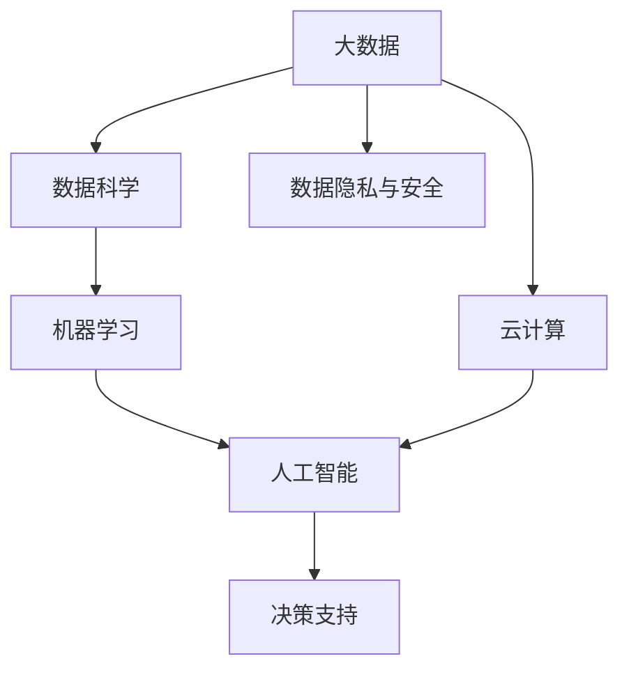

                 

# 大数据时代：人类计算的机遇与挑战

在信息技术的推动下，人类进入了一个数据驱动的时代。大数据的应用遍及社会的各个角落，深刻影响着社会生产、生活、经济、科技等各个方面。本系列文章将从大数据的宏观背景出发，深入探讨人类计算的机遇与挑战，让读者对大数据时代的未来发展有一个全面的理解。

## 1. 背景介绍

### 1.1 信息技术的飞速发展
进入21世纪以来，信息技术取得了飞速的发展。移动通信技术、云计算、物联网、人工智能等技术的普及和应用，使得数据产生、存储和处理能力显著提升。当前，全球每年产生的数据量已经达到了ZB（千亿亿字节）级别，且每年以指数级增长。

### 1.2 数据驱动的决策
在过去，决策主要依赖于经验和直觉，但在数据驱动的今天，数据已经成为决策的重要依据。例如，通过分析用户行为数据，电商平台可以推荐个性化的商品，提升用户体验和销售额。医疗领域可以利用患者数据进行精准诊断和治疗。政府部门可以通过大数据分析社会经济现象，制定合理的政策。

### 1.3 数据隐私与安全
伴随大数据的普及，数据隐私和安全问题也愈发突出。数据泄露、滥用等问题频发，带来了巨大的社会和经济损失。如何在享受大数据带来的便利的同时，确保数据的安全和隐私，成为亟待解决的问题。

## 2. 核心概念与联系

### 2.1 核心概念概述
本节将介绍几个核心的概念，并阐明它们之间的联系：

- **大数据**：指规模巨大、复杂、多样、实时性强的数据集。通常用4V（Volume, Velocity, Variety, Veracity）来描述大数据的特点。
- **数据科学**：涉及数据收集、处理、分析和解释的学科，旨在从数据中提取有价值的信息，用于支持决策和洞察。
- **机器学习**：一种让计算机从数据中学习经验，并自动改进算法性能的技术。大数据和机器学习的结合，可以提供更精准、快速的决策支持。
- **云计算**：一种基于互联网的计算模式，通过远程服务器提供按需计算服务，使得大规模数据处理和存储变得可行。
- **人工智能**：通过算法让计算机模拟人类的智能行为，包括感知、学习、推理等能力。大数据和人工智能的结合，可以大幅提升决策的智能化水平。

这些概念共同构成了大数据时代的技术框架，为人类计算的机遇和挑战提供了基础。

### 2.2 核心概念原理和架构的 Mermaid 流程图(Mermaid 流程节点中不要有括号、逗号等特殊字符)



## 3. 核心算法原理 & 具体操作步骤

### 3.1 算法原理概述
大数据时代的核心算法原理，主要围绕数据处理、机器学习和人工智能展开。大数据的核心技术包括分布式计算、数据挖掘、自然语言处理等。机器学习算法包括监督学习、非监督学习、强化学习等。人工智能则通过深度学习、迁移学习、强化学习等技术，实现复杂决策和任务。

### 3.2 算法步骤详解
以深度学习算法为例，其通常包括以下步骤：

1. **数据预处理**：清洗、整理、转换数据，使其符合模型输入要求。
2. **特征工程**：提取、选择、转换特征，提高模型的预测能力。
3. **模型训练**：通过大量的数据和计算，训练模型，找到最优的参数组合。
4. **模型评估**：在验证集和测试集上评估模型性能，确定模型泛化能力。
5. **模型部署**：将训练好的模型部署到生产环境中，用于实际应用。

### 3.3 算法优缺点
大数据和机器学习算法带来了诸多优势：

- **处理大规模数据**：能够处理传统方法无法处理的超大规模数据集。
- **提高决策质量**：通过数据驱动的决策，提升决策的科学性和精准性。
- **自动化和智能化**：减少人为干预，提升决策的效率和智能化水平。

但同时也存在一些缺点：

- **计算资源消耗大**：需要强大的计算资源和存储空间，成本较高。
- **数据隐私和安全问题**：处理大规模数据时，隐私和安全问题难以规避。
- **模型复杂度**：复杂模型需要更多数据和计算资源，可能存在过拟合问题。

### 3.4 算法应用领域
大数据和机器学习算法广泛应用于各个领域，如金融、医疗、电商、政府、交通、教育等。

- **金融领域**：通过大数据和机器学习算法，金融机构可以实时监控市场动态，进行风险评估和投资决策。
- **医疗领域**：利用大数据和机器学习算法，可以进行疾病预测和诊断，提高医疗服务的质量和效率。
- **电商领域**：通过分析用户行为数据，电商平台可以精准推荐商品，提升用户体验和销售额。
- **政府部门**：利用大数据和机器学习算法，政府可以制定更加科学和合理的政策，提升社会治理水平。
- **交通领域**：通过大数据和机器学习算法，可以实现交通流量预测和智能调度，提升交通效率。
- **教育领域**：通过大数据和机器学习算法，可以进行个性化教育，提升教学质量和效果。

## 4. 数学模型和公式 & 详细讲解 & 举例说明

### 4.1 数学模型构建
在大数据时代，数学模型主要围绕数据处理、机器学习和人工智能展开。常用的数学模型包括线性回归、决策树、支持向量机、神经网络等。

以线性回归模型为例，其数学模型为：

$$
y = \theta_0 + \sum_{i=1}^n \theta_i x_i
$$

其中，$y$ 为预测值，$\theta_0$ 为截距，$\theta_i$ 为回归系数，$x_i$ 为自变量。

### 4.2 公式推导过程
以线性回归模型的推导为例：

1. **假设模型**：假设 $y$ 与 $x$ 之间存在线性关系，即 $y = \theta_0 + \sum_{i=1}^n \theta_i x_i$。
2. **数据表示**：设 $x$ 为自变量，$y$ 为因变量，$n$ 为样本数量。
3. **最小二乘法**：最小化预测值与真实值之间的平方误差，即最小化 $J(\theta) = \frac{1}{2N} \sum_{i=1}^N (y_i - \theta_0 - \sum_{i=1}^n \theta_i x_i)^2$。
4. **求解**：通过对 $J(\theta)$ 求偏导，得到 $\theta_0$ 和 $\theta_i$ 的求解公式。

### 4.3 案例分析与讲解
以预测房价为例，假设已知 $n=1000$ 个样本，其中自变量 $x_i$ 为房屋面积，因变量 $y_i$ 为房价。通过线性回归模型，可以拟合出房价与房屋面积之间的线性关系，从而进行房价预测。

## 5. 项目实践：代码实例和详细解释说明

### 5.1 开发环境搭建
在本节中，我们将介绍使用Python进行机器学习开发的常见环境配置流程。

1. **安装Python**：从官网下载并安装Python，推荐使用3.8以上版本。
2. **安装Pip**：确保Pip已经安装，可以通过运行 `pip --version` 命令进行检查。
3. **安装Jupyter Notebook**：运行 `pip install jupyter notebook` 命令进行安装。
4. **安装常用库**：运行 `pip install pandas numpy matplotlib sklearn scikit-learn` 命令，安装常用的数据处理和机器学习库。
5. **设置虚拟环境**：运行 `python -m venv myenv` 命令，创建一个虚拟环境，然后在该环境中运行 `source myenv/bin/activate` 命令，激活虚拟环境。

### 5.2 源代码详细实现
以下是使用线性回归模型预测房价的Python代码实现：

```python
import pandas as pd
from sklearn.linear_model import LinearRegression
from sklearn.metrics import mean_squared_error

# 读取数据
data = pd.read_csv('housing.csv')

# 划分训练集和测试集
train_data = data[:800]
test_data = data[800:]

# 数据预处理
X_train = train_data.drop('price', axis=1)
y_train = train_data['price']
X_test = test_data.drop('price', axis=1)
y_test = test_data['price']

# 模型训练
model = LinearRegression()
model.fit(X_train, y_train)

# 模型评估
y_pred = model.predict(X_test)
rmse = mean_squared_error(y_test, y_pred, squared=False)
print(f"RMSE: {rmse:.2f}")
```

### 5.3 代码解读与分析
1. **数据读取**：使用Pandas库读取CSV格式的数据。
2. **数据划分**：将数据划分为训练集和测试集，便于模型训练和评估。
3. **数据预处理**：将自变量和因变量分离，并使用Pandas的drop方法删除因变量。
4. **模型训练**：使用Scikit-learn库中的LinearRegression模型进行训练。
5. **模型评估**：使用均方根误差（RMSE）评估模型预测性能。

## 6. 实际应用场景

### 6.1 金融领域

在金融领域，大数据和机器学习算法可以用于风险评估、投资决策、客户管理等方面。例如，通过分析用户交易数据，金融机构可以评估用户信用风险，进行贷款审批。通过预测市场走势，可以进行股票交易和投资组合优化。

### 6.2 医疗领域

在医疗领域，大数据和机器学习算法可以用于疾病预测、诊断、治疗等方面。例如，通过分析患者电子病历数据，可以进行疾病预测和诊断，提高医疗服务的精准性。通过分析药物临床数据，可以进行药物效果评估和治疗方案优化。

### 6.3 电商领域

在电商领域，大数据和机器学习算法可以用于用户行为分析、商品推荐、库存管理等方面。例如，通过分析用户浏览和购买行为数据，可以推荐个性化的商品，提升用户体验和销售额。通过分析销售数据，可以进行库存管理和需求预测，提高供应链效率。

### 6.4 未来应用展望

随着技术的不断进步，大数据和机器学习算法将在更多领域得到应用，为人类计算的机遇和挑战带来新的突破。未来，大数据和机器学习算法将更加深入地应用于智慧城市、智能交通、智能制造、智能家居等领域，提升社会生产和生活质量。

## 7. 工具和资源推荐

### 7.1 学习资源推荐
为了帮助开发者系统掌握大数据和机器学习技术，以下是一些优质的学习资源：

1. **《Python数据科学手册》**：由知名数据科学家Jake VanderPlas撰写，介绍了Python在数据科学中的应用。
2. **Coursera《机器学习》课程**：由斯坦福大学教授Andrew Ng主讲，系统介绍了机器学习的基本概念和算法。
3. **Kaggle竞赛平台**：全球最大的数据科学竞赛平台，可以参加各类数据科学竞赛，提升实战能力。
4. **GitHub开源项目**：可以浏览和参与开源项目，学习最新的技术实现和代码实践。
5. **Stack Overflow技术社区**：全球最大的开发者社区，可以查找和学习各种技术问题和解决方案。

### 7.2 开发工具推荐
以下是一些常用的开发工具，可以提升大数据和机器学习开发的效率：

1. **PyTorch**：基于Python的深度学习框架，支持动态图和静态图，适合研究和实验。
2. **TensorFlow**：由Google开发的深度学习框架，支持分布式计算和模型部署，适合大规模工程应用。
3. **Jupyter Notebook**：交互式的编程环境，支持Python、R等语言，适合数据分析和模型开发。
4. **Git**：版本控制系统，支持团队协作和代码管理。
5. **GitHub**：代码托管平台，可以发布和共享开源项目，方便协作和交流。

### 7.3 相关论文推荐
以下是几篇关于大数据和机器学习的经典论文，推荐阅读：

1. **《机器学习：一种统计学习方法》**：周志华著，介绍了机器学习的基本理论和算法。
2. **《大数据时代》**：维克托·迈尔-舍恩伯格著，介绍了大数据的商业应用和社会影响。
3. **《深度学习》**：Ian Goodfellow等著，介绍了深度学习的原理和算法。
4. **《分布式数据处理：Apache Hadoop分布式系统》**：Sunny Bunder著，介绍了Apache Hadoop分布式系统的基本原理和应用。
5. **《大数据科学与工程导论》**：谭志虎等著，介绍了大数据的科学原理和工程应用。

## 8. 总结：未来发展趋势与挑战

### 8.1 研究成果总结
大数据和机器学习算法在各个领域都取得了显著的进展，广泛应用于金融、医疗、电商、政府、交通、教育等领域。通过数据驱动的决策，提升了各行业的智能化水平，推动了社会经济的进步。

### 8.2 未来发展趋势
未来，大数据和机器学习算法将继续深入应用到各个领域，提升社会生产和生活质量。具体趋势如下：

1. **智能城市**：利用大数据和机器学习算法，提升城市管理和公共服务水平。
2. **智能交通**：通过大数据和机器学习算法，优化交通流量和路网调度，提升交通效率。
3. **智能制造**：通过大数据和机器学习算法，提升制造业的自动化和智能化水平。
4. **智能家居**：通过大数据和机器学习算法，提升家居设备的智能化水平，提升用户体验。
5. **智能医疗**：通过大数据和机器学习算法，提升医疗服务的精准性和智能化水平。
6. **智能金融**：通过大数据和机器学习算法，提升金融风险评估和投资决策的智能化水平。
7. **智能教育**：通过大数据和机器学习算法，提升教育服务的个性化和智能化水平。

### 8.3 面临的挑战
虽然大数据和机器学习算法带来了诸多机遇，但也面临一些挑战：

1. **数据隐私和安全**：大数据处理过程中，隐私和安全问题难以规避，数据泄露和滥用的风险较高。
2. **数据质量问题**：数据质量不高、数据不完整等问题，会影响模型的训练和评估效果。
3. **计算资源消耗**：大数据和机器学习算法需要强大的计算资源和存储空间，成本较高。
4. **模型复杂度**：复杂模型需要更多数据和计算资源，可能存在过拟合问题。
5. **可解释性问题**：模型的决策过程难以解释，缺乏透明性，可能存在偏见和歧视。
6. **伦理和法律问题**：大数据和机器学习算法可能带来伦理和法律问题，如数据滥用、隐私侵犯等。

### 8.4 研究展望
未来，大数据和机器学习算法需要在以下几个方面进行突破：

1. **数据隐私保护**：研发新的数据隐私保护技术，保护用户隐私，防止数据泄露和滥用。
2. **数据质量提升**：提高数据收集和处理的准确性和完整性，提升数据质量。
3. **计算资源优化**：开发新的计算资源优化技术，提高数据处理和计算效率，降低成本。
4. **模型简化和优化**：简化模型结构，提高模型的可解释性和泛化能力，解决过拟合问题。
5. **伦理和法律保障**：制定新的伦理和法律规范，确保大数据和机器学习算法的安全性和公平性。
6. **跨学科融合**：与其他学科进行深度融合，推动大数据和机器学习算法的创新和发展。

## 9. 附录：常见问题与解答

**Q1: 什么是大数据？**

A: 大数据指规模巨大、复杂、多样、实时性强的数据集。其特点可以用4V（Volume, Velocity, Variety, Veracity）来描述。

**Q2: 大数据和机器学习的区别是什么？**

A: 大数据主要涉及数据的存储、处理和分析，而机器学习则主要关注如何从数据中提取知识，并应用于决策和预测。

**Q3: 大数据和机器学习的应用场景有哪些？**

A: 大数据和机器学习广泛应用于金融、医疗、电商、政府、交通、教育等领域。例如，在金融领域，可以进行风险评估、投资决策；在医疗领域，可以进行疾病预测、诊断；在电商领域，可以进行用户行为分析、商品推荐。

**Q4: 大数据和机器学习的未来发展趋势是什么？**

A: 未来，大数据和机器学习将继续深入应用到各个领域，提升社会生产和生活质量。具体趋势包括智能城市、智能交通、智能制造、智能家居、智能医疗、智能金融、智能教育等。

**Q5: 大数据和机器学习面临哪些挑战？**

A: 大数据和机器学习面临的挑战包括数据隐私和安全、数据质量、计算资源消耗、模型复杂度、可解释性、伦理和法律问题等。

---

作者：禅与计算机程序设计艺术 / Zen and the Art of Computer Programming

