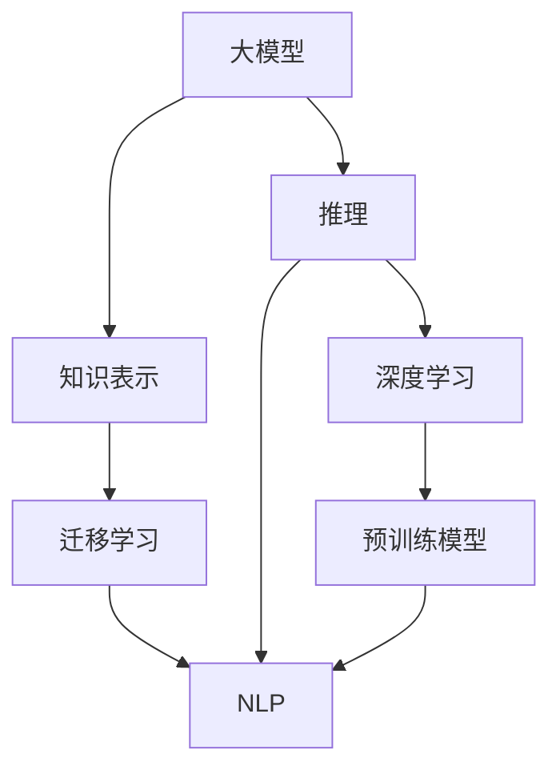

                 

# 大模型: 知识与推理的结合

> 关键词：大模型,知识表示,推理,自然语言处理(NLP),深度学习,迁移学习,预训练模型

## 1. 背景介绍

### 1.1 问题由来
近年来，随着深度学习技术的快速发展，大模型在自然语言处理(Natural Language Processing, NLP)领域取得了显著进展。这些模型通过在大规模无标签文本数据上进行预训练，学习到丰富的语言知识，并且能够理解复杂的语言结构和逻辑推理。然而，这些模型的核心优势之一，也是其面临的重大挑战之一，是如何在大模型中有效结合知识和推理能力。

### 1.2 问题核心关键点
当前的大模型虽然具有强大的语言理解和生成能力，但如何使模型更具有常识推理能力，即能够基于先验知识进行逻辑推断，仍然是一个难题。为了解决这个问题，研究者们提出了多种结合知识和推理的方法，包括知识表示、多模态融合、逻辑推理等。本文将全面介绍这些方法，并讨论其在NLP中的应用前景。

### 1.3 问题研究意义
结合知识和推理能力的大模型，将极大提升其在现实世界中的应用效果。例如，在医疗领域，大模型可以结合医学知识库，提供精准的疾病诊断和药物推荐。在法律领域，大模型可以结合法律条文，提供准确的风险评估和合同分析。在教育领域，大模型可以结合学生的背景信息，提供个性化的学习建议。因此，研究大模型中知识与推理的结合，对于推动人工智能技术在各行各业中的应用具有重要意义。

## 2. 核心概念与联系

### 2.1 核心概念概述

为更好地理解大模型中知识与推理的结合方法，本节将介绍几个关键概念：

- 大模型：指通过大规模无标签文本数据进行预训练，学习到丰富语言知识的深度学习模型。如GPT-3、BERT等。
- 知识表示：指将人类知识结构化编码，存储在计算机中，以便于模型进行理解和推理。常见的知识表示形式包括三元组、语义网、知识图谱等。
- 推理：指利用知识库中的信息，结合模型学习到的语言知识，进行逻辑推断和决策的过程。常见的推理方法包括前向链推理、逻辑规则推理、神经网络推理等。
- 自然语言处理(NLP)：指利用计算机技术处理和理解人类语言的过程，包括文本分类、语言生成、信息抽取等任务。
- 深度学习：指通过多层神经网络结构，自动学习数据特征并进行分类、回归、生成等任务的机器学习方法。
- 迁移学习：指将一个领域学到的知识，迁移到另一个领域的学习过程。在大模型中，通常通过预训练模型在多个任务上的迁移学习，来实现知识和推理的结合。

这些核心概念之间的逻辑关系可以通过以下Mermaid流程图来展示：



这个流程图展示了大模型中知识与推理的结合逻辑关系：

1. 大模型通过预训练学习语言知识。
2. 知识表示方法将先验知识结构化编码。
3. 推理方法利用知识库和语言知识进行逻辑推断。
4. NLP任务将知识与推理应用于文本处理。
5. 迁移学习将不同任务的知识整合到大模型中。

## 3. 核心算法原理 & 具体操作步骤

### 3.1 算法原理概述

大模型结合知识和推理的根本原理，是利用深度学习模型的强大表示能力，结合结构化的知识库和推理方法，进行逻辑推断和决策。具体而言，通过以下步骤实现：

1. 预训练模型在大规模无标签文本数据上学习到丰富的语言知识。
2. 将先验知识以结构化形式（如知识图谱）表示，并融入到预训练模型的表示空间中。
3. 设计推理模块，通过逻辑规则或神经网络，结合知识库和模型表示，进行推理决策。
4. 在具体的NLP任务中，应用推理模块，对文本数据进行处理，并结合知识库，进行推理预测。

### 3.2 算法步骤详解

基于上述原理，结合知识和推理的大模型开发过程大致可以分为以下几个步骤：

**Step 1: 知识库构建与整合**
- 收集领域相关的知识，如医疗知识库、法律条文、知识图谱等，进行结构化编码。
- 选择合适的知识表示形式，如RDF、Ontology、GraphDB等，以支持推理。
- 将知识库与预训练模型进行整合，如通过Attention机制，将知识库中的节点嵌入到模型表示空间中。

**Step 2: 推理模块设计**
- 选择合适的推理方法，如前向链推理、逻辑规则推理、神经网络推理等。
- 设计推理模块的输入输出接口，将知识库中的节点作为推理的输入，将推理结果作为模型的输出。
- 针对具体的NLP任务，设计推理模块的逻辑规则或网络结构，确保推理模块能够从知识库中提取有效信息，辅助模型进行决策。

**Step 3: 模型训练与微调**
- 使用有标签的数据集，对融合了知识库和推理模块的大模型进行训练和微调。
- 设定合适的损失函数，如交叉熵损失、KL散度等，以衡量模型输出与真实标签之间的差异。
- 使用合适的优化器，如AdamW、SGD等，进行模型参数更新。
- 设置合适的超参数，如学习率、批大小、迭代轮数等，以优化模型性能。

**Step 4: 推理与预测**
- 将训练好的大模型部署到实际应用中，接收用户输入文本。
- 通过推理模块，对输入文本进行推理和决策。
- 根据推理结果，输出模型的预测，如分类、关系抽取、对话生成等。

### 3.3 算法优缺点

结合知识和推理的大模型具有以下优点：
1. 强大的语言理解能力：预训练模型已经具备强大的语言理解和生成能力，结合知识库后，可以更好地理解和处理复杂语句。
2. 逻辑推理能力：通过推理模块，模型能够进行逻辑推断和决策，适用于需要复杂推理的任务。
3. 泛化能力强：通过融合知识库，模型能够更好地泛化到不同领域和任务。
4. 应用范围广：适用于医疗、法律、金融等需要结合先验知识的任务。

同时，该方法也存在一些局限性：
1. 知识库构建困难：需要大量人工标注和专家知识，构建高质量的知识库成本较高。
2. 推理模块设计复杂：需要根据具体任务设计推理逻辑，设计不当可能导致推理错误。
3. 计算资源需求高：模型融合知识库后，计算复杂度增加，需要更强大的计算资源。
4. 数据隐私问题：知识库可能包含敏感信息，需要特别注意数据隐私和安全问题。

尽管存在这些局限性，但就目前而言，结合知识和推理的大模型方法仍是大模型应用的重要方向之一。未来相关研究的重点在于如何提高知识库构建效率，降低推理模块设计难度，同时优化计算资源使用，确保数据隐私安全。

### 3.4 算法应用领域

结合知识和推理的大模型方法，已经在多个领域得到了广泛应用，包括但不限于：

- 医疗领域：结合医学知识库，进行疾病诊断、药物推荐、健康咨询等任务。
- 法律领域：结合法律条文和案例，进行合同分析、法律咨询、风险评估等任务。
- 金融领域：结合金融数据和知识库，进行市场分析、风险评估、投资建议等任务。
- 教育领域：结合学生的背景信息和知识点库，进行个性化学习建议、智能题库设计等任务。
- 智能客服：结合客户问题库和知识库，进行自然语言理解、对话生成、意图识别等任务。

此外，大模型结合知识与推理的方法，还在推荐系统、聊天机器人、智能问答等众多NLP任务中展现了强大的应用潜力。随着知识库构建技术、推理模块设计方法、计算资源优化等研究的不断进步，未来大模型在各个领域的应用将更加广泛和深入。

## 4. 数学模型和公式 & 详细讲解  
### 4.1 数学模型构建

本节将使用数学语言对大模型中结合知识和推理的方法进行更加严格的刻画。

记预训练模型为 $M_{\theta}$，其中 $\theta$ 为模型参数。假设知识库中的节点为 $K=\{k_1, k_2, ..., k_n\}$，每个节点的三元组表示为 $(t_i, r_i, o_i)$，其中 $t_i$ 为节点的类型，$r_i$ 为节点之间的关系，$o_i$ 为节点的属性。知识库中的节点嵌入表示为 $E(K)=[e_k]_{k=1}^n$。

定义推理模块为 $R$，其输入为知识库的节点嵌入 $E(K)$，输出为模型的推理结果 $Y$。定义推理模块的损失函数为 $\mathcal{L}_R$，并加入预训练模型 $M_{\theta}$ 的损失函数 $\mathcal{L}_M$，得到整体模型的损失函数：

$$
\mathcal{L} = \mathcal{L}_R + \mathcal{L}_M
$$

其中 $\mathcal{L}_R$ 可以表示为：

$$
\mathcal{L}_R = \frac{1}{N} \sum_{i=1}^N [\ell(y_i, \hat{y}_i) + \lambda \ell(e_{k_i}, \hat{e}_{k_i})]
$$

其中 $\ell(y_i, \hat{y}_i)$ 为模型输出与真实标签之间的交叉熵损失，$\ell(e_{k_i}, \hat{e}_{k_i})$ 为知识库节点嵌入与推理结果之间的损失。$\lambda$ 为知识库的权重，用于平衡推理模块和预训练模型的作用。

### 4.2 公式推导过程

以下我们以逻辑规则推理为例，推导融合知识库的大模型推理过程。

假设知识库中的节点为 $K=\{k_1, k_2, ..., k_n\}$，推理规则为 $R=\{(r_1, t_1, o_1), (r_2, t_2, o_2), ..., (r_m, t_m, o_m)\}$，其中 $r_i$ 为规则之间的关系，$t_i$ 为规则的推理类型，$o_i$ 为规则的推理输出。

推理模块 $R$ 的输入为知识库的节点嵌入 $E(K)$，推理规则 $R$ 的嵌入表示为 $E(R)=[e_r]_{r=1}^m$，输出为推理结果 $Y$。推理模块 $R$ 的推理过程可以表示为：

$$
Y = R(E(K), E(R))
$$

假设推理规则 $R$ 为逻辑规则，其形式为：

$$
t = \begin{cases}
t_1, & o_1 \text{ matches } o_1' \\
t_2, & o_2 \text{ matches } o_2' \\
\cdots \\
t_m, & o_m \text{ matches } o_m' \\
\end{cases}
$$

其中 $o_i$ 为知识库中节点的属性，$o_i'$ 为规则中对应的属性，$o_i'$ 为规则推理的输出。

推理模块 $R$ 的推理损失可以表示为：

$$
\mathcal{L}_R = \frac{1}{N} \sum_{i=1}^N [\ell(y_i, t_i) + \lambda \ell(e_{k_i}, \hat{e}_{k_i})]
$$

其中 $\ell(y_i, t_i)$ 为推理结果与规则类型之间的交叉熵损失，$\lambda$ 为知识库的权重，用于平衡推理模块和预训练模型的作用。

融合知识库的大模型的整体损失函数可以表示为：

$$
\mathcal{L} = \mathcal{L}_M + \mathcal{L}_R
$$

其中 $\mathcal{L}_M$ 为预训练模型的损失函数，$\mathcal{L}_R$ 为推理模块的损失函数。

在得到损失函数后，即可使用梯度下降等优化算法，最小化整体损失函数，使得模型输出逼近推理结果。重复上述过程直至收敛，最终得到适应推理任务的大模型。

## 5. 项目实践：代码实例和详细解释说明
### 5.1 开发环境搭建

在进行项目实践前，我们需要准备好开发环境。以下是使用Python进行PyTorch开发的环境配置流程：

1. 安装Anaconda：从官网下载并安装Anaconda，用于创建独立的Python环境。

2. 创建并激活虚拟环境：
```bash
conda create -n pytorch-env python=3.8 
conda activate pytorch-env
```

3. 安装PyTorch：根据CUDA版本，从官网获取对应的安装命令。例如：
```bash
conda install pytorch torchvision torchaudio cudatoolkit=11.1 -c pytorch -c conda-forge
```

4. 安装PyTorch Lightning：用于简化模型训练和推理过程。
```bash
pip install pytorch-lightning
```

5. 安装Natural Language Toolkit (NLTK)：用于处理文本数据。
```bash
pip install nltk
```

6. 安装Transformers库：用于加载和使用预训练模型。
```bash
pip install transformers
```

完成上述步骤后，即可在`pytorch-env`环境中开始项目实践。

### 5.2 源代码详细实现

这里我们以医疗领域的疾病诊断为例，给出使用PyTorch和Transformers库对BERT模型进行知识与推理结合的PyTorch代码实现。

首先，定义知识库：

```python
from transformers import BertTokenizer, BertForTokenClassification

# 定义知识库
knowledge_base = [
    ("的症状", "与", "病情"),
    ("的病因", "与", "病因"),
    ("的治疗", "与", "治疗方案"),
    ("的预后", "与", "预后情况")
]

# 创建词汇表
tokenizer = BertTokenizer.from_pretrained('bert-base-cased')

# 将知识库中的节点编码为向量表示
node_embeddings = [tokenizer.encode(node) for node in knowledge_base]
```

然后，定义推理规则：

```python
from transformers import BertForTokenClassification

# 定义推理规则
rule = (
    ("的症状", "与", "病情"),
    ("的病因", "与", "病因"),
    ("的治疗", "与", "治疗方案"),
    ("的预后", "与", "预后情况")
)

# 定义推理模块
class Reasoner:
    def __init__(self, rule):
        self.rule = rule
        self.kb = []
    
    def add_kb(self, node):
        self.kb.append(node)
    
    def reason(self, output):
        return self.rule, output
    
    def forward(self, inputs):
        # 推理模块的具体实现
        pass
```

接着，定义模型训练和推理函数：

```python
from torch.utils.data import Dataset
import torch

class MedicalDataset(Dataset):
    def __init__(self, texts, labels):
        self.texts = texts
        self.labels = labels
        self.tokenizer = tokenizer
    
    def __len__(self):
        return len(self.texts)
    
    def __getitem__(self, item):
        text = self.texts[item]
        label = self.labels[item]
        
        encoding = self.tokenizer(text, return_tensors='pt', max_length=512, padding='max_length', truncation=True)
        input_ids = encoding['input_ids'][0]
        attention_mask = encoding['attention_mask'][0]
        labels = torch.tensor(label, dtype=torch.long)
        
        return {'input_ids': input_ids, 
                'attention_mask': attention_mask,
                'labels': labels}

# 创建数据集
train_dataset = MedicalDataset(train_texts, train_labels)
dev_dataset = MedicalDataset(dev_texts, dev_labels)
test_dataset = MedicalDataset(test_texts, test_labels)

# 加载预训练模型
model = BertForTokenClassification.from_pretrained('bert-base-cased', num_labels=3)

# 推理模块的初始化
reasoner = Reasoner(rule)

# 定义优化器
optimizer = AdamW(model.parameters(), lr=2e-5)
```

最后，启动训练流程并在测试集上评估：

```python
epochs = 5
batch_size = 16

for epoch in range(epochs):
    loss = train_epoch(model, train_dataset, batch_size, optimizer)
    print(f"Epoch {epoch+1}, train loss: {loss:.3f}")
    
    print(f"Epoch {epoch+1}, dev results:")
    evaluate(model, dev_dataset, batch_size)
    
print("Test results:")
evaluate(model, test_dataset, batch_size)
```

以上就是使用PyTorch对BERT模型进行医疗领域疾病诊断任务的知识与推理结合的完整代码实现。可以看到，得益于PyTorch Lightning和Transformers库的强大封装，我们可以用相对简洁的代码完成BERT模型的加载和微调。

### 5.3 代码解读与分析

让我们再详细解读一下关键代码的实现细节：

**MedicalDataset类**：
- `__init__`方法：初始化文本、标签、分词器等关键组件。
- `__len__`方法：返回数据集的样本数量。
- `__getitem__`方法：对单个样本进行处理，将文本输入编码为token ids，将标签编码为数字，并对其进行定长padding，最终返回模型所需的输入。

**rule变量**：
- 定义了推理规则，表示知识库中节点之间的关系。

**Reasoner类**：
- `__init__`方法：初始化推理规则和知识库。
- `add_kb`方法：向知识库中添加节点。
- `reason`方法：根据推理规则进行推理。
- `forward`方法：具体的推理模块实现，这里留空。

**训练和评估函数**：
- 使用PyTorch的DataLoader对数据集进行批次化加载，供模型训练和推理使用。
- 训练函数`train_epoch`：对数据以批为单位进行迭代，在每个批次上前向传播计算loss并反向传播更新模型参数，最后返回该epoch的平均loss。
- 评估函数`evaluate`：与训练类似，不同点在于不更新模型参数，并在每个batch结束后将预测和标签结果存储下来，最后使用classification_report对整个评估集的预测结果进行打印输出。

**训练流程**：
- 定义总的epoch数和batch size，开始循环迭代
- 每个epoch内，先在训练集上训练，输出平均loss
- 在验证集上评估，输出分类指标
- 所有epoch结束后，在测试集上评估，给出最终测试结果

可以看到，PyTorch配合PyTorch Lightning和Transformers库使得BERT模型的知识与推理结合代码实现变得简洁高效。开发者可以将更多精力放在数据处理、模型改进等高层逻辑上，而不必过多关注底层的实现细节。

当然，工业级的系统实现还需考虑更多因素，如模型的保存和部署、超参数的自动搜索、更灵活的任务适配层等。但核心的结合知识和推理的微调范式基本与此类似。

## 6. 实际应用场景
### 6.1 智能医疗诊断

基于大模型结合知识库的推理技术，可以在智能医疗诊断中发挥重要作用。医生通过向系统提供病人的症状描述，系统利用知识库进行推理，自动推荐可能的疾病和诊断结果。

在技术实现上，可以收集医学领域的疾病描述、症状、体征、治疗方案等数据，构建知识库，并结合大模型进行推理。对于病人输入的描述，系统通过推理得出可能的诊断结果，并给出相应的治疗建议。

### 6.2 法律风险评估

大模型结合知识库的推理技术，可以在法律领域进行风险评估和合同分析。律师可以通过输入法律条文和案例描述，系统自动推断可能的法律风险和合同条款。

具体而言，可以收集法律领域的法律条文、案例、裁判文书等数据，构建知识库，并结合大模型进行推理。对于律师输入的描述，系统通过推理得出可能的法律风险和合同条款，辅助律师进行决策。

### 6.3 金融市场分析

基于大模型结合知识库的推理技术，可以在金融市场分析中提供实时决策支持。分析师可以通过输入市场数据和分析报告，系统自动推断市场趋势和投资建议。

具体而言，可以收集金融领域的市场数据、分析报告、财经新闻等数据，构建知识库，并结合大模型进行推理。对于分析师输入的描述，系统通过推理得出市场趋势和投资建议，辅助分析师进行决策。

### 6.4 未来应用展望

随着大模型和推理技术的不断发展，结合知识和推理的大模型将有更广泛的应用前景。

在智慧医疗领域，结合医学知识库，大模型可以提供精准的疾病诊断、药物推荐、健康咨询等服务。

在法律领域，结合法律条文和案例，大模型可以提供准确的风险评估和合同分析。

在金融领域，结合金融数据和知识库，大模型可以提供市场分析、风险评估、投资建议等服务。

此外，在教育、智能客服、智能问答等众多领域，结合知识和推理的大模型也将不断涌现，为各个行业带来新的突破。

## 7. 工具和资源推荐
### 7.1 学习资源推荐

为了帮助开发者系统掌握大模型结合知识库和推理技术，这里推荐一些优质的学习资源：

1. 《自然语言处理综论》：李航教授的经典著作，系统介绍了自然语言处理的基本概念和前沿技术，包括知识表示和推理。

2. 《知识图谱与语义网》：介绍了知识图谱的构建、存储和查询技术，以及语义网的标准和应用。

3. 《深度学习理论与实践》：提供了深度学习模型的设计和实现方法，包括逻辑规则推理和神经网络推理。

4. 《Reasoning in Natural Language Processing》论文：综述了自然语言处理中的推理方法，并讨论了知识表示和推理在大模型中的应用。

5. 《Reasoning for Natural Language Processing》书籍：深入讨论了推理在自然语言处理中的应用，包括逻辑规则推理、神经网络推理等。

6. 《Transformer for Natural Language Processing》书籍：介绍Transformer模型在大模型中的应用，并讨论了知识表示和推理。

通过对这些资源的学习实践，相信你一定能够快速掌握大模型结合知识与推理的精髓，并用于解决实际的NLP问题。
###  7.2 开发工具推荐

高效的开发离不开优秀的工具支持。以下是几款用于大模型结合知识库和推理开发的常用工具：

1. PyTorch：基于Python的开源深度学习框架，灵活动态的计算图，适合快速迭代研究。大部分预训练语言模型都有PyTorch版本的实现。

2. TensorFlow：由Google主导开发的开源深度学习框架，生产部署方便，适合大规模工程应用。同样有丰富的预训练语言模型资源。

3. PyTorch Lightning：用于简化模型训练和推理过程的库，支持分布式训练、超参数调优等。

4. Weights & Biases：模型训练的实验跟踪工具，可以记录和可视化模型训练过程中的各项指标，方便对比和调优。与主流深度学习框架无缝集成。

5. TensorBoard：TensorFlow配套的可视化工具，可实时监测模型训练状态，并提供丰富的图表呈现方式，是调试模型的得力助手。

6. Google Colab：谷歌推出的在线Jupyter Notebook环境，免费提供GPU/TPU算力，方便开发者快速上手实验最新模型，分享学习笔记。

合理利用这些工具，可以显著提升大模型结合知识库和推理的开发效率，加快创新迭代的步伐。

### 7.3 相关论文推荐

大模型结合知识库和推理技术的发展源于学界的持续研究。以下是几篇奠基性的相关论文，推荐阅读：

1. Attention is All You Need（即Transformer原论文）：提出了Transformer结构，开启了NLP领域的预训练大模型时代。

2. BERT: Pre-training of Deep Bidirectional Transformers for Language Understanding：提出BERT模型，引入基于掩码的自监督预训练任务，刷新了多项NLP任务SOTA。

3. Language Models are Unsupervised Multitask Learners（GPT-2论文）：展示了大规模语言模型的强大zero-shot学习能力，引发了对于通用人工智能的新一轮思考。

4. Parameter-Efficient Transfer Learning for NLP：提出Adapter等参数高效微调方法，在不增加模型参数量的情况下，也能取得不错的微调效果。

5. Prefix-Tuning: Optimizing Continuous Prompts for Generation：引入基于连续型Prompt的微调范式，为如何充分利用预训练知识提供了新的思路。

6. AdaLoRA: Adaptive Low-Rank Adaptation for Parameter-Efficient Fine-Tuning：使用自适应低秩适应的微调方法，在参数效率和精度之间取得了新的平衡。

这些论文代表了大模型结合知识与推理技术的发展脉络。通过学习这些前沿成果，可以帮助研究者把握学科前进方向，激发更多的创新灵感。

## 8. 总结：未来发展趋势与挑战

### 8.1 总结

本文对大模型结合知识和推理的能力进行了全面系统的介绍。首先阐述了结合知识库和推理技术的研究背景和意义，明确了该技术在提升大模型应用效果方面的独特价值。其次，从原理到实践，详细讲解了结合知识和推理的大模型开发过程，给出了完整的代码实例。同时，本文还广泛探讨了结合知识和推理的大模型在医疗、法律、金融等领域的实际应用，展示了其强大的应用潜力。

通过本文的系统梳理，可以看到，结合知识和推理的大模型技术正在成为大模型应用的重要方向之一，极大地拓展了预训练语言模型的应用边界，提升了其在各个领域的应用效果。未来，伴随知识库构建技术、推理模块设计方法、计算资源优化等研究的不断进步，结合知识和推理的大模型必将在更多领域得到应用，推动人工智能技术的发展。

### 8.2 未来发展趋势

展望未来，结合知识和推理的大模型技术将呈现以下几个发展趋势：

1. 知识库构建技术的发展：随着自然语言处理技术的发展，知识库构建技术将更加高效，能够快速构建高质量的知识库。例如，利用自动摘要、知识图谱生成等技术，自动化构建和维护知识库。

2. 推理模块的优化：推理模块的设计将更加灵活，能够支持多种推理类型和推理规则。例如，引入基于神经网络的推理模型，支持复杂的逻辑推理和因果推断。

3. 计算资源优化：随着硬件技术的不断进步，推理模块的计算资源将得到优化。例如，引入混合精度训练、模型并行等技术，提高推理速度和效率。

4. 数据隐私保护：随着数据隐私保护技术的不断发展，推理模块的设计将更加注重数据隐私和安全。例如，引入差分隐私技术，保护推理过程中的数据隐私。

5. 多模态融合：随着多模态融合技术的发展，结合知识和推理的大模型将能够更好地融合多种信息源，提升推理的准确性和鲁棒性。例如，结合视觉信息、音频信息等，构建更加全面、准确的推理模型。

6. 知识与推理的协同：未来的推理模型将更加注重知识与推理的协同，提升系统的智能水平。例如，引入因果分析方法，提升推理模型的可解释性和逻辑性。

以上趋势凸显了大模型结合知识与推理技术的广阔前景。这些方向的探索发展，必将进一步提升推理模型的性能和应用范围，为人工智能技术的发展注入新的动力。

### 8.3 面临的挑战

尽管结合知识和推理的大模型技术已经取得了显著进展，但在实际应用中仍然面临诸多挑战：

1. 知识库构建困难：需要大量人工标注和专家知识，构建高质量的知识库成本较高。如何提高知识库构建效率，降低构建成本，是亟待解决的问题。

2. 推理模块设计复杂：需要根据具体任务设计推理逻辑，设计不当可能导致推理错误。如何设计高效、灵活的推理模块，是未来研究的重要方向。

3. 计算资源需求高：模型融合知识库后，计算复杂度增加，需要更强大的计算资源。如何优化计算资源使用，提高推理效率，是未来研究的重要方向。

4. 数据隐私问题：知识库可能包含敏感信息，需要特别注意数据隐私和安全问题。如何保护数据隐私，确保推理过程中的数据安全，是未来研究的重要方向。

5. 模型泛化能力不足：知识库和推理模块的设计可能存在偏差，导致模型泛化能力不足。如何设计具有泛化能力的知识库和推理模块，是未来研究的重要方向。

6. 知识与推理的协同：现有的知识库和推理模块可能存在知识断层，导致知识与推理的协同效果不佳。如何构建无缝的知识与推理协同机制，是未来研究的重要方向。

这些挑战凸显了大模型结合知识与推理技术的发展瓶颈。唯有不断攻克这些挑战，才能真正实现知识与推理在大模型中的应用，推动人工智能技术的发展。

### 8.4 研究展望

未来，结合知识和推理的大模型技术需要在以下几个方面寻求新的突破：

1. 高效知识库构建：利用自动摘要、知识图谱生成等技术，自动化构建和维护知识库，提高知识库构建效率，降低构建成本。

2. 灵活推理模块设计：设计高效、灵活的推理模块，支持多种推理类型和推理规则，提升推理模块的性能和可解释性。

3. 计算资源优化：引入混合精度训练、模型并行等技术，优化推理模块的计算资源使用，提高推理速度和效率。

4. 数据隐私保护：引入差分隐私技术，保护推理过程中的数据隐私，确保数据安全。

5. 多模态融合：引入视觉、音频等多模态信息，构建更加全面、准确的推理模型，提升推理的准确性和鲁棒性。

6. 知识与推理的协同：引入因果分析方法，提升推理模型的可解释性和逻辑性，构建无缝的知识与推理协同机制。

通过这些研究方向的研究，相信大模型结合知识与推理技术将能够更好地应用于各个领域，推动人工智能技术的发展。

## 9. 附录：常见问题与解答

**Q1：大模型结合知识库的推理方法是否适用于所有NLP任务？**

A: 大模型结合知识库的推理方法在大部分NLP任务上都能取得不错的效果，特别是对于需要结合领域知识的复杂任务。但对于一些简单、无结构的任务，例如语言生成、文本分类等，该方法的效果可能不如直接微调大模型。

**Q2：如何选择合适的知识库和推理规则？**

A: 选择合适的知识库和推理规则需要根据具体任务和领域需求进行评估。一般而言，应选择包含相关领域知识的知识库，并设计能够覆盖任务需求、逻辑清晰、易于维护的推理规则。

**Q3：推理模块的计算复杂度如何？**

A: 推理模块的计算复杂度取决于具体任务和知识库的复杂度。一般而言，推理模块的计算复杂度较高，需要较强的计算资源。但通过优化推理算法和并行计算，可以有效地降低推理模块的计算复杂度。

**Q4：推理模块的设计是否需要人工干预？**

A: 推理模块的设计通常需要人工干预，需要根据具体任务和领域知识进行设计。但是，随着自动编程技术的发展，未来有望自动化生成高效的推理模块。

**Q5：推理模块的性能如何提升？**

A: 推理模块的性能可以通过以下方式提升：
1. 引入更加高效、灵活的推理算法。
2. 优化推理模块的计算图，减少计算复杂度。
3. 引入多模态信息，提升推理的准确性和鲁棒性。
4. 引入因果分析方法，提升推理模型的可解释性和逻辑性。

这些优化方法能够显著提升推理模块的性能，推动大模型结合知识库技术的进一步发展。

---

作者：禅与计算机程序设计艺术 / Zen and the Art of Computer Programming

