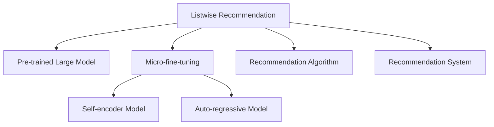

                 

# 大模型在列表排序式推荐中的优越性

> 关键词：大模型, 列表排序式推荐, 推荐系统, 深度学习, 神经网络, 推荐算法

## 1. 背景介绍

### 1.1 问题由来

随着电子商务、社交网络等平台的发展，个性化推荐成为提升用户体验的重要手段。传统的推荐系统主要是基于协同过滤、矩阵分解等方法，依赖用户历史行为数据进行个性化推荐。这些方法虽然有效，但往往面临数据稀疏性、冷启动问题，且无法很好地处理长尾物品和个性化需求。而基于深度学习的推荐系统，尤其是通过预训练大模型进行推荐，能更好地适应长尾数据、异构性数据、低维表示等挑战，逐步成为推荐领域的研究热点。

其中，列表排序式推荐(Listwise Recommendation)作为推荐系统的重要分支，通过直接优化用户-物品的排序权重，提高推荐结果的相关性和多样性。该方法利用用户对推荐列表中的物品进行排序反馈，如评分、点击率等，通过优化排序目标函数，生成高质量的推荐列表。列表排序式推荐相较于基于隐式反馈的协同过滤方法，能够更直接地反映用户的偏好和评价，从而提升推荐效果。

### 1.2 问题核心关键点

列表排序式推荐的核心在于如何构建高效的推荐模型，优化排序目标函数，并利用预训练大模型的知识，更好地适应复杂用户需求和多样化数据。传统的基于浅层神经网络的列表排序式推荐方法，如Listwise Learning to Rank (LLTR)，虽然简单有效，但在面对大规模数据和复杂数据结构时，性能往往不够理想。而基于预训练大模型的推荐方法，通过在大规模语料上进行预训练，学习通用的语言表示，再通过微调优化推荐目标函数，能够在大幅提升推荐效果的同时，减少特征工程和模型调参的复杂度。

本文聚焦于大模型在列表排序式推荐中的应用，探讨其在推荐系统中的优势、优化策略和未来发展方向，旨在为推荐系统开发者提供指导和借鉴。

## 2. 核心概念与联系

### 2.1 核心概念概述

为更好地理解大模型在列表排序式推荐中的应用，本节将介绍几个密切相关的核心概念：

- 列表排序式推荐(Listwise Recommendation)：通过优化用户对推荐列表的排序反馈，生成高质量的推荐列表，如评分排序、点击率排序等。
- 预训练大模型(Pre-trained Large Model)：在大规模无标签文本语料上，通过自监督学习任务训练通用语言模型，学习通用的语言表示，具备强大的语言理解和生成能力。
- 微调(Fine-tuning)：在预训练模型的基础上，使用下游任务的少量标注数据，通过有监督学习优化模型在特定任务上的性能。
- 自回归模型(Autoregressive Model)：如GPT、BERT等，通过前向传播预测后续输出，学习语言的条件概率。
- 自编码模型(Autocoding Model)：如BERT、GPT-2等，通过前向传播和后向传播的联合训练，学习语言的无监督表示。
- 推荐算法(Recommendation Algorithm)：通过构建推荐模型，预测用户对物品的评分或选择概率，生成推荐结果。
- 推荐系统(Recommendation System)：结合用户历史行为和推荐算法，为用户生成个性化推荐列表的系统。

这些核心概念之间的逻辑关系可以通过以下Mermaid流程图来展示：



这个流程图展示了大模型在列表排序式推荐中的应用场景和关键概念：

1. 大模型通过预训练学习通用的语言表示。
2. 利用微调优化推荐目标函数，生成推荐列表。
3. 自编码模型和自回归模型分别用于不同任务。
4. 推荐算法和推荐系统结合用户数据进行个性化推荐。

这些概念共同构成了大模型在列表排序式推荐中的应用框架，使其能够在复杂多样的推荐任务中发挥强大的性能。通过理解这些核心概念，我们可以更好地把握大模型在推荐系统中的应用思路和优化策略。

## 3. 核心算法原理 & 具体操作步骤
### 3.1 算法原理概述

大模型在列表排序式推荐中的核心思想是，通过在大规模文本语料上进行预训练，学习通用的语言表示，然后在推荐任务上进行微调，优化排序目标函数，生成高质量的推荐列表。具体来说，算法流程如下：

1. 选择合适的预训练大模型 $M_{\theta}$，作为推荐系统的基础特征提取器。
2. 准备推荐任务的数据集 $D=\{(x_i, y_i)\}_{i=1}^N$，其中 $x_i$ 为推荐列表，$y_i$ 为用户对推荐列表的排序反馈，如评分、点击率等。
3. 在预训练模型 $M_{\theta}$ 上，添加推荐任务适配层，如最大池化层、全连接层等，将其转化为推荐模型。
4. 设置微调超参数，如学习率、批大小、迭代轮数等。
5. 执行梯度训练，最小化推荐任务的目标函数。
6. 测试和评估微调后模型在推荐任务上的性能，对比微调前后的推荐效果。

### 3.2 算法步骤详解

基于大模型的列表排序式推荐具体步骤如下：

**Step 1: 准备预训练模型和数据集**
- 选择合适的预训练语言模型 $M_{\theta}$，如BERT、GPT等。
- 准备推荐任务的数据集 $D$，其中 $x_i$ 为推荐列表，$y_i$ 为用户对推荐列表的排序反馈。

**Step 2: 添加推荐任务适配层**
- 根据推荐任务，在预训练模型顶层设计合适的推荐任务适配层。例如，对于评分排序任务，可添加评分预测网络；对于点击率排序任务，可添加点击率预测网络。
- 为适配层添加推荐任务的目标函数，如交叉熵损失、点积损失等。

**Step 3: 设置微调超参数**
- 选择合适的优化算法及其参数，如 AdamW、SGD 等。
- 设置学习率、批大小、迭代轮数等超参数。
- 确定冻结预训练参数的策略，如仅微调顶层，或全部参数都参与微调。

**Step 4: 执行梯度训练**
- 将训练集数据分批次输入模型，前向传播计算推荐目标函数的预测值。
- 反向传播计算参数梯度，根据设定的优化算法和学习率更新模型参数。
- 周期性在验证集上评估模型性能，根据性能指标决定是否触发 Early Stopping。
- 重复上述步骤直到满足预设的迭代轮数或 Early Stopping 条件。

**Step 5: 测试和部署**
- 在测试集上评估微调后模型在推荐任务上的性能，对比微调前后的推荐效果。
- 使用微调后的模型对新样本进行推荐预测，集成到实际的应用系统中。

### 3.3 算法优缺点

基于大模型的列表排序式推荐方法具有以下优点：

1. 处理长尾数据能力强。大模型通过在大规模语料上进行预训练，学习到丰富的语言表示，能够更好地处理长尾数据和多样化用户需求。
2. 减少特征工程复杂度。通过大模型的自编码特征提取，减少了手工特征工程的需要，降低了模型调参的复杂度。
3. 提升推荐效果。通过微调优化推荐目标函数，生成高质量的推荐列表，能够显著提升推荐系统的相关性和多样性。
4. 适用性广。适用于各种类型的推荐任务，包括评分排序、点击率排序等。

同时，该方法也存在一定的局限性：

1. 依赖标注数据。微调的效果很大程度上取决于标注数据的质量和数量，获取高质量标注数据的成本较高。
2. 过拟合风险。由于模型参数较多，容易发生过拟合，特别是在小规模标注数据上。
3. 训练成本高。大模型的预训练和微调需要大量计算资源，训练成本较高。
4. 可解释性不足。大模型的决策过程往往缺乏可解释性，难以对其推荐逻辑进行分析和调试。

尽管存在这些局限性，但就目前而言，基于大模型的推荐方法仍是大规模推荐系统的有力竞争者。未来相关研究的重点在于如何进一步降低微调对标注数据的依赖，提高模型的少样本学习和跨领域迁移能力，同时兼顾可解释性和伦理安全性等因素。

### 3.4 算法应用领域

大模型在列表排序式推荐中的应用，已经逐渐被广泛应用于电商、新闻推荐、视频推荐等众多领域。以下是几个典型的应用场景：

1. 电商推荐：根据用户历史浏览、购买记录，生成个性化商品推荐列表。
2. 新闻推荐：根据用户阅读习惯，生成个性化新闻推荐列表。
3. 视频推荐：根据用户观看历史，生成个性化视频推荐列表。
4. 社交网络推荐：根据用户互动行为，生成个性化好友推荐列表。

除了这些常见应用外，大模型在推荐领域还有更多的创新方向，如联合推荐、跨模态推荐、实时推荐等。随着技术的不断进步，相信大模型将会在更多推荐任务中大放异彩。

## 4. 数学模型和公式 & 详细讲解  
### 4.1 数学模型构建

假设推荐任务的数据集为 $D=\{(x_i, y_i)\}_{i=1}^N$，其中 $x_i$ 为推荐列表，$y_i$ 为用户对推荐列表的排序反馈，如评分、点击率等。记预训练语言模型为 $M_{\theta}$，推荐任务适配层为 $H_{\theta}$，推荐目标函数为 $L$。

则推荐模型的总损失函数为：

$$
\mathcal{L}(\theta) = \frac{1}{N} \sum_{i=1}^N L(M_{\theta}(x_i), y_i)
$$

其中 $L$ 为推荐任务的目标函数，如交叉熵损失、点积损失等。通过微调模型 $M_{\theta}$ 的参数，最小化上述损失函数，生成高质量的推荐列表。

### 4.2 公式推导过程

以评分排序任务为例，假设计算推荐列表 $x_i$ 中每个物品的评分预测为 $p_{i,j}$，用户对 $x_i$ 的评分反馈为 $y_i$，则评分排序任务的目标函数为：

$$
L(p_i, y_i) = -\sum_{j=1}^m y_i \log p_{i,j}
$$

其中 $m$ 为推荐列表中的物品数量。将评分预测 $p_{i,j}$ 代入预训练语言模型 $M_{\theta}$，得到：

$$
p_{i,j} = M_{\theta}(x_i, j)
$$

其中 $j$ 表示推荐列表中的物品位置。因此，评分排序任务的目标函数可以写为：

$$
\mathcal{L}(\theta) = -\frac{1}{N} \sum_{i=1}^N \sum_{j=1}^m y_i \log M_{\theta}(x_i, j)
$$

在得到推荐目标函数的梯度后，即可带入参数更新公式，完成模型的迭代优化。重复上述过程直至收敛，最终得到适应推荐任务的最优模型参数 $\theta^*$。

## 5. 项目实践：代码实例和详细解释说明
### 5.1 开发环境搭建

在进行推荐任务微调前，我们需要准备好开发环境。以下是使用Python进行PyTorch开发的环境配置流程：

1. 安装Anaconda：从官网下载并安装Anaconda，用于创建独立的Python环境。

2. 创建并激活虚拟环境：
```bash
conda create -n pytorch-env python=3.8 
conda activate pytorch-env
```

3. 安装PyTorch：根据CUDA版本，从官网获取对应的安装命令。例如：
```bash
conda install pytorch torchvision torchaudio cudatoolkit=11.1 -c pytorch -c conda-forge
```

4. 安装Transformers库：
```bash
pip install transformers
```

5. 安装各类工具包：
```bash
pip install numpy pandas scikit-learn matplotlib tqdm jupyter notebook ipython
```

完成上述步骤后，即可在`pytorch-env`环境中开始推荐任务微调实践。

### 5.2 源代码详细实现

下面我们以评分排序任务为例，给出使用Transformers库对BERT模型进行评分排序任务微调的PyTorch代码实现。

首先，定义评分排序任务的DataLoader：

```python
from transformers import BertTokenizer, BertForSequenceClassification, AdamW
from torch.utils.data import Dataset, DataLoader
import torch

class RecommenderDataset(Dataset):
    def __init__(self, texts, labels, tokenizer, max_len=128):
        self.texts = texts
        self.labels = labels
        self.tokenizer = tokenizer
        self.max_len = max_len
        
    def __len__(self):
        return len(self.texts)
    
    def __getitem__(self, item):
        text = self.texts[item]
        label = self.labels[item]
        
        encoding = self.tokenizer(text, return_tensors='pt', max_length=self.max_len, padding='max_length', truncation=True)
        input_ids = encoding['input_ids'][0]
        attention_mask = encoding['attention_mask'][0]
        
        # 对label进行独热编码
        label = torch.tensor(label, dtype=torch.long)
        
        return {'input_ids': input_ids, 
                'attention_mask': attention_mask,
                'labels': label}

# 定义评分排序任务的目标函数
def compute_loss(p, y):
    return torch.mean(-torch.sum(y * torch.log(p), dim=-1))

# 定义评分排序任务的数据集
tokenizer = BertTokenizer.from_pretrained('bert-base-cased')

train_dataset = RecommenderDataset(train_texts, train_labels, tokenizer)
dev_dataset = RecommenderDataset(dev_texts, dev_labels, tokenizer)
test_dataset = RecommenderDataset(test_texts, test_labels, tokenizer)

# 定义评分排序任务的模型
model = BertForSequenceClassification.from_pretrained('bert-base-cased', num_labels=1)

# 定义优化器和超参数
optimizer = AdamW(model.parameters(), lr=2e-5)

# 定义评分排序任务的训练和评估函数
def train_epoch(model, dataset, batch_size, optimizer):
    dataloader = DataLoader(dataset, batch_size=batch_size, shuffle=True)
    model.train()
    epoch_loss = 0
    for batch in dataloader:
        input_ids = batch['input_ids'].to(device)
        attention_mask = batch['attention_mask'].to(device)
        labels = batch['labels'].to(device)
        model.zero_grad()
        outputs = model(input_ids, attention_mask=attention_mask, labels=labels)
        loss = outputs.loss
        epoch_loss += loss.item()
        loss.backward()
        optimizer.step()
    return epoch_loss / len(dataloader)

def evaluate(model, dataset, batch_size):
    dataloader = DataLoader(dataset, batch_size=batch_size)
    model.eval()
    preds, labels = [], []
    with torch.no_grad():
        for batch in dataloader:
            input_ids = batch['input_ids'].to(device)
            attention_mask = batch['attention_mask'].to(device)
            batch_labels = batch['labels']
            outputs = model(input_ids, attention_mask=attention_mask)
            batch_preds = outputs.logits.argmax(dim=1).to('cpu').tolist()
            batch_labels = batch_labels.to('cpu').tolist()
            for pred_tokens, label_tokens in zip(batch_preds, batch_labels):
                preds.append(pred_tokens)
                labels.append(label_tokens)
                
    print(compute_loss(torch.tensor(preds, dtype=torch.float32), torch.tensor(labels, dtype=torch.float32)))
```

然后，定义评分排序任务的微调过程：

```python
epochs = 5
batch_size = 16

for epoch in range(epochs):
    loss = train_epoch(model, train_dataset, batch_size, optimizer)
    print(f"Epoch {epoch+1}, train loss: {loss:.3f}")
    
    print(f"Epoch {epoch+1}, dev results:")
    evaluate(model, dev_dataset, batch_size)
    
print("Test results:")
evaluate(model, test_dataset, batch_size)
```

以上就是使用PyTorch对BERT进行评分排序任务微调的完整代码实现。可以看到，得益于Transformers库的强大封装，我们可以用相对简洁的代码完成BERT模型的加载和微调。

### 5.3 代码解读与分析

让我们再详细解读一下关键代码的实现细节：

**RecommenderDataset类**：
- `__init__`方法：初始化文本、标签、分词器等关键组件。
- `__len__`方法：返回数据集的样本数量。
- `__getitem__`方法：对单个样本进行处理，将文本输入编码为token ids，将标签进行独热编码，并对其进行定长padding，最终返回模型所需的输入。

**tokenizer**：
- 定义了BERT模型的分词器，用于将文本分词并转换为模型所需的格式。

**compute_loss函数**：
- 定义评分排序任务的目标函数，计算模型预测的评分与真实标签的交叉熵损失。

**评分排序任务的数据集**：
- 使用RecommenderDataset类构建训练集、验证集和测试集，其中标签进行独热编码，以适应分类损失函数。

**评分排序任务的模型**：
- 使用BertForSequenceClassification类构建评分排序任务的模型，指定输出为一个二分类任务。

**优化器和超参数**：
- 定义AdamW优化器，设置学习率等超参数。

**评分排序任务的训练和评估函数**：
- 使用PyTorch的DataLoader对数据集进行批次化加载，供模型训练和推理使用。
- 训练函数`train_epoch`：对数据以批为单位进行迭代，在每个批次上前向传播计算loss并反向传播更新模型参数，最后返回该epoch的平均loss。
- 评估函数`evaluate`：与训练类似，不同点在于不更新模型参数，并在每个batch结束后将预测和标签结果存储下来，最后使用自定义的评分排序任务目标函数计算评分排序误差。

**评分排序任务的微调过程**：
- 定义总的epoch数和batch size，开始循环迭代
- 每个epoch内，先在训练集上训练，输出平均loss
- 在验证集上评估，输出评分排序误差
- 所有epoch结束后，在测试集上评估，给出最终测试结果

可以看到，PyTorch配合Transformers库使得BERT微调的代码实现变得简洁高效。开发者可以将更多精力放在数据处理、模型改进等高层逻辑上，而不必过多关注底层的实现细节。

当然，工业级的系统实现还需考虑更多因素，如模型的保存和部署、超参数的自动搜索、更灵活的任务适配层等。但核心的微调范式基本与此类似。

## 6. 实际应用场景
### 6.1 电商推荐

电商推荐系统是推荐系统的重要应用之一，主要目标是提高用户的购买转化率。传统的电商推荐系统主要依赖协同过滤和基于内容的推荐算法，但由于数据稀疏性、长尾问题等限制，性能表现有限。而基于大模型的电商推荐系统，通过在大规模语料上进行预训练，学习到通用的语言表示，再通过微调优化推荐目标函数，生成高质量的推荐列表，能够大幅提升推荐效果。

具体而言，电商推荐系统可以利用用户历史浏览记录、购买记录等数据，生成个性化推荐列表。在训练过程中，通过大模型的自编码特征提取，能够捕捉到更多的用户行为特征和物品属性信息，从而生成更加精准的推荐结果。此外，大模型还能够处理长尾物品和多样化用户需求，提升推荐列表的多样性。电商推荐系统可以通过实时更新用户行为数据，动态调整推荐策略，提高推荐效果。

### 6.2 新闻推荐

新闻推荐系统主要目的是为用户提供个性化新闻内容，提升用户的新闻阅读体验。传统的新闻推荐系统主要依赖协同过滤和基于内容的推荐算法，但由于数据稀疏性和多样性，推荐效果有限。而基于大模型的新闻推荐系统，通过在大规模语料上进行预训练，学习到通用的语言表示，再通过微调优化推荐目标函数，生成高质量的推荐列表，能够更好地适应用户的新闻阅读习惯。

具体而言，新闻推荐系统可以利用用户的历史阅读记录、点击记录等数据，生成个性化新闻推荐列表。在训练过程中，通过大模型的自编码特征提取，能够捕捉到更多的用户兴趣和新闻特征，从而生成更加精准的推荐结果。此外，大模型还能够处理多样化的新闻类型和主题，提升推荐列表的多样性。新闻推荐系统可以通过实时更新用户行为数据，动态调整推荐策略，提高推荐效果。

### 6.3 视频推荐

视频推荐系统主要目的是为用户提供个性化的视频内容，提升用户的观看体验。传统的视频推荐系统主要依赖协同过滤和基于内容的推荐算法，但由于数据稀疏性和多样性，推荐效果有限。而基于大模型的视频推荐系统，通过在大规模语料上进行预训练，学习到通用的语言表示，再通过微调优化推荐目标函数，生成高质量的推荐列表，能够更好地适应用户的观看习惯。

具体而言，视频推荐系统可以利用用户的历史观看记录、点赞记录等数据，生成个性化视频推荐列表。在训练过程中，通过大模型的自编码特征提取，能够捕捉到更多的用户兴趣和视频特征，从而生成更加精准的推荐结果。此外，大模型还能够处理多样化的视频类型和主题，提升推荐列表的多样性。视频推荐系统可以通过实时更新用户行为数据，动态调整推荐策略，提高推荐效果。

### 6.4 未来应用展望

随着大模型和微调方法的不断发展，基于大模型的推荐系统将在更多领域得到应用，为推荐系统开发者提供指导和借鉴。

在智慧医疗领域，基于大模型的推荐系统可以推荐个性化的医疗方案，提高诊疗效率和患者满意度。

在智能教育领域，基于大模型的推荐系统可以推荐个性化的学习内容和教材，提升学习效果和学习体验。

在智慧城市治理中，基于大模型的推荐系统可以推荐个性化的城市活动和景点，提升居民的幸福感和城市的活力。

此外，在企业生产、社会治理、文娱传媒等众多领域，基于大模型的推荐系统也将不断涌现，为各行各业带来变革性影响。相信随着技术的日益成熟，大模型推荐系统必将在更广阔的领域大放异彩。

## 7. 工具和资源推荐
### 7.1 学习资源推荐

为了帮助开发者系统掌握大模型在推荐系统中的应用，这里推荐一些优质的学习资源：

1. 《深度学习与推荐系统》书籍：介绍了推荐系统的基本概念和推荐算法，详细讲解了基于深度学习的推荐系统。

2. 《Natural Language Processing with Transformers》书籍：Transformers库的作者所著，全面介绍了如何使用Transformers库进行NLP任务开发，包括推荐系统在内的多个方向。

3. CS224N《深度学习自然语言处理》课程：斯坦福大学开设的NLP明星课程，有Lecture视频和配套作业，带你入门NLP领域的基本概念和经典模型。

4. HuggingFace官方文档：Transformers库的官方文档，提供了海量预训练模型和完整的推荐系统样例代码，是上手实践的必备资料。

5. Kaggle推荐系统竞赛：平台提供了多个推荐系统竞赛，供开发者在实际场景中进行学习和实践。

通过对这些资源的学习实践，相信你一定能够快速掌握大模型在推荐系统中的应用思路和优化策略，为推荐系统开发提供指导和借鉴。
###  7.2 开发工具推荐

高效的开发离不开优秀的工具支持。以下是几款用于大模型推荐系统开发的常用工具：

1. PyTorch：基于Python的开源深度学习框架，灵活动态的计算图，适合快速迭代研究。大部分预训练语言模型都有PyTorch版本的实现。

2. TensorFlow：由Google主导开发的开源深度学习框架，生产部署方便，适合大规模工程应用。同样有丰富的预训练语言模型资源。

3. Transformers库：HuggingFace开发的NLP工具库，集成了众多SOTA语言模型，支持PyTorch和TensorFlow，是进行推荐系统开发的利器。

4. Weights & Biases：模型训练的实验跟踪工具，可以记录和可视化模型训练过程中的各项指标，方便对比和调优。与主流深度学习框架无缝集成。

5. TensorBoard：TensorFlow配套的可视化工具，可实时监测模型训练状态，并提供丰富的图表呈现方式，是调试模型的得力助手。

6. Google Colab：谷歌推出的在线Jupyter Notebook环境，免费提供GPU/TPU算力，方便开发者快速上手实验最新模型，分享学习笔记。

合理利用这些工具，可以显著提升大模型推荐系统的开发效率，加快创新迭代的步伐。

### 7.3 相关论文推荐

大模型在推荐系统中的应用源于学界的持续研究。以下是几篇奠基性的相关论文，推荐阅读：

1. Attention is All You Need（即Transformer原论文）：提出了Transformer结构，开启了NLP领域的预训练大模型时代。

2. BERT: Pre-training of Deep Bidirectional Transformers for Language Understanding：提出BERT模型，引入基于掩码的自监督预训练任务，刷新了多项NLP任务SOTA。

3. Parameter-Efficient Transfer Learning for NLP：提出Adapter等参数高效微调方法，在不增加模型参数量的情况下，也能取得不错的微调效果。

4. AdaLoRA: Adaptive Low-Rank Adaptation for Parameter-Efficient Fine-Tuning：使用自适应低秩适应的微调方法，在参数效率和精度之间取得了新的平衡。

这些论文代表了大模型在推荐系统中的应用方向。通过学习这些前沿成果，可以帮助研究者把握学科前进方向，激发更多的创新灵感。

## 8. 总结：未来发展趋势与挑战

### 8.1 总结

本文对大模型在列表排序式推荐中的应用进行了全面系统的介绍。首先阐述了推荐系统和大模型的基本概念和核心问题，明确了预训练-微调在推荐系统中的重要性和优势。其次，从原理到实践，详细讲解了评分排序任务的大模型微调方法，给出了微调任务开发的完整代码实例。同时，本文还广泛探讨了大模型在电商推荐、新闻推荐、视频推荐等多个领域的应用前景，展示了微调范式的巨大潜力。此外，本文精选了微调技术的各类学习资源，力求为开发者提供全方位的技术指引。

通过本文的系统梳理，可以看到，大模型在列表排序式推荐中的应用拓展了推荐系统的边界，提升了推荐效果和用户体验。得益于大模型的通用语言表示和微调方法，推荐系统能够更好地适应长尾数据和多样化用户需求，生成更加精准、个性化的推荐结果。未来，伴随预训练语言模型和微调方法的持续演进，相信大模型推荐系统必将在更广阔的应用领域大放异彩，推动推荐技术的发展。

### 8.2 未来发展趋势

展望未来，大模型在推荐系统中的研究与应用将呈现以下几个趋势：

1. 推荐模型规模增大。随着算力成本的下降和数据规模的扩张，大模型的规模还将进一步增大，能够学习更加全面和精确的用户和物品表示。

2. 跨模态推荐系统发展。未来的推荐系统不仅能够处理文本数据，还能融合图像、音频、视频等多模态数据，提升推荐效果和用户体验。

3. 元学习的应用。通过元学习技术，推荐系统能够在新的数据上快速适应，提升推荐模型的泛化能力和迁移能力。

4. 多任务学习。未来的推荐系统可以同时处理多个任务，如评分预测、点击率预测、召回率预测等，通过多任务学习提升整体推荐效果。

5. 实时推荐系统。未来的推荐系统能够实时处理用户行为数据，动态调整推荐策略，提高推荐效果。

6. 个性化推荐策略。未来的推荐系统能够更加智能地捕捉用户兴趣和行为，生成更加个性化和精准的推荐结果。

以上趋势凸显了大模型在推荐系统中的广阔前景。这些方向的探索发展，必将进一步提升推荐系统的性能和应用范围，为推荐系统开发者提供更多的指导和借鉴。

### 8.3 面临的挑战

尽管大模型在推荐系统中的应用取得了一定的成功，但在迈向更加智能化、普适化应用的过程中，仍面临诸多挑战：

1. 训练成本高。大模型的训练和微调需要大量的计算资源和时间，训练成本较高。如何降低训练成本，提升训练效率，是一个亟待解决的问题。

2. 可解释性不足。大模型的决策过程往往缺乏可解释性，难以对其推荐逻辑进行分析和调试。如何赋予推荐模型更强的可解释性，是未来研究的重要方向。

3. 推荐模型过拟合。由于模型参数较多，容易发生过拟合，特别是在小规模标注数据上。如何降低过拟合风险，提高模型的泛化能力，是一个亟待解决的问题。

4. 跨领域推荐模型迁移能力不足。当目标领域与预训练数据分布差异较大时，推荐模型的性能提升有限。如何提高模型的跨领域迁移能力，是未来研究的重要方向。

5. 模型鲁棒性不足。推荐模型面临域外数据和对抗样本等挑战，模型的鲁棒性不足。如何提高推荐模型的鲁棒性，避免过拟合和对抗攻击，是未来研究的重要方向。

6. 数据隐私和安全问题。推荐系统需要处理大量用户隐私数据，如何保护用户隐私和数据安全，是未来研究的重要方向。

以上挑战凸显了大模型在推荐系统中的局限性，需要进一步研究和解决，才能更好地发挥其优势，推动推荐技术的发展。

### 8.4 研究展望

面对大模型在推荐系统中的挑战，未来的研究需要在以下几个方向进行进一步探索：

1. 开发更加高效的微调方法。开发参数高效的微调方法，减少训练成本，提高训练效率。同时优化模型的计算图，提升推理速度和资源利用率。

2. 引入更多先验知识。将符号化的先验知识，如知识图谱、逻辑规则等，与神经网络模型进行巧妙融合，引导推荐过程学习更准确、合理的用户和物品表示。

3. 融合因果分析和博弈论工具。将因果分析方法引入推荐模型，识别出推荐决策的关键特征，增强推荐逻辑的因果性和逻辑性。借助博弈论工具刻画人机交互过程，主动探索并规避推荐模型的脆弱点，提高系统稳定性。

4. 纳入伦理道德约束。在推荐模型训练目标中引入伦理导向的评估指标，过滤和惩罚有害的推荐结果，确保推荐系统符合人类价值观和伦理道德。

5. 引入多任务学习。通过多任务学习技术，提升推荐模型的泛化能力和迁移能力，同时优化模型的跨领域适应性。

6. 引入元学习。通过元学习技术，使推荐模型能够在新的数据上快速适应，提升模型的泛化能力和迁移能力。

这些研究方向的探索，必将引领大模型在推荐系统中的不断进步，推动推荐技术的发展。面向未来，大模型推荐系统需要与其他人工智能技术进行更深入的融合，如知识表示、因果推理、强化学习等，多路径协同发力，共同推动推荐技术的发展。只有勇于创新、敢于突破，才能不断拓展推荐系统的边界，实现推荐技术的广泛应用。

