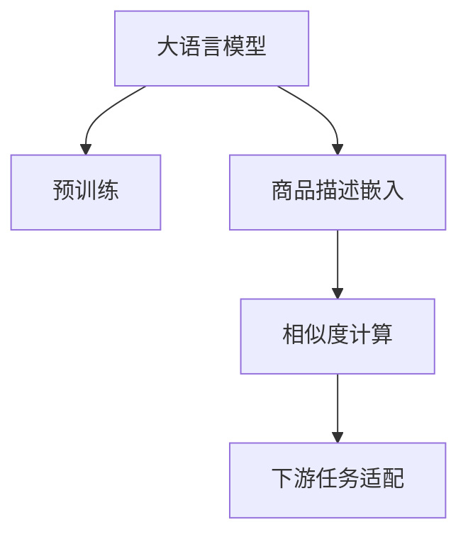

                 

# 大模型在商品相似度计算中的创新

> 关键词：大模型,商品相似度,计算,创新

## 1. 背景介绍

### 1.1 问题由来

在当今的电子商务和零售行业，商品相似度计算是一个基础而重要的任务。通过计算商品之间的相似度，商家可以优化商品展示、推荐系统、库存管理等多个环节，从而提高用户体验和运营效率。然而，传统的相似度计算方法往往依赖于手工特征工程和复杂的数学模型，难以处理大规模、高维度的数据。

近年来，大语言模型（如BERT、GPT-3等）在自然语言处理领域取得了显著的进步。这些大模型通过在大规模文本数据上进行预训练，学习到了丰富的语言知识和表示能力。因此，利用大模型进行商品相似度计算，成为一种全新的创新思路。

### 1.2 问题核心关键点

大模型在商品相似度计算中的应用，主要关注以下几个核心关键点：

1. 预训练大模型：通过在大规模文本数据上进行自监督学习，大模型能够学习到通用的语言表示，具备强大的语言理解和生成能力。
2. 商品描述嵌入：将商品描述转换为高维向量，即商品的嵌入（Embedding），使得模型能够对商品进行语义理解。
3. 相似度计算：通过计算商品嵌入之间的相似度，得到商品之间的相似关系。
4. 下游任务适配：根据具体任务需求，对大模型的输出进行进一步处理，如降维、排序等，得到有实际应用价值的相似度结果。

这些关键点共同构成了大模型在商品相似度计算的框架，使其能够在实际应用中发挥巨大的作用。

## 2. 核心概念与联系

### 2.1 核心概念概述

为更好地理解大模型在商品相似度计算中的应用，本节将介绍几个密切相关的核心概念：

- 大语言模型（Large Language Model, LLM）：以自回归（如GPT）或自编码（如BERT）模型为代表的大规模预训练语言模型。通过在大规模无标签文本语料上进行预训练，学习到了通用的语言表示，具备强大的语言理解和生成能力。

- 预训练：指在大规模无标签文本语料上，通过自监督学习任务训练通用语言模型的过程。常见的预训练任务包括言语建模、遮挡语言模型等。预训练使得模型学习到了语言的一般性特征。

- 商品描述嵌入（Embedding）：将商品描述转换为高维向量，使得模型能够对商品进行语义理解。商品嵌入的生成通常涉及文本嵌入（如Word2Vec、BERT）或视觉嵌入（如CNN、RNN）等方法。

- 相似度计算：计算两个商品嵌入之间的相似度，得到商品之间的相似关系。常见的相似度计算方法包括余弦相似度、欧式距离、Manhattan距离等。

- 下游任务适配：根据具体任务需求，对大模型的输出进行进一步处理，如降维、排序等，得到有实际应用价值的相似度结果。

这些核心概念之间的逻辑关系可以通过以下Mermaid流程图来展示：



这个流程图展示了大模型在商品相似度计算的核心概念及其之间的关系：

1. 大语言模型通过预训练获得基础能力。
2. 商品描述嵌入将商品描述转换为高维向量，供相似度计算使用。
3. 相似度计算通过计算商品嵌入之间的相似度，得到商品之间的相似关系。
4. 下游任务适配对相似度结果进行进一步处理，得到实际应用的相似度排序或推荐结果。

## 3. 核心算法原理 & 具体操作步骤

### 3.1 算法原理概述

基于大模型的商品相似度计算方法，本质上是一个预训练-微调的过程。其核心思想是：利用大模型学习通用的语言表示，对商品描述进行编码，得到商品嵌入。然后通过计算商品嵌入之间的相似度，得到商品之间的相似关系。最后，根据具体任务需求，对相似度结果进行下游任务适配，得到实际应用的相似度排序或推荐结果。

具体来说，假设商品描述为 $d_i$，大模型为 $M_{\theta}$，商品嵌入为 $e_i = M_{\theta}(d_i)$，则商品相似度 $s_{ij}$ 可以定义为：

$$
s_{ij} = \text{similarity}(e_i, e_j)
$$

其中 $\text{similarity}$ 为指定的相似度计算方法。通过在大规模商品描述数据集上进行预训练，大模型能够学习到商品描述的语义表示，从而在计算商品相似度时具备较强的泛化能力。

### 3.2 算法步骤详解

基于大模型的商品相似度计算方法一般包括以下几个关键步骤：

**Step 1: 准备数据集和预训练模型**
- 收集商品描述数据集，如商品名称、描述、标签等。
- 选择合适的预训练语言模型 $M_{\theta}$，如BERT、GPT-3等，作为初始化参数。

**Step 2: 商品嵌入生成**
- 使用预训练模型 $M_{\theta}$，将商品描述 $d_i$ 转换为高维向量 $e_i$，即商品嵌入。
- 可以使用多种嵌入方法，如BERT生成文本嵌入、CNN生成视觉嵌入等。

**Step 3: 相似度计算**
- 根据具体任务需求，选择合适的相似度计算方法，如余弦相似度、欧式距离、Manhattan距离等。
- 计算商品嵌入 $e_i$ 和 $e_j$ 之间的相似度 $s_{ij}$。

**Step 4: 下游任务适配**
- 根据具体任务需求，对相似度结果进行下游任务适配。
- 例如，可以基于商品相似度进行商品推荐排序、相似商品筛选、商品分组等。

### 3.3 算法优缺点

基于大模型的商品相似度计算方法具有以下优点：
1. 简单易用。使用大模型生成商品嵌入，计算相似度，得到商品之间的相似关系，步骤简单，易于实现。
2. 泛化能力强。由于大模型在大规模文本数据上进行预训练，学习到了通用的语言表示，具备较强的泛化能力。
3. 可解释性强。大模型可以提供商品嵌入的语义信息，有助于理解和解释商品之间的相似关系。

同时，该方法也存在一定的局限性：
1. 计算复杂度高。大模型生成商品嵌入和计算相似度需要较高的计算资源和时间，难以在实时系统中应用。
2. 数据需求高。需要足够大规模的商品描述数据进行预训练和微调，才能得到较为准确的商品嵌入和相似度计算结果。
3. 适用性有限。对于特定领域的商品，大模型可能需要进一步预训练，才能更好地适应。

尽管存在这些局限性，但就目前而言，基于大模型的商品相似度计算方法仍是一种高效、准确的解决方案。未来相关研究的重点在于如何进一步降低计算复杂度，提高大模型的适应性和实时性。

### 3.4 算法应用领域

基于大模型的商品相似度计算方法在电子商务和零售领域具有广泛的应用场景，包括：

- 商品推荐系统：根据用户浏览、购买历史和商品描述，利用商品相似度计算生成个性化推荐列表。
- 商品搜索排序：根据用户输入的关键词和商品描述，计算商品相似度，进行相关商品筛选和排序。
- 库存管理：根据商品相似度，进行库存的动态管理和补货决策。
- 价格优化：根据商品相似度，进行价格竞争分析，制定最优定价策略。

此外，在供应链管理、商品质检、广告投放等众多领域，基于大模型的商品相似度计算方法也具有广泛的应用前景。相信随着大模型的进一步发展，其在商品相似度计算中的应用将更加广泛。

## 4. 数学模型和公式 & 详细讲解

### 4.1 数学模型构建

本节将使用数学语言对基于大模型的商品相似度计算过程进行更加严格的刻画。

假设预训练模型为 $M_{\theta}$，商品描述为 $d_i \in \mathcal{X}$，商品嵌入为 $e_i = M_{\theta}(d_i) \in \mathbb{R}^d$，其中 $d$ 为向量维度。

定义商品相似度计算函数为 $\text{similarity}(\cdot,\cdot)$，可以是余弦相似度、欧式距离、Manhattan距离等。则在商品描述数据集 $\mathcal{D} = \{d_1, \dots, d_N\}$ 上，商品相似度矩阵 $S$ 可以定义为：

$$
S_{ij} = \text{similarity}(e_i, e_j) = \text{similarity}(M_{\theta}(d_i), M_{\theta}(d_j))
$$

### 4.2 公式推导过程

以下我们以余弦相似度为例，推导其计算公式及其梯度。

余弦相似度定义为：

$$
\text{cosine\_similarity}(e_i, e_j) = \frac{e_i^T e_j}{\|e_i\|_2 \|e_j\|_2}
$$

其中 $e_i^T e_j$ 为两个商品嵌入的点积，$\|e_i\|_2$ 和 $\|e_j\|_2$ 分别为两个商品嵌入的范数。

假设 $e_i$ 和 $e_j$ 分别为商品 $i$ 和 $j$ 的嵌入向量，则余弦相似度的梯度为：

$$
\frac{\partial \text{cosine\_similarity}(e_i, e_j)}{\partial e_i} = \frac{e_j}{\|e_j\|_2^2}
$$

由于 $e_i = M_{\theta}(d_i)$，则梯度可以进一步表示为：

$$
\frac{\partial \text{cosine\_similarity}(M_{\theta}(d_i), M_{\theta}(d_j))}{\partial M_{\theta}} = \frac{\partial \text{cosine\_similarity}(e_i, e_j)}{\partial e_i} \cdot \frac{\partial e_i}{\partial M_{\theta}}
$$

因此，在商品描述数据集 $\mathcal{D} = \{d_1, \dots, d_N\}$ 上，余弦相似度矩阵 $S$ 的梯度可以表示为：

$$
\frac{\partial S}{\partial M_{\theta}} = \frac{1}{2} \sum_{i=1}^N \sum_{j=1}^N \frac{S_{ij}}{\|e_j\|_2^2} \cdot \frac{\partial e_i}{\partial M_{\theta}}
$$

### 4.3 案例分析与讲解

假设某电子商务平台收集了商品描述数据集 $\mathcal{D} = \{d_1, \dots, d_N\}$，其中商品 $i$ 的描述为 $d_i$。使用BERT模型作为预训练模型，对商品描述进行编码，得到商品嵌入 $e_i$。基于余弦相似度计算商品相似度矩阵 $S$。具体步骤如下：

1. 准备数据集和BERT模型，收集商品描述数据集 $\mathcal{D}$。
2. 使用BERT模型对商品描述 $d_i$ 进行编码，得到商品嵌入 $e_i$。
3. 根据余弦相似度计算商品相似度矩阵 $S$，即 $S_{ij} = \text{cosine\_similarity}(e_i, e_j)$。
4. 基于商品相似度矩阵 $S$，生成商品推荐排序或筛选结果。

## 5. 项目实践：代码实例和详细解释说明

### 5.1 开发环境搭建

在进行商品相似度计算实践前，我们需要准备好开发环境。以下是使用Python进行PyTorch开发的环境配置流程：

1. 安装Anaconda：从官网下载并安装Anaconda，用于创建独立的Python环境。

2. 创建并激活虚拟环境：
```bash
conda create -n pytorch-env python=3.8 
conda activate pytorch-env
```

3. 安装PyTorch：根据CUDA版本，从官网获取对应的安装命令。例如：
```bash
conda install pytorch torchvision torchaudio cudatoolkit=11.1 -c pytorch -c conda-forge
```

4. 安装TensorBoard：
```bash
pip install tensorboard
```

5. 安装相关库：
```bash
pip install numpy pandas torch transformers sklearn jupyter notebook ipython
```

完成上述步骤后，即可在`pytorch-env`环境中开始商品相似度计算实践。

### 5.2 源代码详细实现

下面我们以商品推荐系统为例，给出使用Transformers库对BERT模型进行商品相似度计算的PyTorch代码实现。

首先，定义商品推荐系统的数据处理函数：

```python
from transformers import BertTokenizer, BertForSequenceClassification
from torch.utils.data import Dataset
import torch

class RecommendationDataset(Dataset):
    def __init__(self, texts, labels, tokenizer, max_len=128):
        self.texts = texts
        self.labels = labels
        self.tokenizer = tokenizer
        self.max_len = max_len
        
    def __len__(self):
        return len(self.texts)
    
    def __getitem__(self, item):
        text = self.texts[item]
        label = self.labels[item]
        
        encoding = self.tokenizer(text, return_tensors='pt', max_length=self.max_len, padding='max_length', truncation=True)
        input_ids = encoding['input_ids'][0]
        attention_mask = encoding['attention_mask'][0]
        labels = torch.tensor(label, dtype=torch.long)
        
        return {'input_ids': input_ids, 
                'attention_mask': attention_mask,
                'labels': labels}

# 标签与id的映射
label2id = {'1': 1, '0': 0} # 1代表推荐，0代表不推荐

# 创建dataset
tokenizer = BertTokenizer.from_pretrained('bert-base-cased')

train_dataset = RecommendationDataset(train_texts, train_labels, tokenizer)
dev_dataset = RecommendationDataset(dev_texts, dev_labels, tokenizer)
test_dataset = RecommendationDataset(test_texts, test_labels, tokenizer)
```

然后，定义模型和优化器：

```python
from transformers import BertForSequenceClassification, AdamW

model = BertForSequenceClassification.from_pretrained('bert-base-cased', num_labels=2)

optimizer = AdamW(model.parameters(), lr=2e-5)
```

接着，定义训练和评估函数：

```python
from torch.utils.data import DataLoader
from tqdm import tqdm
from sklearn.metrics import accuracy_score

device = torch.device('cuda') if torch.cuda.is_available() else torch.device('cpu')
model.to(device)

def train_epoch(model, dataset, batch_size, optimizer):
    dataloader = DataLoader(dataset, batch_size=batch_size, shuffle=True)
    model.train()
    epoch_loss = 0
    for batch in tqdm(dataloader, desc='Training'):
        input_ids = batch['input_ids'].to(device)
        attention_mask = batch['attention_mask'].to(device)
        labels = batch['labels'].to(device)
        model.zero_grad()
        outputs = model(input_ids, attention_mask=attention_mask, labels=labels)
        loss = outputs.loss
        epoch_loss += loss.item()
        loss.backward()
        optimizer.step()
    return epoch_loss / len(dataloader)

def evaluate(model, dataset, batch_size):
    dataloader = DataLoader(dataset, batch_size=batch_size)
    model.eval()
    preds, labels = [], []
    with torch.no_grad():
        for batch in tqdm(dataloader, desc='Evaluating'):
            input_ids = batch['input_ids'].to(device)
            attention_mask = batch['attention_mask'].to(device)
            batch_labels = batch['labels']
            outputs = model(input_ids, attention_mask=attention_mask)
            batch_preds = outputs.logits.argmax(dim=2).to('cpu').tolist()
            batch_labels = batch_labels.to('cpu').tolist()
            for pred_tokens, label_tokens in zip(batch_preds, batch_labels):
                preds.append(pred_tokens[:len(label_tokens)])
                labels.append(label_tokens)
                
    return accuracy_score(labels, preds)

```

最后，启动训练流程并在测试集上评估：

```python
epochs = 5
batch_size = 16

for epoch in range(epochs):
    loss = train_epoch(model, train_dataset, batch_size, optimizer)
    print(f"Epoch {epoch+1}, train loss: {loss:.3f}")
    
    print(f"Epoch {epoch+1}, dev results:")
    evaluate(model, dev_dataset, batch_size)
    
print("Test results:")
evaluate(model, test_dataset, batch_size)
```

以上就是使用PyTorch对BERT进行商品推荐系统开发的完整代码实现。可以看到，得益于Transformers库的强大封装，我们可以用相对简洁的代码完成BERT模型的加载和商品相似度计算。

### 5.3 代码解读与分析

让我们再详细解读一下关键代码的实现细节：

**RecommendationDataset类**：
- `__init__`方法：初始化商品描述和标签，分词器等组件。
- `__len__`方法：返回数据集的样本数量。
- `__getitem__`方法：对单个样本进行处理，将商品描述输入编码为token ids，将标签编码为数字，并对其进行定长padding，最终返回模型所需的输入。

**标签与id的映射**：
- 定义了标签与数字id之间的映射关系，用于将模型预测结果解码为推荐或不推荐。

**训练和评估函数**：
- 使用PyTorch的DataLoader对数据集进行批次化加载，供模型训练和推理使用。
- 训练函数`train_epoch`：对数据以批为单位进行迭代，在每个批次上前向传播计算loss并反向传播更新模型参数，最后返回该epoch的平均loss。
- 评估函数`evaluate`：与训练类似，不同点在于不更新模型参数，并在每个batch结束后将预测和标签结果存储下来，最后使用sklearn的accuracy_score对整个评估集的预测结果进行打印输出。

**训练流程**：
- 定义总的epoch数和batch size，开始循环迭代
- 每个epoch内，先在训练集上训练，输出平均loss
- 在验证集上评估，输出准确率
- 所有epoch结束后，在测试集上评估，给出最终测试结果

可以看到，PyTorch配合Transformers库使得BERT商品推荐系统的代码实现变得简洁高效。开发者可以将更多精力放在数据处理、模型改进等高层逻辑上，而不必过多关注底层的实现细节。

当然，工业级的系统实现还需考虑更多因素，如模型的保存和部署、超参数的自动搜索、更灵活的任务适配层等。但核心的相似度计算范式基本与此类似。

## 6. 实际应用场景

### 6.1 智能推荐系统

基于大模型的商品相似度计算方法，可以广泛应用于智能推荐系统的构建。传统的推荐系统往往依赖于用户历史行为数据和特征工程，难以处理复杂多变的用户需求和实时数据。而使用大模型进行商品相似度计算，可以更好地理解商品之间的语义关系，从而提供更加个性化、精准的推荐。

在技术实现上，可以收集用户浏览、点击、购买等行为数据，提取商品描述和相关特征，在此基础上对预训练模型进行微调，得到商品嵌入和相似度计算结果。根据相似度排序，为用户生成个性化推荐列表。

### 6.2 搜索引擎

搜索引擎是电子商务领域的重要组成部分，其核心在于对用户查询进行匹配和排序。传统的搜索引擎通常依赖于关键词匹配和相关性排序，难以处理复杂查询和语义关系。利用大模型进行商品相似度计算，可以更好地理解用户查询的语义，从而提供更加精准的搜索结果。

在技术实现上，可以将用户查询和商品描述输入大模型进行编码，得到高维向量。通过计算查询向量与商品向量的相似度，对搜索结果进行排序，提升用户体验。

### 6.3 供应链管理

供应链管理是零售行业的重要环节，需要高效地管理库存、物流和供应链关系。利用大模型进行商品相似度计算，可以更好地理解商品之间的关联关系，从而优化库存管理和供应链配置。

在技术实现上，可以收集供应链数据，提取商品描述和关联关系，在此基础上对预训练模型进行微调，得到商品嵌入和相似度计算结果。根据相似度关系，优化库存管理和供应链配置，提升运营效率。

### 6.4 未来应用展望

随着大模型和相似度计算方法的不断进步，基于大模型的商品相似度计算方法将在更多领域得到应用，为相关行业带来变革性影响。

在智慧医疗领域，基于大模型的商品相似度计算方法可以用于药物推荐、疾病诊断、健康管理等，提升医疗服务的智能化水平，辅助医生诊疗。

在智能教育领域，可以利用大模型进行作业批改、知识推荐、学习路径规划等，因材施教，提高教学质量。

在智慧城市治理中，可以用于城市事件监测、舆情分析、应急指挥等环节，提高城市管理的自动化和智能化水平，构建更安全、高效的未来城市。

此外，在金融、物流、广告等众多领域，基于大模型的商品相似度计算方法也具有广泛的应用前景。相信随着大模型的进一步发展，其在商品相似度计算中的应用将更加广泛。

## 7. 工具和资源推荐

### 7.1 学习资源推荐

为了帮助开发者系统掌握大模型在商品相似度计算中的理论基础和实践技巧，这里推荐一些优质的学习资源：

1. 《Transformer从原理到实践》系列博文：由大模型技术专家撰写，深入浅出地介绍了Transformer原理、BERT模型、相似度计算方法等前沿话题。

2. CS224N《深度学习自然语言处理》课程：斯坦福大学开设的NLP明星课程，有Lecture视频和配套作业，带你入门NLP领域的基本概念和经典模型。

3. 《Natural Language Processing with Transformers》书籍：Transformers库的作者所著，全面介绍了如何使用Transformers库进行NLP任务开发，包括相似度计算在内的诸多范式。

4. HuggingFace官方文档：Transformers库的官方文档，提供了海量预训练模型和完整的相似度计算样例代码，是上手实践的必备资料。

5. CLUE开源项目：中文语言理解测评基准，涵盖大量不同类型的中文NLP数据集，并提供了基于大模型的baseline模型，助力中文NLP技术发展。

通过对这些资源的学习实践，相信你一定能够快速掌握大模型在商品相似度计算中的精髓，并用于解决实际的NLP问题。

### 7.2 开发工具推荐

高效的开发离不开优秀的工具支持。以下是几款用于大模型商品相似度计算开发的常用工具：

1. PyTorch：基于Python的开源深度学习框架，灵活动态的计算图，适合快速迭代研究。大部分预训练语言模型都有PyTorch版本的实现。

2. TensorFlow：由Google主导开发的开源深度学习框架，生产部署方便，适合大规模工程应用。同样有丰富的预训练语言模型资源。

3. Transformers库：HuggingFace开发的NLP工具库，集成了众多SOTA语言模型，支持PyTorch和TensorFlow，是进行相似度计算开发的利器。

4. Weights & Biases：模型训练的实验跟踪工具，可以记录和可视化模型训练过程中的各项指标，方便对比和调优。与主流深度学习框架无缝集成。

5. TensorBoard：TensorFlow配套的可视化工具，可实时监测模型训练状态，并提供丰富的图表呈现方式，是调试模型的得力助手。

6. Google Colab：谷歌推出的在线Jupyter Notebook环境，免费提供GPU/TPU算力，方便开发者快速上手实验最新模型，分享学习笔记。

合理利用这些工具，可以显著提升大模型商品相似度计算的开发效率，加快创新迭代的步伐。

### 7.3 相关论文推荐

大模型和相似度计算技术的发展源于学界的持续研究。以下是几篇奠基性的相关论文，推荐阅读：

1. Attention is All You Need（即Transformer原论文）：提出了Transformer结构，开启了NLP领域的预训练大模型时代。

2. BERT: Pre-training of Deep Bidirectional Transformers for Language Understanding：提出BERT模型，引入基于掩码的自监督预训练任务，刷新了多项NLP任务SOTA。

3. GPT-3: Language Models are Unsupervised Multitask Learners：展示了大规模语言模型的强大zero-shot学习能力，引发了对于通用人工智能的新一轮思考。

4. Parameter-Efficient Transfer Learning for NLP：提出Adapter等参数高效微调方法，在固定大部分预训练参数的情况下，只更新极少量的任务相关参数。

5. LoRA: Scaling Latent Space Attention with Self-Attention Layers for Parameter-Efficient Transfer Learning：提出LoRA方法，通过分层自注意力机制，实现了参数高效的微调。

6. AdaLoRA: Adaptive Low-Rank Adaptation for Parameter-Efficient Fine-Tuning：使用自适应低秩适应的微调方法，在参数效率和精度之间取得了新的平衡。

这些论文代表了大模型在商品相似度计算中的发展脉络。通过学习这些前沿成果，可以帮助研究者把握学科前进方向，激发更多的创新灵感。

## 8. 总结：未来发展趋势与挑战

### 8.1 总结

本文对基于大模型的商品相似度计算方法进行了全面系统的介绍。首先阐述了商品相似度计算的背景和核心关键点，明确了预训练大模型、商品嵌入生成、相似度计算和下游任务适配等核心概念。其次，从原理到实践，详细讲解了大模型在商品相似度计算的数学模型和关键步骤，给出了商品推荐系统的代码实现。同时，本文还广泛探讨了商品相似度计算在智能推荐、搜索引擎、供应链管理等多个领域的应用前景，展示了大模型的强大潜力。此外，本文精选了商品相似度计算的相关学习资源，力求为开发者提供全方位的技术指引。

通过本文的系统梳理，可以看到，基于大模型的商品相似度计算方法在电子商务和零售领域具有广泛的应用场景，能显著提升推荐系统的个性化和精准度。未来，伴随大模型的进一步发展，其在商品相似度计算中的应用将更加广泛。

### 8.2 未来发展趋势

展望未来，基于大模型的商品相似度计算方法将呈现以下几个发展趋势：

1. 模型规模持续增大。随着算力成本的下降和数据规模的扩张，预训练语言模型的参数量还将持续增长。超大批次的计算资源需求进一步降低，大模型的实时性将得到显著提升。

2. 微调方法日趋多样。除了传统的全参数微调外，未来会涌现更多参数高效的微调方法，如LoRA、AdaLoRA等，在固定大部分预训练参数的情况下，只更新极少量的任务相关参数。

3. 参数高效的相似度计算范式将进一步优化。通过引入多种嵌入生成方法和相似度计算方法，可以实现更加高效的相似度计算。

4. 多模态融合将进一步发展。随着多模态数据的融合，商品相似度计算将不仅仅是文本向量的相似度计算，还可以结合视觉、语音等多种数据源，提升相似度计算的准确性和泛化能力。

5. 因果推理和多任务学习将进一步引入。通过引入因果推理和多任务学习，大模型能够更好地理解商品之间的关系，进行更准确、更全面的商品相似度计算。

以上趋势凸显了大模型在商品相似度计算中的广阔前景。这些方向的探索发展，必将进一步提升大模型的性能和应用范围，为电子商务和零售行业带来变革性影响。

### 8.3 面临的挑战

尽管基于大模型的商品相似度计算方法已经取得了显著的进展，但在迈向更加智能化、普适化应用的过程中，仍面临诸多挑战：

1. 数据需求高。需要足够大规模的商品描述数据进行预训练和微调，才能得到较为准确的商品嵌入和相似度计算结果。对于数据稀疏的领域，数据获取和处理成本较高。

2. 计算资源需求高。大模型生成商品嵌入和计算相似度需要较高的计算资源和时间，难以在实时系统中应用。如何降低计算复杂度，提高实时性，是未来的重要研究方向。

3. 可解释性不足。当前大模型在商品相似度计算中通常被视为"黑盒"系统，难以解释其内部工作机制和决策逻辑。如何赋予大模型更强的可解释性，将是亟待解决的问题。

4. 安全性有待保障。预训练语言模型难免会学习到有偏见、有害的信息，通过微调传递到商品相似度计算中，产生误导性、歧视性的输出，给实际应用带来安全隐患。

5. 知识整合能力不足。现有的微调模型往往局限于任务内数据，难以灵活吸收和运用更广泛的先验知识。如何让微调过程更好地与外部知识库、规则库等专家知识结合，形成更加全面、准确的信息整合能力，还有很大的想象空间。

正视商品相似度计算面临的这些挑战，积极应对并寻求突破，将是大模型在商品相似度计算中实现广泛应用的重要前提。

### 8.4 研究展望

面对基于大模型的商品相似度计算所面临的挑战，未来的研究需要在以下几个方面寻求新的突破：

1. 探索无监督和半监督微调方法。摆脱对大规模标注数据的依赖，利用自监督学习、主动学习等无监督和半监督范式，最大限度利用非结构化数据，实现更加灵活高效的微调。

2. 研究参数高效和计算高效的微调范式。开发更加参数高效的微调方法，如LoRA、AdaLoRA等，在固定大部分预训练参数的情况下，只更新极少量的任务相关参数。同时优化微调模型的计算图，减少前向传播和反向传播的资源消耗，实现更加轻量级、实时性的部署。

3. 融合因果和对比学习范式。通过引入因果推断和对比学习思想，增强大模型建立稳定因果关系的能力，学习更加普适、鲁棒的语言表征，从而提升商品相似度计算的泛化性和抗干扰能力。

4. 引入更多先验知识。将符号化的先验知识，如知识图谱、逻辑规则等，与神经网络模型进行巧妙融合，引导微调过程学习更准确、合理的语言模型。同时加强不同模态数据的整合，实现视觉、语音等多模态信息与文本信息的协同建模。

5. 结合因果分析和博弈论工具。将因果分析方法引入大模型，识别出模型决策的关键特征，增强输出解释的因果性和逻辑性。借助博弈论工具刻画人机交互过程，主动探索并规避模型的脆弱点，提高系统稳定性。

6. 纳入伦理道德约束。在模型训练目标中引入伦理导向的评估指标，过滤和惩罚有偏见、有害的输出倾向。同时加强人工干预和审核，建立模型行为的监管机制，确保输出符合人类价值观和伦理道德。

这些研究方向的探索，必将引领基于大模型的商品相似度计算方法迈向更高的台阶，为构建安全、可靠、可解释、可控的智能系统铺平道路。面向未来，大模型在商品相似度计算技术还需要与其他人工智能技术进行更深入的融合，如知识表示、因果推理、强化学习等，多路径协同发力，共同推动自然语言理解和智能交互系统的进步。只有勇于创新、敢于突破，才能不断拓展大模型在商品相似度计算中的边界，让智能技术更好地造福人类社会。

## 9. 附录：常见问题与解答

**Q1：基于大模型的商品相似度计算方法是否适用于所有商品？**

A: 基于大模型的商品相似度计算方法适用于大多数商品，尤其是具有文本描述的商品。对于实物商品，可能需要先通过视觉嵌入等方式进行描述，再输入大模型进行计算。

**Q2：微调过程中如何选择合适的学习率？**

A: 微调的学习率一般要比预训练时小1-2个数量级，如果使用过大的学习率，容易破坏预训练权重，导致过拟合。一般建议从1e-5开始调参，逐步减小学习率，直至收敛。也可以使用warmup策略，在开始阶段使用较小的学习率，再逐渐过渡到预设值。需要注意的是，不同的优化器(如AdamW、Adafactor等)以及不同的学习率调度策略，可能需要设置不同的学习率阈值。

**Q3：在大模型生成商品嵌入时，如何处理多义词和语义歧义？**

A: 多义词和语义歧义是大模型生成商品嵌入时常见的问题。可以通过多种方法解决，如引入上下文信息、使用预训练好的多义词词向量、使用多模态数据等。同时，可以根据具体的业务场景，在微调过程中引入相关领域知识，提升大模型对特定领域的理解能力。

**Q4：在大模型商品相似度计算中，如何处理数据稀疏和缺失值？**

A: 数据稀疏和缺失值是大模型商品相似度计算中的常见问题。可以通过数据预处理、插值、模型正则化等方法，降低数据稀疏和缺失值的影响。同时，可以使用多模态数据融合技术，弥补单一模态数据的局限性，提升相似度计算的准确性。

**Q5：在大模型商品相似度计算中，如何提高模型的可解释性？**

A: 提高大模型商品相似度计算的可解释性，可以通过多种方法实现，如引入可解释模型、使用可视化工具、解释嵌入向量等。同时，可以在微调过程中引入因果推理和多任务学习，增强模型的解释性。

这些问题的解答，展示了基于大模型的商品相似度计算方法在实际应用中可能面临的挑战和解决方法，帮助开发者更好地理解和使用大模型。

---

作者：禅与计算机程序设计艺术 / Zen and the Art of Computer Programming

