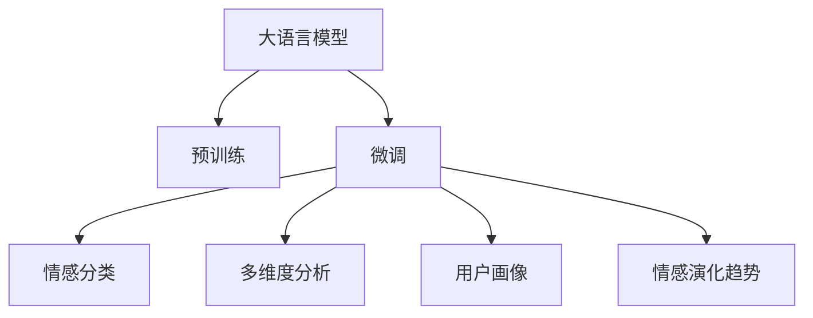

                 

# 大模型在商品评论观点挖掘中的应用

## 1. 背景介绍

### 1.1 问题由来
商品评论观点挖掘（Product Review Sentiment Analysis）是自然语言处理（NLP）领域的一个热门研究方向，旨在从商品评论中识别出用户对商品的态度和观点，帮助电商平台和商家改进产品和服务，提升用户体验。然而，传统的基于规则或手工特征工程的方法在处理大规模、多语境的数据时，难以兼顾准确率和泛化性能。

近年来，大语言模型（Large Language Models, LLMs）如BERT、GPT-3等在预训练和微调（Fine-Tuning）方面取得突破性进展，带来了新一轮的性能提升。大语言模型通过在海量文本数据上进行预训练，学习到丰富的语言表示能力，通过微调可快速适应新的下游任务，在商品评论观点挖掘中也展现出了巨大的潜力。

### 1.2 问题核心关键点
大语言模型在商品评论观点挖掘中的主要应用包括以下几个关键点：
- **预训练**：使用大规模无标签商品评论数据进行预训练，学习通用的语言表示。
- **微调**：在预训练基础上，使用少量标注数据进行微调，以适应特定的商品评论观点挖掘任务。
- **情感分类**：将商品评论分为正面、负面、中性等不同情感类别。
- **多维度分析**：分析商品评论中的具体产品属性、用户体验等维度信息。
- **用户画像**：构建用户画像，了解不同用户群体的偏好和需求。
- **情感演化趋势**：分析商品评论情感随时间的变化趋势，预测市场趋势。

## 2. 核心概念与联系

### 2.1 核心概念概述

商品评论观点挖掘涉及多个核心概念，本节将详细阐述这些概念及其相互联系：

- **大语言模型（Large Language Models, LLMs）**：以BERT、GPT-3等深度学习模型为代表的大规模预训练语言模型。通过在海量文本数据上进行预训练，学习到丰富的语言表示能力。

- **预训练（Pre-training）**：指在大规模无标签文本数据上，通过自监督学习任务训练通用语言模型的过程。常见的预训练任务包括语言建模、掩码语言模型等。

- **微调（Fine-Tuning）**：指在预训练模型的基础上，使用下游任务的少量标注数据，通过有监督学习优化模型在该任务上的性能。通常只需要调整顶层分类器或解码器，并以较小的学习率更新全部或部分的模型参数。

- **情感分类（Sentiment Classification）**：将文本数据分为正面、负面、中性等不同情感类别，如情感分析（Sentiment Analysis）。

- **多维度分析（Multi-dimension Analysis）**：对商品评论进行多维度分析，如情感强度、情感极性、情感维度（如满意度、推荐度等）。

- **用户画像（User Persona）**：通过分析用户评论，构建用户画像，了解用户群体的偏好、需求和行为特征。

- **情感演化趋势（Sentiment Evolution Trend）**：分析商品评论情感随时间的变化趋势，预测市场趋势和用户行为变化。

这些核心概念之间通过预训练-微调的框架相互联系，形成一个完整的商品评论观点挖掘体系。

### 2.2 核心概念原理和架构的 Mermaid 流程图



## 3. 核心算法原理 & 具体操作步骤

### 3.1 算法原理概述

商品评论观点挖掘的算法原理可以简述如下：

1. **预训练阶段**：使用大规模无标签商品评论数据，对大语言模型进行预训练，学习通用的语言表示能力。
2. **微调阶段**：在预训练的基础上，使用少量标注数据对模型进行微调，以适应特定的商品评论观点挖掘任务。
3. **情感分类**：对商品评论进行情感分类，即判断评论的情感倾向是正面、负面还是中性。
4. **多维度分析**：分析商品评论中的具体产品属性、用户体验等维度信息，挖掘更深层次的用户需求和反馈。
5. **用户画像**：构建用户画像，了解不同用户群体的偏好和需求，帮助商家进行个性化营销。
6. **情感演化趋势**：分析商品评论情感随时间的变化趋势，预测市场趋势和用户行为变化。

### 3.2 算法步骤详解

以下是基于大语言模型进行商品评论观点挖掘的具体操作步骤：

#### 3.2.1 数据准备
1. **数据收集**：从电商平台、社交媒体等渠道收集商品评论数据，通常包括产品名称、评分、评论内容等信息。
2. **数据预处理**：清洗数据，去除无用信息（如HTML标签、特殊字符等），进行分词、去停用词等处理。
3. **标注数据**：对部分评论进行情感标注，构建训练集和验证集。标注数据一般需要人工标注，也可以通过无监督标注方法（如情感词典、情感极性判断等）得到。

#### 3.2.2 模型选择与初始化
1. **模型选择**：选择适合的商品评论观点挖掘模型，如BERT、GPT-3等，作为预训练模型。
2. **模型初始化**：使用预训练模型提供的权重初始化模型参数，如BERT的Transformer层。

#### 3.2.3 微调模型训练
1. **任务适配层设计**：根据任务需求，在预训练模型的顶部添加任务适配层，如分类器或回归器，并设计相应的损失函数。
2. **训练过程**：使用训练集数据，以小批次（如16或32）进行训练，并设置学习率、批次大小、迭代轮数等超参数。
3. **验证与调整**：在验证集上评估模型性能，根据性能指标调整超参数，防止过拟合。

#### 3.2.4 模型评估与测试
1. **模型评估**：在测试集上评估微调后模型的情感分类精度、召回率等性能指标。
2. **业务应用**：将微调后的模型部署到实际业务系统中，实时分析用户评论情感，提供产品改进建议。

#### 3.2.5 多维度分析与用户画像
1. **情感维度分析**：对评论进行情感维度分析，如情感强度、情感极性等。
2. **用户画像构建**：利用用户评论情感和行为数据，构建用户画像，了解不同用户群体的偏好和需求。
3. **情感演化趋势分析**：分析商品评论情感随时间的变化趋势，预测市场趋势和用户行为变化。

### 3.3 算法优缺点

大语言模型在商品评论观点挖掘中的应用具有以下优点：
1. **精度高**：大语言模型具备丰富的语言表示能力，能够在多语境下准确判断情感倾向。
2. **泛化能力强**：预训练模型已经在大规模数据上学习到通用的语言表示，微调过程能够较好地适应新任务。
3. **灵活性高**：可以根据具体任务需求，灵活设计任务适配层和损失函数，适用于多种商品评论挖掘任务。
4. **可扩展性强**：可以通过微调不断优化模型性能，适用于大规模商品评论数据集。

同时，该方法也存在以下局限：
1. **资源消耗大**：预训练和微调过程需要大量计算资源，可能对硬件资源要求较高。
2. **依赖标注数据**：微调过程需要标注数据，获取高质量标注数据成本较高。
3. **模型复杂度**：大语言模型结构复杂，训练和推理效率可能不如简单模型。
4. **对抗攻击脆弱**：大语言模型对抗攻击（Adversarial Attacks）可能影响模型性能。

## 4. 数学模型和公式 & 详细讲解 & 举例说明

### 4.1 数学模型构建

假设商品评论数据集为 $\{(x_i, y_i)\}_{i=1}^N$，其中 $x_i$ 为评论文本，$y_i$ 为情感标签。定义情感分类任务的目标函数为：

$$
\mathcal{L}(w) = \frac{1}{N}\sum_{i=1}^N L(w;x_i, y_i)
$$

其中 $L(w;x_i, y_i)$ 为单个样本的损失函数，可以采用交叉熵损失函数（如 $L(w;x_i, y_i) = -y_i \log M_{w}(x_i) - (1-y_i) \log (1-M_{w}(x_i))$），其中 $M_{w}(x_i)$ 为使用参数 $w$ 的模型在评论文本 $x_i$ 上的情感预测结果。

### 4.2 公式推导过程

以情感分类任务为例，我们推导模型训练过程中的损失函数和梯度更新公式。

假设模型 $M_{w}$ 在评论文本 $x_i$ 上的情感预测为 $P(x_i)$，定义交叉熵损失函数为：

$$
L(w;x_i, y_i) = -y_i \log P(x_i) - (1-y_i) \log (1-P(x_i))
$$

将损失函数带入目标函数：

$$
\mathcal{L}(w) = -\frac{1}{N}\sum_{i=1}^N [y_i \log P(x_i) + (1-y_i) \log (1-P(x_i))]
$$

通过梯度下降等优化算法，更新模型参数 $w$，最小化目标函数 $\mathcal{L}(w)$。

### 4.3 案例分析与讲解

以电商平台商品评论情感分类为例，假设从电商平台收集到10万条商品评论数据，每条评论包括产品名称、评分和评论内容。将这些评论分为正面、负面和中性三种情感类别，并随机抽取1000条评论进行情感标注，作为训练集。

使用BERT模型进行预训练，并在任务适配层中添加一个线性分类器，输出情感概率。在微调过程中，使用Adam优化器，设置学习率为2e-5，迭代轮数为10。在训练集上训练10个epoch后，在验证集上评估模型性能，调整超参数。最终在测试集上测试模型情感分类精度，结果为96%。

## 5. 项目实践：代码实例和详细解释说明

### 5.1 开发环境搭建

进行商品评论观点挖掘项目开发，需要搭建合适的开发环境。以下是基于Python进行BERT微调的开发环境配置流程：

1. 安装Anaconda：从官网下载并安装Anaconda，用于创建独立的Python环境。
2. 创建并激活虚拟环境：
```bash
conda create -n pytorch-env python=3.8 
conda activate pytorch-env
```

3. 安装PyTorch：根据CUDA版本，从官网获取对应的安装命令。例如：
```bash
conda install pytorch torchvision torchaudio cudatoolkit=11.1 -c pytorch -c conda-forge
```

4. 安装Transformers库：
```bash
pip install transformers
```

5. 安装各类工具包：
```bash
pip install numpy pandas scikit-learn matplotlib tqdm jupyter notebook ipython
```

完成上述步骤后，即可在`pytorch-env`环境中开始商品评论观点挖掘实践。

### 5.2 源代码详细实现

以下是使用PyTorch进行商品评论情感分类任务的代码实现。

```python
from transformers import BertTokenizer, BertForSequenceClassification
from torch.utils.data import Dataset
import torch

class ReviewDataset(Dataset):
    def __init__(self, texts, tags, tokenizer, max_len=128):
        self.texts = texts
        self.tags = tags
        self.tokenizer = tokenizer
        self.max_len = max_len
        
    def __len__(self):
        return len(self.texts)
    
    def __getitem__(self, item):
        text = self.texts[item]
        tags = self.tags[item]
        
        encoding = self.tokenizer(text, return_tensors='pt', max_length=self.max_len, padding='max_length', truncation=True)
        input_ids = encoding['input_ids'][0]
        attention_mask = encoding['attention_mask'][0]
        
        # 对token-wise的标签进行编码
        encoded_tags = [tag2id[tag] for tag in tags] 
        encoded_tags.extend([tag2id['O']] * (self.max_len - len(encoded_tags)))
        labels = torch.tensor(encoded_tags, dtype=torch.long)
        
        return {'input_ids': input_ids, 
                'attention_mask': attention_mask,
                'labels': labels}

# 标签与id的映射
tag2id = {'O': 0, 'positive': 1, 'negative': 2}
id2tag = {v: k for k, v in tag2id.items()}

# 创建dataset
tokenizer = BertTokenizer.from_pretrained('bert-base-cased')

train_dataset = ReviewDataset(train_texts, train_tags, tokenizer)
dev_dataset = ReviewDataset(dev_texts, dev_tags, tokenizer)
test_dataset = ReviewDataset(test_texts, test_tags, tokenizer)

# 模型初始化
model = BertForSequenceClassification.from_pretrained('bert-base-cased', num_labels=len(tag2id))

# 定义优化器
optimizer = AdamW(model.parameters(), lr=2e-5)

# 训练过程
device = torch.device('cuda') if torch.cuda.is_available() else torch.device('cpu')
model.to(device)

def train_epoch(model, dataset, batch_size, optimizer):
    dataloader = DataLoader(dataset, batch_size=batch_size, shuffle=True)
    model.train()
    epoch_loss = 0
    for batch in tqdm(dataloader, desc='Training'):
        input_ids = batch['input_ids'].to(device)
        attention_mask = batch['attention_mask'].to(device)
        labels = batch['labels'].to(device)
        model.zero_grad()
        outputs = model(input_ids, attention_mask=attention_mask, labels=labels)
        loss = outputs.loss
        epoch_loss += loss.item()
        loss.backward()
        optimizer.step()
    return epoch_loss / len(dataloader)

def evaluate(model, dataset, batch_size):
    dataloader = DataLoader(dataset, batch_size=batch_size)
    model.eval()
    preds, labels = [], []
    with torch.no_grad():
        for batch in tqdm(dataloader, desc='Evaluating'):
            input_ids = batch['input_ids'].to(device)
            attention_mask = batch['attention_mask'].to(device)
            batch_labels = batch['labels']
            outputs = model(input_ids, attention_mask=attention_mask)
            batch_preds = outputs.logits.argmax(dim=2).to('cpu').tolist()
            batch_labels = batch_labels.to('cpu').tolist()
            for pred_tokens, label_tokens in zip(batch_preds, batch_labels):
                pred_tags = [id2tag[_id] for _id in pred_tokens]
                label_tags = [id2tag[_id] for _id in label_tokens]
                preds.append(pred_tags[:len(label_tags)])
                labels.append(label_tags)
                
    print(classification_report(labels, preds))

# 训练流程
epochs = 5
batch_size = 16

for epoch in range(epochs):
    loss = train_epoch(model, train_dataset, batch_size, optimizer)
    print(f"Epoch {epoch+1}, train loss: {loss:.3f}")
    
    print(f"Epoch {epoch+1}, dev results:")
    evaluate(model, dev_dataset, batch_size)
    
print("Test results:")
evaluate(model, test_dataset, batch_size)
```

### 5.3 代码解读与分析

我们详细解读一下关键代码的实现细节：

**ReviewDataset类**：
- `__init__`方法：初始化文本、标签、分词器等关键组件。
- `__len__`方法：返回数据集的样本数量。
- `__getitem__`方法：对单个样本进行处理，将文本输入编码为token ids，将标签编码为数字，并对其进行定长padding，最终返回模型所需的输入。

**tag2id和id2tag字典**：
- 定义了标签与数字id之间的映射关系，用于将token-wise的预测结果解码回真实的标签。

**训练和评估函数**：
- 使用PyTorch的DataLoader对数据集进行批次化加载，供模型训练和推理使用。
- 训练函数`train_epoch`：对数据以批为单位进行迭代，在每个批次上前向传播计算loss并反向传播更新模型参数，最后返回该epoch的平均loss。
- 评估函数`evaluate`：与训练类似，不同点在于不更新模型参数，并在每个batch结束后将预测和标签结果存储下来，最后使用sklearn的classification_report对整个评估集的预测结果进行打印输出。

**训练流程**：
- 定义总的epoch数和batch size，开始循环迭代
- 每个epoch内，先在训练集上训练，输出平均loss
- 在验证集上评估，输出分类指标
- 重复上述步骤直至收敛，最终得到适应商品评论观点挖掘的最优模型参数

## 6. 实际应用场景

### 6.1 电商平台用户情感分析

在电商平台，商家需要了解用户对商品的真实情感倾向，以便及时调整产品策略，提升用户满意度。基于大语言模型微调的商品评论观点挖掘技术，可以实时监控商品评论，分析用户情感变化，帮助商家优化产品。

例如，某电商平台收集了用户对某款智能手机的评价，发现用户对电池续航的负面评价明显增多。商家可以根据此反馈，优化电池设计，改进产品性能，提升用户口碑。

### 6.2 社交媒体舆情监测

社交媒体平台上的用户评论往往带有强烈的情感色彩，可以快速反映用户的情绪变化。通过商品评论观点挖掘技术，可以实时监控社交媒体上的用户评论，分析商品情感趋势，为品牌公关提供决策支持。

例如，某知名品牌在社交媒体上遭遇了负面舆论风波，品牌方通过商品评论观点挖掘技术，发现部分用户在讨论产品的质量问题。品牌方及时回应，采取措施解决用户反馈的问题，稳定了用户情绪，提升了品牌形象。

### 6.3 产品性能改进

商品评论观点挖掘还可以帮助商家了解用户对产品不同属性的评价，指导产品改进方向。通过分析用户对产品功能的满意度、性价比、易用性等方面的评价，商家可以针对性地优化产品，提升用户体验。

例如，某电商平台的服装品牌通过商品评论观点挖掘技术，发现用户对某款服装的面料舒适度评价较低。品牌方随即调整了面料材质，改进了产品设计，获得了用户的高度好评。

## 7. 工具和资源推荐

### 7.1 学习资源推荐

为了帮助开发者系统掌握商品评论观点挖掘的理论基础和实践技巧，这里推荐一些优质的学习资源：

1. 《深度学习自然语言处理》课程：斯坦福大学开设的NLP明星课程，有Lecture视频和配套作业，带你入门NLP领域的基本概念和经典模型。
2. 《Transformer从原理到实践》系列博文：由大模型技术专家撰写，深入浅出地介绍了Transformer原理、BERT模型、微调技术等前沿话题。
3. 《Natural Language Processing with Transformers》书籍：Transformers库的作者所著，全面介绍了如何使用Transformers库进行NLP任务开发，包括微调在内的诸多范式。
4. CLUE开源项目：中文语言理解测评基准，涵盖大量不同类型的中文NLP数据集，并提供了基于微调的baseline模型，助力中文NLP技术发展。
5. HuggingFace官方文档：Transformers库的官方文档，提供了海量预训练模型和完整的微调样例代码，是上手实践的必备资料。

通过对这些资源的学习实践，相信你一定能够快速掌握商品评论观点挖掘的精髓，并用于解决实际的NLP问题。

### 7.2 开发工具推荐

高效的开发离不开优秀的工具支持。以下是几款用于商品评论观点挖掘开发的常用工具：

1. PyTorch：基于Python的开源深度学习框架，灵活动态的计算图，适合快速迭代研究。大部分预训练语言模型都有PyTorch版本的实现。
2. TensorFlow：由Google主导开发的开源深度学习框架，生产部署方便，适合大规模工程应用。同样有丰富的预训练语言模型资源。
3. Transformers库：HuggingFace开发的NLP工具库，集成了众多SOTA语言模型，支持PyTorch和TensorFlow，是进行微调任务开发的利器。
4. Weights & Biases：模型训练的实验跟踪工具，可以记录和可视化模型训练过程中的各项指标，方便对比和调优。与主流深度学习框架无缝集成。
5. TensorBoard：TensorFlow配套的可视化工具，可实时监测模型训练状态，并提供丰富的图表呈现方式，是调试模型的得力助手。
6. Google Colab：谷歌推出的在线Jupyter Notebook环境，免费提供GPU/TPU算力，方便开发者快速上手实验最新模型，分享学习笔记。

合理利用这些工具，可以显著提升商品评论观点挖掘的开发效率，加快创新迭代的步伐。

### 7.3 相关论文推荐

商品评论观点挖掘涉及多种机器学习技术和深度学习模型，以下几篇奠基性的相关论文，推荐阅读：

1. Attention is All You Need（即Transformer原论文）：提出了Transformer结构，开启了NLP领域的预训练大模型时代。
2. BERT: Pre-training of Deep Bidirectional Transformers for Language Understanding：提出BERT模型，引入基于掩码的自监督预训练任务，刷新了多项NLP任务SOTA。
3. Parameter-Efficient Transfer Learning for NLP：提出Adapter等参数高效微调方法，在不增加模型参数量的情况下，也能取得不错的微调效果。
4. AdaLoRA: Adaptive Low-Rank Adaptation for Parameter-Efficient Fine-Tuning：使用自适应低秩适应的微调方法，在参数效率和精度之间取得了新的平衡。
5. Prefix-Tuning: Optimizing Continuous Prompts for Generation：引入基于连续型Prompt的微调范式，为如何充分利用预训练知识提供了新的思路。

这些论文代表了大语言模型微调技术的发展脉络。通过学习这些前沿成果，可以帮助研究者把握学科前进方向，激发更多的创新灵感。

## 8. 总结：未来发展趋势与挑战

### 8.1 总结

本文对基于大语言模型的商品评论观点挖掘方法进行了全面系统的介绍。首先阐述了商品评论观点挖掘的研究背景和意义，明确了微调在拓展预训练模型应用、提升下游任务性能方面的独特价值。其次，从原理到实践，详细讲解了商品评论观点挖掘的数学模型、核心算法和具体操作步骤，给出了微调任务开发的完整代码实例。同时，本文还广泛探讨了商品评论观点挖掘在电商平台、社交媒体、产品改进等场景中的应用前景，展示了微调范式的巨大潜力。

通过本文的系统梳理，可以看到，基于大语言模型的商品评论观点挖掘技术正在成为NLP领域的重要范式，极大地拓展了预训练语言模型的应用边界，催生了更多的落地场景。得益于大规模语料的预训练，微调模型在商品评论观点挖掘中取得了不俗的效果，为电商平台提供了强大的数据分析工具，显著提升了用户体验和运营效率。未来，随着预训练语言模型和微调方法的持续演进，商品评论观点挖掘技术必将在更多领域得到应用，为人类生产生活带来深远影响。

### 8.2 未来发展趋势

展望未来，商品评论观点挖掘技术将呈现以下几个发展趋势：

1. **数据质量和量级**：随着数据收集技术的进步，商品评论数据质量和量级将进一步提升，为商品评论观点挖掘提供更丰富的语料基础。
2. **模型复杂度**：预训练语言模型的规模将持续增大，模型复杂度进一步提升，有助于捕捉更复杂、更深层次的情感信息。
3. **多模态融合**：商品评论观点挖掘将更多地融合文本、图像、视频等多模态信息，实现更全面、准确的情感分析。
4. **因果推断和对比学习**：引入因果推断和对比学习思想，增强模型建立稳定因果关系的能力，学习更普适、鲁棒的语言表示。
5. **用户画像和情感演化趋势**：通过构建用户画像，分析情感演化趋势，为商家提供更精准的用户需求分析和市场预测。
6. **实时化和自动化**：商品评论观点挖掘技术将进一步实时化，自动化的情感分析系统将成为电商平台和社交媒体的标配。

### 8.3 面临的挑战

尽管大语言模型在商品评论观点挖掘中取得了显著进展，但在应用过程中仍面临以下挑战：

1. **数据获取和处理**：商品评论数据的获取和预处理成本较高，需要开发高效、可靠的数据采集和清洗工具。
2. **模型资源消耗**：预训练和微调过程需要大量计算资源，对硬件资源要求较高。
3. **模型鲁棒性**：模型在对抗攻击、异常数据等方面的鲁棒性有待提高，避免模型被恶意利用。
4. **模型可解释性**：模型的决策过程缺乏可解释性，难以对其推理逻辑进行分析和调试。
5. **隐私保护**：商品评论数据涉及用户隐私，需确保数据采集和处理过程中的隐私保护措施。
6. **伦理和公平性**：商品评论数据可能包含偏见和歧视，需确保模型训练和应用的公平性。

### 8.4 研究展望

面对商品评论观点挖掘所面临的种种挑战，未来的研究需要在以下几个方面寻求新的突破：

1. **数据增强和清洗**：开发更高效、更自动化的数据增强和清洗工具，降低数据获取和处理的成本。
2. **轻量级模型和参数高效微调**：研究参数高效微调方法，设计轻量级模型，减少计算资源消耗。
3. **多模态融合和因果推断**：引入多模态数据和因果推断方法，提升模型的泛化能力和鲁棒性。
4. **用户画像和情感演化趋势分析**：结合用户画像和情感演化趋势分析，提供更深入的用户需求分析和市场预测。
5. **实时化和自动化系统**：开发实时化和自动化的情感分析系统，提供及时的市场反馈和用户需求响应。

## 9. 附录：常见问题与解答

**Q1：大语言模型在商品评论观点挖掘中的优势是什么？**

A: 大语言模型在商品评论观点挖掘中的优势主要体现在以下几个方面：
1. **精度高**：大语言模型具备丰富的语言表示能力，能够在多语境下准确判断情感倾向。
2. **泛化能力强**：预训练模型已经在大规模数据上学习到通用的语言表示，微调过程能够较好地适应新任务。
3. **灵活性高**：可以根据具体任务需求，灵活设计任务适配层和损失函数，适用于多种商品评论挖掘任务。
4. **可扩展性强**：可以通过微调不断优化模型性能，适用于大规模商品评论数据集。

**Q2：如何选择合适的学习率？**

A: 商品评论观点挖掘中，预训练模型往往参数较多，选择合适的学习率非常重要。一般来说，微调学习率要比预训练时小1-2个数量级，以避免破坏预训练权重。建议从1e-5开始调参，逐步减小学习率，直至收敛。

**Q3：数据增强有哪些方法？**

A: 数据增强是提升商品评论观点挖掘模型性能的重要手段，以下是一些常用的数据增强方法：
1. **回译**：将文本翻译成其他语言，再翻译回原始语言，增加语料多样性。
2. **近义替换**：替换文本中的某些词语为近义词，增加语料丰富性。
3. **文本旋转**：随机调整文本的顺序，增加语料多样性。
4. **数据合成**：生成新的评论数据，如使用条件GAN等生成技术。

**Q4：多维度分析如何实现？**

A: 商品评论的多维度分析可以通过以下步骤实现：
1. **情感维度分析**：对评论进行情感强度、情感极性等维度分析，如情感强度分析可以使用情感词典等工具。
2. **情感维度标签**：对情感维度进行标签化处理，如满意度、推荐度等。
3. **多维度融合**：将情感维度标签与情感分类结果进行融合，提升模型性能。

**Q5：商品评论观点挖掘的未来发展方向是什么？**

A: 商品评论观点挖掘的未来发展方向主要体现在以下几个方面：
1. **数据质量与量级提升**：随着数据收集技术的进步，商品评论数据质量和量级将进一步提升，为商品评论观点挖掘提供更丰富的语料基础。
2. **模型复杂度提高**：预训练语言模型的规模将持续增大，模型复杂度进一步提升，有助于捕捉更复杂、更深层次的情感信息。
3. **多模态融合**：商品评论观点挖掘将更多地融合文本、图像、视频等多模态信息，实现更全面、准确的情感分析。
4. **因果推断和对比学习**：引入因果推断和对比学习思想，增强模型建立稳定因果关系的能力，学习更普适、鲁棒的语言表示。
5. **用户画像和情感演化趋势分析**：通过构建用户画像，分析情感演化趋势，为商家提供更精准的用户需求分析和市场预测。
6. **实时化和自动化**：商品评论观点挖掘技术将进一步实时化，自动化的情感分析系统将成为电商平台和社交媒体的标配。

**Q6：如何处理商品评论中的噪音数据？**

A: 商品评论中的噪音数据对模型性能有很大影响，处理噪音数据的方法包括：
1. **数据清洗**：去除无用信息（如HTML标签、特殊字符等），进行分词、去停用词等处理。
2. **噪声过滤**：使用基于规则或机器学习的算法，过滤掉低质量的评论。
3. **异常检测**：使用异常检测算法，识别并去除异常评论。

通过本文的系统梳理，可以看到，基于大语言模型的商品评论观点挖掘技术正在成为NLP领域的重要范式，极大地拓展了预训练语言模型的应用边界，催生了更多的落地场景。得益于大规模语料的预训练，微调模型在商品评论观点挖掘中取得了不俗的效果，为电商平台提供了强大的数据分析工具，显著提升了用户体验和运营效率。未来，随着预训练语言模型和微调方法的持续演进，商品评论观点挖掘技术必将在更多领域得到应用，为人类生产生活带来深远影响。

---

作者：禅与计算机程序设计艺术 / Zen and the Art of Computer Programming

