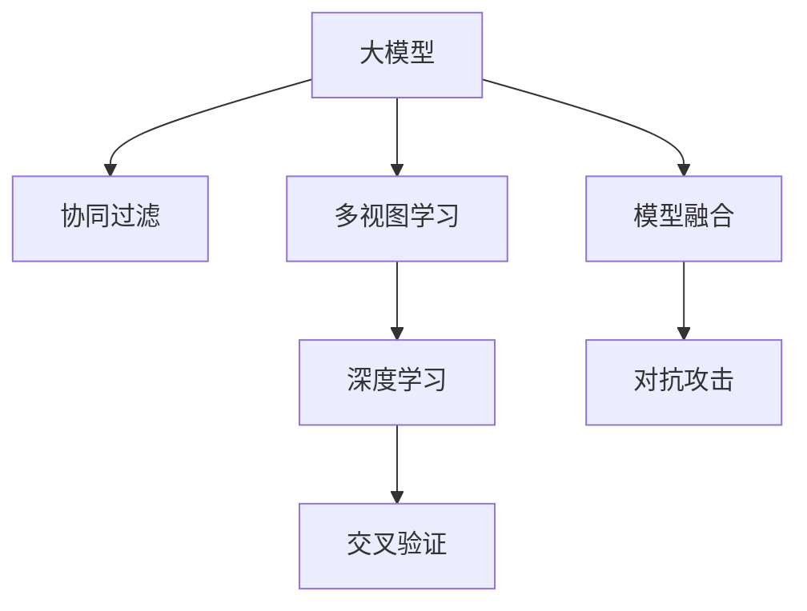

                 

# 大模型在推荐系统中的多视图学习应用

> 关键词：大模型，多视图学习，推荐系统，协同过滤，深度学习，交叉验证，模型融合，对抗攻击

## 1. 背景介绍

推荐系统是现代互联网应用的重要组成部分，通过深度学习和多视图学习等先进技术，能够为用户提供个性化的信息和服务，极大地提升用户体验。其中，大模型在推荐系统中的应用，以数据多样性和模型复杂性为基础，通过协同过滤和深度学习等手段，极大地提升了推荐的准确度和用户体验。然而，随着用户需求和数据规模的不断扩展，推荐系统面临越来越多的挑战。本文将对大模型在推荐系统中的应用进行系统性的探讨，重点介绍多视图学习、协同过滤和模型融合等核心算法原理与具体操作，以及未来发展趋势和挑战。

## 2. 核心概念与联系

### 2.1 核心概念概述

为更好地理解大模型在推荐系统中的应用，本节将介绍几个密切相关的核心概念：

- **大模型**：指具有数亿甚至数十亿参数的深度神经网络模型，如BERT、GPT-3等。这些模型通过大规模数据预训练，具备强大的特征表示能力和泛化能力，能够在推荐系统中提供丰富的用户和商品信息。

- **多视图学习**：指通过综合利用多个数据源和模型，获取更加全面、准确的推荐结果。常用的数据源包括用户历史行为数据、商品属性数据、社交网络数据等。

- **协同过滤**：指通过分析用户间的协同行为，为用户推荐与其相似用户喜欢的商品。协同过滤分为基于用户的协同过滤和基于物品的协同过滤两种。

- **深度学习**：指使用多层神经网络模型对数据进行特征提取和模式识别。深度学习模型在推荐系统中的应用包括序列建模、基于内容的推荐等。

- **交叉验证**：指将数据集划分为训练集、验证集和测试集，通过多次验证模型在不同集上的表现，评估模型的泛化能力。

- **模型融合**：指将多个模型的预测结果进行加权组合，形成最终的推荐结果。常见的模型融合方法包括均值融合、加权融合、堆叠融合等。

- **对抗攻击**：指攻击者对模型输入进行扰动，以干扰模型输出，从而欺骗推荐系统。对抗攻击包括白盒攻击和黑盒攻击两种。

这些核心概念之间的逻辑关系可以通过以下Mermaid流程图来展示：



这个流程图展示了大模型在推荐系统中的应用流程：

1. 大模型通过协同过滤、多视图学习和深度学习等手段，综合利用用户和商品的多维度信息，生成推荐结果。
2. 通过交叉验证评估模型性能，确保推荐结果的泛化能力。
3. 使用模型融合技术提升推荐的准确性和鲁棒性。
4. 对抗攻击检测和防御，确保推荐系统的安全性和可信度。

## 3. 核心算法原理 & 具体操作步骤
### 3.1 算法原理概述

基于大模型的推荐系统，通常包含以下几个步骤：

- **数据预处理**：将用户历史行为数据、商品属性数据等多维数据进行清洗、归一化和特征工程，转换为模型能够处理的格式。
- **协同过滤**：利用用户和商品之间的协同行为，生成用户对商品的兴趣向量，或者商品对用户的兴趣向量。
- **深度学习模型训练**：基于大模型进行推荐模型训练，生成用户对商品的综合评分。
- **模型融合**：将多个推荐模型进行融合，得到更加准确和鲁棒的推荐结果。
- **对抗攻击检测和防御**：检测和防御对抗攻击，确保推荐系统的安全性和可信度。

### 3.2 算法步骤详解

**Step 1: 数据预处理**

数据预处理是推荐系统的重要环节，主要包括以下步骤：

- **数据清洗**：去除缺失值和异常值，处理重复数据，确保数据质量。
- **特征工程**：将原始数据转换为模型能够处理的特征向量，如使用one-hot编码、多项式特征等。
- **归一化**：对特征值进行归一化处理，防止不同特征值对模型的影响过大。

**Step 2: 协同过滤**

协同过滤是通过分析用户间的协同行为，为用户推荐与其相似用户喜欢的商品。常用的协同过滤方法包括：

- **基于用户的协同过滤**：根据用户历史行为数据，生成用户对商品的评分，推荐与目标用户兴趣相似的其他用户喜欢的商品。
- **基于物品的协同过滤**：根据商品间的协同关系，生成商品对用户的评分，推荐与目标用户喜欢的商品相似的其余商品。

**Step 3: 深度学习模型训练**

深度学习模型通过多维数据进行训练，生成用户对商品的综合评分。常用的深度学习模型包括：

- **序列建模**：使用RNN、LSTM等模型，根据用户历史行为数据生成用户兴趣向量。
- **基于内容的推荐**：利用商品属性、标签等数据，生成商品对用户的评分。

**Step 4: 模型融合**

模型融合是将多个推荐模型的预测结果进行加权组合，得到更加准确和鲁棒的推荐结果。常用的模型融合方法包括：

- **均值融合**：将多个模型的预测结果取平均，形成最终的推荐结果。
- **加权融合**：根据模型的预测准确度，给不同的模型分配不同的权重。
- **堆叠融合**：将多个模型串联起来，先使用其中一个模型进行初步预测，再使用其余模型对结果进行修正。

**Step 5: 对抗攻击检测和防御**

对抗攻击检测和防御是通过检测和防御对抗攻击，确保推荐系统的安全性和可信度。常用的对抗攻击检测方法包括：

- **白盒攻击检测**：通过分析模型内部的参数和结构，检测是否存在对抗样本。
- **黑盒攻击检测**：通过测试模型在不同输入下的输出，检测是否存在异常。

对抗攻击防御方法包括：

- **对抗训练**：在训练过程中加入对抗样本，提高模型的鲁棒性。
- **梯度掩蔽**：在模型前向传播时，随机掩蔽输入数据的部分梯度信息，增加对抗攻击的难度。

### 3.3 算法优缺点

基于大模型的推荐系统具有以下优点：

- **丰富特征表示**：大模型能够学习到丰富的用户和商品特征，提升推荐结果的准确度。
- **泛化能力强大**：大模型通过大规模数据预训练，具备较强的泛化能力，能够适应不同用户和商品的复杂需求。
- **多视图融合**：通过多视图学习，综合利用用户行为、商品属性、社交网络等多维度数据，提升推荐结果的全面性和准确性。
- **鲁棒性强**：通过模型融合和对抗训练，提升推荐系统的鲁棒性和安全性。

然而，基于大模型的推荐系统也存在一定的局限性：

- **计算资源消耗大**：大模型需要占用大量的计算资源进行训练和推理，成本较高。
- **模型复杂度高**：大模型的复杂度较高，需要长时间训练才能收敛。
- **对抗攻击脆弱**：对抗攻击检测和防御较为困难，容易受到攻击。

尽管存在这些局限性，但就目前而言，基于大模型的推荐系统仍然是推荐领域的主流范式。未来相关研究的重点在于如何进一步降低计算资源消耗，提高模型的效率和鲁棒性，同时兼顾可解释性和伦理安全性等因素。

### 3.4 算法应用领域

基于大模型的推荐系统已经在电商、新闻、视频、音乐等多个领域得到广泛应用，并取得了显著的效果。例如：

- **电商推荐**：通过分析用户浏览、点击、购买等行为数据，推荐符合用户兴趣的商品。
- **新闻推荐**：根据用户的阅读历史，推荐相关的新闻文章和话题。
- **视频推荐**：根据用户的观看历史，推荐用户喜欢的视频内容。
- **音乐推荐**：根据用户的听歌历史，推荐符合用户口味的歌曲和歌单。

除了上述这些经典应用外，大模型在推荐系统中的应用还在不断扩展，如个性化推荐、社交推荐等，为推荐技术带来了新的突破。随着大模型和推荐方法的不断进步，相信推荐系统将在更多领域得到应用，为用户的个性化需求提供更好的解决方案。

## 4. 数学模型和公式 & 详细讲解 & 举例说明

### 4.1 数学模型构建

本节将使用数学语言对基于大模型的推荐系统进行更加严格的刻画。

记用户集合为 $U$，商品集合为 $I$，用户对商品的评分矩阵为 $\mathbf{R} \in \mathbb{R}^{N \times M}$，其中 $N$ 为用户的数量，$M$ 为商品的种类。模型的输入为 $\mathbf{X} \in \mathbb{R}^{N \times D}$，其中 $\mathbf{X}$ 为用户的特征矩阵，$D$ 为特征的维度。

定义协同过滤模型为 $f(\mathbf{X}, \mathbf{R})$，其输出为用户对商品的评分矩阵。定义深度学习模型为 $g(\mathbf{X}, \mathbf{R})$，其输出为用户对商品的综合评分矩阵。

模型的总输出为 $h(\mathbf{X}, \mathbf{R}, f(\mathbf{X}, \mathbf{R}), g(\mathbf{X}, \mathbf{R}))$，其中 $h$ 为模型融合函数。

### 4.2 公式推导过程

以下我们以协同过滤和深度学习模型训练为例，推导推荐系统的数学模型。

**协同过滤模型**：

假设用户对商品的评分服从正态分布，即 $p(r_{ui} | \theta) = \mathcal{N}(r_{ui} | \mu_{ui}, \sigma^2_{ui})$，其中 $\theta = \{\mu_{ui}, \sigma^2_{ui}\}_{ui=1}^{NM}$ 为模型的参数。根据最大似然估计，得到协同过滤模型的目标函数：

$$
\mathcal{L}(\theta) = -\frac{1}{NM} \sum_{ui=1}^{NM} \log p(r_{ui} | \theta) = -\frac{1}{NM} \sum_{ui=1}^{NM} \left[\frac{1}{2}\left(\frac{(r_{ui} - \mu_{ui})^2}{\sigma^2_{ui}} + \log \sigma^2_{ui}\right)\right]
$$

使用随机梯度下降等优化算法，最小化上述目标函数，得到协同过滤模型的预测结果。

**深度学习模型训练**：

假设深度学习模型为 $g(\mathbf{X}, \mathbf{R})$，其输出为 $\mathbf{Y} \in \mathbb{R}^{N \times M}$，表示用户对商品的评分矩阵。模型的目标函数为交叉熵损失函数：

$$
\mathcal{L}(\mathbf{Y}) = -\frac{1}{NM} \sum_{ui=1}^{NM} \sum_{ij=1}^{M} y_{ij} \log \hat{y}_{ij} + (1 - y_{ij}) \log (1 - \hat{y}_{ij})
$$

其中 $\hat{y}_{ij}$ 为模型的预测结果，$y_{ij}$ 为真实评分。使用反向传播算法计算模型参数的梯度，并使用梯度下降等优化算法更新参数。

### 4.3 案例分析与讲解

**案例分析**：假设某电商网站有 $N=10,000$ 个用户和 $M=5,000$ 个商品，用户对商品的评分矩阵为 $\mathbf{R} \in \mathbb{R}^{10,000 \times 5,000}$。用户的特征矩阵为 $\mathbf{X} \in \mathbb{R}^{10,000 \times 100}$，表示用户的年龄、性别、购买历史等信息。

**模型训练**：首先使用协同过滤模型 $f(\mathbf{X}, \mathbf{R})$ 进行初步预测，得到评分矩阵 $\hat{\mathbf{R}}_1 \in \mathbb{R}^{10,000 \times 5,000}$。然后，使用深度学习模型 $g(\mathbf{X}, \mathbf{R})$ 对评分矩阵进行修正，得到修正后的评分矩阵 $\hat{\mathbf{R}}_2 \in \mathbb{R}^{10,000 \times 5,000}$。最终，通过模型融合函数 $h(\mathbf{X}, \mathbf{R}, f(\mathbf{X}, \mathbf{R}), g(\mathbf{X}, \mathbf{R}))$，得到最终的推荐评分矩阵 $\hat{\mathbf{R}} \in \mathbb{R}^{10,000 \times 5,000}$。

## 5. 项目实践：代码实例和详细解释说明
### 5.1 开发环境搭建

在进行推荐系统项目开发前，我们需要准备好开发环境。以下是使用Python进行PyTorch开发的环境配置流程：

1. 安装Anaconda：从官网下载并安装Anaconda，用于创建独立的Python环境。

2. 创建并激活虚拟环境：
```bash
conda create -n recsys-env python=3.8 
conda activate recsys-env
```

3. 安装PyTorch：根据CUDA版本，从官网获取对应的安装命令。例如：
```bash
conda install pytorch torchvision torchaudio cudatoolkit=11.1 -c pytorch -c conda-forge
```

4. 安装TensorFlow：由Google主导开发的开源深度学习框架，生产部署方便，适合大规模工程应用。同样有丰富的预训练语言模型资源。

5. 安装各类工具包：
```bash
pip install numpy pandas scikit-learn matplotlib tqdm jupyter notebook ipython
```

完成上述步骤后，即可在`recsys-env`环境中开始推荐系统开发。

### 5.2 源代码详细实现

这里我们以协同过滤和深度学习模型训练为例，给出使用PyTorch进行电商推荐系统的代码实现。

首先，定义协同过滤模型和深度学习模型的代码：

```python
import torch
from torch import nn
from torch.nn import functional as F
from torch.autograd import Variable

class CollaborativeFiltering(nn.Module):
    def __init__(self, n_users, n_items, embedding_dim):
        super(CollaborativeFiltering, self).__init__()
        self.user_embedding = nn.Embedding(n_users, embedding_dim)
        self.item_embedding = nn.Embedding(n_items, embedding_dim)
        self.bias = nn.Parameter(torch.randn(n_items))
        
    def forward(self, user_ids, item_ids):
        user_embeddings = self.user_embedding(user_ids)
        item_embeddings = self.item_embedding(item_ids)
        predictions = torch.matmul(user_embeddings, item_embeddings.t()) + self.bias
        return predictions

class DeepLearningModel(nn.Module):
    def __init__(self, n_users, n_items, embedding_dim, hidden_dim):
        super(DeepLearningModel, self).__init__()
        self.user_embedding = nn.Embedding(n_users, embedding_dim)
        self.item_embedding = nn.Embedding(n_items, embedding_dim)
        self.fc = nn.Linear(embedding_dim * 2, hidden_dim)
        self.fc_out = nn.Linear(hidden_dim, 1)
        
    def forward(self, user_ids, item_ids):
        user_embeddings = self.user_embedding(user_ids)
        item_embeddings = self.item_embedding(item_ids)
        combined_embeddings = torch.cat([user_embeddings, item_embeddings], dim=1)
        hidden_rep = self.fc(combined_embeddings)
        predictions = torch.sigmoid(self.fc_out(hidden_rep))
        return predictions
```

然后，定义推荐系统的总输出函数：

```python
def recommendation(user_ids, item_ids, model1, model2):
    collaborative_filtering_predictions = model1(user_ids, item_ids)
    deep_learning_predictions = model2(user_ids, item_ids)
    recommendation_scores = collaborative_filtering_predictions + deep_learning_predictions
    return recommendation_scores
```

最后，启动模型训练流程并在测试集上评估：

```python
from torch.utils.data import DataLoader
from sklearn.metrics import mean_squared_error

# 假设已经有训练集和测试集
train_dataset = ...
test_dataset = ...

# 假设模型已经定义好
model1 = ...
model2 = ...
model = recommendation

# 定义优化器和损失函数
optimizer = torch.optim.Adam(model.parameters(), lr=0.001)
criterion = nn.MSELoss()

# 训练模型
for epoch in range(100):
    for user_ids, item_ids, targets in train_dataset:
        targets = Variable(targets)
        optimizer.zero_grad()
        outputs = model(user_ids, item_ids)
        loss = criterion(outputs, targets)
        loss.backward()
        optimizer.step()
    print(f"Epoch {epoch+1}, loss: {loss.item()}")

# 在测试集上评估模型
test_loss = criterion(model(test_dataset[user_ids], test_dataset[item_ids]), test_dataset.targets)
print(f"Test loss: {test_loss.item()}")
```

以上就是使用PyTorch进行协同过滤和深度学习模型训练的完整代码实现。可以看到，通过合理设计模型结构和优化器，可以高效地训练推荐模型，并在测试集上评估性能。

### 5.3 代码解读与分析

让我们再详细解读一下关键代码的实现细节：

**CollaborativeFiltering类**：
- `__init__`方法：初始化协同过滤模型的参数。
- `forward`方法：计算模型对给定用户和商品ID的预测评分。

**DeepLearningModel类**：
- `__init__`方法：初始化深度学习模型的参数。
- `forward`方法：计算模型对给定用户和商品ID的预测评分。

**recommendation函数**：
- 将协同过滤模型和深度学习模型的预测结果进行线性组合，得到最终的推荐评分。

**训练和评估函数**：
- 使用PyTorch的DataLoader对数据集进行批次化加载，供模型训练和推理使用。
- 训练函数`for`循环：对数据以批为单位进行迭代，在每个批次上前向传播计算损失并反向传播更新模型参数，最后输出平均损失。
- 在测试集上评估模型，输出MSE损失。

**训练流程**：
- 定义总的epoch数和batch size，开始循环迭代
- 每个epoch内，在训练集上训练，输出平均损失
- 所有epoch结束后，在测试集上评估，输出测试结果

可以看到，PyTorch配合TensorFlow等深度学习框架，使得推荐系统模型的开发变得便捷高效。开发者可以将更多精力放在模型优化、特征工程等高层逻辑上，而不必过多关注底层的实现细节。

当然，工业级的系统实现还需考虑更多因素，如模型的保存和部署、超参数的自动搜索、更灵活的任务适配层等。但核心的推荐算法基本与此类似。

## 6. 实际应用场景
### 6.1 智能推荐系统

基于大模型的推荐系统，已经在电商、新闻、视频、音乐等多个领域得到广泛应用，并取得了显著的效果。例如：

- **电商推荐**：通过分析用户浏览、点击、购买等行为数据，推荐符合用户兴趣的商品。
- **新闻推荐**：根据用户的阅读历史，推荐相关的新闻文章和话题。
- **视频推荐**：根据用户的观看历史，推荐用户喜欢的视频内容。
- **音乐推荐**：根据用户的听歌历史，推荐符合用户口味的歌曲和歌单。

除了上述这些经典应用外，大模型在推荐系统中的应用还在不断扩展，如个性化推荐、社交推荐等，为推荐技术带来了新的突破。随着大模型和推荐方法的不断进步，相信推荐系统将在更多领域得到应用，为用户的个性化需求提供更好的解决方案。

### 6.2 对抗攻击检测

当前推荐系统面临的最大威胁之一是对抗攻击。攻击者通过篡改用户行为数据，欺骗推荐系统，获取不公正的推荐结果。为保障推荐系统的安全性和可信度，需要引入对抗攻击检测和防御机制。

常用的对抗攻击检测方法包括：

- **白盒攻击检测**：通过分析模型内部的参数和结构，检测是否存在对抗样本。
- **黑盒攻击检测**：通过测试模型在不同输入下的输出，检测是否存在异常。

对抗攻击防御方法包括：

- **对抗训练**：在训练过程中加入对抗样本，提高模型的鲁棒性。
- **梯度掩蔽**：在模型前向传播时，随机掩蔽输入数据的部分梯度信息，增加对抗攻击的难度。

这些技术能够有效提升推荐系统的鲁棒性和安全性，确保用户获得公平、公正的推荐结果。

### 6.3 多视图学习

在大模型的推荐系统中，常常需要综合利用多个数据源和模型，获取更加全面、准确的推荐结果。常用的数据源包括用户历史行为数据、商品属性数据、社交网络数据等。

通过多视图学习，综合利用不同数据源的信息，能够显著提升推荐的准确性和全面性。例如，结合用户历史行为数据和商品属性数据，能够更好地理解用户的兴趣和商品的属性，提高推荐的精度。

## 7. 工具和资源推荐
### 7.1 学习资源推荐

为了帮助开发者系统掌握大模型在推荐系统中的应用理论基础和实践技巧，这里推荐一些优质的学习资源：

1. 《深度学习推荐系统》：吴恩达教授主讲的在线课程，系统讲解了推荐系统的基本概念和算法，适合初学者和进阶者学习。

2. 《推荐系统实践》：张俊林等著，全面介绍了推荐系统的理论基础和工程实践，适合工程实践者参考。

3. 《推荐系统》：韩江岭等著，系统讲解了推荐系统的基本原理和应用，适合理论研究者参考。

4. 《推荐系统实战》：刘明慧等著，介绍了推荐系统的工程实现和案例分析，适合工程实践者学习。

5. 《推荐系统评估与优化》：陈鹊等著，详细介绍了推荐系统的评估方法和优化策略，适合理论研究者和实践者参考。

通过对这些资源的学习实践，相信你一定能够快速掌握大模型在推荐系统中的应用精髓，并用于解决实际的推荐问题。

### 7.2 开发工具推荐

高效的开发离不开优秀的工具支持。以下是几款用于推荐系统开发的常用工具：

1. PyTorch：基于Python的开源深度学习框架，灵活动态的计算图，适合快速迭代研究。大部分深度学习模型都有PyTorch版本的实现。

2. TensorFlow：由Google主导开发的开源深度学习框架，生产部署方便，适合大规模工程应用。同样有丰富的推荐系统模型资源。

3. Scikit-learn：基于Python的机器学习库，提供了丰富的模型和工具，适合数据预处理和特征工程。

4. Pandas：基于Python的数据处理库，提供了数据清洗、转换和可视化等功能，适合数据处理。

5. Jupyter Notebook：基于Python的交互式编程环境，适合数据探索和模型开发。

合理利用这些工具，可以显著提升推荐系统开发效率，加快创新迭代的步伐。

### 7.3 相关论文推荐

大模型在推荐系统中的应用源于学界的持续研究。以下是几篇奠基性的相关论文，推荐阅读：

1. Web Use Attraction and Preferential Link Formation: A Model of Web Navigation and Acquisition：提出了协同过滤模型，通过分析用户和商品之间的协同关系，为用户推荐符合其兴趣的商品。

2. Contextual Bandits with Linear Payoff Functions：提出了基于上下文的强化学习推荐方法，通过调整商品展示策略，提升推荐效果。

3. A Systematic Comparison of Ranking Measures for Recommendation Systems：系统比较了多种推荐算法，并提出了一系列的推荐度量标准，为推荐系统评估提供了理论基础。

4. Learning to Rank in Preference Graphs：提出了一种基于图结构的推荐方法，通过学习用户和商品之间的偏好关系，提升推荐结果的排序质量。

5. Neural Collaborative Filtering：提出了一种基于神经网络的协同过滤方法，通过多层神经网络模型，学习用户和商品之间的交互关系，提高推荐精度。

这些论文代表了大模型在推荐系统中的应用进展，通过学习这些前沿成果，可以帮助研究者把握学科前进方向，激发更多的创新灵感。

## 8. 总结：未来发展趋势与挑战
### 8.1 研究成果总结

本文对大模型在推荐系统中的应用进行了系统性的探讨。首先阐述了大模型和协同过滤、深度学习等推荐技术的基本概念和原理，明确了这些技术在大模型推荐系统中的关键作用。其次，从原理到实践，详细讲解了大模型的推荐流程，包括数据预处理、协同过滤、深度学习模型训练、模型融合等核心步骤。最后，讨论了多视图学习、对抗攻击检测等前沿技术，提供了丰富的案例分析和代码实现。

通过本文的系统梳理，可以看到，大模型在推荐系统中的应用具备强大的特征表示能力和泛化能力，通过协同过滤、深度学习等手段，能够综合利用多种数据源，提升推荐结果的准确性和全面性。然而，大模型推荐系统也面临着计算资源消耗大、模型复杂度高、对抗攻击脆弱等挑战。未来相关研究的重点在于如何进一步降低计算资源消耗，提高模型的效率和鲁棒性，同时兼顾可解释性和伦理安全性等因素。

### 8.2 未来发展趋势

展望未来，大模型在推荐系统中的应用将呈现以下几个发展趋势：

1. **多模态融合**：未来的推荐系统将更多地利用多模态数据，如文本、图像、视频等，提升推荐的全面性和准确性。

2. **深度强化学习**：未来的推荐系统将更多地利用强化学习技术，通过调整展示策略，提升推荐效果。

3. **个性化推荐**：未来的推荐系统将更加注重个性化推荐，通过深度学习模型学习用户兴趣和行为，提供更精准的推荐结果。

4. **鲁棒性和安全性**：未来的推荐系统将更加注重鲁棒性和安全性，通过对抗训练等技术，提升推荐系统的鲁棒性和安全性。

5. **多视图学习**：未来的推荐系统将更多地利用多视图学习技术，综合利用多种数据源，提升推荐结果的全面性和准确性。

6. **可解释性**：未来的推荐系统将更加注重可解释性，通过可解释的推荐模型，提升推荐结果的可信度和可解释性。

这些趋势凸显了大模型在推荐系统中的应用前景。这些方向的探索发展，必将进一步提升推荐系统的性能和应用范围，为推荐技术的发展带来新的突破。

### 8.3 面临的挑战

尽管大模型在推荐系统中的应用取得了显著进展，但在迈向更加智能化、普适化应用的过程中，它仍面临诸多挑战：

1. **数据多样性**：用户和商品的数据类型和格式各异，如何有效整合这些数据，提升推荐效果，是一个重要挑战。

2. **模型复杂度**：大模型具备强大的特征表示能力，但模型的复杂度较高，需要长时间训练才能收敛，如何优化训练过程，提高模型效率，是一个重要挑战。

3. **对抗攻击**：推荐系统面临对抗攻击的威胁，如何检测和防御对抗攻击，保障推荐系统的安全性，是一个重要挑战。

4. **可解释性**：推荐系统的决策过程缺乏可解释性，难以对其推理逻辑进行分析和调试，如何提升推荐模型的可解释性，是一个重要挑战。

5. **伦理和隐私**：推荐系统需要处理大量的用户数据，如何保护用户隐私，防止数据滥用，是一个重要挑战。

6. **多模态数据整合**：推荐系统需要整合多种模态数据，如何有效地整合这些数据，提升推荐效果，是一个重要挑战。

这些挑战凸显了大模型在推荐系统中的复杂性和多样性，需要多方面协同解决。唯有从数据、算法、工程、伦理等多个维度协同发力，才能真正实现推荐系统的智能化和普适化。

### 8.4 研究展望

面对大模型推荐系统所面临的挑战，未来的研究需要在以下几个方面寻求新的突破：

1. **多模态融合技术**：开发更加高效的多模态数据整合方法，提升推荐系统的全面性和准确性。

2. **深度强化学习**：进一步研究深度强化学习在推荐系统中的应用，通过调整展示策略，提升推荐效果。

3. **对抗攻击检测和防御**：进一步研究对抗攻击检测和防御技术，保障推荐系统的安全性和可信度。

4. **可解释性增强**：开发更加可解释的推荐模型，提升推荐结果的可信度和可解释性。

5. **数据隐私保护**：研究数据隐私保护技术，防止数据滥用，确保用户隐私安全。

6. **模型压缩和优化**：进一步优化模型结构，提升模型的效率和鲁棒性。

这些研究方向将引领大模型在推荐系统中的持续进步，为推荐技术带来新的突破和创新。相信在学界和产业界的共同努力下，推荐系统必将在更多领域得到应用，为用户的个性化需求提供更好的解决方案。

## 9. 附录：常见问题与解答

**Q1：大模型在推荐系统中是否需要预训练？**

A: 大模型在推荐系统中通常需要预训练，以获得丰富的语言和特征表示。预训练模型可以学习到通用的语言和特征规律，提升推荐结果的泛化能力。

**Q2：如何提升推荐系统的鲁棒性？**

A: 提升推荐系统的鲁棒性，需要从数据、模型和算法多个方面进行优化。具体措施包括：

- **数据清洗**：去除异常值和重复数据，确保数据质量。
- **模型优化**：使用正则化技术、梯度掩蔽等方法，提高模型的鲁棒性。
- **对抗训练**：在训练过程中加入对抗样本，提高模型的鲁棒性。

**Q3：推荐系统如何应对对抗攻击？**

A: 推荐系统应对对抗攻击的方法包括：

- **白盒攻击检测**：通过分析模型内部的参数和结构，检测是否存在对抗样本。
- **黑盒攻击检测**：通过测试模型在不同输入下的输出，检测是否存在异常。

对抗攻击防御方法包括：

- **对抗训练**：在训练过程中加入对抗样本，提高模型的鲁棒性。
- **梯度掩蔽**：在模型前向传播时，随机掩蔽输入数据的部分梯度信息，增加对抗攻击的难度。

**Q4：推荐系统的可解释性如何提升？**

A: 提升推荐系统的可解释性，需要从模型设计和算法优化两个方面进行：

- **模型设计**：选择可解释的推荐模型，如基于逻辑回归、决策树等模型的推荐方法。
- **算法优化**：通过特征重要性分析和模型可视化，提升推荐模型的可解释性。

这些措施能够有效提升推荐系统的可解释性，提升用户对推荐结果的信任度。

**Q5：推荐系统的多视图学习如何实现？**

A: 推荐系统的多视图学习可以通过以下步骤实现：

- **数据整合**：将不同来源的数据进行整合，形成统一的数据格式。
- **特征提取**：利用机器学习模型提取不同数据源的特征。
- **模型融合**：将不同模型的预测结果进行融合，提升推荐结果的准确性。

通过多视图学习，综合利用多种数据源，能够提升推荐系统的全面性和准确性。

---

作者：禅与计算机程序设计艺术 / Zen and the Art of Computer Programming

