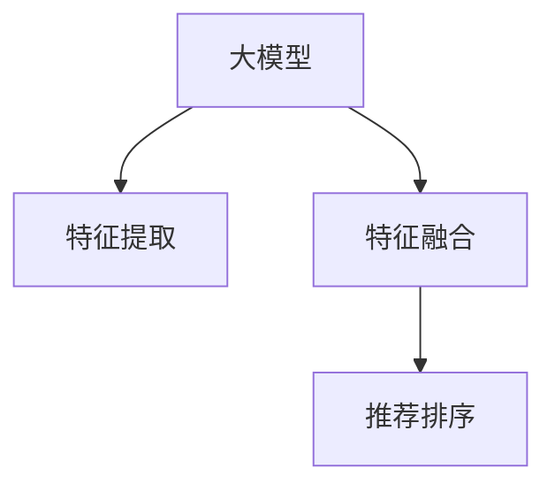

                 

# 大模型在推荐系统中的多视图学习应用

> 关键词：大模型,推荐系统,多视图学习,特征融合,协同过滤,深度学习,神经网络

## 1. 背景介绍

### 1.1 问题由来

推荐系统作为互联网的重要应用，其核心目标是根据用户的历史行为和兴趣，为用户推荐其感兴趣的商品、内容、信息等。传统的推荐系统主要包括基于内容的推荐、协同过滤推荐和混合推荐三种类型。这些推荐方法在数据量大、特征丰富的场景下，已经展示出了强大的表现。

近年来，随着大数据和深度学习技术的发展，基于大模型的推荐系统逐渐进入人们的视野。大模型凭借其庞大的参数量和丰富的语义表达能力，已经在自然语言处理、计算机视觉等众多领域取得了令人瞩目的成就。将其应用于推荐系统，能够显著提升推荐效果，带来新的突破。

### 1.2 问题核心关键点

大模型在推荐系统中的应用，主要聚焦于通过多视图学习，融合用户行为数据、商品属性数据、文本数据等多种信息源，构建更加全面、精准的用户兴趣模型，从而生成更优的推荐结果。具体而言，多视图学习可以分为以下三个核心环节：

1. **特征提取**：通过预训练的大模型，对不同视图的数据进行高效、准确的特征提取。
2. **特征融合**：将不同视图提取的特征进行融合，构建统一的用户和商品表示。
3. **推荐生成**：基于融合后的表示，进行推荐排序和生成。

这些环节通过多视图学习技术，实现了跨领域、多模态数据的整合，提升了推荐系统的精准度和多样性。然而，如何将大模型与推荐系统深度结合，最大化其效果，仍然面临诸多挑战。

## 2. 核心概念与联系

### 2.1 核心概念概述

本节将介绍几个关键概念，这些概念是理解和实现大模型在推荐系统中的应用基础。

- **大模型**：指基于深度学习框架（如TensorFlow、PyTorch等）构建的庞大参数量的模型，如BERT、GPT、Transformer等。
- **推荐系统**：指通过分析用户的历史行为和偏好，为其推荐相关商品、内容的系统。常见的推荐算法包括协同过滤、基于内容的推荐、混合推荐等。
- **多视图学习**：指在推荐系统中，通过融合不同视图的数据（如用户行为、商品属性、文本描述等），构建更加全面的用户和商品表示。
- **特征提取**：指通过预训练模型，将原始数据转化为模型能够理解的特征表示。
- **特征融合**：指将不同视图的特征进行整合，生成统一的用户和商品表示。
- **推荐排序**：指通过模型预测用户对不同商品的兴趣程度，并对其进行排序，生成推荐结果。

这些概念之间的逻辑关系可以通过以下Mermaid流程图来展示：



这个流程图展示了大模型在推荐系统中的应用流程：首先通过预训练模型对不同视图的数据进行特征提取，然后对提取的特征进行融合，最后基于融合后的特征进行推荐排序，生成推荐结果。

## 3. 核心算法原理 & 具体操作步骤

### 3.1 算法原理概述

基于大模型的推荐系统，主要通过多视图学习技术，将不同视图的数据进行整合，构建更加全面、精准的用户和商品表示，从而生成更优的推荐结果。其核心思想是：

1. **预训练模型**：通过在大规模无标签数据上预训练大模型，学习丰富的语义知识，获得强大的特征提取能力。
2. **多视图融合**：通过将用户行为数据、商品属性数据、文本描述等不同视图的数据，输入到预训练模型中进行特征提取，然后通过某种方式将不同视图的特征进行融合，生成统一的用户和商品表示。
3. **推荐排序**：基于融合后的用户和商品表示，使用模型预测用户对不同商品的兴趣程度，并进行推荐排序。

在实践中，常见的基于大模型的推荐系统包括基于Transformer的推荐系统和基于BERT的推荐系统等。这些系统通常具有以下几个特点：

- **高效的特征提取**：大模型具备强大的特征提取能力，能够高效地将不同视图的数据转化为模型能够理解的特征表示。
- **灵活的特征融合方式**：通过不同的融合方式，将不同视图的特征进行整合，生成统一的用户和商品表示。
- **高质量的推荐排序**：基于融合后的用户和商品表示，使用模型预测用户对不同商品的兴趣程度，并进行推荐排序。

### 3.2 算法步骤详解

基于大模型的推荐系统通常包括以下几个关键步骤：

**Step 1: 准备数据集和预训练模型**
- 收集推荐系统所需的用户行为数据、商品属性数据、文本描述数据等。
- 选择合适的预训练模型，如BERT、GPT、Transformer等。

**Step 2: 特征提取**
- 对不同视图的数据进行预处理，包括清洗、归一化、编码等。
- 将处理后的数据输入到预训练模型中，进行特征提取，生成特征向量。

**Step 3: 特征融合**
- 选择合适的融合方式，将不同视图的特征进行整合，生成统一的用户和商品表示。常见的融合方式包括拼接、加权求和、注意力机制等。
- 对融合后的特征进行归一化、降维等处理，生成更稳定的表示。

**Step 4: 推荐排序**
- 选择合适的推荐排序模型，如基于深度神经网络的推荐模型、基于图神经网络的推荐模型等。
- 基于融合后的用户和商品表示，使用推荐排序模型预测用户对不同商品的兴趣程度，并进行推荐排序。

**Step 5: 模型训练和评估**
- 使用部分数据进行模型训练，验证模型的效果。
- 使用剩余数据进行模型评估，根据评估结果调整模型参数。
- 持续迭代训练和评估过程，提升模型性能。

### 3.3 算法优缺点

基于大模型的推荐系统具有以下优点：

1. **高效特征提取**：大模型能够高效地提取不同视图的特征，提高推荐系统的精准度。
2. **灵活特征融合**：通过不同的融合方式，将不同视图的特征进行整合，生成统一的用户和商品表示。
3. **高性能推荐排序**：基于融合后的用户和商品表示，使用深度神经网络等模型进行推荐排序，生成高质量的推荐结果。

同时，该方法也存在一些局限性：

1. **数据依赖性强**：推荐系统的表现高度依赖于数据质量，需要收集高质量的用户行为、商品属性、文本描述等数据。
2. **模型复杂度高**：大模型的参数量和计算复杂度高，对硬件资源要求较高。
3. **训练时间长**：模型训练需要大量的计算资源和时间，对实际应用有一定的限制。
4. **解释性不足**：基于大模型的推荐系统通常是一个"黑盒"系统，难以解释其内部的决策过程。

尽管存在这些局限性，但就目前而言，基于大模型的推荐系统在推荐精度和效果上具有明显优势，已经在多个实际应用中取得了不错的成绩。未来相关研究的方向也将进一步探索如何优化模型的训练效率、降低对硬件的依赖，并提升模型的可解释性。

### 3.4 算法应用领域

基于大模型的推荐系统已经在多个实际应用中取得了不错的成绩，具体包括：

- **电商推荐**：基于用户历史行为、商品属性、商品描述等多视图数据，生成个性化的商品推荐。
- **内容推荐**：基于用户阅读历史、文章属性、文章摘要等多视图数据，生成个性化的文章推荐。
- **社交推荐**：基于用户互动历史、好友关系、社交属性等多视图数据，生成个性化的社交推荐。
- **广告推荐**：基于用户行为、广告属性、广告文本等多视图数据，生成个性化的广告推荐。

除了上述这些典型应用外，基于大模型的推荐系统还被创新性地应用于更多场景中，如视频推荐、音乐推荐、游戏推荐等，为推荐系统带来了全新的突破。随着大模型和推荐算法的不断进步，相信基于大模型的推荐系统将在更多领域得到广泛应用，为用户的个性化需求提供更加精准的推荐服务。

## 4. 数学模型和公式 & 详细讲解 & 举例说明

### 4.1 数学模型构建

基于大模型的推荐系统可以通过以下数学模型进行形式化描述：

记用户表示为 $\mathbf{u}$，商品表示为 $\mathbf{v}$，不同视图的特征表示为 $X$、$Y$、$Z$ 等。假设不同视图的特征表示已经通过预训练模型进行提取，生成的特征向量分别为 $\mathbf{x}$、$\mathbf{y}$、$\mathbf{z}$ 等。则推荐系统的数学模型可以表示为：

$$
\hat{P} = f(\mathbf{W}_X X + \mathbf{W}_Y Y + \mathbf{W}_Z Z + \mathbf{b})
$$

其中，$f$ 为推荐排序模型，$\mathbf{W}_X$、$\mathbf{W}_Y$、$\mathbf{W}_Z$ 为不同视图的权重矩阵，$\mathbf{b}$ 为偏置向量。$\hat{P}$ 表示模型预测用户对不同商品的兴趣程度。

### 4.2 公式推导过程

以下我们将以基于Transformer的推荐系统为例，推导推荐排序模型的详细公式。

假设推荐系统的输入为 $X$、$Y$、$Z$ 等不同视图的特征表示，输出为 $\hat{P}$。根据前述公式，推荐排序模型的推导如下：

首先，将不同视图的特征表示进行拼接，得到新的特征向量：

$$
\mathbf{h} = \begin{bmatrix}
\mathbf{x} \\
\mathbf{y} \\
\mathbf{z}
\end{bmatrix}
$$

然后，使用权重矩阵 $\mathbf{W}_X$、$\mathbf{W}_Y$、$\mathbf{W}_Z$ 对不同视图的特征进行加权，得到加权后的特征向量：

$$
\mathbf{h'} = \mathbf{W}_X \mathbf{x} + \mathbf{W}_Y \mathbf{y} + \mathbf{W}_Z \mathbf{z}
$$

最后，将加权后的特征向量与偏置向量 $\mathbf{b}$ 进行线性变换，并通过激活函数 $f$，得到推荐排序结果 $\hat{P}$：

$$
\hat{P} = f(\mathbf{h'} + \mathbf{b})
$$

其中，激活函数 $f$ 可以采用ReLU、sigmoid、tanh等，具体选择取决于推荐系统的目标。

### 4.3 案例分析与讲解

以电商推荐系统为例，分析基于大模型的推荐过程。假设用户 $u$ 对商品 $i$ 感兴趣，输入用户行为数据 $X$、商品属性数据 $Y$、商品描述数据 $Z$，使用BERT模型进行特征提取，生成特征向量 $\mathbf{x}$、$\mathbf{y}$、$\mathbf{z}$。然后，使用权重矩阵 $\mathbf{W}_X$、$\mathbf{W}_Y$、$\mathbf{W}_Z$ 对不同视图的特征进行加权，得到加权后的特征向量 $\mathbf{h'}$。最后，使用线性变换和ReLU激活函数，生成推荐排序结果 $\hat{P}$，推荐排序模型将基于 $\hat{P}$ 进行推荐排序。

## 5. 项目实践：代码实例和详细解释说明

### 5.1 开发环境搭建

在进行推荐系统项目实践前，我们需要准备好开发环境。以下是使用Python进行TensorFlow开发的环境配置流程：

1. 安装Anaconda：从官网下载并安装Anaconda，用于创建独立的Python环境。

2. 创建并激活虚拟环境：
```bash
conda create -n tf-env python=3.8 
conda activate tf-env
```

3. 安装TensorFlow：根据CUDA版本，从官网获取对应的安装命令。例如：
```bash
conda install tensorflow==2.6 -c tensorflow -c conda-forge
```

4. 安装各类工具包：
```bash
pip install numpy pandas scikit-learn matplotlib tqdm jupyter notebook ipython
```

完成上述步骤后，即可在`tf-env`环境中开始推荐系统实践。

### 5.2 源代码详细实现

这里我们以电商推荐系统为例，给出使用TensorFlow进行推荐排序的代码实现。

首先，定义推荐排序模型：

```python
import tensorflow as tf
from tensorflow.keras.layers import Input, Dense, Embedding, concatenate, Flatten, Dot, add

# 定义输入层
input_x = Input(shape=(num_features_x,), name='input_x')
input_y = Input(shape=(num_features_y,), name='input_y')
input_z = Input(shape=(num_features_z,), name='input_z')

# 定义不同视图的嵌入层
embedding_x = Embedding(input_dim=num_features_x, output_dim=embedding_dim, name='embedding_x')(input_x)
embedding_y = Embedding(input_dim=num_features_y, output_dim=embedding_dim, name='embedding_y')(input_y)
embedding_z = Embedding(input_dim=num_features_z, output_dim=embedding_dim, name='embedding_z')(input_z)

# 定义不同视图的特征加权层
weighted_x = tf.keras.layers.Dense(1, activation='relu')(embedding_x)
weighted_y = tf.keras.layers.Dense(1, activation='relu')(embedding_y)
weighted_z = tf.keras.layers.Dense(1, activation='relu')(embedding_z)

# 定义不同视图的特征加权和层
concat_x_y_z = concatenate([weighted_x, weighted_y, weighted_z], axis=1)
weighted_concat_x_y_z = tf.keras.layers.Dense(1, activation='relu')(concat_x_y_z)

# 定义输出层
output = Dense(1, activation='sigmoid')(weighted_concat_x_y_z)

# 定义模型
model = tf.keras.Model(inputs=[input_x, input_y, input_z], outputs=output)
```

然后，定义模型编译和训练函数：

```python
# 定义模型编译器
model.compile(optimizer=tf.keras.optimizers.Adam(learning_rate=0.001), loss='binary_crossentropy', metrics=['accuracy'])

# 定义训练函数
def train_epoch(model, dataset, batch_size):
    for batch, (x, y) in dataset:
        with tf.GradientTape() as tape:
            preds = model(x, y)
            loss = tf.keras.losses.binary_crossentropy(y, preds)
        grads = tape.gradient(loss, model.trainable_variables)
        optimizer.apply_gradients(zip(grads, model.trainable_variables))
```

最后，启动训练流程并在测试集上评估：

```python
# 定义训练集和测试集
train_dataset = tf.data.Dataset.from_tensor_slices((train_x, train_y, train_z)).batch(batch_size)
test_dataset = tf.data.Dataset.from_tensor_slices((test_x, test_y, test_z)).batch(batch_size)

# 训练模型
num_epochs = 10
for epoch in range(num_epochs):
    train_epoch(model, train_dataset, batch_size)
    val_loss, val_acc = model.evaluate(test_x, test_y, test_z)
    print(f'Epoch {epoch+1}, val loss: {val_loss:.4f}, val acc: {val_acc:.4f}')

# 在测试集上评估模型
test_loss, test_acc = model.evaluate(test_x, test_y, test_z)
print(f'Test loss: {test_loss:.4f}, test acc: {test_acc:.4f}')
```

以上就是使用TensorFlow对电商推荐系统进行推荐排序的完整代码实现。可以看到，TensorFlow的Keras API使得模型构建和训练变得简单易用。

### 5.3 代码解读与分析

让我们再详细解读一下关键代码的实现细节：

**推荐排序模型定义**：
- 使用`Input`定义输入层，包含用户行为数据、商品属性数据、商品描述数据等不同视图的特征。
- 使用`Embedding`将不同视图的特征映射为高维向量表示。
- 使用`Dense`对不同视图的特征进行加权，得到加权后的特征向量。
- 使用`concatenate`将不同视图的加权特征向量进行拼接。
- 使用`Dense`对拼接后的特征向量进行加权和，得到融合后的特征向量。
- 使用`Dense`对融合后的特征向量进行线性变换和激活函数变换，生成推荐排序结果。

**模型编译和训练**：
- 使用`model.compile`定义模型编译器，指定优化器、损失函数和评估指标。
- 使用自定义的`train_epoch`函数进行模型训练，遍历训练集进行前向传播、反向传播和参数更新。
- 在每个epoch结束时，使用`model.evaluate`在测试集上评估模型性能。

**训练和评估流程**：
- 在训练函数中，使用`tf.GradientTape`记录梯度，使用`optimizer.apply_gradients`更新模型参数。
- 在每个epoch结束时，使用`model.evaluate`在测试集上评估模型性能。
- 最后，在训练结束后，使用`model.evaluate`在测试集上评估模型性能。

可以看到，TensorFlow的Keras API使得模型构建和训练变得简单易用，开发者可以专注于模型设计和数据处理等高层逻辑上。

当然，实际应用中还需要进一步优化模型结构、调整超参数等，以适应具体任务的需求。

## 6. 实际应用场景

### 6.1 电商推荐系统

基于大模型的电商推荐系统，可以通过融合用户行为数据、商品属性数据、商品描述等多视图信息，生成个性化的商品推荐。推荐系统的目标是通过高精度和高相关性的推荐结果，提升用户购买率和满意度。

在技术实现上，可以收集用户历史浏览、点击、购买等行为数据，商品属性信息（如尺寸、颜色、价格等），商品描述信息（如商品标题、详情描述等），并对其进行特征提取和融合。然后，使用大模型进行推荐排序，生成推荐结果，并根据用户的反馈进行迭代优化。

### 6.2 内容推荐系统

基于大模型的内容推荐系统，可以通过融合用户阅读历史、文章属性、文章摘要等多视图信息，生成个性化的文章推荐。推荐系统的目标是通过高精度和高相关性的推荐结果，提升用户的阅读体验和满意度。

在技术实现上，可以收集用户历史阅读记录、文章属性信息（如分类、标签等），文章摘要信息，并对其进行特征提取和融合。然后，使用大模型进行推荐排序，生成推荐结果，并根据用户的反馈进行迭代优化。

### 6.3 社交推荐系统

基于大模型的社交推荐系统，可以通过融合用户互动历史、好友关系、社交属性等多视图信息，生成个性化的社交推荐。推荐系统的目标是通过高精度和高相关性的推荐结果，提升用户的社交互动体验和满意度。

在技术实现上，可以收集用户互动历史（如点赞、评论、分享等）、好友关系信息（如好友列表、互动记录等），社交属性信息（如年龄、性别、职业等），并对其进行特征提取和融合。然后，使用大模型进行推荐排序，生成推荐结果，并根据用户的反馈进行迭代优化。

### 6.4 未来应用展望

随着大模型和推荐算法的不断进步，基于大模型的推荐系统将在更多领域得到应用，为用户的个性化需求提供更加精准的推荐服务。

在智慧医疗领域，基于大模型的推荐系统可以推荐个性化医疗方案、药物、营养等，提升医疗服务的精准度和个性化程度。

在智能教育领域，基于大模型的推荐系统可以推荐个性化的学习资源、作业、练习题等，提高学习效果和效率。

在智慧城市治理中，基于大模型的推荐系统可以推荐智能交通方案、环保措施、公共服务等，提升城市治理的智能化和精细化水平。

此外，在金融、旅游、游戏等多个领域，基于大模型的推荐系统也将不断涌现，为各行各业带来新的创新应用。

## 7. 工具和资源推荐

### 7.1 学习资源推荐

为了帮助开发者系统掌握大模型在推荐系统中的应用，这里推荐一些优质的学习资源：

1. 《深度学习推荐系统》书籍：全面介绍了深度学习在推荐系统中的应用，包括基于大模型的推荐系统。
2. 《Python深度学习推荐系统》教程：使用Python和TensorFlow实现推荐系统的详细教程，适合初学者入门。
3. Coursera《深度学习》课程：斯坦福大学开设的深度学习课程，涵盖深度学习基础和应用，包括推荐系统。
4 Udacity《推荐系统设计》纳米学位课程：系统学习推荐系统设计原理和技术实现，适合进阶学习。

通过对这些资源的学习实践，相信你一定能够快速掌握大模型在推荐系统中的应用，并用于解决实际的推荐问题。

### 7.2 开发工具推荐

高效的开发离不开优秀的工具支持。以下是几款用于推荐系统开发的常用工具：

1. TensorFlow：基于Python的开源深度学习框架，灵活动态的计算图，适合复杂模型和分布式训练。
2. PyTorch：基于Python的开源深度学习框架，易于使用，适合快速迭代研究。
3. Keras：高级神经网络API，可快速搭建和训练推荐系统模型。
4. Jupyter Notebook：交互式开发环境，适合代码调试和模型验证。
5. Flask：轻量级的Web应用框架，适合部署推荐系统服务。

合理利用这些工具，可以显著提升推荐系统的开发效率，加快创新迭代的步伐。

### 7.3 相关论文推荐

大模型在推荐系统中的应用已经成为学界和工业界的研究热点。以下是几篇奠基性的相关论文，推荐阅读：

1. "Recommender Systems: An Introduction"（深度学习推荐系统简介）：介绍了推荐系统的基本概念和分类，涵盖协同过滤、基于内容的推荐、混合推荐等。
2. "Deep Collaborative Filtering"（深度协同过滤）：提出了基于深度神经网络的推荐系统，提升了推荐系统的精度和泛化能力。
3. "Matrix Factorization Techniques for Recommender Systems"（矩阵分解推荐算法）：介绍了矩阵分解等推荐算法，详细推导了推荐模型的公式。
4. "Attention Is All You Need"（Transformer论文）：提出了Transformer结构，展示了其在自然语言处理任务中的优异表现。
5. "BERT: Pre-training of Deep Bidirectional Transformers for Language Understanding"（BERT模型论文）：提出了BERT模型，展示了其在NLP任务中的强大表现。
6. "Parameter-Efficient Transfer Learning for NLP"（参数高效迁移学习）：提出了Adapter等参数高效迁移学习技术，在固定大部分预训练参数的情况下，仍能取得不错的迁移效果。

这些论文代表了大模型在推荐系统中的应用方向，深入理解这些前沿成果，可以帮助研究者把握学科前进方向，激发更多的创新灵感。

## 8. 总结：未来发展趋势与挑战

### 8.1 总结

本文对基于大模型的推荐系统进行了全面系统的介绍。首先阐述了大模型和推荐系统的发展背景和意义，明确了推荐系统的核心目标和数据类型。然后，从原理到实践，详细讲解了基于大模型的推荐系统的数学模型和算法步骤，给出了推荐系统的代码实现。最后，探讨了推荐系统在电商、内容、社交等多个领域的应用前景，展望了未来发展趋势和面临的挑战。

通过本文的系统梳理，可以看到，基于大模型的推荐系统在推荐精度和效果上具有明显优势，已经在多个实际应用中取得了不错的成绩。未来相关研究的方向也将进一步探索如何优化模型的训练效率、降低对硬件的依赖，并提升模型的可解释性。

### 8.2 未来发展趋势

展望未来，基于大模型的推荐系统将呈现以下几个发展趋势：

1. **深度融合多视图数据**：未来的推荐系统将更加注重不同视图数据的融合，通过融合用户行为、商品属性、文本描述等多种信息源，构建更加全面、精准的用户和商品表示。
2. **引入更多先验知识**：将符号化的先验知识，如知识图谱、逻辑规则等，与神经网络模型进行巧妙融合，引导推荐过程学习更准确、合理的用户和商品表示。
3. **多模态推荐技术**：推荐系统将更多地引入视觉、语音等多模态信息，实现视觉、语音和文本信息的协同建模，提升推荐系统的多样性和丰富性。
4. **智能推荐系统**：结合因果分析方法、强化学习等技术，构建智能推荐系统，提高推荐系统的自主性和适应性。
5. **联邦推荐系统**：利用联邦学习等技术，在保护用户隐私的前提下，实现跨机构、跨平台的数据融合和推荐，提升推荐系统的泛化能力。

这些趋势展示了基于大模型的推荐系统的广阔前景，预示着未来推荐系统将具备更加精准、智能、多样化的特性。

### 8.3 面临的挑战

尽管基于大模型的推荐系统已经在推荐精度和效果上取得了明显优势，但在迈向更加智能化、普适化应用的过程中，它仍面临着诸多挑战：

1. **数据依赖性强**：推荐系统的表现高度依赖于数据质量，需要收集高质量的用户行为、商品属性、文本描述等数据。
2. **模型复杂度高**：大模型的参数量和计算复杂度高，对硬件资源要求较高。
3. **训练时间长**：模型训练需要大量的计算资源和时间，对实际应用有一定的限制。
4. **解释性不足**：基于大模型的推荐系统通常是一个"黑盒"系统，难以解释其内部的决策过程。
5. **鲁棒性不足**：推荐系统对新数据的泛化能力有限，容易受到数据分布变化的影响。

尽管存在这些挑战，但相信通过学界和产业界的共同努力，这些问题终将一一被克服，大模型在推荐系统中的应用必将迈向更加成熟的阶段。

### 8.4 研究展望

面对基于大模型的推荐系统所面临的挑战，未来的研究需要在以下几个方面寻求新的突破：

1. **优化模型训练效率**：开发更高效的模型训练算法，如分布式训练、混合精度训练等，缩短训练时间，降低对硬件的依赖。
2. **提升模型可解释性**：结合因果分析、可解释性技术，增强推荐系统的透明度和可理解性。
3. **引入更多先验知识**：将符号化的先验知识，如知识图谱、逻辑规则等，与神经网络模型进行融合，提升推荐系统的知识整合能力。
4. **多模态数据融合**：结合视觉、语音等多模态数据，实现多模态信息的协同建模，提升推荐系统的多样性和丰富性。
5. **联邦推荐系统**：利用联邦学习等技术，在保护用户隐私的前提下，实现跨机构、跨平台的数据融合和推荐，提升推荐系统的泛化能力。
6. **智能推荐系统**：结合因果分析、强化学习等技术，构建智能推荐系统，提高推荐系统的自主性和适应性。

这些研究方向的探索，必将引领基于大模型的推荐系统技术迈向更高的台阶，为推荐系统的发展带来新的突破。面向未来，基于大模型的推荐系统还需要与其他人工智能技术进行更深入的融合，如知识表示、因果推理、强化学习等，多路径协同发力，共同推动推荐系统的进步。只有勇于创新、敢于突破，才能不断拓展推荐系统的边界，让推荐系统更好地服务于用户。

## 9. 附录：常见问题与解答

**Q1：大模型在推荐系统中是否适用？**

A: 大模型在推荐系统中具有显著优势，通过多视图学习技术，可以高效地融合不同视图的特征，构建更加全面、精准的用户和商品表示，提升推荐系统的精准度和多样性。但在数据量大、特征丰富的场景下，推荐系统往往需要处理大量的数据，对计算资源和时间的要求较高，需要结合多视图学习技术，优化模型训练效率，降低对硬件的依赖。

**Q2：如何选择合适的嵌入层？**

A: 选择合适的嵌入层，需要考虑不同视图数据的特征和目标任务的特点。常见的嵌入层包括独热嵌入、词嵌入、词向量等。独热嵌入适用于离散数据，如商品分类、用户标签等；词嵌入适用于连续数据，如文本数据、商品属性等；词向量适用于高维数据，如商品描述、文章摘要等。根据不同视图数据的特性，选择合适的嵌入层，可以提升推荐系统的精准度和泛化能力。

**Q3：如何优化模型的训练效率？**

A: 优化模型的训练效率，需要结合多视图学习技术，优化模型结构和超参数。常见的优化策略包括：
1. 数据增强：通过回译、近义替换等方式扩充训练集，提升模型的泛化能力。
2. 正则化：使用L2正则、Dropout、Early Stopping等避免过拟合。
3. 混合精度训练：将浮点模型转为定点模型，压缩存储空间，提高计算效率。
4. 分布式训练：利用多台机器并行训练，提高训练速度。
5. 模型压缩：使用剪枝、量化等技术，减少模型参数量，降低计算资源消耗。

这些优化策略需要根据具体任务和数据特点进行灵活组合，以提升模型的训练效率和性能。

**Q4：大模型在推荐系统中的可解释性如何提升？**

A: 提升大模型在推荐系统中的可解释性，可以通过以下方式实现：
1. 模型可视化：使用工具如TensorBoard等，可视化模型的训练过程和参数变化，帮助理解模型的内部机制。
2. 特征重要性分析：使用LIME、SHAP等工具，分析模型中各个特征的重要性，帮助理解模型的决策逻辑。
3. 解释性技术：结合因果分析、可解释性技术，增强推荐系统的透明度和可理解性。
4. 知识图谱：引入知识图谱等先验知识，提升推荐系统的知识整合能力，增强模型的可解释性。

这些方法可以结合具体任务和数据特点，提升大模型在推荐系统中的可解释性，帮助理解模型的内部机制和决策逻辑。

**Q5：推荐系统中的数据隐私如何保护？**

A: 推荐系统中的数据隐私保护，可以通过以下方式实现：
1. 联邦学习：利用联邦学习技术，在保护用户隐私的前提下，实现跨机构、跨平台的数据融合和推荐。
2. 差分隐私：使用差分隐私技术，对用户数据进行扰动处理，保护用户隐私。
3. 数据加密：使用数据加密技术，对用户数据进行加密处理，防止数据泄露。
4. 访问控制：设置访问权限，限制数据访问范围，保护用户数据隐私。

这些方法可以结合具体应用场景和数据特点，保护用户隐私，提升推荐系统的可信度和安全性。

---

作者：禅与计算机程序设计艺术 / Zen and the Art of Computer Programming

