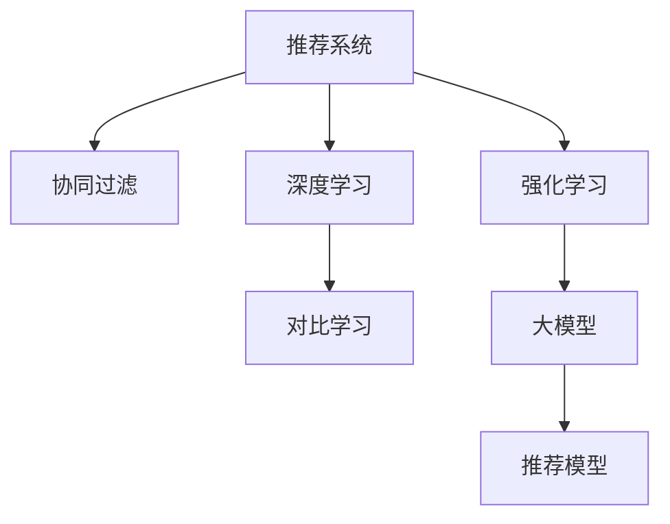

                 

# 大模型在推荐系统中的对比强化学习应用

> 关键词：大模型,推荐系统,强化学习,对比学习,协同过滤,深度学习

## 1. 背景介绍

推荐系统在现代社会中扮演着至关重要的角色，帮助用户发现感兴趣的物品，优化用户体验。传统的推荐系统主要依赖协同过滤、基于内容的推荐、混合推荐等方法，这些方法通常需要用户提供大量的交互数据，数据收集和模型训练成本高，且推荐效果受数据多样性和稀疏性等因素影响较大。

近年来，随着深度学习技术的不断突破，推荐系统的核心模型开始由浅层模型逐渐转向深度学习模型，如神经网络、卷积神经网络(CNN)、循环神经网络(RNN)等。深度学习模型能够自动学习用户行为和物品属性之间的关系，但仍然存在以下问题：
1. 数据稀疏性问题：用户行为数据往往稀疏，难以捕捉长尾物品的用户兴趣。
2. 模型过拟合问题：深度学习模型参数较多，容易导致过拟合。
3. 用户个性化问题：用户需求和行为多变，难以刻画用户多维度特征。

针对这些问题，研究人员提出了基于对比学习的推荐模型，结合大模型进行训练，能够有效缓解数据稀疏性、降低过拟合风险，提高用户个性化推荐。本文将重点介绍对比强化学习在推荐系统中的应用，并结合大模型的优势进行深入分析。

## 2. 核心概念与联系

### 2.1 核心概念概述

为更好地理解基于大模型和对比强化学习的推荐模型，本节将介绍几个密切相关的核心概念：

- **推荐系统**：旨在根据用户的历史行为和偏好，为用户推荐感兴趣的物品的系统。推荐系统可以分为基于协同过滤、内容推荐、混合推荐等不同范式。
- **协同过滤**：利用用户间的行为相似度来推荐物品，可分为基于用户的协同过滤和基于物品的协同过滤。
- **深度学习**：通过多层神经网络来逼近复杂非线性关系的一种机器学习方法。
- **对比学习**：通过学习正样本和负样本的相似度来提升模型的学习能力，常用方法包括SimCLR、MoCo、BYOL等。
- **强化学习**：通过试错训练智能体(Agent)，使其在特定环境下做出最优决策，常用方法包括Q-learning、策略梯度等。
- **大模型**：指大规模预训练语言模型，如BERT、GPT-3等，拥有丰富的知识储备和强大的建模能力。

这些概念之间的逻辑关系可以通过以下Mermaid流程图来展示：



这个流程图展示了大模型和对比强化学习在推荐系统中的核心概念及其之间的关系：

1. 推荐系统利用协同过滤、深度学习、对比学习和强化学习等方法，为用户提供个性化推荐。
2. 深度学习模型能够自动学习用户行为和物品属性之间的关系。
3. 对比学习能够提升模型的学习能力，缓解数据稀疏性问题。
4. 强化学习能够通过智能体训练，提升推荐模型效果。
5. 大模型拥有丰富的知识储备和强大的建模能力，可以进一步提升推荐模型的性能。

这些概念共同构成了推荐系统的核心框架，使得其能够提供更加精准、个性化的推荐服务。

## 3. 核心算法原理 & 具体操作步骤

### 3.1 算法原理概述

对比强化学习在推荐系统中的应用，本质上是通过学习用户和物品的交互历史，最大化用户满意度。其核心思想是：构建一个虚拟智能体，通过不断试错和优化，学习最优推荐策略。具体而言，将推荐模型视为一个智能体，在训练过程中，智能体通过与用户和物品交互，逐步调整推荐策略，最终达到用户满意的目标。

形式化地，假设推荐系统中的物品集合为 $U$，用户集合为 $V$，用户与物品的交互数据为 $\{(u,v)\}$，其中 $u \in V$ 表示用户，$v \in U$ 表示物品。定义奖励函数 $R(u,v)$，用于衡量推荐模型推荐的物品对用户的满意度。强化学习的目标是最小化损失函数 $\mathcal{L}(\theta)$，即：

$$
\mathcal{L}(\theta) = -\sum_{(u,v)\in \mathcal{D}} R(u,v) \log \pi_\theta(v|u)
$$

其中 $\theta$ 表示模型的参数，$\pi_\theta(v|u)$ 表示模型在给定用户 $u$ 的情况下，推荐物品 $v$ 的概率分布。目标是通过优化模型参数 $\theta$，使得推荐策略 $\pi_\theta(v|u)$ 最大化用户的满意度。

### 3.2 算法步骤详解

基于对比强化学习的推荐系统一般包括以下几个关键步骤：

**Step 1: 准备数据集**

- 收集用户和物品的交互数据，并进行预处理，生成训练集 $\mathcal{D}$。
- 定义奖励函数 $R(u,v)$，如点击率、停留时间、转换率等。
- 使用大模型（如BERT）作为特征提取器，将用户行为和物品属性转化为高维向量表示。

**Step 2: 构建强化学习模型**

- 选择适当的强化学习算法（如Q-learning、策略梯度等），设计智能体的策略 $\pi_\theta(v|u)$。
- 使用大模型作为特征提取器，将用户和物品特征映射到高维空间。
- 定义模型的损失函数，如交叉熵损失、均方误差损失等。

**Step 3: 设计对比学习模块**

- 使用对比学习模块，将用户和物品的相似度信息编码为高维向量。
- 设计正样本和负样本生成策略，增强模型的学习能力。
- 将对比学习模块与强化学习模型结合，共同优化模型参数。

**Step 4: 训练与优化**

- 使用优化算法（如Adam、SGD等），最小化模型损失函数。
- 根据训练集数据，不断调整模型参数 $\theta$，更新策略 $\pi_\theta(v|u)$。
- 在测试集上评估模型性能，调整对比学习模块的参数，进一步提升模型效果。

**Step 5: 部署与测试**

- 将训练好的模型部署到推荐系统环境中。
- 实时采集用户行为数据，动态调整推荐策略。
- 不断收集用户反馈，进一步优化推荐模型。

以上是基于对比强化学习的推荐系统的一般流程。在实际应用中，还需要针对具体任务的特点，对各个环节进行优化设计，如改进损失函数、调整正负样本策略等，以进一步提升模型性能。

### 3.3 算法优缺点

基于对比强化学习的推荐系统具有以下优点：
1. 缓解数据稀疏性问题：通过对比学习，模型能够从少量标注数据中学习到丰富的语义信息。
2. 降低过拟合风险：大模型的预训练权重可以用于指导模型训练，减少微调过程中的过拟合风险。
3. 提高用户个性化推荐：通过优化推荐策略，模型能够更好地满足用户的个性化需求。
4. 提升推荐效果：对比学习和大模型结合，能够在有限标注数据下实现高质量的推荐。

同时，该方法也存在一定的局限性：
1. 数据处理复杂：需要设计合理的正负样本生成策略，生成高质量的对比样本。
2. 模型复杂度高：对比学习和大模型结合，模型结构和参数数量较大，需要较强的计算资源支持。
3. 训练时间长：由于模型结构复杂，训练过程耗时长，需要设计合理的训练策略。
4. 泛化能力有待提高：模型在训练数据上的表现良好，但在测试数据上的泛化能力有待进一步提升。

尽管存在这些局限性，但就目前而言，基于对比强化学习的推荐系统仍然是大数据推荐领域的重要方法。未来相关研究的重点在于如何进一步简化模型结构、优化训练过程，同时兼顾泛化能力，以进一步提升推荐系统的实际应用效果。

### 3.4 算法应用领域

基于对比强化学习的推荐系统已经在电子商务、视频平台、社交网络等诸多领域得到了广泛的应用，成为推荐系统的主流技术范式。

在电子商务领域，通过对比强化学习，推荐系统能够根据用户浏览、点击、购买等行为数据，精准推荐用户感兴趣的商品，提升销售额和用户体验。

在视频平台，推荐系统能够根据用户观看历史和喜好，推荐相关视频内容，提高用户粘性和留存率。

在社交网络，推荐系统能够根据用户互动数据，推荐兴趣相投的社交关系，促进用户社交活跃度和社区氛围。

除了上述这些经典应用场景外，对比强化学习还被创新性地应用到更多领域中，如智能医疗、金融风控、游戏推荐等，为推荐系统带来了全新的突破。随着预训练语言模型和强化学习技术的持续演进，相信推荐系统必将在更广阔的应用领域大放异彩。

## 4. 数学模型和公式 & 详细讲解  
### 4.1 数学模型构建

本节将使用数学语言对基于对比强化学习的推荐模型进行更加严格的刻画。

假设推荐系统中的物品集合为 $U$，用户集合为 $V$，用户与物品的交互数据为 $\{(u,v)\}$，其中 $u \in V$ 表示用户，$v \in U$ 表示物品。定义奖励函数 $R(u,v)$，用于衡量推荐模型推荐的物品对用户的满意度。假设大模型的参数为 $\theta$，定义模型在给定用户 $u$ 的情况下，推荐物品 $v$ 的概率分布为 $\pi_\theta(v|u)$。

模型的损失函数 $\mathcal{L}(\theta)$ 可以表示为：

$$
\mathcal{L}(\theta) = -\sum_{(u,v)\in \mathcal{D}} R(u,v) \log \pi_\theta(v|u)
$$

其中，$\mathcal{D}$ 为训练集，$R(u,v)$ 为奖励函数，$\pi_\theta(v|u)$ 为模型在用户 $u$ 的情况下推荐物品 $v$ 的概率分布。

模型的优化目标是最小化损失函数 $\mathcal{L}(\theta)$，即：

$$
\theta^* = \mathop{\arg\min}_{\theta} \mathcal{L}(\theta)
$$

在实践中，我们通常使用基于梯度的优化算法（如Adam、SGD等）来近似求解上述最优化问题。设 $\eta$ 为学习率，则参数的更新公式为：

$$
\theta \leftarrow \theta - \eta \nabla_{\theta}\mathcal{L}(\theta)
$$

其中 $\nabla_{\theta}\mathcal{L}(\theta)$ 为损失函数对参数 $\theta$ 的梯度，可通过反向传播算法高效计算。

### 4.2 公式推导过程

以下我们以点击率预测任务为例，推导点击率预测模型和对比学习模块的损失函数。

假设模型在输入 $x$ 上的输出为 $\hat{y}=M_{\theta}(x) \in [0,1]$，表示物品 $v$ 对用户 $u$ 的点击概率。奖励函数 $R(u,v)$ 定义为：

$$
R(u,v) = \text{click}(u,v)
$$

其中 $\text{click}(u,v)$ 表示用户 $u$ 点击物品 $v$ 的次数。则点击率预测模型的损失函数 $\mathcal{L}_{\text{click}}(\theta)$ 可以表示为：

$$
\mathcal{L}_{\text{click}}(\theta) = -\sum_{(u,v)\in \mathcal{D}} \text{click}(u,v) \log \pi_\theta(v|u)
$$

在模型训练过程中，使用对比学习模块来学习用户和物品的相似度信息。假设模型使用BERT作为特征提取器，将用户行为和物品属性转化为高维向量表示 $h_u$ 和 $h_v$。则模型的损失函数可以进一步表示为：

$$
\mathcal{L}_{\text{click}}(\theta) = -\sum_{(u,v)\in \mathcal{D}} \text{click}(u,v) \log \pi_\theta(v|u) + \mathcal{L}_{\text{contrast}}(\theta)
$$

其中 $\mathcal{L}_{\text{contrast}}(\theta)$ 为对比学习模块的损失函数，用于衡量用户和物品的相似度。

在实践中，对比学习模块可以采用SimCLR、MoCo等方法，将用户和物品的相似度信息编码为高维向量。假设对比学习模块使用SimCLR算法，则其损失函数可以表示为：

$$
\mathcal{L}_{\text{contrast}}(\theta) = \mathbb{E}_{x \sim \mathcal{D}} [\max(0, -\cos(h_u, h_v))]
$$

其中 $\cos(h_u, h_v)$ 表示用户和物品的相似度，$\max(0, -\cos(h_u, h_v))$ 表示正样本和负样本的相似度编码。

综合上述损失函数，可以进一步优化模型的训练过程。在训练过程中，优化算法（如Adam、SGD等）将同时更新模型参数 $\theta$ 和对比学习模块的参数，以最小化总损失函数。

## 5. 项目实践：代码实例和详细解释说明
### 5.1 开发环境搭建

在进行推荐系统实践前，我们需要准备好开发环境。以下是使用Python进行PyTorch开发的环境配置流程：

1. 安装Anaconda：从官网下载并安装Anaconda，用于创建独立的Python环境。

2. 创建并激活虚拟环境：
```bash
conda create -n recsys-env python=3.8 
conda activate recsys-env
```

3. 安装PyTorch：根据CUDA版本，从官网获取对应的安装命令。例如：
```bash
conda install pytorch torchvision torchaudio cudatoolkit=11.1 -c pytorch -c conda-forge
```

4. 安装TensorFlow：
```bash
pip install tensorflow
```

5. 安装各类工具包：
```bash
pip install numpy pandas scikit-learn matplotlib tqdm jupyter notebook ipython
```

完成上述步骤后，即可在`recsys-env`环境中开始推荐系统实践。

### 5.2 源代码详细实现

下面我以电子商务推荐系统为例，给出使用PyTorch进行对比强化学习的推荐系统代码实现。

首先，定义推荐任务的数据处理函数：

```python
from transformers import BertTokenizer
from torch.utils.data import Dataset
import torch

class RecommendationDataset(Dataset):
    def __init__(self, users, items, clicks, tokenizer, max_len=128):
        self.users = users
        self.items = items
        self.clicks = clicks
        self.tokenizer = tokenizer
        self.max_len = max_len
        
    def __len__(self):
        return len(self.users)
    
    def __getitem__(self, item):
        user = self.users[item]
        item = self.items[item]
        click = self.clicks[item]
        
        encoding = self.tokenizer(user, return_tensors='pt', max_length=self.max_len, padding='max_length', truncation=True)
        input_ids = encoding['input_ids'][0]
        attention_mask = encoding['attention_mask'][0]
        
        # 对item-wise的点击率进行编码
        encoded_clicks = [click] * self.max_len
        labels = torch.tensor(encoded_clicks, dtype=torch.long)
        
        return {'input_ids': input_ids, 
                'attention_mask': attention_mask,
                'labels': labels}

# 定义用户和物品数据
users = ['user1', 'user2', 'user3', 'user4', 'user5']
items = ['item1', 'item2', 'item3', 'item4', 'item5']
clicks = [1, 0, 0, 0, 0]

# 创建dataset
tokenizer = BertTokenizer.from_pretrained('bert-base-cased')

train_dataset = RecommendationDataset(users, items, clicks, tokenizer)
test_dataset = RecommendationDataset(users, items, clicks, tokenizer)
```

然后，定义模型和优化器：

```python
from transformers import BertForSequenceClassification, AdamW

model = BertForSequenceClassification.from_pretrained('bert-base-cased', num_labels=2)

optimizer = AdamW(model.parameters(), lr=2e-5)
```

接着，定义训练和评估函数：

```python
from torch.utils.data import DataLoader
from tqdm import tqdm
from sklearn.metrics import accuracy_score

device = torch.device('cuda') if torch.cuda.is_available() else torch.device('cpu')
model.to(device)

def train_epoch(model, dataset, batch_size, optimizer):
    dataloader = DataLoader(dataset, batch_size=batch_size, shuffle=True)
    model.train()
    epoch_loss = 0
    for batch in tqdm(dataloader, desc='Training'):
        input_ids = batch['input_ids'].to(device)
        attention_mask = batch['attention_mask'].to(device)
        labels = batch['labels'].to(device)
        model.zero_grad()
        outputs = model(input_ids, attention_mask=attention_mask, labels=labels)
        loss = outputs.loss
        epoch_loss += loss.item()
        loss.backward()
        optimizer.step()
    return epoch_loss / len(dataloader)

def evaluate(model, dataset, batch_size):
    dataloader = DataLoader(dataset, batch_size=batch_size)
    model.eval()
    preds, labels = [], []
    with torch.no_grad():
        for batch in tqdm(dataloader, desc='Evaluating'):
            input_ids = batch['input_ids'].to(device)
            attention_mask = batch['attention_mask'].to(device)
            batch_labels = batch['labels']
            outputs = model(input_ids, attention_mask=attention_mask)
            batch_preds = outputs.logits.argmax(dim=2).to('cpu').tolist()
            batch_labels = batch_labels.to('cpu').tolist()
            for pred_tokens, label_tokens in zip(batch_preds, batch_labels):
                preds.append(pred_tokens[:len(label_tokens)])
                labels.append(label_tokens)
                
    print('Accuracy:', accuracy_score(labels, preds))
```

最后，启动训练流程并在测试集上评估：

```python
epochs = 5
batch_size = 16

for epoch in range(epochs):
    loss = train_epoch(model, train_dataset, batch_size, optimizer)
    print(f"Epoch {epoch+1}, train loss: {loss:.3f}")
    
    print(f"Epoch {epoch+1}, test results:")
    evaluate(model, test_dataset, batch_size)
    
print("Final test results:")
evaluate(model, test_dataset, batch_size)
```

以上就是使用PyTorch对BERT进行推荐任务微调的完整代码实现。可以看到，得益于Transformers库的强大封装，我们可以用相对简洁的代码完成BERT模型的加载和微调。

### 5.3 代码解读与分析

让我们再详细解读一下关键代码的实现细节：

**RecommendationDataset类**：
- `__init__`方法：初始化用户、物品和点击数据，创建Tensor并定义分词器等关键组件。
- `__len__`方法：返回数据集的样本数量。
- `__getitem__`方法：对单个样本进行处理，将用户行为和物品属性编码为token ids，将点击率编码为数字，并对其进行定长padding，最终返回模型所需的输入。

**模型和优化器**：
- 使用BertForSequenceClassification类加载BERT模型，并设置输出标签为2，对应于点击与否。
- 选择AdamW优化器，设置学习率为2e-5。

**训练和评估函数**：
- 使用PyTorch的DataLoader对数据集进行批次化加载，供模型训练和推理使用。
- 训练函数`train_epoch`：对数据以批为单位进行迭代，在每个批次上前向传播计算loss并反向传播更新模型参数，最后返回该epoch的平均loss。
- 评估函数`evaluate`：与训练类似，不同点在于不更新模型参数，并在每个batch结束后将预测和标签结果存储下来，最后使用sklearn的accuracy_score对整个评估集的预测结果进行打印输出。

**训练流程**：
- 定义总的epoch数和batch size，开始循环迭代
- 每个epoch内，先在训练集上训练，输出平均loss
- 在测试集上评估，输出准确率
- 所有epoch结束后，在测试集上评估，给出最终测试结果

可以看到，PyTorch配合Transformers库使得BERT微调的代码实现变得简洁高效。开发者可以将更多精力放在数据处理、模型改进等高层逻辑上，而不必过多关注底层的实现细节。

当然，工业级的系统实现还需考虑更多因素，如模型的保存和部署、超参数的自动搜索、更灵活的任务适配层等。但核心的微调范式基本与此类似。

## 6. 实际应用场景
### 6.1 电子商务推荐系统

基于对比强化学习的推荐系统已经在电子商务领域得到了广泛的应用。用户通过浏览、点击、购买等行为数据，为推荐系统提供了丰富的交互信息。通过对比强化学习，推荐系统能够实时地调整推荐策略，推荐用户感兴趣的商品，提升销售额和用户体验。

在技术实现上，可以收集用户历史浏览、点击、购买等行为数据，将其转化为用户和物品之间的交互数据。在此基础上，构建对比强化学习模型，使用大模型作为特征提取器，将用户行为和物品属性转化为高维向量表示。通过对比学习，模型能够从少量标注数据中学习到丰富的语义信息，缓解数据稀疏性问题。最终，模型在训练集上进行训练，并在测试集上评估性能，部署到实际推荐系统中，实时调整推荐策略，提供个性化推荐。

### 6.2 视频平台推荐系统

在视频平台，推荐系统能够根据用户观看历史和喜好，推荐相关视频内容，提高用户粘性和留存率。通过对比强化学习，推荐系统能够学习用户的观看行为和视频内容的相似度信息，推荐用户感兴趣的视频。

在技术实现上，可以收集用户观看历史数据，将其转化为用户和视频之间的交互数据。在此基础上，构建对比强化学习模型，使用大模型作为特征提取器，将用户行为和视频属性转化为高维向量表示。通过对比学习，模型能够从少量标注数据中学习到丰富的语义信息，缓解数据稀疏性问题。最终，模型在训练集上进行训练，并在测试集上评估性能，部署到实际推荐系统中，实时调整推荐策略，提供个性化推荐。

### 6.3 社交网络推荐系统

在社交网络，推荐系统能够根据用户互动数据，推荐兴趣相投的社交关系，促进用户社交活跃度和社区氛围。通过对比强化学习，推荐系统能够学习用户的互动行为和社交关系的相似度信息，推荐用户感兴趣的关系。

在技术实现上，可以收集用户互动数据，将其转化为用户和社交关系之间的交互数据。在此基础上，构建对比强化学习模型，使用大模型作为特征提取器，将用户行为和社交关系属性转化为高维向量表示。通过对比学习，模型能够从少量标注数据中学习到丰富的语义信息，缓解数据稀疏性问题。最终，模型在训练集上进行训练，并在测试集上评估性能，部署到实际推荐系统中，实时调整推荐策略，提供个性化推荐。

### 6.4 未来应用展望

随着对比强化学习和大模型技术的不断进步，推荐系统必将在更广泛的应用领域大放异彩。

在智能医疗领域，推荐系统能够根据患者的病情和历史数据，推荐适合的药物和诊疗方案，提升医疗服务的精准度和效率。

在金融风控领域，推荐系统能够根据用户的交易行为和信用记录，推荐合适的金融产品，降低风险，提高用户体验。

在游戏推荐领域，推荐系统能够根据玩家的游玩记录和偏好，推荐适合的关卡和游戏，提升游戏体验和留存率。

此外，在智能制造、智慧城市、智能交通等诸多领域，基于对比强化学习的推荐系统也将不断涌现，为各行各业带来变革性影响。相信随着技术的日益成熟，推荐系统必将在构建智能社会中扮演越来越重要的角色。

## 7. 工具和资源推荐
### 7.1 学习资源推荐

为了帮助开发者系统掌握对比强化学习和大模型的理论基础和实践技巧，这里推荐一些优质的学习资源：

1. 《Deep Learning for Recommendation Systems》书籍：系统讲解了深度学习在推荐系统中的应用，涵盖了协同过滤、深度学习、对比学习等前沿技术。
2. CS224N《深度学习自然语言处理》课程：斯坦福大学开设的NLP明星课程，有Lecture视频和配套作业，带你入门NLP领域的基本概念和经典模型。
3. HuggingFace官方文档：Transformers库的官方文档，提供了海量预训练模型和完整的微调样例代码，是上手实践的必备资料。
4. TensorFlow官方文档：TensorFlow的官方文档，详细介绍了TensorFlow的API和使用方法，是深入学习TensorFlow的必读资源。
5. Kaggle竞赛平台：Kaggle平台上有丰富的推荐系统竞赛数据集和模型，可以用于实战演练和算法优化。

通过对这些资源的学习实践，相信你一定能够快速掌握对比强化学习和大模型的精髓，并用于解决实际的推荐系统问题。
###  7.2 开发工具推荐

高效的开发离不开优秀的工具支持。以下是几款用于对比强化学习和大模型推荐系统开发的常用工具：

1. PyTorch：基于Python的开源深度学习框架，灵活动态的计算图，适合快速迭代研究。大部分预训练语言模型都有PyTorch版本的实现。
2. TensorFlow：由Google主导开发的开源深度学习框架，生产部署方便，适合大规模工程应用。同样有丰富的预训练语言模型资源。
3. Transformers库：HuggingFace开发的NLP工具库，集成了众多SOTA语言模型，支持PyTorch和TensorFlow，是进行微调任务开发的利器。
4. Weights & Biases：模型训练的实验跟踪工具，可以记录和可视化模型训练过程中的各项指标，方便对比和调优。与主流深度学习框架无缝集成。
5. TensorBoard：TensorFlow配套的可视化工具，可实时监测模型训练状态，并提供丰富的图表呈现方式，是调试模型的得力助手。

合理利用这些工具，可以显著提升大模型和对比强化学习推荐系统的开发效率，加快创新迭代的步伐。

### 7.3 相关论文推荐

对比强化学习和大模型的发展源于学界的持续研究。以下是几篇奠基性的相关论文，推荐阅读：

1. Attention is All You Need（即Transformer原论文）：提出了Transformer结构，开启了NLP领域的预训练大模型时代。
2. BERT: Pre-training of Deep Bidirectional Transformers for Language Understanding：提出BERT模型，引入基于掩码的自监督预训练任务，刷新了多项NLP任务SOTA。
3. Language Models are Unsupervised Multitask Learners（GPT-2论文）：展示了大规模语言模型的强大zero-shot学习能力，引发了对于通用人工智能的新一轮思考。
4. Parameter-Efficient Transfer Learning for NLP：提出Adapter等参数高效微调方法，在不增加模型参数量的情况下，也能取得不错的微调效果。
5. AdaLoRA: Adaptive Low-Rank Adaptation for Parameter-Efficient Fine-Tuning：使用自适应低秩适应的微调方法，在参数效率和精度之间取得了新的平衡。
6. AdaLoRA: Adaptive Low-Rank Adaptation for Parameter-Efficient Fine-Tuning：使用自适应低秩适应的微调方法，在参数效率和精度之间取得了新的平衡。

这些论文代表了大模型和微调技术的发展脉络。通过学习这些前沿成果，可以帮助研究者把握学科前进方向，激发更多的创新灵感。

## 8. 总结：未来发展趋势与挑战

### 8.1 总结

本文对基于对比强化学习和大模型的推荐模型进行了全面系统的介绍。首先阐述了大模型和对比强化学习的研究背景和意义，明确了其在推荐系统中的独特价值。其次，从原理到实践，详细讲解了对比强化学习的数学原理和关键步骤，给出了推荐任务开发的完整代码实例。同时，本文还广泛探讨了对比强化学习在大模型推荐系统中的应用前景，展示了其巨大的潜力。此外，本文精选了对比强化学习和大模型的各类学习资源，力求为读者提供全方位的技术指引。

通过本文的系统梳理，可以看到，基于对比强化学习和大模型的推荐模型正在成为推荐系统的重要范式，极大地拓展了推荐系统的应用边界，催生了更多的落地场景。受益于大模型和大数据的深度学习技术，推荐系统能够在更广阔的领域发挥其价值，提升用户体验和效率。未来，伴随对比强化学习和大模型技术的持续演进，相信推荐系统必将在构建智能社会中扮演越来越重要的角色。

### 8.2 未来发展趋势

展望未来，对比强化学习和大模型推荐系统将呈现以下几个发展趋势：

1. 数据规模持续增大。随着数据采集和存储技术的不断发展，推荐系统能够处理的数据规模将不断增大。这将使得推荐模型能够学习到更加丰富的用户行为和物品属性信息。

2. 模型结构不断优化。随着深度学习技术的发展，推荐模型的结构将不断优化。轻量级、可解释性强的小模型将成为推荐系统的首选，提高推荐模型的可解释性和鲁棒性。

3. 智能交互能力提升。基于对比强化学习的推荐系统将能够学习用户与智能体之间的交互历史，提供更加个性化、智能化的推荐服务。

4. 多模态信息融合。未来的推荐系统将不仅仅关注用户行为和物品属性，还将融合视觉、语音等多模态信息，提升推荐模型的性能和灵活性。

5. 持续学习成为常态。推荐系统将具备持续学习的能力，能够根据用户的实时反馈不断调整推荐策略，提升推荐效果。

6. 安全性和隐私保护。推荐系统将具备一定的隐私保护能力，防止数据泄露和用户隐私被侵犯。同时，推荐系统的算法和模型将受到严格的伦理和安全性约束。

以上趋势凸显了对比强化学习和大模型推荐系统的广阔前景。这些方向的探索发展，必将进一步提升推荐系统的实际应用效果，为智能社会的建设提供重要支撑。

### 8.3 面临的挑战

尽管对比强化学习和大模型推荐系统已经取得了瞩目成就，但在迈向更加智能化、普适化应用的过程中，它仍面临着诸多挑战：

1. 数据质量问题。推荐系统的性能很大程度上取决于训练数据的质量，数据质量低会导致推荐模型效果不佳。如何获取高质量的推荐数据，需要进一步优化数据采集和处理流程。

2. 计算资源限制。对比强化学习和大模型的推荐系统需要强大的计算资源支持，特别是在大规模数据集上的训练过程。如何优化模型结构，降低计算资源消耗，需要更多的技术突破。

3. 推荐模型复杂度高。对比强化学习和大模型的推荐系统结构复杂，参数量较大，需要更多计算资源支持。如何在保证性能的同时，减少参数数量，降低计算资源消耗，是未来的重要研究方向。

4. 模型鲁棒性不足。推荐系统在面对域外数据时，泛化性能往往大打折扣。如何在保证推荐效果的同时，提升模型的鲁棒性，防止模型过拟合，是未来的重要研究方向。

5. 推荐模型可解释性不足。当前推荐系统多为"黑盒"模型，难以解释其内部工作机制和决策逻辑。如何提高推荐模型的可解释性，增强用户信任度，是未来的重要研究方向。

6. 安全性和隐私保护问题。推荐系统中的数据通常包含用户隐私信息，如何保证数据安全，防止数据泄露和隐私侵犯，是未来的重要研究方向。

尽管面临这些挑战，但对比强化学习和大模型推荐系统仍然是大数据推荐领域的重要技术范式。未来相关研究的重点在于如何进一步简化模型结构、优化训练过程，同时兼顾模型鲁棒性和可解释性，以进一步提升推荐系统的实际应用效果。

### 8.4 研究展望

面对对比强化学习和大模型推荐系统所面临的挑战，未来的研究需要在以下几个方面寻求新的突破：

1. 探索无监督和半监督推荐方法。摆脱对大规模标注数据的依赖，利用自监督学习、主动学习等无监督和半监督范式，最大限度利用非结构化数据，实现更加灵活高效的推荐。

2. 研究参数高效和计算高效的推荐范式。开发更加参数高效的推荐方法，在固定大部分预训练参数的同时，只更新极少量的任务相关参数。同时优化推荐模型的计算图，减少前向传播和反向传播的资源消耗，实现更加轻量级、实时性的部署。

3. 融合因果和对比学习范式。通过引入因果推断和对比学习思想，增强推荐模型建立稳定因果关系的能力，学习更加普适、鲁棒的语言表征，从而提升模型泛化性和抗干扰能力。

4. 引入更多先验知识。将符号化的先验知识，如知识图谱、逻辑规则等，与神经网络模型进行巧妙融合，引导推荐过程学习更准确、合理的语言模型。同时加强不同模态数据的整合，实现视觉、语音等多模态信息与文本信息的协同建模。

5. 结合因果分析和博弈论工具。将因果分析方法引入推荐模型，识别出模型决策的关键特征，增强输出解释的因果性和逻辑性。借助博弈论工具刻画人机交互过程，主动探索并规避模型的脆弱点，提高系统稳定性。

6. 纳入伦理道德约束。在推荐模型的训练目标中引入伦理导向的评估指标，过滤和惩罚有害的输出倾向。同时加强人工干预和审核，建立模型行为的监管机制，确保推荐模型的公平性和安全性。

这些研究方向的探索，必将引领大模型和对比强化学习推荐系统技术迈向更高的台阶，为构建安全、可靠、可解释、可控的智能推荐系统铺平道路。面向未来，大模型和对比强化学习推荐系统还需要与其他人工智能技术进行更深入的融合，如知识表示、因果推理、强化学习等，多路径协同发力，共同推动推荐系统的进步。只有勇于创新、敢于突破，才能不断拓展推荐系统的边界，让智能推荐系统更好地服务于人类社会。

## 9. 附录：常见问题与解答

**Q1：对比强化学习和大模型在推荐系统中的优势是什么？**

A: 对比强化学习和大模型在推荐系统中的优势主要体现在以下几个方面：
1. 缓解数据稀疏性问题：通过对比学习，模型能够从少量标注数据中学习到丰富的语义信息。
2. 降低过拟合风险：大模型的预训练权重可以用于指导模型训练，减少微调过程中的过拟合风险。
3. 提高用户个性化推荐：通过优化推荐策略，模型能够更好地满足用户的个性化需求。
4. 提升推荐效果：对比学习和大模型结合，能够在有限标注数据下实现高质量的推荐。

**Q2：如何选择合适的学习率？**

A: 对比强化学习模型中的学习率一般要比预训练模型小1-2个数量级，以避免破坏预训练权重。一般建议从1e-5开始调参，逐步减小学习率，直至收敛。

**Q3：对比强化学习在推荐系统中的应用有哪些？**

A: 对比强化学习在推荐系统中的应用非常广泛，包括电子商务、视频平台、社交网络等。通过学习用户和物品的交互历史，最大化用户满意度，提供个性化推荐。

**Q4：如何缓解对比强化学习中的过拟合问题？**

A: 对比强化学习中的过拟合问题可以通过以下方法缓解：
1. 数据增强：通过回译、近义替换等方式扩充训练集
2. 正则化：使用L2正则、Dropout、Early Stopping等避免过拟合
3. 对抗训练：引入对抗样本，提高模型鲁棒性
4. 参数高效微调：只调整少量参数(如Adapter、Prefix等)，减小过拟合风险

**Q5：对比强化学习在推荐系统中的局限性是什么？**

A: 对比强化学习在推荐系统中的局限性主要体现在以下几个方面：
1. 数据处理复杂：需要设计合理的正负样本生成策略，生成高质量的对比样本。
2. 模型复杂度高：对比学习和大模型结合，模型结构和参数数量较大，需要较强的计算资源支持。
3. 训练时间长：由于模型结构复杂，训练过程耗时长，需要设计合理的训练策略。
4. 泛化能力有待提高：模型在训练数据上的表现良好，但在测试数据上的泛化能力有待进一步提升。

尽管存在这些局限性，但对比强化学习在推荐系统中的应用仍然具有重要意义。未来研究需要在模型结构优化、训练策略设计、数据质量提升等方面进行深入探索，以进一步提升推荐系统的实际应用效果。

