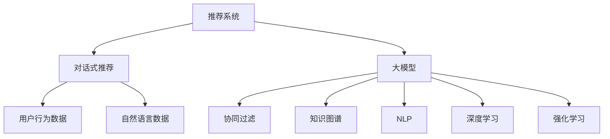

                 

# 大模型在推荐系统中的对话式交互应用

> 关键词：推荐系统, 对话式交互, 大模型, 协同过滤, 自然语言处理, 知识图谱, 深度学习, 强化学习

## 1. 背景介绍

### 1.1 问题由来

随着互联网的普及和电子商务的兴起，推荐系统在商品推荐、内容推荐、广告推荐等领域得到了广泛应用。传统的推荐算法如协同过滤、基于内容的推荐等，在处理大规模数据和个性化推荐时存在一定局限。随着深度学习和大模型的发展，基于用户行为数据和物品属性的推荐方法已经取得了很大的进展。但是，如何更好地理解用户的真实需求和兴趣，并在推荐过程中实现更为自然的交互，仍是一个重要的研究方向。

对话式推荐系统作为一种新兴的推荐方式，能够通过与用户的自然语言交互，获取用户的即时需求，从而提供更加精准和个性化的推荐服务。然而，在对话式推荐系统中，如何利用大模型来处理复杂的自然语言交互，并结合用户行为数据实现个性化推荐，是一个重要挑战。

## 2. 核心概念与联系

### 2.1 核心概念概述

为了更好地理解大模型在对话式推荐系统中的应用，本节将介绍几个密切相关的核心概念：

- 推荐系统(Recommendation System)：通过分析用户行为和物品属性，推荐用户可能感兴趣的商品、内容或服务。
- 对话式推荐(Conversational Recommendation)：通过与用户的自然语言交互，获取即时需求，实现个性化推荐。
- 大模型(Large Model)：以自回归(如GPT)或自编码(如BERT)模型为代表的大规模预训练语言模型。通过在大规模无标签文本语料上进行预训练，学习通用的语言表示，具备强大的语言理解和生成能力。
- 协同过滤(Collaborative Filtering)：一种基于用户行为和物品属性的推荐方法，通过相似度计算和矩阵分解，找到与用户兴趣相近的用户或物品，从而进行推荐。
- 知识图谱(Knowledge Graph)：结构化的语义图谱，用于描述实体、属性和关系，是推荐系统中的一种重要数据源。
- 自然语言处理(NLP)：涉及语言理解、语言生成、文本分类、信息抽取等技术的自然语言处理，是对话式推荐系统中的重要工具。
- 深度学习(Deep Learning)：以神经网络为代表的深度学习技术，用于处理大规模数据和复杂任务，是推荐系统中广泛应用的技术手段。
- 强化学习(Reinforcement Learning)：通过与环境的交互，学习最优决策策略，是推荐系统中的一种重要算法。

这些核心概念之间的逻辑关系可以通过以下Mermaid流程图来展示：



这个流程图展示了大模型在推荐系统中的核心概念及其之间的关系：

1. 推荐系统通过用户行为数据和物品属性，生成推荐列表。
2. 对话式推荐系统通过与用户自然语言交互，获取即时需求，实现个性化推荐。
3. 大模型通过预训练，学习通用的语言表示，提供强大的语言理解和生成能力。
4. 协同过滤利用用户行为数据和物品属性，通过相似度计算和矩阵分解，找到相似用户或物品，进行推荐。
5. 知识图谱作为推荐系统中的重要数据源，用于描述实体、属性和关系。
6. NLP技术用于处理自然语言数据，是大模型在推荐系统中的重要应用。
7. 深度学习技术用于处理大规模数据和复杂任务，是推荐系统中的主流技术手段。
8. 强化学习通过与环境的交互，学习最优决策策略，是推荐系统中的重要算法。

这些概念共同构成了对话式推荐系统的工作框架，使得大模型能够更好地处理复杂的自然语言交互，并结合用户行为数据实现个性化推荐。

## 3. 核心算法原理 & 具体操作步骤

### 3.1 算法原理概述

对话式推荐系统利用大模型处理自然语言交互，通过与用户的即时对话，获取用户的即时需求，从而实现个性化推荐。其核心思想是：将推荐过程视为一种对话过程，通过与用户的自然语言交互，获取用户的即时需求，然后根据用户需求和物品属性进行推荐。

形式化地，假设推荐系统包含用户集合 $U$、物品集合 $I$ 和用户行为数据集 $D$。假设对话式推荐系统的模型为 $M_{\theta}$，其中 $\theta$ 为模型参数。对话式推荐系统的目标是通过与用户对话，生成推荐结果，使得推荐结果尽可能满足用户的即时需求。

对话式推荐系统的输入为自然语言文本，输出为推荐结果。其目标函数定义为：

$$
\mathcal{L}(M_{\theta}, D) = \sum_{i=1}^N \ell_i(M_{\theta}(x_i),y_i)
$$

其中 $x_i$ 为用户的第 $i$ 个自然语言输入，$y_i$ 为对应的推荐结果。$\ell_i$ 为损失函数，用于衡量模型输出的推荐结果与用户真实需求之间的差异。

通过梯度下降等优化算法，对话式推荐系统不断更新模型参数 $\theta$，最小化损失函数 $\mathcal{L}$，使得模型输出尽可能符合用户需求。由于 $\theta$ 已经通过预训练获得了较好的初始化，因此即便在少量用户对话数据上，对话式推荐系统也能较快收敛到理想的模型参数 $\hat{\theta}$。

### 3.2 算法步骤详解

对话式推荐系统的大模型微调一般包括以下几个关键步骤：

**Step 1: 准备预训练模型和对话数据**
- 选择合适的预训练语言模型 $M_{\theta}$ 作为初始化参数，如 GPT、BERT 等。
- 准备对话式推荐系统所需的用户行为数据集 $D$ 和自然语言对话数据集，划分为训练集、验证集和测试集。

**Step 2: 添加任务适配层**
- 根据对话式推荐任务类型，在预训练模型顶层设计合适的输出层和损失函数。
- 对于推荐任务，通常使用softmax分类器输出概率分布，并以交叉熵损失函数。
- 对于对话任务，通常使用语言模型的解码器输出概率分布，并以负对数似然为损失函数。

**Step 3: 设置微调超参数**
- 选择合适的优化算法及其参数，如 AdamW、SGD 等，设置学习率、批大小、迭代轮数等。
- 设置正则化技术及强度，包括权重衰减、Dropout、Early Stopping 等。
- 确定冻结预训练参数的策略，如仅微调顶层，或全部参数都参与微调。

**Step 4: 执行对话交互和推荐**
- 通过用户行为数据和自然语言数据生成对话文本，输入到微调后的模型 $M_{\hat{\theta}}$。
- 模型输出推荐结果，包括物品列表、评分等。
- 根据用户反馈，更新对话文本，重新输入模型，循环迭代直至满足预设条件。

**Step 5: 测试和部署**
- 在测试集上评估微调后模型 $M_{\hat{\theta}}$ 的性能，对比微调前后的精度提升。
- 使用微调后的模型对新用户进行对话推荐，集成到实际的应用系统中。
- 持续收集新的用户行为数据和自然语言对话数据，定期重新微调模型，以适应数据分布的变化。

以上是对话式推荐系统的大模型微调的一般流程。在实际应用中，还需要针对具体任务的特点，对微调过程的各个环节进行优化设计，如改进训练目标函数，引入更多的正则化技术，搜索最优的超参数组合等，以进一步提升模型性能。

### 3.3 算法优缺点

对话式推荐系统利用大模型处理自然语言交互，具有以下优点：
1. 能够处理复杂的自然语言交互，获取用户的即时需求，实现个性化推荐。
2. 通过对话形式，能够实时获取用户反馈，动态调整推荐结果，提升推荐质量。
3. 可以利用大模型已有的语言理解能力，避免从头训练复杂的自然语言处理模型。
4. 能够快速响应用户的即时需求，提供即时的个性化服务。

同时，该方法也存在一定的局限性：
1. 对话数据的获取成本较高，需要大量人工标注。
2. 对话模型需要同时处理语言理解和推荐两个任务，增加了复杂度。
3. 对话模型需要大量的对话数据和计算资源，训练成本较高。
4. 对话模型的泛化能力较差，难以泛化到新的场景和领域。

尽管存在这些局限性，但就目前而言，对话式推荐系统仍然是大模型在推荐领域的一个重要应用范式。未来相关研究的重点在于如何进一步降低对话数据的获取成本，提高模型的泛化能力，同时兼顾可解释性和伦理安全性等因素。

### 3.4 算法应用领域

对话式推荐系统利用大模型的语言处理能力，在以下领域得到了广泛应用：

- 电商推荐：通过与用户的即时对话，获取用户的即时需求，提供个性化推荐。
- 内容推荐：根据用户即时对话内容，推荐新闻、视频、音乐等个性化内容。
- 搜索推荐：通过与用户的即时对话，快速定位用户需求，提供搜索结果。
- 客服推荐：通过对话获取用户需求，推荐相应的解决方案，提升客户满意度。
- 金融推荐：根据用户即时对话内容，推荐股票、基金等金融产品。

除了上述这些经典任务外，对话式推荐系统还被创新性地应用到更多场景中，如健康推荐、旅游推荐、社交推荐等，为推荐系统带来了新的突破。随着预训练模型和微调方法的不断进步，相信对话式推荐系统将会在更广阔的应用领域大放异彩。

## 4. 数学模型和公式 & 详细讲解  
### 4.1 数学模型构建

本节将使用数学语言对对话式推荐系统的大模型微调过程进行更加严格的刻画。

假设用户对话系统包含用户集合 $U$、物品集合 $I$ 和用户行为数据集 $D$。定义对话式推荐系统的模型为 $M_{\theta}$，其中 $\theta$ 为模型参数。

对话式推荐系统的目标是通过与用户对话，生成推荐结果，使得推荐结果尽可能满足用户的即时需求。目标函数定义为：

$$
\mathcal{L}(M_{\theta}, D) = \sum_{i=1}^N \ell_i(M_{\theta}(x_i),y_i)
$$

其中 $x_i$ 为用户的第 $i$ 个自然语言输入，$y_i$ 为对应的推荐结果。$\ell_i$ 为损失函数，用于衡量模型输出的推荐结果与用户真实需求之间的差异。

根据任务类型，$\ell_i$ 可以是交叉熵损失函数、均方误差损失函数、F1损失函数等。假设 $\ell_i$ 为交叉熵损失函数，则有：

$$
\ell_i(M_{\theta}(x_i),y_i) = -y_i \log M_{\theta}(x_i)
$$

其中 $y_i$ 为推荐结果，$M_{\theta}(x_i)$ 为模型输出。

通过梯度下降等优化算法，对话式推荐系统不断更新模型参数 $\theta$，最小化损失函数 $\mathcal{L}$，使得模型输出尽可能符合用户需求。由于 $\theta$ 已经通过预训练获得了较好的初始化，因此即便在少量用户对话数据上，对话式推荐系统也能较快收敛到理想的模型参数 $\hat{\theta}$。

### 4.2 公式推导过程

以下我们以二分类任务为例，推导交叉熵损失函数及其梯度的计算公式。

假设用户对话系统包含用户集合 $U$、物品集合 $I$ 和用户行为数据集 $D$。定义对话式推荐系统的模型为 $M_{\theta}$，其中 $\theta$ 为模型参数。

假设用户输入的自然语言文本为 $x_i$，对应的推荐结果为 $y_i$，模型输出的预测结果为 $\hat{y}_i$。假设 $\ell_i$ 为交叉熵损失函数，则有：

$$
\ell_i(M_{\theta}(x_i),y_i) = -y_i \log \hat{y}_i
$$

将上述公式代入目标函数，得：

$$
\mathcal{L}(M_{\theta}, D) = -\sum_{i=1}^N y_i \log M_{\theta}(x_i)
$$

根据链式法则，损失函数对模型参数 $\theta$ 的梯度为：

$$
\frac{\partial \mathcal{L}(M_{\theta}, D)}{\partial \theta} = \sum_{i=1}^N \frac{\partial \ell_i(M_{\theta}(x_i),y_i)}{\partial \theta}
$$

其中 $\frac{\partial \ell_i(M_{\theta}(x_i),y_i)}{\partial \theta}$ 可进一步递归展开，利用自动微分技术完成计算。

在得到损失函数的梯度后，即可带入优化算法，完成模型的迭代优化。重复上述过程直至收敛，最终得到适应对话式推荐任务的最优模型参数 $\hat{\theta}$。

## 5. 项目实践：代码实例和详细解释说明
### 5.1 开发环境搭建

在进行对话式推荐系统的大模型微调实践前，我们需要准备好开发环境。以下是使用Python进行PyTorch开发的环境配置流程：

1. 安装Anaconda：从官网下载并安装Anaconda，用于创建独立的Python环境。

2. 创建并激活虚拟环境：
```bash
conda create -n pytorch-env python=3.8 
conda activate pytorch-env
```

3. 安装PyTorch：根据CUDA版本，从官网获取对应的安装命令。例如：
```bash
conda install pytorch torchvision torchaudio cudatoolkit=11.1 -c pytorch -c conda-forge
```

4. 安装Transformers库：
```bash
pip install transformers
```

5. 安装各类工具包：
```bash
pip install numpy pandas scikit-learn matplotlib tqdm jupyter notebook ipython
```

完成上述步骤后，即可在`pytorch-env`环境中开始微调实践。

### 5.2 源代码详细实现

下面我们以电商推荐任务为例，给出使用Transformers库对GPT模型进行微调的PyTorch代码实现。

首先，定义电商推荐任务的数据处理函数：

```python
from transformers import GPTForSequenceClassification, GPTTokenizer
from torch.utils.data import Dataset
import torch

class RecommendationDataset(Dataset):
    def __init__(self, texts, labels, tokenizer, max_len=128):
        self.texts = texts
        self.labels = labels
        self.tokenizer = tokenizer
        self.max_len = max_len
        
    def __len__(self):
        return len(self.texts)
    
    def __getitem__(self, item):
        text = self.texts[item]
        label = self.labels[item]
        
        encoding = self.tokenizer(text, return_tensors='pt', max_length=self.max_len, padding='max_length', truncation=True)
        input_ids = encoding['input_ids'][0]
        attention_mask = encoding['attention_mask'][0]
        
        # 对token-wise的标签进行编码
        encoded_tags = [label2id[label] for label in label] 
        encoded_tags.extend([label2id['O']] * (self.max_len - len(encoded_tags)))
        labels = torch.tensor(encoded_tags, dtype=torch.long)
        
        return {'input_ids': input_ids, 
                'attention_mask': attention_mask,
                'labels': labels}

# 标签与id的映射
label2id = {'0': 0, '1': 1, '2': 2, '3': 3}
id2label = {v: k for k, v in label2id.items()}

# 创建dataset
tokenizer = GPTTokenizer.from_pretrained('gpt2-medium')

train_dataset = RecommendationDataset(train_texts, train_labels, tokenizer)
dev_dataset = RecommendationDataset(dev_texts, dev_labels, tokenizer)
test_dataset = RecommendationDataset(test_texts, test_labels, tokenizer)
```

然后，定义模型和优化器：

```python
from transformers import AdamW

model = GPTForSequenceClassification.from_pretrained('gpt2-medium', num_labels=len(label2id))

optimizer = AdamW(model.parameters(), lr=2e-5)
```

接着，定义训练和评估函数：

```python
from torch.utils.data import DataLoader
from tqdm import tqdm
from sklearn.metrics import classification_report

device = torch.device('cuda') if torch.cuda.is_available() else torch.device('cpu')
model.to(device)

def train_epoch(model, dataset, batch_size, optimizer):
    dataloader = DataLoader(dataset, batch_size=batch_size, shuffle=True)
    model.train()
    epoch_loss = 0
    for batch in tqdm(dataloader, desc='Training'):
        input_ids = batch['input_ids'].to(device)
        attention_mask = batch['attention_mask'].to(device)
        labels = batch['labels'].to(device)
        model.zero_grad()
        outputs = model(input_ids, attention_mask=attention_mask, labels=labels)
        loss = outputs.loss
        epoch_loss += loss.item()
        loss.backward()
        optimizer.step()
    return epoch_loss / len(dataloader)

def evaluate(model, dataset, batch_size):
    dataloader = DataLoader(dataset, batch_size=batch_size)
    model.eval()
    preds, labels = [], []
    with torch.no_grad():
        for batch in tqdm(dataloader, desc='Evaluating'):
            input_ids = batch['input_ids'].to(device)
            attention_mask = batch['attention_mask'].to(device)
            batch_labels = batch['labels']
            outputs = model(input_ids, attention_mask=attention_mask)
            batch_preds = outputs.logits.argmax(dim=2).to('cpu').tolist()
            batch_labels = batch_labels.to('cpu').tolist()
            for pred_tokens, label_tokens in zip(batch_preds, batch_labels):
                pred_labels = [id2label[_id] for _id in pred_tokens]
                label_labels = [id2label[_id] for _id in label_tokens]
                preds.append(pred_labels[:len(label_labels)])
                labels.append(label_labels)
                
    print(classification_report(labels, preds))
```

最后，启动训练流程并在测试集上评估：

```python
epochs = 5
batch_size = 16

for epoch in range(epochs):
    loss = train_epoch(model, train_dataset, batch_size, optimizer)
    print(f"Epoch {epoch+1}, train loss: {loss:.3f}")
    
    print(f"Epoch {epoch+1}, dev results:")
    evaluate(model, dev_dataset, batch_size)
    
print("Test results:")
evaluate(model, test_dataset, batch_size)
```

以上就是使用PyTorch对GPT进行电商推荐任务微调的完整代码实现。可以看到，得益于Transformers库的强大封装，我们可以用相对简洁的代码完成GPT模型的加载和微调。

### 5.3 代码解读与分析

让我们再详细解读一下关键代码的实现细节：

**RecommendationDataset类**：
- `__init__`方法：初始化文本、标签、分词器等关键组件。
- `__len__`方法：返回数据集的样本数量。
- `__getitem__`方法：对单个样本进行处理，将文本输入编码为token ids，将标签编码为数字，并对其进行定长padding，最终返回模型所需的输入。

**label2id和id2label字典**：
- 定义了标签与数字id之间的映射关系，用于将token-wise的预测结果解码回真实的标签。

**训练和评估函数**：
- 使用PyTorch的DataLoader对数据集进行批次化加载，供模型训练和推理使用。
- 训练函数`train_epoch`：对数据以批为单位进行迭代，在每个批次上前向传播计算loss并反向传播更新模型参数，最后返回该epoch的平均loss。
- 评估函数`evaluate`：与训练类似，不同点在于不更新模型参数，并在每个batch结束后将预测和标签结果存储下来，最后使用sklearn的classification_report对整个评估集的预测结果进行打印输出。

**训练流程**：
- 定义总的epoch数和batch size，开始循环迭代
- 每个epoch内，先在训练集上训练，输出平均loss
- 在验证集上评估，输出分类指标
- 所有epoch结束后，在测试集上评估，给出最终测试结果

可以看到，PyTorch配合Transformers库使得GPT微调的代码实现变得简洁高效。开发者可以将更多精力放在数据处理、模型改进等高层逻辑上，而不必过多关注底层的实现细节。

当然，工业级的系统实现还需考虑更多因素，如模型的保存和部署、超参数的自动搜索、更灵活的任务适配层等。但核心的微调范式基本与此类似。

## 6. 实际应用场景
### 6.1 电商推荐系统

对话式推荐系统在电商推荐中的应用，可以显著提升用户购物体验。通过与用户的即时对话，电商推荐系统能够实时获取用户需求，并根据即时需求推荐商品，从而提高推荐的精准度和个性化程度。

在技术实现上，可以收集用户浏览、点击、评价等行为数据，结合用户的即时对话内容，对预训练模型进行微调，使其能够根据对话内容生成推荐结果。在推荐过程中，可以通过实时交互获取用户反馈，动态调整推荐策略，从而实现更高效的个性化推荐。

### 6.2 内容推荐系统

对话式推荐系统在内容推荐中的应用，可以提供更加自然流畅的推荐方式。通过与用户的即时对话，内容推荐系统能够实时了解用户兴趣，并根据即时需求推荐相应的内容，从而提高内容的点击率和用户满意度。

在技术实现上，可以收集用户浏览、阅读、点赞等行为数据，结合用户的即时对话内容，对预训练模型进行微调，使其能够根据对话内容生成推荐结果。在推荐过程中，可以通过实时交互获取用户反馈，动态调整推荐策略，从而实现更高效的个性化推荐。

### 6.3 搜索推荐系统

对话式推荐系统在搜索推荐中的应用，可以显著提升搜索效果。通过与用户的即时对话，搜索推荐系统能够实时了解用户查询意图，并根据即时需求提供搜索结果，从而提高搜索的准确性和用户体验。

在技术实现上，可以收集用户搜索关键词、历史行为数据等，结合用户的即时对话内容，对预训练模型进行微调，使其能够根据对话内容生成搜索结果。在推荐过程中，可以通过实时交互获取用户反馈，动态调整搜索策略，从而实现更高效的个性化搜索。

### 6.4 客服推荐系统

对话式推荐系统在客服推荐中的应用，可以显著提升客户服务效率。通过与用户的即时对话，客服推荐系统能够实时了解用户需求，并根据即时需求推荐相应的解决方案，从而提高客户满意度。

在技术实现上，可以收集用户咨询、投诉等行为数据，结合用户的即时对话内容，对预训练模型进行微调，使其能够根据对话内容生成推荐结果。在推荐过程中，可以通过实时交互获取用户反馈，动态调整推荐策略，从而实现更高效的个性化客服。

### 6.5 未来应用展望

随着对话式推荐系统和大模型技术的不断发展，其在更多领域的应用前景值得期待：

1. 医疗推荐系统：通过与患者的即时对话，了解其健康状况和需求，推荐相应的医疗方案和药品，从而提高医疗服务的精准度和个性化程度。
2. 旅游推荐系统：通过与用户的即时对话，了解其旅游需求和偏好，推荐相应的旅游路线和景点，从而提高旅游体验的满意度和愉悦感。
3. 社交推荐系统：通过与用户的即时对话，了解其社交兴趣和需求，推荐相应的社交内容和用户，从而提高社交平台的活跃度和用户黏性。
4. 金融推荐系统：通过与用户的即时对话，了解其金融需求和风险承受能力，推荐相应的金融产品和服务，从而提高金融服务的精准度和个性化程度。
5. 教育推荐系统：通过与学生的即时对话，了解其学习需求和兴趣，推荐相应的学习资源和课程，从而提高学习的效率和效果。

总之，对话式推荐系统在大模型中的应用，能够更好地理解用户的即时需求，实现更加精准和个性化的推荐服务，提升用户体验和满意度。随着大模型技术的不断进步，对话式推荐系统必将在更多领域大放异彩。

## 7. 工具和资源推荐
### 7.1 学习资源推荐

为了帮助开发者系统掌握对话式推荐系统和大模型的理论基础和实践技巧，这里推荐一些优质的学习资源：

1. 《Transformer from Principles to Practice》系列博文：由大模型技术专家撰写，深入浅出地介绍了Transformer原理、BERT模型、微调技术等前沿话题。

2. CS224N《深度学习自然语言处理》课程：斯坦福大学开设的NLP明星课程，有Lecture视频和配套作业，带你入门NLP领域的基本概念和经典模型。

3. 《Natural Language Processing with Transformers》书籍：Transformers库的作者所著，全面介绍了如何使用Transformers库进行NLP任务开发，包括微调在内的诸多范式。

4. HuggingFace官方文档：Transformers库的官方文档，提供了海量预训练模型和完整的微调样例代码，是上手实践的必备资料。

5. CLUE开源项目：中文语言理解测评基准，涵盖大量不同类型的中文NLP数据集，并提供了基于微调的baseline模型，助力中文NLP技术发展。

通过对这些资源的学习实践，相信你一定能够快速掌握对话式推荐系统和大模型的精髓，并用于解决实际的NLP问题。
###  7.2 开发工具推荐

高效的开发离不开优秀的工具支持。以下是几款用于对话式推荐系统和大模型微调开发的常用工具：

1. PyTorch：基于Python的开源深度学习框架，灵活动态的计算图，适合快速迭代研究。大部分预训练语言模型都有PyTorch版本的实现。

2. TensorFlow：由Google主导开发的开源深度学习框架，生产部署方便，适合大规模工程应用。同样有丰富的预训练语言模型资源。

3. Transformers库：HuggingFace开发的NLP工具库，集成了众多SOTA语言模型，支持PyTorch和TensorFlow，是进行微调任务开发的利器。

4. Weights & Biases：模型训练的实验跟踪工具，可以记录和可视化模型训练过程中的各项指标，方便对比和调优。与主流深度学习框架无缝集成。

5. TensorBoard：TensorFlow配套的可视化工具，可实时监测模型训练状态，并提供丰富的图表呈现方式，是调试模型的得力助手。

6. Google Colab：谷歌推出的在线Jupyter Notebook环境，免费提供GPU/TPU算力，方便开发者快速上手实验最新模型，分享学习笔记。

合理利用这些工具，可以显著提升对话式推荐系统和大模型微调任务的开发效率，加快创新迭代的步伐。

### 7.3 相关论文推荐

对话式推荐系统和大模型的发展源于学界的持续研究。以下是几篇奠基性的相关论文，推荐阅读：

1. Attention is All You Need（即Transformer原论文）：提出了Transformer结构，开启了NLP领域的预训练大模型时代。

2. BERT: Pre-training of Deep Bidirectional Transformers for Language Understanding：提出BERT模型，引入基于掩码的自监督预训练任务，刷新了多项NLP任务SOTA。

3. Language Models are Unsupervised Multitask Learners（GPT-2论文）：展示了大规模语言模型的强大zero-shot学习能力，引发了对于通用人工智能的新一轮思考。

4. Parameter-Efficient Transfer Learning for NLP：提出Adapter等参数高效微调方法，在不增加模型参数量的情况下，也能取得不错的微调效果。

5. Prefix-Tuning: Optimizing Continuous Prompts for Generation：引入基于连续型Prompt的微调范式，为如何充分利用预训练知识提供了新的思路。

6. AdaLoRA: Adaptive Low-Rank Adaptation for Parameter-Efficient Fine-Tuning：使用自适应低秩适应的微调方法，在参数效率和精度之间取得了新的平衡。

这些论文代表了大模型微调技术的发展脉络。通过学习这些前沿成果，可以帮助研究者把握学科前进方向，激发更多的创新灵感。

## 8. 总结：未来发展趋势与挑战

### 8.1 总结

本文对对话式推荐系统在大模型中的应用进行了全面系统的介绍。首先阐述了对话式推荐系统的研究背景和意义，明确了对话式推荐系统在个性化推荐中的独特价值。其次，从原理到实践，详细讲解了对话式推荐系统的数学原理和关键步骤，给出了对话式推荐系统开发的完整代码实例。同时，本文还广泛探讨了对话式推荐系统在大模型中的应用场景，展示了对话式推荐系统的巨大潜力。此外，本文精选了对话式推荐系统的各类学习资源，力求为读者提供全方位的技术指引。

通过本文的系统梳理，可以看到，对话式推荐系统在大模型中的应用前景广阔，能够更好地理解用户的即时需求，实现更加精准和个性化的推荐服务。对话式推荐系统通过与用户的即时对话，获取用户的即时需求，从而实现个性化推荐，提升用户体验和满意度。随着大模型技术的不断进步，对话式推荐系统必将在更多领域大放异彩，为推荐系统带来新的突破。

### 8.2 未来发展趋势

展望未来，对话式推荐系统在大模型中的应用将呈现以下几个发展趋势：

1. 模型规模持续增大。随着算力成本的下降和数据规模的扩张，大模型的参数量还将持续增长。超大规模语言模型蕴含的丰富语言知识，有望支撑更加复杂多变的下游任务微调。

2. 微调方法日趋多样。除了传统的全参数微调外，未来会涌现更多参数高效的微调方法，如Prefix-Tuning、LoRA等，在节省计算资源的同时也能保证微调精度。

3. 持续学习成为常态。随着数据分布的不断变化，对话式推荐系统也需要持续学习新知识以保持性能。如何在不遗忘原有知识的同时，高效吸收新样本信息，将成为重要的研究课题。

4. 标注样本需求降低。受启发于提示学习(Prompt-based Learning)的思路，未来的对话式推荐系统将更好地利用大模型的语言理解能力，通过更加巧妙的任务描述，在更少的标注样本上也能实现理想的微调效果。

5. 对话系统集成化。未来的对话系统将更加集成化，实现更加自然流畅的用户交互。对话式推荐系统将与搜索、客服、广告等其他系统集成，形成一体化的智能平台。

6. 跨领域迁移能力增强。对话式推荐系统将能够跨越不同领域和场景，实现更加泛化的推荐效果。

以上趋势凸显了对话式推荐系统和大模型应用的广阔前景。这些方向的探索发展，必将进一步提升对话式推荐系统的性能和应用范围，为推荐系统带来新的突破。

### 8.3 面临的挑战

尽管对话式推荐系统在大模型中的应用已经取得了显著进展，但在迈向更加智能化、普适化应用的过程中，它仍面临诸多挑战：

1. 标注成本瓶颈。尽管对话数据的标注成本较低，但对话系统需要大量的对话数据和计算资源，训练成本较高。如何降低对话数据的标注成本，提高对话系统的泛化能力，还需要更多理论和实践的积累。

2. 对话系统复杂度提高。对话式推荐系统需要同时处理语言理解和推荐两个任务，增加了复杂度。如何设计高效的对话系统架构，减少计算资源消耗，提升推荐效果，是需要解决的重要问题。

3. 系统稳定性需要保障。对话式推荐系统需要在实时对话中实现稳定的推荐效果，避免误推荐。如何设计健壮的系统架构，确保系统的鲁棒性和稳定性，是未来研究的重要方向。

4. 用户隐私保护。对话式推荐系统需要处理用户的个人信息，如何保障用户隐私安全，防止信息泄露，是需要解决的重要问题。

5. 算法可解释性不足。对话式推荐系统通常被认为是"黑盒"系统，难以解释其内部工作机制和决策逻辑。如何提高算法的可解释性，增强用户信任，是未来研究的重要方向。

尽管存在这些挑战，但对话式推荐系统和大模型的应用前景广阔，需要更多的创新和实践，方能在推荐系统中发挥更大的作用。

### 8.4 研究展望

面对对话式推荐系统和大模型所面临的挑战，未来的研究需要在以下几个方面寻求新的突破：

1. 探索无监督和半监督微调方法。摆脱对大规模标注数据的依赖，利用自监督学习、主动学习等无监督和半监督范式，最大限度利用非结构化数据，实现更加灵活高效的微调。

2. 研究参数高效和计算高效的微调范式。开发更加参数高效的微调方法，在固定大部分预训练参数的同时，只更新极少量的任务相关参数。同时优化微调模型的计算图，减少前向传播和反向传播的资源消耗，实现更加轻量级、实时性的部署。

3. 融合因果和对比学习范式。通过引入因果推断和对比学习思想，增强对话系统建立稳定因果关系的能力，学习更加普适、鲁棒的语言表征，从而提升模型泛化性和抗干扰能力。

4. 引入更多先验知识。将符号化的先验知识，如知识图谱、逻辑规则等，与神经网络模型进行巧妙融合，引导微调过程学习更准确、合理的语言模型。同时加强不同模态数据的整合，实现视觉、语音等多模态信息与文本信息的协同建模。

5. 结合因果分析和博弈论工具。将因果分析方法引入微调模型，识别出模型决策的关键特征，增强输出解释的因果性和逻辑性。借助博弈论工具刻画人机交互过程，主动探索并规避模型的脆弱点，提高系统稳定性。

6. 纳入伦理道德约束。在模型训练目标中引入伦理导向的评估指标，过滤和惩罚有偏见、有害的输出倾向。同时加强人工干预和审核，建立模型行为的监管机制，确保输出符合人类价值观和伦理道德。

这些研究方向的探索，必将引领对话式推荐系统和大模型微调技术迈向更高的台阶，为构建安全、可靠、可解释、可控的智能系统铺平道路。面向未来，对话式推荐系统和大模型技术还需要与其他人工智能技术进行更深入的融合，如知识表示、因果推理、强化学习等，多路径协同发力，共同推动自然语言理解和智能交互系统的进步。只有勇于创新、敢于突破，才能不断拓展语言模型的边界，让智能技术更好地造福人类社会。

## 9. 附录：常见问题与解答

**Q1：对话式推荐系统是否适用于所有NLP任务？**

A: 对话式推荐系统在大模型中的应用，主要用于处理自然语言交互的任务。对于数据量较小的任务，如情感分析、实体识别等，可以考虑使用传统的推荐方法。但对于需要实时获取用户即时需求的场景，如电商推荐、内容推荐等，对话式推荐系统能够更好地满足需求。

**Q2：微调过程中如何选择合适的学习率？**

A: 微调的学习率一般要比预训练时小1-2个数量级，如果使用过大的学习率，容易破坏预训练权重，导致过拟合。一般建议从1e-5开始调参，逐步减小学习率，直至收敛。也可以使用warmup策略，在开始阶段使用较小的学习率，再逐渐过渡到预设值。需要注意的是，不同的优化器(如AdamW、Adafactor等)以及不同的学习率调度策略，可能需要设置不同的学习率阈值。

**Q3：采用大模型微调时会面临哪些资源瓶颈？**

A: 目前主流的预训练大模型动辄以亿计的参数规模，对算力、内存、存储都提出了很高的要求。GPU/TPU等高性能设备是必不可少的，但即便如此，超大批次的训练和推理也可能遇到显存不足的问题。因此需要采用一些资源优化技术，如梯度积累、混合精度训练、模型并行等，来突破硬件瓶颈。同时，模型的存储和读取也可能占用大量时间和空间，需要采用模型压缩、稀疏化存储等方法进行优化。

**Q4：如何缓解微调过程中的过拟合问题？**

A: 过拟合是微调面临的主要挑战，尤其是在标注数据不足的情况下。常见的缓解策略包括：
1. 数据增强：通过回译、近义替换等方式扩充训练集
2. 正则化：使用L2正则、Dropout、Early Stopping等避免过拟合
3. 对抗训练：引入对抗样本，提高模型鲁棒性
4. 参数高效微调：只调整少量参数(如Adapter、Prefix等)，减小过拟合风险
5. 多模型集成：训练多个微调模型，取平均输出，抑制过拟合

这些策略往往需要根据具体任务和数据特点进行灵活组合。只有在数据、模型、训练、推理等各环节进行全面优化，才能最大限度地发挥大模型微调的威力。

**Q5：微调模型在落地部署时需要注意哪些问题？**

A: 将微调模型转化为实际应用，还需要考虑以下因素：
1. 模型裁剪：去除不必要的层和参数，减小模型尺寸，加快推理速度
2. 量化加速：将浮点模型转为定点模型，压缩存储空间，提高计算效率
3. 服务化封装：将模型封装为标准化服务接口，便于集成调用
4. 弹性伸缩：根据请求流量动态调整资源配置，平衡服务质量和成本
5. 监控告警：实时采集系统指标，设置异常告警阈值，确保服务稳定性
6. 安全防护：采用访问鉴权、数据脱敏等措施，保障数据和模型安全

大模型微调为NLP应用开启了广阔的想象空间，但如何将强大的性能转化为稳定、高效、安全的业务价值，还需要工程实践的不断打磨。唯有从数据、算法、工程、业务等多个维度协同发力，才能真正实现人工智能技术在垂直行业的规模化落地。总之，微调需要开发者根据具体任务，不断迭代和优化模型、数据和算法，方能得到理想的效果。

---

作者：禅与计算机程序设计艺术 / Zen and the Art of Computer Programming

