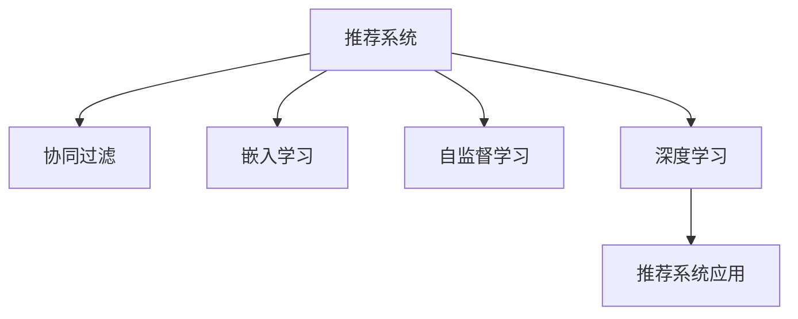

                 

# 大模型在推荐系统中的自监督学习应用

> 关键词：大模型,自监督学习,推荐系统,协同过滤,嵌入学习,MLP,数据增强,深度学习,推荐系统应用

## 1. 背景介绍

### 1.1 问题由来

推荐系统（Recommendation System）是互联网时代的重要技术之一，广泛应用于电商、社交、新闻、视频等多个领域。推荐系统通过分析用户的行为数据（如点击、浏览、购买等），推荐符合用户兴趣的个性化内容，提升用户满意度和转化率。传统的推荐算法以协同过滤（Collaborative Filtering）为代表，依赖于用户-物品评分矩阵，但在用户行为稀疏、评分矩阵维度高等问题上，表现并不理想。

近年来，基于深度学习的大模型推荐技术迅速发展，成为推荐系统的新兴范式。大模型通过预训练获得强大的数据表示能力，在推荐任务上表现出较强的泛化性能。特别是在大规模推荐数据集上，大模型的表现往往优于传统协同过滤算法。但大模型的训练和推理成本较高，如何在大规模推荐场景中高效应用大模型，成为亟待解决的问题。

## 2. 核心概念与联系

### 2.1 核心概念概述

为更好地理解大模型在推荐系统中的应用，本节将介绍几个密切相关的核心概念：

- 推荐系统（Recommendation System）：通过算法推荐用户感兴趣的内容，包括商品、新闻、视频等，提升用户满意度。
- 协同过滤（Collaborative Filtering）：基于用户行为矩阵，预测用户对未评分项的评分，推荐符合用户兴趣的内容。
- 嵌入学习（Embedding Learning）：将用户、物品等对象映射到低维空间中的向量表示，实现更高效、准确的推荐。
- 自监督学习（Self-supervised Learning）：利用无需标注的数据进行学习，挖掘数据中的隐含规律和结构。
- 深度学习（Deep Learning）：通过多层次神经网络模型，学习复杂的数据表示。
- 推荐系统应用：在电商、社交、新闻、视频等多个领域，通过推荐系统为用户提供个性化内容，提升用户体验和满意度。

这些核心概念之间的逻辑关系可以通过以下Mermaid流程图来展示：



这个流程图展示了大模型推荐系统的核心概念及其之间的关系：

1. 推荐系统通过协同过滤、嵌入学习、自监督学习和深度学习等多种技术进行推荐。
2. 协同过滤基于用户行为矩阵进行推荐，但用户行为数据稀疏，存在冷启动问题。
3. 嵌入学习将用户、物品等对象映射到低维空间中的向量表示，提升推荐精度。
4. 自监督学习利用无需标注的数据进行学习，挖掘数据中的隐含规律。
5. 深度学习通过多层次神经网络模型，学习复杂的数据表示。

这些概念共同构成了大模型推荐系统的技术框架，使其能够在各种推荐场景中发挥强大的能力。

## 3. 核心算法原理 & 具体操作步骤

### 3.1 算法原理概述

大模型在推荐系统中的应用，本质上是一种基于自监督学习的深度推荐方法。其核心思想是：通过预训练大模型，学习到丰富的数据表示，然后利用自监督学习任务挖掘数据中的隐含结构，最终在推荐任务上进行微调，获得高质量的推荐结果。

形式化地，假设预训练模型为 $M_{\theta}$，其中 $\theta$ 为预训练得到的模型参数。给定推荐数据集 $D=\{(x_i,y_i)\}_{i=1}^N$，推荐系统的优化目标是最小化预测误差，即找到最优参数：

$$
\theta^* = \mathop{\arg\min}_{\theta} \mathcal{L}(M_{\theta},D)
$$

其中 $\mathcal{L}$ 为针对推荐任务设计的损失函数，用于衡量模型预测输出与真实标签之间的差异。常见的损失函数包括交叉熵损失、均方误差损失等。

通过梯度下降等优化算法，推荐过程不断更新模型参数 $\theta$，最小化损失函数 $\mathcal{L}$，使得模型输出逼近真实标签。由于 $\theta$ 已经通过预训练获得了较好的初始化，因此即便在大规模推荐数据集上微调，也能较快收敛到理想的模型参数 $\hat{\theta}$。

### 3.2 算法步骤详解

大模型在推荐系统中的应用，一般包括以下几个关键步骤：

**Step 1: 准备预训练模型和数据集**
- 选择合适的预训练语言模型 $M_{\theta}$ 作为初始化参数，如 BERT、GPT 等。
- 准备推荐数据集 $D$，划分为训练集、验证集和测试集。一般要求推荐数据与预训练数据的分布不要差异过大。

**Step 2: 设计自监督学习任务**
- 选择合适的自监督学习任务，如 masked language modeling、next sentence prediction 等。
- 将数据集划分为训练集和验证集，标注部分数据集作为监督任务，其余数据集作为自监督任务。
- 使用预训练模型在自监督数据上微调，保留预训练权重，仅微调顶层部分参数。

**Step 3: 添加推荐任务适配层**
- 根据推荐任务类型，在预训练模型顶层设计合适的输出层和损失函数。
- 对于评分任务，通常在顶层添加线性回归层和均方误差损失函数。
- 对于推荐任务，通常使用交叉熵损失函数。

**Step 4: 设置微调超参数**
- 选择合适的优化算法及其参数，如 AdamW、SGD 等，设置学习率、批大小、迭代轮数等。
- 设置正则化技术及强度，包括权重衰减、Dropout、Early Stopping 等。
- 确定冻结预训练参数的策略，如仅微调顶层，或全部参数都参与微调。

**Step 5: 执行梯度训练**
- 将推荐集数据分批次输入模型，前向传播计算损失函数。
- 反向传播计算参数梯度，根据设定的优化算法和学习率更新模型参数。
- 周期性在验证集上评估模型性能，根据性能指标决定是否触发 Early Stopping。
- 重复上述步骤直到满足预设的迭代轮数或 Early Stopping 条件。

**Step 6: 测试和部署**
- 在测试集上评估微调后模型 $M_{\hat{\theta}}$ 的性能，对比微调前后的精度提升。
- 使用微调后的模型对新样本进行推荐，集成到实际的应用系统中。
- 持续收集新的数据，定期重新微调模型，以适应数据分布的变化。

以上是基于自监督学习的大模型推荐系统的一般流程。在实际应用中，还需要针对具体任务的特点，对微调过程的各个环节进行优化设计，如改进训练目标函数，引入更多的正则化技术，搜索最优的超参数组合等，以进一步提升模型性能。

### 3.3 算法优缺点

大模型在推荐系统中的应用，具有以下优点：
1. 学习能力强。大模型能够自动挖掘数据中的隐含结构和规律，学习到更丰富的数据表示。
2. 泛化能力强。大模型在推荐任务上表现出较强的泛化性能，能够适应多样化的数据分布。
3. 无需标注数据。自监督学习方式不需要标注数据，降低了推荐系统的开发成本。
4. 可扩展性好。大模型能够轻松扩展到多模态数据推荐，如图像、视频等。

同时，该方法也存在一定的局限性：
1. 数据要求高。尽管自监督学习无需标注数据，但推荐数据集必须具备足够的数据量和多样性，否则模型无法充分学习。
2. 计算资源需求高。大模型的训练和推理成本较高，需要高性能的硬件设备和大量计算资源。
3. 训练时间长。大模型的训练时间较长，模型微调需要耗费大量时间。
4. 结果可解释性不足。推荐系统属于"黑盒"系统，难以解释模型的决策过程和推荐依据。
5. 容易产生偏差。预训练模型的固有偏见可能通过微调传递到推荐任务，导致推荐结果不平衡。

尽管存在这些局限性，但就目前而言，基于大模型的推荐方法在许多推荐系统中的应用效果显著，成为推荐系统研究的新方向。

### 3.4 算法应用领域

基于大模型的推荐系统，已经在电商、社交、新闻、视频等多个领域得到广泛应用，取得了显著的成效：

- 电商推荐：通过分析用户浏览、购买历史，为用户推荐商品，提升转化率。
- 新闻推荐：根据用户阅读历史，推荐符合用户兴趣的新闻，提高用户留存率。
- 视频推荐：根据用户观看历史，推荐用户可能感兴趣的视频内容，提升观看时长。
- 社交推荐：分析用户社交网络关系，推荐用户可能感兴趣的朋友和内容。
- 广告推荐：根据用户行为数据，推荐符合用户兴趣的广告，提升广告点击率。

除了上述这些经典任务外，大模型推荐技术还被创新性地应用到更多场景中，如智能交通、金融风控、健康医疗等，为推荐系统带来了新的突破。随着预训练模型和推荐技术的不断进步，相信推荐系统必将在更多领域得到应用，为各行各业的发展注入新的动力。

## 4. 数学模型和公式 & 详细讲解  
### 4.1 数学模型构建

本节将使用数学语言对基于自监督学习的大模型推荐系统进行更加严格的刻画。

记预训练语言模型为 $M_{\theta}$，其中 $\theta$ 为模型参数。假设推荐数据集为 $D=\{(x_i,y_i)\}_{i=1}^N$，其中 $x_i$ 为输入数据，$y_i$ 为推荐标签。

定义模型 $M_{\theta}$ 在输入 $x_i$ 上的预测输出为 $\hat{y}_i=M_{\theta}(x_i)$，推荐任务的损失函数为：

$$
\mathcal{L}(\theta) = \frac{1}{N}\sum_{i=1}^N \mathcal{L}_{task}(\hat{y}_i,y_i)
$$

其中 $\mathcal{L}_{task}(\hat{y}_i,y_i)$ 为针对推荐任务设计的损失函数，如均方误差损失、交叉熵损失等。

在大模型的预训练过程中，可以利用自监督学习任务进行微调，如 masked language modeling、next sentence prediction 等。在微调过程中，保留预训练权重，仅微调顶层部分参数。假设微调任务的损失函数为 $\mathcal{L}_{task}$，则微调的优化目标为：

$$
\theta^* = \mathop{\arg\min}_{\theta} \mathcal{L}_{task}(\theta)
$$

在得到微调损失函数后，即可带入参数更新公式，完成模型的迭代优化。重复上述过程直至收敛，最终得到适应推荐任务的最优模型参数 $\theta^*$。

### 4.2 公式推导过程

以下我们以评分推荐任务为例，推导均方误差损失函数及其梯度的计算公式。

假设模型 $M_{\theta}$ 在输入 $x_i$ 上的预测输出为 $\hat{y}_i=M_{\theta}(x_i)$，推荐标签为 $y_i$。则均方误差损失函数定义为：

$$
\mathcal{L}(\theta) = \frac{1}{N}\sum_{i=1}^N (\hat{y}_i - y_i)^2
$$

将其代入模型损失函数，得：

$$
\mathcal{L}(\theta) = \frac{1}{N}\sum_{i=1}^N \mathcal{L}_{task}(\hat{y}_i,y_i)
$$

根据链式法则，损失函数对参数 $\theta_k$ 的梯度为：

$$
\frac{\partial \mathcal{L}(\theta)}{\partial \theta_k} = \frac{1}{N}\sum_{i=1}^N 2(\hat{y}_i - y_i) \frac{\partial \hat{y}_i}{\partial \theta_k}
$$

其中 $\frac{\partial \hat{y}_i}{\partial \theta_k}$ 可进一步递归展开，利用自动微分技术完成计算。

在得到损失函数的梯度后，即可带入参数更新公式，完成模型的迭代优化。重复上述过程直至收敛，最终得到适应推荐任务的最优模型参数 $\theta^*$。

## 5. 项目实践：代码实例和详细解释说明
### 5.1 开发环境搭建

在进行推荐系统开发前，我们需要准备好开发环境。以下是使用Python进行PyTorch开发的环境配置流程：

1. 安装Anaconda：从官网下载并安装Anaconda，用于创建独立的Python环境。

2. 创建并激活虚拟环境：
```bash
conda create -n pytorch-env python=3.8 
conda activate pytorch-env
```

3. 安装PyTorch：根据CUDA版本，从官网获取对应的安装命令。例如：
```bash
conda install pytorch torchvision torchaudio cudatoolkit=11.1 -c pytorch -c conda-forge
```

4. 安装Transformers库：
```bash
pip install transformers
```

5. 安装各类工具包：
```bash
pip install numpy pandas scikit-learn matplotlib tqdm jupyter notebook ipython
```

完成上述步骤后，即可在`pytorch-env`环境中开始推荐系统开发。

### 5.2 源代码详细实现

下面我们以评分推荐任务为例，给出使用Transformers库对BERT模型进行评分推荐微调的PyTorch代码实现。

首先，定义评分推荐任务的训练函数：

```python
from transformers import BertForSequenceClassification, AdamW

model = BertForSequenceClassification.from_pretrained('bert-base-cased', num_labels=2)

optimizer = AdamW(model.parameters(), lr=2e-5)

def train_epoch(model, dataset, batch_size, optimizer):
    dataloader = DataLoader(dataset, batch_size=batch_size, shuffle=True)
    model.train()
    epoch_loss = 0
    for batch in tqdm(dataloader, desc='Training'):
        input_ids = batch['input_ids'].to(device)
        attention_mask = batch['attention_mask'].to(device)
        labels = batch['labels'].to(device)
        model.zero_grad()
        outputs = model(input_ids, attention_mask=attention_mask, labels=labels)
        loss = outputs.loss
        epoch_loss += loss.item()
        loss.backward()
        optimizer.step()
    return epoch_loss / len(dataloader)
```

然后，定义推荐任务的数据处理函数：

```python
from transformers import BertTokenizer
from torch.utils.data import Dataset

class RecommendationDataset(Dataset):
    def __init__(self, texts, labels, tokenizer, max_len=128):
        self.texts = texts
        self.labels = labels
        self.tokenizer = tokenizer
        self.max_len = max_len
        
    def __len__(self):
        return len(self.texts)
    
    def __getitem__(self, item):
        text = self.texts[item]
        label = self.labels[item]
        
        encoding = self.tokenizer(text, return_tensors='pt', max_length=self.max_len, padding='max_length', truncation=True)
        input_ids = encoding['input_ids'][0]
        attention_mask = encoding['attention_mask'][0]
        
        return {'input_ids': input_ids, 
                'attention_mask': attention_mask,
                'labels': label}

tokenizer = BertTokenizer.from_pretrained('bert-base-cased')

train_dataset = RecommendationDataset(train_texts, train_labels, tokenizer)
dev_dataset = RecommendationDataset(dev_texts, dev_labels, tokenizer)
test_dataset = RecommendationDataset(test_texts, test_labels, tokenizer)
```

接着，定义推荐任务评测函数：

```python
from sklearn.metrics import mean_squared_error

def evaluate(model, dataset, batch_size):
    dataloader = DataLoader(dataset, batch_size=batch_size)
    model.eval()
    mse = 0
    with torch.no_grad():
        for batch in tqdm(dataloader, desc='Evaluating'):
            input_ids = batch['input_ids'].to(device)
            attention_mask = batch['attention_mask'].to(device)
            batch_labels = batch['labels']
            outputs = model(input_ids, attention_mask=attention_mask)
            mse += mean_squared_error(batch_labels.to(device), outputs.logits)
    return mse / len(dataset)
```

最后，启动训练流程并在测试集上评估：

```python
epochs = 5
batch_size = 16

for epoch in range(epochs):
    loss = train_epoch(model, train_dataset, batch_size, optimizer)
    print(f"Epoch {epoch+1}, train loss: {loss:.3f}")
    
    print(f"Epoch {epoch+1}, dev results:")
    mse_dev = evaluate(model, dev_dataset, batch_size)
    print(f"Dev MSE: {mse_dev:.3f}")
    
print("Test results:")
mse_test = evaluate(model, test_dataset, batch_size)
print(f"Test MSE: {mse_test:.3f}")
```

以上就是使用PyTorch对BERT进行评分推荐任务微调的完整代码实现。可以看到，得益于Transformers库的强大封装，我们可以用相对简洁的代码完成BERT模型的加载和微调。

### 5.3 代码解读与分析

让我们再详细解读一下关键代码的实现细节：

**RecommendationDataset类**：
- `__init__`方法：初始化文本、标签、分词器等关键组件。
- `__len__`方法：返回数据集的样本数量。
- `__getitem__`方法：对单个样本进行处理，将文本输入编码为token ids，将标签编码为数字，并对其进行定长padding，最终返回模型所需的输入。

**tokenizer和dataset的初始化**：
- 使用BertTokenizer初始化分词器，方便对文本进行分词和编码。
- 定义RecommendationDataset类，处理推荐数据集，将文本和标签编码为模型输入。

**训练和评估函数**：
- 使用PyTorch的DataLoader对数据集进行批次化加载，供模型训练和推理使用。
- 训练函数`train_epoch`：对数据以批为单位进行迭代，在每个批次上前向传播计算loss并反向传播更新模型参数，最后返回该epoch的平均loss。
- 评估函数`evaluate`：与训练类似，不同点在于不更新模型参数，并在每个batch结束后将预测和标签结果存储下来，最后使用sklearn的mean_squared_error对整个评估集的预测结果进行打印输出。

**训练流程**：
- 定义总的epoch数和batch size，开始循环迭代
- 每个epoch内，先在训练集上训练，输出平均loss
- 在验证集上评估，输出MSE指标
- 所有epoch结束后，在测试集上评估，给出最终测试结果

可以看到，PyTorch配合Transformers库使得BERT微调的代码实现变得简洁高效。开发者可以将更多精力放在数据处理、模型改进等高层逻辑上，而不必过多关注底层的实现细节。

当然，工业级的系统实现还需考虑更多因素，如模型的保存和部署、超参数的自动搜索、更灵活的任务适配层等。但核心的微调范式基本与此类似。

## 6. 实际应用场景

### 6.1 电商推荐

基于大模型的电商推荐系统，能够分析用户浏览、购买历史，为用户推荐符合其兴趣的商品，提升用户体验和购买转化率。

在技术实现上，可以收集用户历史行为数据，包括浏览、点击、购买、评分等行为，将这些数据构建成监督数据集。在此基础上对预训练BERT模型进行微调，使其能够根据用户行为预测用户对商品的评分。在生成推荐列表时，先用候选商品的描述作为输入，由模型预测用户对商品的评分，再结合其他特征综合排序，便可以得到个性化程度更高的推荐结果。

### 6.2 新闻推荐

新闻推荐系统通过分析用户阅读历史，为用户推荐符合其兴趣的新闻内容，提高用户留存率和新闻浏览量。

在实践中，可以收集用户阅读的新闻标题、摘要、评论等数据，将文本内容作为模型输入，用户的后续行为（如是否点击、阅读、点赞等）作为监督信号，在此基础上微调预训练语言模型。微调后的模型能够从文本内容中准确把握用户的兴趣点。在生成推荐列表时，先用候选新闻的标题作为输入，由模型预测用户的兴趣匹配度，再结合其他特征综合排序，便可以得到个性化的新闻推荐结果。

### 6.3 视频推荐

视频推荐系统通过分析用户观看历史，为用户推荐符合其兴趣的视频内容，提高用户观看时长和满意度。

在实践中，可以收集用户观看历史数据，包括观看时间、观看频率、视频评分等行为，将这些数据构建成监督数据集。在此基础上对预训练BERT模型进行微调，使其能够根据用户观看历史预测用户对视频的评分。在生成推荐列表时，先用候选视频的标题、描述作为输入，由模型预测用户对视频的评分，再结合其他特征综合排序，便可以得到个性化程度更高的视频推荐结果。

### 6.4 社交推荐

社交推荐系统通过分析用户社交网络关系，为用户推荐可能感兴趣的朋友和内容，提高用户互动和满意度。

在实践中，可以收集用户社交网络数据，包括好友关系、关注对象、点赞评论等行为，将这些数据构建成监督数据集。在此基础上对预训练BERT模型进行微调，使其能够根据用户社交关系预测用户对好友和内容的兴趣。在生成推荐列表时，先用候选好友或内容的描述作为输入，由模型预测用户对好友或内容的兴趣匹配度，再结合其他特征综合排序，便可以得到个性化的社交推荐结果。

### 6.5 广告推荐

广告推荐系统通过分析用户行为数据，推荐符合用户兴趣的广告，提高广告点击率和转化率。

在实践中，可以收集用户浏览、点击、购买等行为数据，将广告文本作为模型输入，用户的后续行为（如点击、购买等）作为监督信号，在此基础上微调预训练语言模型。微调后的模型能够从广告文本中准确把握用户的兴趣点。在生成推荐列表时，先用候选广告的标题作为输入，由模型预测用户的兴趣匹配度，再结合其他特征综合排序，便可以得到个性化的广告推荐结果。

### 6.6 音乐推荐

音乐推荐系统通过分析用户听歌历史，为用户推荐符合其兴趣的音乐内容，提高用户满意度。

在实践中，可以收集用户听歌历史数据，包括听歌时间、歌曲评分等行为，将这些数据构建成监督数据集。在此基础上对预训练BERT模型进行微调，使其能够根据用户听歌历史预测用户对歌曲的评分。在生成推荐列表时，先用候选歌曲的标题作为输入，由模型预测用户对歌曲的评分，再结合其他特征综合排序，便可以得到个性化程度更高的音乐推荐结果。

## 7. 工具和资源推荐

### 7.1 学习资源推荐

为了帮助开发者系统掌握大模型在推荐系统中的应用理论基础和实践技巧，这里推荐一些优质的学习资源：

1. 《Transformers从原理到实践》系列博文：由大模型技术专家撰写，深入浅出地介绍了Transformer原理、BERT模型、推荐系统范式等前沿话题。

2. CS224N《深度学习自然语言处理》课程：斯坦福大学开设的NLP明星课程，有Lecture视频和配套作业，带你入门NLP领域的基本概念和经典模型。

3. 《Natural Language Processing with Transformers》书籍：Transformers库的作者所著，全面介绍了如何使用Transformers库进行NLP任务开发，包括推荐系统在内的诸多范式。

4. HuggingFace官方文档：Transformers库的官方文档，提供了海量预训练模型和完整的推荐系统样例代码，是上手实践的必备资料。

5. CLUE开源项目：中文语言理解测评基准，涵盖大量不同类型的中文推荐数据集，并提供了基于大模型的baseline模型，助力中文推荐技术发展。

通过对这些资源的学习实践，相信你一定能够快速掌握大模型在推荐系统中的应用精髓，并用于解决实际的推荐问题。

### 7.2 开发工具推荐

高效的开发离不开优秀的工具支持。以下是几款用于大模型推荐系统开发的常用工具：

1. PyTorch：基于Python的开源深度学习框架，灵活动态的计算图，适合快速迭代研究。大部分推荐模型都有PyTorch版本的实现。

2. TensorFlow：由Google主导开发的开源深度学习框架，生产部署方便，适合大规模工程应用。同样有丰富的推荐模型资源。

3. Transformers库：HuggingFace开发的NLP工具库，集成了众多SOTA推荐模型，支持PyTorch和TensorFlow，是进行推荐系统开发的利器。

4. Weights & Biases：模型训练的实验跟踪工具，可以记录和可视化模型训练过程中的各项指标，方便对比和调优。与主流深度学习框架无缝集成。

5. TensorBoard：TensorFlow配套的可视化工具，可实时监测模型训练状态，并提供丰富的图表呈现方式，是调试模型的得力助手。

6. Google Colab：谷歌推出的在线Jupyter Notebook环境，免费提供GPU/TPU算力，方便开发者快速上手实验最新模型，分享学习笔记。

合理利用这些工具，可以显著提升大模型推荐系统的开发效率，加快创新迭代的步伐。

### 7.3 相关论文推荐

大模型在推荐系统中的应用源于学界的持续研究。以下是几篇奠基性的相关论文，推荐阅读：

1. Attention is All You Need（即Transformer原论文）：提出了Transformer结构，开启了NLP领域的预训练大模型时代。

2. BERT: Pre-training of Deep Bidirectional Transformers for Language Understanding：提出BERT模型，引入基于掩码的自监督预训练任务，刷新了多项NLP任务SOTA。

3. Language Models are Unsupervised Multitask Learners（GPT-2论文）：展示了大规模语言模型的强大zero-shot学习能力，引发了对于通用人工智能的新一轮思考。

4. Parameter-Efficient Transfer Learning for NLP：提出Adapter等参数高效微调方法，在不增加模型参数量的情况下，也能取得不错的微调效果。

5. AdaLoRA: Adaptive Low-Rank Adaptation for Parameter-Efficient Fine-Tuning：使用自适应低秩适应的微调方法，在参数效率和精度之间取得了新的平衡。

6. Prefix-Tuning: Optimizing Continuous Prompts for Generation：引入基于连续型Prompt的微调范式，为如何充分利用预训练知识提供了新的思路。

这些论文代表了大模型在推荐系统中的应用发展脉络。通过学习这些前沿成果，可以帮助研究者把握学科前进方向，激发更多的创新灵感。

## 8. 总结：未来发展趋势与挑战

### 8.1 总结

本文对基于自监督学习的大模型推荐系统方法进行了全面系统的介绍。首先阐述了大模型和推荐系统研究的背景和意义，明确了大模型在推荐任务上的独特价值。其次，从原理到实践，详细讲解了推荐系统的数学模型和核心步骤，给出了推荐任务开发的完整代码实例。同时，本文还广泛探讨了大模型在电商、新闻、视频、社交等多个领域的应用前景，展示了自监督学习在推荐系统中的应用潜力。此外，本文精选了推荐技术的各类学习资源，力求为读者提供全方位的技术指引。

通过本文的系统梳理，可以看到，基于大模型的推荐系统正在成为推荐系统的重要范式，极大地拓展了推荐模型的应用边界，催生了更多的落地场景。受益于大规模语料的预训练，推荐模型在推荐任务上表现出较强的泛化性能，能够适应多样化的数据分布。未来，伴随预训练模型和推荐技术的不断进步，相信推荐系统必将在更多领域得到应用，为各行各业的发展注入新的动力。

### 8.2 未来发展趋势

展望未来，大模型在推荐系统中的应用将呈现以下几个发展趋势：

1. 模型规模持续增大。随着算力成本的下降和数据规模的扩张，预训练模型和推荐模型的参数量还将持续增长。超大规模语言模型蕴含的丰富语言知识，有望支撑更加复杂多变的推荐任务。

2. 推荐算法多样化。除了传统的协同过滤外，未来会涌现更多推荐算法，如基于深度学习的推荐、基于知识图谱的推荐、基于生成模型的推荐等，以适应更多复杂多变的推荐场景。

3. 推荐系统智能化。大模型的应用不仅局限于推荐算法，还可以应用于用户画像建模、推荐结果解释、推荐行为预测等各个环节，提升推荐系统的智能化水平。

4. 推荐系统个性化。大模型能够根据用户行为和偏好，生成更精准、多样化的推荐结果，提升用户体验和满意度。

5. 推荐系统透明化。推荐系统的决策过程和推荐依据将变得更加透明，用户可以更加清楚地了解推荐系统的逻辑和依据，提升用户信任度。

6. 推荐系统可控化。推荐系统将能够根据用户的反馈，动态调整推荐策略，更加精准地满足用户需求。

以上趋势凸显了大模型推荐系统的广阔前景。这些方向的探索发展，必将进一步提升推荐系统的性能和应用范围，为各行各业的发展注入新的动力。

### 8.3 面临的挑战

尽管大模型在推荐系统中的应用已经取得了显著成效，但在迈向更加智能化、普适化应用的过程中，仍面临诸多挑战：

1. 数据要求高。尽管自监督学习无需标注数据，但推荐数据集必须具备足够的数据量和多样性，否则模型无法充分学习。如何获取高质量的推荐数据，降低推荐系统的开发成本，将是重要研究方向。

2. 计算资源需求高。大模型的训练和推理成本较高，需要高性能的硬件设备和大量计算资源。如何优化模型结构和计算图，提升推荐系统的实时性和效率，将是重要研究方向。

3. 结果可解释性不足。推荐系统属于"黑盒"系统，难以解释模型的决策过程和推荐依据。如何赋予推荐系统更强的可解释性，增强用户信任度，将是重要研究方向。

4. 容易产生偏差。预训练模型的固有偏见可能通过微调传递到推荐任务，导致推荐结果不平衡。如何从数据和算法层面消除模型偏见，避免恶意用途，确保推荐的公平性和安全性，将是重要研究方向。

5. 推荐系统稳定性不足。推荐系统在面对新数据时，容易出现较大的性能波动，难以适应数据分布的变化。如何提升推荐系统的鲁棒性，增强模型的泛化能力，将是重要研究方向。

6. 推荐系统集成难度高。推荐系统需要将多个模块进行高效集成，如数据处理、特征提取、模型训练、结果生成等环节，如何提高推荐系统的集成效率，降低开发成本，将是重要研究方向。

尽管存在这些挑战，但伴随着预训练模型和推荐技术的不断进步，未来推荐系统必将在更多领域得到应用，为各行各业的发展注入新的动力。相信随着学界和产业界的共同努力，这些挑战终将一一被克服，大模型推荐系统必将在构建智慧推荐生态中扮演越来越重要的角色。

### 8.4 研究展望

未来，大模型在推荐系统中的应用将进一步深化和拓展。以下几个方向将是研究的热点：

1. 推荐模型的自监督学习。如何设计更加有效的自监督学习任务，挖掘数据中的隐含结构，提升推荐模型的泛化能力和性能，将是重要研究方向。

2. 推荐模型的参数高效微调。如何优化推荐模型的计算图和微调策略，提升模型参数效率和计算效率，将是重要研究方向。

3. 推荐模型的多模态融合。如何将文本、图像、音频等多种模态信息进行融合，提升推荐模型的多模态融合能力，将是重要研究方向。

4. 推荐模型的知识图谱应用。如何将知识图谱中的结构化信息与推荐模型进行融合，提升推荐模型的知识获取和推理能力，将是重要研究方向。

5. 推荐模型的因果推理。如何引入因果推理方法，提升推荐系统的公平性和透明性，将是重要研究方向。

6. 推荐模型的伦理和隐私保护。如何在推荐系统中引入伦理和隐私保护机制，确保推荐系统的安全和公平，将是重要研究方向。

这些研究方向的探索，必将引领大模型推荐系统向更加智能化、透明化、可控化的方向发展，为推荐系统技术带来新的突破。只有勇于创新、敢于突破，才能不断拓展推荐系统的边界，为各行各业的发展注入新的动力。

## 9. 附录：常见问题与解答

**Q1：大模型推荐系统是否适用于所有推荐场景？**

A: 大模型推荐系统在大多数推荐场景上都能取得不错的效果，特别是对于数据量较大的任务。但对于一些特定领域的任务，如医学、法律等，仅依靠通用语料预训练的模型可能难以很好地适应。此时需要在特定领域语料上进一步预训练，再进行微调，才能获得理想效果。此外，对于一些需要时效性、个性化很强的任务，如对话推荐、实时推荐等，大模型推荐系统也需要针对性的改进优化。

**Q2：微调过程中如何选择合适的学习率？**

A: 微调的学习率一般要比预训练时小1-2个数量级，如果使用过大的学习率，容易破坏预训练权重，导致过拟合。一般建议从1e-5开始调参，逐步减小学习率，直至收敛。也可以使用warmup策略，在开始阶段使用较小的学习率，再逐渐过渡到预设值。需要注意的是，不同的优化器(如AdamW、Adafactor等)以及不同的学习率调度策略，可能需要设置不同的学习率阈值。

**Q3：采用大模型推荐时会面临哪些资源瓶颈？**

A: 目前主流的预训练大模型动辄以亿计的参数规模，对算力、内存、存储都提出了很高的要求。GPU/TPU等高性能设备是必不可少的，但即便如此，超大批次的训练和推理也可能遇到显存不足的问题。因此需要采用一些资源优化技术，如梯度积累、混合精度训练、模型并行等，来突破硬件瓶颈。同时，模型的存储和读取也可能占用大量时间和空间，需要采用模型压缩、稀疏化存储等方法进行优化。

**Q4：如何缓解微调过程中的过拟合问题？**

A: 过拟合是微调面临的主要挑战，尤其是在标注数据不足的情况下。常见的缓解策略包括：
1. 数据增强：通过回译、近义替换等方式扩充训练集
2. 正则化：使用L2正则、Dropout、Early Stopping等避免过拟合
3. 对抗训练：引入对抗样本，提高模型鲁棒性
4. 参数高效微调：只调整少量参数(如Adapter、Prefix等)，减小过拟合风险
5. 多模型集成：训练多个微调模型，取平均输出，抑制过拟合

这些策略往往需要根据具体任务和数据特点进行灵活组合。只有在数据、模型、训练、推理等各环节进行全面优化，才能最大限度地发挥大模型推荐系统的威力。

**Q5：推荐系统在落地部署时需要注意哪些问题？**

A: 将大模型推荐系统转化为实际应用，还需要考虑以下因素：
1. 模型裁剪：去除不必要的层和参数，减小模型尺寸，加快推理速度
2. 量化加速：将浮点模型转为定点模型，压缩存储空间，提高计算效率
3. 服务化封装：将模型封装为标准化服务接口，便于集成调用
4. 弹性伸缩：根据请求流量动态调整资源配置，平衡服务质量和成本
5. 监控告警：实时采集系统指标，设置异常告警阈值，确保服务稳定性
6. 安全防护：采用访问鉴权、数据脱敏等措施，保障数据和模型安全

大模型推荐系统为推荐系统带来了新的突破，但如何将强大的性能转化为稳定、高效、安全的业务价值，还需要工程实践的不断打磨。唯有从数据、算法、工程、业务等多个维度协同发力，才能真正实现人工智能技术在推荐系统中的落地应用。总之，微调需要开发者根据具体任务，不断迭代和优化模型、数据和算法，方能得到理想的效果。

---

作者：禅与计算机程序设计艺术 / Zen and the Art of Computer Programming

