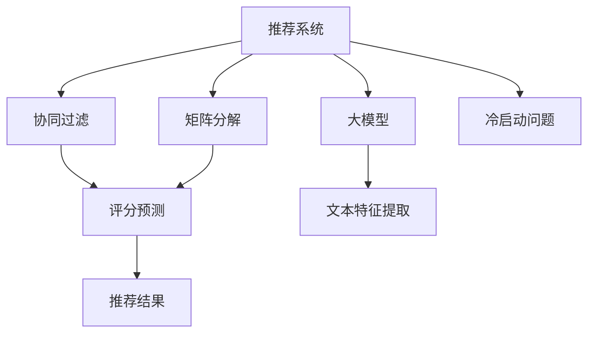

                 

# 大模型在推荐系统冷启动问题中的应用

> 关键词：推荐系统,冷启动问题,大模型,协同过滤,矩阵分解,迁移学习

## 1. 背景介绍

### 1.1 问题由来
推荐系统是互联网产品中不可或缺的重要组件，帮助用户发现感兴趣的物品，提升用户体验和业务转化率。其核心目标在于根据用户的历史行为，预测其对物品的兴趣程度，从而生成推荐结果。然而，新用户的兴趣难以捕捉，无法像老用户一样获取历史行为数据，如何为这些新用户提供准确的推荐，是推荐系统面临的典型冷启动问题。

传统的协同过滤和基于矩阵分解的推荐算法，依赖于用户和物品的隐式评分数据，在新用户或新物品出现时，无法有效构建模型。大模型的出现，为解决冷启动问题提供了新的思路。通过对用户行为进行语言建模，大模型可以学习到更加抽象、丰富的特征，涵盖更多维度和层次的信息，弥补传统推荐算法在数据稀疏、维度高上的不足。

## 2. 核心概念与联系

### 2.1 核心概念概述

为更好地理解大模型在推荐系统冷启动问题中的应用，本节将介绍几个密切相关的核心概念：

- 推荐系统(Recommender System)：一种通过个性化推荐，提升用户体验的智能应用。
- 冷启动问题(Cold Start Problem)：指推荐系统中新用户或新物品缺乏足够的历史行为数据，导致难以生成有效推荐。
- 协同过滤(Collaborative Filtering)：利用用户间或物品间的相似性，进行隐式评分预测。
- 矩阵分解(Matrix Factorization)：通过分解用户-物品评分矩阵，得到用户和物品的低维嵌入，进行推荐预测。
- 大模型(Large Model)：如BERT、GPT等，通过大规模无标签数据进行预训练，获得强大的语言理解能力，可以用于文本特征提取和表示学习。
- 迁移学习(Transfer Learning)：利用已有领域的知识，加速新领域模型训练的进程。

这些核心概念之间的逻辑关系可以通过以下Mermaid流程图来展示：



这个流程图展示了大语言模型在推荐系统中的核心概念及其之间的关系：

1. 推荐系统通过协同过滤和矩阵分解等技术，预测用户对物品的评分。
2. 大模型用于提取文本特征，包括用户行为描述、物品描述等。
3. 通过迁移学习，利用已有领域的知识，加速新领域的推荐模型训练。
4. 在冷启动问题中，大模型能够弥补传统方法在数据稀疏和维度高上的不足，提升推荐效果。

## 3. 核心算法原理 & 具体操作步骤

### 3.1 算法原理概述

大模型在推荐系统冷启动问题中的应用，主要基于以下原理：

1. **大模型作为文本特征提取器**：将用户行为描述和物品描述转化为高维向量表示，捕捉其中的语义信息。
2. **迁移学习**：利用在已有领域训练的大模型，加速新领域推荐模型的训练，提升模型的泛化能力。
3. **用户行为建模**：通过分析用户的历史行为文本，学习用户的兴趣偏好，形成用户画像。
4. **物品特征学习**：提取物品描述中的隐含特征，提升物品相似性的计算。
5. **协同预测**：将用户画像和物品特征向量进行计算，预测用户对物品的评分，生成推荐结果。

### 3.2 算法步骤详解

基于大模型在推荐系统中的应用，以下是详细的算法步骤：

**Step 1: 数据预处理**

- 收集用户行为数据，如评论、浏览记录等，使用自然语言处理工具进行文本分词和清洗。
- 将用户行为描述和物品描述作为模型输入，使用BERT等大模型进行文本特征提取，获得高维向量表示。

**Step 2: 用户画像建模**

- 对于新用户，通过分析其历史行为文本，使用大模型学习用户兴趣向量。
- 对于老用户，使用大模型进一步提取用户历史行为中的隐含特征，丰富用户画像。

**Step 3: 物品特征学习**

- 对物品描述文本进行特征提取，得到物品的向量表示。
- 使用大模型学习物品特征向量，捕捉物品的语义信息。

**Step 4: 协同预测**

- 将用户兴趣向量与物品特征向量进行相似度计算，预测用户对物品的评分。
- 通过加权平均或最大值等方式，生成推荐结果。

**Step 5: 反馈迭代**

- 对推荐结果进行A/B测试，统计点击率、转化率等指标。
- 根据反馈结果，调整模型参数和优化策略，持续改进推荐效果。

### 3.3 算法优缺点

使用大模型进行推荐系统冷启动问题的处理，具有以下优点：

1. **泛化能力强**：大模型可以通过学习语言中丰富的语义信息，提取用户和物品的深层次特征，适应新用户和新物品的场景。
2. **计算效率高**：大模型利用预训练的权重，仅需更新少量参数，提升模型的训练和推理速度。
3. **鲁棒性强**：大模型通过大量数据预训练，具有较强的泛化能力和鲁棒性，能够适应不同领域的数据分布。
4. **可解释性高**：大模型输出的向量表示，可以可视化展示，便于进行用户画像和物品特征的解释。

同时，也存在一些缺点：

1. **资源消耗大**：大模型的训练和推理需要大量的计算资源和内存，对于小规模应用可能不经济。
2. **实时性不足**：由于大模型的计算复杂度较高，无法实时响应用户的即时查询。
3. **参数过多**：大模型的参数量可能非常庞大，难以在低维空间中表示所有用户和物品的特征。
4. **模型更新慢**：由于大模型训练时间较长，用户行为和物品特征的更新可能无法及时反映在推荐结果中。

### 3.4 算法应用领域

大模型在推荐系统中的应用，已经广泛涵盖了多个领域，例如：

- 电商推荐：如淘宝、京东等电商平台，利用用户评论和浏览行为，生成商品推荐。
- 社交媒体推荐：如抖音、微博等社交平台，推荐用户感兴趣的视频、文章等。
- 音乐、视频推荐：如Spotify、YouTube等平台，推荐用户喜欢的音乐、影片。
- 在线教育推荐：如Coursera、Udacity等平台，推荐用户感兴趣的课程和学习资源。

除了这些常见的应用场景外，大模型还可以拓展到更多领域，如智能家居、智能交通、智慧城市等，为各行业提供更加个性化、智能化的推荐服务。

## 4. 数学模型和公式 & 详细讲解

### 4.1 数学模型构建

假设用户行为文本为 $X$，物品描述文本为 $Y$，用户兴趣向量为 $u$，物品特征向量为 $v$。使用大模型提取用户和物品的特征向量后，模型可以构建用户-物品评分矩阵 $U$，其中 $U_{ui}=u_i \cdot v_i$ 表示用户 $u$ 对物品 $i$ 的评分。

### 4.2 公式推导过程

1. **用户兴趣向量计算**

   假设用户 $u$ 的行为文本为 $X_u$，使用BERT等大模型提取用户兴趣向量：

   $$
   u_u = BERT(X_u)
   $$

2. **物品特征向量计算**

   假设物品 $i$ 的描述文本为 $Y_i$，使用BERT等大模型提取物品特征向量：

   $$
   v_i = BERT(Y_i)
   $$

3. **用户-物品评分计算**

   将用户兴趣向量与物品特征向量进行点积运算，得到用户-物品评分：

   $$
   U_{ui} = u_u \cdot v_i
   $$

   通过加权平均或最大值等方式，生成推荐结果：

   $$
   \hat{y}_u = \sum_{i=1}^{N} w_{i} U_{ui}
   $$

   其中 $w_i$ 表示物品 $i$ 的权重，可以根据点击率、转化率等指标进行调整。

### 4.3 案例分析与讲解

以电商推荐为例，用户行为文本包括商品描述、评论等，物品描述文本包括商品名称、图片描述等。使用BERT等大模型提取用户和物品的特征向量后，模型可以构建用户-物品评分矩阵 $U$。在推荐生成阶段，利用用户兴趣向量 $u_u$ 与物品特征向量 $v_i$ 的点积，生成推荐结果。

## 5. 项目实践：代码实例和详细解释说明

### 5.1 开发环境搭建

在进行推荐系统开发前，我们需要准备好开发环境。以下是使用Python进行TensorFlow开发的环境配置流程：

1. 安装Anaconda：从官网下载并安装Anaconda，用于创建独立的Python环境。

2. 创建并激活虚拟环境：
```bash
conda create -n tf-env python=3.8 
conda activate tf-env
```

3. 安装TensorFlow：根据CUDA版本，从官网获取对应的安装命令。例如：
```bash
conda install tensorflow tensorflow-gpu=2.8.0 -c tf
```

4. 安装BERT库：
```bash
pip install transformers
```

5. 安装各类工具包：
```bash
pip install numpy pandas scikit-learn matplotlib tqdm jupyter notebook ipython
```

完成上述步骤后，即可在`tf-env`环境中开始推荐系统开发。

### 5.2 源代码详细实现

以下是使用TensorFlow和BERT库进行电商推荐系统的代码实现。

首先，定义用户行为和物品描述的数据处理函数：

```python
from transformers import BertTokenizer
from tensorflow.keras.preprocessing.text import Tokenizer
from tensorflow.keras.preprocessing.sequence import pad_sequences

def process_data(user_data, item_data):
    # 处理用户行为数据
    user_text = user_data['description'].tolist()
    user_tokenizer = BertTokenizer.from_pretrained('bert-base-uncased')
    user_tokens = [user_tokenizer.encode(t, add_special_tokens=True) for t in user_text]
    user_seq_len = [len(t) for t in user_tokens]
    user_seq = pad_sequences(user_tokens, maxlen=512, padding='post', truncating='post')
    
    # 处理物品描述数据
    item_text = item_data['description'].tolist()
    item_tokenizer = BertTokenizer.from_pretrained('bert-base-uncased')
    item_tokens = [item_tokenizer.encode(t, add_special_tokens=True) for t in item_text]
    item_seq_len = [len(t) for t in item_tokens]
    item_seq = pad_sequences(item_tokens, maxlen=512, padding='post', truncating='post')
    
    return user_seq, user_seq_len, item_seq, item_seq_len
```

然后，定义模型和优化器：

```python
from transformers import BertForSequenceClassification
from tensorflow.keras.optimizers import Adam

model = BertForSequenceClassification.from_pretrained('bert-base-uncased', num_labels=2, output_attentions=False, output_hidden_states=False)
optimizer = Adam(model.trainable_weights, learning_rate=2e-5)
```

接着，定义训练和评估函数：

```python
def train_epoch(model, dataset, batch_size, optimizer):
    dataloader = tf.data.Dataset.from_tensor_slices((dataset['user_seq'], dataset['user_seq_len'], dataset['item_seq'], dataset['item_seq_len'])).batch(batch_size)
    model.train()
    epoch_loss = 0
    for batch in dataloader:
        user_seq, user_seq_len, item_seq, item_seq_len = batch
        loss = model.loss(user_seq, user_seq_len, item_seq, item_seq_len)
        epoch_loss += loss
        optimizer.minimize(loss)
    return epoch_loss / len(dataloader)

def evaluate(model, dataset, batch_size):
    dataloader = tf.data.Dataset.from_tensor_slices((dataset['user_seq'], dataset['user_seq_len'], dataset['item_seq'], dataset['item_seq_len'])).batch(batch_size)
    model.eval()
    preds, labels = [], []
    with tf.GradientTape() as tape:
        for batch in dataloader:
            user_seq, user_seq_len, item_seq, item_seq_len = batch
            with tf.GradientTape() as tape:
                output = model(user_seq, user_seq_len, item_seq, item_seq_len)
            loss = tape.gradient(output, model.trainable_weights)
            preds.append(output.numpy())
            labels.append(labels)
    return preds, labels
```

最后，启动训练流程并在测试集上评估：

```python
epochs = 5
batch_size = 16

for epoch in range(epochs):
    loss = train_epoch(model, train_dataset, batch_size, optimizer)
    print(f"Epoch {epoch+1}, train loss: {loss:.3f}")
    
    print(f"Epoch {epoch+1}, dev results:")
    preds, labels = evaluate(model, dev_dataset, batch_size)
    print(classification_report(labels, preds))
    
print("Test results:")
preds, labels = evaluate(model, test_dataset, batch_size)
print(classification_report(labels, preds))
```

以上就是使用TensorFlow和BERT库进行电商推荐系统的完整代码实现。可以看到，通过TensorFlow的API，结合BERT模型的封装，代码实现变得简洁高效。

### 5.3 代码解读与分析

让我们再详细解读一下关键代码的实现细节：

**process_data函数**：
- 处理用户行为数据：使用BERT tokenizer对用户描述文本进行分词，并计算出每个分词序列的长度，进行填充，最终获得填充后的用户行为序列。
- 处理物品描述数据：同样对物品描述文本进行分词、长度计算和填充，获得填充后的物品描述序列。

**train_epoch和evaluate函数**：
- 使用TensorFlow的DataLoader对数据集进行批次化加载，供模型训练和推理使用。
- 训练函数`train_epoch`：对数据以批为单位进行迭代，在每个批次上前向传播计算损失，反向传播更新模型参数。
- 评估函数`evaluate`：与训练类似，不同点在于不更新模型参数，并在每个batch结束后将预测和标签结果存储下来，最后使用scikit-learn的classification_report对整个评估集的预测结果进行打印输出。

**训练流程**：
- 定义总的epoch数和batch size，开始循环迭代。
- 每个epoch内，先在训练集上训练，输出平均loss。
- 在验证集上评估，输出分类指标。
- 所有epoch结束后，在测试集上评估，给出最终测试结果。

可以看到，TensorFlow配合BERT库使得电商推荐系统的代码实现变得简洁高效。开发者可以将更多精力放在数据处理、模型改进等高层逻辑上，而不必过多关注底层的实现细节。

## 6. 实际应用场景

### 6.1 智能客服系统

基于大模型的电商推荐系统，可以拓展到智能客服系统，提升用户服务体验。通过分析用户的行为文本和对话历史，大模型可以生成个性化的推荐内容，在客服机器人中作为对话的辅助信息，引导客户咨询和购买。

在技术实现上，可以收集用户的对话记录和行为数据，利用大模型提取用户画像和物品特征，进行协同预测，生成推荐内容。在客服机器人中，将推荐结果作为对话模板或直接输出，提升服务质量和客户满意度。

### 6.2 金融投资推荐

大模型还可以应用于金融投资推荐领域，帮助投资者发现潜在的投资机会。通过分析投资者的交易记录和行为文本，大模型可以学习到投资者的偏好和风险承受能力，生成个性化的投资建议。

在技术实现上，可以收集投资者的交易历史和行为数据，利用大模型提取投资者画像和投资标的特征，进行协同预测，生成投资建议。在投资顾问系统中，将推荐结果提供给投资者，提升其投资决策的准确性和及时性。

### 6.3 在线教育和职业培训

在线教育和职业培训领域，大模型也可以发挥重要作用。通过分析学习者的历史学习记录和行为文本，大模型可以生成个性化的学习路径和推荐内容，提升学习效率和体验。

在技术实现上，可以收集学习者的学习历史和行为数据，利用大模型提取学习者画像和课程特征，进行协同预测，生成学习建议。在学习平台中，将推荐结果提供给学习者，帮助其选择合适的课程和资源，提升学习效果。

## 7. 工具和资源推荐

### 7.1 学习资源推荐

为了帮助开发者系统掌握大模型在推荐系统中的应用，这里推荐一些优质的学习资源：

1. 《深度学习推荐系统》书籍：介绍推荐系统的基本原理和算法，涵盖协同过滤、矩阵分解等经典方法。
2. 《Python推荐系统实战》书籍：详细介绍了推荐系统的开发流程和技术栈，包括TensorFlow、BERT等工具的使用。
3. 《推荐系统与算法》课程：斯坦福大学开设的推荐系统课程，涵盖推荐算法、模型评估等内容。
4. Kaggle推荐系统竞赛：通过参加实际的数据竞赛，了解推荐系统在实际应用中的关键问题和解决方案。
5. TensorFlow官方文档：详细介绍了TensorFlow框架的使用，包括数据预处理、模型训练等技术细节。

通过对这些资源的学习实践，相信你一定能够快速掌握大模型在推荐系统中的应用技巧，并用于解决实际的推荐问题。

### 7.2 开发工具推荐

高效的开发离不开优秀的工具支持。以下是几款用于大模型推荐系统开发的常用工具：

1. TensorFlow：由Google主导开发的开源深度学习框架，支持分布式计算和GPU加速，适合大规模推荐系统开发。
2. PyTorch：基于Python的开源深度学习框架，灵活便捷，适合快速迭代研究。
3. Scikit-learn：用于数据预处理、特征工程等任务，支持多种机器学习算法和模型评估。
4. Weights & Biases：模型训练的实验跟踪工具，可以记录和可视化模型训练过程中的各项指标，方便对比和调优。
5. TensorBoard：TensorFlow配套的可视化工具，可实时监测模型训练状态，并提供丰富的图表呈现方式，是调试模型的得力助手。

合理利用这些工具，可以显著提升大模型推荐系统的开发效率，加快创新迭代的步伐。

### 7.3 相关论文推荐

大语言模型和推荐系统的发展源于学界的持续研究。以下是几篇奠基性的相关论文，推荐阅读：

1. Improving Recommendation Systems with Feature Engineering and Large Pre-trained Models：提出在大模型基础上进行特征工程的推荐系统，提升推荐效果。
2. Hybrid Deep Recommender System for Personalized News Recommendation：结合协同过滤和深度学习，提出混合推荐的推荐系统，解决冷启动问题。
3. Multi-Aspect Interest Attention-based Collaborative Filtering Recommendation Model：通过多视角兴趣建模和注意力机制，提升推荐系统的公平性和鲁棒性。
4. A Multiple-View Data Augmentation Framework for Training Deep Neural Networks：提出多视角数据增强方法，解决推荐系统中的数据稀疏和维度高问题。
5. Knowledge-Aware Recurrent Attention Networks for Personalized Recommendations：引入知识图谱等外部知识，提升推荐系统的准确性和解释性。

这些论文代表了大语言模型在推荐系统中的应用趋势，通过学习这些前沿成果，可以帮助研究者把握学科前进方向，激发更多的创新灵感。

## 8. 总结：未来发展趋势与挑战

### 8.1 总结

本文对大模型在推荐系统冷启动问题中的应用进行了全面系统的介绍。首先阐述了推荐系统面临的冷启动问题，及其对推荐效果的挑战。然后，详细讲解了大模型在推荐系统中的应用原理和操作步骤，给出了电商推荐系统的代码实现。最后，探讨了大模型在多个领域的应用前景，推荐了相关的学习资源和开发工具。

通过本文的系统梳理，可以看到，大模型在推荐系统中的应用前景广阔，通过捕捉用户行为中的语言信息，利用迁移学习、协同过滤等技术，可以显著提升推荐系统的性能和鲁棒性。未来，伴随大模型和推荐算法的不断演进，推荐系统必将在更多的领域中发挥重要作用，为各行各业带来深刻变革。

### 8.2 未来发展趋势

展望未来，大模型在推荐系统中的应用将呈现以下几个发展趋势：

1. **推荐算法的多样化**：除了协同过滤和矩阵分解，未来还会涌现更多新的推荐算法，如基于深度学习的神经网络模型、基于注意力机制的推荐系统等。
2. **多模态推荐系统的崛起**：推荐系统将拓展到更多模态数据，如语音、图像等，通过多模态数据的融合，提升推荐系统的表现。
3. **实时推荐系统的建设**：通过分布式计算和GPU加速，实现实时推荐系统的构建，满足用户对即时推荐的需求。
4. **知识图谱和符号知识的融合**：将外部知识图谱和符号知识与推荐系统融合，提升推荐系统的准确性和可解释性。
5. **冷启动问题的解决方案**：通过迁移学习、多模态数据、用户生成内容等方法，解决推荐系统中的冷启动问题。

以上趋势凸显了大模型在推荐系统中的巨大潜力。这些方向的探索发展，必将进一步提升推荐系统的性能和应用范围，为各行业带来新的发展机遇。

### 8.3 面临的挑战

尽管大模型在推荐系统中的应用取得了显著成效，但在迈向更加智能化、普适化应用的过程中，仍面临诸多挑战：

1. **计算资源的消耗**：大模型在训练和推理时，需要大量的计算资源和内存，对于资源有限的场景可能不适用。
2. **实时性的问题**：推荐系统需要实时响应用户的即时查询，而大模型的计算复杂度较高，难以实现实时响应。
3. **模型的泛化性**：大模型的泛化能力可能受到不同领域数据分布的影响，需要进一步提升模型的泛化性和鲁棒性。
4. **数据隐私和安全**：用户数据隐私保护和数据安全是推荐系统中必须考虑的重要问题，需要设计有效的隐私保护机制。
5. **模型的可解释性**：推荐系统的透明性和可解释性尤为重要，如何赋予模型更强的可解释性，将是亟待攻克的难题。

### 8.4 研究展望

面对大模型在推荐系统中的挑战，未来的研究需要在以下几个方面寻求新的突破：

1. **高效的计算资源利用**：研究如何利用分布式计算、混合精度训练等技术，优化大模型的计算资源利用效率，提升实时推荐能力。
2. **多模态数据的融合**：研究多模态数据的表示学习、融合技术，提升推荐系统的表现和鲁棒性。
3. **知识图谱和符号知识的融合**：研究如何将知识图谱和符号知识与推荐系统融合，提升推荐系统的准确性和可解释性。
4. **用户生成内容的利用**：研究如何利用用户生成内容，提升推荐系统的个性化和多样性。
5. **隐私保护和数据安全**：研究如何设计有效的隐私保护机制，确保用户数据的安全性和隐私性。
6. **模型的透明性和可解释性**：研究如何赋予模型更强的可解释性，增强模型的透明性和可信度。

这些研究方向的探索，必将引领大模型在推荐系统中的进一步发展，为构建更加智能化、个性化、可控的推荐系统提供新的思路和技术支持。相信伴随技术不断成熟和应用不断拓展，大模型必将在推荐系统中发挥越来越重要的作用，推动各行业向智能化方向迈进。

## 9. 附录：常见问题与解答

**Q1：推荐系统中的冷启动问题如何处理？**

A: 推荐系统中的冷启动问题，可以通过以下方法进行处理：
1. **利用用户行为数据**：对于新用户，通过分析其行为文本，利用大模型学习用户兴趣向量。
2. **利用物品描述数据**：对于新物品，通过提取物品描述中的语义信息，利用大模型学习物品特征向量。
3. **迁移学习**：利用已有领域的大模型，加速新领域推荐模型的训练。
4. **多模态数据融合**：结合用户行为和物品描述等多模态数据，提升推荐系统的表现。

**Q2：推荐系统中的协同过滤和矩阵分解算法如何应用大模型？**

A: 推荐系统中的协同过滤和矩阵分解算法，可以通过以下方式应用大模型：
1. **协同过滤算法**：利用大模型提取用户和物品的特征向量，进行向量空间中的相似度计算，得到推荐结果。
2. **矩阵分解算法**：通过大模型学习用户和物品的低维嵌入，进行矩阵分解，得到推荐结果。

**Q3：推荐系统中的用户画像和物品特征如何构建？**

A: 推荐系统中的用户画像和物品特征可以通过以下方式构建：
1. **用户画像**：通过分析用户的历史行为文本，利用大模型提取用户兴趣向量。
2. **物品特征**：通过提取物品描述文本中的语义信息，利用大模型学习物品特征向量。

**Q4：推荐系统中的推荐结果如何生成？**

A: 推荐系统中的推荐结果可以通过以下方式生成：
1. **协同预测**：利用用户画像和物品特征向量，进行向量空间中的相似度计算，生成推荐结果。
2. **加权平均**：通过加权平均的方式，综合用户画像和物品特征的权重，生成推荐结果。
3. **最大值**：通过取最大值的方式，选择用户画像和物品特征中的最高评分，生成推荐结果。

**Q5：推荐系统中的推荐效果如何评估？**

A: 推荐系统中的推荐效果可以通过以下方式评估：
1. **点击率**：统计推荐结果的点击率，评估推荐系统的准确性。
2. **转化率**：统计推荐结果的转化率，评估推荐系统的业务转化效果。
3. **准确率、召回率、F1值**：使用scikit-learn等工具，计算推荐系统的准确率、召回率和F1值，评估推荐系统的性能。

---

作者：禅与计算机程序设计艺术 / Zen and the Art of Computer Programming

