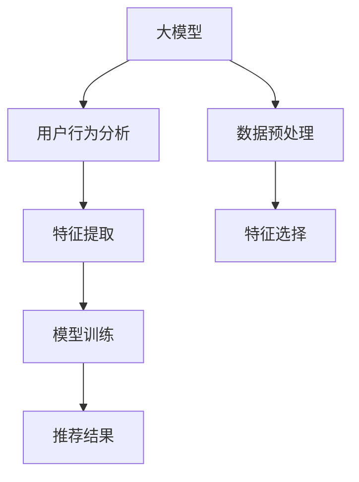

                 

# 大模型在推荐系统特征工程中的应用

> 关键词：大模型, 特征工程, 推荐系统, 深度学习, 用户行为分析, 数据预处理

## 1. 背景介绍

随着互联网和移动互联网的迅猛发展，推荐系统成为现代互联网应用的核心功能之一。推荐系统通过分析用户行为数据，为用户推荐个性化内容，提高用户满意度，推动商业价值增长。然而，推荐系统在数据量巨大、特征维度高、模型结构复杂等挑战下，对传统机器学习算法提出了极高的要求。

近年来，深度学习技术在推荐系统中取得了长足的进步。大模型在用户行为分析、数据预处理、特征提取等方面展现出卓越的性能，极大地推动了推荐系统的研发和应用。

本文将重点探讨大模型在推荐系统特征工程中的应用，旨在帮助推荐系统开发者掌握如何高效利用大模型，提升推荐效果，推动推荐系统的创新和迭代。

## 2. 核心概念与联系

### 2.1 核心概念概述

为更好地理解大模型在推荐系统特征工程中的应用，本节将介绍几个密切相关的核心概念：

- **大模型(Large Model)**：以深度神经网络为代表的、包含数百万甚至数十亿参数的大规模模型。大模型通过在大规模数据集上进行预训练，能够学习到丰富的特征表示，适用于复杂的数据挖掘和分析任务。
- **推荐系统(Recommendation System)**：利用用户历史行为数据和物品属性信息，为每个用户推荐符合其兴趣的物品的系统。推荐系统的目标是最大化用户满意度和商业价值。
- **特征工程(Feature Engineering)**：通过对原始数据进行预处理、特征提取、特征选择等操作，生成高质量、高信息含量的特征向量，以提升机器学习模型的效果。
- **深度学习(Deep Learning)**：基于多层神经网络的机器学习范式，能够处理高维数据和非线性关系，广泛应用于图像、语音、自然语言处理等领域。
- **用户行为分析(User Behavior Analysis)**：对用户浏览、点击、购买等行为进行建模，理解用户兴趣和偏好，为个性化推荐提供依据。
- **数据预处理(Data Preprocessing)**：包括数据清洗、归一化、编码等步骤，提升数据质量和模型训练效率。

这些概念之间相互联系，共同构成了推荐系统的特征工程框架。大模型在推荐系统特征工程中的应用，通过提高特征表达能力和建模效率，帮助推荐系统克服数据复杂性，提升推荐效果。

### 2.2 核心概念原理和架构的 Mermaid 流程图



该流程图展示了大模型在推荐系统特征工程中的主要应用流程：

1. **用户行为分析**：利用大模型对用户的历史行为数据进行分析，提取用户兴趣和偏好。
2. **数据预处理**：清洗、归一化、编码等操作，提升数据质量，为大模型提供适宜输入。
3. **特征提取**：通过大模型自动学习用户和物品的特征表示，生成高信息含量的特征向量。
4. **特征选择**：对提取出的特征进行筛选，保留最具区分度的特征，减少维度灾难。
5. **模型训练**：使用大模型作为特征提取器，结合传统的推荐算法进行训练，提升推荐精度。
6. **推荐结果**：输出个性化推荐结果，反馈到用户面前。

## 3. 核心算法原理 & 具体操作步骤

### 3.1 算法原理概述

大模型在推荐系统特征工程中的应用，主要体现在以下几个方面：

- **用户行为分析**：通过预训练的语义模型，对用户文本数据进行情感分析、实体识别等处理，提取用户行为特征。
- **数据预处理**：使用大模型进行数据增强，生成更多的训练样本，提高数据多样性。
- **特征提取**：通过预训练语言模型自动提取用户和物品的特征表示，提升特征质量。
- **特征选择**：利用大模型进行特征筛选，保留最具区分度的特征，减少维度灾难。
- **模型训练**：将大模型作为特征提取器，结合传统推荐算法进行微调，提升推荐精度。

大模型的核心原理是通过自监督预训练学习到丰富的语言和数据表示，能够在推荐系统特征工程中发挥重要作用。

### 3.2 算法步骤详解

以下将详细介绍大模型在推荐系统特征工程中的具体操作步骤：

**Step 1: 数据准备与预处理**
- 收集用户行为数据，包括浏览历史、点击记录、购买记录等。
- 对数据进行清洗、去重、归一化、编码等预处理，生成适合大模型输入的格式。

**Step 2: 特征提取**
- 利用预训练语言模型对用户和物品的文本信息进行编码，生成高维特征向量。
- 对文本进行词嵌入(如Word2Vec、GloVe)和语言模型预训练(如BERT、GPT)，提取语义特征。
- 利用大模型对图像数据进行特征提取，生成图像嵌入向量。

**Step 3: 特征选择**
- 使用大模型对提取出的特征进行评估，判断特征的重要性。
- 应用特征选择算法(如PCA、Lasso回归)对特征进行筛选，保留最具区分度的特征。

**Step 4: 模型训练与微调**
- 将大模型作为特征提取器，与传统推荐算法(如协同过滤、矩阵分解)结合，进行联合训练。
- 使用微调方法对大模型进行优化，提升模型在推荐任务上的表现。

**Step 5: 推荐结果生成**
- 利用训练好的大模型和传统推荐算法，生成个性化推荐结果。
- 结合用户反馈和推荐效果，对大模型进行在线优化，提高推荐系统的适应性。

### 3.3 算法优缺点

大模型在推荐系统特征工程中的应用具有以下优点：

1. **高维特征提取**：大模型能够学习到高维空间中的特征表示，提升推荐模型的表达能力。
2. **自监督预训练**：利用大模型进行自监督预训练，能够学习到丰富的语义和数据表示。
3. **自动特征选择**：大模型能够自动评估特征的重要性，提升特征选择的效率和准确性。
4. **在线优化**：利用大模型进行在线优化，能够实时调整推荐策略，提升系统适应性。

然而，大模型在推荐系统特征工程中也存在一些缺点：

1. **高计算成本**：大模型参数量庞大，训练和推理开销较大，需要高性能计算资源。
2. **过拟合风险**：大模型容易出现过拟合，需要谨慎选择合适的超参数和学习率。
3. **数据依赖性强**：大模型的性能依赖于训练数据的质量和多样性，需要充分标注的数据集。
4. **实时性较差**：大模型推理速度较慢，无法实时处理大规模用户请求。

### 3.4 算法应用领域

大模型在推荐系统特征工程中的应用，已经在以下几个领域得到了广泛的应用：

- **电商推荐**：对用户浏览记录和商品信息进行建模，推荐符合用户兴趣的商品。
- **内容推荐**：对用户阅读历史和文章信息进行建模，推荐符合用户兴趣的内容。
- **视频推荐**：对用户观看历史和视频信息进行建模，推荐符合用户兴趣的视频。
- **音乐推荐**：对用户听歌历史和歌曲信息进行建模，推荐符合用户兴趣的音乐。

除了上述这些经典应用外，大模型还被创新性地应用于更多场景中，如广告推荐、游戏推荐、旅行推荐等，为推荐系统带来了全新的突破。

## 4. 数学模型和公式 & 详细讲解

### 4.1 数学模型构建

推荐系统中的核心数学模型为协同过滤模型和基于矩阵分解的推荐模型。在此基础上，结合大模型的特征表示能力，构建出更加复杂、灵活的推荐模型。

以基于矩阵分解的推荐模型为例，其数学模型可以表示为：

$$
\hat{y}_{i,j} = \theta_i^T \phi_j
$$

其中 $\hat{y}_{i,j}$ 表示用户 $i$ 对物品 $j$ 的预测评分，$\theta_i$ 和 $\phi_j$ 分别为用户 $i$ 和物品 $j$ 的嵌入向量，$\theta_i^T \phi_j$ 为内积表示。

### 4.2 公式推导过程

以下将以协同过滤模型为例，推导大模型在特征工程中的具体应用。

协同过滤模型是一种基于用户行为相似性的推荐算法，可以表示为：

$$
\hat{y}_{i,j} = \sum_k \alpha_k y_{i,k} y_{k,j}
$$

其中 $y_{i,j}$ 为用户 $i$ 对物品 $j$ 的实际评分，$\alpha_k$ 为物品 $j$ 和物品 $k$ 之间的相似度。

假设用户 $i$ 的历史评分矩阵为 $Y_i$，物品 $j$ 的历史评分矩阵为 $Y_j$，则协同过滤模型的预测评分可以表示为：

$$
\hat{y}_{i,j} = \sum_k \alpha_k Y_i^{(k)} Y_j^{(k)}
$$

其中 $Y_i^{(k)}$ 和 $Y_j^{(k)}$ 分别为用户 $i$ 和物品 $j$ 与物品 $k$ 的相似度。

在大模型中，可以利用预训练的语义模型对用户和物品进行编码，生成高维特征向量，然后应用协同过滤模型进行推荐。具体步骤如下：

1. 利用预训练语言模型对用户和物品的文本信息进行编码，生成高维特征向量。
2. 计算用户和物品之间的相似度，得到相似度矩阵 $A$。
3. 使用协同过滤模型对相似度矩阵进行预测，生成推荐评分矩阵 $Y'$。
4. 将推荐评分矩阵 $Y'$ 转化为实际评分，得到推荐结果。

### 4.3 案例分析与讲解

以电商平台推荐系统为例，分析大模型在特征工程中的应用：

**案例背景**：某电商平台的推荐系统，需要为用户推荐符合其兴趣的商品。平台有用户浏览历史和商品信息数据，用户的历史行为数据为文本信息，商品的描述信息为文本信息。

**解决方案**：
1. **数据准备**：收集用户浏览历史和商品描述信息，进行清洗、归一化、编码等预处理。
2. **特征提取**：利用BERT预训练语言模型对用户浏览历史和商品描述进行编码，生成高维特征向量。
3. **特征选择**：对提取出的特征进行PCA降维，保留最具区分度的特征。
4. **模型训练**：将大模型作为特征提取器，结合协同过滤模型进行联合训练，提升模型在推荐任务上的表现。
5. **推荐结果生成**：利用训练好的模型，对用户浏览行为和商品特征进行建模，生成个性化推荐结果。

在实际应用中，大模型的特征提取能力显著提升了推荐系统的性能，使得平台能够更精准地为用户推荐商品。

## 5. 项目实践：代码实例和详细解释说明

### 5.1 开发环境搭建

在进行推荐系统特征工程的大模型应用时，我们需要准备好开发环境。以下是使用Python进行PyTorch开发的环境配置流程：

1. 安装Anaconda：从官网下载并安装Anaconda，用于创建独立的Python环境。

2. 创建并激活虚拟环境：
```bash
conda create -n recsys-env python=3.8 
conda activate recsys-env
```

3. 安装PyTorch：根据CUDA版本，从官网获取对应的安装命令。例如：
```bash
conda install pytorch torchvision torchaudio cudatoolkit=11.1 -c pytorch -c conda-forge
```

4. 安装Transformers库：
```bash
pip install transformers
```

5. 安装各类工具包：
```bash
pip install numpy pandas scikit-learn matplotlib tqdm jupyter notebook ipython
```

完成上述步骤后，即可在`recsys-env`环境中开始项目实践。

### 5.2 源代码详细实现

下面以协同过滤模型为例，给出使用Transformers库对BERT模型进行推荐系统特征工程的PyTorch代码实现。

首先，定义数据处理函数：

```python
from transformers import BertTokenizer
from torch.utils.data import Dataset
import torch

class RecSysDataset(Dataset):
    def __init__(self, texts, labels, tokenizer, max_len=128):
        self.texts = texts
        self.labels = labels
        self.tokenizer = tokenizer
        self.max_len = max_len
        
    def __len__(self):
        return len(self.texts)
    
    def __getitem__(self, item):
        text = self.texts[item]
        label = self.labels[item]
        
        encoding = self.tokenizer(text, return_tensors='pt', max_length=self.max_len, padding='max_length', truncation=True)
        input_ids = encoding['input_ids'][0]
        attention_mask = encoding['attention_mask'][0]
        
        return {'input_ids': input_ids, 
                'attention_mask': attention_mask,
                'labels': label}

# 定义数据集
tokenizer = BertTokenizer.from_pretrained('bert-base-cased')

train_dataset = RecSysDataset(train_texts, train_labels, tokenizer)
dev_dataset = RecSysDataset(dev_texts, dev_labels, tokenizer)
test_dataset = RecSysDataset(test_texts, test_labels, tokenizer)
```

然后，定义模型和优化器：

```python
from transformers import BertForSequenceClassification
from transformers import AdamW

model = BertForSequenceClassification.from_pretrained('bert-base-cased', num_labels=len(labels))
optimizer = AdamW(model.parameters(), lr=2e-5)
```

接着，定义训练和评估函数：

```python
from torch.utils.data import DataLoader
from tqdm import tqdm
from sklearn.metrics import classification_report

device = torch.device('cuda') if torch.cuda.is_available() else torch.device('cpu')
model.to(device)

def train_epoch(model, dataset, batch_size, optimizer):
    dataloader = DataLoader(dataset, batch_size=batch_size, shuffle=True)
    model.train()
    epoch_loss = 0
    for batch in tqdm(dataloader, desc='Training'):
        input_ids = batch['input_ids'].to(device)
        attention_mask = batch['attention_mask'].to(device)
        labels = batch['labels'].to(device)
        model.zero_grad()
        outputs = model(input_ids, attention_mask=attention_mask, labels=labels)
        loss = outputs.loss
        epoch_loss += loss.item()
        loss.backward()
        optimizer.step()
    return epoch_loss / len(dataloader)

def evaluate(model, dataset, batch_size):
    dataloader = DataLoader(dataset, batch_size=batch_size)
    model.eval()
    preds, labels = [], []
    with torch.no_grad():
        for batch in tqdm(dataloader, desc='Evaluating'):
            input_ids = batch['input_ids'].to(device)
            attention_mask = batch['attention_mask'].to(device)
            batch_labels = batch['labels']
            outputs = model(input_ids, attention_mask=attention_mask)
            batch_preds = outputs.logits.argmax(dim=2).to('cpu').tolist()
            batch_labels = batch_labels.to('cpu').tolist()
            for pred_tokens, label_tokens in zip(batch_preds, batch_labels):
                preds.append(pred_tokens[:len(label_tokens)])
                labels.append(label_tokens)
                
    print(classification_report(labels, preds))
```

最后，启动训练流程并在测试集上评估：

```python
epochs = 5
batch_size = 16

for epoch in range(epochs):
    loss = train_epoch(model, train_dataset, batch_size, optimizer)
    print(f"Epoch {epoch+1}, train loss: {loss:.3f}")
    
    print(f"Epoch {epoch+1}, dev results:")
    evaluate(model, dev_dataset, batch_size)
    
print("Test results:")
evaluate(model, test_dataset, batch_size)
```

以上就是使用PyTorch对BERT进行协同过滤模型推荐系统特征工程的完整代码实现。可以看到，得益于Transformers库的强大封装，我们可以用相对简洁的代码完成BERT模型的加载和微调。

### 5.3 代码解读与分析

让我们再详细解读一下关键代码的实现细节：

**RecSysDataset类**：
- `__init__`方法：初始化文本、标签、分词器等关键组件。
- `__len__`方法：返回数据集的样本数量。
- `__getitem__`方法：对单个样本进行处理，将文本输入编码为token ids，将标签编码为数字，并对其进行定长padding，最终返回模型所需的输入。

**标签与id的映射**
```python
label2id = {'1': 0, '2': 1, '3': 2}
id2label = {v: k for k, v in label2id.items()}
```

**模型训练**
```python
def train_epoch(model, dataset, batch_size, optimizer):
    dataloader = DataLoader(dataset, batch_size=batch_size, shuffle=True)
    model.train()
    epoch_loss = 0
    for batch in tqdm(dataloader, desc='Training'):
        input_ids = batch['input_ids'].to(device)
        attention_mask = batch['attention_mask'].to(device)
        labels = batch['labels'].to(device)
        model.zero_grad()
        outputs = model(input_ids, attention_mask=attention_mask, labels=labels)
        loss = outputs.loss
        epoch_loss += loss.item()
        loss.backward()
        optimizer.step()
    return epoch_loss / len(dataloader)
```

**模型评估**
```python
def evaluate(model, dataset, batch_size):
    dataloader = DataLoader(dataset, batch_size=batch_size)
    model.eval()
    preds, labels = [], []
    with torch.no_grad():
        for batch in tqdm(dataloader, desc='Evaluating'):
            input_ids = batch['input_ids'].to(device)
            attention_mask = batch['attention_mask'].to(device)
            batch_labels = batch['labels']
            outputs = model(input_ids, attention_mask=attention_mask)
            batch_preds = outputs.logits.argmax(dim=2).to('cpu').tolist()
            batch_labels = batch_labels.to('cpu').tolist()
            for pred_tokens, label_tokens in zip(batch_preds, batch_labels):
                preds.append(pred_tokens[:len(label_tokens)])
                labels.append(label_tokens)
                
    print(classification_report(labels, preds))
```

可以看到，PyTorch配合Transformers库使得BERT微调的代码实现变得简洁高效。开发者可以将更多精力放在数据处理、模型改进等高层逻辑上，而不必过多关注底层的实现细节。

当然，工业级的系统实现还需考虑更多因素，如模型的保存和部署、超参数的自动搜索、更灵活的任务适配层等。但核心的微调范式基本与此类似。

## 6. 实际应用场景

### 6.1 电商推荐

电商推荐是推荐系统在实际应用中最为典型的场景之一。电商平台通过分析用户的历史浏览记录和购买行为，推荐符合用户兴趣的商品，提升用户购买转化率。

在电商推荐系统中，大模型在用户行为分析和数据预处理方面表现出色。利用BERT等预训练语言模型对用户浏览历史和商品描述进行编码，生成高维特征向量。通过对用户和物品的相似度计算，结合协同过滤模型进行推荐。

具体而言，电商平台可以通过用户历史浏览记录和商品描述，构建用户和物品的编码向量。然后，使用预训练语言模型对用户和物品的文本信息进行编码，生成高维特征向量。接下来，对用户和物品的编码向量进行相似度计算，得到相似度矩阵 $A$。最后，使用协同过滤模型对相似度矩阵进行预测，生成推荐评分矩阵 $Y'$。将推荐评分矩阵 $Y'$ 转化为实际评分，得到推荐结果。

通过大模型的特征提取能力，电商推荐系统能够更精准地为用户推荐商品，提升用户满意度，提高平台的商业价值。

### 6.2 内容推荐

内容推荐系统广泛应用于视频网站、新闻平台等，通过对用户阅读历史和内容信息进行建模，推荐符合用户兴趣的内容。

在内容推荐系统中，大模型在用户行为分析和数据预处理方面同样表现出色。利用BERT等预训练语言模型对用户阅读历史和文章信息进行编码，生成高维特征向量。通过对用户和内容的相似度计算，结合协同过滤模型进行推荐。

具体而言，内容推荐平台可以通过用户历史阅读记录和文章信息，构建用户和内容的编码向量。然后，使用预训练语言模型对用户阅读历史和文章信息进行编码，生成高维特征向量。接下来，对用户和内容的编码向量进行相似度计算，得到相似度矩阵 $A$。最后，使用协同过滤模型对相似度矩阵进行预测，生成推荐评分矩阵 $Y'$。将推荐评分矩阵 $Y'$ 转化为实际评分，得到推荐结果。

通过大模型的特征提取能力，内容推荐系统能够更精准地为用户推荐内容，提升用户满意度，提高平台的用户粘性。

### 6.3 视频推荐

视频推荐系统广泛应用于视频网站、直播平台等，通过对用户观看历史和视频信息进行建模，推荐符合用户兴趣的视频。

在视频推荐系统中，大模型在用户行为分析和数据预处理方面同样表现出色。利用BERT等预训练语言模型对用户观看历史和视频信息进行编码，生成高维特征向量。通过对用户和视频的相似度计算，结合协同过滤模型进行推荐。

具体而言，视频推荐平台可以通过用户观看历史和视频信息，构建用户和视频的编码向量。然后，使用预训练语言模型对用户观看历史和视频信息进行编码，生成高维特征向量。接下来，对用户和视频的编码向量进行相似度计算，得到相似度矩阵 $A$。最后，使用协同过滤模型对相似度矩阵进行预测，生成推荐评分矩阵 $Y'$。将推荐评分矩阵 $Y'$ 转化为实际评分，得到推荐结果。

通过大模型的特征提取能力，视频推荐系统能够更精准地为用户推荐视频，提升用户满意度，提高平台的活跃度。

### 6.4 音乐推荐

音乐推荐系统广泛应用于音乐平台、KTV等，通过对用户听歌历史和音乐信息进行建模，推荐符合用户兴趣的音乐。

在音乐推荐系统中，大模型在用户行为分析和数据预处理方面同样表现出色。利用BERT等预训练语言模型对用户听歌历史和音乐信息进行编码，生成高维特征向量。通过对用户和音乐的相似度计算，结合协同过滤模型进行推荐。

具体而言，音乐推荐平台可以通过用户历史听歌记录和音乐信息，构建用户和音乐的编码向量。然后，使用预训练语言模型对用户听歌历史和音乐信息进行编码，生成高维特征向量。接下来，对用户和音乐的编码向量进行相似度计算，得到相似度矩阵 $A$。最后，使用协同过滤模型对相似度矩阵进行预测，生成推荐评分矩阵 $Y'$。将推荐评分矩阵 $Y'$ 转化为实际评分，得到推荐结果。

通过大模型的特征提取能力，音乐推荐系统能够更精准地为用户推荐音乐，提升用户满意度，提高平台的会员粘性。

## 7. 工具和资源推荐

### 7.1 学习资源推荐

为了帮助开发者系统掌握大模型在推荐系统特征工程中的应用，这里推荐一些优质的学习资源：

1. 《深度学习在推荐系统中的应用》系列博文：由大模型技术专家撰写，深入浅出地介绍了深度学习在推荐系统中的应用范式。

2. CS229《机器学习》课程：斯坦福大学开设的经典机器学习课程，涵盖了推荐系统的基本概念和经典算法。

3. 《推荐系统实战》书籍：介绍了推荐系统的基本原理和实际应用案例，适合有一定机器学习基础的读者。

4. 《推荐系统中的深度学习》书籍：详细讲解了深度学习在推荐系统中的应用，包括特征提取、模型训练等。

5. Kaggle推荐系统竞赛：通过实际比赛，学习推荐系统的开发和评估方法，提升实战能力。

通过对这些资源的学习实践，相信你一定能够快速掌握大模型在推荐系统特征工程中的应用，并用于解决实际的推荐系统问题。

### 7.2 开发工具推荐

高效的开发离不开优秀的工具支持。以下是几款用于大模型在推荐系统特征工程开发的常用工具：

1. PyTorch：基于Python的开源深度学习框架，灵活动态的计算图，适合快速迭代研究。大部分预训练语言模型都有PyTorch版本的实现。

2. TensorFlow：由Google主导开发的开源深度学习框架，生产部署方便，适合大规模工程应用。同样有丰富的预训练语言模型资源。

3. Transformers库：HuggingFace开发的NLP工具库，集成了众多SOTA语言模型，支持PyTorch和TensorFlow，是进行推荐系统特征工程开发的利器。

4. Weights & Biases：模型训练的实验跟踪工具，可以记录和可视化模型训练过程中的各项指标，方便对比和调优。与主流深度学习框架无缝集成。

5. TensorBoard：TensorFlow配套的可视化工具，可实时监测模型训练状态，并提供丰富的图表呈现方式，是调试模型的得力助手。

6. Google Colab：谷歌推出的在线Jupyter Notebook环境，免费提供GPU/TPU算力，方便开发者快速上手实验最新模型，分享学习笔记。

合理利用这些工具，可以显著提升大模型在推荐系统特征工程中的开发效率，加快创新迭代的步伐。

### 7.3 相关论文推荐

大模型在推荐系统特征工程中的应用源于学界的持续研究。以下是几篇奠基性的相关论文，推荐阅读：

1. Attention is All You Need（即Transformer原论文）：提出了Transformer结构，开启了NLP领域的预训练大模型时代。

2. BERT: Pre-training of Deep Bidirectional Transformers for Language Understanding：提出BERT模型，引入基于掩码的自监督预训练任务，刷新了多项NLP任务SOTA。

3. Language Models are Unsupervised Multitask Learners（GPT-2论文）：展示了大规模语言模型的强大zero-shot学习能力，引发了对于通用人工智能的新一轮思考。

4. Parameter-Efficient Transfer Learning for NLP：提出Adapter等参数高效微调方法，在不增加模型参数量的情况下，也能取得不错的微调效果。

5. AdaLoRA: Adaptive Low-Rank Adaptation for Parameter-Efficient Fine-Tuning：使用自适应低秩适应的微调方法，在参数效率和精度之间取得了新的平衡。

这些论文代表了大模型在推荐系统特征工程中的应用发展脉络。通过学习这些前沿成果，可以帮助研究者把握学科前进方向，激发更多的创新灵感。

## 8. 总结：未来发展趋势与挑战

### 8.1 总结

本文对大模型在推荐系统特征工程中的应用进行了全面系统的介绍。首先阐述了大模型和推荐系统特征工程的研究背景和意义，明确了大模型在推荐系统中的独特价值。其次，从原理到实践，详细讲解了大模型在推荐系统特征工程中的应用方法，给出了完整的代码实现。同时，本文还广泛探讨了大模型在电商推荐、内容推荐、视频推荐、音乐推荐等多个领域的应用前景，展示了大模型在推荐系统中的巨大潜力。

通过本文的系统梳理，可以看到，大模型在推荐系统特征工程中的应用，通过提高特征表达能力和建模效率，帮助推荐系统克服数据复杂性，提升推荐效果。得益于深度学习技术的发展，大模型在推荐系统中展现出卓越的性能，为推荐系统的研发和应用提供了新的思路和方法。未来，伴随大模型的进一步演进和应用，推荐系统也将迎来更加广阔的发展空间。

### 8.2 未来发展趋势

展望未来，大模型在推荐系统特征工程中的应用将呈现以下几个发展趋势：

1. **高维特征提取**：大模型能够学习到高维空间中的特征表示，提升推荐模型的表达能力。
2. **自监督预训练**：利用大模型进行自监督预训练，能够学习到丰富的语义和数据表示。
3. **自动特征选择**：大模型能够自动评估特征的重要性，提升特征选择的效率和准确性。
4. **在线优化**：利用大模型进行在线优化，能够实时调整推荐策略，提升系统适应性。
5. **多模态融合**：结合视觉、语音、文本等多模态数据，提升推荐系统的综合能力。

以上趋势凸显了大模型在推荐系统特征工程中的广阔前景。这些方向的探索发展，必将进一步提升推荐系统的性能和应用范围，为推荐系统的创新迭代提供新的动力。

### 8.3 面临的挑战

尽管大模型在推荐系统特征工程中的应用已经取得了瞩目成就，但在迈向更加智能化、普适化应用的过程中，它仍面临着诸多挑战：

1. **计算成本高**：大模型参数量庞大，训练和推理开销较大，需要高性能计算资源。
2. **过拟合风险**：大模型容易出现过拟合，需要谨慎选择合适的超参数和学习率。
3. **数据依赖性强**：大模型的性能依赖于训练数据的质量和多样性，需要充分标注的数据集。
4. **实时性较差**：大模型推理速度较慢，无法实时处理大规模用户请求。
5. **模型复杂度高**：大模型结构复杂，难以解释，模型调试和优化难度大。

### 8.4 研究展望

面对大模型在推荐系统特征工程中面临的挑战，未来的研究需要在以下几个方面寻求新的突破：

1. **模型压缩与优化**：开发更加轻量级的模型结构，提升模型推理效率，降低计算成本。
2. **低秩适应**：研究低秩适应方法，减少大模型对标注数据的依赖，提高模型的泛化能力。
3. **跨模态融合**：结合视觉、语音、文本等多模态数据，提升推荐系统的综合能力。
4. **模型可解释性**：研究模型可解释性方法，提高模型的透明性和可解释性。
5. **在线学习与适应**：研究在线学习算法，提升模型的实时适应能力，满足实时推荐需求。

这些研究方向的探索，必将引领大模型在推荐系统特征工程中的进一步发展，为推荐系统带来更多的创新和突破。面向未来，大模型将在更多领域得到应用，推动推荐系统向更加智能、普适的方向发展。

## 9. 附录：常见问题与解答

**Q1：大模型在推荐系统特征工程中的应用是否适用于所有推荐场景？**

A: 大模型在推荐系统特征工程中的应用，适用于大多数推荐场景，特别是数据量较大、特征维度较高的场景。但对于一些特定领域的推荐场景，如实时推荐、小样本推荐等，需要结合具体需求进行优化。

**Q2：如何选择合适的学习率和超参数？**

A: 大模型的学习率和超参数需要根据具体任务进行调整。一般建议从较小的学习率开始，逐步增加。可以通过交叉验证等方法进行超参数调优，选择最优的模型配置。

**Q3：大模型在推荐系统特征工程中的应用是否需要标注数据？**

A: 大模型在推荐系统特征工程中的应用，通常需要标注数据进行预训练和微调。标注数据的数量和质量对模型的性能有重要影响。为了提升模型的泛化能力，建议使用多源数据进行预训练和微调。

**Q4：大模型在推荐系统特征工程中的应用是否需要大量的计算资源？**

A: 大模型在推荐系统特征工程中的应用，确实需要较高的计算资源。但对于一些小规模推荐系统，可以选择参数较小的预训练模型或进行模型压缩，减少计算成本。

**Q5：大模型在推荐系统特征工程中的应用是否需要高性能计算设备？**

A: 大模型在推荐系统特征工程中的应用，通常需要高性能计算设备进行训练和推理。GPU/TPU等高性能设备是必不可少的。

通过本文的系统梳理，可以看到，大模型在推荐系统特征工程中的应用，通过提高特征表达能力和建模效率，帮助推荐系统克服数据复杂性，提升推荐效果。得益于深度学习技术的发展，大模型在推荐系统中展现出卓越的性能，为推荐系统的研发和应用提供了新的思路和方法。未来，伴随大模型的进一步演进和应用，推荐系统也将迎来更加广阔的发展空间。相信随着学界和产业界的共同努力，大模型在推荐系统特征工程中的应用必将不断突破，为推荐系统带来更多创新和突破。

