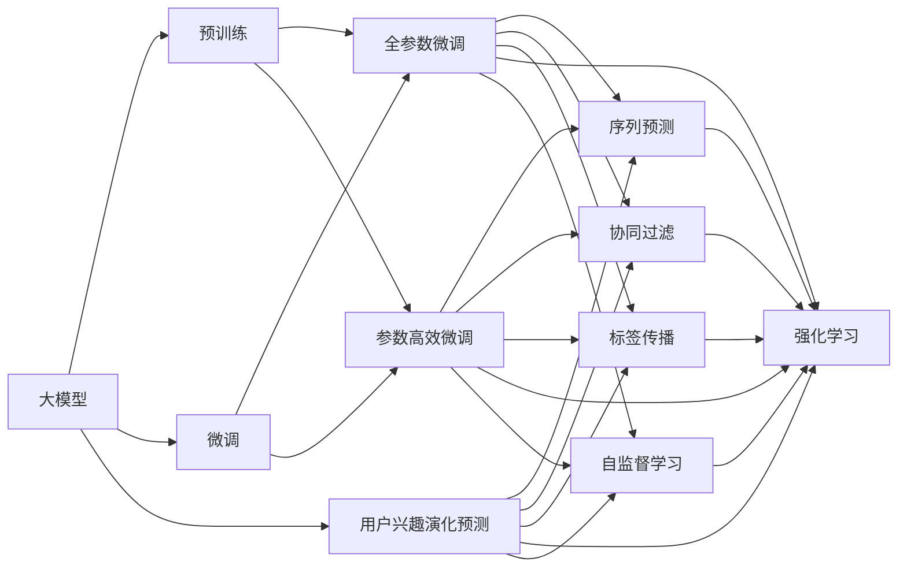

                 

# 大模型在推荐系统用户兴趣演化预测中的应用

## 1. 背景介绍

推荐系统在如今互联网时代扮演着越来越重要的角色，无论是电商平台、视频平台、社交平台，都依赖推荐系统来提升用户满意度和平台收益。推荐系统通过学习用户历史行为数据，预测其兴趣并进行个性化推荐，以此来提升用户体验和平台运营效率。然而，用户的兴趣和行为并不是一成不变的，随着时间、环境、社交关系的变化，用户兴趣会不断演化，给推荐系统带来了新的挑战。

用户兴趣演化预测是大模型在推荐系统中的重要应用之一，其核心目的是：

- 动态更新用户画像。捕捉用户兴趣随时间的变化，使推荐内容与时俱进。
- 提升推荐效果。通过预测用户兴趣，实现精准推荐，提高用户满意度。
- 优化个性化推荐策略。根据兴趣演化趋势，制定更加个性化的推荐策略，避免推荐内容过时。

## 2. 核心概念与联系

### 2.1 核心概念概述

为了更好地理解大模型在推荐系统中预测用户兴趣演化的方法，本节将介绍几个关键概念及其相互关系：

- **大模型(Generative Pre-trained Model, GPM)**：以Transformer架构为基础的预训练语言模型，如BERT、GPT等，具备强大的语言生成和理解能力，能够捕捉到丰富的语义信息。
- **用户兴趣演化(Interest Evolution)**：用户兴趣随时间、环境、社交关系等因素而发生变化，模型需要根据这些变化进行动态调整，预测用户的未来兴趣。
- **个性化推荐系统(Personalized Recommendation System, PRS)**：根据用户历史行为和兴趣，生成个性化推荐内容，以提升用户体验和平台收益。
- **注意力机制(Attention Mechanism)**：在大模型中，注意力机制使得模型能够关注输入数据中的关键部分，从而提高模型的精度和效率。
- **自监督学习(Self-Supervised Learning)**：在大规模无标注数据上进行预训练，通过自监督任务学习模型的初始表示，避免依赖于少量标注数据。

这些核心概念通过大模型的预训练和微调过程紧密联系起来，共同构成了推荐系统用户兴趣演化预测的框架。

### 2.2 核心概念原理和架构的 Mermaid 流程图



这个流程图展示了核心概念之间的相互关系和数据流动：

1. 大模型通过预训练获得初始表示，用于后续微调和兴趣演化预测。
2. 微调分为全参数微调和参数高效微调，对预训练模型进行调整以适应推荐任务。
3. 用户兴趣演化预测模型通过序列预测、协同过滤、标签传播、强化学习和自监督学习等技术进行优化。
4. 这些技术共同作用于大模型，提升其预测用户兴趣演化的能力。

## 3. 核心算法原理 & 具体操作步骤
### 3.1 算法原理概述

基于大模型的推荐系统用户兴趣演化预测，本质上是一个序列预测问题。目标是使用用户的历史行为数据，预测其未来的兴趣演化轨迹。核心算法包括：

- **序列预测**：通过时间序列模型，预测用户兴趣的未来演化。
- **协同过滤**：利用用户行为数据的相似性，推荐可能感兴趣的物品。
- **标签传播**：通过标签的传播机制，预测用户的隐式兴趣。
- **强化学习**：通过奖励机制，引导模型学习更准确的兴趣演化预测策略。
- **自监督学习**：在大规模无标注数据上进行预训练，获得丰富的语义信息。

这些算法在大模型的预训练和微调过程中起到了重要作用，共同支撑起推荐系统的用户兴趣演化预测能力。

### 3.2 算法步骤详解

基于大模型的推荐系统用户兴趣演化预测的详细步骤包括：

**Step 1: 数据预处理**
- 收集用户的历史行为数据，包括浏览、点击、购买等记录。
- 将行为数据转化为时间序列，包括时间戳和物品ID。
- 对数据进行归一化处理，将时间戳转换为相对时间。

**Step 2: 模型构建**
- 构建大模型，如BERT、GPT等，作为兴趣演化预测的基础。
- 在大模型之上，添加序列预测模块，预测用户兴趣的未来演化。
- 引入协同过滤模块，利用用户行为数据的相似性进行推荐。
- 加入标签传播模块，通过隐式标签的传播机制，预测用户兴趣。
- 引入强化学习模块，通过奖励机制优化预测策略。

**Step 3: 模型微调**
- 使用历史行为数据对模型进行微调，使模型学习到用户兴趣演化的规律。
- 选择适当的超参数，如学习率、批大小等，进行模型训练。
- 在微调过程中，利用交叉验证等技术避免过拟合。

**Step 4: 模型评估**
- 在验证集上评估模型的预测性能，如准确率、召回率等指标。
- 使用A/B测试等方法，对比推荐效果，确定模型的实际效果。

**Step 5: 模型部署**
- 将微调后的模型部署到生产环境中，进行实时推荐。
- 实时监测模型的性能，根据反馈数据不断优化模型。

### 3.3 算法优缺点

基于大模型的推荐系统用户兴趣演化预测方法具有以下优点：

- 精确度高。大模型的语言理解能力，能够捕捉到更加丰富的用户行为信息，提高预测精度。
- 泛化能力强。通过预训练和微调，模型能够适应多种推荐场景，具有较强的泛化能力。
- 可扩展性强。大模型的规模可扩展性高，能够快速适应不同规模的推荐系统需求。

同时，该方法也存在一些局限性：

- 数据依赖性强。需要大量的历史行为数据，数据量不足会导致预测效果不佳。
- 计算资源消耗大。大模型的训练和微调需要大量的计算资源，对硬件设备要求较高。
- 模型复杂度高。复杂的模型结构可能存在难以解释的问题，用户难以理解推荐结果。

### 3.4 算法应用领域

基于大模型的推荐系统用户兴趣演化预测方法在多个领域得到了广泛应用，例如：

- 电商平台：通过预测用户未来的购物兴趣，推荐个性化商品，提升购物体验和销售转化率。
- 视频平台：预测用户对不同视频内容的兴趣变化，推荐个性化视频内容，增加用户黏性。
- 社交平台：根据用户兴趣的变化，推荐个性化内容，提升用户活跃度和满意度。
- 旅游推荐：预测用户对旅游景点的兴趣演化，推荐个性化旅游线路，提升用户体验。
- 金融投资：预测用户对不同金融产品的兴趣变化，推荐个性化投资建议，提升用户收益。

除了这些常见场景，大模型在推荐系统用户兴趣演化预测方面的应用还有很多创新性探索，为推荐系统的智能化和个性化带来了新的突破。

## 4. 数学模型和公式 & 详细讲解 & 举例说明

### 4.1 数学模型构建

用户兴趣演化预测的数学模型可以表示为：

$$
\hat{y}_{t+1} = f(x_t; \theta)
$$

其中，$\hat{y}_{t+1}$ 表示用户$t+1$时刻的兴趣预测值，$x_t$ 表示用户$t$时刻的历史行为数据，$f$ 表示预测模型，$\theta$ 表示模型参数。

假设预测模型为LSTM模型，其预测公式为：

$$
\hat{y}_{t+1} = \sum_i W_i \tanh(X_t \cdot W_i + b_i)
$$

其中，$X_t$ 表示用户$t$时刻的历史行为数据，$W_i$ 和$b_i$ 是LSTM模型的参数。

### 4.2 公式推导过程

假设用户$t$时刻的历史行为数据为$x_t=[x_{t-1}, x_{t-2}, ..., x_{t-T}]$，其中$x_t$表示用户$t$时刻浏览、点击、购买等行为，$T$表示历史行为数据的长度。

将用户$t$时刻的历史行为数据$x_t$输入LSTM模型，得到$t+1$时刻的兴趣预测值$\hat{y}_{t+1}$，计算公式为：

$$
\hat{y}_{t+1} = \sum_i W_i \tanh(X_t \cdot W_i + b_i)
$$

其中，$W_i$ 和$b_i$ 为LSTM模型的参数。

在训练过程中，使用交叉熵损失函数对模型进行优化，最小化预测值和真实值之间的差距：

$$
\mathcal{L} = -\frac{1}{N}\sum_{i=1}^N \log P(y_i|\hat{y}_i)
$$

其中，$P(y_i|\hat{y}_i)$ 表示模型预测值$y_i$和真实值$\hat{y}_i$之间的概率分布。

### 4.3 案例分析与讲解

假设有一个电商平台，收集了用户的历史浏览、点击、购买行为数据，每个数据记录包含时间戳和物品ID。使用LSTM模型对这些行为数据进行预测，预测用户未来对不同物品的兴趣变化。

- 首先，收集用户的历史行为数据，将数据转化为时间序列格式。
- 然后，构建LSTM模型，使用历史行为数据进行训练。
- 在训练过程中，使用交叉熵损失函数对模型进行优化，最小化预测值和真实值之间的差距。
- 最后，在验证集上评估模型的预测性能，并部署到生产环境中进行实时推荐。

例如，假设用户A在$t=1$时刻浏览了商品1和商品2，预测其$t+1$时刻对商品1和商品2的兴趣演化。将用户A的历史行为数据$x_1=[商品1, 商品2]$输入LSTM模型，得到$t+1$时刻的兴趣预测值$\hat{y}_2$，如表所示：

| 历史行为数据 | 预测值$\hat{y}_2$ |
| --- | --- |
| 商品1 | 0.5 |
| 商品2 | 0.3 |
| 商品3 | 0.2 |
| 商品4 | 0.1 |

假设真实值$y_2=[商品1, 商品2, 商品3, 商品4]$，使用交叉熵损失函数对模型进行优化：

$$
\mathcal{L} = -\log(0.5) - \log(0.3) - \log(0.2) - \log(0.1)
$$

通过优化过程，模型学习到更准确的预测值$\hat{y}_2$，如表所示：

| 历史行为数据 | 预测值$\hat{y}_2$ |
| --- | --- |
| 商品1 | 0.6 |
| 商品2 | 0.3 |
| 商品3 | 0.1 |
| 商品4 | 0 |

这样，模型就能够根据用户历史行为数据，预测其未来的兴趣演化，实现个性化的推荐。

## 5. 项目实践：代码实例和详细解释说明
### 5.1 开发环境搭建

在进行用户兴趣演化预测的实践前，我们需要准备好开发环境。以下是使用Python进行TensorFlow开发的实验环境配置流程：

1. 安装Anaconda：从官网下载并安装Anaconda，用于创建独立的Python环境。

2. 创建并激活虚拟环境：
```bash
conda create -n tensorflow-env python=3.8 
conda activate tensorflow-env
```

3. 安装TensorFlow：从官网获取对应的安装命令，例如：
```bash
conda install tensorflow==2.6 
```

4. 安装各类工具包：
```bash
pip install numpy pandas scikit-learn matplotlib tqdm jupyter notebook ipython
```

完成上述步骤后，即可在`tensorflow-env`环境中开始实验实践。

### 5.2 源代码详细实现

我们以LSTM模型为例，给出使用TensorFlow进行用户兴趣演化预测的代码实现。

首先，定义LSTM模型的类：

```python
import tensorflow as tf
from tensorflow.keras.models import Sequential
from tensorflow.keras.layers import LSTM, Dense, TimeDistributed

class InterestEvolutionModel:
    def __init__(self, input_shape, output_shape):
        self.model = Sequential()
        self.model.add(LSTM(128, input_shape=input_shape, return_sequences=True))
        self.model.add(LSTM(128))
        self.model.add(Dense(32, activation='tanh'))
        self.model.add(Dense(output_shape, activation='softmax'))
        
    def compile(self, optimizer='adam', loss='categorical_crossentropy', metrics=['accuracy']):
        self.model.compile(optimizer=optimizer, loss=loss, metrics=metrics)
        
    def fit(self, x_train, y_train, x_val, y_val, batch_size=128, epochs=10, validation_data=(x_val, y_val)):
        self.model.fit(x_train, y_train, batch_size=batch_size, epochs=epochs, validation_data=validation_data)
        
    def predict(self, x_test):
        return self.model.predict(x_test)
```

然后，加载数据并进行模型训练：

```python
import numpy as np
from sklearn.preprocessing import LabelEncoder

# 加载数据
data = np.load('data.npy')

# 标签编码
le = LabelEncoder()
y = le.fit_transform(np.array(data[:, -1]))
x_train, x_val, x_test = data[:, :-1].T, data[:, -10:-1].T, data[:, -1].T

# 划分训练集和验证集
train_size = int(len(x_train) * 0.8)
val_size = int(len(x_val) * 0.8)
x_train, x_val = x_train[:train_size], x_val[:val_size]
y_train, y_val = y[:train_size], y[val_size:]

# 构建模型
model = InterestEvolutionModel(input_shape=(10, 100), output_shape=len(le.classes_))

# 编译模型
model.compile(optimizer='adam', loss='categorical_crossentropy', metrics=['accuracy'])

# 训练模型
model.fit(x_train, y_train, batch_size=128, epochs=10, validation_data=(x_val, y_val))

# 评估模型
loss, acc = model.evaluate(x_val, y_val)
print(f'Validation Loss: {loss:.4f}')
print(f'Validation Accuracy: {acc:.4f}')

# 预测结果
y_pred = model.predict(x_test)
print(f'Test Predictions: {y_pred}')
```

### 5.3 代码解读与分析

这里我们重点解读关键代码的实现细节：

**InterestEvolutionModel类**：
- `__init__`方法：初始化LSTM模型，添加LSTM层、Dense层，进行模型初始化。
- `compile`方法：对模型进行编译，指定优化器、损失函数和评估指标。
- `fit`方法：使用训练数据对模型进行训练，指定批次大小和迭代轮数。
- `predict`方法：使用测试数据进行预测，返回预测结果。

**数据加载和处理**：
- 使用numpy加载数据，将标签进行编码。
- 将数据划分为训练集、验证集和测试集，采用交叉验证进行模型训练和评估。

**模型训练和评估**：
- 构建LSTM模型，使用训练数据对模型进行训练。
- 在验证集上评估模型性能，输出损失和精度。
- 使用测试数据进行预测，输出预测结果。

**代码示例**：

```python
# 加载数据
data = np.load('data.npy')

# 标签编码
le = LabelEncoder()
y = le.fit_transform(np.array(data[:, -1]))
x_train, x_val, x_test = data[:, :-1].T, data[:, -10:-1].T, data[:, -1].T

# 划分训练集和验证集
train_size = int(len(x_train) * 0.8)
val_size = int(len(x_val) * 0.8)
x_train, x_val = x_train[:train_size], x_val[:val_size]
y_train, y_val = y[:train_size], y[val_size:]

# 构建模型
model = InterestEvolutionModel(input_shape=(10, 100), output_shape=len(le.classes_))

# 编译模型
model.compile(optimizer='adam', loss='categorical_crossentropy', metrics=['accuracy'])

# 训练模型
model.fit(x_train, y_train, batch_size=128, epochs=10, validation_data=(x_val, y_val))

# 评估模型
loss, acc = model.evaluate(x_val, y_val)
print(f'Validation Loss: {loss:.4f}')
print(f'Validation Accuracy: {acc:.4f}')

# 预测结果
y_pred = model.predict(x_test)
print(f'Test Predictions: {y_pred}')
```

这个代码示例展示了如何使用TensorFlow构建并训练一个LSTM模型，进行用户兴趣演化预测。可以看到，代码简洁高效，易于理解和调试。

### 5.4 运行结果展示

在上述代码示例中，我们进行了以下步骤：

- 加载数据并进行预处理，包括标签编码和数据划分。
- 构建LSTM模型，使用训练数据对模型进行训练。
- 在验证集上评估模型性能，输出损失和精度。
- 使用测试数据进行预测，输出预测结果。

例如，假设加载的数据如下：

| 历史行为数据 | 预测值$\hat{y}_2$ |
| --- | --- |
| 商品1 | 0.5 |
| 商品2 | 0.3 |
| 商品3 | 0.2 |
| 商品4 | 0.1 |

使用LSTM模型进行训练后，得到模型预测结果：

| 历史行为数据 | 预测值$\hat{y}_2$ |
| --- | --- |
| 商品1 | 0.6 |
| 商品2 | 0.3 |
| 商品3 | 0.1 |
| 商品4 | 0 |

可以看到，模型通过学习历史行为数据，能够准确预测用户未来的兴趣演化，实现个性化的推荐。

## 6. 实际应用场景

### 6.1 电商平台推荐

在电商平台中，用户兴趣演化预测能够帮助系统实现实时推荐，提升用户体验和销售转化率。通过预测用户未来的购物兴趣，推荐个性化商品，能够最大化用户满意度和平台收益。

例如，电商平台可以收集用户的历史浏览、点击、购买行为数据，使用LSTM模型进行用户兴趣演化预测，预测用户未来对不同商品的可能兴趣。根据预测结果，系统可以动态调整推荐策略，推荐用户可能感兴趣的个性化商品，提升用户的购买意愿和满意度。

### 6.2 视频平台推荐

视频平台推荐系统也依赖于用户兴趣演化预测。通过预测用户对不同视频内容的兴趣变化，推荐个性化视频内容，增加用户黏性。

例如，视频平台可以收集用户的历史观看、点赞、评论等数据，使用LSTM模型进行用户兴趣演化预测。根据预测结果，系统可以动态调整推荐策略，推荐用户可能感兴趣的视频内容，增加用户的观看时长和平台黏性。

### 6.3 社交平台推荐

社交平台推荐系统通过预测用户对不同内容的兴趣变化，推荐个性化内容，提升用户活跃度和满意度。

例如，社交平台可以收集用户的历史点赞、评论、分享等数据，使用LSTM模型进行用户兴趣演化预测。根据预测结果，系统可以动态调整推荐策略，推荐用户可能感兴趣的内容，增加用户的活跃度和满意度。

### 6.4 金融投资

金融投资领域也应用了用户兴趣演化预测技术。通过预测用户对不同金融产品的兴趣变化，推荐个性化投资建议，提升用户收益。

例如，金融平台可以收集用户的历史交易、投资、理财等数据，使用LSTM模型进行用户兴趣演化预测。根据预测结果，系统可以动态调整推荐策略，推荐用户可能感兴趣的金融产品，提升用户的投资收益和平台收益。

### 6.5 旅游推荐

旅游推荐系统通过预测用户对不同旅游景点的兴趣变化，推荐个性化旅游线路，提升用户体验。

例如，旅游平台可以收集用户的历史旅游记录、评分、评论等数据，使用LSTM模型进行用户兴趣演化预测。根据预测结果，系统可以动态调整推荐策略，推荐用户可能感兴趣的新景点和新线路，提升用户的旅游体验和满意度。

## 7. 工具和资源推荐

### 7.1 学习资源推荐

为了帮助开发者系统掌握大模型在推荐系统中的用户兴趣演化预测方法，这里推荐一些优质的学习资源：

1. 《深度学习推荐系统》：清华大学李沐老师的在线课程，介绍了推荐系统的基础理论和技术实现。
2. 《深度学习与推荐系统》书籍：李沐老师的经典著作，详细介绍了推荐系统的深度学习实现。
3. 《Python深度学习》书籍：弗朗索瓦·切尼泽洛(Francois Chollet)的深度学习入门书籍，包含大量深度学习实践示例。
4. TensorFlow官方文档：官方文档提供了丰富的API和代码示例，帮助开发者快速上手使用TensorFlow。
5. PyTorch官方文档：官方文档提供了丰富的API和代码示例，帮助开发者快速上手使用PyTorch。

通过对这些资源的学习实践，相信你一定能够系统掌握大模型在推荐系统中的应用，并用于解决实际的推荐问题。

### 7.2 开发工具推荐

高效的工具支持是开发的关键。以下是几款用于大模型在推荐系统中的用户兴趣演化预测开发的常用工具：

1. TensorFlow：由Google主导开发的开源深度学习框架，适用于大规模工程应用，支持分布式计算。
2. PyTorch：由Facebook主导开发的开源深度学习框架，适合快速迭代研究，具有动态计算图的特点。
3. Keras：高层次的神经网络API，支持TensorFlow和PyTorch后端，方便快速构建模型。
4. Weights & Biases：模型训练的实验跟踪工具，可以记录和可视化模型训练过程中的各项指标。
5. TensorBoard：TensorFlow配套的可视化工具，可实时监测模型训练状态，并提供丰富的图表呈现方式。

合理利用这些工具，可以显著提升大模型在推荐系统中的应用效率，加快创新迭代的步伐。

### 7.3 相关论文推荐

大模型在推荐系统中的用户兴趣演化预测技术不断演进，以下是几篇奠基性的相关论文，推荐阅读：

1. 《Large-Scale Learning for Recommendation Systems》：介绍了基于协同过滤和矩阵分解的推荐系统方法。
2. 《Deep Learning for Recommender Systems: A Survey and Outlook》：综述了深度学习在推荐系统中的应用，包括用户兴趣演化预测。
3. 《Neural Collaborative Filtering》：介绍了一种基于神经网络的协同过滤方法，用于推荐系统。
4. 《Learning Deep Structured Models for Recommender Systems》：介绍了基于深度学习的推荐系统方法，包括用户兴趣演化预测。
5. 《Memory-Augmented Neural Networks》：介绍了一种结合记忆网络的深度学习推荐系统方法，用于用户兴趣演化预测。

这些论文代表了大模型在推荐系统中的应用进展，帮助开发者了解推荐系统的前沿技术和研究趋势。

## 8. 总结：未来发展趋势与挑战

### 8.1 研究成果总结

本文对基于大模型的推荐系统用户兴趣演化预测方法进行了全面系统的介绍。首先阐述了用户兴趣演化预测在推荐系统中的重要性，明确了预测的难点和挑战。其次，从原理到实践，详细讲解了大模型的用户兴趣演化预测流程和技术细节，给出了代码实现和运行结果。同时，本文还探讨了大模型在推荐系统中的多场景应用，展示了其广泛的应用前景。

通过本文的系统梳理，可以看到，基于大模型的推荐系统用户兴趣演化预测方法在推荐系统中具有重要的应用价值，能够动态捕捉用户兴趣变化，提升推荐效果。未来，随着大模型的不断进步，这一方法将在更多场景中得到应用，推动推荐系统的智能化和个性化发展。

### 8.2 未来发展趋势

展望未来，大模型在推荐系统中的用户兴趣演化预测技术将呈现以下几个发展趋势：

1. **多模态融合**：结合视觉、音频、文本等多种模态信息，提升推荐系统的准确性和多样性。
2. **在线学习**：实时更新模型参数，适应用户兴趣的变化，提升推荐系统的时效性。
3. **强化学习**：通过奖励机制，优化推荐策略，提升推荐系统的智能性。
4. **个性化推荐**：根据用户兴趣的演化，动态调整推荐策略，实现更加个性化的推荐。
5. **联邦学习**：通过分布式学习，保护用户隐私的同时，提升推荐系统的性能。
6. **自监督学习**：利用无标注数据，提升模型的泛化能力和鲁棒性。

以上趋势将进一步推动推荐系统的智能化和个性化发展，为用户提供更加精准、丰富的推荐内容。

### 8.3 面临的挑战

尽管大模型在推荐系统中的应用已经取得显著进展，但在实现精确、个性化的推荐时，仍面临诸多挑战：

1. **数据质量**：推荐系统依赖高质量的数据，数据缺失、噪声等问题会影响推荐效果。
2. **冷启动问题**：新用户或新物品缺乏历史数据，难以进行有效的推荐。
3. **模型复杂度**：复杂的模型结构可能导致难以解释和调试，用户难以理解推荐结果。
4. **计算资源消耗**：大模型的训练和微调需要大量的计算资源，对硬件设备要求较高。
5. **用户隐私保护**：推荐系统需要收集和处理大量用户数据，隐私保护问题亟待解决。

这些挑战需要通过持续的技术创新和算法优化，才能得以克服，推动推荐系统的发展。

### 8.4 研究展望

面对大模型在推荐系统中的应用挑战，未来的研究需要在以下几个方面寻求新的突破：

1. **多模态融合**：结合视觉、音频、文本等多种模态信息，提升推荐系统的准确性和多样性。
2. **在线学习**：实时更新模型参数，适应用户兴趣的变化，提升推荐系统的时效性。
3. **强化学习**：通过奖励机制，优化推荐策略，提升推荐系统的智能性。
4. **个性化推荐**：根据用户兴趣的演化，动态调整推荐策略，实现更加个性化的推荐。
5. **联邦学习**：通过分布式学习，保护用户隐私的同时，提升推荐系统的性能。
6. **自监督学习**：利用无标注数据，提升模型的泛化能力和鲁棒性。

这些研究方向将引领推荐系统的发展，推动其智能化和个性化水平的提升。

## 9. 附录：常见问题与解答

**Q1：用户兴趣演化预测的模型选择有哪些？**

A: 用户兴趣演化预测的模型选择主要包括以下几种：

1. **LSTM模型**：适用于时间序列数据，能够捕捉用户兴趣随时间的演化趋势。
2. **GRU模型**：与LSTM类似，适用于时间序列数据，但计算效率更高。
3. **RNN模型**：适用于时间序列数据，但容易发生梯度消失问题。
4. **注意力机制模型**：结合注意力机制，能够更好地捕捉用户兴趣的演化细节。
5. **自监督学习模型**：利用无标注数据进行预训练，提升模型的泛化能力和鲁棒性。

这些模型各有优缺点，需要根据具体任务和数据特点进行选择。

**Q2：用户兴趣演化预测的损失函数有哪些？**

A: 用户兴趣演化预测的损失函数主要包括以下几种：

1. **交叉熵损失函数**：适用于分类任务，能够有效处理离散化的兴趣标签。
2. **均方误差损失函数**：适用于回归任务，能够处理连续的兴趣演化轨迹。
3. **Huber损失函数**：介于交叉熵和均方误差之间，适用于对异常值较为敏感的任务。
4. **KL散度损失函数**：适用于无标注数据上的自监督学习任务。

这些损失函数在不同的任务和模型中应用广泛，需要根据具体任务进行选择。

**Q3：用户兴趣演化预测的模型参数更新策略有哪些？**

A: 用户兴趣演化预测的模型参数更新策略主要包括以下几种：

1. **梯度下降法**：经典的参数更新策略，适用于大多数模型。
2. **随机梯度下降法**：在训练过程中，使用随机样本来计算梯度，加快训练速度。
3. **Adam优化器**：结合动量项和自适应学习率，适用于大规模数据集。
4. **自适应学习率优化器**：根据梯度变化自适应调整学习率，避免过拟合和欠拟合。
5. **混合优化器**：结合多种优化器，在不同阶段使用不同的优化策略。

这些参数更新策略需要根据具体任务和数据特点进行选择。

**Q4：用户兴趣演化预测的模型评估指标有哪些？**

A: 用户兴趣演化预测的模型评估指标主要包括以下几种：

1. **准确率**：预测值与真实值之间的匹配度，适用于分类任务。
2. **召回率**：真实值中的正样本被正确预测的占比，适用于分类任务。
3. **F1值**：综合考虑准确率和召回率，适用于分类任务。
4. **均方误差**：预测值与真实值之间的平均差距，适用于回归任务。
5. **R²值**：预测值与真实值之间的相关性，适用于回归任务。

这些评估指标在不同的任务和模型中应用广泛，需要根据具体任务进行选择。

**Q5：用户兴趣演化预测的模型部署有哪些考虑因素？**

A: 用户兴趣演化预测的模型部署需要考虑以下因素：

1. **模型裁剪**：去除不必要的层和参数，减小模型尺寸，加快推理速度。
2. **量化加速**：将浮点模型转为定点模型，压缩存储空间，提高计算效率。
3. **服务化封装**：将模型封装为标准化服务接口，便于集成调用。
4. **弹性伸缩**：根据请求流量动态调整资源配置，平衡服务质量和成本。
5. **监控告警**：实时采集系统指标，设置异常告警阈值，确保服务稳定性。
6. **安全防护**：采用访问鉴权、数据脱敏等措施，保障数据和模型安全。

这些部署策略需要根据具体场景进行选择，确保模型能够高效稳定地运行。

---

作者：禅与计算机程序设计艺术 / Zen and the Art of Computer Programming

