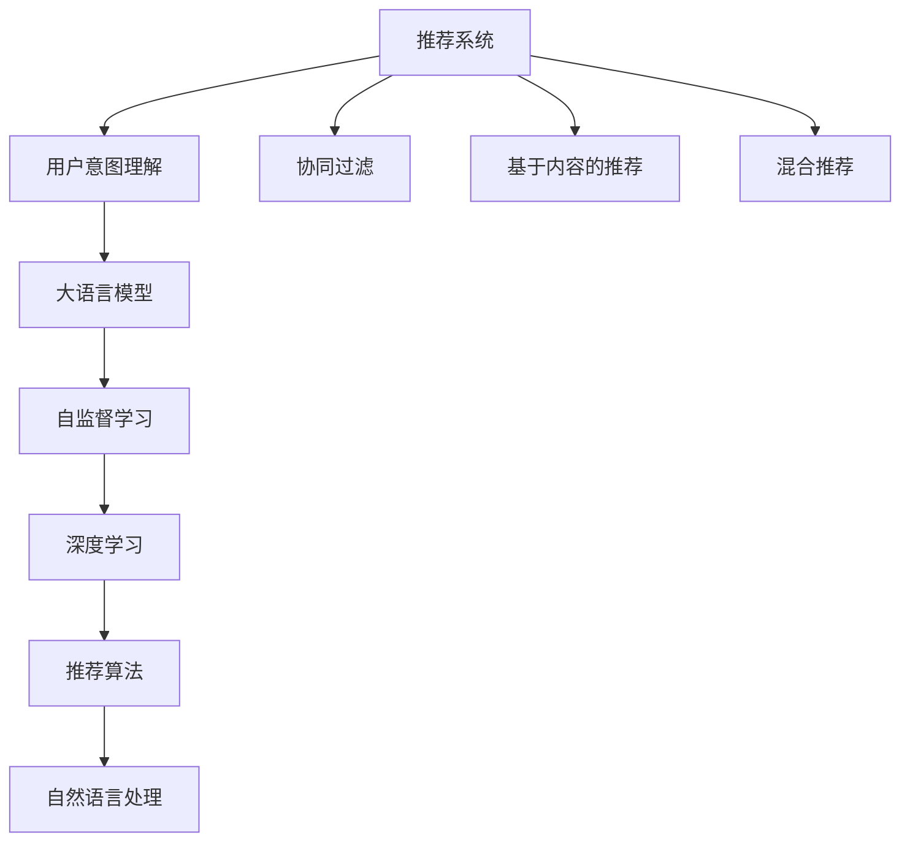

                 

# 大模型在推荐系统用户意图理解中的作用

> 关键词：推荐系统、用户意图理解、大语言模型、自监督学习、深度学习、推荐算法、自然语言处理

## 1. 背景介绍

### 1.1 问题由来

随着互联网的迅猛发展和数字技术的不断进步，推荐系统在电商、新闻、视频、音乐等多个领域得到了广泛应用。传统的基于协同过滤、基于内容的推荐方法已经难以满足用户多样化的需求，推荐系统亟需引入新的技术来提升推荐的精准性和个性化水平。

用户意图理解是推荐系统中的重要环节，指的是对用户浏览、点击、购买等行为背后的真正需求进行建模和理解，从而生成更加个性化的推荐内容。传统方法依赖于显式反馈数据（如评分、点击等），但这些数据稀疏且难以获取，无法覆盖所有的用户行为。而基于大语言模型的推荐系统，能够利用用户输入的文本信息（如评论、标题等），通过理解文本的深层语义，推测用户的真实意图，从而实现更加精准的推荐。

### 1.2 问题核心关键点

大语言模型在推荐系统用户意图理解中的应用主要体现在以下几个方面：

- 语义理解能力：大语言模型通过自监督学习的方式，对大量无标签文本数据进行预训练，获得了强大的语义理解能力。能够从用户的文本信息中提取出语义信息，推测用户的真实需求。
- 多模态融合：大语言模型不仅能处理文本信息，还能与其他模态的数据（如图像、音频等）进行融合，构建更全面、丰富的用户意图模型。
- 推荐逻辑增强：大语言模型结合推荐算法，对用户意图进行更深刻的理解，生成更加个性化的推荐内容。
- 实时性和鲁棒性：大语言模型具有较快的推理速度和较高的鲁棒性，能够满足实时推荐和应对数据变化的需求。

这些核心关键点使得大语言模型在推荐系统中的应用前景广阔，成为提升推荐系统性能的重要手段。

## 2. 核心概念与联系

### 2.1 核心概念概述

为更好地理解大模型在推荐系统用户意图理解中的应用，本节将介绍几个密切相关的核心概念：

- 推荐系统(Recommendation System)：一种信息过滤系统，通过分析用户的历史行为数据，为用户推荐可能感兴趣的商品、内容、服务等。常见的推荐方法包括协同过滤、基于内容的推荐、混合推荐等。
- 用户意图理解(User Intent Understanding)：对用户的行为背后真实需求进行建模和理解，生成更加个性化的推荐内容。是推荐系统中重要的环节之一。
- 大语言模型(Large Language Model)：以自回归模型（如GPT）或自编码模型（如BERT）为代表的大规模预训练语言模型。通过在大规模无标签文本数据上进行预训练，学习通用的语言表示，具备强大的语言理解和生成能力。
- 自监督学习(Self-supervised Learning)：在大规模无标签数据上进行学习，利用语言模型自监督任务（如掩码语言模型、预训练语言任务）提升模型的语义理解能力。
- 深度学习(Deep Learning)：一种基于多层神经网络进行建模和训练的机器学习方法，广泛应用于计算机视觉、自然语言处理等领域。
- 推荐算法(Recommendation Algorithms)：用于生成推荐内容的技术手段，包括协同过滤、基于内容的推荐、矩阵分解等。
- 自然语言处理(Natural Language Processing)：涉及计算机对自然语言进行理解、生成、处理的技术，是大模型在推荐系统中应用的重要领域。

这些核心概念之间的逻辑关系可以通过以下Mermaid流程图来展示：



这个流程图展示了推荐系统的核心概念及其之间的关系：

1. 推荐系统通过用户行为数据进行建模，生成推荐内容。
2. 用户意图理解作为推荐系统的重要环节，利用大语言模型对用户行为数据进行深度理解。
3. 大语言模型通过自监督学习的方式，在大规模无标签文本数据上进行预训练，提升语义理解能力。
4. 深度学习作为大语言模型和推荐算法之间的桥梁，通过多层神经网络进行特征提取和模型训练。
5. 自然语言处理作为大语言模型和推荐算法的基础技术，提供语义建模和处理能力。

## 3. 核心算法原理 & 具体操作步骤

### 3.1 算法原理概述

基于大语言模型在推荐系统用户意图理解中的应用，本质上是将大语言模型的语义理解能力与推荐算法结合，构建更为全面、精准的用户意图模型。其核心思想是：

- 利用大语言模型对用户输入的文本信息进行语义理解，推测用户的真实意图。
- 结合推荐算法，生成个性化的推荐内容。
- 将推荐结果呈现给用户，实时收集反馈信息，进一步优化模型。

形式化地，假设推荐系统为 $S$，用户为 $U$，商品为 $I$。设 $D$ 为用户的文本行为数据集，其中每个样本 $d_i = (u_i, i_i)$ 表示用户 $u_i$ 在商品 $i_i$ 上的文本行为。则推荐系统的优化目标是最小化用户行为与推荐结果之间的差异：

$$
\mathop{\arg\min}_{\theta} \mathcal{L}(S_{\theta}, D)
$$

其中 $\mathcal{L}$ 为损失函数，用于衡量用户行为和推荐结果之间的差异。常见损失函数包括均方误差损失、交叉熵损失等。

### 3.2 算法步骤详解

基于大语言模型在推荐系统用户意图理解中的应用，一般包括以下几个关键步骤：

**Step 1: 准备大语言模型和数据集**
- 选择合适的预训练语言模型（如BERT、GPT等）作为初始化参数。
- 准备用户文本行为数据集 $D$，划分为训练集、验证集和测试集。一般要求数据分布与推荐任务的匹配。

**Step 2: 添加任务适配层**
- 根据推荐任务类型，在预训练模型顶层设计合适的输出层和损失函数。
- 对于推荐任务，通常在顶层添加分类器或回归器输出，并以损失函数衡量预测结果和真实标签之间的差异。

**Step 3: 设置微调超参数**
- 选择合适的优化算法及其参数，如 Adam、SGD 等，设置学习率、批大小、迭代轮数等。
- 设置正则化技术及强度，包括权重衰减、Dropout、Early Stopping 等。
- 确定冻结预训练参数的策略，如仅微调顶层，或全部参数都参与微调。

**Step 4: 执行梯度训练**
- 将训练集数据分批次输入模型，前向传播计算损失函数。
- 反向传播计算参数梯度，根据设定的优化算法和学习率更新模型参数。
- 周期性在验证集上评估模型性能，根据性能指标决定是否触发 Early Stopping。
- 重复上述步骤直到满足预设的迭代轮数或 Early Stopping 条件。

**Step 5: 测试和部署**
- 在测试集上评估微调后模型 $S_{\hat{\theta}}$ 的性能，对比微调前后的推荐效果。
- 使用微调后的模型对新用户进行推荐，集成到实际的应用系统中。
- 持续收集新的用户行为数据，定期重新微调模型，以适应数据分布的变化。

以上是基于大语言模型在推荐系统用户意图理解中的应用的一般流程。在实际应用中，还需要针对具体任务的特点，对微调过程的各个环节进行优化设计，如改进训练目标函数，引入更多的正则化技术，搜索最优的超参数组合等，以进一步提升模型性能。

### 3.3 算法优缺点

基于大语言模型在推荐系统用户意图理解中的应用具有以下优点：

1. 数据利用效率高。大语言模型可以自动从文本数据中提取出语义信息，推测用户意图，无需显式反馈数据。
2. 个性化推荐能力强。大语言模型具备强大的语义理解能力，能够根据用户的自然语言描述生成更加个性化的推荐内容。
3. 鲁棒性强。大语言模型具有良好的鲁棒性，能够适应不同领域和不同任务的数据分布。
4. 实时性高。大语言模型的推理速度较快，可以实时处理用户输入，生成推荐结果。
5. 可扩展性强。大语言模型可以方便地与各种推荐算法结合，构建不同的推荐系统。

同时，该方法也存在一定的局限性：

1. 对数据质量要求高。用户输入的文本数据质量会直接影响模型性能，需要进行数据清洗和处理。
2. 模型参数量大。大语言模型通常需要耗费大量的计算资源进行训练和推理。
3. 效果依赖于用户输入。如果用户输入的文本描述不准确或不全面，模型预测结果也会受到较大影响。
4. 缺乏可解释性。大语言模型通常难以解释其决策过程，难以对其进行调试和优化。

尽管存在这些局限性，但就目前而言，基于大语言模型在推荐系统用户意图理解中的应用仍然是最为高效、最前沿的推荐技术。未来相关研究的重点在于如何进一步降低模型参数量，提高模型效果，同时兼顾可解释性和鲁棒性等因素。

### 3.4 算法应用领域

基于大语言模型在推荐系统用户意图理解中的应用，已经在电商、新闻、视频、音乐等多个领域得到了广泛的应用，具体包括以下几个方向：

- 电商推荐：通过分析用户的评论、评分、标题等文本信息，推测用户的购买意图，生成个性化的商品推荐。
- 新闻推荐：对用户的阅读历史和评论文本进行分析，推测用户的兴趣偏好，生成个性化的新闻内容。
- 视频推荐：从用户的观看历史和视频标题中提取语义信息，推测用户的兴趣偏好，生成个性化的视频内容。
- 音乐推荐：利用用户的听歌历史和歌词信息，推测用户的音乐品味，生成个性化的音乐推荐。
- 智能客服：通过分析用户的聊天文本，推测用户的问题意图，生成个性化的回答和解决方案。

除了这些经典任务外，大语言模型在推荐系统中的应用还在不断拓展，如可控推荐、情感分析、用户画像构建等，为推荐系统带来了全新的突破。

## 4. 数学模型和公式 & 详细讲解  
### 4.1 数学模型构建

本节将使用数学语言对基于大语言模型的推荐系统用户意图理解进行更加严格的刻画。

假设推荐系统为 $S_{\theta}:\mathcal{U} \times \mathcal{I} \rightarrow \mathcal{R}$，其中 $\mathcal{U}$ 为用户的集合，$\mathcal{I}$ 为商品的集合，$\mathcal{R}$ 为推荐的标签集合。设用户 $u$ 在商品 $i$ 上的行为数据为 $d_{ui} = (u_i, i_i)$。

定义模型 $S_{\theta}$ 在数据样本 $d_{ui}$ 上的损失函数为 $\ell(S_{\theta}(u_i),i_i)$，则在数据集 $D$ 上的经验风险为：

$$
\mathcal{L}(\theta) = \frac{1}{N}\sum_{i=1}^N \sum_{u=1}^N \ell(S_{\theta}(u_i),i_i)
$$

其中 $N$ 为用户的数量。

通过梯度下降等优化算法，推荐系统的微调过程不断更新模型参数 $\theta$，最小化损失函数 $\mathcal{L}$，使得模型输出逼近真实标签。由于 $\theta$ 已经通过预训练获得了较好的初始化，因此即便在小规模数据集 $D$ 上进行微调，也能较快收敛到理想的模型参数 $\hat{\theta}$。

### 4.2 公式推导过程

以下我们以电商推荐为例，推导交叉熵损失函数及其梯度的计算公式。

假设推荐系统 $S_{\theta}$ 在用户 $u$ 对商品 $i$ 的评分行为上，模型的预测输出为 $p_i$，真实标签为 $y_i$。则二分类交叉熵损失函数定义为：

$$
\ell(S_{\theta}(u_i),y_i) = -[y_i\log p_i + (1-y_i)\log (1-p_i)]
$$

将其代入经验风险公式，得：

$$
\mathcal{L}(\theta) = -\frac{1}{N}\sum_{i=1}^N \sum_{u=1}^N [y_i\log S_{\theta}(u_i)+(1-y_i)\log(1-S_{\theta}(u_i))]
$$

根据链式法则，损失函数对参数 $\theta_k$ 的梯度为：

$$
\frac{\partial \mathcal{L}(\theta)}{\partial \theta_k} = -\frac{1}{N}\sum_{i=1}^N \sum_{u=1}^N \frac{y_i}{S_{\theta}(u_i)}-\frac{1-y_i}{1-S_{\theta}(u_i)} \frac{\partial S_{\theta}(u_i)}{\partial \theta_k}
$$

其中 $\frac{\partial S_{\theta}(u_i)}{\partial \theta_k}$ 可进一步递归展开，利用自动微分技术完成计算。

在得到损失函数的梯度后，即可带入参数更新公式，完成模型的迭代优化。重复上述过程直至收敛，最终得到适应电商推荐任务的最优模型参数 $\hat{\theta}$。

## 5. 项目实践：代码实例和详细解释说明
### 5.1 开发环境搭建

在进行推荐系统用户意图理解的微调实践前，我们需要准备好开发环境。以下是使用Python进行PyTorch开发的环境配置流程：

1. 安装Anaconda：从官网下载并安装Anaconda，用于创建独立的Python环境。

2. 创建并激活虚拟环境：
```bash
conda create -n pytorch-env python=3.8 
conda activate pytorch-env
```

3. 安装PyTorch：根据CUDA版本，从官网获取对应的安装命令。例如：
```bash
conda install pytorch torchvision torchaudio cudatoolkit=11.1 -c pytorch -c conda-forge
```

4. 安装TensorFlow：
```bash
pip install tensorflow
```

5. 安装各类工具包：
```bash
pip install numpy pandas scikit-learn matplotlib tqdm jupyter notebook ipython
```

完成上述步骤后，即可在`pytorch-env`环境中开始微调实践。

### 5.2 源代码详细实现

下面我们以电商推荐为例，给出使用PyTorch对BERT模型进行微调的PyTorch代码实现。

首先，定义推荐系统的训练函数：

```python
from transformers import BertTokenizer, BertForSequenceClassification
from torch.utils.data import Dataset
import torch

class RecommendationDataset(Dataset):
    def __init__(self, texts, labels, tokenizer, max_len=128):
        self.texts = texts
        self.labels = labels
        self.tokenizer = tokenizer
        self.max_len = max_len
        
    def __len__(self):
        return len(self.texts)
    
    def __getitem__(self, item):
        text = self.texts[item]
        label = self.labels[item]
        
        encoding = self.tokenizer(text, return_tensors='pt', max_length=self.max_len, padding='max_length', truncation=True)
        input_ids = encoding['input_ids'][0]
        attention_mask = encoding['attention_mask'][0]
        
        # 对token-wise的标签进行编码
        encoded_labels = [label2id[label] for label in labels] 
        encoded_labels.extend([label2id['None']] * (self.max_len - len(encoded_labels)))
        labels = torch.tensor(encoded_labels, dtype=torch.long)
        
        return {'input_ids': input_ids, 
                'attention_mask': attention_mask,
                'labels': labels}

# 标签与id的映射
label2id = {'1': 1, '2': 2, '3': 3, '4': 4, '5': 5}
id2label = {v: k for k, v in label2id.items()}

# 创建dataset
tokenizer = BertTokenizer.from_pretrained('bert-base-cased')

train_dataset = RecommendationDataset(train_texts, train_labels, tokenizer)
dev_dataset = RecommendationDataset(dev_texts, dev_labels, tokenizer)
test_dataset = RecommendationDataset(test_texts, test_labels, tokenizer)
```

然后，定义模型和优化器：

```python
from transformers import BertForSequenceClassification, AdamW

model = BertForSequenceClassification.from_pretrained('bert-base-cased', num_labels=len(label2id))

optimizer = AdamW(model.parameters(), lr=2e-5)
```

接着，定义训练和评估函数：

```python
from torch.utils.data import DataLoader
from tqdm import tqdm
from sklearn.metrics import classification_report

device = torch.device('cuda') if torch.cuda.is_available() else torch.device('cpu')
model.to(device)

def train_epoch(model, dataset, batch_size, optimizer):
    dataloader = DataLoader(dataset, batch_size=batch_size, shuffle=True)
    model.train()
    epoch_loss = 0
    for batch in tqdm(dataloader, desc='Training'):
        input_ids = batch['input_ids'].to(device)
        attention_mask = batch['attention_mask'].to(device)
        labels = batch['labels'].to(device)
        model.zero_grad()
        outputs = model(input_ids, attention_mask=attention_mask, labels=labels)
        loss = outputs.loss
        epoch_loss += loss.item()
        loss.backward()
        optimizer.step()
    return epoch_loss / len(dataloader)

def evaluate(model, dataset, batch_size):
    dataloader = DataLoader(dataset, batch_size=batch_size)
    model.eval()
    preds, labels = [], []
    with torch.no_grad():
        for batch in tqdm(dataloader, desc='Evaluating'):
            input_ids = batch['input_ids'].to(device)
            attention_mask = batch['attention_mask'].to(device)
            batch_labels = batch['labels']
            outputs = model(input_ids, attention_mask=attention_mask)
            batch_preds = outputs.logits.argmax(dim=2).to('cpu').tolist()
            batch_labels = batch_labels.to('cpu').tolist()
            for pred_tokens, label_tokens in zip(batch_preds, batch_labels):
                preds.append(pred_tokens[:len(label_tokens)])
                labels.append(label_tokens)
                
    print(classification_report(labels, preds))
```

最后，启动训练流程并在测试集上评估：

```python
epochs = 5
batch_size = 16

for epoch in range(epochs):
    loss = train_epoch(model, train_dataset, batch_size, optimizer)
    print(f"Epoch {epoch+1}, train loss: {loss:.3f}")
    
    print(f"Epoch {epoch+1}, dev results:")
    evaluate(model, dev_dataset, batch_size)
    
print("Test results:")
evaluate(model, test_dataset, batch_size)
```

以上就是使用PyTorch对BERT进行电商推荐任务微调的完整代码实现。可以看到，得益于Transformers库的强大封装，我们可以用相对简洁的代码完成BERT模型的加载和微调。

### 5.3 代码解读与分析

让我们再详细解读一下关键代码的实现细节：

**RecommendationDataset类**：
- `__init__`方法：初始化文本、标签、分词器等关键组件。
- `__len__`方法：返回数据集的样本数量。
- `__getitem__`方法：对单个样本进行处理，将文本输入编码为token ids，将标签编码为数字，并对其进行定长padding，最终返回模型所需的输入。

**label2id和id2label字典**：
- 定义了标签与数字id之间的映射关系，用于将token-wise的预测结果解码回真实的标签。

**训练和评估函数**：
- 使用PyTorch的DataLoader对数据集进行批次化加载，供模型训练和推理使用。
- 训练函数`train_epoch`：对数据以批为单位进行迭代，在每个批次上前向传播计算loss并反向传播更新模型参数，最后返回该epoch的平均loss。
- 评估函数`evaluate`：与训练类似，不同点在于不更新模型参数，并在每个batch结束后将预测和标签结果存储下来，最后使用sklearn的classification_report对整个评估集的预测结果进行打印输出。

**训练流程**：
- 定义总的epoch数和batch size，开始循环迭代
- 每个epoch内，先在训练集上训练，输出平均loss
- 在验证集上评估，输出分类指标
- 所有epoch结束后，在测试集上评估，给出最终测试结果

可以看到，PyTorch配合Transformers库使得BERT微调的代码实现变得简洁高效。开发者可以将更多精力放在数据处理、模型改进等高层逻辑上，而不必过多关注底层的实现细节。

当然，工业级的系统实现还需考虑更多因素，如模型的保存和部署、超参数的自动搜索、更灵活的任务适配层等。但核心的微调范式基本与此类似。

## 6. 实际应用场景
### 6.1 电商推荐

基于大语言模型微调的推荐系统，已经在电商领域得到了广泛应用。传统的电商推荐依赖于显式的用户评分数据，而电商商品的评论、标题、描述等文本信息可以提供丰富的语义线索，大语言模型可以从中提取用户意图，生成更加个性化的商品推荐。

具体而言，电商推荐系统通常收集用户的评论、标题、描述等文本数据，并对其进行预处理，如去除停用词、分词等。将预处理后的文本数据输入到BERT等大语言模型中，得到用户意图的表示。结合电商推荐算法（如协同过滤、矩阵分解等），生成个性化的商品推荐结果。

电商推荐系统的推荐效果可以通过A/B测试等手段进行评估，通过监控点击率、转化率等关键指标，判断推荐系统的推荐效果是否提升。

### 6.2 新闻推荐

新闻推荐系统与电商推荐类似，也是利用用户的阅读历史和评论文本，推测用户的兴趣偏好，生成个性化的新闻内容。不同的是，新闻推荐系统通常涉及更多的分类任务，如新闻来源分类、新闻主题分类等。

具体实现时，可以将用户的阅读历史和评论文本输入到大语言模型中，通过分类任务得到用户偏好的新闻类别和主题。结合新闻推荐算法（如协同过滤、矩阵分解等），生成个性化的新闻推荐内容。

新闻推荐系统的推荐效果可以通过点击率、阅读时长、分享次数等关键指标进行评估，通过监控这些指标，判断推荐系统的推荐效果是否提升。

### 6.3 视频推荐

视频推荐系统也是利用用户的观看历史和视频标题，推测用户的兴趣偏好，生成个性化的视频内容。不同的是，视频推荐系统涉及更多的多模态信息，如视频标签、视频的音频信息等。

具体实现时，可以将用户的观看历史和视频标题输入到大语言模型中，得到用户偏好的视频类别和主题。结合视频推荐算法（如协同过滤、矩阵分解等），生成个性化的视频推荐内容。

视频推荐系统的推荐效果可以通过观看时长、点赞数、分享次数等关键指标进行评估，通过监控这些指标，判断推荐系统的推荐效果是否提升。

### 6.4 未来应用展望

随着大语言模型微调技术的发展，基于大语言模型的推荐系统将在更多领域得到应用，为推荐系统带来更大的发展空间。

在智慧医疗领域，基于大语言模型的推荐系统可以推荐个性化的健康管理方案、医疗服务、药品等信息，为患者提供更好的医疗服务体验。

在智能教育领域，基于大语言模型的推荐系统可以推荐个性化的学习内容、教育服务、学习工具等信息，为学生提供更好的学习体验。

在智慧城市治理中，基于大语言模型的推荐系统可以推荐个性化的城市服务、交通出行、文化娱乐等信息，为市民提供更好的城市生活体验。

此外，在金融、社交、文娱等多个领域，基于大语言模型的推荐系统也将不断涌现，为各个领域提供智能化的推荐服务。相信随着技术的日益成熟，大语言模型微调技术将在推荐系统中的应用前景更加广阔。

## 7. 工具和资源推荐
### 7.1 学习资源推荐

为了帮助开发者系统掌握大语言模型微调的理论基础和实践技巧，这里推荐一些优质的学习资源：

1. 《Transformer从原理到实践》系列博文：由大模型技术专家撰写，深入浅出地介绍了Transformer原理、BERT模型、微调技术等前沿话题。

2. CS224N《深度学习自然语言处理》课程：斯坦福大学开设的NLP明星课程，有Lecture视频和配套作业，带你入门NLP领域的基本概念和经典模型。

3. 《Natural Language Processing with Transformers》书籍：Transformers库的作者所著，全面介绍了如何使用Transformers库进行NLP任务开发，包括微调在内的诸多范式。

4. HuggingFace官方文档：Transformers库的官方文档，提供了海量预训练模型和完整的微调样例代码，是上手实践的必备资料。

5. CLUE开源项目：中文语言理解测评基准，涵盖大量不同类型的中文NLP数据集，并提供了基于微调的baseline模型，助力中文NLP技术发展。

通过对这些资源的学习实践，相信你一定能够快速掌握大语言模型微调的精髓，并用于解决实际的NLP问题。
###  7.2 开发工具推荐

高效的开发离不开优秀的工具支持。以下是几款用于大语言模型微调开发的常用工具：

1. PyTorch：基于Python的开源深度学习框架，灵活动态的计算图，适合快速迭代研究。大部分预训练语言模型都有PyTorch版本的实现。

2. TensorFlow：由Google主导开发的开源深度学习框架，生产部署方便，适合大规模工程应用。同样有丰富的预训练语言模型资源。

3. Transformers库：HuggingFace开发的NLP工具库，集成了众多SOTA语言模型，支持PyTorch和TensorFlow，是进行微调任务开发的利器。

4. Weights & Biases：模型训练的实验跟踪工具，可以记录和可视化模型训练过程中的各项指标，方便对比和调优。与主流深度学习框架无缝集成。

5. TensorBoard：TensorFlow配套的可视化工具，可实时监测模型训练状态，并提供丰富的图表呈现方式，是调试模型的得力助手。

6. Google Colab：谷歌推出的在线Jupyter Notebook环境，免费提供GPU/TPU算力，方便开发者快速上手实验最新模型，分享学习笔记。

合理利用这些工具，可以显著提升大语言模型微调任务的开发效率，加快创新迭代的步伐。

### 7.3 相关论文推荐

大语言模型和微调技术的发展源于学界的持续研究。以下是几篇奠基性的相关论文，推荐阅读：

1. Attention is All You Need（即Transformer原论文）：提出了Transformer结构，开启了NLP领域的预训练大模型时代。

2. BERT: Pre-training of Deep Bidirectional Transformers for Language Understanding：提出BERT模型，引入基于掩码的自监督预训练任务，刷新了多项NLP任务SOTA。

3. Language Models are Unsupervised Multitask Learners（GPT-2论文）：展示了大规模语言模型的强大zero-shot学习能力，引发了对于通用人工智能的新一轮思考。

4. Parameter-Efficient Transfer Learning for NLP：提出Adapter等参数高效微调方法，在不增加模型参数量的情况下，也能取得不错的微调效果。

5. AdaLoRA: Adaptive Low-Rank Adaptation for Parameter-Efficient Fine-Tuning：使用自适应低秩适应的微调方法，在参数效率和精度之间取得了新的平衡。

这些论文代表了大语言模型微调技术的发展脉络。通过学习这些前沿成果，可以帮助研究者把握学科前进方向，激发更多的创新灵感。

## 8. 总结：未来发展趋势与挑战

### 8.1 总结

本文对基于大语言模型在推荐系统用户意图理解中的应用进行了全面系统的介绍。首先阐述了大语言模型在推荐系统中的重要作用，明确了其在大数据时代下的优势和潜力。其次，从原理到实践，详细讲解了基于大语言模型的推荐系统用户意图理解的应用流程和关键步骤，给出了推荐系统用户意图理解微调的完整代码实例。同时，本文还广泛探讨了该方法在电商、新闻、视频等多个领域的应用前景，展示了其广阔的实践价值。此外，本文精选了微调技术的各类学习资源，力求为读者提供全方位的技术指引。

通过本文的系统梳理，可以看到，基于大语言模型在推荐系统用户意图理解中的应用前景广阔，能够极大地提升推荐系统的推荐效果和个性化程度。受益于大规模语料的预训练和强大的语义理解能力，大语言模型在推荐系统中的应用有望进一步推动NLP技术的产业化进程。未来，伴随大语言模型和微调方法的持续演进，基于大语言模型的推荐系统必将在更广阔的应用领域得到发展。

### 8.2 未来发展趋势

展望未来，大语言模型在推荐系统用户意图理解中的应用将呈现以下几个发展趋势：

1. 模型规模持续增大。随着算力成本的下降和数据规模的扩张，预训练语言模型的参数量还将持续增长。超大规模语言模型蕴含的丰富语言知识，有望支撑更加复杂多变的推荐任务微调。

2. 推荐系统与大模型的深度融合。未来推荐系统将更加依赖于大模型的语义理解能力，实现从文本数据到推荐结果的端到端建模。

3. 多模态推荐技术的发展。推荐系统将越来越多地融合图像、视频、音频等多模态数据，构建更加全面、丰富的用户意图模型。

4. 智能推荐系统的广泛应用。推荐系统将在更多领域得到应用，如医疗、教育、城市治理等，成为智慧城市、智慧企业的重要组成部分。

5. 实时推荐和动态调整。推荐系统将更加注重实时性和动态性，能够根据用户行为变化进行动态调整，提升推荐效果。

6. 个性化推荐技术的普及。推荐系统将在更多场景下得到应用，如社交网络、游戏等，成为智能交互的重要手段。

这些趋势凸显了大语言模型在推荐系统中的应用前景。这些方向的探索发展，必将进一步提升推荐系统的效果和普适性，为智慧城市、智慧企业的发展注入新的动力。

### 8.3 面临的挑战

尽管大语言模型在推荐系统中的应用已经取得了显著的进展，但在迈向更加智能化、普适化应用的过程中，仍面临诸多挑战：

1. 数据质量瓶颈。用户输入的文本数据质量直接影响推荐效果，需要进行数据清洗和处理。

2. 模型鲁棒性不足。大语言模型在处理不同领域的推荐任务时，泛化性能可能有限。如何在不同领域和数据分布下保持鲁棒性，仍需进一步研究。

3. 模型参数量大。大语言模型通常需要耗费大量的计算资源进行训练和推理。如何在保持高性能的同时，减小模型参数量，仍需进一步探索。

4. 效果依赖于用户输入。如果用户输入的文本描述不准确或不全面，模型预测结果也会受到较大影响。如何提升用户输入质量，仍需进一步研究。

5. 可解释性不足。大语言模型通常难以解释其决策过程，难以对其推理逻辑进行分析和调试。

尽管存在这些局限性，但就目前而言，基于大语言模型在推荐系统用户意图理解中的应用仍然是最为高效、最前沿的推荐技术。未来相关研究的重点在于如何进一步降低模型参数量，提高模型效果，同时兼顾可解释性和鲁棒性等因素。

### 8.4 研究展望

面对大语言模型在推荐系统应用中面临的种种挑战，未来的研究需要在以下几个方面寻求新的突破：

1. 探索无监督和半监督微调方法。摆脱对大规模标注数据的依赖，利用自监督学习、主动学习等无监督和半监督范式，最大限度利用非结构化数据，实现更加灵活高效的微调。

2. 研究参数高效和计算高效的微调范式。开发更加参数高效的微调方法，在固定大部分预训练参数的同时，只更新极少量的任务相关参数。同时优化微调模型的计算图，减少前向传播和反向传播的资源消耗，实现更加轻量级、实时性的部署。

3. 引入更多先验知识。将符号化的先验知识，如知识图谱、逻辑规则等，与神经网络模型进行巧妙融合，引导微调过程学习更准确、合理的语言模型。

4. 结合因果分析和博弈论工具。将因果分析方法引入微调模型，识别出模型决策的关键特征，增强输出解释的因果性和逻辑性。借助博弈论工具刻画人机交互过程，主动探索并规避模型的脆弱点，提高系统稳定性。

5. 纳入伦理道德约束。在模型训练目标中引入伦理导向的评估指标，过滤和惩罚有偏见、有害的输出倾向。同时加强人工干预和审核，建立模型行为的监管机制，确保输出符合人类价值观和伦理道德。

这些研究方向的探索，必将引领大语言模型微调技术迈向更高的台阶，为构建安全、可靠、可解释、可控的智能系统铺平道路。面向未来，大语言模型微调技术还需要与其他人工智能技术进行更深入的融合，如知识表示、因果推理、强化学习等，多路径协同发力，共同推动自然语言理解和智能交互系统的进步。只有勇于创新、敢于突破，才能不断拓展语言模型的边界，让智能技术更好地造福人类社会。

## 9. 附录：常见问题与解答

**Q1：大语言模型在推荐系统中的数据利用效率高吗？**

A: 是的，大语言模型可以自动从文本数据中提取出语义信息，推测用户意图，无需显式反馈数据。相比传统的协同过滤、基于内容的推荐方法，大语言模型在数据利用效率上更加高效。

**Q2：大语言模型在推荐系统中的应用是否依赖于高质量标注数据？**

A: 大语言模型在推荐系统中的应用可以依赖高质量标注数据，但并不局限于显式反馈数据。利用用户输入的文本信息，通过理解文本的深层语义，推测用户的真实意图，能够实现更加精准的推荐。

**Q3：大语言模型在推荐系统中的应用是否受限于计算资源？**

A: 大语言模型在推荐系统中的应用确实对计算资源有一定的要求，特别是在模型训练和推理阶段。但通过优化模型结构、参数量、优化算法等手段，可以缓解这一问题。

**Q4：大语言模型在推荐系统中的应用是否具有可解释性？**

A: 大语言模型在推荐系统中的应用具有一定的可解释性，但相对于传统的推荐方法（如协同过滤、基于内容的推荐），其决策过程较为复杂，难以完全解释。

**Q5：大语言模型在推荐系统中的应用是否具有鲁棒性？**

A: 大语言模型在推荐系统中的应用具有一定的鲁棒性，但不同领域和数据分布下的鲁棒性可能存在差异。需要在实际应用中针对具体任务进行优化，提升模型在不同场景下的表现。

通过本文的系统梳理，可以看到，大语言模型在推荐系统用户意图理解中的应用前景广阔，能够极大地提升推荐系统的推荐效果和个性化程度。受益于大规模语料的预训练和强大的语义理解能力，大语言模型在推荐系统中的应用有望进一步推动NLP技术的产业化进程。未来，伴随大语言模型和微调方法的持续演进，基于大语言模型的推荐系统必将在更广阔的应用领域得到发展。

---

作者：禅与计算机程序设计艺术 / Zen and the Art of Computer Programming

