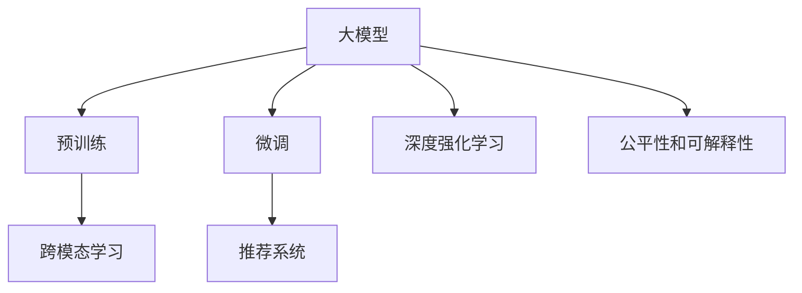

                 

# 大模型在推荐系统的未来

## 1. 背景介绍

随着互联网的快速发展，推荐系统逐渐成为各个在线平台的核心支柱。它通过分析用户行为数据，为用户推荐个性化的内容，极大提升了用户体验和平台价值。传统的推荐系统主要依赖于手工设计的特征工程和深度学习模型，但随着数据量和模型的复杂度不断增加，这些方法面临计算资源和数据隐私等诸多挑战。近年来，大模型在推荐系统中的应用引起了广泛关注，并在实际应用中取得良好效果。

## 2. 核心概念与联系

### 2.1 核心概念概述

为更好地理解大模型在推荐系统中的应用，本节将介绍几个密切相关的核心概念：

- 大模型(Large Model)：指包含数十亿个参数、通过海量数据预训练得到的深度神经网络。如GPT、BERT等预训练语言模型。大模型具备强大的泛化能力和表示学习能力，可以高效处理推荐系统中的多维稀疏数据。

- 推荐系统(Recommender System)：通过分析用户历史行为数据，为用户推荐感兴趣的物品或内容。包括协同过滤、基于内容的推荐、混合推荐等多种策略。推荐系统是电商、社交、视频、音乐等多个领域的核心技术。

- 预训练(Pre-training)：指在大规模无标签数据上，通过自监督学习任务训练通用模型。预训练使模型学习到丰富的语言知识和特征表示。

- 微调(Fine-tuning)：指在预训练模型的基础上，通过特定任务的数据集进行有监督的微调，优化模型在推荐任务上的表现。

- 跨模态学习(Cross-modal Learning)：指将不同模态的数据进行融合学习，如文本和图像的联合推荐。提升推荐系统的多样性和智能化。

- 深度强化学习(Deep Reinforcement Learning)：指通过强化学习的方式，使推荐系统能够动态调整推荐策略，实现更加个性化和高效的推荐。

- 公平性和可解释性(Fairness and Interpretability)：指推荐系统在处理用户数据时，应当避免歧视，保证各类用户都能获得公平的推荐机会。同时，模型的决策过程需要具备一定的可解释性，以便用户和开发者理解和信任推荐结果。

这些核心概念之间的逻辑关系可以通过以下Mermaid流程图来展示：



这个流程图展示了大模型、预训练、微调、推荐系统等核心概念之间的逻辑联系。大模型通过预训练获得基础能力，通过微调进行任务适配，应用于推荐系统并结合跨模态学习和深度强化学习，提升推荐性能。同时，通过引入公平性和可解释性，保证推荐过程的公正和透明。

## 3. 核心算法原理 & 具体操作步骤
### 3.1 算法原理概述

大模型在推荐系统中的应用主要分为两个步骤：

1. 预训练：在包含用户行为数据和物品特征的无标签数据集上进行大规模预训练，学习通用的语言和特征表示。
2. 微调：在目标推荐数据集上进行有监督的微调，优化模型在特定推荐任务上的性能。

通过预训练和微调，大模型能够自动学习用户和物品之间的关系，从而实现更加智能化的推荐。

### 3.2 算法步骤详解

大模型在推荐系统中的具体操作步骤包括以下几个关键步骤：

**Step 1: 准备预训练模型和数据集**
- 选择合适的预训练模型（如BERT、GPT-3等），作为推荐系统的基础。
- 收集目标推荐任务的用户行为数据和物品特征数据，将其划分为训练集、验证集和测试集。

**Step 2: 添加任务适配层**
- 根据推荐任务类型，在预训练模型的基础上添加任务适配层。如添加多层感知器（MLP）层，用于计算用户和物品的匹配度。
- 设计合适的损失函数，如均方误差损失、交叉熵损失等，衡量推荐结果与真实标签之间的差异。

**Step 3: 设置微调超参数**
- 选择合适的优化算法（如Adam、SGD等）及其参数，如学习率、批大小等。
- 设置正则化技术（如L2正则、Dropout等），避免过拟合。
- 确定冻结预训练参数的策略，如仅微调顶层，或全部参数都参与微调。

**Step 4: 执行梯度训练**
- 将训练集数据分批次输入模型，前向传播计算损失函数。
- 反向传播计算参数梯度，根据设定的优化算法和学习率更新模型参数。
- 周期性在验证集上评估模型性能，根据性能指标决定是否触发Early Stopping。
- 重复上述步骤直至满足预设的迭代轮数或Early Stopping条件。

**Step 5: 测试和部署**
- 在测试集上评估微调后模型在推荐任务上的性能，对比微调前后的精度提升。
- 使用微调后的模型对新样本进行推理预测，集成到实际的应用系统中。
- 持续收集新的用户行为数据和物品特征，定期重新微调模型，以适应数据分布的变化。

### 3.3 算法优缺点

大模型在推荐系统中的应用具有以下优点：
1. 强大的泛化能力：大模型通过预训练学到了丰富的特征表示，可以很好地适应不同领域的推荐任务。
2. 高效的特征工程：大模型自动学习特征表示，减少了手工特征工程的工作量。
3. 个性化的推荐：通过微调，大模型可以根据用户的历史行为数据，进行动态调整，实现更加个性化的推荐。
4. 推荐多样性：大模型可以处理多种模态数据，提升推荐系统的内容多样性。

同时，该方法也存在一定的局限性：
1. 数据隐私问题：大模型的训练需要大量用户行为数据，可能涉及到用户隐私问题。
2. 计算资源需求：大模型的计算复杂度高，对硬件资源的要求也较高。
3. 解释性不足：大模型通常是黑盒模型，其推荐结果的解释性不足。
4. 依赖标注数据：微调过程需要标注数据，标注成本较高。

尽管存在这些局限性，但就目前而言，大模型在推荐系统中的应用仍是非常有效的。未来相关研究的重点在于如何进一步降低数据依赖，提高模型的解释性，同时兼顾公平性和可解释性等因素。

### 3.4 算法应用领域

大模型在推荐系统中的应用已经取得了显著的成果，覆盖了以下多个领域：

- 电商推荐：电商平台通过大模型推荐用户可能感兴趣的商品，提高销售额和用户满意度。
- 社交推荐：社交媒体平台通过大模型推荐用户可能感兴趣的内容和好友，提升平台粘性和用户参与度。
- 视频推荐：视频网站通过大模型推荐用户可能感兴趣的视频内容，提升平台流量和用户留存率。
- 音乐推荐：音乐平台通过大模型推荐用户可能喜欢的歌曲，提升平台活跃度和用户粘性。
- 游戏推荐：游戏平台通过大模型推荐用户可能感兴趣的游戏，提升用户留存率和游戏销量。

除了上述这些经典应用外，大模型还被创新性地应用于更多场景中，如广告推荐、内容推荐、新闻推荐等，为推荐系统带来了全新的突破。

## 4. 数学模型和公式 & 详细讲解  
### 4.1 数学模型构建

假设预训练模型为 $M_{\theta}$，其中 $\theta$ 为预训练得到的模型参数。推荐任务的用户行为数据集为 $D=\{(x_i,y_i)\}_{i=1}^N, x_i \in \mathbb{R}^d, y_i \in \mathbb{R}^k$，其中 $d$ 为物品特征维度和用户行为维度之和，$k$ 为推荐任务标签数量。

定义模型 $M_{\theta}$ 在输入 $x$ 上的输出为 $\hat{y}=M_{\theta}(x)$，其中 $\hat{y} \in \mathbb{R}^k$。推荐任务的损失函数为：

$$
\mathcal{L}(\theta) = \frac{1}{N}\sum_{i=1}^N \ell(\hat{y}_i,y_i)
$$

其中 $\ell(\hat{y}_i,y_i)$ 为损失函数，通常采用均方误差损失（MSE）或交叉熵损失（CE）。

微调的目标是最小化损失函数，即：

$$
\theta^* = \mathop{\arg\min}_{\theta} \mathcal{L}(\theta)
$$

通过梯度下降等优化算法，微调过程不断更新模型参数 $\theta$，最小化损失函数，使得模型输出逼近真实标签。由于 $\theta$ 已经通过预训练获得了较好的初始化，因此即便在微调过程中只更新少量的模型参数，也能较快收敛到理想的模型参数 $\hat{\theta}$。

### 4.2 公式推导过程

以均方误差损失为例，推导其具体形式。假设模型 $M_{\theta}$ 在输入 $x_i$ 上的输出为 $\hat{y}_i=M_{\theta}(x_i)$，真实标签 $y_i \in \{0,1\}$。则均方误差损失函数定义为：

$$
\ell(\hat{y}_i,y_i) = \frac{1}{2}(\hat{y}_i-y_i)^2
$$

将其代入经验风险公式，得：

$$
\mathcal{L}(\theta) = \frac{1}{2N}\sum_{i=1}^N (\hat{y}_i-y_i)^2
$$

根据链式法则，损失函数对参数 $\theta_k$ 的梯度为：

$$
\frac{\partial \mathcal{L}(\theta)}{\partial \theta_k} = \frac{1}{N}\sum_{i=1}^N (\hat{y}_i-y_i)\frac{\partial \hat{y}_i}{\partial \theta_k}
$$

其中 $\frac{\partial \hat{y}_i}{\partial \theta_k}$ 为输出对参数的梯度，可通过自动微分技术高效计算。

### 4.3 案例分析与讲解

以电商推荐为例，分析大模型在推荐系统中的应用。假设电商平台的推荐任务是将用户可能感兴趣的商品推荐给用户。预训练模型为BERT，通过输入用户的历史行为数据 $x_i$，输出商品的相关性评分 $\hat{y}_i$。在电商推荐数据集 $D$ 上进行微调，使得模型能够准确预测用户对商品的评分，从而实现推荐。

假设商品 $i$ 的相关性评分为 $\hat{y}_i$，用户 $i$ 对商品 $j$ 的评分 $y_{i,j}$。则均方误差损失函数为：

$$
\ell(\hat{y}_i,y_i) = \frac{1}{2}\sum_{j=1}^m (y_{i,j}-\hat{y}_i)^2
$$

其中 $m$ 为用户选择商品的数量。

将损失函数对模型参数 $\theta$ 的梯度带入优化算法，通过反向传播更新模型参数，使模型输出逼近真实标签，从而实现电商推荐。

## 5. 项目实践：代码实例和详细解释说明
### 5.1 开发环境搭建

在进行大模型在推荐系统中的实践前，我们需要准备好开发环境。以下是使用Python进行PyTorch开发的环境配置流程：

1. 安装Anaconda：从官网下载并安装Anaconda，用于创建独立的Python环境。

2. 创建并激活虚拟环境：
```bash
conda create -n pytorch-env python=3.8 
conda activate pytorch-env
```

3. 安装PyTorch：根据CUDA版本，从官网获取对应的安装命令。例如：
```bash
conda install pytorch torchvision torchaudio cudatoolkit=11.1 -c pytorch -c conda-forge
```

4. 安装Transformers库：
```bash
pip install transformers
```

5. 安装各类工具包：
```bash
pip install numpy pandas scikit-learn matplotlib tqdm jupyter notebook ipython
```

完成上述步骤后，即可在`pytorch-env`环境中开始实践。

### 5.2 源代码详细实现

下面我们以电商推荐任务为例，给出使用Transformers库对BERT模型进行电商推荐微调的PyTorch代码实现。

首先，定义电商推荐任务的数据处理函数：

```python
from transformers import BertTokenizer
from torch.utils.data import Dataset
import torch

class RecommendationDataset(Dataset):
    def __init__(self, features, labels, tokenizer, max_len=128):
        self.features = features
        self.labels = labels
        self.tokenizer = tokenizer
        self.max_len = max_len
        
    def __len__(self):
        return len(self.features)
    
    def __getitem__(self, item):
        features = self.features[item]
        labels = self.labels[item]
        
        encoding = self.tokenizer(features, return_tensors='pt', max_length=self.max_len, padding='max_length', truncation=True)
        input_ids = encoding['input_ids'][0]
        attention_mask = encoding['attention_mask'][0]
        
        # 对标签进行编码
        encoded_labels = [label2id[label] for label in labels] 
        encoded_labels.extend([label2id['not_recomm']]*(self.max_len - len(encoded_labels)))
        labels = torch.tensor(encoded_labels, dtype=torch.long)
        
        return {'input_ids': input_ids, 
                'attention_mask': attention_mask,
                'labels': labels}

# 标签与id的映射
label2id = {'not_recomm': 0, 'recomm': 1}
id2label = {v: k for k, v in label2id.items()}

# 创建dataset
tokenizer = BertTokenizer.from_pretrained('bert-base-cased')

train_dataset = RecommendationDataset(train_features, train_labels, tokenizer)
dev_dataset = RecommendationDataset(dev_features, dev_labels, tokenizer)
test_dataset = RecommendationDataset(test_features, test_labels, tokenizer)
```

然后，定义模型和优化器：

```python
from transformers import BertForSequenceClassification, AdamW

model = BertForSequenceClassification.from_pretrained('bert-base-cased', num_labels=len(label2id))

optimizer = AdamW(model.parameters(), lr=2e-5)
```

接着，定义训练和评估函数：

```python
from torch.utils.data import DataLoader
from tqdm import tqdm
from sklearn.metrics import classification_report

device = torch.device('cuda') if torch.cuda.is_available() else torch.device('cpu')
model.to(device)

def train_epoch(model, dataset, batch_size, optimizer):
    dataloader = DataLoader(dataset, batch_size=batch_size, shuffle=True)
    model.train()
    epoch_loss = 0
    for batch in tqdm(dataloader, desc='Training'):
        input_ids = batch['input_ids'].to(device)
        attention_mask = batch['attention_mask'].to(device)
        labels = batch['labels'].to(device)
        model.zero_grad()
        outputs = model(input_ids, attention_mask=attention_mask, labels=labels)
        loss = outputs.loss
        epoch_loss += loss.item()
        loss.backward()
        optimizer.step()
    return epoch_loss / len(dataloader)

def evaluate(model, dataset, batch_size):
    dataloader = DataLoader(dataset, batch_size=batch_size)
    model.eval()
    preds, labels = [], []
    with torch.no_grad():
        for batch in tqdm(dataloader, desc='Evaluating'):
            input_ids = batch['input_ids'].to(device)
            attention_mask = batch['attention_mask'].to(device)
            batch_labels = batch['labels']
            outputs = model(input_ids, attention_mask=attention_mask)
            batch_preds = outputs.logits.argmax(dim=2).to('cpu').tolist()
            batch_labels = batch_labels.to('cpu').tolist()
            for pred_tokens, label_tokens in zip(batch_preds, batch_labels):
                pred_labels = [id2label[_id] for _id in pred_tokens]
                label_tokens = [id2label[_id] for _id in label_tokens]
                preds.append(pred_labels[:len(label_tokens)])
                labels.append(label_tokens)
                
    print(classification_report(labels, preds))
```

最后，启动训练流程并在测试集上评估：

```python
epochs = 5
batch_size = 16

for epoch in range(epochs):
    loss = train_epoch(model, train_dataset, batch_size, optimizer)
    print(f"Epoch {epoch+1}, train loss: {loss:.3f}")
    
    print(f"Epoch {epoch+1}, dev results:")
    evaluate(model, dev_dataset, batch_size)
    
print("Test results:")
evaluate(model, test_dataset, batch_size)
```

以上就是使用PyTorch对BERT进行电商推荐任务微调的完整代码实现。可以看到，得益于Transformers库的强大封装，我们可以用相对简洁的代码完成BERT模型的加载和微调。

### 5.3 代码解读与分析

让我们再详细解读一下关键代码的实现细节：

**RecommendationDataset类**：
- `__init__`方法：初始化用户行为数据、标签、分词器等关键组件。
- `__len__`方法：返回数据集的样本数量。
- `__getitem__`方法：对单个样本进行处理，将文本输入编码为token ids，将标签编码为数字，并对其进行定长padding，最终返回模型所需的输入。

**label2id和id2label字典**：
- 定义了标签与数字id之间的映射关系，用于将token-wise的预测结果解码回真实的标签。

**训练和评估函数**：
- 使用PyTorch的DataLoader对数据集进行批次化加载，供模型训练和推理使用。
- 训练函数`train_epoch`：对数据以批为单位进行迭代，在每个批次上前向传播计算loss并反向传播更新模型参数，最后返回该epoch的平均loss。
- 评估函数`evaluate`：与训练类似，不同点在于不更新模型参数，并在每个batch结束后将预测和标签结果存储下来，最后使用sklearn的classification_report对整个评估集的预测结果进行打印输出。

**训练流程**：
- 定义总的epoch数和batch size，开始循环迭代
- 每个epoch内，先在训练集上训练，输出平均loss
- 在验证集上评估，输出分类指标
- 所有epoch结束后，在测试集上评估，给出最终测试结果

可以看到，PyTorch配合Transformers库使得BERT微调的代码实现变得简洁高效。开发者可以将更多精力放在数据处理、模型改进等高层逻辑上，而不必过多关注底层的实现细节。

当然，工业级的系统实现还需考虑更多因素，如模型的保存和部署、超参数的自动搜索、更灵活的任务适配层等。但核心的微调范式基本与此类似。

## 6. 实际应用场景
### 6.1 智能客服系统

大模型在智能客服系统中的应用，可以极大地提升客服系统的智能化水平。传统客服系统需要配备大量人力，高峰期响应缓慢，且一致性和专业性难以保证。而使用大模型微调的智能客服系统，可以7x24小时不间断服务，快速响应客户咨询，用自然流畅的语言解答各类常见问题。

在技术实现上，可以收集企业内部的历史客服对话记录，将问题和最佳答复构建成监督数据，在此基础上对预训练大模型进行微调。微调后的客服系统能够自动理解用户意图，匹配最合适的答复模板进行回复。对于客户提出的新问题，还可以接入检索系统实时搜索相关内容，动态组织生成回答。如此构建的智能客服系统，能大幅提升客户咨询体验和问题解决效率。

### 6.2 金融舆情监测

金融机构需要实时监测市场舆论动向，以便及时应对负面信息传播，规避金融风险。传统的人工监测方式成本高、效率低，难以应对网络时代海量信息爆发的挑战。基于大模型微调的文本分类和情感分析技术，为金融舆情监测提供了新的解决方案。

具体而言，可以收集金融领域相关的新闻、报道、评论等文本数据，并对其进行主题标注和情感标注。在此基础上对预训练语言模型进行微调，使其能够自动判断文本属于何种主题，情感倾向是正面、中性还是负面。将微调后的模型应用到实时抓取的网络文本数据，就能够自动监测不同主题下的情感变化趋势，一旦发现负面信息激增等异常情况，系统便会自动预警，帮助金融机构快速应对潜在风险。

### 6.3 个性化推荐系统

当前的推荐系统往往只依赖于用户的历史行为数据进行物品推荐，无法深入理解用户的真实兴趣偏好。基于大模型微调技术，个性化推荐系统可以更好地挖掘用户行为背后的语义信息，从而提供更精准、多样的推荐内容。

在实践中，可以收集用户浏览、点击、评论、分享等行为数据，提取和用户交互的物品标题、描述、标签等文本内容。将文本内容作为模型输入，用户的后续行为（如是否点击、购买等）作为监督信号，在此基础上微调预训练语言模型。微调后的模型能够从文本内容中准确把握用户的兴趣点。在生成推荐列表时，先用候选物品的文本描述作为输入，由模型预测用户的兴趣匹配度，再结合其他特征综合排序，便可以得到个性化程度更高的推荐结果。

### 6.4 未来应用展望

随着大模型和微调方法的不断发展，基于微调范式将在更多领域得到应用，为传统行业带来变革性影响。

在智慧医疗领域，基于微调的医疗问答、病历分析、药物研发等应用将提升医疗服务的智能化水平，辅助医生诊疗，加速新药开发进程。

在智能教育领域，微调技术可应用于作业批改、学情分析、知识推荐等方面，因材施教，促进教育公平，提高教学质量。

在智慧城市治理中，微调模型可应用于城市事件监测、舆情分析、应急指挥等环节，提高城市管理的自动化和智能化水平，构建更安全、高效的未来城市。

此外，在企业生产、社会治理、文娱传媒等众多领域，基于大模型微调的人工智能应用也将不断涌现，为经济社会发展注入新的动力。相信随着技术的日益成熟，微调方法将成为人工智能落地应用的重要范式，推动人工智能技术在各个行业的广泛应用。

## 7. 工具和资源推荐
### 7.1 学习资源推荐

为了帮助开发者系统掌握大模型在推荐系统中的应用理论基础和实践技巧，这里推荐一些优质的学习资源：

1. 《Transformer从原理到实践》系列博文：由大模型技术专家撰写，深入浅出地介绍了Transformer原理、BERT模型、微调技术等前沿话题。

2. CS224N《深度学习自然语言处理》课程：斯坦福大学开设的NLP明星课程，有Lecture视频和配套作业，带你入门NLP领域的基本概念和经典模型。

3. 《Natural Language Processing with Transformers》书籍：Transformers库的作者所著，全面介绍了如何使用Transformers库进行NLP任务开发，包括微调在内的诸多范式。

4. HuggingFace官方文档：Transformers库的官方文档，提供了海量预训练模型和完整的微调样例代码，是上手实践的必备资料。

5. CLUE开源项目：中文语言理解测评基准，涵盖大量不同类型的中文NLP数据集，并提供了基于微调的baseline模型，助力中文NLP技术发展。

通过对这些资源的学习实践，相信你一定能够快速掌握大模型在推荐系统中的微调方法，并用于解决实际的NLP问题。
###  7.2 开发工具推荐

高效的开发离不开优秀的工具支持。以下是几款用于大模型在推荐系统中的应用开发的常用工具：

1. PyTorch：基于Python的开源深度学习框架，灵活动态的计算图，适合快速迭代研究。大部分预训练语言模型都有PyTorch版本的实现。

2. TensorFlow：由Google主导开发的开源深度学习框架，生产部署方便，适合大规模工程应用。同样有丰富的预训练语言模型资源。

3. Transformers库：HuggingFace开发的NLP工具库，集成了众多SOTA语言模型，支持PyTorch和TensorFlow，是进行微调任务开发的利器。

4. Weights & Biases：模型训练的实验跟踪工具，可以记录和可视化模型训练过程中的各项指标，方便对比和调优。与主流深度学习框架无缝集成。

5. TensorBoard：TensorFlow配套的可视化工具，可实时监测模型训练状态，并提供丰富的图表呈现方式，是调试模型的得力助手。

6. Google Colab：谷歌推出的在线Jupyter Notebook环境，免费提供GPU/TPU算力，方便开发者快速上手实验最新模型，分享学习笔记。

合理利用这些工具，可以显著提升大模型在推荐系统中的微调任务的开发效率，加快创新迭代的步伐。

### 7.3 相关论文推荐

大模型和微调技术的发展源于学界的持续研究。以下是几篇奠基性的相关论文，推荐阅读：

1. Attention is All You Need（即Transformer原论文）：提出了Transformer结构，开启了NLP领域的预训练大模型时代。

2. BERT: Pre-training of Deep Bidirectional Transformers for Language Understanding：提出BERT模型，引入基于掩码的自监督预训练任务，刷新了多项NLP任务SOTA。

3. Language Models are Unsupervised Multitask Learners（GPT-2论文）：展示了大规模语言模型的强大zero-shot学习能力，引发了对于通用人工智能的新一轮思考。

4. Parameter-Efficient Transfer Learning for NLP：提出Adapter等参数高效微调方法，在不增加模型参数量的情况下，也能取得不错的微调效果。

5. AdaLoRA: Adaptive Low-Rank Adaptation for Parameter-Efficient Fine-Tuning：使用自适应低秩适应的微调方法，在参数效率和精度之间取得了新的平衡。

这些论文代表了大模型和微调技术的发展脉络。通过学习这些前沿成果，可以帮助研究者把握学科前进方向，激发更多的创新灵感。

## 8. 总结：未来发展趋势与挑战
### 8.1 总结

本文对大模型在推荐系统中的应用进行了全面系统的介绍。首先阐述了大模型和微调技术的研究背景和意义，明确了微调在拓展预训练模型应用、提升推荐系统性能方面的独特价值。其次，从原理到实践，详细讲解了监督微调的数学原理和关键步骤，给出了微调任务开发的完整代码实例。同时，本文还广泛探讨了微调方法在智能客服、金融舆情、个性化推荐等多个领域的应用前景，展示了微调范式的巨大潜力。此外，本文精选了微调技术的各类学习资源，力求为读者提供全方位的技术指引。

通过本文的系统梳理，可以看到，大模型在推荐系统中的应用已经在电商、社交、视频、音乐等多个领域取得显著成果。得益于大规模语料的预训练，微调模型能够自动学习用户和物品之间的关系，实现更加智能化的推荐。未来随着大模型和微调方法的持续演进，基于微调范式将在更多领域得到应用，为传统行业带来变革性影响。

### 8.2 未来发展趋势

展望未来，大模型在推荐系统中的应用将呈现以下几个发展趋势：

1. 模型规模持续增大。随着算力成本的下降和数据量的增加，预训练语言模型的参数量还将持续增长。超大规模语言模型蕴含的丰富语言知识，有望支撑更加复杂多变的推荐任务。

2. 微调方法日趋多样。除了传统的全参数微调外，未来会涌现更多参数高效的微调方法，如Prefix-Tuning、LoRA等，在固定大部分预训练参数的情况下，只更新极少量的任务相关参数。同时优化微调模型的计算图，减少前向传播和反向传播的资源消耗，实现更加轻量级、实时性的部署。

3. 持续学习成为常态。随着数据分布的不断变化，微调模型也需要持续学习新知识以保持性能。如何在不遗忘原有知识的同时，高效吸收新样本信息，将成为重要的研究课题。

4. 标注样本需求降低。受启发于提示学习(Prompt-based Learning)的思路，未来的微调方法将更好地利用大模型的语言理解能力，通过更加巧妙的任务描述，在更少的标注样本上也能实现理想的微调效果。

5. 跨模态学习崛起。当前的推荐系统主要聚焦于纯文本数据，未来会进一步拓展到图像、视频、语音等多模态数据微调。多模态信息的融合，将显著提升推荐系统的内容多样性。

6. 推荐系统更加个性化和多样化。大模型能够处理多种模态数据，提升推荐系统的内容多样性。同时，通过微调，大模型可以根据用户的历史行为数据，进行动态调整，实现更加个性化的推荐。

以上趋势凸显了大模型在推荐系统中的巨大潜力。这些方向的探索发展，必将进一步提升推荐系统的性能和应用范围，为经济社会发展注入新的动力。

### 8.3 面临的挑战

尽管大模型在推荐系统中的应用已经取得了显著的成果，但在迈向更加智能化、普适化应用的过程中，它仍面临诸多挑战：

1. 数据隐私问题。大模型的训练需要大量用户行为数据，可能涉及到用户隐私问题。如何在保护用户隐私的前提下，获取足够的训练数据，是一个重要的问题。

2. 计算资源需求。大模型的计算复杂度高，对硬件资源的要求也较高。如何在资源受限的情况下，实现高效的模型训练和推理，还需要更多技术和算法上的突破。

3. 推荐系统的透明性和可解释性。当前推荐系统通常是黑盒模型，其推荐结果的解释性不足。如何赋予推荐模型更强的可解释性，以便用户和开发者理解和信任推荐结果，是一个亟待解决的问题。

4. 数据分布变化带来的挑战。推荐系统需要实时响应用户需求，但用户需求和市场环境会随时间变化。如何使推荐模型能够适应这些变化，避免模型过时，仍然是一个挑战。

5. 公平性和可解释性。推荐系统在处理用户数据时，应当避免歧视，保证各类用户都能获得公平的推荐机会。同时，模型的决策过程需要具备一定的可解释性，以便用户和开发者理解和信任推荐结果。

6. 技术应用的广泛性和通用性。推荐系统需要被多个平台和多个用户群体所采用，但不同平台和用户群体的需求和数据分布差异较大。如何使推荐模型能够适应不同的应用场景和数据分布，是未来的一个重要研究方向。

这些挑战凸显了大模型在推荐系统中的复杂性和多样性，需要在算法、数据、工程等多个方面进行深入研究。只有全面突破这些难题，才能使大模型在推荐系统中的应用更加广泛和深入。

### 8.4 研究展望

面对大模型在推荐系统中的应用所面临的种种挑战，未来的研究需要在以下几个方面寻求新的突破：

1. 探索无监督和半监督微调方法。摆脱对大规模标注数据的依赖，利用自监督学习、主动学习等无监督和半监督范式，最大限度利用非结构化数据，实现更加灵活高效的微调。

2. 研究参数高效和计算高效的微调范式。开发更加参数高效的微调方法，在固定大部分预训练参数的同时，只更新极少量的任务相关参数。同时优化微调模型的计算图，减少前向传播和反向传播的资源消耗，实现更加轻量级、实时性的部署。

3. 引入更多先验知识。将符号化的先验知识，如知识图谱、逻辑规则等，与神经网络模型进行巧妙融合，引导微调过程学习更准确、合理的语言模型。同时加强不同模态数据的整合，实现视觉、语音等多模态信息与文本信息的协同建模。

4. 结合因果分析和博弈论工具。将因果分析方法引入微调模型，识别出模型决策的关键特征，增强输出解释的因果性和逻辑性。借助博弈论工具刻画人机交互过程，主动探索并规避模型的脆弱点，提高系统稳定性。

5. 纳入伦理道德约束。在模型训练目标中引入伦理导向的评估指标，过滤和惩罚有偏见、有害的输出倾向。同时加强人工干预和审核，建立模型行为的监管机制，确保输出符合人类价值观和伦理道德。

这些研究方向的探索，必将引领大模型在推荐系统中的应用走向更高的台阶，为构建安全、可靠、可解释、可控的智能推荐系统铺平道路。面向未来，大模型在推荐系统中的研究还需要与其他人工智能技术进行更深入的融合，如知识表示、因果推理、强化学习等，多路径协同发力，共同推动智能推荐系统的进步。只有勇于创新、敢于突破，才能不断拓展推荐系统的边界，让智能推荐更好地服务于人类社会。

## 9. 附录：常见问题与解答

**Q1：大模型在推荐系统中的微调方法有哪些？**

A: 大模型在推荐系统中的微调方法主要包括全参数微调、参数高效微调（如Adapter、Prefix等）、深度强化学习（如Q-learning、策略梯度等）、跨模态学习（如图像、文本联合推荐）等。不同的方法适用于不同的推荐场景和任务需求。

**Q2：大模型在推荐系统中的应用有哪些？**

A: 大模型在推荐系统中的应用已经非常广泛，如电商推荐、社交推荐、视频推荐、音乐推荐、游戏推荐等。大模型通过微调，能够自动学习用户和物品之间的关系，实现更加智能化的推荐。

**Q3：大模型在推荐系统中的计算资源需求有哪些？**

A: 大模型的计算资源需求主要体现在两个方面：计算能力和存储需求。超大规模语言模型通常需要高性能的GPU/TPU设备，同时需要较大的存储空间存储模型参数和中间数据。

**Q4：大模型在推荐系统中的公平性和可解释性如何保障？**

A: 为了保障大模型在推荐系统中的公平性和可解释性，需要在模型训练和推理过程中引入相应的约束。例如，使用公平性约束函数、可解释性模块等，对模型进行训练，使其在推荐过程中能够避免歧视，并输出可解释的推荐理由。

**Q5：大模型在推荐系统中的持续学习机制如何构建？**

A: 大模型在推荐系统中的持续学习机制可以通过在线学习、增量学习等方式实现。定期收集新的用户行为数据和物品特征，重新微调模型，使其能够适应数据分布的变化，保持推荐性能的稳定性和鲁棒性。

这些问题的解答，旨在帮助开发者更好地理解大模型在推荐系统中的应用，并为实际开发提供指导。通过深入学习和实践，相信你能在大模型推荐系统领域取得更多的成果，为智能推荐技术的发展贡献力量。

---

作者：禅与计算机程序设计艺术 / Zen and the Art of Computer Programming

