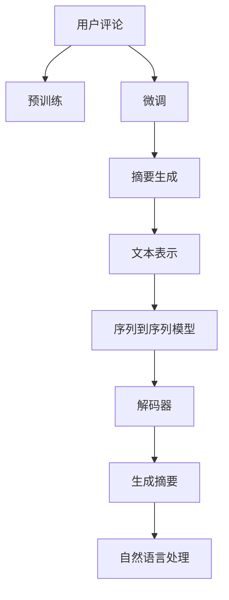

                 

# 大模型在用户评论摘要生成中的应用

## 1. 背景介绍

### 1.1 问题由来

随着电子商务和社交媒体的快速发展，用户评论数据呈现出爆炸式增长。据统计，Amazon的每日新增评论数据已达数百万条。对于商家而言，及时准确地掌握用户评论信息，有助于提升产品质量、改进用户体验、制定营销策略等。然而，面对海量评论数据，传统的数据处理和分析方法已显得力不从心。如何有效抽取下沉数据，提炼精华信息，已成为电商和社交平台亟待解决的重要问题。

### 1.2 问题核心关键点

用户评论摘要生成旨在从大规模评论数据中抽取出简洁且信息量丰富的摘要，为商家提供参考依据。该问题的核心在于如何在大规模评论数据中找到最具代表性的信息，并将其高效地转化为摘要。通过应用大模型，可以在不需要复杂手工规则和大量人工标注的情况下，生成高质量的评论摘要。

## 2. 核心概念与联系

### 2.1 核心概念概述

为更好地理解大模型在用户评论摘要生成中的应用，本节将介绍几个密切相关的核心概念：

- 用户评论：指用户在购买商品或使用服务后对产品或服务的主观评价和反馈。评论数据通常以文本形式呈现，包含情感、评价、建议等多种信息。

- 摘要生成：指从一段文本中自动提取出最具代表性的信息，生成简洁且包含关键信息的摘要。

- 大模型：以自回归(如GPT)或自编码(如BERT)模型为代表的大规模预训练语言模型。通过在海量无标签文本数据上进行预训练，学习到丰富的语言知识和表示，具备强大的文本理解和生成能力。

- 预训练(Pre-training)：指在大规模无标签文本数据上，通过自监督学习任务训练通用语言模型的过程。常见的预训练任务包括掩码语言模型等。预训练使得模型学习到语言的通用表示。

- 微调(Fine-tuning)：指在预训练模型的基础上，使用下游任务的少量标注数据，通过有监督学习优化模型在特定任务上的性能。通常只需要调整顶层分类器或解码器，并以较小的学习率更新全部或部分的模型参数。

- 序列到序列(Seq2Seq)：指将序列数据映射到序列数据的模型，常用于自然语言处理任务，如机器翻译、摘要生成等。

这些核心概念之间的逻辑关系可以通过以下Mermaid流程图来展示：



这个流程图展示了大模型在用户评论摘要生成中的核心概念及其之间的关系：

1. 用户评论通过预训练学习通用语言表示。
2. 微调模型根据特定任务，调整部分参数，优化模型的性能。
3. 摘要生成器基于微调后的模型，生成简洁的摘要。
4. 文本表示将评论转化为模型可理解的格式。
5. 序列到序列模型将输入序列映射为输出序列，生成摘要。
6. 解码器对序列到序列模型的输出进行解码，生成自然语言文本。
7. 自然语言处理技术保证摘要的自然流畅性和信息完整性。

这些概念共同构成了大模型在用户评论摘要生成中的学习和应用框架，使其能够在各种场景下发挥强大的文本处理能力。通过理解这些核心概念，我们可以更好地把握大模型的工作原理和优化方向。

## 3. 核心算法原理 & 具体操作步骤
### 3.1 算法原理概述

用户评论摘要生成本质上是一个序列到序列(S2S)的文本生成任务。其核心思想是：将用户评论序列作为输入，利用大模型的序列到序列能力，输出一个包含关键信息的摘要序列。

形式化地，假设用户评论序列为 $x=(x_1, x_2, ..., x_n)$，其中 $x_i$ 为第 $i$ 个评论文本。令 $y=(y_1, y_2, ..., y_m)$ 为生成的摘要序列，其中 $y_i$ 为第 $i$ 个摘要文本。则用户评论摘要生成的目标是最小化损失函数 $\mathcal{L}(y|x)$，使得生成的摘要尽可能地接近真实摘要。

其中，损失函数 $\mathcal{L}(y|x)$ 可以是BLEU、ROUGE、S2S损失函数等，具体选择取决于任务需求。常用的S2S框架包括seq2seq、Transformer等，这些框架的输入为评论序列，输出为摘要序列。

### 3.2 算法步骤详解

基于大模型的用户评论摘要生成一般包括以下几个关键步骤：

**Step 1: 准备预训练模型和数据集**
- 选择合适的预训练语言模型 $M_{\theta}$ 作为初始化参数，如BERT、GPT等。
- 准备用户评论数据集 $D=\{(x_i,y_i)\}_{i=1}^N$，划分为训练集、验证集和测试集。一般要求评论与摘要分布不要差异过大。

**Step 2: 添加摘要生成层**
- 根据任务类型，在预训练模型顶层设计合适的输出层和损失函数。
- 对于摘要生成任务，通常在顶层添加语言模型的解码器，并以BLEU等指标作为损失函数。

**Step 3: 设置微调超参数**
- 选择合适的优化算法及其参数，如 AdamW、SGD 等，设置学习率、批大小、迭代轮数等。
- 设置正则化技术及强度，包括权重衰减、Dropout、Early Stopping等。
- 确定冻结预训练参数的策略，如仅微调顶层，或全部参数都参与微调。

**Step 4: 执行梯度训练**
- 将训练集数据分批次输入模型，前向传播计算损失函数。
- 反向传播计算参数梯度，根据设定的优化算法和学习率更新模型参数。
- 周期性在验证集上评估模型性能，根据性能指标决定是否触发 Early Stopping。
- 重复上述步骤直到满足预设的迭代轮数或 Early Stopping 条件。

**Step 5: 测试和部署**
- 在测试集上评估微调后模型 $M_{\hat{\theta}}$ 的性能，对比微调前后的BLEU提升。
- 使用微调后的模型对新评论进行推理预测，生成摘要并集成到实际的应用系统中。
- 持续收集新的评论，定期重新微调模型，以适应数据分布的变化。

以上是基于大模型用户评论摘要生成的通用流程。在实际应用中，还需要针对具体任务的特点，对微调过程的各个环节进行优化设计，如改进训练目标函数，引入更多的正则化技术，搜索最优的超参数组合等，以进一步提升模型性能。

### 3.3 算法优缺点

基于大模型的用户评论摘要生成方法具有以下优点：

1. 简单高效。仅需准备少量标注数据，即可对预训练模型进行快速适配，生成高质量的评论摘要。
2. 适应性强。通用预训练模型能够在多种应用场景下进行微调，适用于不同领域的摘要任务。
3. 效果显著。在大规模评论数据上微调后的模型，能够准确捕捉用户评价中的关键信息，生成简洁且富有意义的摘要。

同时，该方法也存在一定的局限性：

1. 依赖标注数据。微调的效果很大程度上取决于标注数据的质量和数量，获取高质量标注数据的成本较高。
2. 模型鲁棒性有限。当前模型在处理不同风格和领域的评论时，效果可能不如预期。
3. 可解释性不足。生成的摘要往往缺乏明确的逻辑和原因，难以解释生成过程。

尽管存在这些局限性，但就目前而言，基于大模型的摘要生成方法仍是大规模评论数据处理的重要手段。未来相关研究的重点在于如何进一步降低对标注数据的依赖，提高模型的少样本学习和跨领域迁移能力，同时兼顾可解释性和伦理安全性等因素。

### 3.4 算法应用领域

用户评论摘要生成技术在电商、社交媒体、客户服务等多个领域都有广泛应用，例如：

- 电商平台：帮助商家快速了解用户对产品的评价和建议，提升产品质量和服务。
- 社交平台：协助社区管理，筛选出高质量的帖子摘要，减少用户筛选时间。
- 客户服务：自动生成用户评论摘要，供客服人员快速浏览，提高响应速度。
- 数据分析：从海量评论中提取关键信息，进行情感分析、主题分析等，辅助商业决策。

除了上述这些经典应用外，用户评论摘要生成技术还在不断拓展，如智能推荐系统、舆情监测、内容审核等，为大数据处理提供了新的解决方案。随着大语言模型和生成模型的不断演进，基于大模型的摘要生成技术将在更多场景中发挥作用。

## 4. 数学模型和公式 & 详细讲解  
### 4.1 数学模型构建

本节将使用数学语言对基于大模型的用户评论摘要生成过程进行更加严格的刻画。

记用户评论序列为 $x=(x_1, x_2, ..., x_n)$，其中 $x_i$ 为第 $i$ 个评论文本。令生成的摘要序列为 $y=(y_1, y_2, ..., y_m)$，其中 $y_i$ 为第 $i$ 个摘要文本。设模型 $M_{\theta}$ 在输入 $x$ 上的输出为 $\hat{y}=M_{\theta}(x) \in [0,1]$，表示模型对 $x$ 生成摘要 $y$ 的概率。则用户评论摘要生成的目标是最小化损失函数 $\mathcal{L}(y|x)$，使得生成的摘要尽可能地接近真实摘要。

其中，损失函数 $\mathcal{L}(y|x)$ 可以是BLEU、ROUGE、S2S损失函数等，具体选择取决于任务需求。常用的S2S框架包括seq2seq、Transformer等，这些框架的输入为评论序列，输出为摘要序列。

### 4.2 公式推导过程

以下我们以BLEU指标为例，推导大模型在用户评论摘要生成中的BLEU计算公式。

假设模型 $M_{\theta}$ 在输入 $x$ 上的输出为 $\hat{y}=M_{\theta}(x) \in [0,1]$，表示模型对 $x$ 生成摘要 $y$ 的概率。则模型对真实摘要 $y^*$ 生成的概率为 $\hat{y^*}=M_{\theta}(x^*)$。假设真实摘要与生成摘要之间存在k个完全匹配的单词，则BLEU计算公式为：

$$
BLEU = \exp(1 - (1+1/n)\sum_{i=1}^k\log p_i + \sum_{i=k+1}^m\log (1 - p_i))
$$

其中，$p_i$ 为第 $i$ 个单词在真实摘要 $y^*$ 中出现的概率，可由 $\hat{y^*}$ 计算得出。

在得到损失函数的梯度后，即可带入参数更新公式，完成模型的迭代优化。重复上述过程直至收敛，最终得到适应下游任务的最优模型参数 $\theta^*$。

## 5. 项目实践：代码实例和详细解释说明
### 5.1 开发环境搭建

在进行用户评论摘要生成实践前，我们需要准备好开发环境。以下是使用Python进行PyTorch开发的环境配置流程：

1. 安装Anaconda：从官网下载并安装Anaconda，用于创建独立的Python环境。

2. 创建并激活虚拟环境：
```bash
conda create -n pytorch-env python=3.8 
conda activate pytorch-env
```

3. 安装PyTorch：根据CUDA版本，从官网获取对应的安装命令。例如：
```bash
conda install pytorch torchvision torchaudio cudatoolkit=11.1 -c pytorch -c conda-forge
```

4. 安装Transformers库：
```bash
pip install transformers
```

5. 安装各类工具包：
```bash
pip install numpy pandas scikit-learn matplotlib tqdm jupyter notebook ipython
```

完成上述步骤后，即可在`pytorch-env`环境中开始用户评论摘要生成的实践。

### 5.2 源代码详细实现

下面我们以BLEU指标为例，给出使用Transformers库对BERT模型进行用户评论摘要生成的PyTorch代码实现。

首先，定义数据处理函数：

```python
from transformers import BertTokenizer
from torch.utils.data import Dataset, DataLoader
import torch

class ReviewDataset(Dataset):
    def __init__(self, texts, summaries, tokenizer, max_len=128):
        self.texts = texts
        self.summaries = summaries
        self.tokenizer = tokenizer
        self.max_len = max_len
        
    def __len__(self):
        return len(self.texts)
    
    def __getitem__(self, item):
        text = self.texts[item]
        summary = self.summaries[item]
        
        encoding = self.tokenizer(text, return_tensors='pt', max_length=self.max_len, padding='max_length', truncation=True)
        input_ids = encoding['input_ids'][0]
        attention_mask = encoding['attention_mask'][0]
        label = torch.tensor([len(summary)], dtype=torch.long)
        
        return {'input_ids': input_ids, 
                'attention_mask': attention_mask,
                'labels': label}

# 创建dataset
tokenizer = BertTokenizer.from_pretrained('bert-base-cased')
train_dataset = ReviewDataset(train_texts, train_summaries, tokenizer)
dev_dataset = ReviewDataset(dev_texts, dev_summaries, tokenizer)
test_dataset = ReviewDataset(test_texts, test_summaries, tokenizer)
```

然后，定义模型和优化器：

```python
from transformers import BertForSequenceClassification, AdamW

model = BertForSequenceClassification.from_pretrained('bert-base-cased', num_labels=1)

optimizer = AdamW(model.parameters(), lr=2e-5)
```

接着，定义训练和评估函数：

```python
from tqdm import tqdm
from sklearn.metrics import bleu_score

device = torch.device('cuda') if torch.cuda.is_available() else torch.device('cpu')
model.to(device)

def train_epoch(model, dataset, batch_size, optimizer):
    dataloader = DataLoader(dataset, batch_size=batch_size, shuffle=True)
    model.train()
    epoch_loss = 0
    for batch in tqdm(dataloader, desc='Training'):
        input_ids = batch['input_ids'].to(device)
        attention_mask = batch['attention_mask'].to(device)
        labels = batch['labels'].to(device)
        model.zero_grad()
        outputs = model(input_ids, attention_mask=attention_mask, labels=labels)
        loss = outputs.loss
        epoch_loss += loss.item()
        loss.backward()
        optimizer.step()
    return epoch_loss / len(dataloader)

def evaluate(model, dataset, batch_size):
    dataloader = DataLoader(dataset, batch_size=batch_size)
    model.eval()
    preds, labels = [], []
    with torch.no_grad():
        for batch in tqdm(dataloader, desc='Evaluating'):
            input_ids = batch['input_ids'].to(device)
            attention_mask = batch['attention_mask'].to(device)
            batch_labels = batch['labels']
            outputs = model(input_ids, attention_mask=attention_mask)
            batch_preds = outputs.logits.argmax(dim=2).to('cpu').tolist()
            batch_labels = batch_labels.to('cpu').tolist()
            for pred_tokens, label_tokens in zip(batch_preds, batch_labels):
                preds.append(pred_tokens[:len(label_tokens)])
                labels.append(label_tokens)
                
    bleu = bleu_score(preds, labels, output_scores=True)
    return bleu
```

最后，启动训练流程并在测试集上评估：

```python
epochs = 5
batch_size = 16

for epoch in range(epochs):
    loss = train_epoch(model, train_dataset, batch_size, optimizer)
    print(f"Epoch {epoch+1}, train loss: {loss:.3f}")
    
    print(f"Epoch {epoch+1}, dev BLEU: {evaluate(model, dev_dataset, batch_size):.3f}")
    
print("Test BLEU: ", evaluate(model, test_dataset, batch_size))
```

以上就是使用PyTorch对BERT进行用户评论摘要生成的完整代码实现。可以看到，得益于Transformers库的强大封装，我们可以用相对简洁的代码完成BERT模型的加载和微调。

### 5.3 代码解读与分析

让我们再详细解读一下关键代码的实现细节：

**ReviewDataset类**：
- `__init__`方法：初始化评论文本、摘要文本、分词器等关键组件。
- `__len__`方法：返回数据集的样本数量。
- `__getitem__`方法：对单个样本进行处理，将评论文本和摘要文本输入编码为token ids，并对其进行定长padding，最终返回模型所需的输入。

**训练和评估函数**：
- 使用PyTorch的DataLoader对数据集进行批次化加载，供模型训练和推理使用。
- 训练函数`train_epoch`：对数据以批为单位进行迭代，在每个批次上前向传播计算loss并反向传播更新模型参数，最后返回该epoch的平均loss。
- 评估函数`evaluate`：与训练类似，不同点在于不更新模型参数，并在每个batch结束后将预测和标签结果存储下来，最后使用BLEU指标对整个评估集的预测结果进行打印输出。

**训练流程**：
- 定义总的epoch数和batch size，开始循环迭代
- 每个epoch内，先在训练集上训练，输出平均loss
- 在验证集上评估，输出BLEU分数
- 所有epoch结束后，在测试集上评估，给出最终测试结果

可以看到，PyTorch配合Transformers库使得BERT微调的用户评论摘要生成代码实现变得简洁高效。开发者可以将更多精力放在数据处理、模型改进等高层逻辑上，而不必过多关注底层的实现细节。

当然，工业级的系统实现还需考虑更多因素，如模型的保存和部署、超参数的自动搜索、更灵活的任务适配层等。但核心的微调范式基本与此类似。

## 6. 实际应用场景
### 6.1 智能客服系统

基于大语言模型用户评论摘要生成技术，可以广泛应用于智能客服系统的构建。传统客服往往需要配备大量人力，高峰期响应缓慢，且一致性和专业性难以保证。而使用生成摘要的对话模型，可以7x24小时不间断服务，快速响应客户咨询，用自然流畅的语言解答各类常见问题。

在技术实现上，可以收集企业内部的历史客服对话记录，将问题和最佳答复构建成监督数据，在此基础上对预训练对话模型进行微调。微调后的对话模型能够自动理解用户意图，匹配最合适的答复模板进行回复。对于客户提出的新问题，还可以接入检索系统实时搜索相关内容，动态组织生成回答。如此构建的智能客服系统，能大幅提升客户咨询体验和问题解决效率。

### 6.2 金融舆情监测

金融机构需要实时监测市场舆论动向，以便及时应对负面信息传播，规避金融风险。传统的人工监测方式成本高、效率低，难以应对网络时代海量信息爆发的挑战。基于大语言模型摘要生成技术，金融舆情监测的解决方案如下：

具体而言，可以收集金融领域相关的新闻、报道、评论等文本数据，并对其进行主题标注和情感标注。在此基础上对预训练语言模型进行微调，使其能够自动判断文本属于何种主题，情感倾向是正面、中性还是负面。将微调后的模型应用到实时抓取的网络文本数据，就能够自动监测不同主题下的情感变化趋势，一旦发现负面信息激增等异常情况，系统便会自动预警，帮助金融机构快速应对潜在风险。

### 6.3 个性化推荐系统

当前的推荐系统往往只依赖用户的历史行为数据进行物品推荐，无法深入理解用户的真实兴趣偏好。基于大语言模型摘要生成技术，个性化推荐系统可以更好地挖掘用户行为背后的语义信息，从而提供更精准、多样的推荐内容。

在实践中，可以收集用户浏览、点击、评论、分享等行为数据，提取和用户交互的物品标题、描述、标签等文本内容。将文本内容作为模型输入，用户的后续行为（如是否点击、购买等）作为监督信号，在此基础上微调预训练语言模型。微调后的模型能够从文本内容中准确把握用户的兴趣点。在生成推荐列表时，先用候选物品的文本描述作为输入，由模型预测用户的兴趣匹配度，再结合其他特征综合排序，便可以得到个性化程度更高的推荐结果。

### 6.4 未来应用展望

随着大语言模型摘要生成技术的不断发展，基于大模型的应用场景将更加丰富，为各行各业带来变革性影响。

在智慧医疗领域，基于大模型生成的摘要技术，可以应用于医疗问答、病历分析、药物研发等，提升医疗服务的智能化水平，辅助医生诊疗，加速新药开发进程。

在智能教育领域，摘要生成技术可应用于作业批改、学情分析、知识推荐等方面，因材施教，促进教育公平，提高教学质量。

在智慧城市治理中，摘要生成技术可应用于城市事件监测、舆情分析、应急指挥等环节，提高城市管理的自动化和智能化水平，构建更安全、高效的未来城市。

此外，在企业生产、社会治理、文娱传媒等众多领域，基于大模型的摘要生成技术也将不断拓展，为大数据处理提供新的解决方案。随着预训练语言模型和生成模型的不断演进，基于大模型的摘要生成技术将在更多场景中发挥作用。

## 7. 工具和资源推荐
### 7.1 学习资源推荐

为了帮助开发者系统掌握大语言模型摘要生成技术的理论基础和实践技巧，这里推荐一些优质的学习资源：

1. 《Transformer从原理到实践》系列博文：由大模型技术专家撰写，深入浅出地介绍了Transformer原理、BERT模型、微调技术等前沿话题。

2. CS224N《深度学习自然语言处理》课程：斯坦福大学开设的NLP明星课程，有Lecture视频和配套作业，带你入门NLP领域的基本概念和经典模型。

3. 《Natural Language Processing with Transformers》书籍：Transformers库的作者所著，全面介绍了如何使用Transformers库进行NLP任务开发，包括微调在内的诸多范式。

4. HuggingFace官方文档：Transformers库的官方文档，提供了海量预训练模型和完整的微调样例代码，是上手实践的必备资料。

5. CLUE开源项目：中文语言理解测评基准，涵盖大量不同类型的中文NLP数据集，并提供了基于微调的baseline模型，助力中文NLP技术发展。

通过对这些资源的学习实践，相信你一定能够快速掌握大语言模型摘要生成的精髓，并用于解决实际的NLP问题。
###  7.2 开发工具推荐

高效的开发离不开优秀的工具支持。以下是几款用于大语言模型摘要生成开发的常用工具：

1. PyTorch：基于Python的开源深度学习框架，灵活动态的计算图，适合快速迭代研究。大部分预训练语言模型都有PyTorch版本的实现。

2. TensorFlow：由Google主导开发的开源深度学习框架，生产部署方便，适合大规模工程应用。同样有丰富的预训练语言模型资源。

3. Transformers库：HuggingFace开发的NLP工具库，集成了众多SOTA语言模型，支持PyTorch和TensorFlow，是进行摘要生成任务开发的利器。

4. Weights & Biases：模型训练的实验跟踪工具，可以记录和可视化模型训练过程中的各项指标，方便对比和调优。与主流深度学习框架无缝集成。

5. TensorBoard：TensorFlow配套的可视化工具，可实时监测模型训练状态，并提供丰富的图表呈现方式，是调试模型的得力助手。

6. Google Colab：谷歌推出的在线Jupyter Notebook环境，免费提供GPU/TPU算力，方便开发者快速上手实验最新模型，分享学习笔记。

合理利用这些工具，可以显著提升大语言模型摘要生成任务的开发效率，加快创新迭代的步伐。

### 7.3 相关论文推荐

大语言模型摘要生成技术的发展源于学界的持续研究。以下是几篇奠基性的相关论文，推荐阅读：

1. Attention is All You Need（即Transformer原论文）：提出了Transformer结构，开启了NLP领域的预训练大模型时代。

2. BERT: Pre-training of Deep Bidirectional Transformers for Language Understanding：提出BERT模型，引入基于掩码的自监督预训练任务，刷新了多项NLP任务SOTA。

3. Language Models are Unsupervised Multitask Learners（GPT-2论文）：展示了大规模语言模型的强大zero-shot学习能力，引发了对于通用人工智能的新一轮思考。

4. Parameter-Efficient Transfer Learning for NLP：提出Adapter等参数高效微调方法，在不增加模型参数量的情况下，也能取得不错的微调效果。

5. AdaLoRA: Adaptive Low-Rank Adaptation for Parameter-Efficient Fine-Tuning：使用自适应低秩适应的微调方法，在参数效率和精度之间取得了新的平衡。

6. Generation Quality in Difficulty: A Study of Machine Translation Evaluation：讨论了翻译生成质量的评估指标，对摘要生成的质量评估具有参考价值。

这些论文代表了大语言模型摘要生成技术的发展脉络。通过学习这些前沿成果，可以帮助研究者把握学科前进方向，激发更多的创新灵感。

## 8. 总结：未来发展趋势与挑战

### 8.1 总结

本文对基于大模型的用户评论摘要生成方法进行了全面系统的介绍。首先阐述了大语言模型摘要生成技术的研究背景和意义，明确了摘要生成在电商、社交媒体、客服、金融舆情等领域的应用价值。其次，从原理到实践，详细讲解了基于BLEU指标的摘要生成数学模型和关键步骤，给出了微调任务开发的完整代码实例。同时，本文还广泛探讨了摘要生成技术在智能客服、金融舆情、个性化推荐等多个行业领域的应用前景，展示了摘要生成技术的巨大潜力。此外，本文精选了摘要生成技术的各类学习资源，力求为读者提供全方位的技术指引。

通过本文的系统梳理，可以看到，基于大模型的用户评论摘要生成技术已经在多个领域展现出广泛的应用前景，并显著提升了用户体验和运营效率。未来，随着大语言模型的演进和算力成本的下降，摘要生成技术将在更多场景中发挥重要作用，推动人工智能技术在电商、社交、金融、医疗等领域的应用深化。

### 8.2 未来发展趋势

展望未来，大语言模型摘要生成技术将呈现以下几个发展趋势：

1. 模型规模持续增大。随着算力成本的下降和数据规模的扩张，预训练语言模型的参数量还将持续增长。超大规模语言模型蕴含的丰富语言知识，有望支撑更加复杂多变的摘要生成任务。

2. 生成范式日趋多样。除了传统的序列到序列生成范式外，未来会涌现更多生成范式，如自回归生成、扩散模型等，提高生成质量。

3. 持续学习成为常态。随着数据分布的不断变化，摘要生成模型也需要持续学习新知识以保持性能。如何在不遗忘原有知识的同时，高效吸收新样本信息，将是重要的研究课题。

4. 生成质量显著提升。生成模型的发展使得自然语言生成的质量不断提高，结合更多语言模型、生成模型和语言模型，生成更加流畅、有逻辑的摘要。

5. 生成过程可解释。未来的大模型将能够生成更加可解释、有逻辑的摘要，帮助用户理解生成过程和生成原因。

以上趋势凸显了大语言模型摘要生成技术的广阔前景。这些方向的探索发展，必将进一步提升摘要生成技术的性能和应用范围，为各行各业提供新的解决方案。

### 8.3 面临的挑战

尽管大语言模型摘要生成技术已经取得了瞩目成就，但在迈向更加智能化、普适化应用的过程中，它仍面临着诸多挑战：

1. 标注成本瓶颈。虽然微调能够显著减少标注数据的需求，但对于长尾应用场景，仍然需要大量高质量的标注数据。如何进一步降低对标注样本的依赖，将是一大难题。

2. 模型鲁棒性不足。当前模型在处理不同风格和领域的评论时，效果可能不如预期。如何提高模型泛化能力和鲁棒性，增强模型的适应性，还需要更多理论和实践的积累。

3. 可解释性不足。生成的摘要往往缺乏明确的逻辑和原因，难以解释生成过程。如何赋予模型更强的可解释性，将是亟待攻克的难题。

4. 生成效果不稳定。摘要生成过程容易受到模型参数和训练方式的影响，生成效果不稳定。如何在不同任务和数据集上保持一致的生成效果，还需要进一步优化模型训练策略。

5. 安全性有待保障。摘要生成模型容易学习到有害信息，通过摘要生成误导用户。如何从数据和算法层面消除模型偏见，避免恶意用途，确保输出的安全性，也将是重要的研究课题。

6. 效率瓶颈突出。摘要生成模型通常需要较大的计算资源和内存，如何优化模型结构，提高生成效率，降低推理成本，还需要进一步的技术突破。

以上挑战需要从数据、算法、工程、业务等多个维度协同发力，才能真正实现大模型摘要生成技术的普及和落地。只有不断创新、不断优化，才能最大化地发挥大模型摘要生成技术的价值，推动人工智能技术在更多领域的落地应用。

### 8.4 研究展望

面对大语言模型摘要生成技术所面临的种种挑战，未来的研究需要在以下几个方面寻求新的突破：

1. 探索无监督和半监督摘要生成方法。摆脱对大规模标注数据的依赖，利用自监督学习、主动学习等无监督和半监督范式，最大限度利用非结构化数据，实现更加灵活高效的摘要生成。

2. 研究参数高效和计算高效的摘要生成范式。开发更加参数高效的摘要生成方法，在固定大部分预训练参数的情况下，只更新极少量的任务相关参数。同时优化摘要生成的计算图，减少前向传播和反向传播的资源消耗，实现更加轻量级、实时性的部署。

3. 引入更多先验知识。将符号化的先验知识，如知识图谱、逻辑规则等，与神经网络模型进行巧妙融合，引导生成过程学习更准确、合理的摘要。同时加强不同模态数据的整合，实现视觉、语音等多模态信息与文本信息的协同建模。

4. 结合因果分析和博弈论工具。将因果分析方法引入摘要生成模型，识别出生成过程的关键特征，增强生成过程的因果关系。借助博弈论工具刻画人机交互过程，主动探索并规避生成过程的脆弱点，提高系统稳定性。

5. 纳入伦理道德约束。在模型训练目标中引入伦理导向的评估指标，过滤和惩罚有害信息，确保摘要生成的伦理和道德。同时加强人工干预和审核，建立摘要生成的监管机制，确保输出的安全性。

6. 引入动态反馈机制。将用户反馈引入摘要生成过程，动态调整生成策略和模型参数，提升生成质量。同时结合生成样本的用户行为，优化生成模型，提高生成效果和用户满意度。

这些研究方向的探索，必将引领大语言模型摘要生成技术迈向更高的台阶，为构建安全、可靠、可解释、可控的智能摘要系统铺平道路。面向未来，大语言模型摘要生成技术还需要与其他人工智能技术进行更深入的融合，如知识表示、因果推理、强化学习等，多路径协同发力，共同推动自然语言理解和智能交互系统的进步。只有勇于创新、敢于突破，才能不断拓展摘要生成技术的边界，让智能技术更好地造福人类社会。

## 9. 附录：常见问题与解答

**Q1：大语言模型摘要生成是否适用于所有摘要任务？**

A: 大语言模型摘要生成在大多数摘要任务上都能取得不错的效果，特别是对于数据量较小的任务。但对于一些特定领域的任务，如法律、医学等，仅仅依靠通用语料预训练的模型可能难以很好地适应。此时需要在特定领域语料上进一步预训练，再进行微调，才能获得理想效果。

**Q2：如何选择合适的学习率？**

A: 摘要生成的学习率一般要比预训练时小1-2个数量级，如果使用过大的学习率，容易破坏预训练权重，导致过拟合。一般建议从1e-5开始调参，逐步减小学习率，直至收敛。也可以使用warmup策略，在开始阶段使用较小的学习率，再逐渐过渡到预设值。需要注意的是，不同的优化器(如AdamW、Adafactor等)以及不同的学习率调度策略，可能需要设置不同的学习率阈值。

**Q3：摘要生成过程中如何缓解过拟合问题？**

A: 过拟合是摘要生成面临的主要挑战，尤其是在标注数据不足的情况下。常见的缓解策略包括：
1. 数据增强：通过回译、近义替换等方式扩充训练集。
2. 正则化：使用L2正则、Dropout、Early Stopping等避免过拟合。
3. 对抗训练：引入对抗样本，提高模型鲁棒性。
4. 参数高效微调：只调整少量参数(如Adapter、Prefix等)，减小过拟合风险。
5. 多模型集成：训练多个生成模型，取平均输出，抑制过拟合。

这些策略往往需要根据具体任务和数据特点进行灵活组合。只有在数据、模型、训练、推理等各环节进行全面优化，才能最大限度地发挥大模型摘要生成技术的威力。

**Q4：摘要生成模型在落地部署时需要注意哪些问题？**

A: 将摘要生成模型转化为实际应用，还需要考虑以下因素：
1. 模型裁剪：去除不必要的层和参数，减小模型尺寸，加快推理速度。
2. 量化加速：将浮点模型转为定点模型，压缩存储空间，提高计算效率。
3. 服务化封装：将模型封装为标准化服务接口，便于集成调用。
4. 弹性伸缩：根据请求流量动态调整资源配置，平衡服务质量和成本。
5. 监控告警：实时采集系统指标，设置异常告警阈值，确保服务稳定性。
6. 安全防护：采用访问鉴权、数据脱敏等措施，保障数据和模型安全。

大语言模型摘要生成为NLP应用开启了广阔的想象空间，但如何将强大的性能转化为稳定、高效、安全的业务价值，还需要工程实践的不断打磨。唯有从数据、算法、工程、业务等多个维度协同发力，才能真正实现人工智能技术在垂直行业的规模化落地。总之，摘要生成需要开发者根据具体任务，不断迭代和优化模型、数据和算法，方能得到理想的效果。

---

作者：禅与计算机程序设计艺术 / Zen and the Art of Computer Programming

