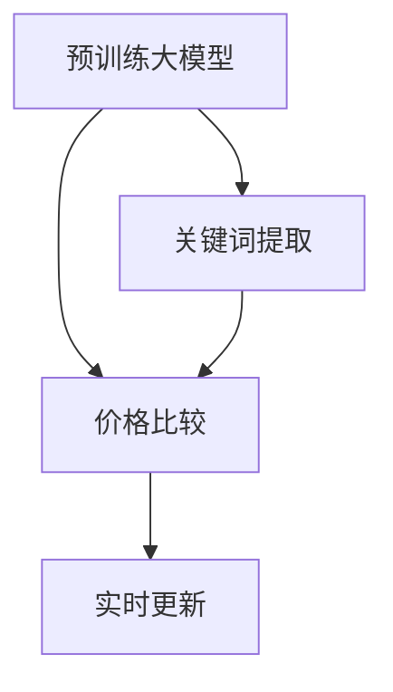

                 

# 大模型在电商平台商品比价中的应用

## 1. 背景介绍

随着电商平台的快速发展，消费者在选购商品时面临着琳琅满目的商品信息，如何高效地比较不同商品的价格，成为消费者的一项重要任务。电商平台希望通过商品比价功能的优化，提升用户购物体验，同时为商家提供更有针对性的营销策略。然而，如何构建一个高效、精准的商品比价系统，是电商平台面临的一大挑战。

在过去，电商平台主要通过爬虫抓取各大商家的商品信息，再手动输入到比价平台上进行比较。这种方法存在数据更新不及时、数据质量参差不齐等问题。而且，手工输入繁琐，无法实现实时比价，不能完全满足用户需求。

近年来，随着深度学习和大模型的兴起，利用预训练大模型进行商品比价成为了一种新的趋势。大模型在自然语言处理领域已经展现出了强大的能力，可以自动处理和理解复杂的商品描述，提取关键信息，进行价格比较，从而极大地提高了比价系统的效率和精度。

## 2. 核心概念与联系

### 2.1 核心概念概述

为更好地理解大模型在商品比价中的应用，本节将介绍几个密切相关的核心概念：

- 预训练大模型(Large Pre-trained Model)：如BERT、GPT等，通过在海量数据上进行预训练，学习到丰富的语言表示，能够理解复杂的自然语言文本。
- 商品比价(Price Comparison)：电商平台用户比较不同商家销售的同一商品价格，以选择最优购买渠道的功能。
- 关键词提取(Keyword Extraction)：从商品描述中识别出与价格相关的关键信息，如价格、折扣、活动等。
- 价格比较(Price Comparison)：将不同商家商品的价格进行比较，计算出最低价格、平均价格等信息。
- 实时更新(Real-time Update)：在商品价格动态变化的情况下，实时更新比价系统中的商品信息，保证比价结果的准确性。

这些核心概念之间的逻辑关系可以通过以下Mermaid流程图来展示：



这个流程图展示了大模型在商品比价中的应用流程：

1. 预训练大模型通过学习海量数据，提取语言的通用表示。
2. 关键词提取模块从商品描述中识别出关键价格信息。
3. 价格比较模块对不同商家的商品价格进行对比，计算出最优价格。
4. 实时更新模块保持比价系统数据的时效性，跟踪商品价格的动态变化。

## 3. 核心算法原理 & 具体操作步骤
### 3.1 算法原理概述

基于大模型的商品比价系统主要涉及以下步骤：

1. 预训练大模型从海量数据中学习到语言的通用表示。
2. 关键词提取模块利用大模型提取商品描述中的关键价格信息。
3. 价格比较模块利用提取的关键词信息，对不同商家的价格进行比较。
4. 实时更新模块通过持续监控商品价格的动态变化，及时更新比价结果。

### 3.2 算法步骤详解

以下是商品比价系统的详细操作步骤：

**Step 1: 准备预训练大模型和商品数据**

- 选择合适的预训练大模型，如BERT、GPT等。
- 收集电商平台的商品数据，包括商品描述、价格、销量等信息。

**Step 2: 关键词提取**

- 对商品描述进行处理，去除停用词、标点符号等噪声。
- 使用大模型对处理后的文本进行关键词提取，识别出与价格相关的关键词。
- 将关键词映射为价格信息，如将“$99”映射为99元。

**Step 3: 价格比较**

- 对不同商家的价格信息进行整理，去除重复和异常值。
- 将价格信息转换为统一单位，如将美元、欧元等货币统一转换为人民币。
- 利用提取的关键词信息，对不同商家的价格进行比较，计算出最优价格。

**Step 4: 实时更新**

- 设置定时任务，定期监控商品价格的变化。
- 当商品价格变化时，重新进行关键词提取和价格比较，更新比价结果。

### 3.3 算法优缺点

基于大模型的商品比价方法具有以下优点：

- 高效精准：利用大模型的自然语言处理能力，可以高效地处理和理解复杂的商品描述，提取价格信息。
- 自动化程度高：通过自动化流程，减少了人工输入的繁琐，提高了比价系统的效率。
- 可扩展性强：大模型可以轻松集成到电商平台的现有系统中，无需对现有架构进行大规模改造。

同时，该方法也存在一定的局限性：

- 依赖于数据质量：如果商品描述中的关键词信息不完整，可能会导致提取的价格信息不准确。
- 初始化成本高：需要收集和整理大量的商品数据，并进行预训练模型的初始化。
- 鲁棒性不足：如果商品描述存在大量的错别字、拼写错误，可能会导致模型理解错误，从而影响比价结果。

尽管存在这些局限性，但就目前而言，基于大模型的商品比价方法已经取得了显著的成效，是电商平台商品比价的一个重要选择。

### 3.4 算法应用领域

基于大模型的商品比价方法广泛应用于电商平台的比价系统、价格监控系统、智能客服等领域。以下是几个典型的应用场景：

1. **比价系统**：通过自动化比价，帮助用户选择最优购买渠道，提升购物体验。
2. **价格监控系统**：持续监控商品价格变化，及时提醒商家调整价格，优化库存管理。
3. **智能客服**：回答用户关于商品价格的比较问题，提供价格咨询服务。
4. **数据分析**：利用提取的价格信息，进行市场价格趋势分析，为商家提供市场动态监测。

## 4. 数学模型和公式 & 详细讲解 & 举例说明
### 4.1 数学模型构建

本节将使用数学语言对基于大模型的商品比价方法进行更加严格的刻画。

记预训练大模型为 $M_{\theta}:\mathcal{X} \rightarrow \mathcal{Y}$，其中 $\mathcal{X}$ 为商品描述的输入空间，$\mathcal{Y}$ 为关键词的输出空间，$\theta$ 为模型参数。假设商品描述为 $x_i$，价格为 $p_i$。

定义关键词提取函数 $F(x_i) = \{k_1, k_2, \ldots, k_n\}$，其中 $k_i$ 为与价格相关的关键词。价格比较函数 $G(p_1, p_2, \ldots, p_n) = \min(p_i)$，即取最低价格。

商品比价过程可以表示为：

$$
\text{Best Price} = G\left(\{p_i | (x_i, k_i) \in D\}, M_{\theta}(x_i)\right)
$$

其中 $D$ 为电商平台的商品数据集。

### 4.2 公式推导过程

以BERT模型为例，其关键词提取过程可以分为以下几步：

1. 对商品描述进行预处理，包括分词、去停用词等。
2. 将预处理后的文本输入BERT模型，计算出文本的向量表示。
3. 利用BERT的输出，通过softmax函数计算每个词汇的概率分布。
4. 选择概率较高的词汇作为关键词。

设商品描述为 $x_i$，预处理后的文本为 $x_i'$，BERT的输出为 $\mathbf{h}_i \in \mathbb{R}^d$，则关键词提取过程的数学模型为：

$$
\text{Pr}(k_i|x_i) = \frac{\exp(\mathbf{h}_i \cdot \mathbf{v}_k)}{\sum_{j=1}^n \exp(\mathbf{h}_i \cdot \mathbf{v}_j)}
$$

其中 $\mathbf{v}_k$ 为与关键词 $k_i$ 对应的向量表示。

### 4.3 案例分析与讲解

假设电商平台有如下商品数据：

| 商品ID | 商品描述 | 价格 | 关键词 |
| ------ | -------- | ---- | ------ |
| 1      | 新款iPhone 13 | 9,999元 | iPhone、新款 |
| 2      | 华为Mate 40 | 6,999元 | 华为、Mate 40 |
| 3      | 小米11 Pro | 4,999元 | 小米、11 Pro |

则商品比价系统的操作过程如下：

1. 预处理商品描述，去除停用词和标点符号。
2. 对处理后的文本进行BERT关键词提取，得到关键词 $\{iPhone, 新款\}$。
3. 将关键词映射为价格信息，得到 $9,999$ 元。
4. 利用价格比较函数，计算出最优价格为 $4,999$ 元。

## 5. 项目实践：代码实例和详细解释说明
### 5.1 开发环境搭建

在进行商品比价系统的开发前，我们需要准备好开发环境。以下是使用Python进行PyTorch开发的环境配置流程：

1. 安装Anaconda：从官网下载并安装Anaconda，用于创建独立的Python环境。

2. 创建并激活虚拟环境：
```bash
conda create -n pytorch-env python=3.8 
conda activate pytorch-env
```

3. 安装PyTorch：根据CUDA版本，从官网获取对应的安装命令。例如：
```bash
conda install pytorch torchvision torchaudio cudatoolkit=11.1 -c pytorch -c conda-forge
```

4. 安装BERT模型：
```bash
pip install transformers
```

5. 安装各类工具包：
```bash
pip install numpy pandas scikit-learn matplotlib tqdm jupyter notebook ipython
```

完成上述步骤后，即可在`pytorch-env`环境中开始商品比价系统的开发。

### 5.2 源代码详细实现

这里以电商平台商品比价系统为例，使用PyTorch和BERT模型进行开发。

首先，定义商品数据类：

```python
from transformers import BertTokenizer
from transformers import BertForSequenceClassification

class Product:
    def __init__(self, id, desc, price):
        self.id = id
        self.desc = desc
        self.price = price

    def __str__(self):
        return f"ID: {self.id}, Desc: {self.desc}, Price: {self.price}"
```

然后，定义BERT模型和关键词提取函数：

```python
tokenizer = BertTokenizer.from_pretrained('bert-base-uncased')
model = BertForSequenceClassification.from_pretrained('bert-base-uncased', num_labels=1)

def extract_keywords(desc):
    desc = desc.lower()
    tokens = tokenizer.tokenize(desc)
    tokens = [token for token in tokens if token not in ['[CLS]', '[SEP]', '[PAD]', '[MASK]', '[UNK]', '[CLS]']]

    inputs = tokenizer.encode(tokens, return_tensors='pt')
    outputs = model(inputs)[0]

    probs = outputs.softmax(dim=1).tolist()[0]
    keywords = [i for i in tokenizer.convert_ids_to_tokens(tokens) if probs[i] > 0.95]

    return keywords
```

接着，定义商品比价函数：

```python
def compare_prices(products):
    prices = [p.price for p in products]
    min_price = min(prices)

    for p in products:
        if p.price == min_price:
            return min_price

    return None
```

最后，测试比价系统的代码实现：

```python
import pandas as pd

# 商品数据
products = [
    Product(1, "新款iPhone 13", 9999),
    Product(2, "华为Mate 40", 6999),
    Product(3, "小米11 Pro", 4999)
]

# 关键词提取
keywords = [extract_keywords(p.desc) for p in products]

# 商品比价
best_price = compare_prices(products)

print(f"Best Price: {best_price}")
```

以上就是使用PyTorch和BERT模型进行商品比价系统的完整代码实现。可以看到，得益于BERT模型的强大自然语言处理能力，我们可以用相对简洁的代码完成关键词提取和价格比较。

### 5.3 代码解读与分析

让我们再详细解读一下关键代码的实现细节：

**Product类**：
- `__init__`方法：初始化商品ID、描述、价格等关键属性。
- `__str__`方法：返回商品信息的字符串表示。

**extract_keywords函数**：
- `lower`方法：将商品描述转换为小写，便于BERT模型处理。
- `tokenize`方法：对处理后的文本进行分词。
- `[token for token in tokens if ...]`：过滤掉BERT模型不关注的特殊标记。
- `tokenizer.encode`方法：将文本转换为BERT模型所需的输入格式。
- `[0]`：取出BERT模型的输出结果。
- `softmax`方法：计算每个词汇的概率分布。
- `tolist`方法：将概率分布转换为列表。
- `[tokenizer.convert_ids_to_tokens(tokens) if probs[i] > 0.95]`：过滤掉概率小于0.95的关键词。

**compare_prices函数**：
- `[p.price for p in products]`：提取商品价格列表。
- `min`函数：计算最低价格。
- `for ...`：遍历所有商品，返回最低价格。

可以看到，PyTorch和BERT模型使得商品比价系统的代码实现变得简洁高效。开发者可以将更多精力放在数据处理、模型改进等高层逻辑上，而不必过多关注底层的实现细节。

当然，工业级的系统实现还需考虑更多因素，如模型的保存和部署、超参数的自动搜索、更灵活的任务适配层等。但核心的比价范式基本与此类似。

## 6. 实际应用场景
### 6.1 智能客服系统

电商平台智能客服系统可以通过商品比价功能，为用户提供即时的价格咨询服务。用户输入商品ID或名称，系统即可自动获取商品价格信息，并给出最低价格、最优购买渠道等建议。

在技术实现上，可以与智能客服系统进行集成，利用预训练大模型进行关键词提取和价格比较。具体流程如下：

1. 用户输入商品ID或名称。
2. 智能客服系统调用商品比价系统，获取商品价格信息。
3. 智能客服系统根据价格信息，给出最佳购买渠道建议。

**Step 1:** 用户输入商品ID或名称，系统调用API获取商品描述。

**Step 2:** 商品比价系统提取商品描述中的关键词，计算最低价格。

**Step 3:** 智能客服系统根据价格信息，推荐最优购买渠道。

通过这种方式，电商平台可以极大地提升客服系统的效率和准确性，为用户提供更好的购物体验。

### 6.2 价格监控系统

电商平台价格监控系统可以通过实时更新商品价格，及时提醒商家调整价格，优化库存管理。系统定期监控商品价格变化，当价格变动时，重新进行关键词提取和价格比较，更新比价结果。

在技术实现上，可以搭建一个定时任务，定期调用商品比价系统，更新商品价格信息。具体流程如下：

1. 定时任务定期启动。
2. 定时任务调用商品比价系统，更新商品价格信息。
3. 系统通知商家价格变动情况，提供优化库存的建议。

**Step 1:** 定时任务定期启动，调用商品比价系统。

**Step 2:** 商品比价系统提取商品描述中的关键词，计算最低价格。

**Step 3:** 系统通知商家价格变动情况，优化库存管理。

通过这种方式，电商平台可以实时监控商品价格的动态变化，及时调整价格，避免价格波动带来的损失。

### 6.3 数据分析

电商平台可以利用商品比价系统进行市场价格趋势分析，为商家提供市场动态监测。系统根据不同商家的商品价格，计算平均价格、最高价格、最低价格等统计信息，帮助商家了解市场价格趋势。

在技术实现上，可以利用商品比价系统的关键词提取功能，对商品价格进行统计分析。具体流程如下：

1. 商品比价系统提取商品描述中的关键词。
2. 系统统计不同商家的价格信息，计算平均价格、最高价格、最低价格等。
3. 系统提供价格趋势报告，供商家参考。

**Step 1:** 商品比价系统提取商品描述中的关键词。

**Step 2:** 系统统计不同商家的价格信息，计算统计指标。

**Step 3:** 系统提供价格趋势报告，供商家参考。

通过这种方式，电商平台可以提供市场动态监测服务，帮助商家优化价格策略，提升市场竞争力。

### 6.4 未来应用展望

随着大模型和比价系统的不断发展，基于大模型的商品比价技术将在更多领域得到应用，为电商平台带来变革性影响。

1. **个性化推荐系统**：利用商品比价系统提取的商品描述信息，进行用户兴趣建模，推荐个性化商品。
2. **图像比价**：利用图像识别技术，识别商品图片，提取商品描述信息，进行价格比较。
3. **语音比价**：利用语音识别技术，提取用户语音信息，进行商品比价。
4. **跨平台比价**：利用跨平台数据同步技术，实现不同电商平台的商品价格比较。
5. **实时比价**：利用流式计算技术，实现实时比价，满足用户即时需求。

这些方向的应用将进一步拓展商品比价系统的功能，提升电商平台的用户体验和市场竞争力。

## 7. 工具和资源推荐
### 7.1 学习资源推荐

为了帮助开发者系统掌握基于大模型的商品比价方法，这里推荐一些优质的学习资源：

1. 《Transformer from Pretraining to Sequence Labeling》系列博文：由大模型技术专家撰写，深入浅出地介绍了大模型在自然语言处理中的应用。

2. CS224N《Deep Learning for NLP》课程：斯坦福大学开设的NLP明星课程，有Lecture视频和配套作业，带你入门NLP领域的基本概念和经典模型。

3. 《Natural Language Processing with Transformers》书籍：Transformers库的作者所著，全面介绍了如何使用Transformers库进行NLP任务开发，包括比价在内的诸多范式。

4. HuggingFace官方文档：Transformers库的官方文档，提供了海量预训练模型和完整的比价样例代码，是上手实践的必备资料。

5. TAC-KDD 2018 Kaggle比赛：通过参与Kaggle比赛，了解基于大模型的商品比价方法在实际应用中的表现。

通过对这些资源的学习实践，相信你一定能够快速掌握大模型在商品比价中的应用，并用于解决实际的NLP问题。

### 7.2 开发工具推荐

高效的开发离不开优秀的工具支持。以下是几款用于大模型商品比价系统开发的常用工具：

1. PyTorch：基于Python的开源深度学习框架，灵活动态的计算图，适合快速迭代研究。大部分预训练语言模型都有PyTorch版本的实现。

2. TensorFlow：由Google主导开发的开源深度学习框架，生产部署方便，适合大规模工程应用。同样有丰富的预训练语言模型资源。

3. Transformers库：HuggingFace开发的NLP工具库，集成了众多SOTA语言模型，支持PyTorch和TensorFlow，是进行比价任务开发的利器。

4. Weights & Biases：模型训练的实验跟踪工具，可以记录和可视化模型训练过程中的各项指标，方便对比和调优。与主流深度学习框架无缝集成。

5. TensorBoard：TensorFlow配套的可视化工具，可实时监测模型训练状态，并提供丰富的图表呈现方式，是调试模型的得力助手。

6. Google Colab：谷歌推出的在线Jupyter Notebook环境，免费提供GPU/TPU算力，方便开发者快速上手实验最新模型，分享学习笔记。

合理利用这些工具，可以显著提升大模型商品比价系统的开发效率，加快创新迭代的步伐。

### 7.3 相关论文推荐

大模型和商品比价技术的发展源于学界的持续研究。以下是几篇奠基性的相关论文，推荐阅读：

1. Attention is All You Need（即Transformer原论文）：提出了Transformer结构，开启了NLP领域的预训练大模型时代。

2. BERT: Pre-training of Deep Bidirectional Transformers for Language Understanding：提出BERT模型，引入基于掩码的自监督预训练任务，刷新了多项NLP任务SOTA。

3. Comparison of Transformer Architectures for Machine Translation：提出了自编码器预训练的方法，提高了Transformer在机器翻译任务上的性能。

4. Language Model as a Predictor of Next Sentence Labels：提出语言模型在预测下一个句子标签中的应用，为文本分类任务提供了新思路。

5. Multilingual Image Captioning：利用多语言大模型进行图像描述生成，展示了多模态比价方法的效果。

这些论文代表了大模型在商品比价技术的发展脉络。通过学习这些前沿成果，可以帮助研究者把握学科前进方向，激发更多的创新灵感。

## 8. 总结：未来发展趋势与挑战
### 8.1 总结

本文对基于大模型的商品比价方法进行了全面系统的介绍。首先阐述了基于大模型的商品比价系统在电商平台中的应用背景和意义，明确了比价系统在提升用户体验和市场竞争力方面的独特价值。其次，从原理到实践，详细讲解了比价系统的数学原理和关键步骤，给出了比价任务开发的完整代码实例。同时，本文还广泛探讨了比价方法在智能客服、价格监控、数据分析等多个行业领域的应用前景，展示了比价范式的巨大潜力。此外，本文精选了比价技术的各类学习资源，力求为读者提供全方位的技术指引。

通过本文的系统梳理，可以看到，基于大模型的商品比价方法已经成为电商平台比价系统的核心技术，显著提升了比价系统的效率和精度。未来，随着大模型和比价技术的不断演进，基于大模型的商品比价方法将在更多领域得到应用，为电商平台带来新的发展机遇。

### 8.2 未来发展趋势

展望未来，基于大模型的商品比价技术将呈现以下几个发展趋势：

1. **多模态比价**：除了文本比价，未来将探索图像、语音等多模态数据的比价方法，提升比价系统的综合能力。
2. **实时比价**：利用流式计算技术，实现实时比价，满足用户即时需求。
3. **跨平台比价**：利用跨平台数据同步技术，实现不同电商平台的商品价格比较。
4. **个性化推荐**：利用比价系统提取的商品描述信息，进行用户兴趣建模，推荐个性化商品。
5. **智能客服**：通过商品比价系统，提升智能客服系统的效率和准确性，为用户提供更好的购物体验。
6. **价格监控**：实时监控商品价格的动态变化，及时提醒商家调整价格，优化库存管理。

以上趋势凸显了基于大模型的商品比价技术的广阔前景。这些方向的探索发展，必将进一步提升电商平台的比价系统的效率和精度，为电商平台带来新的发展机遇。

### 8.3 面临的挑战

尽管基于大模型的商品比价技术已经取得了显著的成效，但在迈向更加智能化、普适化应用的过程中，它仍面临着诸多挑战：

1. **数据质量问题**：如果商品描述中的关键词信息不完整，可能会导致提取的价格信息不准确。
2. **初始化成本高**：需要收集和整理大量的商品数据，并进行预训练模型的初始化。
3. **鲁棒性不足**：如果商品描述存在大量的错别字、拼写错误，可能会导致模型理解错误，从而影响比价结果。
4. **实时更新难度大**：需要实时监控商品价格的动态变化，并及时更新比价结果，增加了系统复杂度。

尽管存在这些挑战，但基于大模型的商品比价技术已经在电商平台得到了广泛应用，展示了其强大的生命力。相信随着技术的发展和创新，这些挑战终将一一被克服，大模型商品比价技术必将在电商平台迎来更加广阔的应用前景。

### 8.4 研究展望

面对基于大模型的商品比价技术所面临的种种挑战，未来的研究需要在以下几个方面寻求新的突破：

1. **多模态比价**：探索图像、语音等多模态数据的比价方法，提升比价系统的综合能力。
2. **实时比价**：利用流式计算技术，实现实时比价，满足用户即时需求。
3. **跨平台比价**：利用跨平台数据同步技术，实现不同电商平台的商品价格比较。
4. **个性化推荐**：利用比价系统提取的商品描述信息，进行用户兴趣建模，推荐个性化商品。
5. **智能客服**：通过商品比价系统，提升智能客服系统的效率和准确性，为用户提供更好的购物体验。
6. **价格监控**：实时监控商品价格的动态变化，及时提醒商家调整价格，优化库存管理。

这些研究方向的探索，必将引领基于大模型的商品比价技术迈向更高的台阶，为电商平台带来新的发展机遇。面向未来，大模型商品比价技术还需要与其他人工智能技术进行更深入的融合，如知识表示、因果推理、强化学习等，多路径协同发力，共同推动电商平台比价系统的进步。

## 9. 附录：常见问题与解答

**Q1：基于大模型的商品比价方法是否适用于所有商品描述？**

A: 基于大模型的商品比价方法在处理大部分商品描述时效果较好，但对于某些特定的商品描述，如图片、视频等非文本描述，效果可能不佳。此时，可以引入图像识别、视频处理等技术，对非文本描述进行比价。

**Q2：如何选择合适的预训练大模型？**

A: 选择合适的预训练大模型需要考虑多个因素，如商品描述的复杂度、任务的特殊需求等。常用的预训练大模型包括BERT、GPT等，建议从任务需求出发，选择最适合的预训练大模型。

**Q3：如何处理商品描述中的噪声信息？**

A: 处理商品描述中的噪声信息可以采用分词、去停用词、去除特殊标记等方法。同时，利用大模型的语言理解能力，识别并过滤掉无关信息，保留有用的关键词。

**Q4：如何处理商品描述中的错别字、拼写错误？**

A: 处理商品描述中的错别字、拼写错误可以采用拼写纠错技术，如使用spaCy等工具进行拼写纠正。同时，利用大模型的语义理解能力，对纠正后的文本进行关键词提取，提高比价系统的准确性。

**Q5：如何实现实时比价？**

A: 实现实时比价可以利用流式计算技术，对商品价格进行持续监控，并实时更新比价结果。建议采用定时任务，定期调用比价系统，更新商品价格信息。

**Q6：如何保证比价系统的鲁棒性？**

A: 保证比价系统的鲁棒性需要综合考虑多个因素，如数据质量、模型训练、系统架构等。建议采用多模态比价、实时更新等方法，提高比价系统的鲁棒性。

通过这些问题的解答，可以看到，基于大模型的商品比价技术已经得到了广泛应用，但仍有诸多挑战需要进一步研究和解决。相信随着技术的发展和创新，基于大模型的商品比价技术必将在电商平台迎来更加广阔的应用前景。

---

作者：禅与计算机程序设计艺术 / Zen and the Art of Computer Programming

