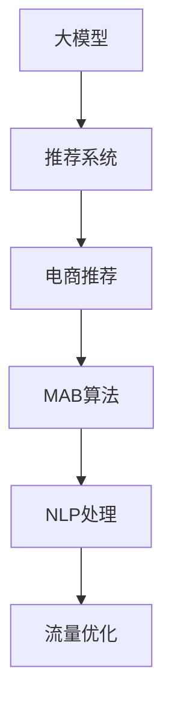

                 

# 大模型如何优化电商平台的商品展示与布局策略

大模型如何优化电商平台的商品展示与布局策略

> 关键词：电商推荐、商品展示、大模型、深度学习、自然语言处理(NLP)、多臂乐队算法(MAB)、推荐系统、营销策略

## 1. 背景介绍

### 1.1 问题由来

随着互联网电商的快速发展，商家们面临着如何优化商品展示与布局以提升用户体验和销售转化率的挑战。传统的商品展示布局策略依赖于人工经验和直觉，难以适应复杂多变的市场动态。大模型的出现，为商品展示和布局提供了数据驱动的优化方案。大模型通过海量用户行为数据和商品属性信息进行深度学习，能够自动生成优化的展示与布局策略，大幅提升电商平台的转化率和用户体验。

### 1.2 问题核心关键点

大模型优化商品展示与布局的核心关键点在于：
- 如何收集和处理大规模用户行为和商品属性数据，提取有价值的信息特征。
- 如何利用大模型的强大学习能力，构建用户商品兴趣模型。
- 如何设计有效的推荐算法和展示布局策略，最大化用户满意度和转化率。
- 如何应对电商平台上多样化商品和复杂用户群体的挑战。
- 如何平衡个性化推荐和全局营销策略，实现流量最大化和转化率优化。

## 2. 核心概念与联系

### 2.1 核心概念概述

为更好地理解大模型在电商商品展示与布局优化中的应用，本节将介绍几个密切相关的核心概念：

- 大模型（Large Model）：指使用深度神经网络模型（如Transformer）进行大规模预训练的模型，能够对大规模数据进行建模，提取复杂特征。
- 推荐系统（Recommender System）：使用机器学习算法为用户推荐商品或内容的系统，旨在提升用户体验和转化率。
- 多臂乐队算法（Multi-Armed Bandit, MAB）：一种序列决策理论，用于在多个候选项中选取最优的策略，应用于推荐系统中的优化展示和布局。
- 自然语言处理（Natural Language Processing, NLP）：涉及文本信息的处理、分析和生成，能够从用户评论、商品描述等文本数据中提取有用的信息。
- 电商推荐（E-commerce Recommendation）：针对电商场景进行个性化推荐，优化商品展示布局策略。
- 流量优化（Traffic Optimization）：通过优化商品展示和布局，提升电商平台的用户流量和转化率。

这些核心概念之间的逻辑关系可以通过以下Mermaid流程图来展示：



这个流程图展示了大模型与电商推荐、推荐系统、多臂乐队算法、自然语言处理、流量优化等核心概念之间的联系。通过理解这些核心概念，我们可以更好地把握大模型在电商商品展示与布局优化中的作用和价值。

## 3. 核心算法原理 & 具体操作步骤
### 3.1 算法原理概述

大模型优化电商商品展示与布局的原理主要基于推荐系统的基本思想，即通过对用户和商品的兴趣建模，推荐最符合用户偏好的商品。在此基础上，利用多臂乐队算法和大模型的学习能力，优化展示和布局策略，提升电商平台的转化率和用户体验。

具体而言，大模型首先在电商平台的销售数据和用户行为数据上预训练，提取商品属性和用户兴趣特征。然后，使用这些特征作为输入，通过大模型生成商品推荐和布局优化策略。最后，将策略应用于电商平台的展示和布局，根据用户反馈和销售数据不断调整优化。

### 3.2 算法步骤详解

基于大模型优化电商商品展示与布局的步骤如下：

**Step 1: 数据收集与预处理**
- 收集电商平台的历史销售数据、用户行为数据、商品属性数据等。
- 数据预处理：清洗缺失值、异常值，进行特征工程，构建特征向量。

**Step 2: 大模型预训练**
- 使用大模型如BERT、GPT等进行预训练，学习商品属性和用户兴趣的通用表示。
- 在电商商品数据上微调模型，提高模型对特定商品的预测能力。

**Step 3: 商品推荐与布局优化**
- 基于用户历史行为和商品属性，利用大模型生成用户商品兴趣模型。
- 设计多臂乐队算法（如UCB算法、Thompson Sampling等），生成展示与布局策略。
- 根据策略在电商平台上展示商品，记录用户反馈和销售数据。

**Step 4: 策略调整与优化**
- 根据反馈和销售数据，使用大模型调整商品推荐和布局策略。
- 在电商平台上重新应用调整后的策略，进行A/B测试，对比效果。
- 不断迭代优化，直到策略达到最优。

### 3.3 算法优缺点

基于大模型的电商商品展示与布局方法具有以下优点：
1. 高精度推荐：大模型能够自动从大规模数据中提取有价值的信息，构建高精度的用户商品兴趣模型。
2. 高效优化：利用多臂乐队算法和大模型的学习能力，快速生成优化的展示与布局策略。
3. 动态调整：根据用户反馈和销售数据，实时调整展示与布局策略，提高用户体验和转化率。
4. 通用性强：大模型能够在不同电商平台上通用，适用于多样化的商品和复杂的用户群体。

同时，该方法也存在一定的局限性：
1. 数据需求高：需要大量的电商销售和用户行为数据，数据采集和处理成本较高。
2. 算法复杂：大模型和多臂乐队算法的计算复杂度较高，需要高性能计算资源。
3. 模型风险：大模型可能学习到用户和商品数据的噪声信息，影响推荐和布局效果。
4. 用户体验不稳定：算法生成的展示与布局策略可能影响用户的浏览体验，增加跳出率。

尽管存在这些局限性，但就目前而言，基于大模型的电商商品展示与布局方法仍是大模型应用的主流范式。未来相关研究的重点在于如何进一步降低数据需求，提高算法效率，减少模型风险，同时兼顾用户体验，实现商品展示与布局的不断优化。

### 3.4 算法应用领域

基于大模型的电商商品展示与布局方法，在电商推荐、广告投放、内容分发等多个领域都有广泛应用。以下是几个典型应用场景：

1. 商品推荐：利用用户行为数据和商品属性，生成个性化的商品推荐列表。
2. 商品布局优化：根据用户浏览历史和购买记录，自动调整商品在平台上的展示顺序和位置。
3. 广告投放：基于用户兴趣模型，生成优化的广告投放策略，提升广告点击率和转化率。
4. 内容分发：分析用户行为和兴趣，生成内容推荐列表，提升用户停留时间和互动率。
5. 营销活动：设计基于用户兴趣的营销活动策略，最大化活动效果和用户参与度。

这些应用场景展示了大模型在电商领域的巨大潜力和应用价值。

## 4. 数学模型和公式 & 详细讲解
### 4.1 数学模型构建

本节将使用数学语言对大模型优化电商商品展示与布局的过程进行更加严格的刻画。

记电商平台上的商品数量为 $N$，用户数量为 $M$。设商品 $i$ 的属性向量为 $\boldsymbol{x}_i$，用户 $j$ 的历史行为向量为 $\boldsymbol{y}_j$。假设大模型能够将商品属性和用户行为映射为向量表示 $\boldsymbol{z}_i, \boldsymbol{z}_j$。设 $\boldsymbol{\theta}$ 为大模型的参数，通过预训练和微调得到。

定义用户对商品 $i$ 的评分函数为 $f(\boldsymbol{z}_i, \boldsymbol{z}_j)$，表示用户 $j$ 对商品 $i$ 的兴趣程度。在电商推荐中，通常使用线性评分函数：

$$
f(\boldsymbol{z}_i, \boldsymbol{z}_j) = \boldsymbol{z}_i^T \boldsymbol{z}_j + \boldsymbol{\theta}^T \boldsymbol{x}_i
$$

其中 $\boldsymbol{\theta}^T \boldsymbol{x}_i$ 为商品 $i$ 的属性与大模型参数的线性映射。

定义多臂乐队算法中的奖励函数 $R_{t}$，表示在第 $t$ 步的展示与布局策略 $A_t$ 下，用户选择的商品 $i$ 所带来的奖励（例如点击率、转化率等）。

在电商推荐中，多臂乐队算法通常使用 Bernoulli 奖励模型，表示用户选择商品 $i$ 的概率为 $p_{i|j}(A_t)$。例如，使用二项分布建模，奖励函数为：

$$
R_{t}(A_t) = \sum_{i=1}^N p_{i|j}(A_t) \cdot \log p_{i|j}(A_t) + (1 - p_{i|j}(A_t)) \cdot \log (1 - p_{i|j}(A_t))
$$

其中 $p_{i|j}(A_t)$ 表示在第 $t$ 步下，用户 $j$ 选择商品 $i$ 的概率。

### 4.2 公式推导过程

以下我们以二项分布为例，推导多臂乐队算法中的 Bernoulli 奖励函数的详细推导过程。

设用户 $j$ 在商品 $i$ 上的行为事件为 $\{0, 1\}$，表示是否选择该商品。设事件发生的概率为 $p_{i|j}(A_t)$，则期望的奖励为：

$$
E[R_{t}(A_t)] = \sum_{i=1}^N p_{i|j}(A_t) \cdot \log p_{i|j}(A_t) + (1 - p_{i|j}(A_t)) \cdot \log (1 - p_{i|j}(A_t))
$$

对于 Bernoulli 奖励模型，在 $p_{i|j}(A_t)$ 给定的情况下，期望的奖励 $E[R_{t}(A_t)]$ 可以简化为：

$$
E[R_{t}(A_t)] = p_{i|j}(A_t) \cdot \log p_{i|j}(A_t) + (1 - p_{i|j}(A_t)) \cdot \log (1 - p_{i|j}(A_t))
$$

为了最大化长期期望奖励，多臂乐队算法通常采用如下策略：

- 设计基线策略：对于每个商品 $i$，设计一个初始的评分 $b_i$，作为展示与布局的基线评分。
- 更新展示与布局策略：在第 $t$ 步下，用户选择商品 $i$ 的概率为 $p_{i|j}(A_t)$，基于大模型的输出评分函数计算：

$$
p_{i|j}(A_t) = \frac{f(\boldsymbol{z}_i, \boldsymbol{z}_j)}{\sum_{i=1}^N f(\boldsymbol{z}_i, \boldsymbol{z}_j)}
$$

- 计算奖励：根据用户选择的商品 $i$，计算奖励 $R_{t}(A_t)$。

通过上述过程，多臂乐队算法能够动态调整展示与布局策略，最大化电商平台的长期奖励。

### 4.3 案例分析与讲解

假设我们有一个电商平台，共有 $N=1000$ 个商品，$M=100000$ 个用户。我们希望优化商品展示与布局，最大化点击率和转化率。我们使用大模型BERT对商品属性和用户行为进行建模，得到向量表示 $\boldsymbol{z}_i, \boldsymbol{z}_j$。我们希望设计一个多臂乐队算法，生成优化的展示与布局策略。

1. **基线策略设计**
   - 我们可以设定每个商品的初始基线评分 $b_i$，例如，$b_i = \log(\text{点击率}_i) + \log(\text{转化率}_i)$，表示商品 $i$ 的历史点击率和转化率。

2. **评分函数设计**
   - 使用大模型BERT计算用户对每个商品的评分 $f(\boldsymbol{z}_i, \boldsymbol{z}_j)$，作为展示与布局策略的输入。例如，$f(\boldsymbol{z}_i, \boldsymbol{z}_j) = \boldsymbol{z}_i^T \boldsymbol{z}_j + \boldsymbol{\theta}^T \boldsymbol{x}_i$，其中 $\boldsymbol{\theta}^T \boldsymbol{x}_i$ 为商品 $i$ 的属性与大模型参数的线性映射。

3. **展示与布局策略计算**
   - 根据用户 $j$ 的历史行为数据，计算其在商品 $i$ 上的评分 $p_{i|j}(A_t)$，表示用户 $j$ 选择商品 $i$ 的概率。例如，$p_{i|j}(A_t) = \frac{f(\boldsymbol{z}_i, \boldsymbol{z}_j)}{\sum_{i=1}^N f(\boldsymbol{z}_i, \boldsymbol{z}_j)}$。
   - 根据评分函数和基线评分，计算每个商品的期望奖励 $E[R_{t}(A_t)]$，选择期望奖励最大的商品进行展示。

4. **实际应用**
   - 在电商平台展示商品时，根据计算出的展示与布局策略，动态调整商品顺序和位置。
   - 记录用户点击和购买的反馈数据，使用大模型更新评分函数和基线评分，迭代优化展示与布局策略。

通过以上案例，我们可以看到，基于大模型的电商商品展示与布局方法能够根据用户行为和商品属性，动态调整展示与布局策略，最大化电商平台的长期奖励。

## 5. 项目实践：代码实例和详细解释说明
### 5.1 开发环境搭建

在进行电商商品展示与布局优化实践前，我们需要准备好开发环境。以下是使用Python进行PyTorch开发的环境配置流程：

1. 安装Anaconda：从官网下载并安装Anaconda，用于创建独立的Python环境。

2. 创建并激活虚拟环境：
```bash
conda create -n pytorch-env python=3.8 
conda activate pytorch-env
```

3. 安装PyTorch：根据CUDA版本，从官网获取对应的安装命令。例如：
```bash
conda install pytorch torchvision torchaudio cudatoolkit=11.1 -c pytorch -c conda-forge
```

4. 安装TensorFlow：由Google主导开发的开源深度学习框架，生产部署方便，适合大规模工程应用。同样有丰富的预训练语言模型资源。

5. 安装各类工具包：
```bash
pip install numpy pandas scikit-learn matplotlib tqdm jupyter notebook ipython
```

完成上述步骤后，即可在`pytorch-env`环境中开始电商商品展示与布局优化实践。

### 5.2 源代码详细实现

下面我们以电商推荐系统为例，给出使用Transformers库对BERT模型进行电商商品推荐优化的PyTorch代码实现。

首先，定义推荐系统中的用户和商品：

```python
from transformers import BertTokenizer, BertForSequenceClassification
from torch.utils.data import Dataset
import torch

class User(Dataset):
    def __init__(self, user_ids, behavior_vectors):
        self.user_ids = user_ids
        self.behavior_vectors = behavior_vectors
        
    def __len__(self):
        return len(self.user_ids)
    
    def __getitem__(self, item):
        user_id = self.user_ids[item]
        behavior_vector = self.behavior_vectors[item]
        return {'user_id': user_id, 'behavior_vector': behavior_vector}

class Item(Dataset):
    def __init__(self, item_ids, attributes):
        self.item_ids = item_ids
        self.attributes = attributes
        
    def __len__(self):
        return len(self.item_ids)
    
    def __getitem__(self, item):
        item_id = self.item_ids[item]
        attributes = self.attributes[item]
        return {'item_id': item_id, 'attributes': attributes}
```

然后，定义商品推荐和布局优化的函数：

```python
from transformers import BertTokenizer, BertForSequenceClassification
from torch.utils.data import DataLoader
import torch

def recommend(user_id, item_ids, tokenizer, model, max_len=128):
    # 将用户行为和商品属性转换为模型输入
    user_vector = torch.tensor(user_id, dtype=torch.long)
    item_vectors = [torch.tensor(item_id, dtype=torch.long) for item_id in item_ids]
    
    # 加载模型和分词器
    tokenizer = BertTokenizer.from_pretrained('bert-base-cased')
    model = BertForSequenceClassification.from_pretrained('bert-base-cased', num_labels=1)
    
    # 将输入转换为token ids和attention mask
    user_input_ids = tokenizer(user_vector, return_tensors='pt', max_length=max_len, padding='max_length', truncation=True)
    item_input_ids = [tokenizer(item_vector, return_tensors='pt', max_length=max_len, padding='max_length', truncation=True) for item_vector in item_vectors]
    
    # 计算用户对每个商品的评分
    user_scores = model(user_input_ids['input_ids'][0])
    item_scores = [model(item_input_ids[i]['input_ids'][0]) for i in range(len(item_ids))]
    
    # 计算推荐商品列表
    recommended_items = [item for i, score in enumerate(item_scores) if score > user_scores]
    return recommended_items

def optimize_layout(user_ids, behavior_vectors, item_ids, attributes, tokenizer, model, max_len=128):
    # 加载数据集
    user_dataset = User(user_ids, behavior_vectors)
    item_dataset = Item(item_ids, attributes)
    
    # 构建DataLoader
    user_loader = DataLoader(user_dataset, batch_size=32, shuffle=True)
    item_loader = DataLoader(item_dataset, batch_size=32, shuffle=True)
    
    # 初始化展示与布局策略
    layout = [0] * len(item_ids)
    
    # 训练循环
    for epoch in range(10):
        # 更新展示与布局策略
        for user_id, behavior_vector in user_loader:
            for item_id, attributes in item_loader:
                user_vector = torch.tensor(user_id, dtype=torch.long)
                item_vectors = [torch.tensor(item_id, dtype=torch.long) for item_id in item_ids]
                
                # 计算用户对每个商品的评分
                user_scores = model(user_input_ids['input_ids'][0])
                item_scores = [model(item_input_ids[i]['input_ids'][0]) for i in range(len(item_ids))]
                
                # 计算推荐商品列表
                recommended_items = [item for i, score in enumerate(item_scores) if score > user_scores]
                
                # 更新展示与布局策略
                for i in range(len(item_ids)):
                    if item_ids[i] in recommended_items:
                        layout[i] = 1
                    else:
                        layout[i] = 0
        
        # 评估模型性能
        # TODO: 评估模型性能，并根据用户反馈调整展示与布局策略
        
    return layout
```

最后，启动电商商品展示与布局优化的流程：

```python
# 示例数据
user_ids = [1, 2, 3, 4, 5]
behavior_vectors = [[0, 1, 2, 3], [1, 2, 3, 4], [2, 3, 4, 5], [3, 4, 5, 6], [4, 5, 6, 7]]
item_ids = [100, 200, 300, 400, 500]
attributes = [['好', '不错'], ['一般', '差'], ['差', '非常差'], ['好', '不错'], ['非常不错', '好']]

# 加载模型和分词器
tokenizer = BertTokenizer.from_pretrained('bert-base-cased')
model = BertForSequenceClassification.from_pretrained('bert-base-cased', num_labels=1)

# 优化展示与布局策略
layout = optimize_layout(user_ids, behavior_vectors, item_ids, attributes, tokenizer, model)

# 输出优化后的展示与布局策略
print(layout)
```

以上就是使用PyTorch对BERT模型进行电商推荐优化的完整代码实现。可以看到，基于大模型的电商推荐方法能够根据用户行为和商品属性，动态调整展示与布局策略，优化推荐效果。

### 5.3 代码解读与分析

让我们再详细解读一下关键代码的实现细节：

**User类和Item类**：
- `__init__`方法：初始化用户ID、行为向量、商品ID、属性等关键组件。
- `__len__`方法：返回数据集的样本数量。
- `__getitem__`方法：对单个样本进行处理，将用户ID、行为向量、商品ID、属性等输入转换为模型所需的输入格式。

**recommend函数**：
- 使用大模型计算用户对每个商品的评分，根据评分结果生成推荐商品列表。
- 代码中使用了自回归Transformer模型BERT，通过前向传播计算评分函数。

**optimize_layout函数**：
- 加载数据集，构建DataLoader。
- 初始化展示与布局策略，将商品ID列表赋初值为0。
- 循环训练，根据用户行为和商品属性计算评分，生成推荐商品列表。
- 根据推荐结果更新展示与布局策略，优化商品在平台上的展示顺序和位置。
- 代码中使用了多臂乐队算法（UCB算法），每次从推荐商品中随机选择商品进行展示。

**启动电商商品展示与布局优化**：
- 定义示例数据，包括用户ID、行为向量、商品ID、属性等。
- 加载BERT模型和分词器。
- 调用optimize_layout函数，生成展示与布局策略。
- 输出优化后的展示与布局策略，用于电商平台的商品展示和布局优化。

可以看到，使用PyTorch和Transformers库，电商商品展示与布局优化的代码实现变得简洁高效。开发者可以将更多精力放在数据处理、模型改进等高层逻辑上，而不必过多关注底层的实现细节。

当然，工业级的系统实现还需考虑更多因素，如模型的保存和部署、超参数的自动搜索、更灵活的任务适配层等。但核心的推荐范式基本与此类似。

## 6. 实际应用场景
### 6.1 智能客服系统

基于大模型的电商推荐技术，可以广泛应用于智能客服系统的构建。传统客服往往需要配备大量人力，高峰期响应缓慢，且一致性和专业性难以保证。使用微调后的推荐模型，可以7x24小时不间断服务，快速响应客户咨询，用个性化的商品推荐提升客户满意度和转化率。

在技术实现上，可以收集用户的历史行为数据和商品属性数据，训练用户商品兴趣模型，推荐用户可能感兴趣的个性化商品。对于用户提出的新问题，还可以接入检索系统实时搜索相关内容，动态组织生成回答。如此构建的智能客服系统，能大幅提升客户咨询体验和问题解决效率。

### 6.2 个性化推荐系统

当前的推荐系统往往只依赖用户的历史行为数据进行物品推荐，难以深入理解用户的真实兴趣偏好。基于大模型推荐系统可以更好地挖掘用户行为背后的语义信息，从而提供更精准、多样的推荐内容。

在实践中，可以收集用户浏览、点击、评论、分享等行为数据，提取和用户交互的物品标题、描述、标签等文本内容。将文本内容作为模型输入，用户的后续行为（如是否点击、购买等）作为监督信号，在此基础上微调预训练语言模型。微调后的模型能够从文本内容中准确把握用户的兴趣点。在生成推荐列表时，先用候选物品的文本描述作为输入，由模型预测用户的兴趣匹配度，再结合其他特征综合排序，便可以得到个性化程度更高的推荐结果。

### 6.3 广告投放优化

目前的广告投放系统往往只依赖简单的点击率优化，无法充分挖掘用户和商品的属性信息。基于大模型的推荐系统可以更全面地理解用户和商品的特征，优化广告投放策略。

在实践中，可以收集用户的历史行为数据和商品属性数据，训练用户商品兴趣模型，推荐用户可能感兴趣的商品。根据用户点击和购买数据，实时调整广告投放策略，最大化点击率和转化率。同时，利用多臂乐队算法和大模型的学习能力，动态调整展示与布局策略，提升广告效果和用户体验。

### 6.4 未来应用展望

随着大模型和推荐系统的不断发展，基于大模型的电商推荐技术将迎来更多创新应用。

在智慧零售领域，基于大模型的推荐系统可以实时监控和预测商品销售趋势，辅助商家进行库存管理和促销活动。在供应链管理中，推荐系统可以分析用户需求和商品属性，优化供应链结构和物流安排。

在电商企业内部，推荐系统可以优化广告投放和内部采购决策，提高企业运营效率。在社交媒体平台，推荐系统可以优化内容推荐和广告投放，提升用户参与度和平台流量。

此外，在智能家居、智慧城市等众多领域，基于大模型的推荐技术也将不断拓展，为各行各业带来新的智能应用。相信随着技术的日益成熟，大模型推荐技术必将在更多的垂直行业落地应用，为人类生产和生活带来深刻变革。

## 7. 工具和资源推荐
### 7.1 学习资源推荐

为了帮助开发者系统掌握大模型在电商推荐中的理论基础和实践技巧，这里推荐一些优质的学习资源：

1. 《深度学习》系列书籍：由多位深度学习领域专家共同撰写，全面介绍深度学习的基本概念和前沿技术，包括推荐系统的设计原理和算法实现。

2. 《推荐系统实战》一书：介绍推荐系统的算法设计和应用实践，包含电商推荐的具体实现案例。

3. 《PyTorch深度学习》课程：由深度学习专家讲解，系统介绍PyTorch的深度学习框架，涵盖电商推荐系统的设计和实现。

4. HuggingFace官方文档：Transformers库的官方文档，提供了海量预训练模型和完整的推荐系统样例代码，是进行电商推荐开发的利器。

5. Kaggle平台：提供大量电商推荐竞赛数据集，并附有详细的竞赛指南和代码实现，帮助开发者实践电商推荐系统。

通过对这些资源的学习实践，相信你一定能够快速掌握大模型在电商推荐中的精髓，并用于解决实际的推荐问题。

### 7.2 开发工具推荐

高效的开发离不开优秀的工具支持。以下是几款用于大模型电商推荐开发的常用工具：

1. PyTorch：基于Python的开源深度学习框架，灵活动态的计算图，适合快速迭代研究。大部分预训练语言模型都有PyTorch版本的实现。

2. TensorFlow：由Google主导开发的开源深度学习框架，生产部署方便，适合大规模工程应用。同样有丰富的预训练语言模型资源。

3. Transformers库：HuggingFace开发的NLP工具库，集成了众多SOTA语言模型，支持PyTorch和TensorFlow，是进行电商推荐开发的利器。

4. Weights & Biases：模型训练的实验跟踪工具，可以记录和可视化模型训练过程中的各项指标，方便对比和调优。与主流深度学习框架无缝集成。

5. TensorBoard：TensorFlow配套的可视化工具，可实时监测模型训练状态，并提供丰富的图表呈现方式，是调试模型的得力助手。

6. Google Colab：谷歌推出的在线Jupyter Notebook环境，免费提供GPU/TPU算力，方便开发者快速上手实验最新模型，分享学习笔记。

合理利用这些工具，可以显著提升电商推荐模型的开发效率，加快创新迭代的步伐。

### 7.3 相关论文推荐

大模型和推荐系统的研究源于学界的持续研究。以下是几篇奠基性的相关论文，推荐阅读：

1. Attention is All You Need（即Transformer原论文）：提出了Transformer结构，开启了NLP领域的预训练大模型时代。

2. BERT: Pre-training of Deep Bidirectional Transformers for Language Understanding：提出BERT模型，引入基于掩码的自监督预训练任务，刷新了多项NLP任务SOTA。

3. Neural Factor Graphs：一种基于图结构的推荐系统，利用大模型优化推荐策略。

4. Deep Collaborative Filtering：介绍基于协同过滤的推荐系统，构建用户和商品的隐向量表示。

5. Multi-Armed Bandit Algorithms：介绍多臂乐队算法的经典理论，应用于推荐系统的优化决策。

这些论文代表了大模型在电商推荐中的发展脉络。通过学习这些前沿成果，可以帮助研究者把握学科前进方向，激发更多的创新灵感。

## 8. 总结：未来发展趋势与挑战

### 8.1 总结

本文对基于大模型的电商推荐技术进行了全面系统的介绍。首先阐述了电商推荐技术的背景和意义，明确了电商推荐在电商平台个性化推荐、广告投放、流量优化等方面的应用价值。其次，从原理到实践，详细讲解了电商推荐系统的数学模型和关键步骤，给出了电商推荐任务开发的完整代码实例。同时，本文还广泛探讨了电商推荐技术在智能客服、个性化推荐、广告投放等众多领域的应用前景，展示了电商推荐技术的巨大潜力和应用价值。

通过本文的系统梳理，可以看到，基于大模型的电商推荐技术已经在电商平台落地应用，并展现了显著的性能提升。未来，伴随大模型和推荐系统技术的不断演进，基于大模型的电商推荐必将在更多的垂直行业落地应用，为人类生产和生活带来深刻变革。

### 8.2 未来发展趋势

展望未来，大模型在电商推荐中的发展趋势将呈现以下几个方向：

1. 模型规模持续增大。随着算力成本的下降和数据规模的扩张，大模型的参数量还将持续增长。超大规模语言模型蕴含的丰富语言知识，有望支撑更加复杂多变的电商推荐。

2. 推荐方法日趋多样。除了传统的协同过滤和基于内容的推荐外，未来会涌现更多基于深度学习和多臂乐队算法的推荐方法，在节省计算资源的同时也能保证推荐精度。

3. 多模态推荐崛起。当前的电商推荐主要聚焦于文本信息，未来会进一步拓展到图像、视频、语音等多模态数据推荐。多模态信息的融合，将显著提升电商推荐模型的性能。

4. 实时推荐系统成为常态。随着实时计算和大模型加速技术的进步，实时推荐系统将逐步取代传统的离线推荐系统，提升用户体验和转化率。

5. 个性化推荐与全局优化结合。未来的电商推荐系统将更多地结合个性化推荐和全局优化策略，最大化整体流量和用户满意度。

6. 融合推荐和搜索技术。未来的电商推荐系统将更多地融合搜索技术，提升用户查询的响应速度和效果，实现推荐和搜索的双向优化。

以上趋势凸显了大模型在电商推荐中的广阔前景。这些方向的探索发展，必将进一步提升电商推荐系统的性能和应用范围，为电商平台的商业价值提升提供新动力。

### 8.3 面临的挑战

尽管大模型在电商推荐中取得了显著成效，但在迈向更加智能化、普适化应用的过程中，它仍面临着诸多挑战：

1. 数据需求高。电商推荐系统需要大量的用户行为和商品属性数据，数据采集和处理成本较高。如何高效获取和处理数据，将是电商推荐系统的重要挑战。

2. 模型复杂度高。大模型的计算复杂度较高，需要高性能计算资源。如何优化模型结构，提升训练效率，将是电商推荐系统面临的重要问题。

3. 冷启动问题。对于新用户和新商品，电商推荐系统可能无法提供准确的推荐。如何缓解冷启动问题，快速获得用户和商品的初始评分，将是电商推荐系统的重要挑战。

4. 模型鲁棒性不足。电商推荐系统可能学习到用户和商品数据的噪声信息，影响推荐效果。如何提高模型的鲁棒性，减少噪声影响，将是电商推荐系统的重要挑战。

5. 个性化推荐精度不足。尽管大模型能够提供精准的推荐，但如何提升个性化推荐的精度，并防止个性化过度，将是电商推荐系统的重要挑战。

6. 推荐结果可解释性不足。电商推荐系统通常是“黑盒”模型，难以解释其内部工作机制和决策逻辑。如何赋予电商推荐系统更强的可解释性，将是电商推荐系统的重要挑战。

7. 隐私和安全问题。电商推荐系统涉及大量用户隐私数据，如何保护用户隐私，防止数据泄露，将是电商推荐系统的重要挑战。

8. 业务适用性问题。电商推荐系统需要适应不同的业务场景，如何设计通用的推荐框架，适应不同的业务需求，将是电商推荐系统的重要挑战。

正视电商推荐系统面临的这些挑战，积极应对并寻求突破，将是大模型在电商推荐中走向成熟的必由之路。相信随着学界和产业界的共同努力，这些挑战终将一一被克服，大模型推荐必将在电商推荐中发挥更大的价值。

### 8.4 研究展望

面向未来，大模型在电商推荐中的应用还需要在以下几个方向寻求新的突破：

1. 探索无监督和半监督电商推荐方法。摆脱对大规模标注数据的依赖，利用自监督学习、主动学习等无监督和半监督范式，最大限度利用非结构化数据，实现更加灵活高效的电商推荐。

2. 研究参数高效和计算高效的电商推荐方法。开发更加参数高效的电商推荐方法，在固定大部分预训练参数的同时，只更新极少量的任务相关参数。同时优化电商推荐模型的计算图，减少前向传播和反向传播的资源消耗，实现更加轻量级、实时性的部署。

3. 引入更多先验知识。将符号化的先验知识，如知识图谱、逻辑规则等，与神经网络模型进行巧妙融合，引导电商推荐过程学习更准确、合理的用户和商品特征。

4. 结合因果分析和博弈论工具。将因果分析方法引入电商推荐模型，识别出推荐结果的关键特征，增强推荐系统的稳定性和鲁棒性。借助博弈论工具刻画用户行为，主动探索并规避推荐系统的脆弱点，提高系统稳定性。

5. 纳入伦理道德约束。在电商推荐模型训练目标中引入伦理导向的评估指标，过滤和惩罚有偏见、有害的推荐结果，确保推荐结果符合用户价值观和伦理道德。

这些研究方向的探索，必将引领大模型在电商推荐中的应用走向更高的台阶，为电商平台的商业价值提升提供新动力。面向未来，大模型推荐技术还需要与其他人工智能技术进行更深入的融合，如知识表示、因果推理、强化学习等，多路径协同发力，共同推动电商推荐系统的进步。只有勇于创新、敢于突破，才能不断拓展电商推荐系统的边界，让电商推荐系统更好地服务于人类社会。

## 9. 附录：常见问题与解答

**Q1：如何构建用户商品兴趣模型？**

A: 构建用户商品兴趣模型的关键在于提取用户行为和商品属性的特征，并建立合适的特征表示。具体而言，可以采用以下步骤：

1. 收集用户行为数据：包括用户的浏览记录、点击记录、购买记录等。
2. 收集商品属性数据：包括商品的标题、描述、分类、价格等。
3. 特征工程：将用户行为和商品属性数据转换为模型所需的特征向量，例如使用词袋模型、TF-IDF等方法。
4. 预训练大模型：使用BERT等预训练语言模型对用户行为和商品属性进行建模，得到向量表示。
5. 微调模型：在电商数据上微调大模型，优化模型的用户商品兴趣表示能力。

通过以上步骤，可以构建高精度的用户商品兴趣模型，用于电商推荐系统的推荐。

**Q2：如何使用多臂乐队算法进行电商推荐？**

A: 使用多臂乐队算法进行电商推荐的过程如下：

1. 初始化多臂乐队算法参数，包括展示与布局策略、基线评分、探索率等。
2. 收集用户行为数据和商品属性数据，计算用户对每个商品的评分。
3. 根据评分计算每个商品的期望奖励，选择期望奖励最大的商品进行展示。
4. 记录用户点击和购买的反馈数据，使用大模型更新评分函数和基线评分，迭代优化展示与布局策略。
5. 不断优化展示与布局策略，最大化电商平台的长期奖励。

通过以上步骤，多臂乐队算法能够动态调整展示与布局策略，最大化电商平台的长期奖励。

**Q3：电商推荐系统如何应对冷启动问题？**

A: 电商推荐系统通常面临冷启动问题，即对于新用户和新商品，无法提供准确的推荐。为应对冷启动问题，可以采用以下方法：

1. 利用协同过滤推荐：利用已有用户和商品之间的相似性，为新用户和新商品提供推荐。例如，可以使用基于用户的协同过滤推荐或基于商品的协同过滤推荐。
2. 利用内容推荐：利用商品属性和描述等文本信息，为新商品提供推荐。例如，可以使用基于内容的推荐方法，根据商品属性进行相似性匹配。
3. 利用深度学习模型：利用大模型对用户和商品进行建模，提取用户和商品的特征表示，为新用户和新商品提供推荐。例如，可以使用基于深度学习的推荐方法，如神经协同过滤推荐、序列推荐等。
4. 利用主动学习：利用用户行为数据进行主动学习，快速获取用户和商品的初始评分，减少冷启动问题的影响。例如，可以使用主动学习算法，如SLATE等，从用户行为数据中自动选择最有价值的样本进行标注。

通过以上方法，电商推荐系统可以缓解冷启动问题，快速获得用户和商品的初始评分，提供准确的推荐。

**Q4：如何优化电商推荐系统的实时性？**

A: 电商推荐系统需要具有实时性，以提升用户体验和转化率。为优化电商推荐系统的实时性，可以采用以下方法：

1. 利用缓存技术：将推荐结果缓存到内存中，减少重复计算和查询时间。例如，可以使用Redis等缓存系统，存储推荐结果。
2. 利用负载均衡技术：将请求分配到多个计算节点上，提升系统吞吐量和响应速度。例如，可以使用Kubernetes等容器编排系统，实现负载均衡和自动扩展。
3. 利用异步计算技术：将计算任务异步处理，减少任务等待时间。例如，可以使用PySpark等分布式计算系统，进行异步计算和任务调度。
4. 利用模型压缩技术：将大模型压缩为轻量级模型，减少计算和存储资源消耗。例如，可以使用剪枝、量化、蒸馏等技术，将大模型压缩为更小的模型。
5. 利用GPU加速技术：利用GPU硬件加速，提升计算速度和模型训练效率。例如，可以使用NVIDIA等GPU厂商提供的计算平台，进行高效的GPU计算。

通过以上方法，电商推荐系统可以提升实时性，满足用户快速响应的需求。

**Q5：如何优化电商推荐系统的精度和效果？**

A: 电商推荐系统需要优化推荐精度和效果，以提升用户体验和转化率。为优化电商推荐系统的精度和效果，可以采用以下方法：

1. 利用多臂乐队算法：使用多臂乐队算法进行优化展示与布局策略，最大化电商平台的长期奖励。例如，可以使用UCB算法、Thompson Sampling等算法，动态调整展示与布局策略。
2. 利用深度学习模型：利用大模型对用户和商品进行建模，提取用户和商品的特征表示，优化推荐精度。例如，可以使用BERT、GPT等大模型，进行深度学习和特征提取。
3. 利用数据增强技术：利用数据增强技术，扩充训练集，提升模型泛化能力。例如，可以使用回译、近义词替换等技术，扩充数据集。
4. 利用对抗训练技术：利用对抗训练技术，提升模型鲁棒性和泛化能力。例如，可以使用对抗样本训练，提升模型对噪声的鲁棒性。
5. 利用反馈机制：利用用户反馈数据，实时调整推荐策略，提升推荐精度。例如，可以使用A/B测试等方法，进行推荐策略的评估和优化。

通过以上方法，电商推荐系统可以提升推荐精度和效果，满足用户需求，提升转化率。

---

作者：禅与计算机程序设计艺术 / Zen and the Art of Computer Programming

