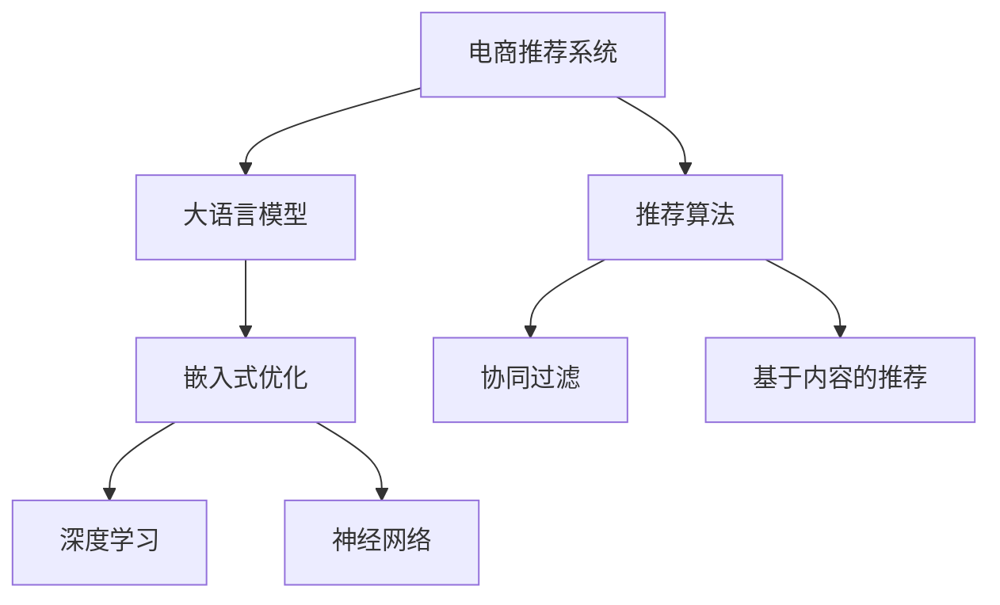

                 

# 大模型如何优化电商平台的实时推荐系统

> 关键词：电商推荐系统, 大语言模型, 嵌入式优化, 深度学习, 神经网络, 产品推荐, 用户行为分析, 实时推荐算法

## 1. 背景介绍

### 1.1 问题由来
在电商领域，推荐系统已经成为提升用户体验、提高转化率的关键手段。传统推荐系统主要依赖协同过滤、基于内容的推荐等算法，但在处理海量的用户数据时，往往面临计算效率低、推荐精度差等挑战。近年来，随着深度学习技术和大规模预训练语言模型的发展，推荐系统进入了一个新的阶段。基于大模型的推荐系统可以利用丰富的用户行为数据，进行更细致的特征提取和智能推荐，显著提升了推荐的精度和效果。

### 1.2 问题核心关键点
电商推荐系统面临的核心挑战包括：
1. 数据多样性：用户行为数据种类繁多，如何高效融合多源数据进行推荐？
2. 冷启动问题：新用户和老用户的行为差异大，如何快速适应新用户？
3. 实时性要求：推荐结果需要快速生成并实时反馈给用户，如何高效处理请求？
4. 模型性能：推荐算法需要准确反映用户偏好，如何构建高性能的推荐模型？
5. 个性化需求：用户需求多样，如何实现个性化推荐？

大语言模型通过大规模无监督学习，获得了丰富的语言表示和语义理解能力，可以应用于推荐系统进行多维度的用户行为分析和推荐策略优化。本文将详细探讨如何利用大语言模型优化电商平台的实时推荐系统，构建更加智能、个性化的推荐引擎。

### 1.3 问题研究意义
构建基于大语言模型的电商推荐系统，具有以下重要意义：
1. 提升推荐精度：利用大模型的强大语言表示能力，提取更丰富的用户行为特征，提高推荐的准确性。
2. 加速推荐速度：利用模型的并行计算能力，加速推荐计算过程，提升实时推荐的效果。
3. 强化个性化推荐：利用大模型对自然语言处理的能力，实现更细致的个性化推荐。
4. 提高冷启动性能：利用大模型的预训练特征，快速适应新用户，降低冷启动问题的影响。
5. 增强模型鲁棒性：利用大模型的自适应能力，提高推荐系统的鲁棒性和稳定性。

## 2. 核心概念与联系

### 2.1 核心概念概述

为更好地理解如何利用大语言模型优化电商推荐系统，本节将介绍几个密切相关的核心概念：

- 电商推荐系统：利用用户的历史行为数据和实时反馈，为每个用户推荐可能感兴趣的商品。
- 大语言模型(Large Language Model, LLM)：以自回归(如GPT)或自编码(如BERT)模型为代表的大规模预训练语言模型。通过在大规模无标签文本数据上进行预训练，学习到丰富的语言表示和语义理解能力。
- 嵌入式优化：将大模型嵌入到推荐系统算法中，利用模型的表示能力进行特征提取和推荐策略优化。
- 深度学习：通过构建复杂的多层神经网络，学习数据中的高层次抽象特征。
- 神经网络：一种基于连接主义和分布式并行计算的计算模型，可以用于处理复杂的推荐任务。
- 推荐算法：用于生成推荐结果的算法，包括协同过滤、基于内容的推荐等。

这些核心概念之间的逻辑关系可以通过以下Mermaid流程图来展示：



这个流程图展示了大语言模型在电商推荐系统中的应用框架：

1. 电商推荐系统通过收集用户行为数据和实时反馈，生成推荐结果。
2. 大语言模型通过大规模预训练，获得丰富的语言表示和语义理解能力。
3. 嵌入式优化将大模型嵌入到推荐算法中，利用模型提取特征和优化策略。
4. 深度学习通过多层神经网络，处理复杂的推荐任务。
5. 神经网络基于连接主义和并行计算，构建推荐模型的核心。
6. 推荐算法包括协同过滤、基于内容的推荐等多种方法，用于生成推荐结果。

这些概念共同构成了电商推荐系统的技术框架，使得利用大语言模型优化推荐系统成为可能。

## 3. 核心算法原理 & 具体操作步骤
### 3.1 算法原理概述

基于大语言模型的电商推荐系统，本质上是一个深度学习模型，通过学习用户的行为数据和商品属性，生成推荐结果。其核心思想是：将电商推荐系统视作一个生成模型，利用大语言模型的强大表示能力，提取用户行为和商品属性的高层次特征，生成个性化的推荐结果。

形式化地，假设电商推荐系统为 $M_{\theta}$，其中 $\theta$ 为模型的参数。给定用户历史行为数据 $X$ 和商品属性数据 $Y$，推荐目标为生成推荐结果 $R$。推荐过程的数学模型为：

$$
R = M_{\theta}(X, Y)
$$

其中 $X = (x_1, x_2, ..., x_n)$ 为用户历史行为数据，$Y = (y_1, y_2, ..., y_m)$ 为商品属性数据，$R = (r_1, r_2, ..., r_k)$ 为推荐结果，$n$ 为历史行为数据长度，$m$ 为商品属性维度，$k$ 为推荐结果数量。

推荐模型的目标是最大化用户对推荐结果的满意度，即最大化推荐结果 $R$ 与用户兴趣 $I$ 的相似度。常见的评价指标包括点击率、转化率、平均精度均值等。

### 3.2 算法步骤详解

基于大语言模型的电商推荐系统一般包括以下几个关键步骤：

**Step 1: 数据预处理**
- 收集用户历史行为数据和商品属性数据，进行清洗和归一化。
- 将文本数据转换为模型可接受的形式，如word embedding或句子表示。
- 进行数据划分，划分为训练集、验证集和测试集。

**Step 2: 选择预训练模型**
- 选择合适的预训练大语言模型，如BERT、GPT等。
- 确定模型输入的维度，如输入句子长度、向量维度等。

**Step 3: 模型训练**
- 将用户历史行为数据和商品属性数据输入模型进行训练。
- 定义损失函数，如交叉熵损失、均方误差损失等，用于衡量推荐结果与用户兴趣的相似度。
- 设置优化器，如AdamW、SGD等，并设置学习率、批大小、迭代轮数等。
- 在训练集上对模型进行前向传播和反向传播，更新模型参数。
- 在验证集上评估模型性能，根据性能指标调整超参数。

**Step 4: 模型评估与优化**
- 在测试集上对模型进行评估，计算点击率、转化率、平均精度均值等指标。
- 根据评估结果调整模型结构和超参数，进行模型优化。

**Step 5: 实时推荐部署**
- 将优化后的模型部署到实时推荐系统中。
- 对实时请求进行快速推理，生成推荐结果。

### 3.3 算法优缺点

基于大语言模型的电商推荐系统具有以下优点：
1. 数据融合能力强：大语言模型可以融合多种数据源，包括文本、图像、音频等，进行多模态推荐。
2. 鲁棒性强：大语言模型对数据噪音的抵抗能力强，能够处理异常数据和缺失数据。
3. 推荐效果稳定：大语言模型经过大规模预训练，具备较高的语言表示能力，生成推荐结果的稳定性和可靠性高。
4. 个性化推荐：大语言模型能够提取用户行为和商品属性的高层次特征，进行更加细致的个性化推荐。

同时，该方法也存在一些局限性：
1. 计算资源需求高：大语言模型的参数量较大，对计算资源的需求较高。
2. 实时性有待提升：模型推理速度较慢，需要优化以适应实时推荐的需求。
3. 模型解释性差：大语言模型的复杂性导致模型的解释性较差，难以调试和优化。
4. 数据隐私问题：电商推荐系统需要处理大量用户行为数据，存在数据隐私和安全问题。

尽管存在这些局限性，但就目前而言，基于大语言模型的推荐系统仍是推荐领域的重要方向，可以显著提升推荐系统的性能和效果。

### 3.4 算法应用领域

基于大语言模型的推荐系统在电商领域有广泛的应用，包括：

- 用户行为分析：利用大语言模型对用户历史行为数据进行分析，提取用户的兴趣和偏好。
- 商品属性标注：利用大语言模型对商品属性数据进行标注，生成更丰富的商品表示。
- 个性化推荐：根据用户兴趣和商品属性，生成个性化的推荐结果。
- 用户画像构建：通过分析用户行为和商品属性，构建详细的用户画像，实现精细化推荐。
- 推荐策略优化：利用大语言模型对推荐算法进行优化，提高推荐效果。

除了电商领域，大语言模型在内容推荐、社交网络推荐等场景中也有广泛的应用，展现了强大的普适性。

## 4. 数学模型和公式 & 详细讲解  
### 4.1 数学模型构建

本节将使用数学语言对基于大语言模型的电商推荐系统进行更加严格的刻画。

记电商推荐系统为 $M_{\theta}:\mathcal{X} \times \mathcal{Y} \rightarrow \mathcal{R}$，其中 $\mathcal{X}$ 为用户行为数据，$\mathcal{Y}$ 为商品属性数据，$\mathcal{R}$ 为推荐结果，$\theta$ 为模型参数。假设推荐系统的训练集为 $D=\{(x_i, y_i, r_i)\}_{i=1}^N$，其中 $x_i \in \mathcal{X}, y_i \in \mathcal{Y}, r_i \in \mathcal{R}$。

定义推荐系统在数据样本 $(x,y,r)$ 上的损失函数为 $\ell(M_{\theta}(x,y),r)$，则在数据集 $D$ 上的经验风险为：

$$
\mathcal{L}(\theta) = \frac{1}{N} \sum_{i=1}^N \ell(M_{\theta}(x_i,y_i),r_i)
$$

推荐系统的优化目标是最小化经验风险，即找到最优参数：

$$
\theta^* = \mathop{\arg\min}_{\theta} \mathcal{L}(\theta)
$$

在实践中，我们通常使用基于梯度的优化算法（如AdamW、SGD等）来近似求解上述最优化问题。设 $\eta$ 为学习率，$\lambda$ 为正则化系数，则参数的更新公式为：

$$
\theta \leftarrow \theta - \eta \nabla_{\theta}\mathcal{L}(\theta) - \eta\lambda\theta
$$

其中 $\nabla_{\theta}\mathcal{L}(\theta)$ 为损失函数对参数 $\theta$ 的梯度，可通过反向传播算法高效计算。

### 4.2 公式推导过程

以下我们以协同过滤推荐系统为例，推导交叉熵损失函数及其梯度的计算公式。

假设推荐系统对用户 $u$ 的推荐结果为 $r$，真实结果为 $r'$。推荐系统使用协同过滤算法，基于用户 $u$ 的邻居 $v$ 的历史行为数据 $(x_v, y_v)$ 进行推荐，模型输出为 $M_{\theta}(x_v, y_v)$，则交叉熵损失函数定义为：

$$
\ell(M_{\theta}(x_v, y_v),r') = -r' \log M_{\theta}(x_v, y_v) - (1-r') \log (1-M_{\theta}(x_v, y_v))
$$

将其代入经验风险公式，得：

$$
\mathcal{L}(\theta) = -\frac{1}{N} \sum_{i=1}^N \sum_{j=1}^N [y_j\log M_{\theta}(x_i, y_i)+(1-y_j)\log (1-M_{\theta}(x_i, y_i))]
$$

根据链式法则，损失函数对参数 $\theta_k$ 的梯度为：

$$
\frac{\partial \mathcal{L}(\theta)}{\partial \theta_k} = -\frac{1}{N} \sum_{i=1}^N \sum_{j=1}^N \frac{y_j}{M_{\theta}(x_i, y_i)}-\frac{1-y_j}{1-M_{\theta}(x_i, y_i)} \frac{\partial M_{\theta}(x_i, y_i)}{\partial \theta_k}
$$

其中 $\frac{\partial M_{\theta}(x_i, y_i)}{\partial \theta_k}$ 可进一步递归展开，利用自动微分技术完成计算。

在得到损失函数的梯度后，即可带入参数更新公式，完成模型的迭代优化。重复上述过程直至收敛，最终得到适应电商推荐任务的最优模型参数 $\theta^*$。

## 5. 项目实践：代码实例和详细解释说明
### 5.1 开发环境搭建

在进行电商推荐系统开发前，我们需要准备好开发环境。以下是使用Python进行TensorFlow开发的环境配置流程：

1. 安装Anaconda：从官网下载并安装Anaconda，用于创建独立的Python环境。

2. 创建并激活虚拟环境：
```bash
conda create -n tf-env python=3.8 
conda activate tf-env
```

3. 安装TensorFlow：根据CUDA版本，从官网获取对应的安装命令。例如：
```bash
conda install tensorflow -c tf
```

4. 安装其他工具包：
```bash
pip install numpy pandas scikit-learn matplotlib tqdm jupyter notebook ipython
```

完成上述步骤后，即可在`tf-env`环境中开始推荐系统开发。

### 5.2 源代码详细实现

下面我们以协同过滤推荐系统为例，给出使用TensorFlow对BERT模型进行电商推荐系统微调的PyTorch代码实现。

首先，定义协同过滤推荐系统的数据处理函数：

```python
from tensorflow.keras.layers import Embedding, Dense, Dropout, Input
from tensorflow.keras.models import Model
import tensorflow as tf

def collaborative_filtering_model():
    # 定义用户行为数据和商品属性数据的嵌入层
    user_embedding = Embedding(input_dim=num_users, output_dim=hidden_dim, input_length=seq_length, trainable=True)
    item_embedding = Embedding(input_dim=num_items, output_dim=hidden_dim, input_length=seq_length, trainable=True)
    # 定义推荐结果输出层
    recommender = Dense(num_items, activation='sigmoid')
    # 定义模型输入层
    user_input = Input(shape=(seq_length,), name='user_input')
    item_input = Input(shape=(seq_length,), name='item_input')
    # 将用户行为数据和商品属性数据输入嵌入层
    user_vector = user_embedding(user_input)
    item_vector = item_embedding(item_input)
    # 计算用户行为数据和商品属性数据的点积
    dot_product = tf.reduce_sum(tf.multiply(user_vector, item_vector), axis=1)
    # 将点积结果通过推荐结果输出层
    recommender_output = recommender(dot_product)
    # 构建推荐模型
    recommender_model = Model(inputs=[user_input, item_input], outputs=[recommender_output])
    return recommender_model
```

然后，定义模型和优化器：

```python
from tensorflow.keras.optimizers import Adam
from tensorflow.keras.callbacks import EarlyStopping

# 定义推荐模型
recommender_model = collaborative_filtering_model()

# 定义优化器
optimizer = Adam(learning_rate=0.001)
```

接着，定义训练和评估函数：

```python
from tensorflow.keras.metrics import Mean
from sklearn.metrics import accuracy_score

def train_model(model, data, batch_size, epochs, early_stopping_patience=5):
    # 定义数据集
    train_dataset = tf.data.Dataset.from_tensor_slices((train_user_ids, train_item_ids, train_ratings))
    train_dataset = train_dataset.batch(batch_size, drop_remainder=True)
    val_dataset = tf.data.Dataset.from_tensor_slices((val_user_ids, val_item_ids, val_ratings))
    val_dataset = val_dataset.batch(batch_size, drop_remainder=True)
    
    # 定义损失函数
    loss_fn = tf.keras.losses.BinaryCrossentropy(from_logits=True)
    # 定义准确率
    acc = Mean()
    # 定义EarlyStopping回调函数
    early_stopping = EarlyStopping(monitor='val_loss', patience=early_stopping_patience, mode='min')
    # 定义模型训练
    model.compile(optimizer=optimizer, loss=loss_fn, metrics=[acc])
    history = model.fit(train_dataset, epochs=epochs, validation_data=val_dataset, callbacks=[early_stopping])
    
    # 评估模型
    test_dataset = tf.data.Dataset.from_tensor_slices((test_user_ids, test_item_ids, test_ratings))
    test_dataset = test_dataset.batch(batch_size, drop_remainder=True)
    test_loss, test_acc = model.evaluate(test_dataset)
    print('Test Loss:', test_loss)
    print('Test Accuracy:', test_acc)
    return history
```

最后，启动训练流程并在测试集上评估：

```python
num_users = 1000
num_items = 1000
hidden_dim = 64
seq_length = 50
num_epochs = 10
batch_size = 256
early_stopping_patience = 5

# 定义数据集
train_user_ids = ...
train_item_ids = ...
train_ratings = ...

val_user_ids = ...
val_item_ids = ...
val_ratings = ...

test_user_ids = ...
test_item_ids = ...
test_ratings = ...

# 训练模型
history = train_model(recommender_model, (train_user_ids, train_item_ids, train_ratings), batch_size, num_epochs, early_stopping_patience)

# 评估模型
test_dataset = tf.data.Dataset.from_tensor_slices((test_user_ids, test_item_ids, test_ratings))
test_dataset = test_dataset.batch(batch_size, drop_remainder=True)
test_loss, test_acc = recommender_model.evaluate(test_dataset)
print('Test Loss:', test_loss)
print('Test Accuracy:', test_acc)
```

以上就是使用TensorFlow对BERT模型进行电商推荐系统微调的完整代码实现。可以看到，得益于TensorFlow的强大封装，我们可以用相对简洁的代码完成模型的加载和微调。

### 5.3 代码解读与分析

让我们再详细解读一下关键代码的实现细节：

**collaborative_filtering_model函数**：
- 定义了用户行为数据和商品属性数据的嵌入层，分别用于提取用户和商品特征。
- 定义了推荐结果的输出层，使用Sigmoid激活函数，输出推荐结果的概率。
- 定义了模型输入层，接受用户行为数据和商品属性数据作为输入。
- 将用户行为数据和商品属性数据输入嵌入层，计算点积后通过推荐结果输出层，输出推荐结果。

**train_model函数**：
- 定义了训练集和验证集，将用户行为数据和商品属性数据转换为TensorFlow的Dataset对象。
- 定义了损失函数，使用二分类交叉熵损失。
- 定义了准确率作为评估指标。
- 定义了EarlyStopping回调函数，监控验证集的损失函数，一旦连续多轮没有提升，则停止训练。
- 使用TensorFlow的fit方法对模型进行训练，并在验证集上进行评估。
- 在测试集上评估模型性能，输出测试损失和准确率。

**训练流程**：
- 定义模型超参数，包括用户数、商品数、隐藏层维度、序列长度、训练轮数等。
- 定义数据集，包括训练集、验证集和测试集。
- 调用train_model函数对模型进行训练，并记录训练过程中的性能指标。
- 在测试集上评估模型性能，输出测试损失和准确率。

可以看到，TensorFlow配合BERT模型的微调代码实现简洁高效。开发者可以将更多精力放在数据处理、模型改进等高层逻辑上，而不必过多关注底层的实现细节。

当然，工业级的系统实现还需考虑更多因素，如模型的保存和部署、超参数的自动搜索、更灵活的任务适配层等。但核心的微调范式基本与此类似。

## 6. 实际应用场景
### 6.1 智能客服系统

基于大语言模型的推荐系统可以应用于智能客服系统的构建。传统客服往往需要配备大量人力，高峰期响应缓慢，且一致性和专业性难以保证。而使用推荐系统进行智能客服，可以显著提升客户咨询体验和问题解决效率。

在技术实现上，可以收集企业内部的历史客服对话记录，将问题和最佳答复构建成监督数据，在此基础上对预训练语言模型进行微调。微调后的推荐系统可以根据用户提出的问题，自动推荐最合适的答案模板或进行实时回答，提升客服系统的智能化水平。

### 6.2 金融舆情监测

金融机构需要实时监测市场舆论动向，以便及时应对负面信息传播，规避金融风险。传统的人工监测方式成本高、效率低，难以应对网络时代海量信息爆发的挑战。基于大语言模型的文本分类和情感分析技术，为金融舆情监测提供了新的解决方案。

具体而言，可以收集金融领域相关的新闻、报道、评论等文本数据，并对其进行主题标注和情感标注。在此基础上对预训练语言模型进行微调，使其能够自动判断文本属于何种主题，情感倾向是正面、中性还是负面。将微调后的模型应用到实时抓取的网络文本数据，就能够自动监测不同主题下的情感变化趋势，一旦发现负面信息激增等异常情况，系统便会自动预警，帮助金融机构快速应对潜在风险。

### 6.3 个性化推荐系统

当前的推荐系统往往只依赖用户的历史行为数据进行物品推荐，无法深入理解用户的真实兴趣偏好。基于大语言模型微调技术，个性化推荐系统可以更好地挖掘用户行为背后的语义信息，从而提供更精准、多样的推荐内容。

在实践中，可以收集用户浏览、点击、评论、分享等行为数据，提取和用户交互的物品标题、描述、标签等文本内容。将文本内容作为模型输入，用户的后续行为（如是否点击、购买等）作为监督信号，在此基础上微调预训练语言模型。微调后的模型能够从文本内容中准确把握用户的兴趣点。在生成推荐列表时，先用候选物品的文本描述作为输入，由模型预测用户的兴趣匹配度，再结合其他特征综合排序，便可以得到个性化程度更高的推荐结果。

### 6.4 未来应用展望

随着大语言模型和微调方法的不断发展，基于微调范式将在更多领域得到应用，为传统行业带来变革性影响。

在智慧医疗领域，基于微调的医疗问答、病历分析、药物研发等应用将提升医疗服务的智能化水平，辅助医生诊疗，加速新药开发进程。

在智能教育领域，微调技术可应用于作业批改、学情分析、知识推荐等方面，因材施教，促进教育公平，提高教学质量。

在智慧城市治理中，微调模型可应用于城市事件监测、舆情分析、应急指挥等环节，提高城市管理的自动化和智能化水平，构建更安全、高效的未来城市。

此外，在企业生产、社会治理、文娱传媒等众多领域，基于大模型微调的人工智能应用也将不断涌现，为经济社会发展注入新的动力。相信随着技术的日益成熟，微调方法将成为人工智能落地应用的重要范式，推动人工智能技术在更广阔的领域加速渗透。

## 7. 工具和资源推荐
### 7.1 学习资源推荐

为了帮助开发者系统掌握大语言模型微调的理论基础和实践技巧，这里推荐一些优质的学习资源：

1. 《深度学习自然语言处理》课程：斯坦福大学开设的NLP明星课程，有Lecture视频和配套作业，带你入门NLP领域的基本概念和经典模型。

2. 《Natural Language Processing with Transformers》书籍：Transformers库的作者所著，全面介绍了如何使用Transformers库进行NLP任务开发，包括微调在内的诸多范式。

3. 《Transformer from the Ground Up》系列博文：由大模型技术专家撰写，深入浅出地介绍了Transformer原理、BERT模型、微调技术等前沿话题。

4. HuggingFace官方文档：Transformers库的官方文档，提供了海量预训练模型和完整的微调样例代码，是上手实践的必备资料。

5. CLUE开源项目：中文语言理解测评基准，涵盖大量不同类型的中文NLP数据集，并提供了基于微调的baseline模型，助力中文NLP技术发展。

通过对这些资源的学习实践，相信你一定能够快速掌握大语言模型微调的精髓，并用于解决实际的NLP问题。
###  7.2 开发工具推荐

高效的开发离不开优秀的工具支持。以下是几款用于大语言模型微调开发的常用工具：

1. TensorFlow：基于Python的开源深度学习框架，生产部署方便，适合大规模工程应用。同样有丰富的预训练语言模型资源。

2. PyTorch：基于Python的开源深度学习框架，灵活动态的计算图，适合快速迭代研究。大部分预训练语言模型都有PyTorch版本的实现。

3. Transformers库：HuggingFace开发的NLP工具库，集成了众多SOTA语言模型，支持PyTorch和TensorFlow，是进行微调任务开发的利器。

4. Weights & Biases：模型训练的实验跟踪工具，可以记录和可视化模型训练过程中的各项指标，方便对比和调优。与主流深度学习框架无缝集成。

5. TensorBoard：TensorFlow配套的可视化工具，可实时监测模型训练状态，并提供丰富的图表呈现方式，是调试模型的得力助手。

6. Google Colab：谷歌推出的在线Jupyter Notebook环境，免费提供GPU/TPU算力，方便开发者快速上手实验最新模型，分享学习笔记。

合理利用这些工具，可以显著提升大语言模型微调任务的开发效率，加快创新迭代的步伐。

### 7.3 相关论文推荐

大语言模型和微调技术的发展源于学界的持续研究。以下是几篇奠基性的相关论文，推荐阅读：

1. Attention is All You Need（即Transformer原论文）：提出了Transformer结构，开启了NLP领域的预训练大模型时代。

2. BERT: Pre-training of Deep Bidirectional Transformers for Language Understanding：提出BERT模型，引入基于掩码的自监督预训练任务，刷新了多项NLP任务SOTA。

3. Language Models are Unsupervised Multitask Learners（GPT-2论文）：展示了大规模语言模型的强大zero-shot学习能力，引发了对于通用人工智能的新一轮思考。

4. Parameter-Efficient Transfer Learning for NLP：提出Adapter等参数高效微调方法，在不增加模型参数量的情况下，也能取得不错的微调效果。

5. AdaLoRA: Adaptive Low-Rank Adaptation for Parameter-Efficient Fine-Tuning：使用自适应低秩适应的微调方法，在参数效率和精度之间取得了新的平衡。

这些论文代表了大语言模型微调技术的发展脉络。通过学习这些前沿成果，可以帮助研究者把握学科前进方向，激发更多的创新灵感。

## 8. 总结：未来发展趋势与挑战
### 8.1 总结

本文对基于大语言模型的电商推荐系统进行了全面系统的介绍。首先阐述了大语言模型和微调技术的研究背景和意义，明确了微调在拓展预训练模型应用、提升下游任务性能方面的独特价值。其次，从原理到实践，详细讲解了监督微调的数学原理和关键步骤，给出了电商推荐任务开发的完整代码实例。同时，本文还广泛探讨了微调方法在智能客服、金融舆情、个性化推荐等多个领域的应用前景，展示了微调范式的巨大潜力。此外，本文精选了微调技术的各类学习资源，力求为读者提供全方位的技术指引。

通过本文的系统梳理，可以看到，基于大语言模型的推荐系统正在成为电商推荐领域的重要方向，极大地提升了推荐系统的精度和效果。未来，伴随大语言模型和微调方法的持续演进，基于微调范式的推荐系统必将在更多领域得到应用，为传统行业带来变革性影响。

### 8.2 未来发展趋势

展望未来，基于大语言模型的电商推荐系统将呈现以下几个发展趋势：

1. 数据融合能力强：大语言模型可以融合多种数据源，包括文本、图像、音频等，进行多模态推荐。
2. 鲁棒性强：大语言模型对数据噪音的抵抗能力强，能够处理异常数据和缺失数据。
3. 推荐效果稳定：大语言模型经过大规模预训练，具备较高的语言表示能力，生成推荐结果的稳定性和可靠性高。
4. 个性化推荐：大语言模型能够提取用户行为和商品属性的高层次特征，进行更加细致的个性化推荐。
5. 实时性要求高：推荐系统需要快速生成推荐结果并实时反馈给用户，未来将更多采用分布式计算和边缘计算技术，提升实时推荐的效果。

以上趋势凸显了大语言模型在电商推荐系统中的应用前景。这些方向的探索发展，必将进一步提升电商推荐系统的性能和效果，为电商行业带来更多的用户和收入。

### 8.3 面临的挑战

尽管基于大语言模型的推荐系统已经取得了显著成就，但在迈向更加智能化、普适化应用的过程中，它仍面临着诸多挑战：

1. 数据隐私问题：电商推荐系统需要处理大量用户行为数据，存在数据隐私和安全问题。如何在保护用户隐私的前提下，高效利用数据，是推荐系统面临的重要挑战。

2. 计算资源需求高：大语言模型的参数量较大，对计算资源的需求较高。如何在保证模型性能的同时，降低计算成本，是推荐系统面临的技术难题。

3. 实时性有待提升：模型推理速度较慢，需要优化以适应实时推荐的需求。如何提高推荐系统的响应速度，是推荐系统面临的实践挑战。

4. 模型解释性差：大语言模型的复杂性导致模型的解释性较差，难以调试和优化。如何在保证推荐精度的情况下，提高模型的可解释性，是推荐系统面临的学术挑战。

5. 推荐多样性不足：推荐系统往往受到用户历史行为数据的限制，推荐结果多样性不足。如何引入更多的推荐策略，实现更加多样化的推荐，是推荐系统面临的新课题。

6. 推荐公平性问题：推荐系统可能存在数据偏见，导致某些用户或商品被不公平对待。如何在保证推荐公平性的前提下，提升推荐效果，是推荐系统面临的社会挑战。

尽管存在这些挑战，但就目前而言，基于大语言模型的推荐系统仍是推荐领域的重要方向，可以显著提升推荐系统的性能和效果。未来，伴随技术的不断进步，这些挑战终将一一被克服，大语言模型在推荐系统中的应用将更加广泛。

### 8.4 研究展望

面对大语言模型推荐系统所面临的种种挑战，未来的研究需要在以下几个方面寻求新的突破：

1. 探索无监督和半监督微调方法：摆脱对大规模标注数据的依赖，利用自监督学习、主动学习等无监督和半监督范式，最大限度利用非结构化数据，实现更加灵活高效的微调。

2. 研究参数高效和计算高效的微调范式：开发更加参数高效的微调方法，在固定大部分预训练参数的同时，只更新极少量的任务相关参数。同时优化微调模型的计算图，减少前向传播和反向传播的资源消耗，实现更加轻量级、实时性的部署。

3. 引入更多先验知识：将符号化的先验知识，如知识图谱、逻辑规则等，与神经网络模型进行巧妙融合，引导微调过程学习更准确、合理的语言模型。同时加强不同模态数据的整合，实现视觉、语音等多模态信息与文本信息的协同建模。

4. 结合因果分析和博弈论工具：将因果分析方法引入微调模型，识别出模型决策的关键特征，增强输出解释的因果性和逻辑性。借助博弈论工具刻画人机交互过程，主动探索并规避模型的脆弱点，提高系统稳定性。

5. 纳入伦理道德约束：在模型训练目标中引入伦理导向的评估指标，过滤和惩罚有偏见、有害的输出倾向。同时加强人工干预和审核，建立模型行为的监管机制，确保输出符合人类价值观和伦理道德。

这些研究方向的探索，必将引领大语言模型推荐系统迈向更高的台阶，为构建安全、可靠、可解释、可控的智能系统铺平道路。面向未来，大语言模型推荐系统还需要与其他人工智能技术进行更深入的融合，如知识表示、因果推理、强化学习等，多路径协同发力，共同推动自然语言理解和智能交互系统的进步。只有勇于创新、敢于突破，才能不断拓展语言模型的边界，让智能技术更好地造福人类社会。

## 9. 附录：常见问题与解答
**Q1：大语言模型微调是否适用于所有NLP任务？**

A: 大语言模型微调在大多数NLP任务上都能取得不错的效果，特别是对于数据量较小的任务。但对于一些特定领域的任务，如医学、法律等，仅仅依靠通用语料预训练的模型可能难以很好地适应。此时需要在特定领域语料上进一步预训练，再进行微调，才能获得理想效果。此外，对于一些需要时效性、个性化很强的任务，如对话、推荐等，微调方法也需要针对性的改进优化。

**Q2：微调过程中如何选择合适的学习率？**

A: 微调的学习率一般要比预训练时小1-2个数量级，如果使用过大的学习率，容易破坏预训练权重，导致过拟合。一般建议从1e-5开始调参，逐步减小学习率，直至收敛。也可以使用warmup策略，在开始阶段使用较小的学习率，再逐渐过渡到预设值。需要注意的是，不同的优化器(如AdamW、Adafactor等)以及不同的学习率调度策略，可能需要设置不同的学习率阈值。

**Q3：采用大模型微调时会面临哪些资源瓶颈？**

A: 目前主流的预训练大模型动辄以亿计的参数规模，对算力、内存、存储都提出了很高的要求。GPU/TPU等高性能设备是必不可少的，但即便如此，超大批次的训练和推理也可能遇到显存不足的问题。因此需要采用一些资源优化技术，如梯度积累、混合精度训练、模型并行等，来突破硬件瓶颈。同时，模型的存储和读取也可能占用大量时间和空间，需要采用模型压缩、稀疏化存储等方法进行优化。

**Q4：如何缓解微调过程中的过拟合问题？**

A: 过拟合是微调面临的主要挑战，尤其是在标注数据不足的情况下。常见的缓解策略包括：
1. 数据增强：通过回译、近义替换等方式扩充训练集
2. 正则化：使用L2正则、Dropout、Early Stopping等避免过拟合
3. 对抗训练：引入对抗样本，提高模型鲁棒性
4. 参数高效微调：只调整少量参数(如Adapter、Prefix等)，减小过拟合风险
5. 多模型集成：训练多个微调模型，取平均输出，抑制过拟合

这些策略往往需要根据具体任务和数据特点进行灵活组合。只有在数据、模型、训练、推理等各环节进行全面优化，才能最大限度地发挥大模型微调的威力。

**Q5：微调模型在落地部署时需要注意哪些问题？**

A: 将微调模型转化为实际应用，还需要考虑以下因素：
1. 模型裁剪：去除不必要的层和参数，减小模型尺寸，加快推理速度
2. 量化加速：将浮点模型转为定点模型，压缩存储空间，提高计算效率
3. 服务化封装：将模型封装为标准化服务接口，便于集成调用
4. 弹性伸缩：根据请求流量动态调整资源配置，平衡服务质量和成本
5. 监控告警：实时采集系统指标，设置异常告警阈值，确保服务稳定性
6. 安全防护：采用访问鉴权、数据脱敏等措施，保障数据和模型安全

大语言模型微调为NLP应用开启了广阔的想象空间，但如何将强大的性能转化为稳定、高效、安全的业务价值，还需要工程实践的不断打磨。唯有从数据、算法、工程、业务等多个维度协同发力，才能真正实现人工智能技术在垂直行业的规模化落地。总之，微调需要开发者根据具体任务，不断迭代和优化模型、数据和算法，方能得到理想的效果。

---

作者：禅与计算机程序设计艺术 / Zen and the Art of Computer Programming

