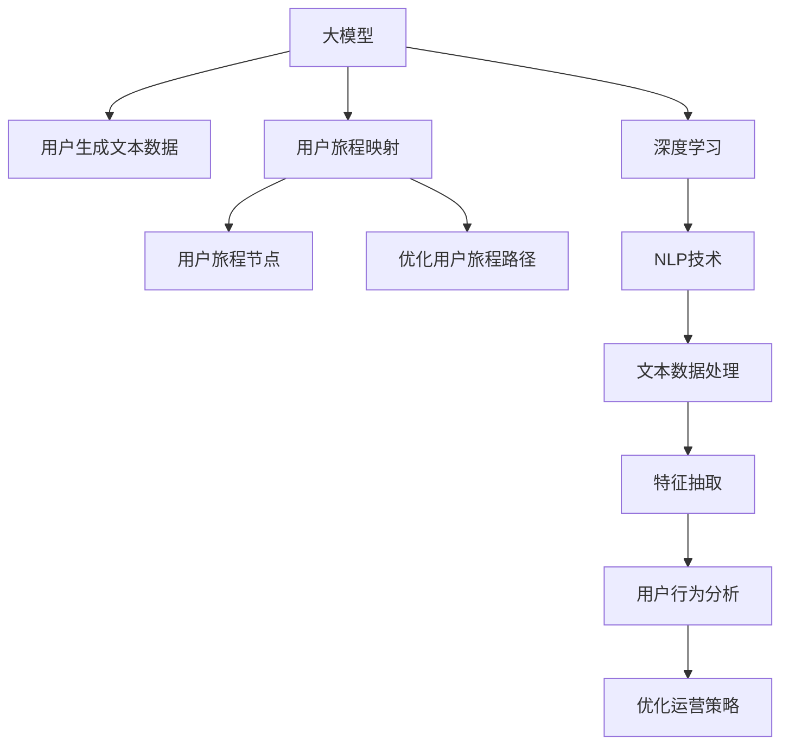

                 

# 大模型如何优化电商平台的用户旅程映射

> 关键词：用户旅程映射, 电商平台, 自然语言处理(NLP), 深度学习, 大模型优化, 电商行为分析, 数据挖掘

## 1. 背景介绍

### 1.1 问题由来
随着电商平台市场的蓬勃发展，企业面临着用户留存、客户转化、市场洞察等诸多挑战。如何精准理解用户需求，提升电商平台的运营效率，成为了当前电商平台亟待解决的问题。用户旅程映射(User Journey Mapping)作为一种有效的用户行为分析工具，可以帮电商平台从用户视角出发，理解用户的购买决策过程，优化用户体验，提升电商效率。

然而，传统的用户旅程映射依赖人工调研和数据分析，成本高、周期长、准确性难以保障。近年来，随着深度学习和自然语言处理技术的飞速进步，基于大模型（如BERT、GPT等）的用户旅程映射方法应运而生。通过大模型的强大语言理解能力，可以自动抽取和分析用户生成的文本数据，快速构建高质量的用户旅程映射，助力电商平台实现智能化运营。

### 1.2 问题核心关键点
基于大模型的用户旅程映射方法，核心在于将用户生成的文本数据（如评论、邮件、聊天记录等）作为输入，通过大模型自动化地提取关键信息，构建用户旅程节点，最终形成完整的用户旅程映射图。具体关键点包括：

1. **自动抽取关键信息**：自动从用户文本中抽取产品评价、需求、问题等关键信息。
2. **构建用户旅程节点**：根据关键信息构建用户旅程的各个阶段，如浏览、购买、评价等。
3. **优化用户旅程路径**：根据用户旅程节点之间的关联关系，优化用户旅程路径，提升电商平台的运营效率。

## 2. 核心概念与联系

### 2.1 核心概念概述

为更好地理解基于大模型的用户旅程映射方法，本节将介绍几个密切相关的核心概念：

- **大模型(Large Model)**：以Transformer为代表的大规模深度学习模型。通过在大规模无标签数据上进行预训练，学习到丰富的语言表示，具备强大的自然语言处理能力。

- **用户旅程映射(User Journey Mapping)**：通过调研和分析，以用户的视角构建用户在完成某项任务（如购买产品）过程中所经历的所有关键步骤，并以图形化方式展示出来。

- **深度学习(Deep Learning)**：一种基于神经网络的机器学习技术，通过多层次的神经网络结构，实现对复杂数据的高级特征提取和分析。

- **自然语言处理(NLP)**：研究计算机如何理解、处理和生成人类语言的技术，通过深度学习模型实现语义理解、情感分析、文本分类等任务。

- **用户行为分析(UBA)**：通过分析用户行为数据，了解用户需求和偏好，从而优化产品和服务，提升用户体验。

这些核心概念之间的逻辑关系可以通过以下Mermaid流程图来展示：



这个流程图展示了大模型、NLP技术、用户行为分析等概念之间的联系：

1. 大模型通过预训练学习到语言表示，是实现用户旅程映射的基础。
2. NLP技术在大模型的基础上，实现自动抽取和处理文本数据。
3. 用户行为分析从文本数据中提取用户需求和行为，指导优化用户旅程路径。
4. 优化用户旅程路径提升电商平台运营效率，驱动电商业务增长。

## 3. 核心算法原理 & 具体操作步骤

### 3.1 算法原理概述

基于大模型的用户旅程映射方法，本质上是一个自动化的文本分析和用户行为建模过程。其核心思想是：利用深度学习和大模型的语言理解能力，自动抽取用户生成的文本数据中的关键信息，并构建用户旅程节点，进而优化用户旅程路径。

形式化地，假设用户生成的文本数据集为 $D=\{x_i\}_{i=1}^N$，其中 $x_i$ 表示用户评论、邮件、聊天记录等文本。定义用户旅程映射图为 $G=(V,E)$，其中 $V$ 表示用户旅程节点，$E$ 表示节点之间的连接关系。映射过程的目标是最大化 $G$ 的准确性和完备性，即 $V$ 应包含所有关键节点，$E$ 应反映所有关键步骤的先后顺序。

通过大模型的预训练和微调，用户旅程映射的构建过程可以自动完成。具体步骤如下：

1. 预训练模型选择：选择适合电商领域的大模型，如BERT、GPT等，作为用户旅程映射的基础模型。
2. 数据处理：清洗和标准化用户生成的文本数据，消除噪声和无用信息。
3. 特征提取：使用预训练模型对文本数据进行特征提取，抽取关键信息。
4. 节点构建：根据提取的关键信息构建用户旅程节点。
5. 路径优化：基于节点之间的关联关系，优化用户旅程路径，形成完整的用户旅程映射图。

### 3.2 算法步骤详解

以下是基于大模型的用户旅程映射算法的详细步骤：

**Step 1: 准备数据集**
- 收集电商平台上的用户生成的文本数据，如评论、邮件、聊天记录等。
- 对文本数据进行清洗和预处理，如去除停用词、标点、特殊符号等。

**Step 2: 特征提取**
- 使用预训练的大模型（如BERT）作为特征提取器，将文本数据转换为向量表示。
- 对向量表示进行编码和解码，抽取文本中的关键信息。

**Step 3: 节点构建**
- 根据提取的关键信息，构建用户旅程的各个阶段节点，如浏览、搜索、比较、购买、评价等。
- 将每个节点的关键信息（如用户评价、产品信息、行为路径等）编码为向量，并存储在节点中。

**Step 4: 路径优化**
- 使用图神经网络（如GNN）等模型，基于节点之间的连接关系，优化用户旅程路径。
- 计算每个节点对后续节点的影响力，形成有向无环图（DAG）结构。
- 根据DAG结构，生成完整用户旅程映射图。

**Step 5: 输出与评估**
- 将用户旅程映射图展示在电商平台上，供运营人员和客户服务人员参考。
- 定期收集用户反馈，评估用户旅程映射图的效果，迭代优化模型。

### 3.3 算法优缺点

基于大模型的用户旅程映射方法具有以下优点：
1. 自动化程度高：完全自动化的文本分析和节点构建过程，避免了人工调研的繁琐和误差。
2. 精度高：大模型强大的语言理解能力，能精准提取关键信息，构建完整的用户旅程节点。
3. 实时性高：模型训练和推理过程均在几秒钟内完成，能够实时响应电商平台的运营需求。
4. 可扩展性强：适用于多种电商场景，如B2B、B2C、C2C等，易于扩展和定制化。

同时，该方法也存在一定的局限性：
1. 数据依赖性强：模型效果依赖于高质量的用户生成数据，数据量不足或数据质量不高会导致结果不准确。
2. 语义理解难度大：用户生成的文本数据通常具有很强的模糊性和主观性，大模型难以完全理解其语义。
3. 图结构复杂：用户旅程路径可能非常复杂，建模过程可能会遇到图结构的局部最优解问题。
4. 隐私问题：用户生成数据可能涉及用户隐私，如何保护用户数据安全是重要问题。

尽管存在这些局限性，但就目前而言，基于大模型的用户旅程映射方法仍是一种高效、可靠的电商平台用户行为分析手段。未来相关研究将重点关注如何进一步降低数据依赖，提高模型的语义理解能力和鲁棒性，同时兼顾隐私保护和模型效率。

### 3.4 算法应用领域

基于大模型的用户旅程映射方法，在电商平台的用户行为分析中得到了广泛应用，涵盖了以下几个主要领域：

- **用户反馈分析**：自动分析用户评论、评分等反馈数据，识别用户满意度、需求和问题，指导产品优化和改进。
- **用户购买路径分析**：自动追踪用户的浏览、搜索、购买行为，分析用户的购买决策过程，发现关键影响因素。
- **客户服务优化**：基于用户旅程映射图，优化客户服务流程，提升客户满意度和忠诚度。
- **广告推荐优化**：分析用户购买行为和偏好，精准推荐产品，提升广告效果和用户转化率。
- **库存管理优化**：通过分析用户购买节点和频率，优化库存配置，减少缺货和过剩。

除了上述这些应用场景外，用户旅程映射方法还可以扩展到更多领域，如物流、金融、教育等，为用户提供个性化的服务和体验，驱动业务增长。

## 4. 数学模型和公式 & 详细讲解 & 举例说明

### 4.1 数学模型构建

本节将使用数学语言对基于大模型的用户旅程映射过程进行更加严格的刻画。

假设用户生成的文本数据集为 $D=\{x_i\}_{i=1}^N$，其中 $x_i$ 表示用户评论、邮件、聊天记录等文本。定义用户旅程映射图为 $G=(V,E)$，其中 $V$ 表示用户旅程节点，$E$ 表示节点之间的连接关系。映射过程的目标是最大化 $G$ 的准确性和完备性，即 $V$ 应包含所有关键节点，$E$ 应反映所有关键步骤的先后顺序。

**节点表示**：将每个用户旅程节点 $v_j$ 表示为一个向量 $\textbf{v}_j=(v_j^{(i)})_{i=1}^{m}$，其中 $v_j^{(i)}$ 为节点 $v_j$ 的第 $i$ 个特征。

**节点连接**：定义节点 $v_j$ 和 $v_k$ 之间的连接关系 $e_{jk}$，表示从节点 $v_j$ 到 $v_k$ 的权重，即 $e_{jk}=\text{weight}(v_j,v_k)$。

**用户旅程路径**：定义用户旅程路径 $p_i$，表示从起点 $v_s$ 到终点 $v_e$ 的路径，即 $p_i=(v_{s_i},v_{e_i})$。

### 4.2 公式推导过程

以下我们以用户购买路径分析为例，推导基于大模型的用户旅程路径分析公式。

假设用户购买路径为 $p=(\text{browsing},\text{search},\text{compare},\text{purchase})$，购买产品 $P$。则路径分析的目标是最大化路径的转化率和满意度，即最大化 $\text{satisfaction}(p,P)$。

根据用户生成的文本数据 $D=\{x_i\}_{i=1}^N$，使用BERT模型提取文本特征 $\textbf{v}_j=(v_j^{(i)})_{i=1}^{m}$，其中 $j$ 表示节点编号，$i$ 表示特征编号。

假设用户路径 $p$ 的转化率和满意度分别为 $C(p)$ 和 $S(p)$，则路径分析的目标函数为：

$$
\text{Optimize}(C(p),S(p)) \text{ with respect to } p
$$

为了求解上述优化问题，可以采用以下步骤：

1. 提取用户路径 $p$ 中的关键信息，如产品名称、价格、评价等，编码为向量 $\textbf{p}=(\textbf{p}^{(i)})_{i=1}^{m}$。
2. 使用大模型进行情感分析，计算路径 $p$ 的情感得分 $E(p)$。
3. 计算路径 $p$ 的转化率和满意度 $C(p)$ 和 $S(p)$。
4. 基于节点之间的连接关系 $e_{jk}$，使用图神经网络（如GCN）等模型，计算路径 $p$ 的整体得分 $\text{Score}(p)$。
5. 优化路径得分 $\text{Score}(p)$，最大化 $\text{Score}(p)$ 与用户生成的文本数据之间的相似度，即最大化 $\text{Similarity}(\textbf{p},D)$。

通过上述步骤，可以自动抽取和分析用户生成数据，构建用户购买路径，并进行路径优化，从而提升电商平台的运营效率。

## 5. 项目实践：代码实例和详细解释说明

### 5.1 开发环境搭建

在进行用户旅程映射实践前，我们需要准备好开发环境。以下是使用Python进行PyTorch开发的环境配置流程：

1. 安装Anaconda：从官网下载并安装Anaconda，用于创建独立的Python环境。

2. 创建并激活虚拟环境：
```bash
conda create -n pytorch-env python=3.8 
conda activate pytorch-env
```

3. 安装PyTorch：根据CUDA版本，从官网获取对应的安装命令。例如：
```bash
conda install pytorch torchvision torchaudio cudatoolkit=11.1 -c pytorch -c conda-forge
```

4. 安装Transformers库：
```bash
pip install transformers
```

5. 安装各类工具包：
```bash
pip install numpy pandas scikit-learn matplotlib tqdm jupyter notebook ipython
```

完成上述步骤后，即可在`pytorch-env`环境中开始用户旅程映射实践。

### 5.2 源代码详细实现

下面我们以用户购买路径分析为例，给出使用Transformers库对BERT模型进行用户旅程映射的PyTorch代码实现。

首先，定义用户购买路径的数据处理函数：

```python
from transformers import BertTokenizer, BertModel

class PurchasePathDataset(Dataset):
    def __init__(self, texts, labels, tokenizer, max_len=128):
        self.texts = texts
        self.labels = labels
        self.tokenizer = tokenizer
        self.max_len = max_len
        
    def __len__(self):
        return len(self.texts)
    
    def __getitem__(self, item):
        text = self.texts[item]
        label = self.labels[item]
        
        encoding = self.tokenizer(text, return_tensors='pt', max_length=self.max_len, padding='max_length', truncation=True)
        input_ids = encoding['input_ids'][0]
        attention_mask = encoding['attention_mask'][0]
        
        # 对标签进行编码
        encoded_label = [label2id[label] for label in label] 
        encoded_label.extend([label2id['O']] * (self.max_len - len(encoded_label)))
        labels = torch.tensor(encoded_label, dtype=torch.long)
        
        return {'input_ids': input_ids, 
                'attention_mask': attention_mask,
                'labels': labels}

# 标签与id的映射
label2id = {'O': 0, 'b': 1, 'i': 2}
id2label = {v: k for k, v in label2id.items()}

# 创建dataset
tokenizer = BertTokenizer.from_pretrained('bert-base-cased')

train_dataset = PurchasePathDataset(train_texts, train_labels, tokenizer)
dev_dataset = PurchasePathDataset(dev_texts, dev_labels, tokenizer)
test_dataset = PurchasePathDataset(test_texts, test_labels, tokenizer)
```

然后，定义模型和优化器：

```python
from transformers import BertForTokenClassification, AdamW

model = BertForTokenClassification.from_pretrained('bert-base-cased', num_labels=len(label2id))

optimizer = AdamW(model.parameters(), lr=2e-5)
```

接着，定义训练和评估函数：

```python
from torch.utils.data import DataLoader
from tqdm import tqdm
from sklearn.metrics import classification_report

device = torch.device('cuda') if torch.cuda.is_available() else torch.device('cpu')
model.to(device)

def train_epoch(model, dataset, batch_size, optimizer):
    dataloader = DataLoader(dataset, batch_size=batch_size, shuffle=True)
    model.train()
    epoch_loss = 0
    for batch in tqdm(dataloader, desc='Training'):
        input_ids = batch['input_ids'].to(device)
        attention_mask = batch['attention_mask'].to(device)
        labels = batch['labels'].to(device)
        model.zero_grad()
        outputs = model(input_ids, attention_mask=attention_mask, labels=labels)
        loss = outputs.loss
        epoch_loss += loss.item()
        loss.backward()
        optimizer.step()
    return epoch_loss / len(dataloader)

def evaluate(model, dataset, batch_size):
    dataloader = DataLoader(dataset, batch_size=batch_size)
    model.eval()
    preds, labels = [], []
    with torch.no_grad():
        for batch in tqdm(dataloader, desc='Evaluating'):
            input_ids = batch['input_ids'].to(device)
            attention_mask = batch['attention_mask'].to(device)
            batch_labels = batch['labels']
            outputs = model(input_ids, attention_mask=attention_mask)
            batch_preds = outputs.logits.argmax(dim=2).to('cpu').tolist()
            batch_labels = batch_labels.to('cpu').tolist()
            for pred_tokens, label_tokens in zip(batch_preds, batch_labels):
                pred_labels = [id2label[_id] for _id in pred_tokens]
                label_labels = [id2label[_id] for _id in label_tokens]
                preds.append(pred_labels[:len(label_labels)])
                labels.append(label_labels)
                
    print(classification_report(labels, preds))
```

最后，启动训练流程并在测试集上评估：

```python
epochs = 5
batch_size = 16

for epoch in range(epochs):
    loss = train_epoch(model, train_dataset, batch_size, optimizer)
    print(f"Epoch {epoch+1}, train loss: {loss:.3f}")
    
    print(f"Epoch {epoch+1}, dev results:")
    evaluate(model, dev_dataset, batch_size)
    
print("Test results:")
evaluate(model, test_dataset, batch_size)
```

以上就是使用PyTorch对BERT进行用户购买路径分析的完整代码实现。可以看到，得益于Transformers库的强大封装，我们可以用相对简洁的代码完成BERT模型的加载和微调。

### 5.3 代码解读与分析

让我们再详细解读一下关键代码的实现细节：

**PurchasePathDataset类**：
- `__init__`方法：初始化文本、标签、分词器等关键组件。
- `__len__`方法：返回数据集的样本数量。
- `__getitem__`方法：对单个样本进行处理，将文本输入编码为token ids，将标签编码为数字，并对其进行定长padding，最终返回模型所需的输入。

**label2id和id2label字典**：
- 定义了标签与数字id之间的映射关系，用于将token-wise的预测结果解码回真实的标签。

**训练和评估函数**：
- 使用PyTorch的DataLoader对数据集进行批次化加载，供模型训练和推理使用。
- 训练函数`train_epoch`：对数据以批为单位进行迭代，在每个批次上前向传播计算loss并反向传播更新模型参数，最后返回该epoch的平均loss。
- 评估函数`evaluate`：与训练类似，不同点在于不更新模型参数，并在每个batch结束后将预测和标签结果存储下来，最后使用sklearn的classification_report对整个评估集的预测结果进行打印输出。

**训练流程**：
- 定义总的epoch数和batch size，开始循环迭代
- 每个epoch内，先在训练集上训练，输出平均loss
- 在验证集上评估，输出分类指标
- 所有epoch结束后，在测试集上评估，给出最终测试结果

可以看到，PyTorch配合Transformers库使得BERT微调的用户旅程映射代码实现变得简洁高效。开发者可以将更多精力放在数据处理、模型改进等高层逻辑上，而不必过多关注底层的实现细节。

当然，工业级的系统实现还需考虑更多因素，如模型的保存和部署、超参数的自动搜索、更灵活的任务适配层等。但核心的微调范式基本与此类似。

## 6. 实际应用场景

### 6.1 智能客服系统

基于大模型的用户旅程映射方法，可以广泛应用于智能客服系统的构建。传统客服往往需要配备大量人力，高峰期响应缓慢，且一致性和专业性难以保证。使用用户旅程映射方法，可以自动分析用户生成的对话记录，构建用户行为路径，优化客服流程，提升用户满意度。

在技术实现上，可以收集客服对话记录，提取用户表达的需求、问题和评价，自动构建用户旅程节点，并根据路径分析结果优化客服策略。微调后的模型能够自动理解用户意图，匹配最合适的客服路径，提升客户服务的智能化水平，提高客户满意度和忠诚度。

### 6.2 金融风险预测

金融行业需要实时监控市场风险，识别潜在的欺诈行为和异常交易。传统的风险预测依赖人工调研和数据分析，成本高、效率低，难以适应实时性要求。使用用户旅程映射方法，可以自动分析用户生成的交易记录，识别异常行为，预测潜在风险。

具体而言，可以收集用户交易数据，提取交易行为节点，如转账、消费、交易时间等。根据节点之间的连接关系，自动构建用户交易路径，并使用图神经网络进行路径分析，识别出异常交易路径。根据路径分析结果，及时预警风险，避免金融损失。

### 6.3 健康医疗咨询

医疗行业需要提供精准的健康医疗咨询服务，提升用户体验和满意度。传统的健康咨询依赖专业医生的人工诊断，成本高、效率低。使用用户旅程映射方法，可以自动分析用户的健康查询记录，构建用户健康咨询路径，优化咨询流程。

在技术实现上，可以收集用户健康咨询记录，提取用户的症状描述、历史病例、诊断结果等关键信息，自动构建用户健康咨询路径。根据路径分析结果，推荐最合适的健康咨询方案，提升健康咨询的准确性和效率。

### 6.4 未来应用展望

随着大模型和用户旅程映射技术的不断发展，未来在更多领域中得到应用，为传统行业带来变革性影响。

在智慧医疗领域，基于用户旅程映射的医疗咨询和健康监测系统，可以自动分析用户健康数据，识别健康风险，提供个性化的健康建议，提升医疗服务的智能化水平。

在智能教育领域，用户旅程映射方法可以自动分析学生的学习记录，构建学生学习路径，优化教学策略，提供个性化的学习方案，促进教育公平，提高教学质量。

在智慧城市治理中，用户旅程映射方法可以自动分析市民的投诉记录，构建市民投诉路径，优化投诉处理流程，提高市民满意度，提升城市治理的智能化水平。

此外，在企业生产、社会治理、文娱传媒等众多领域，基于大模型的用户旅程映射技术也将不断涌现，为传统行业带来新的变革。相信随着技术的日益成熟，用户旅程映射方法将成为AI技术落地应用的重要手段，推动AI技术在垂直行业的规模化落地。

## 7. 工具和资源推荐

### 7.1 学习资源推荐

为了帮助开发者系统掌握大模型和用户旅程映射的理论基础和实践技巧，这里推荐一些优质的学习资源：

1. 《Transformer从原理到实践》系列博文：由大模型技术专家撰写，深入浅出地介绍了Transformer原理、BERT模型、用户旅程映射等前沿话题。

2. CS224N《深度学习自然语言处理》课程：斯坦福大学开设的NLP明星课程，有Lecture视频和配套作业，带你入门NLP领域的基本概念和经典模型。

3. 《Natural Language Processing with Transformers》书籍：Transformers库的作者所著，全面介绍了如何使用Transformers库进行NLP任务开发，包括用户旅程映射在内的诸多范式。

4. HuggingFace官方文档：Transformers库的官方文档，提供了海量预训练模型和完整的用户旅程映射样例代码，是上手实践的必备资料。

5. CLUE开源项目：中文语言理解测评基准，涵盖大量不同类型的中文NLP数据集，并提供了基于用户旅程映射的baseline模型，助力中文NLP技术发展。

通过对这些资源的学习实践，相信你一定能够快速掌握大模型和用户旅程映射的精髓，并用于解决实际的NLP问题。
###  7.2 开发工具推荐

高效的开发离不开优秀的工具支持。以下是几款用于大模型和用户旅程映射开发的常用工具：

1. PyTorch：基于Python的开源深度学习框架，灵活动态的计算图，适合快速迭代研究。大部分预训练语言模型都有PyTorch版本的实现。

2. TensorFlow：由Google主导开发的开源深度学习框架，生产部署方便，适合大规模工程应用。同样有丰富的预训练语言模型资源。

3. Transformers库：HuggingFace开发的NLP工具库，集成了众多SOTA语言模型，支持PyTorch和TensorFlow，是进行用户旅程映射开发的利器。

4. Weights & Biases：模型训练的实验跟踪工具，可以记录和可视化模型训练过程中的各项指标，方便对比和调优。与主流深度学习框架无缝集成。

5. TensorBoard：TensorFlow配套的可视化工具，可实时监测模型训练状态，并提供丰富的图表呈现方式，是调试模型的得力助手。

6. Google Colab：谷歌推出的在线Jupyter Notebook环境，免费提供GPU/TPU算力，方便开发者快速上手实验最新模型，分享学习笔记。

合理利用这些工具，可以显著提升大模型和用户旅程映射任务的开发效率，加快创新迭代的步伐。

### 7.3 相关论文推荐

大模型和用户旅程映射技术的发展源于学界的持续研究。以下是几篇奠基性的相关论文，推荐阅读：

1. Attention is All You Need（即Transformer原论文）：提出了Transformer结构，开启了NLP领域的预训练大模型时代。

2. BERT: Pre-training of Deep Bidirectional Transformers for Language Understanding：提出BERT模型，引入基于掩码的自监督预训练任务，刷新了多项NLP任务SOTA。

3. Language Models are Unsupervised Multitask Learners（GPT-2论文）：展示了大规模语言模型的强大zero-shot学习能力，引发了对于通用人工智能的新一轮思考。

4. Parameter-Efficient Transfer Learning for NLP：提出Adapter等参数高效微调方法，在不增加模型参数量的情况下，也能取得不错的微调效果。

5. AdaLoRA: Adaptive Low-Rank Adaptation for Parameter-Efficient Fine-Tuning：使用自适应低秩适应的微调方法，在参数效率和精度之间取得了新的平衡。

6. Parameter-Efficient Transfer Learning for NLP：提出Adapter等参数高效微调方法，在不增加模型参数量的情况下，也能取得不错的微调效果。

这些论文代表了大模型和用户旅程映射技术的发展脉络。通过学习这些前沿成果，可以帮助研究者把握学科前进方向，激发更多的创新灵感。

## 8. 总结：未来发展趋势与挑战

### 8.1 总结

本文对基于大模型的用户旅程映射方法进行了全面系统的介绍。首先阐述了大模型和用户旅程映射的研究背景和意义，明确了其对于电商平台智能化运营的独特价值。其次，从原理到实践，详细讲解了用户旅程映射的数学原理和关键步骤，给出了用户旅程映射任务开发的完整代码实例。同时，本文还广泛探讨了用户旅程映射方法在智能客服、金融风险预测、健康医疗咨询等多个行业领域的应用前景，展示了其巨大潜力。此外，本文精选了用户旅程映射技术的各类学习资源，力求为读者提供全方位的技术指引。

通过本文的系统梳理，可以看到，基于大模型的用户旅程映射方法正在成为电商平台智能化运营的重要范式，极大地拓展了电商平台的用户行为分析能力，助力电商平台实现智能化转型。未来，伴随大模型和用户旅程映射方法的持续演进，相信电商平台将迎来更广阔的发展空间，带来更多的商业价值和社会效益。

### 8.2 未来发展趋势

展望未来，大模型和用户旅程映射技术将呈现以下几个发展趋势：

1. 模型规模持续增大。随着算力成本的下降和数据规模的扩张，预训练语言模型的参数量还将持续增长。超大规模语言模型蕴含的丰富语言知识，有望支撑更加复杂多变的用户旅程节点分析。

2. 用户旅程分析方法多样化。除了传统的图神经网络方法外，未来会涌现更多新的分析方法，如因果推理、对比学习等，在提高分析精度的同时，降低对标注数据的依赖。

3. 多模态数据融合。除了文本数据外，用户旅程映射将更多地融合语音、图像、视频等多模态数据，提供更全面、丰富的用户行为分析。

4. 实时分析能力提升。随着模型的推理速度提升和计算资源的丰富，实时分析用户旅程路径将成为可能，进一步提升电商平台的用户体验。

5. 应用场景扩展。用户旅程映射技术将从电商领域扩展到更多领域，如金融、医疗、教育等，提升各行各业的智能化水平。

以上趋势凸显了大模型和用户旅程映射技术的广阔前景。这些方向的探索发展，必将进一步提升电商平台的用户体验和运营效率，带来更多的商业价值。

### 8.3 面临的挑战

尽管大模型和用户旅程映射技术已经取得了瞩目成就，但在迈向更加智能化、普适化应用的过程中，它仍面临着诸多挑战：

1. 数据依赖性强。模型效果依赖于高质量的用户生成数据，数据量不足或数据质量不高会导致结果不准确。如何降低对标注数据的依赖，提高模型的泛化能力，将是重要的研究方向。

2. 隐私保护问题。用户生成数据涉及用户隐私，如何保护用户数据安全，是实现用户旅程映射的关键问题。

3. 语义理解难度大。用户生成的文本数据通常具有很强的模糊性和主观性，大模型难以完全理解其语义，导致节点构建不准确。如何提高模型的语义理解能力，准确构建用户旅程节点，是未来需要突破的难点。

4. 图结构复杂。用户旅程路径可能非常复杂，建模过程可能会遇到图结构的局部最优解问题。如何优化路径分析算法，提高路径分析的准确性和效率，是重要的研究课题。

5. 鲁棒性不足。当前模型面对域外数据时，泛化性能往往大打折扣。如何提高模型的鲁棒性，避免灾难性遗忘，还需要更多理论和实践的积累。

尽管存在这些挑战，但就目前而言，基于大模型的用户旅程映射方法仍是一种高效、可靠的用户行为分析手段。未来相关研究将重点关注如何进一步降低数据依赖，提高模型的语义理解能力和鲁棒性，同时兼顾隐私保护和模型效率。

### 8.4 研究展望

面对大模型和用户旅程映射所面临的挑战，未来的研究需要在以下几个方面寻求新的突破：

1. 探索无监督和半监督用户旅程映射方法。摆脱对大规模标注数据的依赖，利用自监督学习、主动学习等无监督和半监督范式，最大限度利用非结构化数据，实现更加灵活高效的用户旅程映射。

2. 研究参数高效和计算高效的微调范式。开发更加参数高效的微调方法，在固定大部分预训练参数的情况下，只更新极少量的任务相关参数。同时优化微调模型的计算图，减少前向传播和反向传播的资源消耗，实现更加轻量级、实时性的部署。

3. 引入更多先验知识。将符号化的先验知识，如知识图谱、逻辑规则等，与神经网络模型进行巧妙融合，引导用户旅程映射过程学习更准确、合理的语言模型。同时加强不同模态数据的整合，实现视觉、语音等多模态信息与文本信息的协同建模。

4. 结合因果分析和博弈论工具。将因果分析方法引入用户旅程映射模型，识别出模型决策的关键特征，增强输出解释的因果性和逻辑性。借助博弈论工具刻画人机交互过程，主动探索并规避模型的脆弱点，提高系统稳定性。

5. 纳入伦理道德约束。在模型训练目标中引入伦理导向的评估指标，过滤和惩罚有偏见、有害的输出倾向。同时加强人工干预和审核，建立模型行为的监管机制，确保输出符合人类价值观和伦理道德。

这些研究方向的探索，必将引领大模型和用户旅程映射技术迈向更高的台阶，为构建安全、可靠、可解释、可控的智能系统铺平道路。面向未来，大模型和用户旅程映射技术还需要与其他人工智能技术进行更深入的融合，如知识表示、因果推理、强化学习等，多路径协同发力，共同推动自然语言理解和智能交互系统的进步。只有勇于创新、敢于突破，才能不断拓展语言模型的边界，让智能技术更好地造福人类社会。

## 9. 附录：常见问题与解答

**Q1：大模型如何处理多模态数据？**

A: 大模型处理多模态数据通常采用两种方式：一种是将多模态数据融合到同一个大模型中，另一种是将多模态数据分别输入多个小模型进行预处理，然后再融合到大模型中进行分析。对于电商平台的用户旅程映射，可以将用户的文本数据、图片数据、视频数据分别进行处理，然后使用图神经网络将不同类型的特征融合在一起，进行多模态分析。

**Q2：大模型在处理噪声数据时如何优化？**

A: 大模型在处理噪声数据时，通常通过引入数据清洗和预处理环节，去除噪声数据。同时，可以通过引入正则化技术，如L2正则、Dropout等，降低模型对噪声数据的敏感性。此外，可以通过对抗训练等技术，提高模型的鲁棒性，增强其对噪声数据的处理能力。

**Q3：大模型在处理长序列数据时如何优化？**

A: 大模型在处理长序列数据时，通常会遇到计算资源和计算速度的瓶颈。可以通过引入自注意力机制、分层编码等方式，优化模型的计算效率。此外，可以使用分布式训练、混合精度训练等技术，加速模型训练过程。对于用户旅程映射任务，可以通过对文本数据进行分块、分段处理，将长序列数据分解为多个小块进行模型推理。

**Q4：大模型在优化用户体验方面有哪些具体应用？**

A: 大模型在优化用户体验方面有多种具体应用，如智能客服、个性化推荐、智能广告等。通过用户旅程映射方法，可以自动分析用户的浏览、搜索、购买行为，构建用户行为路径，优化用户流程。对于智能客服系统，可以根据用户路径分析结果，自动生成客服回答，提升客服效率和客户满意度。对于个性化推荐系统，可以根据用户购买路径和行为分析结果，推荐个性化的商品，提升用户转化率和满意度。

**Q5：如何处理用户生成的文本数据中的噪声和无用信息？**

A: 用户生成的文本数据通常包含大量的噪声和无用信息，需要通过预处理环节进行清洗和过滤。可以引入NLP技术，如分词、去停用词、去标点等，去除文本数据中的无关信息。同时，可以通过模型训练过程中的正则化技术，如L2正则、Dropout等，降低模型对噪声数据的敏感性。此外，可以引入对抗训练等技术，提高模型的鲁棒性，增强其对噪声数据的处理能力。

这些常见问题的解答，将帮助开发者更好地理解大模型和用户旅程映射技术的应用，解决实际问题。

