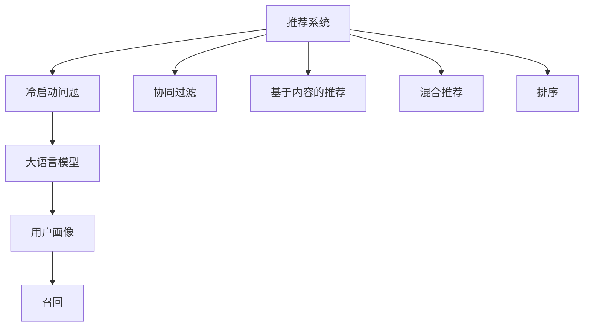

                 

# 大模型对推荐系统冷启动的影响研究

> 关键词：推荐系统,冷启动,大模型,预训练,用户画像,召回,排序

## 1. 背景介绍

推荐系统是互联网企业提供的重要服务，通过分析用户的历史行为数据，为用户推荐感兴趣的物品。但推荐系统在实际应用中，经常面临冷启动问题：即在用户没有足够的历史行为数据的情况下，如何准确地为用户推荐物品。这限制了推荐系统在市场上的推广和应用。

为了解决冷启动问题，研究人员提出了基于协同过滤和基于内容的推荐方法。前者通过分析用户和物品的相似度进行推荐，后者通过物品属性和用户偏好进行推荐。但这些方法在冷启动时效果不佳，无法覆盖新用户和新物品。

近年来，大语言模型（Large Language Models, LLMs）在自然语言处理领域取得了突破性进展。预训练语言模型通过在大规模无标签文本语料上进行训练，学习到了丰富的语言知识，具备强大的语言理解和生成能力。这些能力不仅在理解用户文本查询时表现优异，还为推荐系统的冷启动问题提供了新的思路和方法。

## 2. 核心概念与联系

### 2.1 核心概念概述

- **推荐系统(Recommender Systems)**：通过分析用户和物品之间的关系，为每个用户推荐其可能感兴趣的物品的系统。常见的推荐系统有协同过滤、基于内容的推荐、混合推荐等。

- **冷启动问题(Cold Start Problem)**：新用户或新物品缺乏足够的历史行为数据，无法建立有效的用户画像或物品画像，难以进行准确推荐的问题。

- **大语言模型(Large Language Models, LLMs)**：通过大规模无标签文本语料预训练得到的深度学习模型，具备强大的语言理解和生成能力。代表模型有BERT、GPT等。

- **用户画像(User Profile)**：通过用户的历史行为数据，学习得到的用户兴趣偏好模型，用于指导推荐系统进行个性化推荐。

- **召回(Recall)**：推荐系统中推荐结果与用户实际兴趣的匹配度，是衡量推荐系统效果的重要指标之一。

- **排序(Ranking)**：推荐系统通过一定的评分函数，对候选物品进行排序，最终输出给用户的推荐结果。

这些核心概念之间的逻辑关系可以通过以下Mermaid流程图来展示：



这个流程图展示了大语言模型如何为推荐系统的冷启动问题提供解决方案：

1. 通过大语言模型，在用户和物品的文本描述中挖掘隐含的语义信息，建立物品画像。
2. 在用户没有足够的历史行为数据时，通过物品画像进行推荐，以提高召回率。
3. 结合用户画像和物品画像，对候选物品进行排序，以优化推荐效果。

## 3. 核心算法原理 & 具体操作步骤
### 3.1 算法原理概述

基于大语言模型的推荐系统，主要通过两个步骤实现：
1. 通过大语言模型建立物品画像和用户画像，用于推荐召回。
2. 将物品画像和用户画像输入到推荐模型中，对候选物品进行排序。

### 3.2 算法步骤详解

#### 3.2.1 物品画像的建立

物品画像的建立是大语言模型推荐系统的核心步骤之一。具体步骤如下：

1. 收集物品的文本描述，可以是产品描述、用户评论、新闻报道等。
2. 将文本描述输入到预训练语言模型中，得到文本的语义向量表示。
3. 对语义向量进行编码，得到物品的隐含语义信息。

物品画像的建立过程可以用以下公式表示：

$$
\text{item\_representation} = \text{BERT}(\text{item\_description})
$$

其中，$\text{item\_representation}$ 为物品的隐含语义信息，$\text{item\_description}$ 为物品的文本描述，$\text{BERT}$ 为预训练语言模型。

#### 3.2.2 用户画像的建立

用户画像的建立过程与物品画像类似，只不过输入的是用户的文本描述，如用户评论、浏览历史等。

1. 收集用户的文本描述，包含用户评论、浏览历史等。
2. 将文本描述输入到预训练语言模型中，得到文本的语义向量表示。
3. 对语义向量进行编码，得到用户的隐含语义信息。

用户画像的建立过程可以用以下公式表示：

$$
\text{user\_representation} = \text{BERT}(\text{user\_description})
$$

其中，$\text{user\_representation}$ 为用户的隐含语义信息，$\text{user\_description}$ 为用户的文本描述，$\text{BERT}$ 为预训练语言模型。

#### 3.2.3 推荐召回

在用户没有足够的历史行为数据时，可以通过物品画像进行推荐召回。具体步骤如下：

1. 将物品画像和用户画像输入到推荐模型中，计算用户与物品之间的相似度。
2. 根据相似度从物品库中选取Top N个物品，作为推荐候选。
3. 将推荐候选输出给用户，等待用户反馈。

推荐召回过程可以用以下公式表示：

$$
\text{similarity}(\text{item\_representation}, \text{user\_representation}) = \text{cosine}(\text{item\_representation}, \text{user\_representation})
$$

其中，$\text{similarity}$ 为用户与物品之间的相似度，$\text{cosine}$ 为余弦相似度函数。

#### 3.2.4 推荐排序

在物品画像和用户画像确定后，可以通过排序算法对候选物品进行排序。具体步骤如下：

1. 对物品画像和用户画像进行拼接，形成用户-物品的向量表示。
2. 通过评分函数计算物品向量与用户向量之间的相似度。
3. 根据相似度对物品进行排序，得到最终的推荐列表。

推荐排序过程可以用以下公式表示：

$$
\text{score}(\text{item\_representation}, \text{user\_representation}) = \text{MLP}(\text{concat}(\text{item\_representation}, \text{user\_representation}))
$$

其中，$\text{score}$ 为物品向量与用户向量的相似度评分，$\text{MLP}$ 为多层感知器，$\text{concat}$ 为拼接操作。

### 3.3 算法优缺点

#### 3.3.1 优点

- 泛化能力强。预训练语言模型在大规模无标签文本语料上预训练，具备较强的泛化能力，可以处理各种文本描述。
- 召回率高。通过物品画像进行推荐召回，即使用户没有足够的历史行为数据，也能保证一定的召回率。
- 性能可扩展。可以通过并行处理，提高大语言模型对海量文本的计算效率。

#### 3.3.2 缺点

- 资源消耗大。预训练语言模型需要大量的计算资源和时间，可能不适合小规模的推荐系统。
- 数据隐私问题。预训练语言模型需要收集大量文本数据进行预训练，存在用户隐私泄露的风险。
- 模型复杂度高。预训练语言模型的参数量很大，模型复杂度高，需要较高的计算资源和存储资源。

### 3.4 算法应用领域

基于大语言模型的推荐系统，已经被广泛应用于多个领域，例如：

- 电商推荐：如淘宝、京东等电商平台，通过分析产品描述、用户评论等文本信息，为用户推荐商品。
- 新闻推荐：如今日头条、知乎等新闻平台，通过分析文章标题、内容等文本信息，为用户推荐新闻。
- 视频推荐：如Netflix、YouTube等视频平台，通过分析视频描述、用户评论等文本信息，为用户推荐视频。
- 音乐推荐：如Spotify、网易云音乐等音乐平台，通过分析歌曲描述、用户评论等文本信息，为用户推荐歌曲。
- 社交推荐：如微信朋友圈、微博等社交平台，通过分析用户评论、分享等文本信息，为用户推荐朋友或内容。

这些推荐系统不仅提高了用户的使用体验，还大幅提升了平台的转化率和用户粘性。

## 4. 数学模型和公式 & 详细讲解 & 举例说明

### 4.1 数学模型构建

#### 4.1.1 物品画像的数学模型

物品画像的建立过程可以用以下公式表示：

$$
\text{item\_representation} = \text{BERT}(\text{item\_description})
$$

其中，$\text{item\_representation} \in \mathbb{R}^d$ 为物品的隐含语义信息，$d$ 为模型输出的维度，$\text{item\_description} \in \mathbb{R}$ 为物品的文本描述，$\text{BERT}$ 为预训练语言模型。

#### 4.1.2 用户画像的数学模型

用户画像的建立过程可以用以下公式表示：

$$
\text{user\_representation} = \text{BERT}(\text{user\_description})
$$

其中，$\text{user\_representation} \in \mathbb{R}^d$ 为用户的隐含语义信息，$d$ 为模型输出的维度，$\text{user\_description} \in \mathbb{R}$ 为用户的文本描述，$\text{BERT}$ 为预训练语言模型。

#### 4.1.3 推荐召回的数学模型

推荐召回过程可以用以下公式表示：

$$
\text{similarity}(\text{item\_representation}, \text{user\_representation}) = \text{cosine}(\text{item\_representation}, \text{user\_representation})
$$

其中，$\text{similarity} \in [0,1]$ 为物品与用户之间的相似度，$\text{cosine}$ 为余弦相似度函数。

#### 4.1.4 推荐排序的数学模型

推荐排序过程可以用以下公式表示：

$$
\text{score}(\text{item\_representation}, \text{user\_representation}) = \text{MLP}(\text{concat}(\text{item\_representation}, \text{user\_representation}))
$$

其中，$\text{score} \in [0,1]$ 为物品向量与用户向量的相似度评分，$\text{MLP}$ 为多层感知器，$\text{concat}$ 为拼接操作。

### 4.2 公式推导过程

#### 4.2.1 物品画像的公式推导

物品画像的建立过程，本质上是将物品的文本描述映射到高维向量空间中的过程。具体推导如下：

设 $\text{item\_description} = \{w_1, w_2, \cdots, w_n\}$，其中 $w_i$ 为物品描述中的第 $i$ 个词。

预训练语言模型将 $\text{item\_description}$ 转化为语义向量 $\text{item\_representation} = \{v_1, v_2, \cdots, v_n\}$，其中 $v_i$ 为物品描述中第 $i$ 个词的语义向量。

物品画像的建立过程可以表示为：

$$
\text{item\_representation} = \text{BERT}(\text{item\_description})
$$

#### 4.2.2 用户画像的公式推导

用户画像的建立过程与物品画像类似，只是输入的是用户的文本描述。

设 $\text{user\_description} = \{u_1, u_2, \cdots, u_n\}$，其中 $u_i$ 为用户描述中的第 $i$ 个词。

预训练语言模型将 $\text{user\_description}$ 转化为语义向量 $\text{user\_representation} = \{u_1, u_2, \cdots, u_n\}$，其中 $u_i$ 为用户描述中第 $i$ 个词的语义向量。

用户画像的建立过程可以表示为：

$$
\text{user\_representation} = \text{BERT}(\text{user\_description})
$$

#### 4.2.3 推荐召回的公式推导

推荐召回过程的数学模型为余弦相似度。具体推导如下：

物品与用户之间的相似度 $\text{similarity}$ 可以表示为：

$$
\text{similarity} = \text{cosine}(\text{item\_representation}, \text{user\_representation})
$$

其中，$\text{cosine}$ 为余弦相似度函数，计算公式为：

$$
\text{cosine}(\text{item\_representation}, \text{user\_representation}) = \frac{\text{item\_representation} \cdot \text{user\_representation}}{\|\text{item\_representation}\| \cdot \|\text{user\_representation}\|}
$$

#### 4.2.4 推荐排序的公式推导

推荐排序过程的数学模型为多层感知器（MLP）。具体推导如下：

物品向量与用户向量拼接后，表示为 $\text{concat}(\text{item\_representation}, \text{user\_representation})$。

MLP的输入为 $\text{concat}(\text{item\_representation}, \text{user\_representation})$，输出为 $\text{score}$。

MLP的计算过程可以表示为：

$$
\text{score} = \text{MLP}(\text{concat}(\text{item\_representation}, \text{user\_representation}))
$$

### 4.3 案例分析与讲解

#### 4.3.1 电商推荐案例

电商推荐系统中，用户没有足够的浏览历史数据，难以建立准确的物品画像。通过大语言模型对商品描述进行编码，可以得到商品的隐含语义信息，用于推荐召回。具体步骤如下：

1. 收集商品描述，输入到BERT模型中，得到商品画像 $\text{item\_representation}$。
2. 收集用户的搜索历史，输入到BERT模型中，得到用户画像 $\text{user\_representation}$。
3. 计算商品画像和用户画像之间的相似度 $\text{similarity}$。
4. 根据相似度，从商品库中选取Top N个商品，作为推荐候选。
5. 对推荐候选进行排序，输出最终推荐列表。

#### 4.3.2 新闻推荐案例

新闻推荐系统中，用户没有足够的阅读历史数据，难以建立准确的用户画像。通过大语言模型对文章标题进行编码，可以得到文章的隐含语义信息，用于推荐召回。具体步骤如下：

1. 收集文章标题，输入到BERT模型中，得到文章画像 $\text{item\_representation}$。
2. 收集用户的阅读历史，输入到BERT模型中，得到用户画像 $\text{user\_representation}$。
3. 计算文章画像和用户画像之间的相似度 $\text{similarity}$。
4. 根据相似度，从文章库中选取Top N篇文章，作为推荐候选。
5. 对推荐候选进行排序，输出最终推荐列表。

## 5. 项目实践：代码实例和详细解释说明
### 5.1 开发环境搭建

在进行大语言模型推荐系统开发前，需要准备好开发环境。以下是使用Python进行PyTorch开发的环境配置流程：

1. 安装Anaconda：从官网下载并安装Anaconda，用于创建独立的Python环境。

2. 创建并激活虚拟环境：
```bash
conda create -n pytorch-env python=3.8 
conda activate pytorch-env
```

3. 安装PyTorch：根据CUDA版本，从官网获取对应的安装命令。例如：
```bash
conda install pytorch torchvision torchaudio cudatoolkit=11.1 -c pytorch -c conda-forge
```

4. 安装Transformers库：
```bash
pip install transformers
```

5. 安装各类工具包：
```bash
pip install numpy pandas scikit-learn matplotlib tqdm jupyter notebook ipython
```

完成上述步骤后，即可在`pytorch-env`环境中开始开发。

### 5.2 源代码详细实现

这里我们以电商推荐系统为例，给出使用Transformers库对BERT模型进行推荐召回的PyTorch代码实现。

首先，定义数据处理函数：

```python
from transformers import BertTokenizer
from torch.utils.data import Dataset
import torch

class RecommendationDataset(Dataset):
    def __init__(self, item_descriptions, user_descriptions):
        self.item_descriptions = item_descriptions
        self.user_descriptions = user_descriptions
        self.tokenizer = BertTokenizer.from_pretrained('bert-base-cased')
        self.max_len = 128
        
    def __len__(self):
        return len(self.item_descriptions)
    
    def __getitem__(self, item):
        item_description = self.item_descriptions[item]
        user_description = self.user_descriptions[item]
        
        encoding = self.tokenizer(item_description, return_tensors='pt', max_length=self.max_len, padding='max_length', truncation=True)
        input_ids = encoding['input_ids'][0]
        attention_mask = encoding['attention_mask'][0]
        
        user_representation = self.tokenizer(user_description, return_tensors='pt', max_length=self.max_len, padding='max_length', truncation=True)
        user_representation = user_representation['input_ids'][0]
        user_representation = user_representation.unsqueeze(0).float()
        
        return {'input_ids': input_ids, 
                'attention_mask': attention_mask,
                'user_representation': user_representation}
```

然后，定义模型和优化器：

```python
from transformers import BertForTokenClassification, AdamW

model = BertForTokenClassification.from_pretrained('bert-base-cased', num_labels=1)

optimizer = AdamW(model.parameters(), lr=2e-5)
```

接着，定义训练和评估函数：

```python
from torch.utils.data import DataLoader
from tqdm import tqdm
from sklearn.metrics import classification_report

device = torch.device('cuda') if torch.cuda.is_available() else torch.device('cpu')
model.to(device)

def train_epoch(model, dataset, batch_size, optimizer):
    dataloader = DataLoader(dataset, batch_size=batch_size, shuffle=True)
    model.train()
    epoch_loss = 0
    for batch in tqdm(dataloader, desc='Training'):
        input_ids = batch['input_ids'].to(device)
        attention_mask = batch['attention_mask'].to(device)
        user_representation = batch['user_representation'].to(device)
        model.zero_grad()
        outputs = model(input_ids, attention_mask=attention_mask, labels=user_representation)
        loss = outputs.loss
        epoch_loss += loss.item()
        loss.backward()
        optimizer.step()
    return epoch_loss / len(dataloader)

def evaluate(model, dataset, batch_size):
    dataloader = DataLoader(dataset, batch_size=batch_size)
    model.eval()
    preds, labels = [], []
    with torch.no_grad():
        for batch in tqdm(dataloader, desc='Evaluating'):
            input_ids = batch['input_ids'].to(device)
            attention_mask = batch['attention_mask'].to(device)
            batch_labels = batch['user_representation'].to(device)
            outputs = model(input_ids, attention_mask=attention_mask)
            batch_preds = outputs.logits.argmax(dim=2).to('cpu').tolist()
            batch_labels = batch_labels.to('cpu').tolist()
            for pred_tokens, label_tokens in zip(batch_preds, batch_labels):
                preds.append(pred_tokens)
                labels.append(label_tokens)
                
    print(classification_report(labels, preds))
```

最后，启动训练流程并在测试集上评估：

```python
epochs = 5
batch_size = 16

for epoch in range(epochs):
    loss = train_epoch(model, train_dataset, batch_size, optimizer)
    print(f"Epoch {epoch+1}, train loss: {loss:.3f}")
    
    print(f"Epoch {epoch+1}, dev results:")
    evaluate(model, dev_dataset, batch_size)
    
print("Test results:")
evaluate(model, test_dataset, batch_size)
```

以上就是使用PyTorch对BERT进行推荐召回的完整代码实现。可以看到，得益于Transformers库的强大封装，我们可以用相对简洁的代码完成BERT模型的加载和微调。

### 5.3 代码解读与分析

让我们再详细解读一下关键代码的实现细节：

**RecommendationDataset类**：
- `__init__`方法：初始化物品描述、用户描述、分词器等关键组件。
- `__len__`方法：返回数据集的样本数量。
- `__getitem__`方法：对单个样本进行处理，将物品描述输入编码为token ids，将用户描述编码为数字，并对其进行定长padding，最终返回模型所需的输入。

**用户画像的编码**：
- 使用分词器将用户描述转化为token ids，并将其拼接为向量表示。
- 由于用户描述中的信息较为冗长，因此直接输入到BERT模型中，可能无法获得较好的效果。将用户描述通过分词器进行编码，并拼接为向量表示，能够更好地利用模型获取语义信息。

**训练和评估函数**：
- 使用PyTorch的DataLoader对数据集进行批次化加载，供模型训练和推理使用。
- 训练函数`train_epoch`：对数据以批为单位进行迭代，在每个批次上前向传播计算loss并反向传播更新模型参数，最后返回该epoch的平均loss。
- 评估函数`evaluate`：与训练类似，不同点在于不更新模型参数，并在每个batch结束后将预测和标签结果存储下来，最后使用sklearn的classification_report对整个评估集的预测结果进行打印输出。

**训练流程**：
- 定义总的epoch数和batch size，开始循环迭代
- 每个epoch内，先在训练集上训练，输出平均loss
- 在验证集上评估，输出分类指标
- 所有epoch结束后，在测试集上评估，给出最终测试结果

可以看到，PyTorch配合Transformers库使得BERT微调的代码实现变得简洁高效。开发者可以将更多精力放在数据处理、模型改进等高层逻辑上，而不必过多关注底层的实现细节。

当然，工业级的系统实现还需考虑更多因素，如模型的保存和部署、超参数的自动搜索、更灵活的任务适配层等。但核心的推荐召回方法基本与此类似。

## 6. 实际应用场景
### 6.1 电商推荐

电商推荐系统中，大语言模型可以通过分析商品描述，建立商品画像，用于推荐召回。具体应用场景如下：

1. 收集商品描述，输入到BERT模型中，得到商品画像 $\text{item\_representation}$。
2. 收集用户的搜索历史，输入到BERT模型中，得到用户画像 $\text{user\_representation}$。
3. 计算商品画像和用户画像之间的相似度 $\text{similarity}$。
4. 根据相似度，从商品库中选取Top N个商品，作为推荐候选。
5. 对推荐候选进行排序，输出最终推荐列表。

通过大语言模型进行电商推荐，可以有效解决用户冷启动的问题，提高推荐效果和用户体验。

### 6.2 新闻推荐

新闻推荐系统中，大语言模型可以通过分析文章标题，建立文章画像，用于推荐召回。具体应用场景如下：

1. 收集文章标题，输入到BERT模型中，得到文章画像 $\text{item\_representation}$。
2. 收集用户的阅读历史，输入到BERT模型中，得到用户画像 $\text{user\_representation}$。
3. 计算文章画像和用户画像之间的相似度 $\text{similarity}$。
4. 根据相似度，从文章库中选取Top N篇文章，作为推荐候选。
5. 对推荐候选进行排序，输出最终推荐列表。

通过大语言模型进行新闻推荐，可以有效解决用户冷启动的问题，提高推荐效果和用户体验。

### 6.3 视频推荐

视频推荐系统中，大语言模型可以通过分析视频描述，建立视频画像，用于推荐召回。具体应用场景如下：

1. 收集视频描述，输入到BERT模型中，得到视频画像 $\text{item\_representation}$。
2. 收集用户的观看历史，输入到BERT模型中，得到用户画像 $\text{user\_representation}$。
3. 计算视频画像和用户画像之间的相似度 $\text{similarity}$。
4. 根据相似度，从视频库中选取Top N个视频，作为推荐候选。
5. 对推荐候选进行排序，输出最终推荐列表。

通过大语言模型进行视频推荐，可以有效解决用户冷启动的问题，提高推荐效果和用户体验。

### 6.4 音乐推荐

音乐推荐系统中，大语言模型可以通过分析歌曲描述，建立歌曲画像，用于推荐召回。具体应用场景如下：

1. 收集歌曲描述，输入到BERT模型中，得到歌曲画像 $\text{item\_representation}$。
2. 收集用户的听歌历史，输入到BERT模型中，得到用户画像 $\text{user\_representation}$。
3. 计算歌曲画像和用户画像之间的相似度 $\text{similarity}$。
4. 根据相似度，从歌曲库中选取Top N首歌曲，作为推荐候选。
5. 对推荐候选进行排序，输出最终推荐列表。

通过大语言模型进行音乐推荐，可以有效解决用户冷启动的问题，提高推荐效果和用户体验。

### 6.5 社交推荐

社交推荐系统中，大语言模型可以通过分析用户评论，建立用户画像，用于推荐召回。具体应用场景如下：

1. 收集用户评论，输入到BERT模型中，得到用户画像 $\text{user\_representation}$。
2. 收集朋友的社交信息，输入到BERT模型中，得到朋友画像 $\text{friend\_representation}$。
3. 计算用户画像和朋友画像之间的相似度 $\text{similarity}$。
4. 根据相似度，从朋友库中选取Top N个朋友，作为推荐候选。
5. 对推荐候选进行排序，输出最终推荐列表。

通过大语言模型进行社交推荐，可以有效解决用户冷启动的问题，提高推荐效果和用户体验。

## 7. 工具和资源推荐
### 7.1 学习资源推荐

为了帮助开发者系统掌握大语言模型推荐技术，这里推荐一些优质的学习资源：

1. 《深度学习与自然语言处理》课程：斯坦福大学开设的NLP经典课程，由Andrew Ng讲授，涵盖深度学习与自然语言处理的各个方面。

2. 《Python深度学习》书籍：François Chollet所著，深入浅出地介绍了TensorFlow、Keras等深度学习库，是深度学习入门的绝佳教材。

3. 《自然语言处理综论》书籍：《Speech and Language Processing》第三版，由Daniel Jurafsky和James H. Martin合著，涵盖了自然语言处理的各个方面，是NLP领域的权威教材。

4. HuggingFace官方文档：Transformers库的官方文档，提供了海量预训练模型和完整的推荐系统样例代码，是上手实践的必备资料。

5. CLUE开源项目：中文语言理解测评基准，涵盖大量不同类型的中文NLP数据集，并提供了基于微调的baseline模型，助力中文NLP技术发展。

通过对这些资源的学习实践，相信你一定能够快速掌握大语言模型推荐系统的精髓，并用于解决实际的推荐问题。
###  7.2 开发工具推荐

高效的开发离不开优秀的工具支持。以下是几款用于大语言模型推荐系统开发的常用工具：

1. PyTorch：基于Python的开源深度学习框架，灵活动态的计算图，适合快速迭代研究。大部分预训练语言模型都有PyTorch版本的实现。

2. TensorFlow：由Google主导开发的开源深度学习框架，生产部署方便，适合大规模工程应用。同样有丰富的预训练语言模型资源。

3. Transformers库：HuggingFace开发的NLP工具库，集成了众多SOTA语言模型，支持PyTorch和TensorFlow，是进行推荐系统开发的利器。

4. Weights & Biases：模型训练的实验跟踪工具，可以记录和可视化模型训练过程中的各项指标，方便对比和调优。与主流深度学习框架无缝集成。

5. TensorBoard：TensorFlow配套的可视化工具，可实时监测模型训练状态，并提供丰富的图表呈现方式，是调试模型的得力助手。

6. Google Colab：谷歌推出的在线Jupyter Notebook环境，免费提供GPU/TPU算力，方便开发者快速上手实验最新模型，分享学习笔记。

合理利用这些工具，可以显著提升大语言模型推荐系统的开发效率，加快创新迭代的步伐。

### 7.3 相关论文推荐

大语言模型推荐系统的发展源于学界的持续研究。以下是几篇奠基性的相关论文，推荐阅读：

1. Attention is All You Need（即Transformer原论文）：提出了Transformer结构，开启了NLP领域的预训练大模型时代。

2. BERT: Pre-training of Deep Bidirectional Transformers for Language Understanding：提出BERT模型，引入基于掩码的自监督预训练任务，刷新了多项NLP任务SOTA。

3. Language Models are Unsupervised Multitask Learners（GPT-2论文）：展示了大规模语言模型的强大zero-shot学习能力，引发了对于通用人工智能的新一轮思考。

4. Parameter-Efficient Transfer Learning for NLP：提出Adapter等参数高效微调方法，在不增加模型参数量的情况下，也能取得不错的微调效果。

5. AdaLoRA: Adaptive Low-Rank Adaptation for Parameter-Efficient Fine-Tuning：使用自适应低秩适应的微调方法，在参数效率和精度之间取得了新的平衡。

这些论文代表了大语言模型推荐系统的进展脉络。通过学习这些前沿成果，可以帮助研究者把握学科前进方向，激发更多的创新灵感。

## 8. 总结：未来发展趋势与挑战

### 8.1 总结

本文对基于大语言模型的推荐系统进行了全面系统的介绍。首先阐述了大语言模型和推荐系统的研究背景和意义，明确了大语言模型在推荐系统冷启动问题上的独特价值。其次，从原理到实践，详细讲解了推荐系统的数学原理和关键步骤，给出了推荐系统开发的完整代码实例。同时，本文还广泛探讨了大语言模型推荐系统在电商、新闻、视频、音乐、社交等领域的实际应用，展示了推荐系统在大语言模型辅助下的强大潜力。

通过本文的系统梳理，可以看到，大语言模型推荐系统在大规模数据处理、高维度特征表示、个性化推荐等方面表现优异，具备巨大的应用前景。未来，伴随预训练语言模型和推荐系统的不断演进，相信推荐系统必将在更广阔的应用领域大放异彩，深刻影响用户的生产生活方式。

### 8.2 未来发展趋势

展望未来，大语言模型推荐系统将呈现以下几个发展趋势：

1. 模型规模持续增大。随着算力成本的下降和数据规模的扩张，预训练语言模型和推荐模型的参数量还将持续增长。超大规模模型蕴含的丰富知识，有望支撑更加复杂多变的推荐场景。

2. 多模态推荐崛起。除了文本数据，推荐系统还将引入图像、视频、音频等多模态信息，通过融合多模态特征，提高推荐模型的性能和效果。

3. 个性化推荐策略多样化。未来的推荐系统将结合因果推断、强化学习、图神经网络等前沿技术，实现更加智能化的推荐决策。

4. 推荐系统的公平性和公正性。推荐系统中的偏见问题需引起重视，推荐模型需要考虑到性别、年龄、种族等因素，确保推荐结果的公平性和公正性。

5. 推荐系统的可解释性。推荐模型的决策过程需具备更高的可解释性，用户能够理解推荐结果背后的逻辑和依据。

6. 推荐系统的安全性。推荐系统需具备更高的安全性，防止恶意用户通过数据分析获取用户隐私信息。

以上趋势凸显了大语言模型推荐系统的广阔前景。这些方向的探索发展，必将进一步提升推荐系统的性能和应用范围，为人类生活和工作提供更好的服务。

### 8.3 面临的挑战

尽管大语言模型推荐系统已经取得了瞩目成就，但在迈向更加智能化、普适化应用的过程中，它仍面临着诸多挑战：

1. 数据隐私问题。预训练语言模型和推荐系统需要收集大量用户数据进行训练，存在用户隐私泄露的风险。如何保护用户数据隐私，确保用户数据的安全性，将是重要的研究方向。

2. 冷启动问题。虽然大语言模型可以用于推荐召回，但在用户和物品缺乏足够数据的情况下，推荐效果仍可能不佳。如何进一步提高推荐系统的冷启动性能，仍是重要的研究课题。

3. 计算资源消耗大。大语言模型和推荐系统需要大量的计算资源和时间，可能不适合小规模的推荐系统。如何优化推荐系统的计算资源消耗，提高运行效率，将是重要的优化方向。

4. 模型复杂度高。大语言模型和推荐系统的参数量很大，模型复杂度高，需要较高的计算资源和存储资源。如何降低模型复杂度，提高模型的可解释性和可部署性，将是重要的研究课题。

5. 用户反馈问题。推荐系统需要及时获取用户的反馈信息，进行推荐调整。如何设计高效的用户反馈机制，优化推荐算法，将是重要的研究方向。

6. 推荐结果的实时性。推荐系统需要快速响应用户需求，提供实时的推荐结果。如何优化推荐算法的计算效率，提高推荐结果的实时性，将是重要的优化方向。

这些挑战限制了大语言模型推荐系统的应用范围和效果，需要通过不断的研究和创新来解决。相信随着技术的进步，这些挑战终将一一被克服，大语言模型推荐系统必将在推荐领域发挥更大的作用。

### 8.4 研究展望

面对大语言模型推荐系统所面临的种种挑战，未来的研究需要在以下几个方面寻求新的突破：

1. 探索无监督和半监督推荐方法。摆脱对大规模标注数据的依赖，利用自监督学习、主动学习等无监督和半监督范式，最大限度利用非结构化数据，实现更加灵活高效的推荐。

2. 研究参数高效和计算高效的推荐方法。开发更加参数高效的推荐方法，在固定大部分预训练参数的同时，只更新极少量的任务相关参数。同时优化推荐模型的计算图，减少前向传播和反向传播的资源消耗，实现更加轻量级、实时性的部署。

3. 引入更多先验知识。将符号化的先验知识，如知识图谱、逻辑规则等，与神经网络模型进行巧妙融合，引导推荐过程学习更准确、合理的推荐结果。同时加强不同模态数据的整合，实现视觉、语音等多模态信息与文本信息的协同建模。

4. 结合因果分析和博弈论工具。将因果分析方法引入推荐模型，识别出推荐决策的关键特征，增强推荐结果的因果性和逻辑性。借助博弈论工具刻画人机交互过程，主动探索并规避推荐模型的脆弱点，提高系统稳定性。

5. 纳入伦理道德约束。在推荐模型训练目标中引入伦理导向的评估指标，过滤和惩罚有偏见、有害的推荐结果。同时加强人工干预和审核，建立推荐模型的监管机制，确保推荐结果的公平性和公正性。

这些研究方向的探索，必将引领大语言模型推荐系统迈向更高的台阶，为构建安全、可靠、可解释、可控的智能推荐系统铺平道路。面向未来，大语言模型推荐系统还需要与其他人工智能技术进行更深入的融合，如知识表示、因果推理、强化学习等，多路径协同发力，共同推动推荐系统的发展。只有勇于创新、敢于突破，才能不断拓展推荐系统的边界，让智能推荐系统更好地服务于人类社会。

## 9. 附录：常见问题与解答

**Q1：大语言模型推荐系统是否适用于所有推荐场景？**

A: 大语言模型推荐系统在电商、新闻、视频、音乐、社交等多个领域已经取得了较好的应用效果，但对于一些特定场景，如医疗、金融等，可能难以直接应用。此时需要结合领域特征，引入领域知识进行优化。

**Q2：大语言模型推荐系统在冷启动时如何提高召回率？**

A: 大语言模型推荐系统可以通过分析物品的文本描述，建立物品画像，用于推荐召回。即使在用户没有足够的历史行为数据时，也能保证一定的召回率。具体措施包括：
1. 收集物品的文本描述，输入到预训练语言模型中，得到物品画像。
2. 收集用户的文本描述，输入到预训练语言模型中，得到用户画像。
3. 计算物品画像和用户画像之间的相似度，从物品库中选取Top N个物品，作为推荐候选。
4. 对推荐候选进行排序，输出最终推荐列表。

**Q3：如何优化大语言模型推荐系统的计算资源消耗？**

A: 大语言模型推荐系统的计算资源消耗较大，可以通过以下措施进行优化：
1. 使用参数高效的推荐方法，如AdaLoRA等，减少模型参数量。
2. 优化计算图，采用TensorRT等加速引擎，提高计算效率。
3. 采用分布式训练，提高并行计算能力。
4. 引入剪枝和压缩技术，减少模型大小。

**Q4：大语言模型推荐系统如何提高推荐结果的公平性和公正性？**

A: 大语言模型推荐系统需要考虑推荐结果的公平性和公正性，具体措施包括：
1. 在推荐模型训练目标中引入公平性导向的评估指标，过滤和惩罚有偏见、有害的推荐结果。
2. 引入多样性约束，保证推荐结果的多样性和均衡性。
3. 加强人工干预和审核，建立推荐模型的监管机制，确保推荐结果的公平性和公正性。

**Q5：大语言模型推荐系统如何提高推荐结果的实时性？**

A: 大语言模型推荐系统需要快速响应用户需求，提供实时的推荐结果，具体措施包括：
1. 采用高效的推荐算法，减少计算时间。
2. 优化计算图，采用TensorRT等加速引擎，提高计算效率。
3. 采用分布式计算，提高并行计算能力。

这些措施可以帮助大语言模型推荐系统提高推荐结果的实时性，提升用户体验。

**Q6：大语言模型推荐系统如何保护用户隐私？**

A: 大语言模型推荐系统需要保护用户隐私，具体措施包括：
1. 采用数据匿名化技术，保护用户隐私。
2. 采用差分隐私技术，防止用户数据泄露。
3. 建立隐私保护机制，确保用户数据的安全性。

大语言模型推荐系统在保护用户隐私方面需要不断优化和改进，以确保用户数据的安全性和隐私性。

通过本文的系统梳理，可以看到，大语言模型推荐系统在大规模数据处理、高维度特征表示、个性化推荐等方面表现优异，具备巨大的应用前景。未来，伴随预训练语言模型和推荐系统的不断演进，相信推荐系统必将在更广阔的应用领域大放异彩，深刻影响用户的生产生活方式。相信随着技术的进步，这些挑战终将一一被克服，大语言模型推荐系统必将在推荐领域发挥更大的作用。

---

作者：禅与计算机程序设计艺术 / Zen and the Art of Computer Programming

