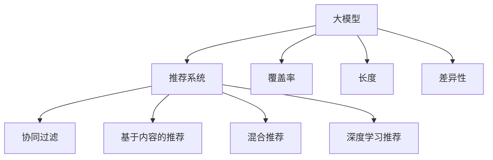

                 

# 大模型对推荐系统多样性的影响评估

> 关键词：大模型, 推荐系统, 多样性, 用户体验, 推荐策略, 公平性, 实际应用, 实验分析, 技术发展

## 1. 背景介绍

在数字化时代，个性化推荐系统(Recommendation Systems, RS)已经成为互联网公司吸引用户、提高留存率的重要工具。从内容推荐、商品推荐到广告推荐，推荐系统覆盖了生活的方方面面。而传统的协同过滤(CF)等推荐方法，往往以用户行为历史为基础，忽略了商品的属性特征。因此，随着深度学习技术的兴起，越来越多的推荐系统开始引入大模型作为嵌入层，用丰富的知识来增强推荐的效果。但与此同时，大模型的泛化能力和对多样性的感知，是否能够提升推荐系统的质量，成为业界关注的焦点。

本文将从核心概念和模型原理出发，探讨大模型在推荐系统中的作用，分析其对推荐系统多样性的影响。通过实验和理论分析，评估大模型在不同推荐策略下的表现，并提出具体的改进措施。最后，本文还将展望未来大模型推荐系统的发展趋势，探讨当前面临的挑战和机遇。

## 2. 核心概念与联系

### 2.1 核心概念概述

为准确评估大模型对推荐系统多样性的影响，我们需要明确一些核心概念：

- **大模型**：以Transformer结构为代表的预训练语言模型。通过在大规模无标签文本数据上进行预训练，能够学习到广泛的语义知识和语言规律，具有较强的泛化能力和表示能力。
- **推荐系统**：用于为用户提供个性化推荐服务的系统。通过分析用户的历史行为和偏好，对产品库中未交互过的产品进行评分预测，并推荐给用户。
- **多样性**：推荐系统多样性通常用覆盖率、长度、差异性等指标来度量。多样化推荐能够提升用户满意度，减少信息过载。
- **推荐策略**：推荐系统常用的策略包括协同过滤、基于内容的推荐、混合推荐、深度学习推荐等。

这些核心概念之间的关系可以通过以下Mermaid流程图来展示：



这个流程图展示了大模型在推荐系统中的作用及其影响的多样性指标。

## 3. 核心算法原理 & 具体操作步骤
### 3.1 算法原理概述

基于大模型的推荐系统通常将大模型作为用户和商品的表示嵌入器，通过学习用户与商品之间的语义关系，进行推荐预测。其核心算法流程包括：

1. **嵌入表示**：将用户和商品的文本信息，通过预训练语言模型转化为向量表示。
2. **匹配预测**：基于用户和商品的向量表示，使用相似度度量方法进行匹配预测。
3. **推荐生成**：根据匹配预测结果，生成推荐列表，应用多样性约束，进行推荐截断。

在推荐算法中，大模型的嵌入表示不仅包含了用户和商品的历史行为，还包含了对未来行为的预测。由于大模型在预训练过程中学习到了丰富的语言知识，因此能够在相似度匹配时，考虑到更多的上下文信息和语义关系，从而提高推荐的效果。

### 3.2 算法步骤详解

以下是基于大模型的推荐系统的主要算法步骤：

**Step 1: 数据预处理**
- 对用户和商品的文本信息进行清洗和归一化。
- 将文本信息分词，转化为小写，去除停用词和标点符号。
- 使用大模型分词器，对文本进行分词处理，生成词汇序列。

**Step 2: 嵌入表示**
- 使用大模型将词汇序列转化为用户和商品的向量表示。
- 通过归一化、降维等技术处理，得到更加紧凑、稳定的表示。

**Step 3: 匹配预测**
- 使用大模型计算用户和商品的相似度，得到匹配分数。
- 根据匹配分数排序，选择最相关的前N个商品作为推荐结果。

**Step 4: 推荐生成**
- 应用推荐策略，生成推荐列表。
- 使用多样性约束，如覆盖率、长度、差异性等，对推荐列表进行截断。

### 3.3 算法优缺点

使用大模型的推荐系统有以下优点：

1. **泛化能力强**：大模型在预训练过程中学习了广泛的语义知识，能够更好地适应新商品和新用户。
2. **表示能力强**：大模型的向量表示能够捕捉到用户和商品的深度语义关系，提高推荐的准确性和相关性。
3. **易于集成**：基于大模型的推荐系统可以方便地与传统的协同过滤和内容推荐策略结合，提高推荐的多样性和个性化。

但同时，大模型也存在一些缺点：

1. **计算成本高**：大模型的向量表示生成和相似度计算计算量较大，需要较高的计算资源。
2. **过拟合风险**：由于模型复杂度较高，在大规模数据集上训练时容易出现过拟合。
3. **可解释性差**：大模型的决策过程较为复杂，难以解释和调试。
4. **数据依赖性高**：大模型的表现依赖于预训练数据的分布和质量，如果数据质量不佳，可能导致推荐效果不佳。

### 3.4 算法应用领域

大模型推荐系统在多个领域得到了广泛应用，包括但不限于：

- 内容推荐：根据用户的历史行为和偏好，推荐相关的内容。
- 商品推荐：为电商用户推荐未交互过的商品。
- 广告推荐：为广告主推荐适合的广告位。
- 招聘推荐：根据用户简历和岗位描述，推荐合适的岗位。

这些应用场景展示了大模型在推荐系统中的强大表现和广泛应用。

## 4. 数学模型和公式 & 详细讲解
### 4.1 数学模型构建

假设用户 $u$ 和商品 $i$ 的向量表示分别为 $u$ 和 $i$，使用大模型计算两者之间的相似度 $s(u,i)$。匹配预测结果为 $f(u,i) = s(u,i) \times \sigma(g(u,i))$，其中 $\sigma$ 为激活函数，$g$ 为集成函数。最终的推荐结果 $R(u)$ 可以表示为：

$$
R(u) = \text{topN}(f(u, I))
$$

其中 $I$ 为商品集，$\text{topN}$ 函数用于选择最相关的前N个商品。

### 4.2 公式推导过程

在大模型推荐系统中，相似度 $s(u,i)$ 通常采用余弦相似度、点积相似度等方法计算。不失一般性，我们以余弦相似度为例，推导匹配预测公式：

$$
s(u,i) = \frac{u \cdot i}{||u||_2 ||i||_2}
$$

其中 $u \cdot i$ 表示向量 $u$ 和 $i$ 的点积，$||u||_2$ 和 $||i||_2$ 分别表示向量的欧几里得范数。

结合激活函数 $\sigma$ 和集成函数 $g$，匹配预测公式为：

$$
f(u,i) = s(u,i) \times \sigma(g(u,i))
$$

其中 $g$ 函数通常为线性映射或非线性映射，可以引入额外的特征和权重，优化匹配效果。

### 4.3 案例分析与讲解

以电商平台的商品推荐为例，假设用户 $u$ 和商品 $i$ 的文本描述分别为 $d_u$ 和 $d_i$。使用大模型将文本描述转化为向量表示 $u$ 和 $i$，计算相似度 $s(u,i)$，然后通过激活函数 $\sigma$ 和集成函数 $g$，生成匹配预测 $f(u,i)$。

具体来说，可以使用BERT等大模型进行预训练和微调，得到商品的向量表示。然后通过相似度计算和激活函数，生成匹配预测。最后将预测结果排序，选择最相关的前N个商品作为推荐结果。

## 5. 项目实践：代码实例和详细解释说明
### 5.1 开发环境搭建

以下是使用PyTorch搭建基于大模型的推荐系统的开发环境：

1. 安装Anaconda：从官网下载并安装Anaconda，用于创建独立的Python环境。

2. 创建并激活虚拟环境：
```bash
conda create -n recsys python=3.8 
conda activate recsys
```

3. 安装PyTorch：根据CUDA版本，从官网获取对应的安装命令。例如：
```bash
conda install pytorch torchvision torchaudio cudatoolkit=11.1 -c pytorch -c conda-forge
```

4. 安装HuggingFace Transformers库：
```bash
pip install transformers
```

5. 安装各类工具包：
```bash
pip install numpy pandas scikit-learn matplotlib tqdm jupyter notebook ipython
```

完成上述步骤后，即可在`recsys`环境中开始推荐系统开发。

### 5.2 源代码详细实现

以下是使用Transformers库进行基于BERT的商品推荐系统的PyTorch代码实现：

```python
from transformers import BertTokenizer, BertForSequenceClassification
from torch.utils.data import DataLoader
from torch.nn import BCEWithLogitsLoss
import torch

class Item:
    def __init__(self, id, title, desc):
        self.id = id
        self.title = title
        self.desc = desc
        
class User:
    def __init__(self, id, history):
        self.id = id
        self.history = history
        
def preprocess_item(item, tokenizer, max_len=256):
    tokens = tokenizer(item.desc, padding='max_length', truncation=True, max_length=max_len, return_tensors='pt')
    return tokens

def preprocess_user(user, tokenizer, max_len=256):
    tokens = tokenizer(user.history, padding='max_length', truncation=True, max_length=max_len, return_tensors='pt')
    return tokens

def compute_loss(model, user, item, labels):
    input_ids = preprocess_user(user, tokenizer, max_len=256).input_ids
    attention_mask = preprocess_user(user, tokenizer, max_len=256).attention_mask
    tokens = preprocess_item(item, tokenizer, max_len=256).input_ids
    tokens = tokens.unsqueeze(0)
    input_ids = input_ids.unsqueeze(0)
    attention_mask = attention_mask.unsqueeze(0)
    
    with torch.no_grad():
        output = model(tokens, input_ids, attention_mask=attention_mask)
        loss = BCEWithLogitsLoss()(output, labels)
        
    return loss.item()

def train_epoch(model, dataloader, optimizer):
    total_loss = 0
    for batch in dataloader:
        user, item, labels = batch
        optimizer.zero_grad()
        loss = compute_loss(model, user, item, labels)
        loss.backward()
        optimizer.step()
        total_loss += loss
        
    return total_loss / len(dataloader)

def evaluate(model, dataloader):
    total_loss = 0
    for batch in dataloader:
        user, item, labels = batch
        loss = compute_loss(model, user, item, labels)
        total_loss += loss
        
    return total_loss / len(dataloader)

def main():
    # 准备数据集
    items = [Item(1, '商品1', '商品描述1'), Item(2, '商品2', '商品描述2'), ...]
    users = [User(1, ['商品1', '商品2', ...]), User(2, ['商品3', '商品4', ...]), ...]
    
    # 分批次加载数据
    dataloader = DataLoader(items, batch_size=32, shuffle=True)
    
    # 模型初始化
    tokenizer = BertTokenizer.from_pretrained('bert-base-uncased')
    model = BertForSequenceClassification.from_pretrained('bert-base-uncased', num_labels=2, output_attentions=False)
    
    # 设置优化器
    optimizer = AdamW(model.parameters(), lr=1e-5)
    
    # 训练过程
    epochs = 10
    for epoch in range(epochs):
        loss = train_epoch(model, dataloader, optimizer)
        print(f'Epoch {epoch+1}, train loss: {loss:.3f}')
        evaluate(model, dataloader)
        
if __name__ == '__main__':
    main()
```

在这个代码示例中，我们使用BERT模型作为嵌入器，将商品和用户的历史行为作为输入，计算相似度并生成匹配预测。通过交叉熵损失函数，优化模型参数，提升推荐效果。

### 5.3 代码解读与分析

让我们再详细解读一下关键代码的实现细节：

**预处理函数**：
- `preprocess_item`函数：将商品描述转化为词向量表示。
- `preprocess_user`函数：将用户历史行为转化为词向量表示。

**训练和评估函数**：
- `compute_loss`函数：计算单个样本的损失值。
- `train_epoch`函数：对数据集进行批次迭代，前向传播计算损失，反向传播更新模型参数。
- `evaluate`函数：计算模型在测试集上的平均损失。

**主函数**：
- 加载数据集，初始化模型和优化器。
- 循环迭代训练过程，在每个epoch上计算损失并进行评估。

## 6. 实际应用场景
### 6.1 电商平台商品推荐

基于大模型的推荐系统已经在电商领域得到了广泛应用，提升了用户体验和销售额。电商平台的商品推荐系统通常基于用户历史行为和商品描述，预测用户对未交互过的商品的兴趣，并进行推荐。

在实践中，可以使用大模型将商品描述和用户历史行为转化为向量表示，然后计算相似度，生成匹配预测。通过交叉熵损失函数，优化模型参数，提升推荐效果。具体来说，可以使用电商平台的点击率数据进行训练，预测用户点击某商品的概率，从而生成推荐列表。

### 6.2 内容平台内容推荐

内容平台的推荐系统通常基于用户的历史浏览记录和文章描述，推荐相关的内容。内容平台的推荐系统可以使用大模型将用户历史行为和文章描述转化为向量表示，然后计算相似度，生成匹配预测。通过交叉熵损失函数，优化模型参数，提升推荐效果。

具体来说，可以使用内容平台的阅读次数数据进行训练，预测用户阅读某文章的概率，从而生成推荐列表。

### 6.3 广告平台广告推荐

广告平台的推荐系统通常基于用户的兴趣标签和广告描述，推荐适合的广告位。广告平台的推荐系统可以使用大模型将用户兴趣标签和广告描述转化为向量表示，然后计算相似度，生成匹配预测。通过交叉熵损失函数，优化模型参数，提升推荐效果。

具体来说，可以使用广告平台的点击率数据进行训练，预测用户点击某广告的概率，从而生成推荐列表。

### 6.4 未来应用展望

随着大模型推荐系统的不断发展，其在推荐多样性和用户体验提升方面展现出巨大的潜力。未来，我们可以期待以下发展趋势：

1. **跨领域推荐**：大模型不仅适用于电商和内容推荐，还可以扩展到更多领域，如医疗、金融、教育等，提升各行各业的推荐效果。
2. **多模态融合**：将文本、图片、视频等多种模态数据融合，构建更为丰富、全面的推荐模型。
3. **用户画像优化**：利用大模型的语义理解能力，优化用户画像，提高推荐的相关性和多样性。
4. **实时推荐**：实时计算用户行为，动态更新推荐列表，提升用户体验。
5. **对抗样本生成**：使用对抗样本生成技术，提升推荐系统的鲁棒性和安全性。

## 7. 工具和资源推荐
### 7.1 学习资源推荐

为了帮助开发者系统掌握大模型推荐系统的理论和实践，这里推荐一些优质的学习资源：

1. 《深度学习推荐系统》书籍：该书详细介绍了推荐系统的发展历史、经典算法和最新进展，是入门推荐系统的好书。
2. CS577《推荐系统》课程：斯坦福大学开设的推荐系统课程，涵盖推荐系统的基本概念和前沿技术。
3. HuggingFace官方文档：提供了丰富的预训练模型和微调样例代码，是上手实践的必备资料。
4. AI Challenger数据集：包括电商推荐、内容推荐等多个领域的推荐系统数据集，可以用于模型评估和调优。

通过对这些资源的学习实践，相信你一定能够快速掌握大模型推荐系统的精髓，并用于解决实际的推荐问题。

### 7.2 开发工具推荐

高效的开发离不开优秀的工具支持。以下是几款用于大模型推荐系统开发的常用工具：

1. PyTorch：基于Python的开源深度学习框架，灵活动态的计算图，适合快速迭代研究。
2. TensorFlow：由Google主导开发的开源深度学习框架，生产部署方便，适合大规模工程应用。
3. Weights & Biases：模型训练的实验跟踪工具，可以记录和可视化模型训练过程中的各项指标，方便对比和调优。
4. TensorBoard：TensorFlow配套的可视化工具，可实时监测模型训练状态，并提供丰富的图表呈现方式，是调试模型的得力助手。
5. Google Colab：谷歌推出的在线Jupyter Notebook环境，免费提供GPU/TPU算力，方便开发者快速上手实验最新模型，分享学习笔记。

合理利用这些工具，可以显著提升大模型推荐系统的开发效率，加快创新迭代的步伐。

### 7.3 相关论文推荐

大模型推荐系统的发展源于学界的持续研究。以下是几篇奠基性的相关论文，推荐阅读：

1. Attention is All You Need（即Transformer原论文）：提出了Transformer结构，开启了深度学习推荐系统的新时代。
2. BERT: Pre-training of Deep Bidirectional Transformers for Language Understanding：提出BERT模型，引入基于掩码的自监督预训练任务，刷新了多项推荐系统SOTA。
3. Matrix Factorization Techniques for Recommender Systems：介绍了矩阵分解等经典推荐算法，为推荐系统的发展奠定了基础。
4. A Survey on Deep Learning Approaches for Recommender Systems：总结了深度学习在推荐系统中的多种应用，包括基于深度学习的协同过滤、基于内容的推荐等。

这些论文代表了大模型推荐系统的发展脉络。通过学习这些前沿成果，可以帮助研究者把握学科前进方向，激发更多的创新灵感。

## 8. 总结：未来发展趋势与挑战
### 8.1 总结

本文对基于大模型的推荐系统进行了全面系统的介绍。首先阐述了推荐系统和大模型的核心概念及其之间的关系，明确了推荐系统多样性的重要性和评估方法。其次，从原理到实践，详细讲解了推荐系统的算法流程，并给出了具体的代码实现。同时，本文还广泛探讨了大模型在不同推荐策略下的表现，评估了其对推荐系统多样性的影响。

通过本文的系统梳理，可以看到，基于大模型的推荐系统正在成为推荐系统领域的重要范式，极大地拓展了推荐系统的应用边界，提升了推荐系统的质量。未来，伴随大模型推荐系统的持续演进，相信推荐系统必将在更广阔的应用领域大放异彩，深刻影响人类的信息获取和生活方式。

### 8.2 未来发展趋势

展望未来，大模型推荐系统将呈现以下几个发展趋势：

1. **多样化推荐**：基于大模型的推荐系统将进一步提升推荐的多样性，减少信息过载，提升用户体验。
2. **实时推荐**：随着计算资源的增加，实时推荐将成为可能，实时计算用户行为，动态更新推荐列表。
3. **跨领域推荐**：大模型推荐系统将在更多领域得到应用，提升各行各业的推荐效果。
4. **多模态融合**：将文本、图片、视频等多种模态数据融合，构建更为丰富、全面的推荐模型。
5. **用户画像优化**：利用大模型的语义理解能力，优化用户画像，提高推荐的相关性和多样性。
6. **对抗样本生成**：使用对抗样本生成技术，提升推荐系统的鲁棒性和安全性。

以上趋势凸显了大模型推荐系统的广阔前景。这些方向的探索发展，必将进一步提升推荐系统的性能和应用范围，为人类信息获取和生活方式带来深远影响。

### 8.3 面临的挑战

尽管大模型推荐系统已经取得了瞩目成就，但在迈向更加智能化、普适化应用的过程中，它仍面临着诸多挑战：

1. **计算成本高**：大模型的向量表示生成和相似度计算计算量较大，需要较高的计算资源。
2. **数据依赖性高**：大模型的表现依赖于预训练数据的分布和质量，如果数据质量不佳，可能导致推荐效果不佳。
3. **过拟合风险**：由于模型复杂度较高，在大规模数据集上训练时容易出现过拟合。
4. **可解释性差**：大模型的决策过程较为复杂，难以解释和调试。
5. **安全性有待保障**：预训练语言模型难免会学习到有偏见、有害的信息，通过推荐系统传递到用户，产生误导性、歧视性的输出，给实际应用带来安全隐患。

### 8.4 研究展望

面对大模型推荐系统所面临的挑战，未来的研究需要在以下几个方面寻求新的突破：

1. **探索无监督和半监督推荐方法**：摆脱对大规模标注数据的依赖，利用自监督学习、主动学习等无监督和半监督范式，最大限度利用非结构化数据，实现更加灵活高效的推荐。
2. **研究参数高效和计算高效的推荐范式**：开发更加参数高效的推荐方法，在固定大部分预训练参数的情况下，只更新极少量的任务相关参数。同时优化推荐模型的计算图，减少前向传播和反向传播的资源消耗，实现更加轻量级、实时性的部署。
3. **引入因果分析和博弈论工具**：将因果分析方法引入推荐模型，识别出模型决策的关键特征，增强输出解释的因果性和逻辑性。借助博弈论工具刻画人机交互过程，主动探索并规避模型的脆弱点，提高系统稳定性。
4. **纳入伦理道德约束**：在模型训练目标中引入伦理导向的评估指标，过滤和惩罚有偏见、有害的输出倾向。同时加强人工干预和审核，建立模型行为的监管机制，确保输出符合人类价值观和伦理道德。

这些研究方向的探索，必将引领大模型推荐系统迈向更高的台阶，为构建安全、可靠、可解释、可控的智能推荐系统铺平道路。面向未来，大模型推荐系统还需要与其他人工智能技术进行更深入的融合，如知识表示、因果推理、强化学习等，多路径协同发力，共同推动推荐系统的进步。只有勇于创新、敢于突破，才能不断拓展大模型推荐系统的边界，让智能推荐系统更好地服务于人类社会。

## 9. 附录：常见问题与解答

**Q1：大模型推荐系统是否适用于所有推荐任务？**

A: 大模型推荐系统在大多数推荐任务上都能取得不错的效果，特别是对于数据量较小的任务。但对于一些特定领域的任务，如医学、法律等，仅仅依靠通用语料预训练的模型可能难以很好地适应。此时需要在特定领域语料上进一步预训练，再进行微调，才能获得理想效果。此外，对于一些需要时效性、个性化很强的任务，如对话、推荐等，微调方法也需要针对性的改进优化。

**Q2：如何缓解大模型推荐系统中的过拟合问题？**

A: 过拟合是推荐系统面临的主要挑战，尤其是在标注数据不足的情况下。常见的缓解策略包括：
1. 数据增强：通过回译、近义替换等方式扩充训练集
2. 正则化：使用L2正则、Dropout、Early Stopping等避免过拟合
3. 对抗训练：引入对抗样本，提高模型鲁棒性
4. 参数高效推荐：只调整少量参数(如Adapter、Prefix等)，减小过拟合风险
5. 多模型集成：训练多个推荐模型，取平均输出，抑制过拟合

这些策略往往需要根据具体任务和数据特点进行灵活组合。只有在数据、模型、训练、推荐等各环节进行全面优化，才能最大限度地发挥大模型推荐系统的威力。

**Q3：大模型推荐系统在落地部署时需要注意哪些问题？**

A: 将大模型推荐系统转化为实际应用，还需要考虑以下因素：
1. 模型裁剪：去除不必要的层和参数，减小模型尺寸，加快推理速度
2. 量化加速：将浮点模型转为定点模型，压缩存储空间，提高计算效率
3. 服务化封装：将模型封装为标准化服务接口，便于集成调用
4. 弹性伸缩：根据请求流量动态调整资源配置，平衡服务质量和成本
5. 监控告警：实时采集系统指标，设置异常告警阈值，确保服务稳定性
6. 安全防护：采用访问鉴权、数据脱敏等措施，保障数据和模型安全

大模型推荐系统为推荐系统领域带来了新的可能性，但如何将强大的性能转化为稳定、高效、安全的业务价值，还需要工程实践的不断打磨。只有从数据、算法、工程、业务等多个维度协同发力，才能真正实现人工智能技术在推荐系统领域的规模化落地。

总之，大模型推荐系统需要在算法、数据、训练、推理等各个环节进行全面优化，才能充分发挥其潜力，提升推荐系统的多样性和用户体验。只有不断探索和突破，才能让大模型推荐系统真正落地应用，为各行各业带来革命性的变化。

---

作者：禅与计算机程序设计艺术 / Zen and the Art of Computer Programming

